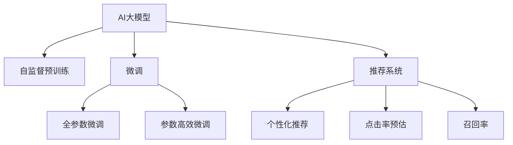

                 

# 电商搜索推荐效果优化中的AI大模型方法论

> 关键词：电商搜索、推荐系统、AI大模型、效果优化、深度学习、Transformer、自监督学习、迁移学习、推荐算法、个性化推荐

## 1. 背景介绍

### 1.1 问题由来
随着电子商务平台用户数量的激增，消费者对个性化推荐系统的需求日益增强。这些推荐系统旨在通过对用户行为数据的分析，推荐符合用户兴趣的商品，提升用户体验和平台转化率。传统的推荐系统依赖于手工设计的特征工程和规则算法，难以充分利用海量数据中隐藏的丰富用户行为模式，推荐效果有限。

近年来，随着深度学习技术的兴起，AI大模型在推荐系统中的应用成为热门话题。大模型基于海量数据进行预训练，学习到更抽象、更通用的用户行为特征，通过微调可以在特定领域取得优异的推荐效果。例如，Google的BERT模型被应用于电商搜索推荐系统，显著提升了推荐的相关性和个性化。

### 1.2 问题核心关键点
在电商搜索推荐系统中，大模型通过自监督预训练学习到通用的语言表示，然后通过微调学习特定领域的用户行为特征。以下是基于大模型的电商推荐系统优化的核心关键点：

- 自监督预训练：使用大规模无标签文本数据训练大模型，学习到通用的语言表示。
- 微调：通过下游任务的标注数据对大模型进行微调，学习特定领域的行为特征。
- 推荐算法：利用微调后的大模型，设计推荐算法生成个性化推荐结果。
- 效果评估：采用相关性、多样性、覆盖率等指标对推荐效果进行评估。

## 2. 核心概念与联系

### 2.1 核心概念概述

为更好地理解基于大模型的电商推荐系统优化方法，本节将介绍几个密切相关的核心概念：

- AI大模型：以自回归(如GPT)或自编码(如BERT)模型为代表的大规模预训练语言模型。通过在大规模无标签文本语料上进行预训练，学习通用的语言表示，具备强大的语言理解和生成能力。

- 自监督学习：指利用未标注的数据训练模型，通过设计巧妙的预测任务（如语言建模、掩码语言模型）学习到通用的语言表示。自监督学习依赖于大量无标签数据，避免了手工特征工程的繁琐和复杂。

- 迁移学习：指将一个领域学习到的知识，迁移应用到另一个不同但相关的领域的学习范式。大模型的预训练-微调过程即是一种典型的迁移学习方式。

- 推荐系统：根据用户的行为、兴趣、需求等信息，推荐用户可能感兴趣的商品或服务。推荐系统广泛应用于电商、社交网络、新闻推荐等领域。

- 个性化推荐：根据用户的历史行为和兴趣特征，推荐符合用户个性化需求的商品。个性化推荐能够显著提升用户体验和推荐效果。

- 点击率预估：通过模型预测用户点击商品的概率，用于评估推荐效果和优化推荐策略。

- 召回率：用于衡量推荐系统的覆盖能力，即推荐结果中包含用户感兴趣商品的百分比。

这些核心概念之间的逻辑关系可以通过以下Mermaid流程图来展示：



这个流程图展示了大模型的核心概念及其之间的关系：

1. 大模型通过自监督预训练获得基础能力。
2. 微调是对预训练模型进行任务特定的优化，可以分为全参数微调和参数高效微调。
3. 推荐系统利用微调后的大模型，生成个性化推荐结果。
4. 效果评估包括点击率预估和召回率等指标。

这些概念共同构成了基于大模型的电商推荐系统的学习和应用框架，使其能够更好地适应电商平台的个性化推荐需求。通过理解这些核心概念，我们可以更好地把握大模型在推荐系统中的应用场景和方法。

## 3. 核心算法原理 & 具体操作步骤
### 3.1 算法原理概述

基于大模型的电商推荐系统优化，本质上是一个迁移学习的过程。其核心思想是：将预训练的大模型视作一个强大的"特征提取器"，通过下游任务的标注数据对其进行微调，使得模型能够学习特定领域的行为特征，从而生成个性化推荐结果。

形式化地，假设预训练模型为 $M_{\theta}$，其中 $\theta$ 为预训练得到的模型参数。给定电商推荐系统任务 $T$ 的训练集 $D=\{(x_i, y_i)\}_{i=1}^N$，其中 $x_i$ 为用户行为数据，$y_i$ 为推荐结果。微调的目标是找到新的模型参数 $\hat{\theta}$，使得：

$$
\hat{\theta}=\mathop{\arg\min}_{\theta} \mathcal{L}(M_{\theta},D)
$$

其中 $\mathcal{L}$ 为针对任务 $T$ 设计的损失函数，用于衡量模型预测输出与真实标签之间的差异。常见的损失函数包括交叉熵损失、均方误差损失等。

通过梯度下降等优化算法，微调过程不断更新模型参数 $\theta$，最小化损失函数 $\mathcal{L}$，使得模型输出逼近真实标签。由于 $\theta$ 已经通过预训练获得了较好的初始化，因此即便在标注数据量较少的情况下，也能较快收敛到理想的模型参数 $\hat{\theta}$。

### 3.2 算法步骤详解

基于大模型的电商推荐系统优化一般包括以下几个关键步骤：

**Step 1: 准备预训练模型和数据集**
- 选择合适的预训练语言模型 $M_{\theta}$ 作为初始化参数，如 BERT、GPT 等。
- 准备电商推荐系统的训练集 $D$，划分为训练集、验证集和测试集。训练集应包含用户行为数据和对应的推荐结果。

**Step 2: 添加任务适配层**
- 根据任务类型，在预训练模型顶层设计合适的输出层和损失函数。
- 对于推荐任务，通常在顶层添加线性分类器和交叉熵损失函数。

**Step 3: 设置微调超参数**
- 选择合适的优化算法及其参数，如 AdamW、SGD 等，设置学习率、批大小、迭代轮数等。
- 设置正则化技术及强度，包括权重衰减、Dropout、Early Stopping 等。
- 确定冻结预训练参数的策略，如仅微调顶层，或全部参数都参与微调。

**Step 4: 执行梯度训练**
- 将训练集数据分批次输入模型，前向传播计算损失函数。
- 反向传播计算参数梯度，根据设定的优化算法和学习率更新模型参数。
- 周期性在验证集上评估模型性能，根据性能指标决定是否触发 Early Stopping。
- 重复上述步骤直到满足预设的迭代轮数或 Early Stopping 条件。

**Step 5: 测试和部署**
- 在测试集上评估微调后模型 $M_{\hat{\theta}}$ 的性能，对比微调前后的精度提升。
- 使用微调后的模型对新样本进行推理预测，集成到实际的应用系统中。
- 持续收集新的数据，定期重新微调模型，以适应数据分布的变化。

以上是基于大模型的电商推荐系统优化的完整流程。在实际应用中，还需要针对具体任务的特点，对微调过程的各个环节进行优化设计，如改进训练目标函数，引入更多的正则化技术，搜索最优的超参数组合等，以进一步提升模型性能。

### 3.3 算法优缺点

基于大模型的电商推荐系统优化方法具有以下优点：
1. 简单高效。只需准备少量标注数据，即可对预训练模型进行快速适配，生成个性化推荐结果。
2. 效果显著。大模型通过微调学习到特定领域的行为特征，可以显著提升推荐的相关性和个性化。
3. 参数高效。利用参数高效微调技术，在固定大部分预训练权重不变的情况下，仍可取得不错的微调效果。
4. 泛化能力强。大模型经过自监督预训练，具备更强的泛化能力，能够更好地适应不同的数据分布。

同时，该方法也存在一定的局限性：
1. 对标注数据依赖。微调的效果很大程度上取决于标注数据的质量和数量，获取高质量标注数据的成本较高。
2. 模型复杂度高。大规模语言模型参数量庞大，对计算资源和存储空间要求较高。
3. 可解释性不足。大模型的微调过程复杂，难以对其决策逻辑进行解释和调试。
4. 业务逻辑嵌入难度大。大模型的输出结果需要与电商推荐系统的业务逻辑进行深度融合，存在一定的嵌入难度。

尽管存在这些局限性，但就目前而言，基于大模型的电商推荐系统优化方法仍是大规模数据驱动推荐技术的重要范式。未来相关研究的重点在于如何进一步降低微调对标注数据的依赖，提高模型的少样本学习和跨领域迁移能力，同时兼顾可解释性和业务适用性等因素。

### 3.4 算法应用领域

基于大模型的电商推荐系统优化方法在电商推荐系统中的应用非常广泛，包括但不限于以下几个方面：

- 个性化推荐：利用大模型学习用户行为特征，生成个性化推荐结果。
- 商品相似度计算：通过学习用户对商品的态度和情感，计算商品之间的相似度。
- 用户画像构建：利用大模型分析用户行为数据，构建用户兴趣和偏好画像。
- 情感分析：通过分析用户评论和反馈，预测用户对商品的情感倾向。
- 内容推荐：基于用户兴趣推荐相关内容，如商品详情、用户评价等。
- 广告投放：根据用户行为和偏好，推荐相关广告，提升广告效果。
- 召回策略优化：通过学习用户行为数据，优化商品召回策略，提升推荐系统覆盖能力。

除了电商推荐系统，大模型在金融、医疗、娱乐等多个领域也有着广泛的应用前景，如金融风控、健康诊断、视频推荐等。随着预训练语言模型和微调方法的不断演进，相信大模型将会在更多领域发挥更大的作用，为各行各业带来变革性影响。

## 4. 数学模型和公式 & 详细讲解  
### 4.1 数学模型构建

本节将使用数学语言对基于大模型的电商推荐系统优化过程进行更加严格的刻画。

记预训练语言模型为 $M_{\theta}$，其中 $\theta$ 为预训练得到的模型参数。假设电商推荐系统的训练集为 $D=\{(x_i,y_i)\}_{i=1}^N, x_i \in \mathcal{X}, y_i \in \mathcal{Y}$。

定义模型 $M_{\theta}$ 在数据样本 $(x,y)$ 上的损失函数为 $\ell(M_{\theta}(x),y)$，则在数据集 $D$ 上的经验风险为：

$$
\mathcal{L}(\theta) = \frac{1}{N} \sum_{i=1}^N \ell(M_{\theta}(x_i),y_i)
$$

微调的优化目标是最小化经验风险，即找到最优参数：

$$
\theta^* = \mathop{\arg\min}_{\theta} \mathcal{L}(\theta)
$$

在实践中，我们通常使用基于梯度的优化算法（如SGD、Adam等）来近似求解上述最优化问题。设 $\eta$ 为学习率，$\lambda$ 为正则化系数，则参数的更新公式为：

$$
\theta \leftarrow \theta - \eta \nabla_{\theta}\mathcal{L}(\theta) - \eta\lambda\theta
$$

其中 $\nabla_{\theta}\mathcal{L}(\theta)$ 为损失函数对参数 $\theta$ 的梯度，可通过反向传播算法高效计算。

### 4.2 公式推导过程

以下我们以二分类任务为例，推导交叉熵损失函数及其梯度的计算公式。

假设模型 $M_{\theta}$ 在输入 $x$ 上的输出为 $\hat{y}=M_{\theta}(x) \in [0,1]$，表示用户点击商品的概率。真实标签 $y \in \{0,1\}$。则二分类交叉熵损失函数定义为：

$$
\ell(M_{\theta}(x),y) = -[y\log \hat{y} + (1-y)\log (1-\hat{y})]
$$

将其代入经验风险公式，得：

$$
\mathcal{L}(\theta) = -\frac{1}{N}\sum_{i=1}^N [y_i\log M_{\theta}(x_i)+(1-y_i)\log(1-M_{\theta}(x_i))]
$$

根据链式法则，损失函数对参数 $\theta_k$ 的梯度为：

$$
\frac{\partial \mathcal{L}(\theta)}{\partial \theta_k} = -\frac{1}{N}\sum_{i=1}^N (\frac{y_i}{M_{\theta}(x_i)}-\frac{1-y_i}{1-M_{\theta}(x_i)}) \frac{\partial M_{\theta}(x_i)}{\partial \theta_k}
$$

其中 $\frac{\partial M_{\theta}(x_i)}{\partial \theta_k}$ 可进一步递归展开，利用自动微分技术完成计算。

在得到损失函数的梯度后，即可带入参数更新公式，完成模型的迭代优化。重复上述过程直至收敛，最终得到适应电商推荐系统任务的最优模型参数 $\theta^*$。

## 5. 项目实践：代码实例和详细解释说明
### 5.1 开发环境搭建

在进行电商推荐系统优化实践前，我们需要准备好开发环境。以下是使用Python进行PyTorch开发的环境配置流程：

1. 安装Anaconda：从官网下载并安装Anaconda，用于创建独立的Python环境。

2. 创建并激活虚拟环境：
```bash
conda create -n pytorch-env python=3.8 
conda activate pytorch-env
```

3. 安装PyTorch：根据CUDA版本，从官网获取对应的安装命令。例如：
```bash
conda install pytorch torchvision torchaudio cudatoolkit=11.1 -c pytorch -c conda-forge
```

4. 安装Transformers库：
```bash
pip install transformers
```

5. 安装各类工具包：
```bash
pip install numpy pandas scikit-learn matplotlib tqdm jupyter notebook ipython
```

完成上述步骤后，即可在`pytorch-env`环境中开始电商推荐系统优化的实践。

### 5.2 源代码详细实现

下面我们以电商商品推荐任务为例，给出使用Transformers库对BERT模型进行微调的PyTorch代码实现。

首先，定义商品推荐任务的数据处理函数：

```python
from transformers import BertTokenizer
from torch.utils.data import Dataset
import torch

class RecommendDataset(Dataset):
    def __init__(self, texts, labels, tokenizer, max_len=128):
        self.texts = texts
        self.labels = labels
        self.tokenizer = tokenizer
        self.max_len = max_len
        
    def __len__(self):
        return len(self.texts)
    
    def __getitem__(self, item):
        text = self.texts[item]
        label = self.labels[item]
        
        encoding = self.tokenizer(text, return_tensors='pt', max_length=self.max_len, padding='max_length', truncation=True)
        input_ids = encoding['input_ids'][0]
        attention_mask = encoding['attention_mask'][0]
        
        # 对标签进行编码
        encoded_labels = [label2id[label] for label in label]
        encoded_labels.extend([label2id['O']] * (self.max_len - len(encoded_labels)))
        labels = torch.tensor(encoded_labels, dtype=torch.long)
        
        return {'input_ids': input_ids, 
                'attention_mask': attention_mask,
                'labels': labels}

# 标签与id的映射
label2id = {'O': 0, 'positive': 1}
id2label = {v: k for k, v in label2id.items()}

# 创建dataset
tokenizer = BertTokenizer.from_pretrained('bert-base-cased')

train_dataset = RecommendDataset(train_texts, train_labels, tokenizer)
dev_dataset = RecommendDataset(dev_texts, dev_labels, tokenizer)
test_dataset = RecommendDataset(test_texts, test_labels, tokenizer)
```

然后，定义模型和优化器：

```python
from transformers import BertForTokenClassification, AdamW

model = BertForTokenClassification.from_pretrained('bert-base-cased', num_labels=len(label2id))

optimizer = AdamW(model.parameters(), lr=2e-5)
```

接着，定义训练和评估函数：

```python
from torch.utils.data import DataLoader
from tqdm import tqdm
from sklearn.metrics import accuracy_score

device = torch.device('cuda') if torch.cuda.is_available() else torch.device('cpu')
model.to(device)

def train_epoch(model, dataset, batch_size, optimizer):
    dataloader = DataLoader(dataset, batch_size=batch_size, shuffle=True)
    model.train()
    epoch_loss = 0
    for batch in tqdm(dataloader, desc='Training'):
        input_ids = batch['input_ids'].to(device)
        attention_mask = batch['attention_mask'].to(device)
        labels = batch['labels'].to(device)
        model.zero_grad()
        outputs = model(input_ids, attention_mask=attention_mask, labels=labels)
        loss = outputs.loss
        epoch_loss += loss.item()
        loss.backward()
        optimizer.step()
    return epoch_loss / len(dataloader)

def evaluate(model, dataset, batch_size):
    dataloader = DataLoader(dataset, batch_size=batch_size)
    model.eval()
    preds, labels = [], []
    with torch.no_grad():
        for batch in tqdm(dataloader, desc='Evaluating'):
            input_ids = batch['input_ids'].to(device)
            attention_mask = batch['attention_mask'].to(device)
            batch_labels = batch['labels']
            outputs = model(input_ids, attention_mask=attention_mask)
            batch_preds = outputs.logits.argmax(dim=2).to('cpu').tolist()
            batch_labels = batch_labels.to('cpu').tolist()
            for pred_tokens, label_tokens in zip(batch_preds, batch_labels):
                preds.append(pred_tokens[:len(label_tokens)])
                labels.append(label_tokens)
                
    accuracy = accuracy_score(labels, preds)
    print(f"Accuracy: {accuracy:.2f}")
```

最后，启动训练流程并在测试集上评估：

```python
epochs = 5
batch_size = 16

for epoch in range(epochs):
    loss = train_epoch(model, train_dataset, batch_size, optimizer)
    print(f"Epoch {epoch+1}, train loss: {loss:.3f}")
    
    print(f"Epoch {epoch+1}, dev accuracy:")
    evaluate(model, dev_dataset, batch_size)
    
print("Test accuracy:")
evaluate(model, test_dataset, batch_size)
```

以上就是使用PyTorch对BERT进行电商商品推荐任务微调的完整代码实现。可以看到，得益于Transformers库的强大封装，我们可以用相对简洁的代码完成BERT模型的加载和微调。

### 5.3 代码解读与分析

让我们再详细解读一下关键代码的实现细节：

**RecommendDataset类**：
- `__init__`方法：初始化文本、标签、分词器等关键组件。
- `__len__`方法：返回数据集的样本数量。
- `__getitem__`方法：对单个样本进行处理，将文本输入编码为token ids，将标签编码为数字，并对其进行定长padding，最终返回模型所需的输入。

**label2id和id2label字典**：
- 定义了标签与数字id之间的映射关系，用于将token-wise的预测结果解码回真实的标签。

**训练和评估函数**：
- 使用PyTorch的DataLoader对数据集进行批次化加载，供模型训练和推理使用。
- 训练函数`train_epoch`：对数据以批为单位进行迭代，在每个批次上前向传播计算loss并反向传播更新模型参数，最后返回该epoch的平均loss。
- 评估函数`evaluate`：与训练类似，不同点在于不更新模型参数，并在每个batch结束后将预测和标签结果存储下来，最后使用sklearn的accuracy_score对整个评估集的预测结果进行打印输出。

**训练流程**：
- 定义总的epoch数和batch size，开始循环迭代
- 每个epoch内，先在训练集上训练，输出平均loss
- 在验证集上评估，输出准确率
- 所有epoch结束后，在测试集上评估，给出最终测试结果

可以看到，PyTorch配合Transformers库使得BERT微调的代码实现变得简洁高效。开发者可以将更多精力放在数据处理、模型改进等高层逻辑上，而不必过多关注底层的实现细节。

当然，工业级的系统实现还需考虑更多因素，如模型的保存和部署、超参数的自动搜索、更灵活的任务适配层等。但核心的微调范式基本与此类似。

## 6. 实际应用场景
### 6.1 电商搜索推荐

基于大模型的电商搜索推荐系统，可以大幅提升用户搜索体验和推荐效果。传统搜索推荐系统依赖于手工设计的查询扩展和过滤规则，无法充分理解用户查询的语义意图，推荐结果往往偏离用户真实需求。而使用微调后的大模型，可以更准确地解析用户查询，生成更相关的搜索结果。

在技术实现上，可以收集用户的历史搜索记录和点击行为数据，将其构建成监督数据，在此基础上对预训练模型进行微调。微调后的模型能够更精确地预测用户对搜索结果的点击行为，生成更符合用户需求的推荐结果。

### 6.2 个性化广告投放

电商平台的广告投放需要高效地匹配用户和广告，提升广告点击率和转化率。基于大模型的推荐系统，可以更全面地理解用户的兴趣和行为特征，通过优化广告推荐策略，提升广告投放效果。

具体而言，可以通过微调广告文本、商品图片等多模态数据，学习用户对广告的情感态度，生成个性化推荐列表。同时结合用户的历史行为数据，计算用户对各个广告的兴趣匹配度，最终生成精准的广告推荐结果。

### 6.3 商品补货和库存管理

电商平台的库存管理需要实时调整商品数量，以平衡库存成本和用户需求。基于大模型的推荐系统，可以更准确地预测用户的购买意向，优化商品补货策略，减少库存积压和缺货现象。

具体而言，可以收集用户的历史购买记录和浏览行为数据，训练微调模型预测用户的购买概率。通过分析预测结果，动态调整商品的库存量，满足用户需求的同时，降低库存成本。

### 6.4 未来应用展望

随着大模型和微调方法的不断发展，基于大模型的电商推荐系统将在更多领域得到应用，为电商平台带来更智能、更个性化的用户体验。

在智慧零售领域，大模型推荐系统可以与物联网设备、传感器等技术结合，实现基于位置、时间等多维度的智能推荐，提升零售业的运营效率和用户体验。

在智能物流领域，大模型推荐系统可以优化货物运输路线、库存管理等环节，提高物流效率和用户体验。

此外，在金融、医疗、旅游等多个领域，大模型推荐系统也有着广泛的应用前景，如金融风控、健康管理、旅游推荐等。

随着技术的不断进步，基于大模型的电商推荐系统必将在更多领域大放异彩，为各行各业带来变革性影响。

## 7. 工具和资源推荐
### 7.1 学习资源推荐

为了帮助开发者系统掌握大模型在电商推荐系统中的应用，这里推荐一些优质的学习资源：

1. 《Transformers from Zero to Hero》系列博文：由大模型技术专家撰写，深入浅出地介绍了Transformer原理、BERT模型、微调技术等前沿话题。

2. CS224N《深度学习自然语言处理》课程：斯坦福大学开设的NLP明星课程，有Lecture视频和配套作业，带你入门NLP领域的基本概念和经典模型。

3. 《Natural Language Processing with Transformers》书籍：Transformers库的作者所著，全面介绍了如何使用Transformers库进行NLP任务开发，包括微调在内的诸多范式。

4. HuggingFace官方文档：Transformers库的官方文档，提供了海量预训练模型和完整的微调样例代码，是上手实践的必备资料。

5. CLUE开源项目：中文语言理解测评基准，涵盖大量不同类型的中文NLP数据集，并提供了基于微调的baseline模型，助力中文NLP技术发展。

通过对这些资源的学习实践，相信你一定能够快速掌握大模型在电商推荐系统中的应用，并用于解决实际的电商推荐问题。

### 7.2 开发工具推荐

高效的开发离不开优秀的工具支持。以下是几款用于大模型在电商推荐系统中的应用开发的常用工具：

1. PyTorch：基于Python的开源深度学习框架，灵活动态的计算图，适合快速迭代研究。大部分预训练语言模型都有PyTorch版本的实现。

2. TensorFlow：由Google主导开发的开源深度学习框架，生产部署方便，适合大规模工程应用。同样有丰富的预训练语言模型资源。

3. Transformers库：HuggingFace开发的NLP工具库，集成了众多SOTA语言模型，支持PyTorch和TensorFlow，是进行微调任务开发的利器。

4. Weights & Biases：模型训练的实验跟踪工具，可以记录和可视化模型训练过程中的各项指标，方便对比和调优。与主流深度学习框架无缝集成。

5. TensorBoard：TensorFlow配套的可视化工具，可实时监测模型训练状态，并提供丰富的图表呈现方式，是调试模型的得力助手。

6. Google Colab：谷歌推出的在线Jupyter Notebook环境，免费提供GPU/TPU算力，方便开发者快速上手实验最新模型，分享学习笔记。

合理利用这些工具，可以显著提升大模型在电商推荐系统中的应用效率，加快创新迭代的步伐。

### 7.3 相关论文推荐

大模型和微调技术的发展源于学界的持续研究。以下是几篇奠基性的相关论文，推荐阅读：

1. Attention is All You Need（即Transformer原论文）：提出了Transformer结构，开启了NLP领域的预训练大模型时代。

2. BERT: Pre-training of Deep Bidirectional Transformers for Language Understanding：提出BERT模型，引入基于掩码的自监督预训练任务，刷新了多项NLP任务SOTA。

3. Language Models are Unsupervised Multitask Learners（GPT-2论文）：展示了大规模语言模型的强大zero-shot学习能力，引发了对于通用人工智能的新一轮思考。

4. Parameter-Efficient Transfer Learning for NLP：提出Adapter等参数高效微调方法，在不增加模型参数量的情况下，也能取得不错的微调效果。

5. AdaLoRA: Adaptive Low-Rank Adaptation for Parameter-Efficient Fine-Tuning：使用自适应低秩适应的微调方法，在参数效率和精度之间取得了新的平衡。

6. Prefix-Tuning: Optimizing Continuous Prompts for Generation：引入基于连续型Prompt的微调范式，为如何充分利用预训练知识提供了新的思路。

这些论文代表了大模型和微调技术的发展脉络。通过学习这些前沿成果，可以帮助研究者把握学科前进方向，激发更多的创新灵感。

## 8. 总结：未来发展趋势与挑战
### 8.1 总结

本文对基于大模型的电商推荐系统优化方法进行了全面系统的介绍。首先阐述了大模型和微调技术在电商推荐系统中的应用背景和意义，明确了微调在提升电商推荐系统效果、个性化程度和用户体验方面的独特价值。其次，从原理到实践，详细讲解了基于大模型的电商推荐系统优化的数学原理和关键步骤，给出了电商商品推荐任务的完整代码实例。同时，本文还广泛探讨了基于大模型的电商推荐系统在电商搜索、个性化广告投放、商品补货等方面的应用前景，展示了微调范式的巨大潜力。此外，本文精选了电商推荐系统相关的学习资源，力求为读者提供全方位的技术指引。

通过本文的系统梳理，可以看到，基于大模型的电商推荐系统优化方法在电商推荐系统中的应用场景广泛，效果显著。大模型通过微调学习到特定领域的行为特征，可以显著提升推荐的相关性和个性化。未来，伴随大模型和微调方法的持续演进，基于大模型的电商推荐系统必将在更多领域大放异彩，为电商平台带来更智能、更个性化的用户体验。

### 8.2 未来发展趋势

展望未来，基于大模型的电商推荐系统优化技术将呈现以下几个发展趋势：

1. 模型规模持续增大。随着算力成本的下降和数据规模的扩张，预训练语言模型的参数量还将持续增长。超大规模语言模型蕴含的丰富语言知识，有望支撑更加复杂多变的电商推荐系统优化任务。

2. 微调方法日趋多样。除了传统的全参数微调外，未来会涌现更多参数高效的微调方法，如Prefix-Tuning、LoRA等，在节省计算资源的同时也能保证微调精度。

3. 持续学习成为常态。随着电商用户行为的不断变化，推荐系统需要持续学习新知识以保持性能。如何在不遗忘原有知识的同时，高效吸收新样本信息，将成为重要的研究课题。

4. 标注样本需求降低。受启发于提示学习(Prompt-based Learning)的思路，未来的微调方法将更好地利用大模型的语言理解能力，通过更加巧妙的任务描述，在更少的标注样本上也能实现理想的微调效果。

5. 标注样本需求降低。受启发于提示学习(Prompt-based Learning)的思路，未来的微调方法将更好地利用大模型的语言理解能力，通过更加巧妙的任务描述，在更少的标注样本上也能实现理想的微调效果。

6. 多模态微调崛起。当前的微调主要聚焦于纯文本数据，未来会进一步拓展到图像、视频、语音等多模态数据微调。多模态信息的融合，将显著提升电商推荐系统的表现能力。

以上趋势凸显了大模型在电商推荐系统中的应用前景。这些方向的探索发展，必将进一步提升电商推荐系统的性能和应用范围，为电商平台的业务发展提供更强的技术支持。

### 8.3 面临的挑战

尽管基于大模型的电商推荐系统优化技术已经取得了瞩目成就，但在迈向更加智能化、普适化应用的过程中，它仍面临着诸多挑战：

1. 标注成本瓶颈。虽然微调大大降低了标注数据的需求，但对于长尾应用场景，难以获得充足的高质量标注数据，成为制约微调性能的瓶颈。如何进一步降低微调对标注样本的依赖，将是一大难题。

2. 模型鲁棒性不足。当前微调模型面对域外数据时，泛化性能往往大打折扣。对于测试样本的微小扰动，微调模型的预测也容易发生波动。如何提高微调模型的鲁棒性，避免灾难性遗忘，还需要更多理论和实践的积累。

3. 推理效率有待提高。大规模语言模型虽然精度高，但在实际部署时往往面临推理速度慢、内存占用大等效率问题。如何在保证性能的同时，简化模型结构，提升推理速度，优化资源占用，将是重要的优化方向。

4. 可解释性亟需加强。当前微调模型更像是"黑盒"系统，难以解释其内部工作机制和决策逻辑。对于电商推荐系统这样的高风险应用，算法的可解释性和可审计性尤为重要。如何赋予微调模型更强的可解释性，将是亟待攻克的难题。

5. 业务逻辑嵌入难度大。大模型的输出结果需要与电商推荐系统的业务逻辑进行深度融合，存在一定的嵌入难度。如何设计有效的接口和管道，使得大模型输出的推荐结果能够无缝集成到电商推荐系统，是实现技术落地的关键。

尽管存在这些挑战，但大模型在电商推荐系统中的应用前景依然广阔。随着技术的不断进步，相信基于大模型的电商推荐系统必将在更多领域大放异彩，为电商平台带来更智能、更个性化的用户体验。

### 8.4 研究展望

面向未来，大模型在电商推荐系统中的应用还需要在以下几个方面寻求新的突破：

1. 探索无监督和半监督微调方法。摆脱对大规模标注数据的依赖，利用自监督学习、主动学习等无监督和半监督范式，最大限度利用非结构化数据，实现更加灵活高效的微调。

2. 研究参数高效和计算高效的微调范式。开发更加参数高效的微调方法，在固定大部分预训练参数的同时，只更新极少量的任务相关参数。同时优化微调模型的计算图，减少前向传播和反向传播的资源消耗，实现更加轻量级、实时性的部署。

3. 引入更多先验知识。将符号化的先验知识，如知识图谱、逻辑规则等，与神经网络模型进行巧妙融合，引导微调过程学习更准确、合理的语言模型。同时加强不同模态数据的整合，实现视觉、语音等多模态信息与文本信息的协同建模。

4. 结合因果分析和博弈论工具。将因果分析方法引入微调模型，识别出模型决策的关键特征，增强输出解释的因果性和逻辑性。借助博弈论工具刻画人机交互过程，主动探索并规避模型的脆弱点，提高系统稳定性。

5. 纳入伦理道德约束。在模型训练目标中引入伦理导向的评估指标，过滤和惩罚有偏见、有害的输出倾向。同时加强人工干预和审核，建立模型行为的监管机制，确保输出符合人类价值观和伦理道德。

这些研究方向的探索，必将引领大模型在电商推荐系统中的应用进入新的阶段，为电商平台带来更智能、更个性化的用户体验。面向未来，大模型推荐系统还需要与其他人工智能技术进行更深入的融合，如知识表示、因果推理、强化学习等，多路径协同发力，共同推动电商推荐系统的进步。只有勇于创新、敢于突破，才能不断拓展大模型在电商推荐系统中的应用边界，让智能技术更好地造福电商平台和广大用户。

## 9. 附录：常见问题与解答

**Q1：大模型在电商推荐系统中的应用前景如何？**

A: 大模型在电商推荐系统中的应用前景非常广阔。通过自监督预训练学习到通用的语言表示，再通过微调学习特定领域的用户行为特征，能够生成更相关、更个性化的推荐结果。大模型可以应用于电商搜索推荐、个性化广告投放、商品补货和库存管理等多个环节，提升电商平台的运营效率和用户体验。

**Q2：如何提高大模型在电商推荐系统中的鲁棒性？**

A: 提高大模型在电商推荐系统中的鲁棒性需要从多个方面入手：
1. 数据增强：通过对训练样本进行回译、改写等方式，丰富训练集的多样性，提高模型的泛化能力。
2. 正则化：使用L2正则、Dropout等技术，防止模型过拟合，提高鲁棒性。
3. 对抗训练：引入对抗样本，增强模型对输入扰动的鲁棒性。
4. 多模型集成：通过训练多个微调模型，取平均输出，抑制过拟合，提高鲁棒性。
5. 参数高效微调：只调整少量参数，保持大部分预训练权重不变，减小鲁棒性损失。

**Q3：如何在大模型推荐系统中实现多模态融合？**

A: 在大模型推荐系统中实现多模态融合，可以采用以下策略：
1. 多模态编码：将不同模态的数据（如文本、图像、语音等）编码成通用的向量表示，然后输入到同一模型中进行微调。
2. 融合损失函数：设计合适的融合损失函数，将不同模态的输出进行加权或堆叠，最终生成推荐结果。
3. 跨模态对齐：通过学习不同模态之间的映射关系，将不同模态的数据进行对齐，提高融合效果。
4. 多模态预训练：在大模型预训练阶段，同时考虑不同模态的数据，学习多模态的通用表示。
5. 多模态交互：通过构建多模态交互模块，如视觉-文本融合网络，实现不同模态的协同作用。

这些策略需要根据具体任务和数据特点进行选择和组合，才能在大模型推荐系统中实现良好的多模态融合效果。

**Q4：大模型在电商推荐系统中的可解释性问题如何解决？**

A: 大模型在电商推荐系统中的可解释性问题可以通过以下方法解决：
1. 可解释性模块：在大模型中加入可解释性模块，如LIME、SHAP等，通过局部近似和特征重要性计算，解释模型的预测过程。
2. 透明化模型架构：将大模型的架构透明化，公开模型各层的输出和权重，帮助用户理解模型的决策机制。
3. 模型可视化和调试：利用TensorBoard等工具，可视化模型训练和推理过程，帮助开发者调试和优化模型。
4. 用户反馈机制：建立用户反馈机制，收集用户对推荐结果的反馈，持续改进模型。
5. 可视化推荐结果：通过可视化推荐结果，如展示推荐商品的特征、相似商品等，增强用户对推荐结果的理解和信任。

通过这些方法，可以显著提高大模型在电商推荐系统中的可解释性，增强用户对推荐结果的信任和满意度。

**Q5：大模型推荐系统在电商搜索推荐中的应用有哪些？**

A: 大模型推荐系统在电商搜索推荐中的应用广泛，具体包括：
1. 商品相似度计算：通过学习用户对商品的态度和情感，计算商品之间的相似度，提升搜索结果的相关性。
2. 用户意图识别：通过解析用户查询，识别用户的意图，生成精准的搜索结果。
3. 推荐列表排序：根据用户的行为和偏好，生成个性化的推荐列表，提升用户满意度。
4. 广告推荐：结合用户的行为数据和兴趣特征，推荐符合用户需求的商品广告，提升广告效果。
5. 搜索结果过滤：根据用户的反馈和行为，动态调整搜索结果的过滤策略，提高搜索结果的个性化和准确性。

通过这些应用，大模型推荐系统能够显著提升电商平台的搜索推荐效果，提升用户体验和平台转化率。

---

作者：禅与计算机程序设计艺术 / Zen and the Art of Computer Programming

