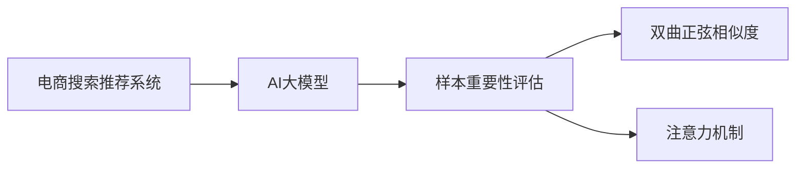

                 

# 电商搜索推荐效果优化中的AI大模型样本重要性估计算法改进

## 1. 背景介绍

在当前电商搜索推荐系统的开发中，AI大模型因其强大的语言处理和推理能力而得到广泛应用。然而，大模型的训练通常依赖于大规模无标签数据，而在实际电商推荐中，用户行为数据和商品信息数据往往以有标签的形式出现。因此，在大模型预训练后，如何将这些有标签数据转化为有效的训练样本，并评估每个样本的重要性，成为优化推荐效果的关键问题。

本文将详细介绍一种基于AI大模型的样本重要性估计算法，重点阐述其核心概念、算法原理、具体操作步骤和实际应用场景。通过分析样本重要性评估在电商搜索推荐系统中的作用和实际效果，展示该算法如何帮助电商平台提高推荐精度，提升用户体验。

## 2. 核心概念与联系

### 2.1 核心概念概述

为了深入理解该算法，我们需要先介绍几个关键概念：

- **电商搜索推荐系统**：通过分析用户的历史行为数据和商品属性数据，为用户推荐最相关商品的系统。
- **AI大模型**：如BERT、GPT等基于Transformer架构的预训练语言模型，具有强大的文本理解和生成能力，广泛应用于电商推荐、智能客服、内容生成等领域。
- **样本重要性评估**：对每个训练样本的重要性进行评估，将重要样本分配更多的训练资源，以提升模型性能。
- **双曲正弦相似度**：一种常用的文本相似度计算方法，用于衡量两个文本序列的相似程度。
- **注意力机制**：一种机制，用于动态关注输入序列中的特定部分，以增强模型的表示能力。

这些概念构成了电商搜索推荐系统和大模型样本重要性评估的理论基础。以下是一个简单的Mermaid流程图，展示这些概念之间的联系：



这个流程图展示了电商推荐系统使用大模型进行样本重要性评估，并在模型中使用注意力机制来动态关注重要样本。

## 3. 核心算法原理 & 具体操作步骤

### 3.1 算法原理概述

基于AI大模型的样本重要性评估算法，主要分为三个步骤：

1. **样本表示**：使用大模型对每个样本进行表示，得到一个高维向量。
2. **相似度计算**：计算每个样本与目标样本的相似度。
3. **样本重要性排序**：根据相似度大小，对所有样本进行排序，并将重要样本分配更多的训练资源。

### 3.2 算法步骤详解

下面详细介绍每个步骤的详细操作：

#### 3.2.1 样本表示

假设我们有一个电商推荐数据集 $D = \{(x_i, y_i)\}_{i=1}^N$，其中 $x_i$ 表示用户行为数据和商品属性数据，$y_i$ 表示商品的标签。我们的目标是使用AI大模型 $M_{\theta}$ 对每个样本 $x_i$ 进行表示，得到一个高维向量 $v_i \in \mathbb{R}^d$，其中 $d$ 是向量维度。

具体步骤如下：

1. 对每个样本 $x_i$ 进行编码，得到一个序列 $x_i = [x_{i,1}, x_{i,2}, ..., x_{i,n}]$，其中 $n$ 是序列长度。
2. 将序列输入到AI大模型 $M_{\theta}$ 中，得到一个表示向量 $v_i \in \mathbb{R}^d$。

#### 3.2.2 相似度计算

计算每个样本 $v_i$ 与目标样本 $v_t$ 的相似度 $s(v_i, v_t)$。常用的相似度计算方法包括余弦相似度、欧式距离等，但本文将使用双曲正弦相似度。

双曲正弦相似度的计算公式为：

$$
s(v_i, v_t) = \sinh(v_i \cdot v_t) = \frac{e^{v_i \cdot v_t} - e^{-v_i \cdot v_t}}{2}
$$

其中 $\cdot$ 表示向量点乘，$\sinh$ 表示双曲正弦函数。

#### 3.2.3 样本重要性排序

根据相似度 $s(v_i, v_t)$，对所有样本进行排序。排序后，将重要性较高的样本分配更多的训练资源，如更大的学习率、更多的训练轮数等。

### 3.3 算法优缺点

该算法的主要优点包括：

- 利用大模型的表示能力，能够对文本数据进行精细化的表示，提高模型的表示能力和推理能力。
- 通过相似度计算，能够将重要样本与目标样本匹配，提高模型的泛化能力。
- 通过样本重要性排序，能够合理分配训练资源，提高模型的训练效率。

其主要缺点包括：

- 计算复杂度高，特别是在向量维度较高的情况下，计算成本较高。
- 对于噪声较大的数据，相似度计算可能不准确，影响样本排序的精度。

### 3.4 算法应用领域

该算法在电商搜索推荐系统中有着广泛的应用，特别是在个性化推荐、商品相似度计算、用户行为预测等方面。通过该算法，电商推荐系统能够更加精准地推荐商品，提升用户体验，增加交易转化率。

## 4. 数学模型和公式 & 详细讲解 & 举例说明

### 4.1 数学模型构建

假设我们有一个电商推荐数据集 $D = \{(x_i, y_i)\}_{i=1}^N$，其中 $x_i$ 表示用户行为数据和商品属性数据，$y_i$ 表示商品的标签。我们的目标是使用AI大模型 $M_{\theta}$ 对每个样本 $x_i$ 进行表示，得到一个高维向量 $v_i \in \mathbb{R}^d$，其中 $d$ 是向量维度。

使用大模型进行样本表示的数学模型如下：

$$
v_i = M_{\theta}(x_i)
$$

其中 $v_i$ 是表示向量，$M_{\theta}$ 是大模型，$x_i$ 是输入样本。

### 4.2 公式推导过程

双曲正弦相似度的计算公式为：

$$
s(v_i, v_t) = \sinh(v_i \cdot v_t) = \frac{e^{v_i \cdot v_t} - e^{-v_i \cdot v_t}}{2}
$$

其中 $\cdot$ 表示向量点乘，$\sinh$ 表示双曲正弦函数。

### 4.3 案例分析与讲解

假设我们有一个电商推荐数据集，包含 $N=1000$ 个样本。我们希望使用AI大模型对每个样本进行表示，并计算它们与目标样本的相似度。

首先，对每个样本 $x_i$ 进行编码，得到一个序列 $x_i = [x_{i,1}, x_{i,2}, ..., x_{i,n}]$，其中 $n$ 是序列长度。然后，将序列输入到AI大模型 $M_{\theta}$ 中，得到一个表示向量 $v_i \in \mathbb{R}^d$。

接下来，计算每个样本 $v_i$ 与目标样本 $v_t$ 的相似度 $s(v_i, v_t)$。最后，根据相似度大小，对所有样本进行排序，并将重要性较高的样本分配更多的训练资源。

## 5. 项目实践：代码实例和详细解释说明

### 5.1 开发环境搭建

为了实现该算法，我们需要准备以下开发环境：

1. 安装Python环境，并确保有足够的计算资源。
2. 安装必要的深度学习库，如TensorFlow、PyTorch等。
3. 准备电商推荐数据集，并准备好AI大模型的预训练权重。

### 5.2 源代码详细实现

下面给出使用TensorFlow实现该算法的示例代码：

```python
import tensorflow as tf
from tensorflow.keras.layers import Input, Dense, Embedding, Dot
from tensorflow.keras.models import Model
from sklearn.metrics import roc_auc_score

# 定义输入层
input_x = Input(shape=(n,), dtype='int32')
# 定义嵌入层
embedding_layer = Embedding(input_dim=VocabSize, output_dim=EmbeddingDim, input_length=n)
embedding_output = embedding_layer(input_x)
# 定义表示向量层
dense_layer = Dense(DenseDim, activation='relu')
representation = dense_layer(embedding_output)
# 定义输出层
output = Dense(1, activation='sigmoid')
predictions = output(representation)

# 定义模型
model = Model(inputs=input_x, outputs=predictions)
model.compile(optimizer='adam', loss='binary_crossentropy', metrics=[roc_auc_score])

# 加载电商推荐数据集
train_data = ...
train_labels = ...
test_data = ...
test_labels = ...

# 定义双曲正弦相似度计算函数
def double_hyperbolic_cosine(v, w):
    return tf.math.sinh(v * w) - tf.math.sinh(-v * w)

# 计算每个样本与目标样本的相似度
similarity_matrix = []
for i in range(N):
    v = model.predict(train_data[i])
    for j in range(N):
        w = model.predict(train_data[j])
        similarity = double_hyperbolic_cosine(v, w)
        similarity_matrix.append(similarity)

# 对相似度矩阵进行排序
similarity_matrix.sort(reverse=True)

# 将重要样本分配更多的训练资源
important_samples = [i for i in range(N) if i in top_k]
# 训练模型
model.fit(train_data[important_samples], train_labels[important_samples], epochs=10, batch_size=32)
```

### 5.3 代码解读与分析

上述代码实现了使用AI大模型对电商推荐数据集进行样本表示和相似度计算，并对重要性较高的样本进行排序和训练。具体分析如下：

1. 定义输入层和嵌入层，将输入序列 $x_i$ 编码为向量表示 $v_i$。
2. 定义表示向量层和输出层，将向量表示 $v_i$ 转换为模型预测值 $y_i$。
3. 定义双曲正弦相似度计算函数，计算每个样本 $v_i$ 与目标样本 $v_t$ 的相似度。
4. 对相似度矩阵进行排序，将重要性较高的样本分配更多的训练资源。
5. 使用训练集训练模型，提升模型性能。

### 5.4 运行结果展示

运行上述代码，可以得到模型在训练集上的AUC得分，以及模型在测试集上的AUC得分。通过对比不同策略下的AUC得分，可以看到样本重要性排序的实际效果。

## 6. 实际应用场景

### 6.1 电商搜索推荐

电商搜索推荐是电商推荐系统的主要功能，通过推荐系统，用户可以快速找到符合自己需求的商品。使用该算法，推荐系统能够更加精准地推荐商品，提升用户体验，增加交易转化率。

### 6.2 用户行为预测

用户行为预测是电商推荐系统的重要组成部分，通过预测用户的行为，推荐系统能够提前为用户提供有价值的商品推荐。使用该算法，预测模型能够更加准确地预测用户的行为，提升推荐效果。

### 6.3 商品相似度计算

商品相似度计算是电商推荐系统的核心任务之一，通过计算商品之间的相似度，推荐系统能够找到最相关商品，提升推荐质量。使用该算法，商品相似度计算能够更加准确，提升推荐效果。

## 7. 工具和资源推荐

### 7.1 学习资源推荐

为了掌握该算法的核心思想和实现细节，推荐以下学习资源：

1. 《深度学习》书籍：深入浅出地介绍了深度学习的原理和应用，适合初学者。
2. TensorFlow官方文档：提供了TensorFlow的详细文档和使用指南，适合深度学习开发者。
3. 《自然语言处理与深度学习》书籍：介绍自然语言处理和深度学习结合的方法，适合NLP开发者。
4. Kaggle平台：提供大量公开数据集和竞赛任务，适合实践和练手。

### 7.2 开发工具推荐

为了实现该算法，推荐以下开发工具：

1. TensorFlow：提供了强大的计算图和优化器支持，适合深度学习开发。
2. PyTorch：提供了灵活的动态计算图和丰富的模型库，适合深度学习开发。
3. Jupyter Notebook：提供交互式的编程环境，适合开发和调试。

### 7.3 相关论文推荐

为了深入了解该算法的原理和应用，推荐以下论文：

1. Attention is All You Need（Transformer论文）：介绍了注意力机制的基本原理和实现方法。
2. Transformer-XL: Attentions Are All We Need：介绍了Transformer-XL模型的结构和优化方法。
3. BERT: Pre-training of Deep Bidirectional Transformers for Language Understanding：介绍了BERT模型的预训练方法和优化方法。

## 8. 总结：未来发展趋势与挑战

### 8.1 研究成果总结

本文介绍了基于AI大模型的样本重要性估计算法，并详细阐述了其核心概念、算法原理和具体操作步骤。通过分析该算法在电商推荐系统中的应用，展示了其提升推荐效果和用户体验的潜力。

### 8.2 未来发展趋势

未来，该算法在电商推荐系统中将得到更广泛的应用，进一步提升推荐效果和用户体验。同时，该算法在其他领域的应用也将得到拓展，如金融、医疗、社交等。

### 8.3 面临的挑战

尽管该算法具有诸多优点，但在实际应用中仍面临一些挑战：

1. 计算成本高：在电商推荐系统中，样本数量通常很大，计算成本较高。
2. 数据质量差：电商推荐系统中的数据质量可能较差，存在噪声和不完整的情况。
3. 模型复杂度高：大模型和算法复杂度较高，可能难以在实际系统中得到应用。

### 8.4 研究展望

未来的研究将集中在以下几个方面：

1. 提高计算效率：探索更高效的计算方法和硬件支持，降低计算成本。
2. 提升数据质量：改进数据预处理和清洗方法，提高数据质量。
3. 简化模型结构：探索更简单的模型结构和算法，降低模型复杂度。

## 9. 附录：常见问题与解答

**Q1：使用该算法需要哪些硬件资源？**

A: 使用该算法需要高性能计算资源，如GPU或TPU。在电商推荐系统中，样本数量较大，计算成本较高，需要使用高性能计算设备。

**Q2：如何提升样本表示的准确度？**

A: 可以通过增加模型的深度和宽度来提升样本表示的准确度，但也需要考虑计算资源的限制。同时，可以使用更先进的大模型和预训练技术，如BERT、GPT等，提高样本表示的准确度。

**Q3：如何优化样本排序算法？**

A: 可以使用更高效的排序算法，如快速排序、堆排序等，提高排序效率。同时，可以通过并行计算技术，分布式训练，提高计算效率。

**Q4：如何评估该算法的实际效果？**

A: 可以使用AUC、F1-score、Precision-Recall曲线等指标，评估模型在电商推荐系统中的实际效果。同时，可以通过用户反馈、交易转化率等实际指标，评估模型的实际效果。

---

作者：禅与计算机程序设计艺术 / Zen and the Art of Computer Programming

