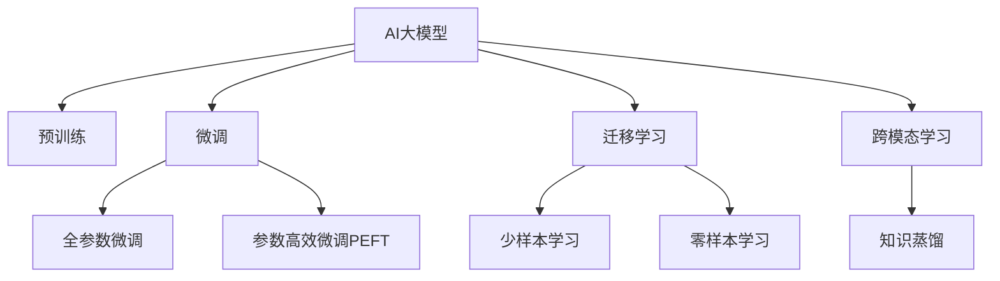

                 

# 电商搜索的下一个前沿：AI大模型的应用

## 1. 背景介绍

随着互联网的蓬勃发展，电商搜索系统成为支撑电子商务平台的重要组成部分。传统的电商搜索系统依赖于简单的关键字匹配和算法优化，难以满足用户复杂多变的搜索需求。近年来，随着人工智能(AI)技术的不断进步，AI大模型开始在电商搜索领域大放异彩，带来搜索精度、体验和效率的全面提升。

### 1.1 问题由来

电商搜索系统的主要功能是帮助用户快速找到其感兴趣的商品，并呈现给用户相关的搜索结果。传统搜索系统通过关键词匹配、逆索引和排序算法等技术，获取用户查询的匹配商品列表，并根据相关性进行排序。但这些方法往往依赖于固定的文本匹配算法，难以理解和解释用户查询的真正意图。

随着用户需求的多样化，传统的搜索系统难以有效处理长尾查询、上下文关联查询、个性化推荐等复杂任务。例如，用户查询中可能包含对商品颜色、尺码、价格、评价等的描述，传统系统很难处理这些多层次、多维度的信息。

因此，如何构建更加智能、更加人性化的电商搜索系统，成为了电商平台亟待解决的重大问题。

### 1.2 问题核心关键点

AI大模型的引入为电商搜索系统的智能化升级提供了新思路。AI大模型通过大规模无标签数据的预训练，学习到丰富的语言和语义知识，具备强大的语义理解和生成能力，可以有效地解决上述复杂搜索需求：

- 理解查询意图：通过学习大规模文本数据，AI大模型能够理解用户查询的多层次语义信息，精准把握用户意图。
- 生成自然语言：通过生成自然语言的能力，AI大模型可以生成更加多样、灵活的搜索结果描述，提升用户体验。
- 跨模态融合：AI大模型可以通过视觉、语音等多模态信息进行融合，构建更加全面、准确的商品描述。
- 实时个性化：通过实时获取用户上下文信息，AI大模型能够进行个性化的推荐，满足用户的多样化需求。
- 鲁棒性提升：AI大模型通过大规模数据预训练，具备较强的泛化能力和鲁棒性，可以适应各种复杂搜索场景。

AI大模型的这些能力，极大地提升了电商搜索系统的智能化水平，为用户带来了更加优质的购物体验。

## 2. 核心概念与联系

### 2.1 核心概念概述

为更好地理解AI大模型在电商搜索中的应用，本节将介绍几个关键概念：

- AI大模型(AI Large Models)：以自回归(如GPT)或自编码(如BERT)模型为代表的大规模预训练语言模型。通过在大规模无标签文本语料上进行预训练，学习通用的语言表示，具备强大的语言理解和生成能力。

- 预训练(Pre-training)：指在大规模无标签文本语料上，通过自监督学习任务训练通用语言模型的过程。常见的预训练任务包括言语建模、遮挡语言模型等。预训练使得模型学习到语言的通用表示。

- 微调(Fine-tuning)：指在预训练模型的基础上，使用下游任务的少量标注数据，通过有监督学习优化模型在特定任务上的性能。通常只需要调整顶层分类器或解码器，并以较小的学习率更新全部或部分的模型参数。

- 迁移学习(Transfer Learning)：指将一个领域学习到的知识，迁移应用到另一个不同但相关的领域的学习范式。AI大模型的预训练-微调过程即是一种典型的迁移学习方式。

- 少样本学习(Few-shot Learning)：指在只有少量标注样本的情况下，模型能够快速适应新任务的学习方法。在大语言模型中，通常通过在输入中提供少量示例来实现，无需更新模型参数。

- 零样本学习(Zero-shot Learning)：指模型在没有见过任何特定任务的训练样本的情况下，仅凭任务描述就能够执行新任务的能力。大语言模型通过预训练获得的广泛知识，使其能够理解任务指令并生成相应输出。

- 跨模态学习(Cross-modal Learning)：指在视觉、听觉、语言等多种模态的数据上进行联合学习，提升模型跨模态信息融合和表示能力。

- 知识蒸馏(Knowledge Distillation)：通过将大模型的知识压缩并蒸馏到小模型中，以提高小模型的性能。

这些核心概念之间的逻辑关系可以通过以下Mermaid流程图来展示：



这个流程图展示了大语言模型的核心概念及其之间的关系：

1. AI大模型通过预训练获得基础能力。
2. 微调是对预训练模型进行任务特定的优化，可以分为全参数微调和参数高效微调（PEFT）。
3. 迁移学习是连接预训练模型与下游任务的桥梁，可以通过微调或零样本学习来实现。
4. 少样本学习和零样本学习可以在不更新模型参数的情况下，实现快速学习和推理。
5. 跨模态学习和知识蒸馏扩展了AI大模型的应用范围，提升其在视觉、语音等多模态数据上的表现。

这些概念共同构成了AI大模型在电商搜索中的应用框架，使其能够适应电商搜索系统多样化和复杂化的需求。

## 3. 核心算法原理 & 具体操作步骤
### 3.1 算法原理概述

AI大模型在电商搜索中的应用，主要依赖于两个关键步骤：预训练和微调。

- 预训练：AI大模型通过大规模无标签文本数据的自监督学习，学习到通用的语言表示。
- 微调：基于电商搜索的具体任务需求，对预训练模型进行有监督的微调，使其能够适应电商搜索场景，提升搜索结果的精度和个性化。

形式化地，假设预训练语言模型为 $M_{\theta}$，其中 $\theta$ 为预训练得到的模型参数。给定电商搜索任务 $T$ 的标注数据集 $D=\{(x_i, y_i)\}_{i=1}^N$，微调的目标是找到新的模型参数 $\hat{\theta}$，使得：

$$
\hat{\theta}=\mathop{\arg\min}_{\theta} \mathcal{L}(M_{\theta},D)
$$

其中 $\mathcal{L}$ 为针对任务 $T$ 设计的损失函数，用于衡量模型预测输出与真实标签之间的差异。常见的损失函数包括交叉熵损失、均方误差损失等。

通过梯度下降等优化算法，微调过程不断更新模型参数 $\theta$，最小化损失函数 $\mathcal{L}$，使得模型输出逼近真实标签。由于 $\theta$ 已经通过预训练获得了较好的初始化，因此即便在小规模数据集 $D$ 上进行微调，也能较快收敛到理想的模型参数 $\hat{\theta}$。

### 3.2 算法步骤详解

基于AI大模型的电商搜索微调一般包括以下几个关键步骤：

**Step 1: 准备预训练模型和数据集**
- 选择合适的预训练语言模型 $M_{\theta}$ 作为初始化参数，如 BERT、GPT等。
- 准备电商搜索任务 $T$ 的标注数据集 $D$，划分为训练集、验证集和测试集。一般要求标注数据与预训练数据的分布不要差异过大。

**Step 2: 添加任务适配层**
- 根据任务类型，在预训练模型顶层设计合适的输出层和损失函数。
- 对于分类任务，通常在顶层添加线性分类器和交叉熵损失函数。
- 对于生成任务，通常使用语言模型的解码器输出概率分布，并以负对数似然为损失函数。

**Step 3: 设置微调超参数**
- 选择合适的优化算法及其参数，如 AdamW、SGD 等，设置学习率、批大小、迭代轮数等。
- 设置正则化技术及强度，包括权重衰减、Dropout、Early Stopping 等。
- 确定冻结预训练参数的策略，如仅微调顶层，或全部参数都参与微调。

**Step 4: 执行梯度训练**
- 将训练集数据分批次输入模型，前向传播计算损失函数。
- 反向传播计算参数梯度，根据设定的优化算法和学习率更新模型参数。
- 周期性在验证集上评估模型性能，根据性能指标决定是否触发 Early Stopping。
- 重复上述步骤直到满足预设的迭代轮数或 Early Stopping 条件。

**Step 5: 测试和部署**
- 在测试集上评估微调后模型 $M_{\hat{\theta}}$ 的性能，对比微调前后的精度提升。
- 使用微调后的模型对新样本进行推理预测，集成到实际的应用系统中。
- 持续收集新的数据，定期重新微调模型，以适应数据分布的变化。

以上是基于AI大模型的电商搜索微调的一般流程。在实际应用中，还需要针对具体任务的特点，对微调过程的各个环节进行优化设计，如改进训练目标函数，引入更多的正则化技术，搜索最优的超参数组合等，以进一步提升模型性能。

### 3.3 算法优缺点

基于AI大模型的电商搜索微调方法具有以下优点：

1. 提升搜索精度：通过深度学习模型的自适应能力，能够更加精准地匹配用户查询与商品。
2. 提升个性化：基于用户历史行为和上下文信息，生成个性化的搜索结果，提升用户体验。
3. 提升效率：通过优化模型结构，提升推理速度和存储效率，降低搜索系统资源消耗。
4. 自适应性强：大模型具备强大的泛化能力，能够适应各种不同的电商搜索场景和需求。

同时，该方法也存在一定的局限性：

1. 对标注数据依赖高：微调需要大量标注数据，数据标注成本较高。
2. 对算法优化依赖强：微调模型的优化需要复杂的超参数调优和训练过程，可能存在过拟合和欠拟合的风险。
3. 模型复杂度高：大规模语言模型的参数量庞大，训练和推理所需资源较高。
4. 可解释性不足：大模型作为黑盒模型，难以解释其内部工作机制，用户和开发者难以理解和调试。

尽管存在这些局限性，但就目前而言，基于AI大模型的电商搜索微调方法仍是最主流、最有效的方法之一。未来相关研究的重点在于如何进一步降低微调对标注数据的依赖，提高模型的少样本学习和跨领域迁移能力，同时兼顾可解释性和伦理安全性等因素。

### 3.4 算法应用领域

基于AI大模型的电商搜索微调技术，在电商搜索系统的智能化升级中得到了广泛应用，具体包括：

- 智能商品推荐：通过用户的搜索记录、浏览历史、评分信息等数据，构建用户画像，实现个性化商品推荐。
- 智能客服对话：通过电商平台的历史客服对话记录，训练对话模型，实现自动回复和问题解答。
- 智能搜索排序：通过深度学习模型优化搜索排序算法，提升搜索结果的相关性和用户体验。
- 智能广告投放：通过用户搜索行为和商品特征，优化广告投放策略，提升广告点击率和转化率。
- 智能搜索补全：通过深度学习模型生成搜索提示，提升用户输入效率和搜索结果的覆盖率。
- 智能语音搜索：通过深度学习模型实现语音搜索功能，提升搜索效率和用户体验。

除了上述这些经典应用外，AI大模型在电商搜索系统中还有更多创新性的应用，如可控文本生成、情感分析、内容审核等，为电商搜索系统带来了全新的突破。随着预训练模型和微调方法的不断进步，相信AI大模型在电商搜索系统中的应用将更加广泛和深入。

## 4. 数学模型和公式 & 详细讲解  
### 4.1 数学模型构建

本节将使用数学语言对基于AI大模型的电商搜索微调过程进行更加严格的刻画。

记预训练语言模型为 $M_{\theta}$，其中 $\theta$ 为预训练得到的模型参数。假设电商搜索任务 $T$ 的训练集为 $D=\{(x_i, y_i)\}_{i=1}^N, x_i \in \mathcal{X}, y_i \in \mathcal{Y}$。

定义模型 $M_{\theta}$ 在输入 $x$ 上的输出为 $\hat{y}=M_{\theta}(x)$，表示模型对输入 $x$ 的预测输出。定义真实标签 $y \in \mathcal{Y}$，表示电商搜索任务的标注数据。

定义损失函数 $\mathcal{L}(\theta)$，衡量模型预测输出 $\hat{y}$ 与真实标签 $y$ 的差异。常见的损失函数包括交叉熵损失、均方误差损失等。

对于分类任务，定义交叉熵损失函数为：

$$
\mathcal{L}(\theta) = -\frac{1}{N}\sum_{i=1}^N \sum_{j=1}^C y_{ij} \log \hat{y}_{ij}
$$

其中 $y_{ij}$ 表示样本 $x_i$ 在类别 $j$ 上的真实标签，$\hat{y}_{ij}$ 表示模型对样本 $x_i$ 在类别 $j$ 上的预测概率。

对于生成任务，定义负对数似然损失函数为：

$$
\mathcal{L}(\theta) = -\frac{1}{N}\sum_{i=1}^N \log p(y_i|\hat{y}_i)
$$

其中 $p(y_i|\hat{y}_i)$ 表示模型在输入 $x_i$ 上的输出 $\hat{y}_i$ 的条件概率，即生成目标标签 $y_i$ 的概率。

### 4.2 公式推导过程

以下我们以电商搜索的智能商品推荐任务为例，推导交叉熵损失函数及其梯度的计算公式。

假设推荐系统接收到用户输入的商品属性描述 $x_i$，模型预测用户对推荐商品的评分 $y_i \in \{1, 2, 3, 4, 5\}$，真实评分 $y_{ij} \in \{1, 2, 3, 4, 5\}$。模型在输入 $x_i$ 上的预测评分向量为 $\hat{y}_i \in [0, 1]^5$，表示每个类别的预测概率。

交叉熵损失函数定义为：

$$
\mathcal{L}(\theta) = -\frac{1}{N}\sum_{i=1}^N \sum_{j=1}^C y_{ij} \log \hat{y}_{ij}
$$

其中 $y_{ij}$ 表示样本 $x_i$ 在类别 $j$ 上的真实标签，$\hat{y}_{ij}$ 表示模型对样本 $x_i$ 在类别 $j$ 上的预测概率。

根据链式法则，损失函数对参数 $\theta$ 的梯度为：

$$
\frac{\partial \mathcal{L}(\theta)}{\partial \theta} = -\frac{1}{N}\sum_{i=1}^N \sum_{j=1}^C \frac{y_{ij}}{\hat{y}_{ij}} \frac{\partial \hat{y}_{ij}}{\partial \theta}
$$

其中 $\frac{\partial \hat{y}_{ij}}{\partial \theta}$ 可进一步递归展开，利用自动微分技术完成计算。

在得到损失函数的梯度后，即可带入参数更新公式，完成模型的迭代优化。重复上述过程直至收敛，最终得到适应电商搜索任务的最优模型参数 $\theta^*$。

## 5. 项目实践：代码实例和详细解释说明
### 5.1 开发环境搭建

在进行电商搜索系统的微调实践前，我们需要准备好开发环境。以下是使用Python进行PyTorch开发的环境配置流程：

1. 安装Anaconda：从官网下载并安装Anaconda，用于创建独立的Python环境。

2. 创建并激活虚拟环境：
```bash
conda create -n pytorch-env python=3.8 
conda activate pytorch-env
```

3. 安装PyTorch：根据CUDA版本，从官网获取对应的安装命令。例如：
```bash
conda install pytorch torchvision torchaudio cudatoolkit=11.1 -c pytorch -c conda-forge
```

4. 安装Transformers库：
```bash
pip install transformers
```

5. 安装各类工具包：
```bash
pip install numpy pandas scikit-learn matplotlib tqdm jupyter notebook ipython
```

完成上述步骤后，即可在`pytorch-env`环境中开始微调实践。

### 5.2 源代码详细实现

这里我们以电商搜索的智能商品推荐任务为例，给出使用Transformers库对BERT模型进行微调的PyTorch代码实现。

首先，定义智能商品推荐任务的数据处理函数：

```python
from transformers import BertTokenizer
from torch.utils.data import Dataset
import torch

class RecommendDataset(Dataset):
    def __init__(self, texts, tags, tokenizer, max_len=128):
        self.texts = texts
        self.tags = tags
        self.tokenizer = tokenizer
        self.max_len = max_len
        
    def __len__(self):
        return len(self.texts)
    
    def __getitem__(self, item):
        text = self.texts[item]
        tags = self.tags[item]
        
        encoding = self.tokenizer(text, return_tensors='pt', max_length=self.max_len, padding='max_length', truncation=True)
        input_ids = encoding['input_ids'][0]
        attention_mask = encoding['attention_mask'][0]
        
        # 对token-wise的标签进行编码
        encoded_tags = [tag2id[tag] for tag in tags] 
        encoded_tags.extend([tag2id['O']] * (self.max_len - len(encoded_tags)))
        labels = torch.tensor(encoded_tags, dtype=torch.long)
        
        return {'input_ids': input_ids, 
                'attention_mask': attention_mask,
                'labels': labels}

# 标签与id的映射
tag2id = {'O': 0, '1': 1, '2': 2, '3': 3, '4': 4, '5': 5}
id2tag = {v: k for k, v in tag2id.items()}

# 创建dataset
tokenizer = BertTokenizer.from_pretrained('bert-base-cased')

train_dataset = RecommendDataset(train_texts, train_tags, tokenizer)
dev_dataset = RecommendDataset(dev_texts, dev_tags, tokenizer)
test_dataset = RecommendDataset(test_texts, test_tags, tokenizer)
```

然后，定义模型和优化器：

```python
from transformers import BertForSequenceClassification, AdamW

model = BertForSequenceClassification.from_pretrained('bert-base-cased', num_labels=len(tag2id))

optimizer = AdamW(model.parameters(), lr=2e-5)
```

接着，定义训练和评估函数：

```python
from torch.utils.data import DataLoader
from tqdm import tqdm
from sklearn.metrics import classification_report

device = torch.device('cuda') if torch.cuda.is_available() else torch.device('cpu')
model.to(device)

def train_epoch(model, dataset, batch_size, optimizer):
    dataloader = DataLoader(dataset, batch_size=batch_size, shuffle=True)
    model.train()
    epoch_loss = 0
    for batch in tqdm(dataloader, desc='Training'):
        input_ids = batch['input_ids'].to(device)
        attention_mask = batch['attention_mask'].to(device)
        labels = batch['labels'].to(device)
        model.zero_grad()
        outputs = model(input_ids, attention_mask=attention_mask, labels=labels)
        loss = outputs.loss
        epoch_loss += loss.item()
        loss.backward()
        optimizer.step()
    return epoch_loss / len(dataloader)

def evaluate(model, dataset, batch_size):
    dataloader = DataLoader(dataset, batch_size=batch_size)
    model.eval()
    preds, labels = [], []
    with torch.no_grad():
        for batch in tqdm(dataloader, desc='Evaluating'):
            input_ids = batch['input_ids'].to(device)
            attention_mask = batch['attention_mask'].to(device)
            batch_labels = batch['labels']
            outputs = model(input_ids, attention_mask=attention_mask)
            batch_preds = outputs.logits.argmax(dim=2).to('cpu').tolist()
            batch_labels = batch_labels.to('cpu').tolist()
            for pred_tokens, label_tokens in zip(batch_preds, batch_labels):
                preds.append(pred_tokens[:len(label_tokens)])
                labels.append(label_tokens)
                
    print(classification_report(labels, preds))
```

最后，启动训练流程并在测试集上评估：

```python
epochs = 5
batch_size = 16

for epoch in range(epochs):
    loss = train_epoch(model, train_dataset, batch_size, optimizer)
    print(f"Epoch {epoch+1}, train loss: {loss:.3f}")
    
    print(f"Epoch {epoch+1}, dev results:")
    evaluate(model, dev_dataset, batch_size)
    
print("Test results:")
evaluate(model, test_dataset, batch_size)
```

以上就是使用PyTorch对BERT进行电商搜索智能推荐任务微调的完整代码实现。可以看到，得益于Transformers库的强大封装，我们可以用相对简洁的代码完成BERT模型的加载和微调。

### 5.3 代码解读与分析

让我们再详细解读一下关键代码的实现细节：

**RecommendDataset类**：
- `__init__`方法：初始化文本、标签、分词器等关键组件。
- `__len__`方法：返回数据集的样本数量。
- `__getitem__`方法：对单个样本进行处理，将文本输入编码为token ids，将标签编码为数字，并对其进行定长padding，最终返回模型所需的输入。

**tag2id和id2tag字典**：
- 定义了标签与数字id之间的映射关系，用于将token-wise的预测结果解码回真实的标签。

**训练和评估函数**：
- 使用PyTorch的DataLoader对数据集进行批次化加载，供模型训练和推理使用。
- 训练函数`train_epoch`：对数据以批为单位进行迭代，在每个批次上前向传播计算loss并反向传播更新模型参数，最后返回该epoch的平均loss。
- 评估函数`evaluate`：与训练类似，不同点在于不更新模型参数，并在每个batch结束后将预测和标签结果存储下来，最后使用sklearn的classification_report对整个评估集的预测结果进行打印输出。

**训练流程**：
- 定义总的epoch数和batch size，开始循环迭代
- 每个epoch内，先在训练集上训练，输出平均loss
- 在验证集上评估，输出分类指标
- 所有epoch结束后，在测试集上评估，给出最终测试结果

可以看到，PyTorch配合Transformers库使得BERT微调的代码实现变得简洁高效。开发者可以将更多精力放在数据处理、模型改进等高层逻辑上，而不必过多关注底层的实现细节。

当然，工业级的系统实现还需考虑更多因素，如模型的保存和部署、超参数的自动搜索、更灵活的任务适配层等。但核心的微调范式基本与此类似。

## 6. 实际应用场景
### 6.1 智能搜索推荐

基于AI大模型的电商搜索推荐系统，通过学习用户的历史行为和上下文信息，能够提供个性化的搜索结果，提升用户体验。具体而言，推荐系统通过用户点击、浏览、评分等行为数据，构建用户画像，结合商品属性特征，生成个性化的商品推荐列表。

例如，用户在浏览商品时，系统会自动收集用户的浏览记录、评分信息等数据，通过深度学习模型预测用户对商品的兴趣程度，并动态调整推荐策略，确保推荐商品与用户需求高度相关。推荐系统还能在用户输入搜索关键词时，提供个性化的搜索提示和推荐，提升用户的搜索效率和体验。

### 6.2 智能客服对话

电商平台需要处理大量用户咨询，传统客服系统依赖于人工处理，效率低且质量不稳定。基于AI大模型的电商搜索智能客服系统，通过学习历史客服对话记录，训练对话模型，实现自动回复和问题解答。

例如，用户在询问商品配送、退货政策等问题时，智能客服系统能够快速理解用户问题，生成准确的回答，并在必要时提供相关链接和建议。智能客服系统还能学习用户语气和情感，通过多轮对话理解用户需求，提供更细致的服务。

### 6.3 智能搜索排序

传统电商搜索系统通常依赖简单的逆索引和排序算法，难以应对多样化的搜索需求。基于AI大模型的电商搜索智能排序系统，通过学习用户查询和商品特征，优化搜索排序算法，提升搜索结果的相关性和用户体验。

例如，当用户输入搜索关键词时，系统能够理解用户的查询意图，结合商品属性、评论、评分等信息，生成更加精准的搜索结果。智能排序系统还能根据用户搜索行为和历史数据，实时调整排序策略，提升搜索结果的个性化和时效性。

### 6.4 未来应用展望

随着AI大模型的不断发展，电商搜索系统的智能化程度将进一步提升，带来更优质的购物体验。

在智慧电商领域，AI大模型能够结合用户行为数据、商品特征、市场趋势等多样化信息，提供更加个性化的推荐和服务。例如，基于用户搜索历史和社交网络数据，智能推荐系统可以生成更加多样化的推荐内容，满足用户多样化的需求。

在社交电商领域，AI大模型可以结合用户社交网络数据和商品属性信息，生成更加个性化的推荐。例如，通过分析用户在社交媒体上的互动行为，智能推荐系统可以生成更加个性化的社交电商推荐内容，提升用户的购物体验。

在供应链管理领域，AI大模型可以结合市场数据、销售预测、库存管理等多样化信息，优化供应链管理策略。例如，通过分析市场趋势和用户需求，智能推荐系统可以生成更加精准的商品采购和库存管理策略，提升供应链效率和用户体验。

总之，AI大模型在电商搜索系统的智能化升级中具有广阔的应用前景，未来必将带来电商行业的深刻变革。

## 7. 工具和资源推荐
### 7.1 学习资源推荐

为了帮助开发者系统掌握AI大模型在电商搜索中的应用，这里推荐一些优质的学习资源：

1. 《Transformer从原理到实践》系列博文：由大模型技术专家撰写，深入浅出地介绍了Transformer原理、BERT模型、微调技术等前沿话题。

2. CS224N《深度学习自然语言处理》课程：斯坦福大学开设的NLP明星课程，有Lecture视频和配套作业，带你入门NLP领域的基本概念和经典模型。

3. 《Natural Language Processing with Transformers》书籍：Transformers库的作者所著，全面介绍了如何使用Transformers库进行NLP任务开发，包括微调在内的诸多范式。

4. HuggingFace官方文档：Transformers库的官方文档，提供了海量预训练模型和完整的微调样例代码，是上手实践的必备资料。

5. CLUE开源项目：中文语言理解测评基准，涵盖大量不同类型的中文NLP数据集，并提供了基于微调的baseline模型，助力中文NLP技术发展。

通过对这些资源的学习实践，相信你一定能够快速掌握AI大模型在电商搜索中的应用，并用于解决实际的电商问题。
### 7.2 开发工具推荐

高效的开发离不开优秀的工具支持。以下是几款用于AI大模型电商搜索系统微调开发的常用工具：

1. PyTorch：基于Python的开源深度学习框架，灵活动态的计算图，适合快速迭代研究。大部分预训练语言模型都有PyTorch版本的实现。

2. TensorFlow：由Google主导开发的开源深度学习框架，生产部署方便，适合大规模工程应用。同样有丰富的预训练语言模型资源。

3. Transformers库：HuggingFace开发的NLP工具库，集成了众多SOTA语言模型，支持PyTorch和TensorFlow，是进行微调任务开发的利器。

4. Weights & Biases：模型训练的实验跟踪工具，可以记录和可视化模型训练过程中的各项指标，方便对比和调优。与主流深度学习框架无缝集成。

5. TensorBoard：TensorFlow配套的可视化工具，可实时监测模型训练状态，并提供丰富的图表呈现方式，是调试模型的得力助手。

6. Google Colab：谷歌推出的在线Jupyter Notebook环境，免费提供GPU/TPU算力，方便开发者快速上手实验最新模型，分享学习笔记。

合理利用这些工具，可以显著提升AI大模型电商搜索系统微调任务的开发效率，加快创新迭代的步伐。

### 7.3 相关论文推荐

AI大模型和微调技术的发展源于学界的持续研究。以下是几篇奠基性的相关论文，推荐阅读：

1. Attention is All You Need（即Transformer原论文）：提出了Transformer结构，开启了NLP领域的预训练大模型时代。

2. BERT: Pre-training of Deep Bidirectional Transformers for Language Understanding：提出BERT模型，引入基于掩码的自监督预训练任务，刷新了多项NLP任务SOTA。

3. Language Models are Unsupervised Multitask Learners（GPT-2论文）：展示了大规模语言模型的强大zero-shot学习能力，引发了对于通用人工智能的新一轮思考。

4. Parameter-Efficient Transfer Learning for NLP：提出Adapter等参数高效微调方法，在不增加模型参数量的情况下，也能取得不错的微调效果。

5. Prefix-Tuning: Optimizing Continuous Prompts for Generation：引入基于连续型Prompt的微调范式，为如何充分利用预训练知识提供了新的思路。

6. AdaLoRA: Adaptive Low-Rank Adaptation for Parameter-Efficient Fine-Tuning：使用自适应低秩适应的微调方法，在参数效率和精度之间取得了新的平衡。

这些论文代表了大模型微调技术的发展脉络。通过学习这些前沿成果，可以帮助研究者把握学科前进方向，激发更多的创新灵感。

## 8. 总结：未来发展趋势与挑战

### 8.1 总结

本文对基于AI大模型的电商搜索微调方法进行了全面系统的介绍。首先阐述了AI大模型和微调技术的研究背景和意义，明确了电商搜索微调在大模型应用中的独特价值。其次，从原理到实践，详细讲解了电商搜索微调的数学原理和关键步骤，给出了电商搜索任务开发的完整代码实例。同时，本文还广泛探讨了AI大模型在电商搜索系统中的应用前景，展示了电商搜索系统的智能化潜力。

通过本文的系统梳理，可以看到，基于AI大模型的电商搜索微调方法正在成为电商搜索系统智能化升级的重要手段，极大地提升了电商搜索系统的搜索精度、个性化和用户体验。未来，伴随AI大模型和微调方法的持续演进，基于AI大模型的电商搜索系统必将在电商行业中扮演越来越重要的角色。

### 8.2 未来发展趋势

展望未来，AI大模型电商搜索微调技术将呈现以下几个发展趋势：

1. 模型规模持续增大。随着算力成本的下降和数据规模的扩张，预训练语言模型的参数量还将持续增长。超大规模语言模型蕴含的丰富语言知识，有望支撑更加复杂多变的电商搜索需求。

2. 微调方法日趋多样。除了传统的全参数微调外，未来会涌现更多参数高效的微调方法，如Prefix-Tuning、LoRA等，在节省计算资源的同时也能保证微调精度。

3. 持续学习成为常态。随着数据分布的不断变化，电商搜索微调模型也需要持续学习新知识以保持性能。如何在不遗忘原有知识的同时，高效吸收新样本信息，将成为重要的研究课题。

4. 标注样本需求降低。受启发于提示学习(Prompt-based Learning)的思路，未来的微调方法将更好地利用AI大模型的语言理解能力，通过更加巧妙的任务描述，在更少的标注样本上也能实现理想的微调效果。

5. 跨模态微调崛起。当前的微调主要聚焦于纯文本数据，未来会进一步拓展到图像、视频、语音等多模态数据微调。多模态信息的融合，将显著提升AI大模型在电商搜索系统中的表现。

6. 模型通用性增强。经过海量数据的预训练和多领域任务的微调，未来的AI大模型将具备更强大的常识推理和跨领域迁移能力，逐步迈向通用人工智能(AGI)的目标。

以上趋势凸显了AI大模型电商搜索微调技术的广阔前景。这些方向的探索发展，必将进一步提升电商搜索系统的性能和应用范围，为电商行业带来变革性影响。

### 8.3 面临的挑战

尽管AI大模型电商搜索微调技术已经取得了瞩目成就，但在迈向更加智能化、普适化应用的过程中，它仍面临着诸多挑战：

1. 标注成本瓶颈。虽然微调需要大量标注数据，但对于长尾应用场景，难以获得充足的高质量标注数据，成为制约微调性能的瓶颈。如何进一步降低微调对标注数据的依赖，将是一大难题。

2. 模型鲁棒性不足。当前微调模型面对域外数据时，泛化性能往往大打折扣。对于测试样本的微小扰动，微调模型的预测也容易发生波动。如何提高微调模型的鲁棒性，避免灾难性遗忘，还需要更多理论和实践的积累。

3. 推理效率有待提高。大规模语言模型虽然精度高，但在实际部署时往往面临推理速度慢、内存占用大等效率问题。如何在保证性能的同时，简化模型结构，提升推理速度，优化资源占用，将是重要的优化方向。

4. 可解释性亟需加强。当前微调模型更像是"黑盒"系统，难以解释其内部工作机制和决策逻辑。对于医疗、金融等高风险应用，算法的可解释性和可审计性尤为重要。如何赋予微调模型更强的可解释性，将是亟待攻克的难题。

5. 安全性有待保障。预训练语言模型难免会学习到有偏见、有害的信息，通过微调传递到下游任务，产生误导性、歧视性的输出，给实际应用带来安全隐患。如何从数据和算法层面消除模型偏见，避免恶意用途，确保输出的安全性，也将是重要的研究课题。

6. 知识整合能力不足。现有的微调模型往往局限于任务内数据，难以灵活吸收和运用更广泛的先验知识。如何让微调过程更好地与外部知识库、规则库等专家知识结合，形成更加全面、准确的信息整合能力，还有很大的想象空间。

正视AI大模型电商搜索微调面临的这些挑战，积极应对并寻求突破，将是大模型电商搜索系统迈向成熟的必由之路。相信随着学界和产业界的共同努力，这些挑战终将一一被克服，AI大模型电商搜索系统必将在电商行业中扮演越来越重要的角色。

### 8.4 研究展望

面对AI大模型电商搜索微调所面临的种种挑战，未来的研究需要在以下几个方面寻求新的突破：

1. 探索无监督和半监督微调方法。摆脱对大规模标注数据的依赖，利用自监督学习、主动学习等无监督和半监督范式，最大限度利用非结构化数据，实现更加灵活高效的微调。

2. 研究参数高效和计算高效的微调范式。开发更加参数高效的微调方法，在固定大部分预训练参数的同时，只更新极少量的任务相关参数。同时优化微调模型的计算图，减少前向传播和反向传播的资源消耗，实现更加轻量级、实时性的部署。

3. 融合因果和对比学习范式。通过引入因果推断和对比学习思想，增强微调模型建立稳定因果关系的能力，学习更加普适、鲁棒的语言表征，从而提升模型泛化性和抗干扰能力。

4. 引入更多先验知识。将符号化的先验知识，如知识图谱、逻辑规则等，与神经网络模型进行巧妙融合，引导微调过程学习更准确、合理的语言模型。同时加强不同模态数据的整合，实现视觉、语音等多模态信息与文本信息的协同建模。

5. 结合因果分析和博弈论工具。将因果分析方法引入微调模型，识别出模型决策的关键特征，增强输出解释的因果性和逻辑性。借助博弈论工具刻画人机交互过程，主动探索并规避模型的脆弱点，提高系统稳定性。

6. 纳入伦理道德约束。在模型训练目标中引入伦理导向的评估指标，过滤和惩罚有偏见、有害的输出倾向。同时加强人工干预和审核，建立模型行为的监管机制，确保输出符合人类价值观和伦理道德。

这些研究方向的探索，必将引领AI大模型电商搜索微调技术迈向更高的台阶，为构建安全、可靠、可解释、可控的智能系统铺平道路。面向未来，AI大模型电商搜索微调技术还需要与其他人工智能技术进行更深入的融合，如知识表示、因果推理、强化学习等，多路径协同发力，共同推动自然语言理解和智能交互系统的进步。只有勇于创新、敢于突破，才能不断拓展语言模型的边界，让智能技术更好地造福人类社会。

## 9. 附录：常见问题与解答

**Q1：AI大模型在电商搜索推荐中的优势是什么？**

A: AI大模型在电商搜索推荐中的优势主要体现在以下几个方面：

1. 个性化推荐：AI大模型能够基于用户的浏览历史、评分数据、社交行为等多维度信息，生成个性化的商品推荐，提升用户体验。

2. 实时推荐：AI大模型通过实时学习用户行为数据，动态调整推荐策略，确保推荐商品与用户需求高度相关。

3. 高效推荐：AI大模型具备强大的泛化能力和鲁棒性，能够适应各种不同的电商搜索场景和需求，减少推荐模型的开发和维护成本。

4. 多模态融合：AI大模型可以结合视觉、语音、文本等多模态数据，提供更加全面和多样化的推荐内容。

5. 透明可控：AI大模型的推荐过程和决策逻辑可以被解释和监控，确保推荐系统的公平性和安全性。

总之，AI大模型在电商搜索推荐中具有显著的优势，能够实现更加智能化、个性化和高效化的推荐服务，提升用户满意度和电商平台的用户粘性。

**Q2：AI大模型电商搜索推荐系统应该如何设计？**

A: AI大模型电商搜索推荐系统的设计可以从以下几个方面进行：

1. 数据准备：收集用户的历史行为数据、商品属性信息、社交网络数据等，构建高质量的训练数据集。

2. 模型选择：选择适合电商搜索任务的预训练大模型，如BERT、GPT等，并对其进行微调，使其适应电商搜索的特定需求。

3. 任务适配：设计合适的任务适配层，如分类器、解码器等，优化损失函数，实现电商搜索任务的目标。

4. 模型训练：使用电商搜索标注数据集进行有监督微调，训练模型，使其在电商搜索任务上获得最佳性能。

5. 模型评估：在验证集和测试集上评估微调后模型的性能，确保模型在实际应用中的表现。

6. 模型部署：将微调后的模型部署到电商搜索系统中，提供实时推荐服务。

7. 持续学习：持续收集用户反馈和行为数据，对模型进行在线微调，提升推荐系统的性能和用户体验。

通过上述步骤，可以构建一个高效、智能、个性化的AI大模型电商搜索推荐系统，提升用户的购物体验和电商平台的用户粘性。

**Q3：AI大模型电商搜索推荐系统的开发环境应该如何设置？**

A: 开发AI大模型电商搜索推荐系统，需要设置合适的开发环境，具体步骤如下：

1. 安装Anaconda：从官网下载并安装Anaconda，用于创建独立的Python环境。

2. 创建并激活虚拟环境：
```bash
conda create -n pytorch-env python=3.8 
conda activate pytorch-env
```

3. 安装PyTorch：根据CUDA版本，从官网获取对应的安装命令。例如：
```bash
conda install pytorch torchvision torchaudio cudatoolkit=11.1 -c pytorch -c conda-forge
```

4. 安装Transformers库：
```bash
pip install transformers
```

5. 安装各类工具包：
```bash
pip install numpy pandas scikit-learn matplotlib tqdm jupyter notebook ipython
```

6. 安装必要的深度学习框架和工具：如TensorFlow、TensorBoard、Weights & Biases等。

7. 配置好GPU/TPU等高性能算力，确保AI大模型能够高效训练和推理。

通过上述步骤，可以搭建一个高效、稳定的AI大模型电商搜索推荐系统开发环境，加速模型开发和部署的进程。

**Q4：AI大模型电商搜索推荐系统如何提升个性化推荐？**

A: AI大模型电商搜索推荐系统提升个性化推荐的主要手段包括：

1. 用户画像构建：通过分析用户的历史行为数据、评分信息、社交行为等，构建用户画像，挖掘用户兴趣和偏好。

2. 商品特征提取：从商品属性、评论、评分等数据中提取商品特征，与用户画像进行匹配，生成个性化推荐列表。

3. 实时学习：通过实时收集用户行为数据，动态调整推荐策略，确保推荐商品与用户需求高度相关。

4. 多模态融合：结合用户的视觉、语音、文本等数据，生成更加全面和多样化的推荐内容。

5. 模型优化：使用多任务学习、知识蒸馏等技术，优化推荐模型，提升推荐性能和效果。

通过上述手段，AI大模型电商搜索推荐系统能够实现更加智能化、个性化和高效化的推荐服务，提升用户满意度和电商平台的用户粘性。

**Q5：AI大模型电商搜索推荐系统的开发难点有哪些？**

A: AI大模型电商搜索推荐系统的开发难点主要包括以下几个方面：

1. 数据准备：电商搜索推荐系统需要收集和处理大量的用户行为数据和商品信息

