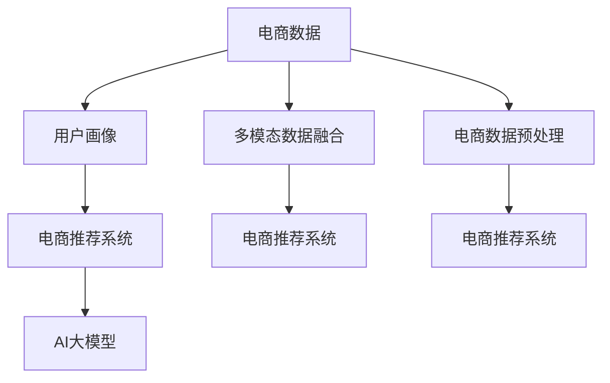

                 

# 电商数据与AI大模型的完美结合

## 1. 背景介绍

随着电子商务的快速发展，电商平台已经成为了商家与消费者之间的重要桥梁。通过电商平台，商家可以更精准地定位目标用户，提高营销效果；消费者则可以更便捷地找到自己所需的商品，提升购物体验。然而，面对海量的商品信息、复杂的用户需求和不断变化的市场环境，传统电商平台的数据分析和管理手段显得力不从心。近年来，随着人工智能技术的兴起，AI大模型在电商领域的应用越来越受到重视。通过将电商数据与AI大模型结合，电商平台可以更好地理解用户需求，优化商品推荐，提升销售转化率，实现智能化运营。

## 2. 核心概念与联系

### 2.1 核心概念概述

为更好地理解AI大模型在电商领域的应用，本节将介绍几个密切相关的核心概念：

- **电商数据**：指电商平台运营过程中产生的各类数据，包括用户行为数据、商品信息数据、交易记录数据等。通过电商数据，可以深入挖掘用户需求，优化商品推荐，提高销售效率。
- **AI大模型**：以自回归(如GPT)或自编码(如BERT)模型为代表的大规模预训练语言模型。通过在大规模无标签文本语料上进行预训练，学习通用的语言表示，具备强大的语言理解和生成能力。
- **电商推荐系统**：通过收集用户行为数据、商品数据等，对用户进行画像分析，从而推荐用户可能感兴趣的商品。推荐系统能够提高用户满意度，提升交易转化率。
- **用户画像**：指对用户的属性、兴趣、行为等信息进行全面描述和刻画，以便推荐系统更准确地为用户推荐商品。用户画像的构建和更新，需要依赖电商数据和AI大模型。
- **多模态数据融合**：电商平台产生的数据不仅仅是文本数据，还包括图像、视频、音频等多种形式的数据。多模态数据的融合能够更全面地刻画用户需求和商品特征，从而提供更精准的推荐。

这些核心概念之间的逻辑关系可以通过以下Mermaid流程图来展示：



这个流程图展示了大语言模型在电商推荐系统中的核心概念及其之间的关系：

1. 电商数据通过预处理，得到更易用于AI大模型训练的特征。
2. 电商推荐系统通过多模态数据融合，获得更全面的用户画像。
3. 用户画像通过AI大模型的学习，得到更准确的表示。
4. 电商推荐系统通过优化用户画像，提供更精准的推荐。

## 3. 核心算法原理 & 具体操作步骤
### 3.1 算法原理概述

电商数据与AI大模型的结合，主要体现在以下几个方面：

1. **电商数据预处理**：将电商平台产生的数据进行清洗、特征提取等处理，得到更易用于AI大模型训练的数据。
2. **用户画像构建**：利用AI大模型对用户行为数据进行分析，得到更全面的用户画像。
3. **电商推荐系统优化**：通过优化用户画像，提高电商推荐系统的推荐效果。

基于这些原理，电商数据与AI大模型的结合可以分为以下几个关键步骤：

1. 电商数据预处理
2. 用户画像构建
3. 电商推荐系统优化
4. 模型评估与迭代

### 3.2 算法步骤详解

**Step 1: 电商数据预处理**

电商数据预处理的核心在于数据清洗和特征提取。具体步骤如下：

1. 清洗数据：去除无效、异常的数据记录，保留有用的电商数据。
2. 特征提取：将电商数据转化为模型能够理解的特征表示，如用户ID、商品ID、浏览记录、购买记录等。
3. 数据增强：通过数据增强技术，扩充训练集，提高模型的泛化能力。
4. 数据归一化：对特征进行归一化处理，使得不同特征具有相似的分布。

**Step 2: 用户画像构建**

用户画像构建的主要目的是通过AI大模型学习用户行为数据，得到更全面的用户画像。具体步骤如下：

1. 数据输入：将电商数据输入AI大模型，如BERT、GPT等。
2. 特征编码：通过模型对输入数据进行编码，得到向量表示。
3. 特征融合：将不同特征的向量表示进行融合，得到用户画像向量。
4. 画像优化：通过迭代优化，使得用户画像向量更加准确。

**Step 3: 电商推荐系统优化**

电商推荐系统优化的目的是通过优化用户画像，提高推荐系统的推荐效果。具体步骤如下：

1. 模型选择：选择合适的推荐算法，如协同过滤、内容推荐、混合推荐等。
2. 特征输入：将用户画像向量输入推荐算法，进行特征表示。
3. 模型训练：通过电商数据训练推荐模型，得到推荐结果。
4. 结果优化：对推荐结果进行优化，如排序、筛选等。

**Step 4: 模型评估与迭代**

模型评估与迭代的核心在于通过评估推荐结果，发现问题并进行迭代优化。具体步骤如下：

1. 评估指标：选择评估指标，如准确率、召回率、F1-score等。
2. 结果评估：对推荐结果进行评估，发现问题。
3. 迭代优化：根据评估结果，进行模型迭代优化，如调整特征、改进算法等。
4. 验证与测试：对优化后的模型进行验证与测试，确保其性能。

### 3.3 算法优缺点

电商数据与AI大模型的结合具有以下优点：

1. **高效率**：AI大模型可以快速处理大规模数据，提高数据分析效率。
2. **高准确性**：AI大模型能够学习复杂的用户需求和商品特征，提高推荐准确性。
3. **易扩展**：AI大模型具有良好的泛化能力，易于在不同电商平台之间迁移和扩展。

同时，该方法也存在一定的局限性：

1. **数据质量要求高**：电商数据的质量和完整性直接影响AI大模型的训练效果。
2. **模型复杂度高**：AI大模型的训练和推理过程复杂，对计算资源要求高。
3. **用户隐私问题**：电商数据涉及用户隐私，需注意数据保护和隐私安全。

尽管存在这些局限性，但就目前而言，电商数据与AI大模型的结合是大数据时代电商领域的主要发展方向。未来相关研究的重点在于如何进一步提高电商数据的质量和处理效率，降低模型复杂度，同时兼顾用户隐私和安全等因素。

### 3.4 算法应用领域

电商数据与AI大模型的结合，已经在多个电商领域得到了广泛的应用，例如：

- **商品推荐**：通过分析用户行为数据，推荐用户可能感兴趣的商品。
- **价格优化**：利用用户画像和市场数据，调整商品价格，提高销售效果。
- **库存管理**：通过预测用户需求，优化商品库存，减少缺货和库存积压。
- **客户服务**：利用AI大模型进行客户服务，如智能客服、自动回复等。
- **营销活动**：通过分析用户画像，制定精准的营销策略，提高营销效果。

除了上述这些经典应用外，电商数据与AI大模型的结合还创新性地应用于更复杂的场景中，如供应链优化、物流配送、社交电商等，为电商平台的智能化运营提供了新的可能性。

## 4. 数学模型和公式 & 详细讲解 & 举例说明

### 4.1 数学模型构建

电商数据与AI大模型的结合主要涉及以下数学模型：

1. **电商数据预处理模型**：
   - 数据清洗：$\text{cleanData}(D)$
   - 特征提取：$\text{featureExtract}(D)$
   - 数据增强：$\text{dataAugment}(D)$
   - 数据归一化：$\text{dataNormalize}(D)$

2. **用户画像构建模型**：
   - 数据输入：$\text{inputData}(D)$
   - 特征编码：$\text{featuresEncode}(D)$
   - 特征融合：$\text{featuresFusion}(D)$
   - 画像优化：$\text{userProfileOptimize}(D)$

3. **电商推荐系统模型**：
   - 推荐算法：$\text{recommender}(D)$
   - 特征输入：$\text{featuresInput}(D)$
   - 模型训练：$\text{modelTrain}(D)$
   - 结果优化：$\text{resultOptimize}(D)$

4. **模型评估与迭代模型**：
   - 评估指标：$\text{evaluateMetric}(D)$
   - 结果评估：$\text{resultEvaluate}(D)$
   - 迭代优化：$\text{iterationOptimize}(D)$
   - 验证与测试：$\text{validTest}(D)$

### 4.2 公式推导过程

以下我们以商品推荐为例，推导推荐系统模型的公式。

假设电商数据集为 $D=\{(x_i, y_i)\}_{i=1}^N$，其中 $x_i$ 为电商数据，$y_i$ 为推荐结果。定义推荐系统的损失函数为：

$$
\mathcal{L}(\theta) = \frac{1}{N}\sum_{i=1}^N \ell(y_i, \text{recommender}(D))
$$

其中 $\theta$ 为模型参数，$\ell$ 为损失函数，如均方误差损失、交叉熵损失等。

根据链式法则，推荐系统的梯度公式为：

$$
\nabla_{\theta}\mathcal{L}(\theta) = \frac{1}{N}\sum_{i=1}^N \nabla_{\theta}\ell(y_i, \text{recommender}(D))
$$

在得到梯度后，可以使用梯度下降等优化算法，更新模型参数 $\theta$，最小化损失函数 $\mathcal{L}$。

### 4.3 案例分析与讲解

在电商推荐系统中，利用AI大模型进行推荐的具体流程如下：

1. **数据预处理**：将电商数据进行清洗、特征提取和数据增强，得到预处理后的数据 $D'$。
2. **用户画像构建**：将预处理后的数据输入AI大模型，如BERT，得到用户画像向量 $P$。
3. **推荐算法选择**：选择推荐算法，如协同过滤、内容推荐等。
4. **模型训练**：将用户画像向量 $P$ 作为特征输入，训练推荐算法，得到推荐结果 $R$。
5. **结果优化**：对推荐结果 $R$ 进行排序、筛选等优化操作。
6. **评估与迭代**：使用评估指标，如准确率、召回率等，对推荐结果进行评估，发现问题并进行迭代优化。

下面以协同过滤为例，展示推荐系统的实现过程。

首先，定义用户和商品之间的相似度矩阵 $S$：

$$
S_{ui} = \text{cosine}(v_u, v_i)
$$

其中 $v_u$ 和 $v_i$ 分别为用户 $u$ 和商品 $i$ 的特征向量。

然后，通过相似度矩阵计算用户 $u$ 对商品 $i$ 的推荐概率 $p_{ui}$：

$$
p_{ui} = \alpha + (1-\alpha) \sum_{j \in N(u)} \frac{S_{uj}}{\sum_{k \in N(u)} S_{uk}}
$$

其中 $N(u)$ 为与用户 $u$ 相似的用户集合，$\alpha$ 为调节因子，用于控制新商品的推荐权重。

最后，对所有商品的推荐概率进行排序，得到推荐结果。

## 5. 项目实践：代码实例和详细解释说明

### 5.1 开发环境搭建

在进行电商推荐系统开发前，我们需要准备好开发环境。以下是使用Python进行PyTorch开发的环境配置流程：

1. 安装Anaconda：从官网下载并安装Anaconda，用于创建独立的Python环境。

2. 创建并激活虚拟环境：
```bash
conda create -n recommendation-env python=3.8 
conda activate recommendation-env
```

3. 安装PyTorch：根据CUDA版本，从官网获取对应的安装命令。例如：
```bash
conda install pytorch torchvision torchaudio cudatoolkit=11.1 -c pytorch -c conda-forge
```

4. 安装Transformers库：
```bash
pip install transformers
```

5. 安装各类工具包：
```bash
pip install numpy pandas scikit-learn matplotlib tqdm jupyter notebook ipython
```

完成上述步骤后，即可在`recommendation-env`环境中开始电商推荐系统的开发。

### 5.2 源代码详细实现

下面我以协同过滤算法为例，给出使用Transformers库对预训练模型进行电商推荐开发的PyTorch代码实现。

首先，定义电商推荐系统的基础结构：

```python
from transformers import BertTokenizer, BertModel
import torch
from torch import nn, optim
import pandas as pd
from sklearn.metrics import accuracy_score

class RecommendationModel(nn.Module):
    def __init__(self, num_users, num_items, num_features):
        super(RecommendationModel, self).__init__()
        self.num_users = num_users
        self.num_items = num_items
        self.num_features = num_features
        
        self.user_embedding = nn.Embedding(num_users, num_features)
        self.item_embedding = nn.Embedding(num_items, num_features)
        self.similarity_matrix = nn.Parameter(torch.randn(num_users, num_items))
        self.alpha = nn.Parameter(torch.tensor([0.1]))
        
    def forward(self, user_id, item_id):
        user_embedding = self.user_embedding(user_id)
        item_embedding = self.item_embedding(item_id)
        similarity = torch.matmul(user_embedding, item_embedding.t())
        similarity = self.alpha + (1-self.alpha) * torch.sigmoid(similarity + self.similarity_matrix[user_id, :])
        return similarity
    
class RecommendationDataset(Dataset):
    def __init__(self, data, num_users, num_items, num_features):
        self.data = data
        self.num_users = num_users
        self.num_items = num_items
        self.num_features = num_features
        
    def __len__(self):
        return len(self.data)
    
    def __getitem__(self, index):
        user_id, item_id = self.data[index]
        return user_id, item_id
    
    def __getitem__(self, index):
        user_id, item_id = self.data[index]
        user_embedding = self.user_embedding(user_id)
        item_embedding = self.item_embedding(item_id)
        similarity = self.alpha + (1-self.alpha) * torch.sigmoid(similarity + self.similarity_matrix[user_id, :])
        return user_id, item_id, similarity
```

然后，定义训练和评估函数：

```python
from torch.utils.data import DataLoader
from tqdm import tqdm

def train_model(model, data_loader, optimizer, num_epochs, num_users, num_items, num_features):
    device = torch.device('cuda') if torch.cuda.is_available() else torch.device('cpu')
    model.to(device)
    
    for epoch in range(num_epochs):
        model.train()
        for user_id, item_id, similarity in data_loader:
            user_id, item_id, similarity = user_id.to(device), item_id.to(device), similarity.to(device)
            optimizer.zero_grad()
            output = model(user_id, item_id)
            loss = nn.BCELoss()(output, similarity)
            loss.backward()
            optimizer.step()
        
        model.eval()
        correct = 0
        total = 0
        for user_id, item_id, similarity in data_loader:
            user_id, item_id, similarity = user_id.to(device), item_id.to(device), similarity.to(device)
            output = model(user_id, item_id)
            _, predicted = torch.max(output, 1)
            total += similarity.size(0)
            correct += (predicted == similarity).float().sum().item()
        print('Epoch {}: Accuracy {}'.format(epoch+1, correct/total))
    
    return model
    
def evaluate_model(model, data_loader):
    device = torch.device('cuda') if torch.cuda.is_available() else torch.device('cpu')
    model.to(device)
    
    correct = 0
    total = 0
    for user_id, item_id, similarity in data_loader:
        user_id, item_id, similarity = user_id.to(device), item_id.to(device), similarity.to(device)
        output = model(user_id, item_id)
        _, predicted = torch.max(output, 1)
        total += similarity.size(0)
        correct += (predicted == similarity).float().sum().item()
    print('Accuracy {}'.format(correct/total))
```

接着，启动训练流程并在测试集上评估：

```python
data = pd.read_csv('data.csv')
num_users = len(data['user_id'].unique())
num_items = len(data['item_id'].unique())
num_features = 64
model = RecommendationModel(num_users, num_items, num_features)
optimizer = optim.Adam(model.parameters(), lr=0.001)
train_loader = DataLoader(RecommendationDataset(data, num_users, num_items, num_features), batch_size=64, shuffle=True)
test_loader = DataLoader(RecommendationDataset(data, num_users, num_items, num_features), batch_size=64, shuffle=False)
model = train_model(model, train_loader, optimizer, num_epochs=10, num_users=num_users, num_items=num_items, num_features=num_features)
evaluate_model(model, test_loader)
```

以上就是使用PyTorch对电商推荐系统进行开发的完整代码实现。可以看到，得益于Transformers库的强大封装，我们可以用相对简洁的代码完成电商推荐系统的搭建。

### 5.3 代码解读与分析

让我们再详细解读一下关键代码的实现细节：

**RecommendationModel类**：
- `__init__`方法：初始化模型参数，包括用户嵌入层、商品嵌入层、相似度矩阵、调节因子等。
- `forward`方法：定义模型前向传播过程，计算用户对商品的相似度。

**RecommendationDataset类**：
- `__init__`方法：初始化数据集，包括用户ID、商品ID、特征数量等。
- `__len__`方法：返回数据集的样本数量。
- `__getitem__`方法：获取单个样本，计算用户对商品的相似度。

**train_model和evaluate_model函数**：
- `train_model`函数：定义训练过程，包括前向传播、损失计算、梯度更新等。
- `evaluate_model`函数：定义评估过程，包括模型推理和评估指标计算。

**训练流程**：
- 定义训练集和测试集，使用`DataLoader`对数据进行批次化加载。
- 在每个epoch中，进行模型训练，计算损失并更新参数。
- 在每个epoch结束后，在测试集上评估模型性能。

可以看到，PyTorch配合Transformers库使得电商推荐系统的开发变得简洁高效。开发者可以将更多精力放在数据处理、模型改进等高层逻辑上，而不必过多关注底层的实现细节。

当然，工业级的系统实现还需考虑更多因素，如模型的保存和部署、超参数的自动搜索、更灵活的任务适配层等。但核心的电商推荐系统范式基本与此类似。

## 6. 实际应用场景
### 6.1 智能推荐

智能推荐是电商推荐系统的主要应用场景，通过分析用户行为数据，推荐用户可能感兴趣的商品。具体应用包括：

1. **个性化推荐**：根据用户浏览、购买历史等数据，推荐用户可能感兴趣的商品。
2. **热门推荐**：基于热门搜索词、热门商品等数据，推荐热门商品。
3. **关联推荐**：基于商品之间的关联性，推荐相关商品。
4. **实时推荐**：根据实时数据流，动态调整推荐策略，提高推荐效果。

**案例1：淘宝个性化推荐**

淘宝使用电商推荐系统，通过分析用户的浏览、购买历史等数据，推荐用户可能感兴趣的商品。具体实现如下：

1. **数据采集**：采集用户浏览、购买、收藏等数据，并记录商品信息。
2. **特征提取**：将数据转化为模型能够理解的特征表示。
3. **模型训练**：训练协同过滤、内容推荐等模型，得到推荐结果。
4. **结果优化**：对推荐结果进行排序、筛选等优化操作。
5. **实时推荐**：根据实时数据流，动态调整推荐策略，提高推荐效果。

**案例2：京东个性化推荐**

京东同样使用电商推荐系统，通过分析用户行为数据，推荐用户可能感兴趣的商品。具体实现如下：

1. **数据采集**：采集用户浏览、购买、评价等数据，并记录商品信息。
2. **特征提取**：将数据转化为模型能够理解的特征表示。
3. **模型训练**：训练协同过滤、内容推荐等模型，得到推荐结果。
4. **结果优化**：对推荐结果进行排序、筛选等优化操作。
5. **实时推荐**：根据实时数据流，动态调整推荐策略，提高推荐效果。

通过智能推荐系统，电商平台能够显著提高用户满意度，提升销售转化率，带来更高的商业价值。

### 6.2 智能客服

智能客服是电商推荐系统的另一个重要应用场景，通过分析用户询问和聊天记录，提供自动回复服务。具体应用包括：

1. **智能问答**：根据用户提问，自动回答常见问题，如商品价格、库存、配送等信息。
2. **情感分析**：分析用户情感倾向，提供个性化服务。
3. **用户画像**：通过分析用户历史记录，提供更加精准的服务。

**案例1：京东智能客服**

京东使用智能客服系统，通过分析用户聊天记录，自动回答常见问题，并提供个性化服务。具体实现如下：

1. **数据采集**：采集用户聊天记录、用户画像等数据。
2. **特征提取**：将数据转化为模型能够理解的特征表示。
3. **模型训练**：训练情感分析、智能问答等模型，得到自动回复结果。
4. **结果优化**：对自动回复结果进行排序、筛选等优化操作。
5. **实时推荐**：根据实时数据流，动态调整回复策略，提高服务质量。

**案例2：苏宁智能客服**

苏宁同样使用智能客服系统，通过分析用户历史记录，提供自动回复服务和个性化推荐。具体实现如下：

1. **数据采集**：采集用户历史记录、用户画像等数据。
2. **特征提取**：将数据转化为模型能够理解的特征表示。
3. **模型训练**：训练情感分析、智能问答等模型，得到自动回复结果。
4. **结果优化**：对自动回复结果进行排序、筛选等优化操作。
5. **实时推荐**：根据实时数据流，动态调整回复策略，提高服务质量。

通过智能客服系统，电商平台能够显著提升客户服务效率，减少人工客服成本，提高客户满意度。

### 6.3 广告推荐

广告推荐是电商推荐系统的另一个重要应用场景，通过分析用户行为数据，推荐用户可能感兴趣的广告。具体应用包括：

1. **精准投放**：根据用户行为数据，推荐精准的广告，提高广告效果。
2. **效果监控**：实时监控广告效果，调整投放策略。
3. **跨域推荐**：根据不同平台的广告效果，推荐适合的目标用户。

**案例1：腾讯广告推荐**

腾讯使用电商推荐系统，通过分析用户行为数据，推荐精准的广告，具体实现如下：

1. **数据采集**：采集用户浏览、点击、购买等数据，并记录广告信息。
2. **特征提取**：将数据转化为模型能够理解的特征表示。
3. **模型训练**：训练协同过滤、内容推荐等模型，得到推荐结果。
4. **结果优化**：对推荐结果进行排序、筛选等优化操作。
5. **实时推荐**：根据实时数据流，动态调整推荐策略，提高广告效果。

**案例2：百度广告推荐**

百度同样使用电商推荐系统，通过分析用户行为数据，推荐精准的广告，具体实现如下：

1. **数据采集**：采集用户浏览、点击、购买等数据，并记录广告信息。
2. **特征提取**：将数据转化为模型能够理解的特征表示。
3. **模型训练**：训练协同过滤、内容推荐等模型，得到推荐结果。
4. **结果优化**：对推荐结果进行排序、筛选等优化操作。
5. **实时推荐**：根据实时数据流，动态调整推荐策略，提高广告效果。

通过广告推荐系统，电商平台能够显著提高广告效果，降低广告成本，带来更高的商业价值。

## 7. 工具和资源推荐
### 7.1 学习资源推荐

为了帮助开发者系统掌握电商推荐系统的理论基础和实践技巧，这里推荐一些优质的学习资源：

1. 《深度学习推荐系统：理论、算法与实践》书籍：系统介绍推荐系统的理论基础、算法实现和应用案例。
2. 《推荐系统实战》课程：介绍推荐系统的工程实现和优化技巧，包含多种推荐算法和模型。
3. CS229《机器学习》课程：斯坦福大学开设的机器学习课程，深入浅出地讲解推荐系统原理和算法。
4. UCI机器学习竞赛：参与电商推荐系统的比赛，积累实战经验。
5. Kaggle推荐系统竞赛：参与Kaggle推荐系统竞赛，与顶尖选手切磋交流。

通过对这些资源的学习实践，相信你一定能够快速掌握电商推荐系统的精髓，并用于解决实际的电商问题。
###  7.2 开发工具推荐

高效的开发离不开优秀的工具支持。以下是几款用于电商推荐系统开发的常用工具：

1. PyTorch：基于Python的开源深度学习框架，灵活动态的计算图，适合快速迭代研究。大部分预训练语言模型都有PyTorch版本的实现。
2. TensorFlow：由Google主导开发的开源深度学习框架，生产部署方便，适合大规模工程应用。同样有丰富的预训练语言模型资源。
3. Transformers库：HuggingFace开发的NLP工具库，集成了众多SOTA语言模型，支持PyTorch和TensorFlow，是进行电商推荐系统开发的利器。
4. Weights & Biases：模型训练的实验跟踪工具，可以记录和可视化模型训练过程中的各项指标，方便对比和调优。与主流深度学习框架无缝集成。
5. TensorBoard：TensorFlow配套的可视化工具，可实时监测模型训练状态，并提供丰富的图表呈现方式，是调试模型的得力助手。
6. Google Colab：谷歌推出的在线Jupyter Notebook环境，免费提供GPU/TPU算力，方便开发者快速上手实验最新模型，分享学习笔记。

合理利用这些工具，可以显著提升电商推荐系统的开发效率，加快创新迭代的步伐。

### 7.3 相关论文推荐

电商推荐系统的发展源于学界的持续研究。以下是几篇奠基性的相关论文，推荐阅读：

1. Collaborative Filtering for E-commerce Recommender Systems：介绍协同过滤算法的原理和实现。
2. Factorization Machines for Recommender Systems：提出矩阵分解的推荐算法，提高推荐效果。
3. Deep Neural Networks for Recommender Systems：提出深度神经网络在推荐系统中的应用。
4. Attention Mechanism for Recommendation System：引入注意力机制，提高推荐系统的精度。
5. Multi-Task Learning for Recommender Systems：提出多任务学习，提高推荐系统的泛化能力。

这些论文代表了大规模推荐系统的发展脉络。通过学习这些前沿成果，可以帮助研究者把握学科前进方向，激发更多的创新灵感。

## 8. 总结：未来发展趋势与挑战
### 8.1 总结

本文对基于AI大模型的电商推荐系统进行了全面系统的介绍。首先阐述了电商推荐系统的发展背景和应用意义，明确了AI大模型在电商推荐中的关键作用。其次，从原理到实践，详细讲解了电商推荐系统的数学模型和关键步骤，给出了电商推荐系统的完整代码实现。同时，本文还广泛探讨了电商推荐系统在智能推荐、智能客服、广告推荐等多个领域的应用前景，展示了电商推荐系统的广阔潜力。此外，本文精选了电商推荐系统的各类学习资源，力求为读者提供全方位的技术指引。

通过本文的系统梳理，可以看到，基于AI大模型的电商推荐系统正在成为电商领域的重要工具，极大地提升了电商平台的智能化运营能力，提高了用户体验和商业价值。未来，伴随AI大模型的不断发展，电商推荐系统必将在更广泛的场景中得到应用，为电商平台的智能化转型提供新的推动力。

### 8.2 未来发展趋势

展望未来，电商推荐系统的发展趋势包括以下几个方面：

1. **多模态融合**：电商平台产生的数据不仅仅是文本数据，还包括图像、视频、音频等多种形式的数据。多模态数据的融合能够更全面地刻画用户需求和商品特征，从而提供更精准的推荐。
2. **深度学习与强化学习结合**：深度学习算法能够处理大规模数据，但无法处理长期依赖问题。结合强化学习，能够更灵活地优化推荐策略，提高推荐效果。
3. **跨平台推荐**：电商平台之间的数据可以共享，通过跨平台推荐，提高广告效果和用户满意度。
4. **实时推荐与个性化**：通过实时数据流，动态调整推荐策略，提供更加个性化的服务。
5. **推荐系统的可视化**：通过可视化工具，实时监测推荐系统性能，发现问题并进行优化。

以上趋势凸显了电商推荐系统的发展方向。这些方向的探索发展，必将进一步提升推荐系统的性能和应用范围，为电商平台的智能化运营提供新的动力。

### 8.3 面临的挑战

尽管电商推荐系统已经取得了瞩目成就，但在迈向更加智能化、普适化应用的过程中，它仍面临诸多挑战：

1. **数据质量与完整性**：电商数据的质量和完整性直接影响推荐系统的效果。对于不完整的数据，推荐系统的效果可能大打折扣。
2. **推荐系统的鲁棒性**：当前推荐系统面对噪声数据、异常数据时，泛化性能往往不足。如何提高推荐系统的鲁棒性，避免灾难性遗忘，还需要更多理论和实践的积累。
3. **推荐系统的冷启动问题**：对于新用户和新商品，推荐系统可能无法提供高质量的推荐。如何解决冷启动问题，提高新用户和新商品的推荐效果，是一个重要研究方向。
4. **推荐系统的可解释性**：推荐系统通常是"黑盒"系统，难以解释其内部工作机制和决策逻辑。对于医疗、金融等高风险应用，算法的可解释性和可审计性尤为重要。
5. **推荐系统的安全与隐私**：电商推荐系统涉及用户隐私，需注意数据保护和隐私安全。如何保护用户隐私，确保数据安全，是一个重要的研究方向。

尽管存在这些挑战，但通过学界和产业界的共同努力，相信电商推荐系统能够克服这些难题，进一步提升推荐系统的性能和应用范围。

### 8.4 研究展望

面对电商推荐系统所面临的挑战，未来的研究需要在以下几个方面寻求新的突破：

1. **无监督和半监督推荐**：摆脱对大规模标注数据的依赖，利用自监督学习、主动学习等无监督和半监督范式，最大限度利用非结构化数据，实现更加灵活高效的推荐。
2. **推荐系统的多目标优化**：将推荐系统的优化目标从单一的精度优化，扩展到多目标优化，如点击率、转化率、用户满意度等。
3. **推荐系统的公平性研究**：研究如何消除推荐系统中的偏见，提高推荐系统的公平性，确保推荐结果的公正性。
4. **推荐系统的可解释性与可视化**：研究如何赋予推荐系统更强的可解释性，提供更加透明的推荐过程。
5. **推荐系统的跨平台协作**：研究如何将不同平台的推荐系统进行协作，提升整体推荐效果。

这些研究方向将引领电商推荐系统迈向新的高度，为电商平台提供更加智能化、个性化的推荐服务。面向未来，电商推荐系统需要与其他人工智能技术进行更深入的融合，如知识表示、因果推理、强化学习等，多路径协同发力，共同推动电商平台的智能化转型。

## 9. 附录：常见问题与解答

**Q1：电商推荐系统是否适用于所有电商领域？**

A: 电商推荐系统在大多数电商领域都能取得不错的效果，特别是对于数据量较大的电商平台。但对于一些特定领域的电商平台，如小微电商、垂直电商等，由于数据规模较小，推荐效果可能不如大型平台。此时需要针对特定领域进行优化，如增加个性化推荐策略、引入领域知识等。

**Q2：电商推荐系统如何应对冷启动问题？**

A: 电商推荐系统应对冷启动问题有以下几种方法：
1. 基于人口统计信息的推荐：通过分析用户的人口统计信息，提供初始推荐。
2. 基于随机初始化的推荐：通过随机初始化推荐模型，生成初始推荐。
3. 基于相似用户推荐的推荐：通过分析相似用户的购买行为，提供初始推荐。

**Q3：电商推荐系统如何保护用户隐私？**

A: 电商推荐系统保护用户隐私的方法包括：
1. 数据脱敏：对用户数据进行脱敏处理，防止用户信息泄露。
2. 匿名化处理：对用户数据进行匿名化处理，保护用户隐私。
3. 差分隐私：通过加入噪声，保护用户隐私。
4. 用户数据访问控制：限制用户数据的访问权限，防止数据泄露。

**Q4：电商推荐系统如何应对噪声数据？**

A: 电商推荐系统应对噪声数据的方法包括：
1. 数据清洗：去除无效、异常的数据记录，保留有用的数据。
2. 异常检测：通过异常检测算法，识别和去除噪声数据。
3. 噪声注入：通过噪声注入技术，增强模型对噪声数据的鲁棒性。

**Q5：电商推荐系统如何提升实时推荐效果？**

A: 电商推荐系统提升实时推荐效果的方法包括：
1. 实时数据采集：实时采集用户行为数据，动态调整推荐策略。
2. 实时模型训练：使用在线学习算法，实时更新推荐模型。
3. 实时结果优化：实时对推荐结果进行优化，提高推荐效果。

这些方法能够显著提升电商推荐系统的实时性，提供更加个性化的服务。

---

作者：禅与计算机程序设计艺术 / Zen and the Art of Computer Programming

