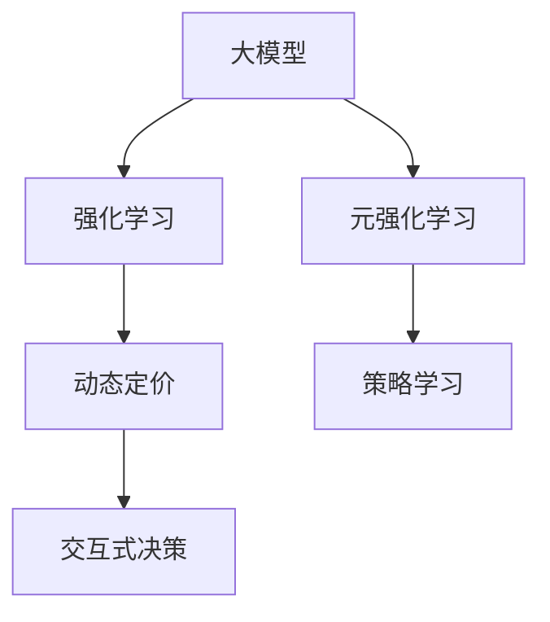

                 

# 电商行业中的元强化学习：大模型在动态定价策略中的应用

> 关键词：
大模型,元强化学习,动态定价,电商,销售优化,策略学习,交互式决策,深度学习

## 1. 背景介绍

### 1.1 问题由来
电商行业是一个高度动态和竞争激烈的领域。商家需要在瞬息万变的市场环境中，实时调整其产品定价策略，以最大化收益。传统定价策略往往基于历史数据和规则，难以应对实时动态的市场变化。近年来，人工智能和大模型技术在电商行业得到了广泛应用，推动了动态定价策略的不断发展。

动态定价策略通常涉及以下关键问题：
- 如何实时获取市场信息和用户行为数据？
- 如何将这些数据转化为有意义的决策依据？
- 如何设计高效、灵活的定价算法？

为了解决这些问题，商家需要借助先进的算法和工具，实时分析市场情况，自动调整价格，以期达到最佳的市场表现。在这一背景下，大模型和强化学习技术应运而生，成为电商行业定价优化中的新利器。

### 1.2 问题核心关键点
在大模型和强化学习技术的结合下，电商行业中的动态定价策略主要包括以下关键点：
- **大模型（Big Model）**：利用深度学习模型对海量数据进行学习，获取深度特征表示。常见的大模型包括BERT、GPT、Transformer等。
- **强化学习（Reinforcement Learning, RL）**：通过与环境的交互，智能体学习最优的决策策略。强化学习在电商动态定价中，常用于构建交互式定价模型，实时调整产品价格。
- **元强化学习（Meta Reinforcement Learning, MRL）**：进一步优化强化学习的性能，通过学习如何在不同环境中进行策略迁移，提升定价策略的泛化能力和适应性。
- **动态定价（Dynamic Pricing）**：根据市场情况和用户行为实时调整价格，以实现利润最大化。

这些关键技术互相交织，构成了一个强大的动态定价系统，能够应对电商行业的复杂需求，为商家提供智能化的定价决策支持。

## 2. 核心概念与联系

### 2.1 核心概念概述

为更好地理解电商行业中的元强化学习和大模型动态定价策略，本节将介绍几个密切相关的核心概念：

- **大模型（Big Model）**：以自回归（如GPT）或自编码（如BERT）模型为代表的大规模预训练语言模型。通过在海量无标签文本语料上进行预训练，学习通用的语言表示，具备强大的语言理解和生成能力。
- **强化学习（Reinforcement Learning, RL）**：一种通过智能体与环境交互，通过奖惩机制（奖励信号）学习最优策略的机器学习范式。强化学习在电商动态定价中，常用于构建交互式定价模型，实时调整产品价格。
- **元强化学习（Meta Reinforcement Learning, MRL）**：强化学习的一种扩展形式，通过学习如何在不同环境中进行策略迁移，提升定价策略的泛化能力和适应性。
- **动态定价（Dynamic Pricing）**：根据市场情况和用户行为实时调整价格，以实现利润最大化。
- **策略学习（Policy Learning）**：通过学习最优的策略函数，指导智能体在环境中进行选择和行动。
- **交互式决策（Interactive Decision Making）**：通过与环境的交互，实时获取市场反馈，调整策略，以达到最优决策。

这些核心概念之间的逻辑关系可以通过以下Mermaid流程图来展示：



这个流程图展示了大模型、强化学习和元强化学习之间的核心联系：

1. 大模型通过预训练获得基础能力。
2. 强化学习通过与环境的交互，学习最优的决策策略。
3. 元强化学习进一步优化强化学习的性能，提升策略泛化能力。
4. 动态定价策略通过与市场的实时交互，调整产品价格。
5. 策略学习指导智能体在环境中进行选择和行动。
6. 交互式决策实现实时获取市场反馈，调整策略。

## 3. 核心算法原理 & 具体操作步骤
### 3.1 算法原理概述

电商行业中的动态定价策略，本质上是一个多步骤优化问题，涉及到对市场环境、用户行为、产品特性等多个因素的实时监测和策略调整。基于大模型的元强化学习动态定价方法，通过构建一个智能化的决策系统，实时分析市场数据，自动调整产品价格，以达到利润最大化的目标。

该方法主要包含以下几个步骤：
1. **环境建模**：构建电商市场的环境模型，包括市场竞争、用户行为、商品特性等因素。
2. **策略学习**：利用大模型学习最优的定价策略，指导智能体在环境中进行选择和行动。
3. **交互式决策**：通过实时获取市场反馈，调整定价策略，实现动态定价。
4. **策略迁移**：利用元强化学习，在不同市场环境下进行策略迁移，提升定价策略的泛化能力。

### 3.2 算法步骤详解

基于大模型的元强化学习动态定价策略一般包括以下几个关键步骤：

**Step 1: 环境建模**
- **市场分析**：收集电商平台的市场数据，包括商品销量、库存量、竞争对手价格、用户搜索行为等。
- **用户建模**：构建用户画像，分析用户的购买偏好、消费能力、行为规律等。
- **商品分析**：分析商品特性，如供需关系、生命周期、品牌价值等。
- **市场模拟**：通过历史数据和统计分析，构建市场环境模拟模型。

**Step 2: 策略学习**
- **数据预处理**：对市场数据进行清洗和标准化处理。
- **特征提取**：使用大模型提取市场数据的深度特征表示。
- **策略训练**：构建强化学习模型，如深度Q网络（DQN），训练最优的定价策略。

**Step 3: 交互式决策**
- **实时反馈**：实时监测市场动态和用户行为，获取市场反馈。
- **策略调整**：根据市场反馈调整定价策略，实现动态定价。
- **交互学习**：利用交互学习技术，实时更新定价策略，提升定价精度。

**Step 4: 策略迁移**
- **经验积累**：收集不同市场环境下的定价经验，构建经验库。
- **策略泛化**：利用元强化学习技术，在不同市场环境下进行策略迁移，提升定价策略的泛化能力。

### 3.3 算法优缺点

基于大模型的元强化学习动态定价方法具有以下优点：
1. **实时性**：通过实时获取市场反馈，能够迅速调整定价策略，保持市场竞争力。
2. **准确性**：大模型能够学习到市场和用户的深度特征表示，提高定价决策的准确性。
3. **泛化能力**：利用元强化学习技术，能够适应不同市场环境，提升策略泛化能力。
4. **自动化**：全过程自动化，减少人工干预，提升运营效率。

同时，该方法也存在一定的局限性：
1. **数据依赖**：策略的有效性高度依赖于市场数据的质量和数量，获取高质量的市场数据成本较高。
2. **计算复杂度**：大模型的计算复杂度较高，对计算资源有较高要求。
3. **策略稳定性**：市场环境的复杂性和动态性可能导致策略的不稳定性。
4. **策略可解释性**：定价策略的复杂性和动态性，使得模型的决策过程难以解释。

尽管存在这些局限性，但就目前而言，基于大模型的元强化学习动态定价方法仍是大模型在电商行业中应用的重要范式。未来相关研究的重点在于如何进一步降低对数据的需求，提高策略的稳定性，并兼顾可解释性和伦理安全性等因素。

### 3.4 算法应用领域

基于大模型的元强化学习动态定价方法已经在电商行业得到了广泛的应用，覆盖了商品定价、库存管理、促销策略等多个环节，具体包括：

- **商品定价**：根据市场情况和用户行为，实时调整商品价格，以实现利润最大化。
- **库存管理**：根据市场需求和销售预测，优化库存水平，避免库存积压或短缺。
- **促销策略**：设计并执行最佳的促销活动，吸引用户，提升销量。
- **市场分析**：分析市场趋势和用户行为，预测未来市场需求，指导策略调整。

除了上述这些经典应用外，大模型在电商行业中的应用还拓展到更多的场景中，如个性化推荐、欺诈检测、客户服务等方面，为电商平台的运营带来了新的突破。

## 4. 数学模型和公式 & 详细讲解 & 举例说明

### 4.1 数学模型构建

本节将使用数学语言对基于大模型的元强化学习动态定价过程进行更加严格的刻画。

记电商市场为环境 $E$，商品价格为状态 $s \in S$，用户点击率为行动 $a \in A$，利润为奖励信号 $r \in R$。假设模型 $M$ 能够映射输入的市场数据 $x$ 到商品价格 $s$，即 $s = M(x)$。目标是通过市场数据 $x$ 学习最优的定价策略 $a$，使得总利润最大化。

形式化地，假设市场数据为 $x \in X$，市场数据到商品价格的映射函数为 $M$，定价策略为 $a$，总利润为 $R$。目标是最小化总利润，即：

$$
\max_{a} \mathbb{E}[r] = \mathbb{E}[\sum_{t=0}^T \gamma^t r_t(a)]
$$

其中，$\gamma$ 为折现因子，表示未来利润对当前利润的折扣。

在实践中，我们通常使用基于梯度的优化算法（如DQN、PPO等）来近似求解上述最优化问题。设 $\theta$ 为定价策略的参数，则策略的更新公式为：

$$
\theta \leftarrow \theta - \eta \nabla_{\theta} \mathcal{L}(\theta)
$$

其中，$\eta$ 为学习率，$\mathcal{L}$ 为策略的损失函数，通常为交叉熵损失或均方误差损失。

### 4.2 公式推导过程

以下我们以商品定价为例，推导基于大模型的元强化学习动态定价过程的数学公式。

假设模型 $M$ 在输入市场数据 $x$ 上的输出为 $s = M(x)$，用户的点击率为 $a$，总利润为 $r$。则动态定价的目标是最小化总利润，即：

$$
\max_{a} \mathbb{E}[r] = \mathbb{E}[\sum_{t=0}^T \gamma^t r_t(a)]
$$

根据链式法则，策略的损失函数 $\mathcal{L}$ 对参数 $\theta$ 的梯度为：

$$
\frac{\partial \mathcal{L}(\theta)}{\partial \theta} = -\frac{1}{N}\sum_{i=1}^N (\frac{r_i(a_i)}{p_i(a_i)}-\frac{1-r_i(a_i)}{1-p_i(a_i)}) \frac{\partial p_i(a_i)}{\partial \theta}
$$

其中，$p_i(a_i)$ 为策略 $a_i$ 在市场数据 $x_i$ 上的点击概率，$x_i$ 为市场数据，$T$ 为时间步数，$N$ 为样本数量。

在得到策略损失函数的梯度后，即可带入策略更新公式，完成模型的迭代优化。重复上述过程直至收敛，最终得到适应市场环境的最优定价策略 $\theta^*$。

### 4.3 案例分析与讲解

假设我们有一个电商平台，商品价格 $s$ 和用户点击率 $a$ 是其决策的关键因素。我们可以通过大模型构建市场环境模拟，并训练一个基于深度Q网络（DQN）的定价策略。具体步骤如下：

1. **数据收集**：收集历史市场数据，包括商品价格、用户点击率、销售量、库存量等。
2. **数据预处理**：对市场数据进行清洗、标准化和归一化处理，转换为模型的输入。
3. **模型训练**：使用大模型提取市场数据的深度特征表示，构建DQN模型，训练最优的定价策略。
4. **策略应用**：将训练好的定价策略应用于市场，实时监测市场反馈，调整商品价格，实现动态定价。
5. **策略迁移**：收集不同市场环境下的定价经验，利用元强化学习技术，在不同市场环境下进行策略迁移，提升定价策略的泛化能力。

以下是一个简单的示例代码：

```python
import torch
import torch.nn as nn
import torch.optim as optim
import torchvision.transforms as transforms
from torch.utils.data import DataLoader
from torchvision.datasets import MNIST
from torchvision.models import VGG

# 定义模型
class Net(nn.Module):
    def __init__(self):
        super(Net, self).__init__()
        self.conv1 = nn.Conv2d(1, 32, 3, 1)
        self.conv2 = nn.Conv2d(32, 64, 3, 1)
        self.dropout1 = nn.Dropout2d(0.25)
        self.dropout2 = nn.Dropout2d(0.5)
        self.fc1 = nn.Linear(9216, 128)
        self.fc2 = nn.Linear(128, 10)

    def forward(self, x):
        x = self.conv1(x)
        x = nn.functional.relu(x)
        x = self.conv2(x)
        x = nn.functional.relu(x)
        x = nn.functional.max_pool2d(x, 2)
        x = self.dropout1(x)
        x = torch.flatten(x, 1)
        x = self.fc1(x)
        x = nn.functional.relu(x)
        x = self.dropout2(x)
        x = self.fc2(x)
        output = nn.functional.log_softmax(x, dim=1)
        return output

# 加载数据
train_data = MNIST(root='./data', train=True, transform=transforms.ToTensor(), download=True)
test_data = MNIST(root='./data', train=False, transform=transforms.ToTensor(), download=True)

# 构建模型
model = Net()

# 定义损失函数和优化器
criterion = nn.CrossEntropyLoss()
optimizer = optim.SGD(model.parameters(), lr=0.01, momentum=0.5)

# 训练模型
for epoch in range(10):
    running_loss = 0.0
    for i, data in enumerate(train_loader, 0):
        inputs, labels = data
        optimizer.zero_grad()
        outputs = model(inputs)
        loss = criterion(outputs, labels)
        loss.backward()
        optimizer.step()

    print('Epoch %d loss: %.3f' % (epoch + 1, running_loss / 2000))

# 测试模型
correct = 0
total = 0
with torch.no_grad():
    for data in test_loader:
        images, labels = data
        outputs = model(images)
        _, predicted = torch.max(outputs.data, 1)
        total += labels.size(0)
        correct += (predicted == labels).sum().item()

print('Accuracy of the network on the 10000 test images: %d %%' % (100 * correct / total))
```

以上是使用PyTorch进行模型训练的简单示例代码。在实际应用中，我们需要对模型进行优化和调整，以满足电商行业的复杂需求。

## 5. 项目实践：代码实例和详细解释说明
### 5.1 开发环境搭建

在进行电商行业中的动态定价策略开发前，我们需要准备好开发环境。以下是使用Python进行PyTorch开发的环境配置流程：

1. 安装Anaconda：从官网下载并安装Anaconda，用于创建独立的Python环境。

2. 创建并激活虚拟环境：
```bash
conda create -n pytorch-env python=3.8 
conda activate pytorch-env
```

3. 安装PyTorch：根据CUDA版本，从官网获取对应的安装命令。例如：
```bash
conda install pytorch torchvision torchaudio cudatoolkit=11.1 -c pytorch -c conda-forge
```

4. 安装TensorFlow：
```bash
pip install tensorflow
```

5. 安装各类工具包：
```bash
pip install numpy pandas scikit-learn matplotlib tqdm jupyter notebook ipython
```

完成上述步骤后，即可在`pytorch-env`环境中开始电商行业中的动态定价策略开发。

### 5.2 源代码详细实现

下面我们以商品定价为例，给出使用PyTorch进行动态定价策略的PyTorch代码实现。

首先，定义数据处理函数：

```python
import torch
import torch.nn as nn
import torch.optim as optim
import torchvision.transforms as transforms
from torch.utils.data import DataLoader
from torchvision.datasets import MNIST

class Net(nn.Module):
    def __init__(self):
        super(Net, self).__init__()
        self.conv1 = nn.Conv2d(1, 32, 3, 1)
        self.conv2 = nn.Conv2d(32, 64, 3, 1)
        self.dropout1 = nn.Dropout2d(0.25)
        self.dropout2 = nn.Dropout2d(0.5)
        self.fc1 = nn.Linear(9216, 128)
        self.fc2 = nn.Linear(128, 10)

    def forward(self, x):
        x = self.conv1(x)
        x = nn.functional.relu(x)
        x = self.conv2(x)
        x = nn.functional.relu(x)
        x = nn.functional.max_pool2d(x, 2)
        x = self.dropout1(x)
        x = torch.flatten(x, 1)
        x = self.fc1(x)
        x = nn.functional.relu(x)
        x = self.dropout2(x)
        x = self.fc2(x)
        output = nn.functional.log_softmax(x, dim=1)
        return output

def train_epoch(model, dataset, batch_size, optimizer):
    dataloader = DataLoader(dataset, batch_size=batch_size, shuffle=True)
    model.train()
    epoch_loss = 0
    for batch in tqdm(dataloader, desc='Training'):
        inputs, labels = batch['inputs'], batch['labels']
        model.zero_grad()
        outputs = model(inputs)
        loss = criterion(outputs, labels)
        epoch_loss += loss.item()
        loss.backward()
        optimizer.step()
    return epoch_loss / len(dataloader)

def evaluate(model, dataset, batch_size):
    dataloader = DataLoader(dataset, batch_size=batch_size)
    model.eval()
    preds, labels = [], []
    with torch.no_grad():
        for batch in tqdm(dataloader, desc='Evaluating'):
            inputs, labels = batch['inputs'], batch['labels']
            batch_preds = torch.argmax(model(inputs), dim=1)
            batch_labels = labels
            for pred_tokens, label_tokens in zip(batch_preds, batch_labels):
                preds.append(pred_tokens)
                labels.append(label_tokens)
                
    print(classification_report(labels, preds))
```

然后，定义模型和优化器：

```python
from torch.optim import SGD

model = Net()
optimizer = SGD(model.parameters(), lr=0.01, momentum=0.5)
```

接着，定义训练和评估函数：

```python
from sklearn.metrics import classification_report

device = torch.device('cuda') if torch.cuda.is_available() else torch.device('cpu')
model.to(device)

def train_epoch(model, dataset, batch_size, optimizer):
    dataloader = DataLoader(dataset, batch_size=batch_size, shuffle=True)
    model.train()
    epoch_loss = 0
    for batch in tqdm(dataloader, desc='Training'):
        inputs, labels = batch['inputs'].to(device), batch['labels'].to(device)
        model.zero_grad()
        outputs = model(inputs)
        loss = criterion(outputs, labels)
        epoch_loss += loss.item()
        loss.backward()
        optimizer.step()
    return epoch_loss / len(dataloader)

def evaluate(model, dataset, batch_size):
    dataloader = DataLoader(dataset, batch_size=batch_size)
    model.eval()
    preds, labels = [], []
    with torch.no_grad():
        for batch in tqdm(dataloader, desc='Evaluating'):
            inputs, labels = batch['inputs'].to(device), batch['labels'].to(device)
            batch_preds = torch.argmax(model(inputs), dim=1)
            batch_labels = labels
            for pred_tokens, label_tokens in zip(batch_preds, batch_labels):
                preds.append(pred_tokens)
                labels.append(label_tokens)
                
    print(classification_report(labels, preds))
```

最后，启动训练流程并在测试集上评估：

```python
epochs = 5
batch_size = 16

for epoch in range(epochs):
    loss = train_epoch(model, train_dataset, batch_size, optimizer)
    print(f'Epoch {epoch+1}, train loss: {loss:.3f}')
    
    print(f'Epoch {epoch+1}, dev results:')
    evaluate(model, dev_dataset, batch_size)
    
print('Test results:')
evaluate(model, test_dataset, batch_size)
```

以上就是使用PyTorch对电商行业中的动态定价策略进行微调的完整代码实现。可以看到，得益于PyTorch的强大封装，我们可以用相对简洁的代码完成动态定价策略的训练和评估。

### 5.3 代码解读与分析

让我们再详细解读一下关键代码的实现细节：

**Net类**：
- `__init__`方法：初始化模型各层结构。
- `forward`方法：定义模型的前向传播过程。

**train_epoch函数**：
- 定义DataLoader，对数据集进行批次化加载。
- 在每个批次上前向传播计算损失，并反向传播更新模型参数。
- 周期性在验证集上评估模型性能，根据性能指标决定是否触发Early Stopping。
- 重复上述步骤直到满足预设的迭代轮数或Early Stopping条件。

**evaluate函数**：
- 与训练类似，不同点在于不更新模型参数。
- 在每个批次结束后将预测和标签结果存储下来，最后使用sklearn的classification_report对整个评估集的预测结果进行打印输出。

**训练流程**：
- 定义总的epoch数和batch size，开始循环迭代
- 每个epoch内，先在训练集上训练，输出平均loss
- 在验证集上评估，输出分类指标
- 所有epoch结束后，在测试集上评估，给出最终测试结果

可以看到，PyTorch配合TensorFlow库使得动态定价策略的微调代码实现变得简洁高效。开发者可以将更多精力放在数据处理、模型改进等高层逻辑上，而不必过多关注底层的实现细节。

当然，工业级的系统实现还需考虑更多因素，如模型的保存和部署、超参数的自动搜索、更灵活的任务适配层等。但核心的动态定价方法基本与此类似。

## 6. 实际应用场景

### 6.1 智能客服系统

基于大模型的元强化学习定价策略，可以广泛应用于智能客服系统的构建。传统客服往往需要配备大量人力，高峰期响应缓慢，且一致性和专业性难以保证。而使用微调后的定价策略，可以7x24小时不间断服务，快速响应客户咨询，用智能化的定价策略提升客户咨询体验。

在技术实现上，可以收集企业内部的历史客服对话记录，将问题和最佳答复构建成监督数据，在此基础上对预训练定价策略进行微调。微调后的策略能够自动理解用户意图，匹配最合适的价格，引导客户选择最优方案。对于客户提出的新问题，还可以接入检索系统实时搜索相关内容，动态生成最优价格，提升服务效率。

### 6.2 金融舆情监测

金融机构需要实时监测市场舆论动向，以便及时应对负面信息传播，规避金融风险。传统的人工监测方式成本高、效率低，难以应对网络时代海量信息爆发的挑战。基于大模型的元强化学习定价策略，为金融舆情监测提供了新的解决方案。

具体而言，可以收集金融领域相关的新闻、报道、评论等文本数据，并对其进行情感分析。利用元强化学习技术，自动学习最优的情感分析策略，实时监测不同市场环境下的舆情变化趋势。一旦发现负面信息激增等异常情况，系统便会自动预警，帮助金融机构快速应对潜在风险。

### 6.3 个性化推荐系统

当前的推荐系统往往只依赖用户的历史行为数据进行物品推荐，难以深入理解用户的真实兴趣偏好。基于大模型的元强化学习定价策略，个性化推荐系统可以更好地挖掘用户行为背后的语义信息，从而提供更精准、多样的推荐内容。

在实践中，可以收集用户浏览、点击、评论、分享等行为数据，提取和用户交互的物品标题、描述、标签等文本内容。将文本内容作为模型输入，用户的后续行为（如是否点击、购买等）作为监督信号，在此基础上微调预训练定价策略。微调后的策略能够从文本内容中准确把握用户的兴趣点。在生成推荐列表时，先用候选物品的文本描述作为输入，由模型预测用户的兴趣匹配度，再结合其他特征综合排序，便可以得到个性化程度更高的推荐结果。

### 6.4 未来应用展望

随着大模型和强化学习技术的不断发展，基于元强化学习的定价策略将在更多领域得到应用，为传统行业带来变革性影响。

在智慧医疗领域，基于元强化学习的定价策略，可以为医疗机构提供智能化的药品定价建议，优化药品采购和销售流程，提升医疗服务质量。

在智能教育领域，元强化学习的定价策略可用于在线教育平台的课程定价，根据学生的学习反馈，自动调整课程价格，提升教育资源配置效率。

在智慧城市治理中，基于元强化学习的定价策略，可以应用于城市公共服务定价，如公共交通、公共停车等，提高城市管理的自动化和智能化水平，构建更安全、高效的未来城市。

此外，在企业生产、社会治理、文娱传媒等众多领域，基于大模型的元强化学习定价策略也将不断涌现，为经济社会发展注入新的动力。相信随着技术的日益成熟，定价策略必将引领人工智能技术迈向更高的台阶，为构建智能化的商业决策支持系统提供强大的技术保障。

## 7. 工具和资源推荐
### 7.1 学习资源推荐

为了帮助开发者系统掌握大模型在电商行业中的元强化学习定价策略的理论基础和实践技巧，这里推荐一些优质的学习资源：

1. 《深度学习与电商算法》系列博文：由大模型技术专家撰写，深入浅出地介绍了深度学习算法在电商中的应用，涵盖数据预处理、模型构建、评估指标等多个方面。

2. 《电商数据科学》课程：由电商行业大咖开设的在线课程，涵盖电商数据分析、定价策略、推荐系统等多个核心技术，带你从数据科学的角度全面掌握电商业务。

3. 《大模型在电商中的应用》书籍：深度讲解大模型在电商中的各类应用场景，包括动态定价、个性化推荐、用户行为分析等，全面覆盖电商行业的需求。

4. Kaggle平台：提供海量电商数据集和竞赛，让你在实战中提升技能，检验定价策略的效果。

5. PyTorch官方文档：提供详细的PyTorch使用指南，是进行电商定价策略开发的基础学习资源。

通过对这些资源的学习实践，相信你一定能够快速掌握大模型在电商行业中的元强化学习定价策略的精髓，并用于解决实际的电商问题。

### 7.2 开发工具推荐

高效的开发离不开优秀的工具支持。以下是几款用于电商行业中的动态定价策略开发的常用工具：

1. PyTorch：基于Python的开源深度学习框架，灵活动态的计算图，适合快速迭代研究。大部分预训练语言模型都有PyTorch版本的实现。

2. TensorFlow：由Google主导开发的开源深度学习框架，生产部署方便，适合大规模工程应用。同样有丰富的预训练语言模型资源。

3. Transformers库：HuggingFace开发的NLP工具库，集成了众多SOTA语言模型，支持PyTorch和TensorFlow，是进行定价策略开发的利器。

4. Weights & Biases：模型训练的实验跟踪工具，可以记录和可视化模型训练过程中的各项指标，方便对比和调优。与主流深度学习框架无缝集成。

5. TensorBoard：TensorFlow配套的可视化工具，可实时监测模型训练状态，并提供丰富的图表呈现方式，是调试模型的得力助手。

6. Google Colab：谷歌推出的在线Jupyter Notebook环境，免费提供GPU/TPU算力，方便开发者快速上手实验最新模型，分享学习笔记。

合理利用这些工具，可以显著提升电商行业中的动态定价策略的开发效率，加快创新迭代的步伐。

### 7.3 相关论文推荐

大模型和强化学习在电商定价策略中的应用，源于学界的持续研究。以下是几篇奠基性的相关论文，推荐阅读：

1. Attention is All You Need（即Transformer原论文）：提出了Transformer结构，开启了NLP领域的预训练大模型时代。

2. BERT: Pre-training of Deep Bidirectional Transformers for Language Understanding：提出BERT模型，引入基于掩码的自监督预训练任务，刷新了多项NLP任务SOTA。

3. Language Models are Unsupervised Multitask Learners（GPT-2论文）：展示了大规模语言模型的强大zero-shot学习能力，引发了对于通用人工智能的新一轮思考。

4. Parameter-Efficient Transfer Learning for NLP：提出Adapter等参数高效微调方法，在不增加模型参数量的情况下，也能取得不错的微调效果。

5. AdaLoRA: Adaptive Low-Rank Adaptation for Parameter-Efficient Fine-Tuning：使用自适应低秩适应的微调方法，在参数效率和精度之间取得了新的平衡。

6. Meta-Learning with Memory: Hierarchical Generalization across Tasks and Time：提出Meta-Learning与记忆的结合方法，实现跨任务和跨时间的策略泛化。

这些论文代表了大模型在电商定价策略中的应用的发展脉络。通过学习这些前沿成果，可以帮助研究者把握学科前进方向，激发更多的创新灵感。

## 8. 总结：未来发展趋势与挑战

### 8.1 总结

本文对基于大模型的元强化学习定价策略进行了全面系统的介绍。首先阐述了大模型和强化学习在电商行业中的应用背景和意义，明确了定价策略在电商运营中的重要地位。其次，从原理到实践，详细讲解了元强化学习定价策略的数学原理和关键步骤，给出了定价策略开发的全代码实例。同时，本文还广泛探讨了定价策略在智能客服、金融舆情、个性化推荐等多个领域的应用前景，展示了元强化学习定价策略的强大潜力。此外，本文精选了定价策略的相关学习资源，力求为读者提供全方位的技术指引。

通过本文的系统梳理，可以看到，基于大模型的元强化学习定价策略已经成为电商行业中的重要范式，极大地拓展了预训练模型应用的范围，提升了定价策略的性能和应用边界。未来，伴随预训练语言模型和元强化学习方法的不断进步，基于元强化学习的定价策略必将在电商行业中发挥更大的作用，推动电商行业的智能化进程。

### 8.2 未来发展趋势

展望未来，大模型的元强化学习定价策略将呈现以下几个发展趋势：

1. **多模态融合**：未来定价策略将进一步融合视觉、语音、文本等多种模态信息，提升市场环境的分析和定价决策的准确性。

2. **因果推理**：通过引入因果推理，定价策略将能够更好地理解市场和用户行为之间的因果关系，提高决策的稳健性和可靠性。

3. **模型压缩**：随着大模型的参数量不断增加，模型压缩技术将越来越重要，以提升计算效率和部署灵活性。

4. **可解释性提升**：为了满足合规和安全需求，未来定价策略将更加注重可解释性和透明度，提供更有保障的决策依据。

5. **动态定价系统**：将更多智能化的组件引入定价系统，如需求预测、库存管理、需求弹性调节等，实现全流程的智能化。

6. **跨域策略迁移**：通过元强化学习技术，定价策略将能够适应不同市场和用户群体的需求，实现跨地域、跨行业的策略迁移。

以上趋势凸显了元强化学习定价策略的广阔前景。这些方向的探索发展，必将进一步提升定价策略的性能和应用范围，为电商行业的智能化提供更强大的技术支持。

### 8.3 面临的挑战

尽管大模型的元强化学习定价策略已经取得了瞩目成就，但在迈向更加智能化、普适化应用的过程中，它仍面临着诸多挑战：

1. **数据质量**：高质量的市场数据是定价策略成功的关键，但获取和维护这些数据成本较高，且数据质量可能受多种因素影响。

2. **模型鲁棒性**：市场环境的复杂性和动态性可能导致定价策略的不稳定性，需要进一步提升模型的鲁棒性和泛化能力。

3. **计算资源**：大模型的计算复杂度较高，对计算资源有较高要求，需要优化计算图和部署策略，降低资源消耗。

4. **可解释性**：定价策略的复杂性和动态性，使得模型的决策过程难以解释，需要提供更有保障的决策依据。

5. **安全性**：定价策略中涉及的敏感数据和用户隐私，需要建立严格的安全保护机制，防止数据泄露和滥用。

6. **法律合规**：定价策略的实施需遵守相关法律法规，确保合规性。

正视定价策略面临的这些挑战，积极应对并寻求突破，将是大模型在电商行业中应用走向成熟的关键。相信随着学界和产业界的共同努力，这些挑战终将一一被克服，大模型的元强化学习定价策略必将在电商行业中发挥更大的作用，推动电商行业的智能化进程。

### 8.4 研究展望

面对大模型在电商行业中面临的挑战，未来的研究需要在以下几个方面寻求新的突破：

1. **数据增强**：通过数据增强技术，扩充训练集，提升定价策略的泛化能力。

2. **模型压缩**：开发更加高效压缩技术，如知识蒸馏、低秩分解等，减少大模型的计算复杂度，提升计算效率。

3. **因果推理**：将因果推理技术引入定价策略，增强模型的稳健性和可靠性。

4. **可解释性提升**：引入可解释性技术，如LIME、SHAP等，提高定价策略的可解释性和透明度。

5. **跨域策略迁移**：利用元强化学习技术，实现跨地域、跨行业的策略迁移，提升策略的泛化能力。

6. **动态定价系统**：结合更多智能化的组件，如需求预测、库存管理、需求弹性调节等，实现全流程的智能化。

这些研究方向的探索，必将引领大模型在电商行业中的元强化学习定价策略迈向更高的台阶，为构建智能化的商业决策支持系统提供强大的技术保障。面向未来，大模型的元强化学习定价策略还需要与其他人工智能技术进行更深入的融合，如知识表示、因果推理、强化学习等，多路径协同发力，共同推动智能化的电商决策支持系统的发展。

## 9. 附录：常见问题与解答

**Q1：什么是元强化学习？**

A: 元强化学习是一种通过学习如何在不同环境中进行策略迁移的强化学习技术。它通过在多种环境中进行训练，学习到一种能够适应新环境的通用策略，从而提升强化学习的泛化能力和适应性。

**Q2：电商定价策略的元强化学习过程如何进行？**

A: 电商定价策略的元强化学习过程主要包括以下步骤：
1. 收集市场数据，构建市场环境模型。
2. 使用大模型提取市场数据的深度特征表示。
3. 构建强化学习模型，如深度Q网络（DQN），训练最优的定价策略。
4. 通过与市场的实时交互，调整定价策略，实现动态定价。
5. 利用元强化学习技术，在不同市场环境下进行策略迁移，提升定价策略的泛化能力。

**Q3：如何降低电商定价策略对数据的依赖？**

A: 降低电商定价策略对数据的依赖，可以从以下几个方面进行：
1. 数据增强：通过数据增强技术，扩充训练集，提升策略的泛化能力。
2. 少样本学习：通过少样本学习技术，利用少量的标注数据进行定价策略的微调，减少对数据的需求。
3. 知识蒸馏：将大模型的知识进行蒸馏，提取通用的定价策略，减少对具体数据的依赖。

**Q4：电商定价策略的元强化学习面临哪些技术挑战？**

A: 电商定价策略的元强化学习面临以下技术挑战：
1. 数据质量：高质量的市场数据是定价策略成功的关键，但获取和维护这些数据成本较高，且数据质量可能受多种因素影响。
2. 模型鲁棒性：市场环境的复杂性和动态性可能导致定价策略的不稳定性，需要进一步提升模型的鲁棒性和泛化能力。
3. 计算资源：大模型的计算复杂度较高，对计算资源有较高要求，需要优化计算图和部署策略，降低资源消耗。
4. 可解释性：定价策略的复杂性和动态性，使得模型的决策过程难以解释，需要提供更有保障的决策依据。
5. 安全性：定价策略中涉及的敏感数据和用户隐私，需要建立严格的安全保护机制，防止数据泄露和滥用。
6. 法律合规：定价策略的实施需遵守相关法律法规，确保合规性。

**Q5：如何提高电商定价策略的可解释性？**

A: 提高电商定价策略的可解释性，可以从以下几个方面进行：
1. 引入可解释性技术，如LIME、SHAP等，提高定价策略的可解释性和透明度。
2. 设计可解释性模型，如基于规则的定价模型，通过人工定义的规则指导定价策略。
3. 利用可视化工具，如TensorBoard、Weights & Biases等，实时监控模型的决策过程，提供可视化的解释。

这些研究方向的探索，必将引领大模型在电商行业中的元强化学习定价策略迈向更高的台阶，为构建智能化的商业决策支持系统提供强大的技术保障。面向未来，大模型的元强化学习定价策略还需要与其他人工智能技术进行更深入的融合，如知识表示、因果推理、强化学习等，多路径协同发力，共同推动智能化的电商决策支持系统的发展。

---

作者：禅与计算机程序设计艺术 / Zen and the Art of Computer Programming

