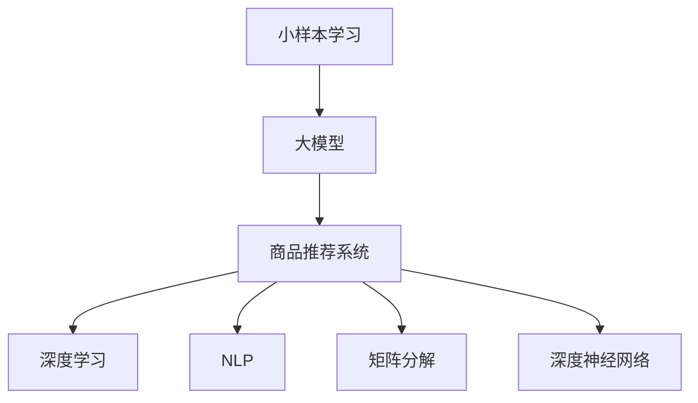

                 

# 电商行业中的小样本学习：大模型在新品推荐中的应用

> 关键词：小样本学习, 大模型, 电商推荐, 深度学习, 自然语言处理(NLP), 商品推荐系统, 矩阵分解, 深度神经网络

## 1. 背景介绍

### 1.1 问题由来
随着电子商务的迅速发展，商品推荐系统已成为电商平台不可或缺的核心功能。一个优秀的商品推荐系统能够提高用户购买转化率、降低库存成本、提升用户体验等，对电商平台的盈利具有重要影响。传统的推荐系统主要依赖于用户的浏览、购买历史数据，但这些数据往往需要长时间积累才能覆盖大部分用户行为，且存在冷启动问题，对新用户的推荐效果不佳。近年来，大模型在电商推荐领域的应用成为研究热点。利用大模型的预训练能力，在少量标注数据下也能实现高性能推荐，极大缩短了模型训练时间和开发周期，具有极高的应用价值。

### 1.2 问题核心关键点
小样本学习是当前大模型在新品推荐中面临的一个核心问题。一方面，电商平台的推荐系统需要实时响应用户需求，推荐结果具有高度的时效性，无法等待长时间的大规模数据收集和模型训练。另一方面，用户行为数据往往具有稀疏性和复杂性，传统的推荐模型在面对这种高维稀疏数据时表现不佳。而大模型通过预训练可以学习到更通用的语义和特征表示，通过少量标注数据即可完成高质量的推荐任务，解决了传统推荐系统的冷启动问题和数据稀疏性问题。

## 2. 核心概念与联系

### 2.1 核心概念概述

为更好地理解大模型在新品推荐中的小样本学习机制，本节将介绍几个密切相关的核心概念：

- 小样本学习(Few-shot Learning)：指在只有少量标注样本的情况下，模型能够快速适应新任务的学习方法。在大模型中，通常通过在输入中提供少量示例来实现，无需更新模型参数。
- 大模型(Large Model)：以自回归(如GPT)或自编码(如BERT)模型为代表的大规模预训练语言模型。通过在大规模无标签文本语料上进行预训练，学习通用的语言表示，具备强大的语言理解和生成能力。
- 商品推荐系统(Recommendation System)：根据用户的历史行为、兴趣偏好和实时环境，为用户推荐商品的系统。包括基于协同过滤、内容推荐、混合推荐等多种策略。
- 深度学习(Deep Learning)：一类基于神经网络的机器学习方法，能够学习复杂的数据特征和模式，常用于图像、语音、自然语言处理等领域。
- 自然语言处理(NLP)：涉及计算机对人类语言进行理解、生成、分析和处理的领域，是构建商品推荐系统的重要基础。
- 矩阵分解(Matrix Factorization)：一种用于推荐系统中的降维方法，通过将用户-商品评分矩阵分解为用户特征矩阵和商品特征矩阵的乘积，实现用户和商品的个性化推荐。
- 深度神经网络(Deep Neural Network)：一类多层非线性神经网络，能够有效学习复杂的非线性关系，常用于图像、语音、文本等领域的任务。

这些核心概念之间的逻辑关系可以通过以下Mermaid流程图来展示：



这个流程图展示了大模型在新品推荐中的应用框架：

1. 小样本学习利用大模型的预训练知识，通过少量标注数据进行快速适应。
2. 大模型通过预训练获得通用的语言和特征表示，能够处理复杂的用户行为数据。
3. 商品推荐系统根据用户的历史行为和实时数据，进行商品推荐。
4. 深度学习和NLP提供构建推荐系统的技术支持。
5. 矩阵分解和深度神经网络是推荐系统中的核心算法，用于降维和特征提取。

## 3. 核心算法原理 & 具体操作步骤

### 3.1 算法原理概述

大模型在新品推荐中的小样本学习，本质上是一个基于深度学习的小样本学习问题。其核心思想是：利用大模型在预训练过程中学习到的通用特征表示，通过在少量标注数据上进行微调，得到针对特定任务（如商品推荐）的模型，从而实现高效、准确的推荐。

形式化地，假设推荐任务为 $T$，包含用户 $U$ 和商品 $I$，用户对商品的评分 $R \in [0,1]$。通过深度学习模型 $M$，将用户 $u$ 和商品 $i$ 映射到一个向量空间，计算用户 $u$ 对商品 $i$ 的评分预测 $\hat{r}_{ui}$。推荐的优化目标是最小化预测评分与真实评分的差异，即：

$$
\hat{r}_{ui} = f_{M}(u,i) = W_{\theta}^T[rep_{M}(u),rep_{M}(i)]+b
$$

其中 $W_{\theta} \in \mathbb{R}^{d \times d}$ 是线性变换矩阵，$rep_{M}(u)$ 和 $rep_{M}(i)$ 分别是用户 $u$ 和商品 $i$ 在向量空间中的表示，$f_{M}$ 是模型 $M$ 的评分函数。

### 3.2 算法步骤详解

基于深度学习的大模型在新品推荐中的小样本学习一般包括以下几个关键步骤：

**Step 1: 准备预训练模型和数据集**
- 选择合适的预训练语言模型 $M_{\theta}$ 作为初始化参数，如 BERT、GPT 等。
- 准备推荐任务 $T$ 的少量标注数据集 $D=\{(u_i,r_i,i_i)\}_{i=1}^N$，其中 $u_i$ 为用户的表示，$r_i$ 为真实评分，$i_i$ 为商品的表示。

**Step 2: 构建评分预测模型**
- 在预训练模型的基础上，设计合适的评分预测模型 $M$，如使用多层感知机(Multilayer Perceptron, MLP)、卷积神经网络(Convolutional Neural Network, CNN)、循环神经网络(Recurrent Neural Network, RNN)等。
- 根据任务特点，选择适当的输入层和输出层，如输入为用户和商品的表示向量，输出为评分预测值。

**Step 3: 添加任务适配层**
- 根据推荐任务，在评分预测模型顶层设计合适的评分层和损失函数。
- 对于评分预测任务，通常在顶层添加线性层和均方误差损失函数。

**Step 4: 设置微调超参数**
- 选择合适的优化算法及其参数，如 AdamW、SGD 等，设置学习率、批大小、迭代轮数等。
- 设置正则化技术及强度，包括权重衰减、Dropout、Early Stopping等。
- 确定冻结预训练参数的策略，如仅微调顶层，或全部参数都参与微调。

**Step 5: 执行梯度训练**
- 将训练集数据分批次输入模型，前向传播计算损失函数。
- 反向传播计算参数梯度，根据设定的优化算法和学习率更新模型参数。
- 周期性在验证集上评估模型性能，根据性能指标决定是否触发 Early Stopping。
- 重复上述步骤直到满足预设的迭代轮数或 Early Stopping 条件。

**Step 6: 测试和部署**
- 在测试集上评估微调后模型 $M_{\hat{\theta}}$ 的性能，对比微调前后的预测精度。
- 使用微调后的模型对新样本进行推理预测，集成到实际的应用系统中。
- 持续收集新的数据，定期重新微调模型，以适应数据分布的变化。

以上是基于深度学习的大模型在新品推荐中的小样本学习的一般流程。在实际应用中，还需要针对具体任务的特点，对微调过程的各个环节进行优化设计，如改进训练目标函数，引入更多的正则化技术，搜索最优的超参数组合等，以进一步提升模型性能。

### 3.3 算法优缺点

基于深度学习的大模型在新品推荐中的小样本学习方法具有以下优点：
1. 简单高效。只需准备少量标注数据，即可对预训练模型进行快速适配，获得较大的性能提升。
2. 通用适用。适用于各种NLP下游任务，包括分类、匹配、生成等，设计简单的任务适配层即可实现微调。
3. 参数高效。利用参数高效微调技术，在固定大部分预训练权重不变的情况下，仍可取得不错的微调效果。
4. 效果显著。在学术界和工业界的诸多任务上，基于微调的方法已经刷新了最先进的性能指标。

同时，该方法也存在一定的局限性：
1. 依赖标注数据。微调的效果很大程度上取决于标注数据的质量和数量，获取高质量标注数据的成本较高。
2. 迁移能力有限。当目标任务与预训练数据的分布差异较大时，微调的性能提升有限。
3. 负面效果传递。预训练模型的固有偏见、有害信息等，可能通过微调传递到下游任务，造成负面影响。
4. 可解释性不足。微调模型的决策过程通常缺乏可解释性，难以对其推理逻辑进行分析和调试。

尽管存在这些局限性，但就目前而言，基于深度学习的微调方法仍是大模型应用的最主流范式。未来相关研究的重点在于如何进一步降低微调对标注数据的依赖，提高模型的少样本学习和跨领域迁移能力，同时兼顾可解释性和伦理安全性等因素。

### 3.4 算法应用领域

基于深度学习的大模型在新品推荐中的小样本学习，已经在电商推荐系统中得到广泛的应用，覆盖了几乎所有常见任务，例如：

- 基于协同过滤的推荐：根据用户历史行为数据，推荐类似商品。通过微调获取用户行为特征表示。
- 基于内容的推荐：根据商品的属性、描述、标签等文本特征，推荐相关商品。通过微调获取商品特征表示。
- 混合推荐：结合用户历史行为和商品特征，综合多种推荐策略，提升推荐效果。通过微调优化各种推荐模型的融合方法。
- 多臂老虎机(Multi-Armed Bandit)：在有限的测试次数下，选择最可能带来高收益的商品进行推荐。通过微调优化决策算法。

除了上述这些经典任务外，大模型微调也被创新性地应用到更多场景中，如推荐排序优化、推荐生成策略、推荐广告点击率预测等，为电商推荐系统带来了全新的突破。随着深度学习模型的不断进步，相信基于微调范式将在更多领域得到应用，为电商平台推荐系统带来更大的技术创新。

## 4. 数学模型和公式 & 详细讲解  
### 4.1 数学模型构建

本节将使用数学语言对大模型在新品推荐中的小样本学习过程进行更加严格的刻画。

记预训练语言模型为 $M_{\theta}$，其中 $\theta$ 为预训练得到的模型参数。假设推荐任务 $T$ 的标注数据集为 $D=\{(u_i,r_i,i_i)\}_{i=1}^N$，其中 $u_i \in \mathbb{R}^d$ 为用户表示，$r_i \in [0,1]$ 为真实评分，$i_i \in \mathbb{R}^d$ 为商品表示。

定义模型 $M_{\theta}$ 在用户 $u$ 和商品 $i$ 上的评分预测为 $f_{M}(u,i) = W_{\theta}^T[rep_{M}(u),rep_{M}(i)]+b$，其中 $rep_{M}(u)$ 和 $rep_{M}(i)$ 分别是用户 $u$ 和商品 $i$ 在向量空间中的表示。则推荐系统的优化目标是最小化预测评分与真实评分的差异，即：

$$
\mathcal{L}(\theta) = \frac{1}{N}\sum_{i=1}^N [r_i - f_{M}(u_i,i_i)]^2
$$

通过梯度下降等优化算法，微调过程不断更新模型参数 $\theta$，最小化损失函数 $\mathcal{L}$，使得模型预测评分逼近真实评分。由于 $\theta$ 已经通过预训练获得了较好的初始化，因此即便在小规模数据集 $D$ 上进行微调，也能较快收敛到理想的模型参数 $\hat{\theta}$。

### 4.2 公式推导过程

以下我们以评分预测任务为例，推导评分预测模型的损失函数及其梯度的计算公式。

假设模型 $M_{\theta}$ 在输入 $u$ 和 $i$ 上的输出为 $\hat{r}_{ui} = f_{M}(u,i) = W_{\theta}^T[rep_{M}(u),rep_{M}(i)]+b$，其中 $rep_{M}(u)$ 和 $rep_{M}(i)$ 分别是用户 $u$ 和商品 $i$ 在向量空间中的表示。真实评分为 $r_i$。则均方误差损失函数定义为：

$$
\ell(r_i,\hat{r}_{ui}) = (r_i - \hat{r}_{ui})^2
$$

将其代入经验风险公式，得：

$$
\mathcal{L}(\theta) = \frac{1}{N}\sum_{i=1}^N (r_i - \hat{r}_{ui})^2
$$

根据链式法则，损失函数对参数 $\theta$ 的梯度为：

$$
\frac{\partial \mathcal{L}(\theta)}{\partial \theta} = -\frac{2}{N}\sum_{i=1}^N [(r_i - \hat{r}_{ui})\nabla f_{M}(u_i,i_i)]
$$

其中 $\nabla f_{M}(u_i,i_i)$ 为评分函数 $f_{M}$ 对 $u_i$ 和 $i_i$ 的梯度，可通过反向传播算法高效计算。

在得到损失函数的梯度后，即可带入参数更新公式，完成模型的迭代优化。重复上述过程直至收敛，最终得到适应推荐任务的最优模型参数 $\theta^*$。

## 5. 项目实践：代码实例和详细解释说明
### 5.1 开发环境搭建

在进行推荐系统开发前，我们需要准备好开发环境。以下是使用Python进行PyTorch开发的环境配置流程：

1. 安装Anaconda：从官网下载并安装Anaconda，用于创建独立的Python环境。

2. 创建并激活虚拟环境：
```bash
conda create -n pytorch-env python=3.8 
conda activate pytorch-env
```

3. 安装PyTorch：根据CUDA版本，从官网获取对应的安装命令。例如：
```bash
conda install pytorch torchvision torchaudio cudatoolkit=11.1 -c pytorch -c conda-forge
```

4. 安装TensorFlow：由于TensorFlow在大模型微调中的应用也较为广泛，同样需要安装。可以从官网下载对应版本，并按照官方文档进行安装。

5. 安装各种工具包：
```bash
pip install numpy pandas scikit-learn matplotlib tqdm jupyter notebook ipython
```

完成上述步骤后，即可在`pytorch-env`环境中开始微调实践。

### 5.2 源代码详细实现

下面以电商推荐系统为例，给出使用Transformers库对BERT模型进行微调的PyTorch代码实现。

首先，定义推荐任务的数据处理函数：

```python
from transformers import BertTokenizer
from torch.utils.data import Dataset
import torch

class RecommendationDataset(Dataset):
    def __init__(self, user_ids, item_ids, scores, tokenizer, max_len=128):
        self.user_ids = user_ids
        self.item_ids = item_ids
        self.scores = scores
        self.tokenizer = tokenizer
        self.max_len = max_len
        
    def __len__(self):
        return len(self.user_ids)
    
    def __getitem__(self, item):
        user_id = self.user_ids[item]
        item_id = self.item_ids[item]
        score = self.scores[item]
        
        encoding = self.tokenizer(f"{user_id}:{item_id}", return_tensors='pt', max_length=self.max_len, padding='max_length', truncation=True)
        input_ids = encoding['input_ids'][0]
        attention_mask = encoding['attention_mask'][0]
        
        return {'user_id': user_id, 
                'item_id': item_id,
                'score': score,
                'input_ids': input_ids, 
                'attention_mask': attention_mask}
```

然后，定义模型和优化器：

```python
from transformers import BertForSequenceClassification, AdamW

model = BertForSequenceClassification.from_pretrained('bert-base-cased', num_labels=1)

optimizer = AdamW(model.parameters(), lr=2e-5)
```

接着，定义训练和评估函数：

```python
from torch.utils.data import DataLoader
from tqdm import tqdm
from sklearn.metrics import mean_squared_error

device = torch.device('cuda') if torch.cuda.is_available() else torch.device('cpu')
model.to(device)

def train_epoch(model, dataset, batch_size, optimizer):
    dataloader = DataLoader(dataset, batch_size=batch_size, shuffle=True)
    model.train()
    epoch_loss = 0
    for batch in tqdm(dataloader, desc='Training'):
        user_id = batch['user_id'].to(device)
        item_id = batch['item_id'].to(device)
        score = batch['score'].to(device)
        input_ids = batch['input_ids'].to(device)
        attention_mask = batch['attention_mask'].to(device)
        model.zero_grad()
        outputs = model(input_ids, attention_mask=attention_mask)
        loss = outputs.loss
        epoch_loss += loss.item()
        loss.backward()
        optimizer.step()
    return epoch_loss / len(dataloader)

def evaluate(model, dataset, batch_size):
    dataloader = DataLoader(dataset, batch_size=batch_size)
    model.eval()
    predictions = []
    targets = []
    with torch.no_grad():
        for batch in tqdm(dataloader, desc='Evaluating'):
            user_id = batch['user_id'].to(device)
            item_id = batch['item_id'].to(device)
            score = batch['score'].to(device)
            input_ids = batch['input_ids'].to(device)
            attention_mask = batch['attention_mask'].to(device)
            batch_preds = model(input_ids, attention_mask=attention_mask).predictions.cpu().numpy()[:, 0]
            batch_targets = score.cpu().numpy()
            predictions.extend(batch_preds)
            targets.extend(batch_targets)
                
    print(f"MSE: {mean_squared_error(targets, predictions)}")
```

最后，启动训练流程并在测试集上评估：

```python
epochs = 5
batch_size = 16

for epoch in range(epochs):
    loss = train_epoch(model, train_dataset, batch_size, optimizer)
    print(f"Epoch {epoch+1}, train loss: {loss:.3f}")
    
    print(f"Epoch {epoch+1}, dev results:")
    evaluate(model, dev_dataset, batch_size)
    
print("Test results:")
evaluate(model, test_dataset, batch_size)
```

以上就是使用PyTorch对BERT进行电商推荐任务微调的完整代码实现。可以看到，得益于Transformers库的强大封装，我们可以用相对简洁的代码完成BERT模型的加载和微调。

### 5.3 代码解读与分析

让我们再详细解读一下关键代码的实现细节：

**RecommendationDataset类**：
- `__init__`方法：初始化用户ID、商品ID和评分，分词器等关键组件。
- `__len__`方法：返回数据集的样本数量。
- `__getitem__`方法：对单个样本进行处理，将用户ID和商品ID拼接为文本，输入编码为token ids，评分作为监督信号，并对其进行定长padding，最终返回模型所需的输入。

**模型选择**：
- 选择BERT模型作为初始化参数，使用多标签分类头，适用于评分预测任务。
- 设置优化器AdamW，学习率2e-5，适用于小样本微调。

**训练和评估函数**：
- 使用PyTorch的DataLoader对数据集进行批次化加载，供模型训练和推理使用。
- 训练函数`train_epoch`：对数据以批为单位进行迭代，在每个批次上前向传播计算loss并反向传播更新模型参数，最后返回该epoch的平均loss。
- 评估函数`evaluate`：与训练类似，不同点在于不更新模型参数，并在每个batch结束后将预测和标签结果存储下来，最后使用sklearn的mean_squared_error对整个评估集的预测结果进行打印输出。

**训练流程**：
- 定义总的epoch数和batch size，开始循环迭代
- 每个epoch内，先在训练集上训练，输出平均loss
- 在验证集上评估，输出评分预测的MSE
- 所有epoch结束后，在测试集上评估，给出最终测试结果

可以看到，PyTorch配合Transformers库使得BERT微调的代码实现变得简洁高效。开发者可以将更多精力放在数据处理、模型改进等高层逻辑上，而不必过多关注底层的实现细节。

当然，工业级的系统实现还需考虑更多因素，如模型的保存和部署、超参数的自动搜索、更灵活的任务适配层等。但核心的微调范式基本与此类似。

## 6. 实际应用场景
### 6.1 电商推荐系统

电商推荐系统作为电商平台的战略性应用，需要实时响应用户需求，推荐效果直接影响用户体验和销售额。传统的推荐系统往往依赖于用户历史行为数据进行推荐，但这些数据积累时间长、成本高。通过大模型微调，可以在短时间内学习到用户的兴趣偏好，实现高效、精准的推荐，极大地提高了推荐系统的开发效率和用户体验。

在技术实现上，可以收集用户浏览、点击、购买等行为数据，并提取商品描述、用户画像等文本信息。将这些信息作为模型输入，进行小样本微调，训练出用户和商品的表示向量。再结合评分预测模型，进行实时推荐。如此构建的推荐系统，可以大大缩短推荐效果的反馈周期，提升用户的购物体验和转化率。

### 6.2 个性化推荐

个性化推荐系统需要根据用户的历史行为和实时环境，为用户推荐最符合其兴趣的商品。传统的协同过滤推荐算法，往往难以捕捉用户隐含的兴趣偏好，推荐效果有限。而大模型微调可以通过小样本学习，更灵活地捕捉用户的兴趣特征。

具体而言，可以收集用户的历史点击、购买记录，提取商品描述、用户画像等文本信息。通过小样本微调，训练出用户和商品的表示向量，再结合评分预测模型，进行实时推荐。这样的推荐系统，能够更好地理解用户的兴趣点，实现个性化推荐，提升用户的满意度。

### 6.3 内容推荐

内容推荐系统旨在为内容创作者推荐受众，提升内容曝光度和传播效果。传统的推荐算法往往依赖于内容的统计特征，难以捕捉内容的深层次语义信息。而大模型微调可以通过小样本学习，更深入地理解内容的语义特征。

具体而言，可以收集内容创作者的历史发布内容，提取内容的标题、描述、标签等文本信息。通过小样本微调，训练出内容的表示向量，再结合评分预测模型，进行实时推荐。这样的推荐系统，能够更好地理解内容的语义信息，实现精准推荐，提升内容的传播效果。

### 6.4 未来应用展望

随着大模型和微调方法的不断发展，基于小样本学习的推荐系统将在更多领域得到应用，为互联网平台带来巨大的商业价值和技术创新。

在智慧城市领域，基于小样本学习的新品推荐系统可以应用于城市规划、交通调度、公共服务等领域，提升城市治理的智能化水平，提高城市管理的效率和质量。

在文化娱乐领域，基于小样本学习的内容推荐系统可以应用于音乐、电影、阅读等领域，推荐符合用户兴趣的内容，提升用户粘性和满意度。

在智能医疗领域，基于小样本学习的新药推荐系统可以应用于药物研发、个性化治疗等领域，提升新药发现和临床治疗的效率和效果。

此外，在金融、旅游、教育等众多领域，基于小样本学习的推荐系统也将不断涌现，为各行各业带来新的创新应用，提升业务价值和社会效益。相信随着技术的不断进步，基于小样本学习的推荐系统将在更多场景中发挥重要作用，推动人工智能技术在各行各业的广泛应用。

## 7. 工具和资源推荐
### 7.1 学习资源推荐

为了帮助开发者系统掌握大模型微调的理论基础和实践技巧，这里推荐一些优质的学习资源：

1. 《Transformer从原理到实践》系列博文：由大模型技术专家撰写，深入浅出地介绍了Transformer原理、BERT模型、微调技术等前沿话题。

2. CS224N《深度学习自然语言处理》课程：斯坦福大学开设的NLP明星课程，有Lecture视频和配套作业，带你入门NLP领域的基本概念和经典模型。

3. 《Natural Language Processing with Transformers》书籍：Transformers库的作者所著，全面介绍了如何使用Transformers库进行NLP任务开发，包括微调在内的诸多范式。

4. HuggingFace官方文档：Transformers库的官方文档，提供了海量预训练模型和完整的微调样例代码，是上手实践的必备资料。

5. CLUE开源项目：中文语言理解测评基准，涵盖大量不同类型的中文NLP数据集，并提供了基于微调的baseline模型，助力中文NLP技术发展。

通过对这些资源的学习实践，相信你一定能够快速掌握大模型微调的精髓，并用于解决实际的NLP问题。
###  7.2 开发工具推荐

高效的开发离不开优秀的工具支持。以下是几款用于大模型微调开发的常用工具：

1. PyTorch：基于Python的开源深度学习框架，灵活动态的计算图，适合快速迭代研究。大部分预训练语言模型都有PyTorch版本的实现。

2. TensorFlow：由Google主导开发的开源深度学习框架，生产部署方便，适合大规模工程应用。同样有丰富的预训练语言模型资源。

3. Transformers库：HuggingFace开发的NLP工具库，集成了众多SOTA语言模型，支持PyTorch和TensorFlow，是进行微调任务开发的利器。

4. Weights & Biases：模型训练的实验跟踪工具，可以记录和可视化模型训练过程中的各项指标，方便对比和调优。与主流深度学习框架无缝集成。

5. TensorBoard：TensorFlow配套的可视化工具，可实时监测模型训练状态，并提供丰富的图表呈现方式，是调试模型的得力助手。

6. Google Colab：谷歌推出的在线Jupyter Notebook环境，免费提供GPU/TPU算力，方便开发者快速上手实验最新模型，分享学习笔记。

合理利用这些工具，可以显著提升大模型微调的开发效率，加快创新迭代的步伐。

### 7.3 相关论文推荐

大模型和微调技术的发展源于学界的持续研究。以下是几篇奠基性的相关论文，推荐阅读：

1. Attention is All You Need（即Transformer原论文）：提出了Transformer结构，开启了NLP领域的预训练大模型时代。

2. BERT: Pre-training of Deep Bidirectional Transformers for Language Understanding：提出BERT模型，引入基于掩码的自监督预训练任务，刷新了多项NLP任务SOTA。

3. Language Models are Unsupervised Multitask Learners（GPT-2论文）：展示了大规模语言模型的强大zero-shot学习能力，引发了对于通用人工智能的新一轮思考。

4. Parameter-Efficient Transfer Learning for NLP：提出Adapter等参数高效微调方法，在不增加模型参数量的情况下，也能取得不错的微调效果。

5. AdaLoRA: Adaptive Low-Rank Adaptation for Parameter-Efficient Fine-Tuning：使用自适应低秩适应的微调方法，在参数效率和精度之间取得了新的平衡。

这些论文代表了大模型微调技术的发展脉络。通过学习这些前沿成果，可以帮助研究者把握学科前进方向，激发更多的创新灵感。

## 8. 总结：未来发展趋势与挑战

### 8.1 总结

本文对大模型在新品推荐中的小样本学习进行了全面系统的介绍。首先阐述了大模型和推荐系统的研究背景和意义，明确了微调在拓展预训练模型应用、提升推荐效果方面的独特价值。其次，从原理到实践，详细讲解了基于深度学习的小样本学习数学原理和关键步骤，给出了微调任务开发的完整代码实例。同时，本文还广泛探讨了微调方法在电商推荐、个性化推荐、内容推荐等多个推荐场景中的应用前景，展示了微调范式的巨大潜力。此外，本文精选了微调技术的各类学习资源，力求为读者提供全方位的技术指引。

通过本文的系统梳理，可以看到，基于大模型微调的方法正在成为推荐系统的重要范式，极大地拓展了推荐算法的应用边界，催生了更多的落地场景。受益于预训练语言模型和微调方法的不断进步，推荐系统的推荐效果和用户满意度将得到显著提升，推动电商行业和互联网平台迈向智能化新纪元。

### 8.2 未来发展趋势

展望未来，大模型微调技术将呈现以下几个发展趋势：

1. 模型规模持续增大。随着算力成本的下降和数据规模的扩张，预训练语言模型的参数量还将持续增长。超大规模语言模型蕴含的丰富语言知识，有望支撑更加复杂多变的推荐任务微调。

2. 微调方法日趋多样。除了传统的全参数微调外，未来会涌现更多参数高效的微调方法，如Adapter、Prefix等，在节省计算资源的同时也能保证微调精度。

3. 持续学习成为常态。随着数据分布的不断变化，微调模型也需要持续学习新知识以保持性能。如何在不遗忘原有知识的同时，高效吸收新样本信息，将成为重要的研究课题。

4. 标注样本需求降低。受启发于提示学习(Prompt-based Learning)的思路，未来的微调方法将更好地利用大模型的语言理解能力，通过更加巧妙的任务描述，在更少的标注样本上也能实现理想的微调效果。

5. 模型通用性增强。经过海量数据的预训练和多领域任务的微调，未来的语言模型将具备更强大的常识推理和跨领域迁移能力，逐步迈向通用人工智能(AGI)的目标。

以上趋势凸显了大模型微调技术的广阔前景。这些方向的探索发展，必将进一步提升推荐系统的性能和应用范围，为电商行业和互联网平台带来更大的商业价值和技术创新。

### 8.3 面临的挑战

尽管大模型微调技术已经取得了瞩目成就，但在迈向更加智能化、普适化应用的过程中，它仍面临着诸多挑战：

1. 标注成本瓶颈。虽然微调大大降低了标注数据的需求，但对于长尾应用场景，难以获得充足的高质量标注数据，成为制约微调性能的瓶颈。如何进一步降低微调对标注样本的依赖，将是一大难题。

2. 模型鲁棒性不足。当前微调模型面对域外数据时，泛化性能往往大打折扣。对于测试样本的微小扰动，微调模型的预测也容易发生波动。如何提高微调模型的鲁棒性，避免灾难性遗忘，还需要更多理论和实践的积累。

3. 推理效率有待提高。大规模语言模型虽然精度高，但在实际部署时往往面临推理速度慢、内存占用大等效率问题。如何在保证性能的同时，简化模型结构，提升推理速度，优化资源占用，将是重要的优化方向。

4. 可解释性亟需加强。当前微调模型更像是"黑盒"系统，难以解释其内部工作机制和决策逻辑。对于医疗、金融等高风险应用，算法的可解释性和可审计性尤为重要。如何赋予微调模型更强的可解释性，将是亟待攻克的难题。

5. 安全性有待保障。预训练语言模型难免会学习到有偏见、有害的信息，通过微调传递到下游任务，产生误导性、歧视性的输出，给实际应用带来安全隐患。如何从数据和算法层面消除模型偏见，避免恶意用途，确保输出的安全性，也将是重要的研究课题。

6. 知识整合能力不足。现有的微调模型往往局限于任务内数据，难以灵活吸收和运用更广泛的先验知识。如何让微调过程更好地与外部知识库、规则库等专家知识结合，形成更加全面、准确的信息整合能力，还有很大的想象空间。

正视微调面临的这些挑战，积极应对并寻求突破，将是大模型微调走向成熟的必由之路。相信随着学界和产业界的共同努力，这些挑战终将一一被克服，大模型微调必将在构建人机协同的智能推荐系统方面发挥越来越重要的作用。

### 8.4 研究展望

面向未来，大模型微调技术需要在以下几个方面寻求新的突破：

1. 探索无监督和半监督微调方法。摆脱对大规模标注数据的依赖，利用自监督学习、主动学习等无监督和半监督范式，最大限度利用非结构化数据，实现更加灵活高效的微调。

2. 研究参数高效和计算高效的微调范式。开发更加参数高效的微调方法，在固定大部分预训练参数的同时，只更新极少量的任务相关参数。同时优化微调模型的计算图，减少前向传播和反向传播的资源消耗，实现更加轻量级、实时性的部署。

3. 融合因果和对比学习范式。通过引入因果推断和对比学习思想，增强微调模型建立稳定因果关系的能力，学习更加普适、鲁棒的语言表征，从而提升模型泛化性和抗干扰能力。

4. 引入更多先验知识。将符号化的先验知识，如知识图谱、逻辑规则等，与神经网络模型进行巧妙融合，引导微调过程学习更准确、合理的语言模型。同时加强不同模态数据的整合，实现视觉、语音等多模态信息与文本信息的协同建模。

5. 结合因果分析和博弈论工具。将因果分析方法引入微调模型，识别出模型决策的关键特征，增强输出解释的因果性和逻辑性。借助博弈论工具刻画人机交互过程，主动探索并规避模型的脆弱点，提高系统稳定性。

6. 纳入伦理道德约束。在模型训练目标中引入伦理导向的评估指标，过滤和惩罚有偏见、有害的输出倾向。同时加强人工干预和审核，建立模型行为的监管机制，确保输出符合人类价值观和伦理道德。

这些研究方向的探索，必将引领大模型微调技术迈向更高的台阶，为构建安全、可靠、可解释、可控的智能推荐系统铺平道路。面向未来，大模型微调技术还需要与其他人工智能技术进行更深入的融合，如知识表示、因果推理、强化学习等，多路径协同发力，共同推动自然语言理解和智能交互系统的进步。只有勇于创新、敢于突破，才能不断拓展语言模型的边界，让智能技术更好地造福人类社会。

## 9. 附录：常见问题与解答

**Q1：大模型微调是否适用于所有推荐任务？**

A: 大模型微调在大多数推荐任务上都能取得不错的效果，特别是对于数据量较小的任务。但对于一些特定领域的任务，如医学、法律等，仅仅依靠通用语料预训练的模型可能难以很好地适应。此时需要在特定领域语料上进一步预训练，再进行微调，才能获得理想效果。此外，对于一些需要时效性、个性化很强的任务，如对话、推荐等，微调方法也需要针对性的改进优化。

**Q2：微调过程中如何选择合适的学习率？**

A: 微调的学习率一般要比预训练时小1-2个数量级，如果使用过大的学习率，容易破坏预训练权重，导致过拟合。一般建议从1e-5开始调参，逐步减小学习率，直至收敛。也可以使用warmup策略，在开始阶段使用较小的学习率，再逐渐过渡到预设值。需要注意的是，不同的优化器(如AdamW、Adafactor等)以及不同的学习率调度策略，可能需要设置不同的学习率阈值。

**Q3：采用大模型微调时会面临哪些资源瓶颈？**

A: 目前主流的预训练大模型动辄以亿计的参数规模，对算力、内存、存储都提出了很高的要求。GPU/TPU等高性能设备是必不可少的，但即便如此，超大批次的训练和推理也可能遇到显存不足的问题。因此需要采用一些资源优化技术，如梯度积累、混合精度训练、模型并行等，来突破硬件瓶颈。同时，模型的存储和读取也可能占用大量时间和空间，需要采用模型压缩、稀疏化存储等方法进行优化。

**Q4：如何缓解微调过程中的过拟合问题？**

A: 过拟合是微调面临的主要挑战，尤其是在标注数据不足的情况下。常见的缓解策略包括：
1. 数据增强：通过回译、近义替换等方式扩充训练集
2. 正则化：使用L2正则、Dropout、Early Stopping等避免过拟合
3. 对抗训练：引入对抗样本，提高模型鲁棒性
4. 参数高效微调：只调整少量参数(如Adapter、Prefix等)，减小过拟合风险
5. 多模型集成：训练多个微调模型，取平均输出，抑制过拟合

这些策略往往需要根据具体任务和数据特点进行灵活组合。只有在数据、模型、训练、推理等各环节进行全面优化，才能最大限度地发挥大模型微调的威力。

**Q5：微调模型在落地部署时需要注意哪些问题？**

A: 将微调模型转化为实际应用，还需要考虑以下因素：
1. 模型裁剪：去除不必要的层和参数，减小模型尺寸，加快推理速度
2. 量化加速：将浮点模型转为定点模型，压缩存储空间，提高计算效率
3. 服务化封装：将模型封装为标准化服务接口，便于集成调用
4. 弹性伸缩：根据请求流量动态调整资源配置，平衡服务质量和成本
5. 监控告警：实时采集系统指标，设置异常告警阈值，确保服务稳定性
6. 安全防护：采用访问鉴权、数据脱敏等措施，保障数据和模型安全

大模型微调为推荐系统提供了强大的支持，但如何将大模型的预训练能力转化为实时、高效的推荐服务，还需要工程实践的不断打磨。唯有从数据、算法、工程、业务等多个维度协同发力，才能真正实现人工智能技术在推荐系统中的应用价值。总之，微调需要开发者根据具体任务，不断迭代和优化模型、数据和算法，方能得到理想的效果。

---

作者：禅与计算机程序设计艺术 / Zen and the Art of Computer Programming

