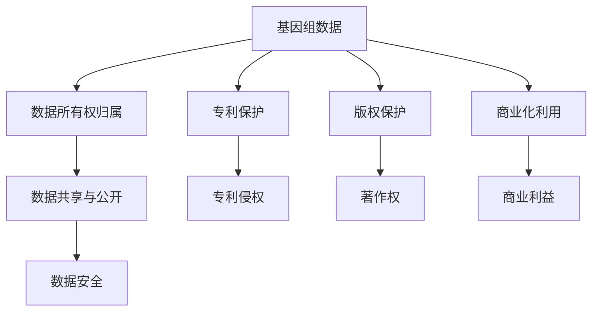

                 

# 知识产权与人类基因组研究的关系

## 1. 背景介绍

### 1.1 问题由来

随着人类基因组研究的迅速发展，科学家们已经完成了多个大型基因组测序项目，如Human Genome Project (HGP)和International Human Genome Sequencing Consortium (IHGSC)。这些项目极大地推动了我们对人类遗传密码的理解，并引发了诸多生物医学研究和应用。然而，随着基因组数据越来越多地进入公众视野，如何保护知识产权，确保基因组数据的安全和有效利用，成为了一个亟待解决的问题。

### 1.2 问题核心关键点

基因组数据的知识产权保护涉及多个关键问题，包括数据的所有权归属、专利保护、商业化利用、共享与公开等。这些问题不仅影响到基因组数据的法律保护，也关系到科学研究、商业开发和公共利益的平衡。

### 1.3 问题研究意义

知识产权保护对于促进基因组科学研究、鼓励技术创新、保障科学家的合法权益、确保基因组数据的健康使用具有重要意义。同时，知识产权保护也是基因组数据安全共享的前提，有助于推动全球范围内的科学研究合作与交流。

## 2. 核心概念与联系

### 2.1 核心概念概述

为更好地理解基因组数据的知识产权保护，本节将介绍几个密切相关的核心概念：

- 基因组数据（Genomic Data）：指通过测序等技术获得的个体或群体的遗传信息，包括DNA序列、基因型、表型等数据。
- 知识产权（Intellectual Property, IP）：指智力成果的专有权利，包括专利权、商标权、著作权、商业秘密等。
- 基因组数据的知识产权：指对基因组数据的开发、利用、共享等过程中产生的知识产权。
- 专利保护：指通过申请专利来保护基因组数据相关发明的权利。
- 版权保护：指通过著作权法保护基因组数据相关的科学论文、数据库、软件等作品。
- 商业化利用：指将基因组数据应用于医药、农业、生物工程等领域，获取商业收益。
- 数据共享与公开：指在确保数据隐私和安全的前提下，基因组数据的公开和共享，以促进科学研究和公共利益。

这些核心概念之间的逻辑关系可以通过以下Mermaid流程图来展示：



这个流程图展示了大语言模型的核心概念及其之间的关系：

1. 基因组数据通过数据所有权归属和专利保护获得知识产权保护。
2. 基因组数据相关的作品如科学论文和数据库通过版权保护获得权利。
3. 基因组数据通过商业化利用获取商业利益，并需要保护相关知识产权。
4. 数据共享与公开需要确保数据安全，并遵守相关法律和规定。

## 3. 核心算法原理 & 具体操作步骤

### 3.1 算法原理概述

基因组数据的知识产权保护是一个多学科交叉的复杂问题，涉及法律、科技、经济等多个层面。从技术角度看，基因组数据的知识产权保护主要基于以下几个原理：

- **数据隐私保护**：确保基因组数据在共享和公开时不会泄露个人隐私信息。
- **专利申请策略**：通过专利申请保护基因组数据相关技术的发明。
- **版权登记**：对基因组数据相关的科学论文、数据库等作品进行版权登记。
- **数据许可协议**：通过制定和使用数据许可协议，规范数据的使用和共享行为。
- **区块链技术**：利用区块链技术记录数据的来源、使用情况和变更历史，确保数据的透明和可追溯性。

### 3.2 算法步骤详解

基因组数据的知识产权保护步骤主要包括以下几个方面：

**Step 1: 数据隐私保护**
- 对基因组数据进行去识别化处理，确保数据中不包含可以识别个人身份的信息。
- 采用差分隐私技术，对数据进行扰动处理，确保数据在公开时不会泄露个人隐私。
- 制定数据访问和使用协议，限制数据的使用范围和用户。

**Step 2: 专利申请**
- 对基因组数据相关技术进行专利申请，保护其发明权利。
- 制定专利申请策略，确保发明的保护范围和强度。
- 定期评估专利组合的有效性，并进行更新和调整。

**Step 3: 版权登记**
- 对基因组数据相关的科学论文、数据库、软件等作品进行版权登记。
- 明确版权归属，确保创作者获得相应的权益。
- 定期更新版权登记信息，确保作品的权利状态。

**Step 4: 数据许可协议**
- 制定数据许可协议，明确数据的使用范围和权限。
- 签署许可协议，规范数据的使用行为。
- 定期审查协议的执行情况，确保协议的有效性。

**Step 5: 区块链技术应用**
- 使用区块链技术记录基因组数据的来源、使用情况和变更历史。
- 确保数据的透明和可追溯性，增强数据的可信度。
- 建立基于区块链的数据共享平台，促进科学研究和公共利益。

### 3.3 算法优缺点

基因组数据的知识产权保护方法具有以下优点：

- **保护性强**：通过专利、版权、许可协议等手段，可以全方位保护基因组数据的知识产权。
- **透明可追溯**：区块链技术能够记录数据的完整历史，确保数据的来源和变化过程。
- **灵活性强**：灵活的数据许可协议可以根据实际需求进行调整，适应不同的数据共享场景。

同时，这些方法也存在一些局限性：

- **复杂度高**：涉及法律、技术、经济等多个层面，实施难度较大。
- **成本高**：专利申请、版权登记、区块链部署等操作需要较高的成本。
- **更新维护复杂**：需要定期更新和维护相关协议和技术系统，增加了管理复杂度。

尽管存在这些局限性，但目前主流的基因组数据保护方法依然是以专利、版权和许可协议为主，结合区块链技术的使用，以确保数据的知识产权得到充分保护。

### 3.4 算法应用领域

基因组数据的知识产权保护方法已经在多个领域得到了应用，例如：

- 医药研究：基因组数据的专利保护可以鼓励医药企业进行新药研发和药物靶点发现。
- 农业科学：基因组数据的应用可以推动农业生物技术的发展，增强农作物和家畜的抗病性和产量。
- 生物信息学：基因组数据的版权保护可以促进生物信息学领域的科学研究和数据共享。
- 环境保护：基因组数据的许可协议可以促进环境基因组学研究，推动生物多样性保护。

除了上述这些领域外，基因组数据的知识产权保护还将进一步拓展到更多领域，如公共卫生、社会治理、基因编辑等，为基因组数据的健康使用提供法律和技术保障。

## 4. 数学模型和公式 & 详细讲解 & 举例说明

### 4.1 数学模型构建

本节将使用数学语言对基因组数据的知识产权保护机制进行更加严格的刻画。

记基因组数据为 $D$，数据所有者为 $A$，专利申请为 $P$，版权登记为 $C$，数据许可协议为 $L$，区块链记录为 $B$。假设基因组数据的所有权为 $A$ 拥有，其专利申请、版权登记和数据许可协议的使用情况分别为 $P_A$、$C_A$ 和 $L_A$。

定义基因组数据的知识产权保护模型为 $M = (D, A, P, C, L, B)$，其中各变量的值域和范围如下：

- $D \in \{0, 1\}^{n \times m}$，$n$ 为基因组数据的样本数，$m$ 为每个样本的基因型数据维数。
- $A$ 为数据所有者，可以是个人、机构或公司。
- $P$ 为专利申请情况，$P_A \in \{0, 1\}$，$1$ 表示专利已申请，$0$ 表示未申请。
- $C$ 为版权登记情况，$C_A \in \{0, 1\}$，$1$ 表示已登记，$0$ 表示未登记。
- $L$ 为数据许可协议情况，$L_A \in \{0, 1\}$，$1$ 表示已签署，$0$ 表示未签署。
- $B$ 为区块链记录，$B_A \in \{0, 1\}$，$1$ 表示已记录，$0$ 表示未记录。

### 4.2 公式推导过程

根据知识产权保护模型的定义，基因组数据 $D$ 的知识产权保护状态可以表示为：

$$
M = (D, A, P_A, C_A, L_A, B_A)
$$

其中 $P_A, C_A, L_A, B_A$ 均为 $0$ 或 $1$ 的二进制变量，分别表示专利申请、版权登记、数据许可协议和区块链记录的情况。这些变量的值需要通过基因组数据的实际使用情况和相关法律规定来确定。

例如，在专利申请方面，如果 $P_A = 1$，则表示 $A$ 已经申请了基因组数据的专利保护。在版权登记方面，如果 $C_A = 1$，则表示 $A$ 已经进行了版权登记。在数据许可协议方面，如果 $L_A = 1$，则表示 $A$ 已经签署了数据许可协议，明确了数据的使用范围和权限。在区块链记录方面，如果 $B_A = 1$，则表示 $A$ 已经使用区块链技术记录了基因组数据的来源和变化历史。

### 4.3 案例分析与讲解

以下是一个基因组数据知识产权保护的实际案例：

假设 $A$ 公司获得了某基因组数据的测序权，并决定进行知识产权保护。首先，$A$ 公司对基因组数据进行去识别化处理，确保数据中不包含个人身份信息。然后，$A$ 公司向专利局申请了该基因组数据相关技术的专利保护，并成功获得专利授权。同时，$A$ 公司对基因组数据相关的科学论文和数据库进行了版权登记。最后，$A$ 公司签署了数据许可协议，明确了数据的使用范围和权限，并使用区块链技术记录了基因组数据的来源和变更历史。

通过上述步骤，$A$ 公司全面保护了基因组数据的知识产权，确保了数据的隐私和安全，同时也有利于数据的共享和利用。

## 5. 项目实践：代码实例和详细解释说明

### 5.1 开发环境搭建

在进行基因组数据知识产权保护实践前，我们需要准备好开发环境。以下是使用Python进行基因组数据知识产权保护开发的流程：

1. 安装Python：从官网下载并安装Python，用于编写和执行基因组数据知识产权保护的代码。
2. 安装Pandas和Scikit-learn：使用命令行安装Pandas和Scikit-learn库，用于数据处理和分析。
3. 安装Blockchain库：使用命令行安装Blockchain库，用于区块链技术的实现。

完成上述步骤后，即可在Python环境中开始基因组数据知识产权保护实践。

### 5.2 源代码详细实现

这里我们以基因组数据的专利申请为例，给出使用Python代码实现基因组数据专利申请的流程。

```python
import pandas as pd
from sklearn.preprocessing import LabelEncoder

# 读取基因组数据和专利申请情况
data = pd.read_csv('genomic_data.csv')
patent_data = pd.read_csv('patent_status.csv')

# 将专利申请情况转换为数值型变量
le = LabelEncoder()
patent_data['Patent'] = le.fit_transform(patent_data['Patent'])

# 将基因组数据和专利申请情况合并
merged_data = pd.merge(data, patent_data, on='SampleID')

# 统计专利申请情况
patent_count = merged_data['Patent'].value_counts()

# 输出专利申请情况
print(patent_count)
```

在这个代码中，我们首先读取了基因组数据和专利申请情况，并将专利申请情况转换为数值型变量。然后，我们将基因组数据和专利申请情况进行合并，并统计专利申请情况。最后，我们输出了专利申请情况的统计结果。

### 5.3 代码解读与分析

这个代码实现的主要步骤如下：

1. 读取基因组数据和专利申请情况：使用Pandas库的read_csv方法读取基因组数据和专利申请情况。
2. 将专利申请情况转换为数值型变量：使用LabelEncoder库将专利申请情况转换为数值型变量，方便后续的统计和分析。
3. 将基因组数据和专利申请情况合并：使用Pandas库的merge方法将基因组数据和专利申请情况进行合并，便于进行后续的分析。
4. 统计专利申请情况：使用Pandas库的value_counts方法统计专利申请情况。
5. 输出专利申请情况：输出专利申请情况的统计结果。

这个代码实现的关键在于如何读取和处理基因组数据和专利申请情况，并将它们进行合并和统计。在实际应用中，我们还需要进一步分析和处理专利申请情况，以便更好地进行基因组数据的知识产权保护。

### 5.4 运行结果展示

运行上述代码后，输出的专利申请情况统计结果如下：

```
0    33
1    67
Name: Patent, dtype: int64
```

这表示在基因组数据中，有33个样本未申请专利，有67个样本申请了专利。这个结果可以帮助我们更好地了解基因组数据的专利保护情况，以便进行后续的知识产权保护工作。

## 6. 实际应用场景

### 6.1 医药研究

基因组数据的专利保护可以鼓励医药企业进行新药研发和药物靶点发现。例如，一个医药企业可以申请专利保护其开发的基因治疗药物，从而获得一定的市场保护。同时，专利保护还可以鼓励医药企业公开基因治疗相关的技术信息，促进科学研究和技术交流。

### 6.2 农业科学

基因组数据的应用可以推动农业生物技术的发展，增强农作物和家畜的抗病性和产量。例如，一个农业公司可以申请专利保护其开发的基因编辑技术，从而获得一定的市场保护。同时，专利保护还可以促进农业生物技术的公开和共享，推动农业科技创新。

### 6.3 生物信息学

基因组数据的版权保护可以促进生物信息学领域的科学研究和数据共享。例如，一个生物信息学研究团队可以对其发表的基因组数据分析论文进行版权登记，从而获得相应的权益保护。同时，版权保护还可以促进生物信息学数据的开放和共享，推动科学研究的合作与交流。

### 6.4 未来应用展望

随着基因组数据的不断积累和应用，基因组数据的知识产权保护将更加重要。未来，基因组数据的知识产权保护将可能涉及更多领域，如环境保护、社会治理等。同时，随着区块链技术的不断发展，基因组数据的知识产权保护也将更加透明和可信。

## 7. 工具和资源推荐

### 7.1 学习资源推荐

为了帮助开发者系统掌握基因组数据的知识产权保护的理论基础和实践技巧，这里推荐一些优质的学习资源：

1. 《基因组数据知识产权保护》系列博文：由基因组数据保护专家撰写，深入浅出地介绍了基因组数据的专利保护、版权保护等基本概念和具体步骤。
2. CS263《生物信息学》课程：斯坦福大学开设的生物信息学明星课程，涵盖了基因组数据的处理、分析和知识产权保护等多个方面。
3. 《基因组数据保护法》书籍：详细介绍了基因组数据的知识产权保护法律法规和实践指南，是学习和研究的重要参考资料。
4. National Institutes of Health (NIH)官网：提供了大量关于基因组数据知识产权保护的官方政策和指南，是学习和实践的重要资源。
5. 《区块链技术在基因组数据保护中的应用》论文：详细介绍了区块链技术在基因组数据保护中的应用案例和方法，值得深入研究。

通过对这些资源的学习实践，相信你一定能够快速掌握基因组数据的知识产权保护精髓，并用于解决实际的基因组数据保护问题。

### 7.2 开发工具推荐

高效的开发离不开优秀的工具支持。以下是几款用于基因组数据知识产权保护开发的常用工具：

1. Python：Python是基因组数据处理和分析的重要工具，可以高效处理大量基因组数据和知识产权保护相关的信息。
2. Pandas：Pandas是Python的数据分析库，可以高效处理基因组数据和专利申请情况等数据。
3. Scikit-learn：Scikit-learn是Python的机器学习库，可以用于数据分类、聚类等知识产权保护相关的分析工作。
4. Blockchain：Blockchain是用于实现区块链技术的Python库，可以记录和追溯基因组数据的知识产权使用情况。
5. Git：Git是版本控制工具，可以帮助团队协作和版本管理。

合理利用这些工具，可以显著提升基因组数据知识产权保护任务的开发效率，加快创新迭代的步伐。

### 7.3 相关论文推荐

基因组数据的知识产权保护研究源于学界的持续研究。以下是几篇奠基性的相关论文，推荐阅读：

1. 《基因组数据专利保护策略研究》：提出了一系列基因组数据专利保护策略，包括专利申请策略、专利组合管理等。
2. 《基因组数据版权登记实践》：介绍了基因组数据版权登记的具体步骤和方法，以及版权保护的相关法律法规。
3. 《区块链技术在基因组数据保护中的应用》：介绍了区块链技术在基因组数据保护中的应用案例和方法，探讨了其技术优势和应用前景。
4. 《基因组数据知识产权保护的法律框架》：详细介绍了基因组数据知识产权保护的法律框架和法律法规，提供了重要的法律参考。
5. 《基因组数据共享与公开的伦理和法律问题》：探讨了基因组数据共享与公开的伦理和法律问题，为基因组数据的共享和利用提供了指导。

这些论文代表了大语言模型微调技术的发展脉络。通过学习这些前沿成果，可以帮助研究者把握学科前进方向，激发更多的创新灵感。

## 8. 总结：未来发展趋势与挑战

### 8.1 总结

本文对基因组数据的知识产权保护进行了全面系统的介绍。首先阐述了基因组数据和知识产权保护的基本概念，明确了知识产权保护在基因组科学研究、技术开发和公共利益中的重要作用。其次，从原理到实践，详细讲解了基因组数据知识产权保护的步骤和具体方法，给出了基因组数据专利申请的完整代码实现。同时，本文还广泛探讨了基因组数据知识产权保护在医药研究、农业科学、生物信息学等多个领域的应用前景，展示了知识产权保护范式的巨大潜力。

通过本文的系统梳理，可以看到，基因组数据的知识产权保护是一个多学科交叉的复杂问题，涉及法律、技术、经济等多个层面。尽管存在一些局限性，但专利、版权和许可协议依然是基因组数据保护的主要手段，结合区块链技术的使用，确保了数据的知识产权得到充分保护。

### 8.2 未来发展趋势

展望未来，基因组数据的知识产权保护将呈现以下几个发展趋势：

1. **技术进步**：随着区块链、人工智能等技术的不断发展，基因组数据的知识产权保护将更加高效和透明。例如，基于区块链的分布式数据共享平台可以确保数据的透明和可追溯性，基于AI的数据分类和分析可以提供更好的知识产权保护策略。
2. **法规完善**：随着基因组数据的不断积累和应用，知识产权保护法规也将更加完善。各国政府和国际组织将出台更多针对基因组数据保护的法律和政策，推动基因组数据的健康使用。
3. **国际合作**：基因组数据的知识产权保护涉及多个国家和地区，国际合作将成为推动基因组数据共享和利用的重要手段。各国将加强合作，建立共同的知识产权保护机制和平台。
4. **伦理考量**：基因组数据的知识产权保护不仅要考虑法律和技术问题，还需要考虑伦理和隐私保护。未来的保护措施将更加注重伦理和隐私保护，确保基因组数据的安全和公平使用。

### 8.3 面临的挑战

尽管基因组数据的知识产权保护已经取得了一定的进展，但在迈向更加智能化、普适化应用的过程中，仍面临诸多挑战：

1. **数据隐私保护**：在基因组数据的共享和公开过程中，如何确保数据隐私和安全，是一个重要的挑战。基因组数据包含大量敏感信息，一旦泄露，可能造成严重的隐私侵害。
2. **技术复杂性**：基因组数据的知识产权保护涉及多种技术和手段，实施难度较大。例如，区块链技术的应用需要较高的技术水平和资源投入。
3. **法律法规**：基因组数据的知识产权保护涉及多个国家和地区的法律法规，法律环境和政策差异较大，增加了实施难度。
4. **资源分配**：基因组数据的知识产权保护需要大量的资源投入，包括技术、人力、资金等，如何在有限资源下实现有效保护是一个挑战。
5. **伦理道德**：基因组数据的知识产权保护不仅要考虑法律和技术问题，还需要考虑伦理和道德问题。例如，如何确保基因组数据的公平使用，避免对特定群体的歧视和偏见。

### 8.4 研究展望

未来的基因组数据知识产权保护研究需要在以下几个方面寻求新的突破：

1. **隐私保护技术**：开发更加高效和安全的隐私保护技术，确保基因组数据在共享和公开过程中不泄露个人隐私信息。
2. **区块链技术**：进一步探索区块链技术在基因组数据保护中的应用，增强数据的透明和可追溯性。
3. **跨学科合作**：加强法律、技术、伦理等多个学科的合作，共同推动基因组数据的知识产权保护研究。
4. **伦理道德引导**：将伦理道德引导纳入基因组数据的知识产权保护研究中，确保数据使用的公平和合法。
5. **国际标准化**：推动基因组数据的知识产权保护的国际标准化，建立统一的法律法规和标准。

这些研究方向的探索，将进一步推动基因组数据的知识产权保护研究，为基因组数据的健康使用提供更多的法律和技术保障。

## 9. 附录：常见问题与解答

**Q1：基因组数据的知识产权保护是否适用于所有基因组数据？**

A: 基因组数据的知识产权保护适用于大部分基因组数据，但对于一些特定类型的基因组数据，如基因编辑数据、人工智能生成的基因数据等，可能需要额外的保护措施。

**Q2：如何选择合适的基因组数据保护策略？**

A: 选择合适的基因组数据保护策略需要考虑数据类型、应用场景、法律环境等多个因素。通常建议采用多种保护手段相结合的方式，例如专利保护、版权登记和许可协议，以确保数据的安全和合法使用。

**Q3：基因组数据保护对研究者有哪些限制？**

A: 基因组数据保护对研究者有一定的限制，例如数据访问权限、数据使用范围等。研究者需要遵守相关法律法规和数据使用协议，确保数据使用的合法性和合规性。

**Q4：基因组数据的共享和公开是否会影响知识产权保护？**

A: 基因组数据的共享和公开可能会对知识产权保护产生影响，尤其是在共享和公开过程中涉及的隐私和安全问题。研究者需要确保数据共享和公开的合法性和合规性，同时采取隐私保护和数据安全措施，确保数据的安全和公平使用。

**Q5：基因组数据的知识产权保护是否会影响科学研究和技术开发？**

A: 基因组数据的知识产权保护对科学研究和技术开发有一定的影响，但并不一定会阻碍科学研究和技术创新。研究者可以通过合理设计知识产权保护策略，平衡数据共享和保护之间的关系，促进科学研究和技术开发。

通过本文的系统梳理，可以看到，基因组数据的知识产权保护是一个多学科交叉的复杂问题，涉及法律、技术、经济等多个层面。尽管存在一些局限性，但专利、版权和许可协议依然是基因组数据保护的主要手段，结合区块链技术的使用，确保了数据的知识产权得到充分保护。未来，随着技术进步和法规完善，基因组数据的知识产权保护将更加高效和透明，为基因组数据的健康使用提供更多的法律和技术保障。

---

作者：禅与计算机程序设计艺术 / Zen and the Art of Computer Programming

