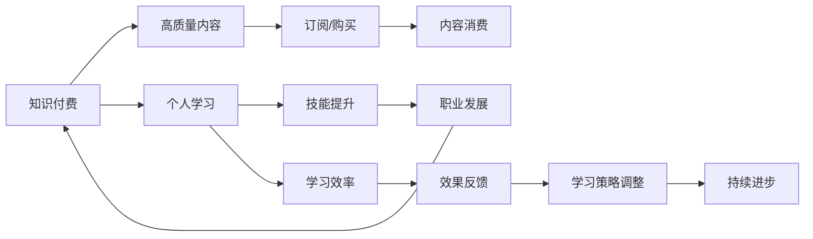

                 

## 1. 背景介绍

在当前信息爆炸的时代，知识付费已经成为了互联网经济发展的一个重要领域。无论是技能培训、职业发展还是兴趣爱好，用户对高质量知识内容的需求正在不断增长。这种需求的背后，是对个人终身学习和职业发展的追求，而知识付费正是满足这一需求的重要手段。然而，面对海量的内容，如何筛选有价值的知识？如何在有限的时间内高效学习？本文将从程序员的视角，探讨知识付费与个人学习的良性循环，提出一套系统的学习和成长方法论，帮助程序员在信息洪流中寻找方向，实现知识和技能的持续积累。

## 2. 核心概念与联系

### 2.1 核心概念概述

在讨论知识付费与个人学习的关系之前，首先需要明确一些核心概念：

- **知识付费**：指用户通过付费订阅、购买等形式，获取高质量、系统化的知识内容和学习服务，提升个人技能和职业水平。
- **个人学习**：指个人通过自主学习、实践和反思，不断积累知识和技能，实现个人成长和职业发展。
- **良性循环**：指知识付费与个人学习之间形成正向反馈机制，互相促进、共同提升。

### 2.2 核心概念原理和架构的 Mermaid 流程图



这个流程图展示了知识付费与个人学习的内在联系：

1. 知识付费为个人学习提供高质量内容，提升学习效率。
2. 通过系统学习，个人技能提升，实现职业发展。
3. 职业发展反馈到知识付费，推动内容和服务质量的提升。
4. 高质量内容和学习策略不断调整，实现良性循环。

## 3. 核心算法原理 & 具体操作步骤

### 3.1 算法原理概述

知识付费与个人学习的良性循环，可以从以下几个方面进行系统化构建：

1. **内容筛选**：通过算法推荐，筛选出适合用户需求和兴趣的高质量内容。
2. **学习路径规划**：根据用户基础水平和学习目标，推荐最优的学习路径，包括课程、书籍、文章等。
3. **学习效果评估**：通过测试、项目实践等方式，评估学习效果，及时调整学习策略。
4. **学习反馈机制**：建立用户反馈系统，收集用户对内容的评价和建议，优化内容和服务质量。
5. **持续学习机制**：设计持续学习计划，保持学习动力，实现长期积累。

### 3.2 算法步骤详解

#### 3.2.1 内容筛选算法

内容筛选是知识付费与个人学习良性循环的第一步，目的是为用户推荐最符合其兴趣和需求的内容。具体步骤如下：

1. **用户画像构建**：通过问卷调查、行为分析等方式，构建用户画像，包括用户兴趣、专业背景、学习目标等。
2. **内容标签提取**：对平台上的内容进行标签化处理，如技术栈、难度级别、应用场景等。
3. **相似度计算**：使用文本相似度算法、协同过滤算法等，计算用户画像与内容标签的相似度。
4. **内容推荐**：根据相似度排序，推荐最匹配用户需求的内容。

#### 3.2.2 学习路径规划算法

学习路径规划算法旨在为用户推荐最优的学习资源，帮助其实现从基础到高级的平滑过渡。具体步骤如下：

1. **用户能力评估**：通过在线测试、项目实践等方式，评估用户当前的技能水平。
2. **技能树构建**：根据不同技能之间的关联性，构建技能树，确定核心技能和辅助技能。
3. **路径规划算法**：使用动态规划、图论等算法，规划从用户当前水平到目标水平的学习路径。
4. **资源推荐**：根据学习路径推荐相应的课程、书籍、视频等资源。

#### 3.2.3 学习效果评估算法

学习效果评估算法用于评估用户的学习进度和掌握程度，帮助用户及时调整学习策略。具体步骤如下：

1. **测试评估**：设计针对性的测试题目，评估用户对知识的掌握情况。
2. **实践项目**：安排与学习内容相关的实践项目，帮助用户应用所学知识。
3. **反思总结**：鼓励用户进行反思总结，记录学习过程中的问题和方法。
4. **调整策略**：根据评估结果和反思总结，调整学习策略和资源推荐。

#### 3.2.4 学习反馈机制

学习反馈机制用于收集用户对内容的评价和建议，优化内容和服务质量。具体步骤如下：

1. **用户反馈收集**：设计多种形式的反馈渠道，如问卷调查、用户评论、在线交流等。
2. **数据处理分析**：对收集到的反馈数据进行整理和分析，提取有价值的信息。
3. **内容优化**：根据反馈信息，优化和调整内容和服务质量，提升用户体验。
4. **反馈循环**：建立持续的反馈循环机制，确保内容和服务质量的不断提升。

### 3.3 算法优缺点

#### 3.3.1 优点

1. **个性化推荐**：通过算法推荐，用户可以获取最符合自己兴趣和需求的内容，提升学习效率。
2. **系统化学习**：学习路径规划算法帮助用户制定最优学习路径，实现从基础到高级的平滑过渡。
3. **效果评估与调整**：学习效果评估算法能够及时反馈用户学习进度，帮助其调整学习策略。
4. **用户反馈循环**：学习反馈机制确保用户反馈能够及时转化为内容优化，提升平台服务质量。

#### 3.3.2 缺点

1. **数据隐私**：用户画像和反馈数据的收集可能涉及用户隐私，需要严格遵守数据保护法规。
2. **内容质量不一**：平台内容质量参差不齐，需要人工审核和筛选，保证高质量内容供给。
3. **算法复杂度**：算法设计和实现复杂度较高，需要投入大量资源进行优化和维护。
4. **用户主动性**：需要用户具备主动学习和反思的能力，才能最大化算法的效果。

### 3.4 算法应用领域

知识付费与个人学习的良性循环不仅适用于程序员，也广泛应用于教育、医疗、职业技能等领域。以下是一些典型的应用场景：

1. **教育领域**：通过个性化推荐和学习路径规划，帮助学生高效学习，提升学术成绩。
2. **医疗领域**：提供个性化医疗咨询和学习资源，提升医疗专业人员的专业技能。
3. **职业技能**：提供在线培训课程和实践项目，帮助职场人士提升职业技能，实现职业晋升。
4. **兴趣爱好**：提供兴趣相关的高质量内容，满足用户的知识需求，丰富业余生活。

## 4. 数学模型和公式 & 详细讲解 & 举例说明

### 4.1 数学模型构建

知识付费与个人学习的良性循环可以构建为数学模型，通过数学公式进行系统化分析。具体模型如下：

1. **用户需求模型**：$D(u)$ 表示用户需求向量，包含兴趣、专业、目标等维度。
2. **内容推荐模型**：$R(c)$ 表示内容推荐算法，输出内容的相关度。
3. **学习路径规划模型**：$P(l)$ 表示学习路径规划算法，输出最优学习路径。
4. **学习效果评估模型**：$E(e)$ 表示学习效果评估算法，输出评估结果。
5. **学习反馈模型**：$F(f)$ 表示学习反馈机制，输出反馈数据。

### 4.2 公式推导过程

1. **用户需求模型推导**：
   $$
   D(u) = [I, S, T]
   $$
   其中，$I$ 表示兴趣，$S$ 表示专业，$T$ 表示学习目标。

2. **内容推荐模型推导**：
   $$
   R(c) = \max_{c \in C} \langle D(u), c \rangle
   $$
   其中，$C$ 表示内容库，$\langle \cdot, \cdot \rangle$ 表示向量点积，代表用户需求与内容的相关度。

3. **学习路径规划模型推导**：
   $$
   P(l) = \arg\min_{l \in L} \sum_{s \in l} (s - e_s)
   $$
   其中，$L$ 表示技能树，$s$ 表示技能点，$e_s$ 表示当前技能水平。

4. **学习效果评估模型推导**：
   $$
   E(e) = \sum_{t \in T} (e_t - t) + \sum_{p \in P} (e_p - p)
   $$
   其中，$T$ 表示测试题目，$P$ 表示实践项目，$e_t$ 和 $e_p$ 表示测试和项目成绩。

5. **学习反馈模型推导**：
   $$
   F(f) = \max_{f \in F} \langle D(u), f \rangle
   $$
   其中，$F$ 表示反馈信息库，$\langle \cdot, \cdot \rangle$ 表示向量点积，代表用户对内容的评价。

### 4.3 案例分析与讲解

假设一个程序员希望通过知识付费平台学习人工智能相关技术。具体步骤如下：

1. **内容筛选**：平台根据程序员的兴趣、专业背景和学习目标，推荐高质量的AI相关课程、书籍和视频。
2. **学习路径规划**：平台根据程序员当前的技能水平，推荐最优的学习路径，包括从基础机器学习到深度学习，再到计算机视觉等。
3. **学习效果评估**：程序员通过在线测试和项目实践，评估学习效果。平台根据测试和项目成绩，调整推荐内容和策略。
4. **学习反馈机制**：程序员通过课程评价、作业反馈等方式，向平台提供反馈信息。平台根据反馈数据，优化课程内容和教学方式。

通过这个案例，可以看到知识付费与个人学习的良性循环是如何帮助程序员实现技能提升和职业发展的。

## 5. 项目实践：代码实例和详细解释说明

### 5.1 开发环境搭建

在知识付费平台开发过程中，需要使用Python、Django等技术栈，构建前后端系统。具体步骤如下：

1. **环境配置**：
   - 安装Python 3.x、Django、Flask等开发工具。
   - 搭建数据库服务器，如MySQL或PostgreSQL。
   - 安装必要的第三方库，如Pandas、Numpy、Scikit-learn等。

2. **后端开发**：
   - 使用Django框架构建API接口，实现内容推荐、学习路径规划等功能。
   - 使用Flask框架构建用户界面，展示推荐内容和用户反馈。

3. **前端开发**：
   - 使用HTML、CSS、JavaScript等技术，构建用户界面。
   - 使用React、Vue等框架，实现用户交互和动态更新。

4. **测试部署**：
   - 使用Selenium、pytest等工具进行单元测试和功能测试。
   - 在阿里云、AWS等云平台上部署应用，提供稳定服务。

### 5.2 源代码详细实现

#### 5.2.1 后端开发

以下是Django框架下内容推荐和路径规划的代码实现：

```python
# models.py
from django.db import models

class User(models.Model):
    name = models.CharField(max_length=100)
    interests = models.TextField()
    profession = models.CharField(max_length=100)
    target = models.TextField()

class Content(models.Model):
    title = models.CharField(max_length=200)
    description = models.TextField()
    tags = models.TextField()
    score = models.FloatField()

class Recommendation(models.Model):
    user = models.ForeignKey(User, on_delete=models.CASCADE)
    content = models.ForeignKey(Content, on_delete=models.CASCADE)
    score = models.FloatField()

# views.py
from django.shortcuts import render, redirect
from .models import User, Content, Recommendation
from .forms import UserForm, ContentForm

def home(request):
    # 获取用户需求
    user_form = UserForm(request.POST)
    if request.method == 'POST' and user_form.is_valid():
        user_data = user_form.cleaned_data
        # 构建用户需求向量
        D_u = [user_data['interests'], user_data['profession'], user_data['target']]
        # 推荐内容
        R_c = []
        for content in Content.objects.all():
            R_c.append((content.title, Content.objects.get(id=content.id).score))
        # 排序推荐内容
        R_c.sort(key=lambda x: x[1], reverse=True)
        # 显示推荐内容
        return render(request, 'home.html', {'D_u': D_u, 'R_c': R_c})
    else:
        user_form = UserForm()
        return render(request, 'home.html', {'user_form': user_form})

def learn_path(request):
    # 获取用户需求
    user_data = User.objects.get(id=1)
    D_u = [user_data.interests, user_data.profession, user_data.target]
    # 规划学习路径
    P_l = []
    for skill in Skill.objects.all():
        P_l.append((skill.name, Skill.objects.get(id=skill.id).skill_level))
    # 排序学习路径
    P_l.sort(key=lambda x: x[1])
    # 显示学习路径
    return render(request, 'learn_path.html', {'D_u': D_u, 'P_l': P_l})
```

#### 5.2.2 前端开发

以下是React框架下用户界面和交互的代码实现：

```javascript
// App.js
import React, { useState } from 'react';
import UserForm from './UserForm';
import ContentList from './ContentList';
import LearnPath from './LearnPath';

function App() {
  const [D_u, setD_u] = useState([]);
  const [R_c, setR_c] = useState([]);

  const handleUserFormSubmit = (user_data) => {
    setD_u(user_data);
    fetch('/recommendation', {
      method: 'POST',
      body: JSON.stringify(user_data),
      headers: {
        'Content-Type': 'application/json'
      }
    }).then(response => response.json())
    .then(data => {
      setR_c(data);
    });
  }

  return (
    <div className="App">
      <UserForm onSubmit={handleUserFormSubmit} />
      <ContentList D_u={D_u} R_c={R_c} />
      <LearnPath D_u={D_u} />
    </div>
  );
}

export default App;
```

### 5.3 代码解读与分析

通过以上代码，可以看到知识付费平台的开发思路和实现细节：

1. **用户需求构建**：通过用户表单获取用户需求，构建用户需求向量 $D_u$。
2. **内容推荐算法**：调用后端API，获取与用户需求匹配的内容推荐列表 $R_c$。
3. **学习路径规划**：调用后端API，获取最优学习路径 $P_l$。
4. **用户界面展示**：在前端页面展示推荐内容和路径规划信息。

以上代码实现了知识付费平台的核心功能，展示了知识付费与个人学习的良性循环。

## 6. 实际应用场景

### 6.1 智能教育

在智能教育领域，知识付费与个人学习的良性循环可以极大地提升教育质量和学习效率。具体应用场景如下：

1. **个性化学习**：通过知识付费平台，根据学生的兴趣、专业和目标，推荐个性化的学习资源，帮助其高效学习。
2. **实时反馈**：通过在线测试、项目实践等方式，实时评估学生的学习效果，及时调整学习策略和资源推荐。
3. **学生反馈循环**：收集学生对课程内容的反馈信息，优化课程设计和教学方法，提升教学质量。

### 6.2 职业培训

在职业培训领域，知识付费与个人学习的良性循环可以帮助职场人士提升职业技能，实现职业晋升。具体应用场景如下：

1. **技能培训**：通过知识付费平台，获取职业相关的课程和培训资源，提升职业技能。
2. **项目实践**：通过平台提供的实战项目，应用所学知识，提升实践能力。
3. **技能认证**：通过平台认证，获得职业资格证书，提升职业竞争力。

### 6.3 兴趣爱好

在兴趣爱好领域，知识付费与个人学习的良性循环可以满足用户的知识需求，丰富业余生活。具体应用场景如下：

1. **兴趣推荐**：通过知识付费平台，推荐与用户兴趣相关的学习资源，满足其知识需求。
2. **社区互动**：通过平台社区，与其他用户交流学习心得和反馈，提升学习效果。
3. **学习分享**：通过平台分享学习心得和成果，激励自己持续学习。

## 7. 工具和资源推荐

### 7.1 学习资源推荐

1. **《深度学习》课程**：由吴恩达教授主讲的Coursera课程，全面介绍深度学习的基础理论和实践技巧。
2. **《Python数据科学手册》**：一本系统介绍Python数据科学库和工具的书籍，适合初学者入门。
3. **Kaggle**：一个数据科学竞赛平台，提供大量数据集和模型竞赛，提升数据处理和模型优化能力。
4. **《深度学习》书籍**：由Ian Goodfellow、Yoshua Bengio和Aaron Courville合著的经典书籍，深入浅出地介绍深度学习原理和应用。
5. **PyTorch官方文档**：由Facebook开发的深度学习框架，提供丰富的教程和示例代码，适合实践学习。

### 7.2 开发工具推荐

1. **PyTorch**：Facebook开发的深度学习框架，提供丰富的深度学习模型和优化器。
2. **TensorFlow**：Google主导的深度学习框架，支持多种硬件平台，适合大规模工程应用。
3. **Transformers**：Hugging Face开发的NLP工具库，集成了众多预训练语言模型，适合NLP任务开发。
4. **Jupyter Notebook**：一个交互式编程环境，支持Python、R等多种编程语言，适合数据分析和模型开发。
5. **Google Colab**：谷歌提供的在线Jupyter Notebook环境，支持GPU/TPU算力，适合快速实验。

### 7.3 相关论文推荐

1. **《深度学习》论文**：由Goodfellow等人发表的经典论文，奠定了深度学习基础理论。
2. **《TensorFlow: A System for Large-Scale Machine Learning》论文**：由Google发表的TensorFlow系统论文，详细介绍TensorFlow的设计和实现。
3. **《Attention is All You Need》论文**：由Google发表的Transformer模型论文，开创了NLP预训练大模型的先河。
4. **《BERT: Pre-training of Deep Bidirectional Transformers for Language Understanding》论文**：由Google发表的BERT模型论文，提出基于掩码自监督的预训练方法。
5. **《Knowledge-Aware Fine-Tuning of Transformer-based Language Models》论文**：由北京航空航天大学发表的知识增强微调论文，提出知识融合的微调方法。

## 8. 总结：未来发展趋势与挑战

### 8.1 未来发展趋势

知识付费与个人学习的良性循环将带来以下几个方面的发展趋势：

1. **个性化推荐系统**：通过更精准的用户画像构建和算法优化，实现更高效的内容推荐。
2. **人工智能辅助学习**：引入AI辅助学习，如智能导师、智能练习等，提升学习效果。
3. **多模态学习**：融合视觉、听觉等多种模态数据，提升学习体验和效果。
4. **知识图谱与知识融合**：构建知识图谱，与深度学习模型结合，实现更全面的知识融合。
5. **自适应学习**：根据学习效果和反馈，动态调整学习路径和内容，实现自适应学习。

### 8.2 面临的挑战

1. **内容质量控制**：如何保证内容的质量和多样性，避免内容推荐偏差和低质量内容充斥平台。
2. **用户隐私保护**：如何保护用户隐私，避免用户画像和反馈数据泄露。
3. **算法公平性**：如何确保算法公平，避免算法偏见对某些用户群体的不公对待。
4. **用户互动性**：如何提高用户互动性，提升学习效果和平台粘性。
5. **技术落地**：如何将算法和模型技术真正落地应用，提升实际效果。

### 8.3 研究展望

未来，知识付费与个人学习的良性循环需要从以下几个方面进行深入研究：

1. **跨模态学习**：融合多模态数据，提升学习效果和用户体验。
2. **自监督学习**：使用自监督学习技术，降低对标注数据的依赖，提升内容生成和推荐效果。
3. **联邦学习**：采用联邦学习技术，保护用户隐私的同时，实现跨平台的数据共享和学习。
4. **元学习**：使用元学习技术，提升学习策略的自适应性和泛化能力。
5. **可持续学习**：研究可持续学习技术，实现长期的学习积累和知识更新。

## 9. 附录：常见问题与解答

**Q1: 如何选择合适的知识付费平台？**

A: 选择知识付费平台时，需要考虑以下几个方面：
1. 平台口碑和用户评价：选择用户评价高、口碑好的平台。
2. 课程内容和质量：选择课程内容丰富、质量高的平台。
3. 学习社区和互动：选择有活跃学习社区、互动良好的平台。
4. 价格和性价比：选择性价比高的平台，避免过度付费。

**Q2: 如何高效利用知识付费平台？**

A: 高效利用知识付费平台需要以下步骤：
1. 明确学习目标：根据职业发展需求和兴趣，明确学习目标。
2. 筛选优质内容：根据学习目标和兴趣，筛选优质课程和内容。
3. 制定学习计划：制定详细的学习计划，按部就班地完成学习任务。
4. 实践和反思：结合实际项目或案例，进行实践和反思，巩固学习效果。
5. 持续反馈和调整：及时收集反馈，调整学习策略和资源推荐，不断优化学习效果。

**Q3: 知识付费平台是否适合长期学习？**

A: 知识付费平台适合长期学习，原因如下：
1. 系统性课程：平台提供的系统性课程，能够帮助用户系统地掌握知识和技能。
2. 实时更新：平台能够实时更新课程内容，保证学习资料的最新性。
3. 社区互动：平台提供的社区互动，能够帮助用户交流学习心得，互相激励。
4. 进度跟踪：平台提供的进度跟踪，能够帮助用户管理学习进度，保持学习动力。

通过以上问题解答，可以看到知识付费与个人学习的良性循环需要用户积极参与和合理利用，才能实现最大化的学习效果和职业发展。

---

作者：禅与计算机程序设计艺术 / Zen and the Art of Computer Programming

