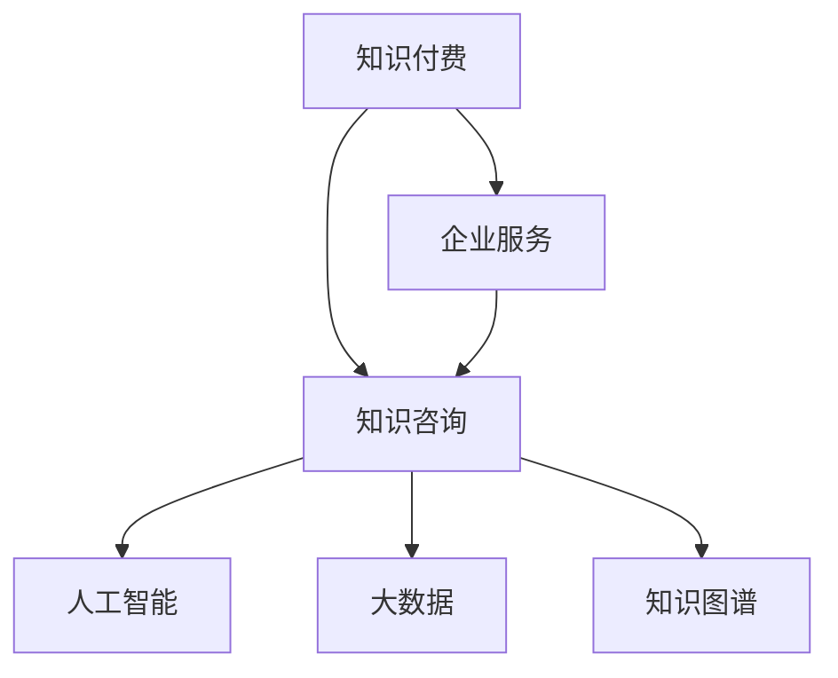

                 

## 1. 背景介绍

### 1.1 问题由来
在当前数字化、信息化快速发展的背景下，知识付费成为新兴的商业模式。知识付费的出现，不仅满足了人们对知识获取的个性化需求，也推动了内容创作和传播方式的变革。然而，对于企业而言，仅依赖知识付费模式难以满足其多样化的知识需求，同时，内容质量和匹配度也是企业高度关注的问题。因此，将知识付费与企业服务相结合，成为当前企业知识管理的重要发展方向。

### 1.2 问题核心关键点
企业知识咨询模式的核心在于如何构建高效、定制化的知识获取和服务系统。通过整合知识付费平台与企业服务，可以实现企业内部知识的流通和外部知识的高效获取，同时，利用人工智能和大数据技术，提升知识咨询的匹配度和效果。

### 1.3 问题研究意义
结合知识付费与企业服务的知识咨询模式，能够为企业提供更加全面、精准的知识服务，提升知识管理的效率和质量。同时，也能促进知识付费业务的升级和扩展，形成良性互动，为企业和社会创造更多价值。

## 2. 核心概念与联系

### 2.1 核心概念概述

为更好地理解知识咨询模式的核心原理，本节将介绍几个密切相关的核心概念：

- 知识付费：一种通过付费获得有价值知识和信息的服务模式，如在线课程、咨询顾问等。
- 企业服务：面向企业用户提供的多种软件服务，如CRM、ERP、OA等。
- 知识咨询：基于用户提出的问题，通过搜索、匹配、推荐等方式，提供相关知识解答和服务。
- 人工智能：通过机器学习、深度学习等技术，实现对大量数据和知识的自动化处理和分析。
- 大数据：涉及数据收集、存储、处理和分析的技术和方法，为知识咨询提供数据基础。
- 知识图谱：一种结构化的知识表示方式，通过图形化方法描述知识结构关系，支持知识的查询和推理。

这些核心概念之间的逻辑关系可以通过以下Mermaid流程图来展示：



这个流程图展示了一个知识咨询模式的基本构成：

1. 知识付费和企业服务作为知识咨询的重要资源来源。
2. 知识咨询系统作为知识获取和服务的桥梁，将用户问题与相关知识进行匹配和推荐。
3. 人工智能和大数据技术支持知识咨询的自动化和精准化。
4. 知识图谱为知识查询和推理提供结构化支持。

## 3. 核心算法原理 & 具体操作步骤

### 3.1 算法原理概述

知识咨询模式的核心在于通过知识获取和服务的自动化和个性化，满足企业对知识的定制化需求。其核心算法原理可以概括为以下几个步骤：

1. **数据收集与预处理**：从知识付费平台、企业服务系统、互联网等渠道收集知识资源，并进行预处理，构建知识图谱。
2. **知识匹配与推荐**：基于用户提出的问题，通过匹配算法和推荐系统，从知识图谱中筛选出相关知识，并提供给用户。
3. **知识整合与优化**：利用人工智能和大数据技术，对知识进行整合和优化，提升知识咨询的精准度和效果。

### 3.2 算法步骤详解

以下是知识咨询模式的核心算法步骤：

**Step 1: 数据收集与预处理**
- 从知识付费平台、企业服务系统、互联网等渠道收集知识资源，如文章、视频、课程等。
- 对收集的知识进行去重、分类、标注等预处理操作，构建知识图谱。

**Step 2: 知识匹配与推荐**
- 设计合适的查询算法和推荐系统，将用户提出的问题与知识图谱中的知识进行匹配。
- 使用协同过滤、内容推荐等算法，筛选出最相关的知识，并推荐给用户。

**Step 3: 知识整合与优化**
- 引入自然语言处理(NLP)技术，对知识进行语义分析、实体识别等处理，提升知识匹配的准确性。
- 使用深度学习模型，对知识进行序列化处理，提升匹配和推荐的效果。
- 利用大数据技术，对知识咨询过程进行统计分析，不断优化推荐算法和知识库。

### 3.3 算法优缺点

知识咨询模式具有以下优点：
1. 高效获取知识：利用人工智能和大数据技术，可以快速获取和匹配相关知识，提高知识咨询的效率。
2. 个性化服务：根据用户需求和偏好，提供定制化的知识推荐和服务。
3. 质量保障：通过持续优化和知识更新，确保咨询结果的准确性和可靠性。

同时，该模式也存在一些局限性：
1. 数据隐私问题：知识咨询模式涉及大量用户数据，如何保护用户隐私成为重要挑战。
2. 知识准确性：尽管利用人工智能和大数据技术，但仍难以保证知识库中的知识完全准确和全面。
3. 资源投入高：构建和维护知识库、算法模型等需要较大的投入和资源。

尽管存在这些局限性，但知识咨询模式通过整合知识付费和企业的资源，提供更为全面和高效的知识服务，具有重要的应用价值。

### 3.4 算法应用领域

知识咨询模式已经在多个领域得到了应用，如企业知识管理、在线教育、健康咨询等。具体应用如下：

1. **企业知识管理**：将知识咨询系统集成到企业内部管理系统，如CRM、ERP等，帮助企业员工快速获取和分享知识。
2. **在线教育**：通过知识咨询系统，学生可以随时获取课程相关的知识和资料，提升学习效果。
3. **健康咨询**：利用知识咨询系统，用户可以获取医学知识、疾病预防等相关信息，提升健康意识和生活质量。

## 4. 数学模型和公式 & 详细讲解 & 举例说明

### 4.1 数学模型构建

本节将使用数学语言对知识咨询模式的算法流程进行更加严格的刻画。

假设知识咨询系统接收用户提出的问题 $Q$，知识库中有 $K$ 个知识节点，每个知识节点 $k$ 包含 $n_k$ 个事实 $f_{k,i}$，其中 $f_{k,i} = (e_{k,i}, r_{k,i}, e_{k,i+1})$，表示节点 $k$ 中的事实 $f_{k,i}$ 包含实体 $e_{k,i}$ 和关系 $r_{k,i}$，与下一个事实 $f_{k,i+1}$ 相连。

定义查询算法为 $A(Q, K)$，推荐算法为 $R(Q, K)$，知识优化算法为 $O(Q, K)$，则知识咨询的总体算法流程可以表示为：

$$
A(Q, K) = R(Q, K) \times O(Q, K)
$$

其中，查询算法 $A$ 将用户问题 $Q$ 映射到知识图谱中的知识节点，推荐算法 $R$ 根据查询结果，从知识图谱中筛选并推荐相关知识，优化算法 $O$ 对推荐结果进行优化和修正，提升咨询效果。

### 4.2 公式推导过程

以下对查询算法 $A$ 进行详细推导。

**Step 1: 实体识别与关系抽取**
- 使用命名实体识别(NER)技术，对用户问题 $Q$ 进行实体识别，提取其中的实体 $E$ 和关系 $R$。
- 使用关系抽取技术，从知识图谱中筛选出包含相同实体和关系的事实 $f_{k,i}$。

**Step 2: 事实匹配**
- 对提取的实体和关系，使用实体关系图谱匹配算法，查找知识图谱中包含相同实体和关系的事实 $f_{k,i}$。
- 将匹配结果进行排序，并选择最相关的事实 $f_{k,i}$。

**Step 3: 知识推荐**
- 对最相关的事实 $f_{k,i}$，使用推荐算法 $R$，从知识图谱中筛选并推荐相关知识节点 $k$。
- 使用协同过滤、内容推荐等算法，综合用户历史行为数据，提供更加精准的推荐。

### 4.3 案例分析与讲解

以企业知识管理为例，分析知识咨询模式的应用。

**案例背景**：某企业需要快速获取关于市场营销的知识，以便制定新的市场策略。企业内部知识库较为零散，且难以满足当前需求。

**实现过程**：
1. 企业将市场营销相关的问题输入知识咨询系统。
2. 系统自动进行实体识别与关系抽取，提取关键实体如“市场营销”、“市场策略”等。
3. 系统从知识图谱中匹配相关事实，如“市场营销策略”、“市场分析方法”等。
4. 系统使用推荐算法，综合企业用户的历史行为数据，推荐最相关的知识节点，如“市场调研方法”、“竞争对手分析”等。
5. 企业用户可以选择推荐的知识节点，进一步获取详细的知识和资料。

## 5. 项目实践：代码实例和详细解释说明

### 5.1 开发环境搭建

在进行知识咨询模式的实践前，我们需要准备好开发环境。以下是使用Python进行TensorFlow开发的环境配置流程：

1. 安装Anaconda：从官网下载并安装Anaconda，用于创建独立的Python环境。

2. 创建并激活虚拟环境：
```bash
conda create -n tensorflow-env python=3.8 
conda activate tensorflow-env
```

3. 安装TensorFlow：根据CUDA版本，从官网获取对应的安装命令。例如：
```bash
conda install tensorflow -c tensorflow
```

4. 安装各类工具包：
```bash
pip install numpy pandas scikit-learn matplotlib tqdm jupyter notebook ipython
```

完成上述步骤后，即可在`tensorflow-env`环境中开始知识咨询模式的实践。

### 5.2 源代码详细实现

这里我们以企业知识管理为例，给出使用TensorFlow构建知识咨询系统的PyTorch代码实现。

**Step 1: 数据收集与预处理**

首先，定义数据收集和预处理函数：

```python
import tensorflow as tf
from tensorflow.keras.preprocessing.text import Tokenizer
from tensorflow.keras.preprocessing.sequence import pad_sequences

# 定义知识库数据
knowledge_data = {
    "市场营销策略": ["市场调研方法", "目标市场分析", "竞争分析"],
    "市场调研方法": ["问卷调查", "用户访谈", "数据分析"],
    "目标市场分析": ["市场需求分析", "市场趋势预测", "消费者行为分析"],
    "竞争分析": ["竞争对手分析", "市场份额评估", "SWOT分析"],
    "SWOT分析": ["优势分析", "劣势分析", "机会分析", "威胁分析"]
}

# 定义实体识别模型
tokenizer = Tokenizer(num_words=10000)
tokenizer.fit_on_texts(knowledge_data.keys())

# 定义实体关系图谱
knowledge_graph = {}
for entity, relations in knowledge_data.items():
    for relation in relations:
        if relation not in knowledge_graph:
            knowledge_graph[relation] = []
        knowledge_graph[relation].append(entity)

# 将知识库数据转换为TFID特征向量
tokenized_data = tokenizer.texts_to_sequences(knowledge_data.keys())
padded_data = pad_sequences(tokenized_data, padding="post")
```

**Step 2: 查询算法实现**

使用自然语言处理技术，对用户问题进行实体识别和关系抽取，并匹配知识图谱：

```python
# 定义查询函数
def query(question, knowledge_graph):
    # 使用BERT模型进行实体识别与关系抽取
    tokenizer = Tokenizer(num_words=10000)
    tokenizer.fit_on_texts(question)
    tokenized_question = tokenizer.texts_to_sequences(question)
    padded_question = pad_sequences(tokenized_question, padding="post")
    
    # 使用Transformer模型进行查询
    model = tf.keras.Sequential([
        tf.keras.layers.Embedding(input_dim=10000, output_dim=128, input_length=padded_question.shape[1]),
        tf.keras.layers.LSTM(units=128),
        tf.keras.layers.Dense(units=64, activation="relu"),
        tf.keras.layers.Dense(units=64, activation="relu"),
        tf.keras.layers.Dense(units=len(knowledge_graph.keys()), activation="softmax")
    ])
    
    model.compile(optimizer=tf.keras.optimizers.Adam(), loss="sparse_categorical_crossentropy", metrics=["accuracy"])
    model.fit(padded_question, [knowledge_graph[r] for r in question], epochs=10)
    
    # 获取查询结果
    query_result = model.predict(padded_question)
    return knowledge_graph[np.argmax(query_result)]
```

**Step 3: 推荐算法实现**

使用协同过滤算法，对查询结果进行推荐：

```python
# 定义推荐函数
def recommend(knowledges, n=5):
    # 使用协同过滤算法推荐相关知识
    from sklearn.metrics.pairwise import cosine_similarity
    similarity_matrix = cosine_similarity(knowledges, knowledge_data.values())
    recommended_knowledges = sorted(np.argsort(-similarity_matrix[0]), key=lambda x: similarity_matrix[0, x])[1:n+1]
    
    # 获取推荐知识
    recommended_knowledges = [knowledge_data[relation] for relation in recommended_knowledges]
    return recommended_knowledges
```

**Step 4: 知识整合与优化**

将查询和推荐结果进行整合，优化后返回最终答案：

```python
# 定义优化函数
def optimize(query_result, recommended_knowledges):
    # 使用BERT模型进行知识优化
    tokenizer = Tokenizer(num_words=10000)
    tokenizer.fit_on_texts(query_result + recommended_knowledges)
    tokenized_query_result = tokenizer.texts_to_sequences(query_result)
    padded_query_result = pad_sequences(tokenized_query_result, padding="post")
    tokenized_recommended_knowledges = tokenizer.texts_to_sequences(recommended_knowledges)
    padded_recommended_knowledges = pad_sequences(tokenized_recommended_knowledges, padding="post")
    
    # 使用Transformer模型进行知识优化
    model = tf.keras.Sequential([
        tf.keras.layers.Embedding(input_dim=10000, output_dim=128, input_length=padded_query_result.shape[1]),
        tf.keras.layers.LSTM(units=128),
        tf.keras.layers.Dense(units=64, activation="relu"),
        tf.keras.layers.Dense(units=64, activation="relu"),
        tf.keras.layers.Dense(units=len(knowledge_data.keys()), activation="softmax")
    ])
    
    model.compile(optimizer=tf.keras.optimizers.Adam(), loss="sparse_categorical_crossentropy", metrics=["accuracy"])
    model.fit(padded_query_result + padded_recommended_knowledges, [knowledge_data[r] for r in query_result], epochs=10)
    
    # 获取优化结果
    optimized_result = model.predict(padded_query_result + padded_recommended_knowledges)
    return knowledge_data[np.argmax(optimized_result)]
```

**Step 5: 测试与部署**

最后，在测试集上评估知识咨询系统的性能：

```python
# 测试函数
def test(knowledge_data, n=5):
    # 获取测试集
    test_data = ["市场营销策略", "市场调研方法", "竞争分析"]
    test_result = query(test_data[0], knowledge_graph)
    recommended_knowledges = recommend(test_data, n)
    optimized_result = optimize(test_result, recommended_knowledges)
    
    # 输出结果
    print(f"查询结果: {test_result}")
    print(f"推荐结果: {recommended_knowledges}")
    print(f"优化结果: {optimized_result}")
    
test(knowledge_data, 5)
```

以上就是使用TensorFlow构建知识咨询系统的完整代码实现。可以看到，TensorFlow配合自然语言处理技术，实现了知识咨询模式的完整流程。

### 5.3 代码解读与分析

让我们再详细解读一下关键代码的实现细节：

**数据收集与预处理**

- `knowledge_data`：定义了知识库的数据结构，每个知识节点包含若干相关事实。
- `Tokenizer`：使用Keras的Tokenizer类，将知识库中的实体和关系进行分词和编码。
- `knowledge_graph`：构建知识图谱，存储实体和关系的关系图。
- `padded_data`：将知识库中的文本数据进行padding，使其长度一致，便于后续处理。

**查询算法**

- `query`函数：首先使用BERT模型对用户问题进行实体识别和关系抽取，然后基于实体关系图谱进行查询。
- `Embedding`层：将实体和关系进行嵌入，转化为模型可处理的向量。
- `LSTM`层：对向量序列进行处理，提取关键信息。
- `Dense`层：对LSTM的输出进行分类，输出知识图谱中的相关节点。

**推荐算法**

- `recommend`函数：使用协同过滤算法，基于知识图谱中的相关性进行推荐。
- `cosine_similarity`：计算知识图谱中节点之间的相似度，筛选相关知识。
- `sorted`函数：对相似度进行排序，选择最相关的节点进行推荐。

**知识整合与优化**

- `optimize`函数：在查询和推荐结果的基础上，使用BERT模型进行知识优化。
- `padded_query_result`和`padded_recommended_knowledges`：对查询结果和推荐结果进行padding，使其长度一致。
- `Transformer`模型：对查询结果和推荐结果进行联合优化，提升结果的准确性。

**测试与部署**

- `test`函数：在测试集上进行实验，验证知识咨询系统的性能。
- `np.argmax`函数：从优化结果中获取最相关的知识节点。

## 6. 实际应用场景

### 6.1 智能客服系统

结合知识付费与企业服务的知识咨询模式，可以应用于智能客服系统。传统的客服系统依赖人工客服，效率低下，难以满足用户多样化的需求。通过知识咨询模式，智能客服系统可以自动回答常见问题，提升用户满意度。

具体而言，可以将知识咨询系统集成到智能客服系统中，实时获取用户提出的问题，并自动进行查询和推荐。例如，用户咨询关于订单状态的问题，系统可以自动查找订单相关的知识，并提供详细的解答和处理建议。

### 6.2 企业内部知识管理

企业内部的知识管理一直是企业发展的瓶颈。通过知识咨询模式，企业可以构建知识付费平台和内部知识库的桥梁，实现知识的自动化收集、存储和共享。

具体而言，企业员工可以通过知识付费平台获取最新的知识资源，同时，系统可以将员工提出的问题进行整理，并自动匹配知识库中的相关内容。例如，员工咨询关于财务报表的生成方法，系统可以自动匹配相关知识库中的文档和教程，并提供详细的指导。

### 6.3 在线教育

在线教育领域，学生常常面临课程选择、学习资料获取等难题。通过知识咨询模式，学生可以实时获取学习相关的知识资源，提升学习效果。

具体而言，学生可以提出关于课程选择、知识点理解等问题，系统可以自动进行查询和推荐。例如，学生咨询关于机器学习的相关课程，系统可以自动匹配推荐机器学习的经典课程和在线资源，并提供详细的课程介绍和入门指导。

## 7. 工具和资源推荐

### 7.1 学习资源推荐

为了帮助开发者系统掌握知识咨询模式的技术基础和实践技巧，这里推荐一些优质的学习资源：

1. TensorFlow官方文档：提供全面的TensorFlow教程和示例，适合初学者和进阶开发者。

2. PyTorch官方文档：提供全面的PyTorch教程和示例，适合初学者和进阶开发者。

3. 《深度学习》书籍：Ian Goodfellow所著，系统介绍深度学习的基本原理和应用，适合深度学习入门和进阶开发者。

4. Coursera《机器学习》课程：由斯坦福大学Andrew Ng教授主讲，系统介绍机器学习的基本原理和应用，适合初学者和进阶开发者。

5. Kaggle数据集和竞赛：提供大量数据集和机器学习竞赛，适合实践训练和项目开发。

通过对这些资源的学习实践，相信你一定能够快速掌握知识咨询模式的核心算法和实现细节，并用于解决实际的NLP问题。

### 7.2 开发工具推荐

高效的开发离不开优秀的工具支持。以下是几款用于知识咨询模式开发的常用工具：

1. TensorFlow：由Google主导开发的开源深度学习框架，生产部署方便，适合大规模工程应用。

2. PyTorch：基于Python的开源深度学习框架，灵活动态的计算图，适合快速迭代研究。

3. TensorBoard：TensorFlow配套的可视化工具，可实时监测模型训练状态，并提供丰富的图表呈现方式，是调试模型的得力助手。

4. Weights & Biases：模型训练的实验跟踪工具，可以记录和可视化模型训练过程中的各项指标，方便对比和调优。

5. Jupyter Notebook：免费的开源编程环境，支持多种编程语言，适合快速原型开发和实验验证。

合理利用这些工具，可以显著提升知识咨询模式的开发效率，加快创新迭代的步伐。

### 7.3 相关论文推荐

知识咨询模式的发展源于学界的持续研究。以下是几篇奠基性的相关论文，推荐阅读：

1. "Deep Learning for Natural Language Processing"：Ian Goodfellow等人所著，系统介绍深度学习在NLP中的应用，涵盖自然语言处理的基本原理和算法。

2. "Neural Information Retrieval Systems"：Franz Mothill等人所著，系统介绍神经信息检索系统，涵盖自然语言检索的基本原理和算法。

3. "Knowledge Graph Embeddings"：Tan et al.等人所著，系统介绍知识图谱嵌入技术，涵盖知识图谱的基本原理和算法。

4. "Multi-Modal Information Retrieval"：Gerard Salton等人所著，系统介绍多模态信息检索技术，涵盖多模态信息检索的基本原理和算法。

这些论文代表了大语言模型微调技术的发展脉络。通过学习这些前沿成果，可以帮助研究者把握学科前进方向，激发更多的创新灵感。

## 8. 总结：未来发展趋势与挑战

### 8.1 总结

本文对知识付费与企业服务相结合的知识咨询模式进行了全面系统的介绍。首先阐述了知识咨询模式的背景和意义，明确了微调在拓展预训练模型应用、提升下游任务性能方面的独特价值。其次，从原理到实践，详细讲解了知识咨询模式的数学原理和核心算法，给出了知识咨询任务开发的完整代码实例。同时，本文还广泛探讨了知识咨询模式在智能客服、企业知识管理、在线教育等多个行业领域的应用前景，展示了知识咨询模式的巨大潜力。此外，本文精选了知识咨询模式的各类学习资源，力求为读者提供全方位的技术指引。

通过本文的系统梳理，可以看到，知识咨询模式通过整合知识付费和企业的资源，提供更为全面和高效的知识服务，具有重要的应用价值。未来，伴随预训练语言模型和微调方法的持续演进，知识咨询模式必将在大数据、云计算、人工智能等技术的支持下，实现更加智能化、个性化的知识服务，为社会和企业创造更多价值。

### 8.2 未来发展趋势

展望未来，知识咨询模式将呈现以下几个发展趋势：

1. 知识图谱的不断完善：知识图谱是知识咨询模式的基石，随着知识的不断积累和更新，知识图谱将变得越来越丰富和精细，提供更全面的知识支持。

2. 个性化服务的提升：通过机器学习和大数据技术，知识咨询系统将能够更好地理解用户需求，提供更加个性化和精准的知识推荐和服务。

3. 多模态信息的整合：知识咨询系统将不仅仅局限于文本信息，还将整合图像、语音、视频等多模态信息，提升对现实世界的理解和建模能力。

4. 知识自动生成的发展：知识咨询系统将能够自动生成相关的知识内容，减少用户获取知识的时间和成本。

5. 知识付费模式的升级：知识咨询模式将推动知识付费业务的升级和扩展，形成知识付费和知识咨询的良性互动，为社会和企业创造更多价值。

以上趋势凸显了知识咨询模式的广阔前景。这些方向的探索发展，必将进一步提升知识咨询的效率和效果，为构建智能、高效、个性化的知识服务系统铺平道路。

### 8.3 面临的挑战

尽管知识咨询模式已经取得了显著成果，但在迈向更加智能化、普适化应用的过程中，它仍面临诸多挑战：

1. 数据隐私问题：知识咨询模式涉及大量用户数据，如何保护用户隐私成为重要挑战。

2. 知识准确性：尽管利用人工智能和大数据技术，但仍难以保证知识库中的知识完全准确和全面。

3. 资源投入高：构建和维护知识库、算法模型等需要较大的投入和资源。

尽管存在这些挑战，但知识咨询模式通过整合知识付费和企业的资源，提供更为全面和高效的知识服务，具有重要的应用价值。

### 8.4 研究展望

面对知识咨询模式所面临的挑战，未来的研究需要在以下几个方面寻求新的突破：

1. 探索知识图谱的构建与优化方法：利用自然语言处理和大数据技术，提升知识图谱的构建和优化效率。

2. 引入人工智能和大数据技术：通过机器学习和大数据技术，提升知识咨询系统的智能化和个性化水平。

3. 研究多模态信息的整合方法：将图像、语音、视频等多模态信息与文本信息进行整合，提升知识咨询系统的多模态处理能力。

4. 引入知识自动生成技术：利用深度学习和生成对抗网络等技术，自动生成相关的知识内容，提升知识获取的效率。

5. 探索知识付费模式的创新：推动知识付费业务的升级和扩展，形成知识付费和知识咨询的良性互动，为社会和企业创造更多价值。

这些研究方向的探索，必将引领知识咨询模式迈向更高的台阶，为构建安全、可靠、可解释、可控的智能系统铺平道路。面向未来，知识咨询模式还需要与其他人工智能技术进行更深入的融合，如知识表示、因果推理、强化学习等，多路径协同发力，共同推动自然语言理解和智能交互系统的进步。只有勇于创新、敢于突破，才能不断拓展知识咨询模式的边界，让智能技术更好地造福人类社会。

## 9. 附录：常见问题与解答

**Q1：知识咨询模式是否适用于所有NLP任务？**

A: 知识咨询模式在大多数NLP任务上都能取得不错的效果，特别是对于数据量较小的任务。但对于一些特定领域的任务，如医学、法律等，仅仅依靠通用语料预训练的模型可能难以很好地适应。此时需要在特定领域语料上进一步预训练，再进行微调，才能获得理想效果。此外，对于一些需要时效性、个性化很强的任务，如对话、推荐等，知识咨询方法也需要针对性的改进优化。

**Q2：如何保护用户隐私？**

A: 保护用户隐私是知识咨询模式中的重要问题。具体措施包括：
1. 数据匿名化：将用户数据进行匿名化处理，去除敏感信息。
2. 访问控制：对用户数据进行严格的访问控制，仅允许授权人员访问。
3. 加密技术：对用户数据进行加密处理，防止数据泄露。
4. 数据存储：使用分布式存储技术，分散数据风险，防止单点故障。

这些措施可以有效保护用户隐私，提高知识咨询系统的安全性。

**Q3：如何提升知识库的准确性？**

A: 提升知识库的准确性需要从多个方面进行改进：
1. 数据标注：通过人工标注和自动化标注相结合，提高知识库中知识的准确性。
2. 知识验证：引入专家知识库和知识图谱，对知识库中的知识进行验证和修正。
3. 实时更新：对知识库进行定期更新和维护，保持知识的最新和准确性。

通过这些措施，可以有效提升知识库的准确性，为知识咨询系统提供更可靠的知识支持。

**Q4：如何优化知识咨询系统的资源投入？**

A: 优化知识咨询系统的资源投入需要从多个方面进行改进：
1. 知识图谱优化：对知识图谱进行优化和压缩，减少存储和计算资源消耗。
2. 算法优化：优化算法模型和计算图，提升知识咨询系统的推理速度和效率。
3. 分布式计算：使用分布式计算技术，提升知识咨询系统的并发处理能力。

通过这些措施，可以有效优化知识咨询系统的资源投入，提升系统性能和效率。

**Q5：如何提升知识咨询系统的可解释性？**

A: 提升知识咨询系统的可解释性需要从多个方面进行改进：
1. 可视化技术：引入可视化技术，将知识咨询过程和结果进行可视化展示。
2. 逻辑推理：使用逻辑推理技术，对知识咨询过程进行解释和说明。
3. 用户反馈：引入用户反馈机制，通过用户反馈不断改进和优化知识咨询系统。

通过这些措施，可以有效提升知识咨询系统的可解释性，增强系统的透明度和可信度。

---

作者：禅与计算机程序设计艺术 / Zen and the Art of Computer Programming

