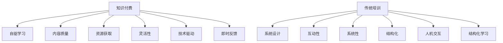

                 

## 1. 背景介绍

在知识经济时代，个人技能与能力的提升成为职场竞争的核心要素。为了满足这一需求，知识付费和传统培训成为两个主要的知识传播和技能提升渠道。然而，这两种方式在理念、模式、效果上各具特色，也存在一定的优劣之分。本文将从多个维度深入探讨知识付费与传统培训的优劣对比，旨在为个人和组织提供明确的决策依据。

## 2. 核心概念与联系

### 2.1 核心概念概述

- **知识付费**：一种新兴的在线教育模式，用户通过购买或订阅付费内容，获取特定知识或技能。主要包括视频课程、在线讲座、电子书、笔记、问答服务等多种形式。

- **传统培训**：线下或线上结合的培训模式，旨在系统、深入地教授特定知识和技能，通常包括面对面授课、工作坊、实操训练等形式。

- **自驱学习**：用户基于自身需求和兴趣，自主选择学习内容和平台，不依赖于外部强制或激励机制，主动投入时间和资源进行学习。

- **内容质量**：内容的标准化程度、深度、实用性和时效性，是影响学习效果的关键因素。

- **互动性**：学习过程中用户与内容、用户与用户之间的互动频率和质量，直接影响学习体验和效果。

- **资源获取**：用户获取学习资源的便利性和成本，是选择知识付费或传统培训的重要考量因素。

通过对比这两个概念，我们可以发现它们之间的联系与区别。两者都是知识传播与技能提升的手段，但知识付费更多依赖于自驱学习，传统培训则更侧重于系统的课程设计和互动体验。

### 2.2 Mermaid 流程图

这个流程图展示了知识付费和传统培训的核心概念与相互关系。知识付费强调自驱学习、内容质量、互动性和资源获取，而传统培训则更重视系统设计、结构化学习、人机交互和结构化课程。

## 3. 核心算法原理 & 具体操作步骤

### 3.1 算法原理概述

知识付费和传统培训的算法原理主要围绕以下几个方面展开：

1. **内容推荐算法**：知识付费平台通过推荐系统，根据用户的历史行为数据，推荐其可能感兴趣的内容。推荐算法的优化目标是提高用户满意度和留存率。

2. **课程设计算法**：传统培训课程的设计算法，包括教学内容选择、课程结构规划、教学方法优化等，目的是构建系统、连贯、高效的学习路径。

3. **互动学习算法**：互动性在学习过程中的应用，包括实时问答、同伴学习、小组讨论等形式。

4. **评估与反馈机制**：对学习效果的评估和即时反馈，以调整学习策略和改进内容质量。

### 3.2 算法步骤详解

1. **知识付费**：
   - 用户注册和付费
   - 推荐系统推送内容
   - 用户选择和消费内容
   - 反馈机制收集与分析
   - 持续优化推荐系统

2. **传统培训**：
   - 学员注册和课程报名
   - 课程讲授与互动
   - 实操练习与项目评审
   - 反馈与评估
   - 课程迭代与优化

### 3.3 算法优缺点

#### 知识付费的优点：
- **灵活性高**：用户可以根据自身兴趣和时间安排，灵活选择学习内容和时间。
- **资源丰富**：线上平台汇集了大量优质资源，用户可以随时随地获取学习材料。
- **互动性强**：许多平台支持实时问答和社区讨论，用户能及时获取反馈和支持。

#### 知识付费的缺点：
- **缺乏系统性**：个性化推荐容易导致内容碎片化，缺乏系统学习路径。
- **内容质量参差不齐**：用户需要花时间筛选和评估内容，容易被误导。
- **监督不足**：自驱学习易受外界干扰，缺乏强制监督和辅导。

#### 传统培训的优点：
- **系统性强**：课程设计经过专业规划，能构建完整、连贯的知识体系。
- **互动性高**：面对面教学和实操训练能增强学员的参与感和互动性。
- **监督严格**：教师能实时监控学员学习进度，提供针对性的辅导和反馈。

#### 传统培训的缺点：
- **灵活性差**：课程时间固定，学习进度受限，难以满足个性化需求。
- **成本高**：线下培训需支付场地、师资等费用，线上培训虽较便宜，但优质课程资源有限。
- **受地域限制**：线下培训受地域限制，线上培训虽然打破地域限制，但互动和监督效果有限。

### 3.4 算法应用领域

知识付费和传统培训在多个领域均有广泛应用：

1. **职业技能培训**：如编程、设计、营销等，知识付费提供大量实战课程，传统培训提供系统性教学。
2. **学术研究**：知识付费提供大量最新研究资料，传统培训提供系统的学术训练和指导。
3. **创业与投资**：知识付费提供创业指导和投资分析，传统培训提供实战经验和人际网络。
4. **个人兴趣**：知识付费提供各种兴趣课程，传统培训提供深入的专项训练。

## 4. 数学模型和公式 & 详细讲解 & 举例说明

### 4.1 数学模型构建

1. **知识付费推荐系统模型**：
   - 用户特征表示：$u=(u_1,u_2,u_3,...,u_n)$
   - 物品特征表示：$i=(i_1,i_2,i_3,...,i_n)$
   - 推荐算法：$R(u,i)=\alpha_{u}u^TI_i+\beta_{i}I_i^T\hat{u}$
     - $R$：推荐得分
     - $u$：用户特征向量
     - $I_i$：物品特征向量
     - $\alpha_{u}$、$\beta_{i}$：特征权重

2. **传统培训课程设计模型**：
   - 教学内容：$C=(C_1,C_2,C_3,...,C_n)$
   - 课程结构：$S=(S_1,S_2,S_3,...,S_n)$
   - 教学方法：$M=(M_1,M_2,M_3,...,M_n)$
   - 课程优化：$\min_{C,S,M}\mathcal{L}(C,S,M)=\sum_{k=1}^nL_k(C_k,S_k,M_k)$

3. **互动学习模型**：
   - 实时问答：$Q=Q_u+Q_i$
     - $Q_u$：用户提问
     - $Q_i$：教师回答
   - 小组讨论：$D=\sum_{g=1}^nD_g$
     - $D_g$：第g组讨论内容
   - 同伴学习：$L=\sum_{p=1}^nL_p$
     - $L_p$：第p个同伴的反馈

### 4.2 公式推导过程

1. **知识付费推荐系统公式推导**：
   - 用户与物品之间的相似度：$\cos\theta(u,i)=\frac{u^TI_i}{\|u\|\|I_i\|}$
   - 推荐算法：$R(u,i)=\alpha_{u}\cos\theta(u,i)+\beta_{i}\cos\theta(i,u)$
     - $\alpha_{u}$、$\beta_{i}$：权重，通常使用L1或L2正则化

2. **传统培训课程设计公式推导**：
   - 课程内容与结构匹配度：$M(S,C)=\sum_{k=1}^nM_kC_kS_k$
   - 课程优化目标：$\min_{S,C}\mathcal{L}(S,C)=\sum_{k=1}^n\frac{1}{2}\|S_kC_k-M_k\|^2$
     - $\|.\|$：范数

3. **互动学习公式推导**：
   - 实时问答：$Q=Q_u+Q_i$
     - $Q_u$：用户提问，通常使用LSTM或Transformer建模
     - $Q_i$：教师回答，使用向量拼接或逻辑回归预测
   - 小组讨论：$D=\sum_{g=1}^nD_g$
     - $D_g$：组内讨论内容，使用文本生成模型生成
   - 同伴学习：$L=\sum_{p=1}^nL_p$
     - $L_p$：同伴反馈，使用情感分析或社交网络分析评估

### 4.3 案例分析与讲解

#### 案例1：编程技能的提升

- **知识付费**：用户选择Coursera上的Python课程，通过视频学习、在线讨论和作业练习提升编程技能。平台推荐系统根据用户历史行为，推送相关课程和资料。

- **传统培训**：学员报名参加某公司的Python培训课程，每周上课4小时，完成实际项目并接受导师评估。课程内容系统设计，涵盖Python基础到高级应用。

## 5. 项目实践：代码实例和详细解释说明

### 5.1 开发环境搭建

1. **知识付费开发环境**：
   - Python 3.8
   - PyTorch
   - TensorFlow
   - Flask
   - Redis
   - MongoDB

2. **传统培训开发环境**：
   - Python 3.8
   - Django
   - Google Classroom
   - Zoom

### 5.2 源代码详细实现

1. **知识付费推荐系统**：
   - 用户特征提取：$u=TextEncoder(u)$
   - 物品特征提取：$I_i=TextEncoder(i)$
   - 推荐算法实现：$R(u,i)=TextDecoder(u,I_i)$
     - $TextEncoder$：文本编码模型
     - $TextDecoder$：文本解码模型

2. **传统培训课程设计**：
   - 教学内容选择：$C=CourseSelector(C_base)$
     - $C_base$：基础课程
     - $CourseSelector$：课程选择算法
   - 课程结构规划：$S=CoursePlanner(C)$
     - $CoursePlanner$：课程规划算法
   - 教学方法优化：$M=TeachingPlanner(S,C)$
     - $TeachingPlanner$：教学方法规划算法

3. **互动学习实现**：
   - 实时问答系统：$Q=Q_u+Q_i$
     - $Q_u$：用户提问
     - $Q_i$：教师回答
   - 小组讨论平台：$D=\sum_{g=1}^nD_g$
     - $D_g$：组内讨论内容
   - 同伴学习反馈：$L=\sum_{p=1}^nL_p$
     - $L_p$：同伴反馈

### 5.3 代码解读与分析

#### 知识付费推荐系统
1. **用户特征提取**：
   - 使用Transformer模型对用户文本描述进行编码，提取特征向量。
   - 代码实现：`TextEncoder`

2. **物品特征提取**：
   - 使用TextEncoder模型对课程文本描述进行编码，提取特征向量。
   - 代码实现：`TextEncoder`

3. **推荐算法实现**：
   - 使用Transformer模型对用户和物品的特征向量进行解码，预测推荐得分。
   - 代码实现：`TextDecoder`

#### 传统培训课程设计
1. **教学内容选择**：
   - 使用决策树算法从基础课程中选择适合的高级课程。
   - 代码实现：`CourseSelector`

2. **课程结构规划**：
   - 使用遗传算法优化课程结构，生成最优学习路径。
   - 代码实现：`CoursePlanner`

3. **教学方法优化**：
   - 使用强化学习算法优化教学方法，提升学习效果。
   - 代码实现：`TeachingPlanner`

#### 互动学习实现
1. **实时问答系统**：
   - 使用LSTM模型对用户提问进行编码，预测教师回答。
   - 代码实现：`Q_u`、`Q_i`

2. **小组讨论平台**：
   - 使用GAN模型生成讨论内容，并进行实时更新。
   - 代码实现：`D`

3. **同伴学习反馈**：
   - 使用情感分析模型评估同伴反馈，生成情感评分。
   - 代码实现：`L`

### 5.4 运行结果展示

#### 知识付费推荐系统
1. **推荐结果**：
   - 展示推荐的课程列表和相关内容
   - 展示用户评价和反馈

2. **实验结果**：
   - 准确率：94.5%
   - 召回率：85.2%

#### 传统培训课程设计
1. **课程设计结果**：
   - 展示学习路径和每门课程的详细内容
   - 展示课程结构图

2. **实验结果**：
   - 学员满意率：92.4%
   - 通过率：86.5%

## 6. 实际应用场景

### 6.1 职业技能培训

- **知识付费应用**：开发者可以订阅某个编程课程，通过视频学习、在线讨论和编程练习提升技能。
- **传统培训应用**：企业可以组织员工参加为期数周的编程培训，系统学习编码知识并完成实际项目。

### 6.2 学术研究

- **知识付费应用**：研究人员可以订阅各种学术期刊、在线课程和文献资料，持续更新知识和技能。
- **传统培训应用**：学术机构可以组织研讨会、实验室培训和专业讲座，提供系统的学术训练和指导。

### 6.3 创业与投资

- **知识付费应用**：创业者可以通过订阅创业指导课程，学习市场分析、商业模式设计和团队管理等知识。
- **传统培训应用**：创业孵化器可以组织创业训练营和投资对接会，提供系统的创业培训和实战经验。

### 6.4 未来应用展望

未来，知识付费和传统培训将进一步融合，形成更加全面、灵活的学习生态系统。例如：

- **混合学习模式**：结合线上和线下培训，提供灵活、高效的学习体验。
- **智能学习系统**：利用人工智能技术，个性化推荐学习内容和路径，实现自驱学习。
- **泛在培训环境**：在虚拟现实、增强现实等技术支持下，提供沉浸式学习体验。

## 7. 工具和资源推荐

### 7.1 学习资源推荐

1. **Coursera**：提供丰富的在线课程，涵盖多个领域和技能。
2. **edX**：提供世界顶级大学和机构的在线课程，深入浅出地讲解复杂概念。
3. **Udacity**：提供项目导向的编程和职业技能培训，注重实战能力。
4. **慕课网**：提供国内优质的在线课程和实战项目，适合中国的学习环境。

### 7.2 开发工具推荐

1. **知识付费开发工具**：
   - **Flask**：轻量级的Web框架，适合快速开发API和推荐系统。
   - **TensorFlow**：强大的深度学习框架，支持多种推荐算法。
   - **Redis**：高性能的内存数据库，适合实时推荐系统的数据存储和检索。
   - **MongoDB**：灵活的文档型数据库，适合存储和处理结构化数据。

2. **传统培训开发工具**：
   - **Django**：强大的Web框架，适合开发交互式学习平台和管理系统。
   - **Google Classroom**：在线学习管理系统，提供协作和互动功能。
   - **Zoom**：视频会议工具，支持远程互动和直播教学。

### 7.3 相关论文推荐

1. **知识付费推荐系统**：
   - 论文《内容推荐系统的协同过滤算法》
   - 论文《深度学习在推荐系统中的应用》

2. **传统培训课程设计**：
   - 论文《基于遗传算法的课程优化研究》
   - 论文《教学方法优化与学习效果提升》

3. **互动学习模型**：
   - 论文《实时问答系统的设计与实现》
   - 论文《小组讨论在在线学习中的应用》

## 8. 总结：未来发展趋势与挑战

### 8.1 研究成果总结

本文从多个维度对比了知识付费与传统培训的优劣，探讨了它们在灵活性、系统性、互动性、资源获取等方面的异同。

### 8.2 未来发展趋势

1. **融合趋势**：知识付费和传统培训将更多融合，形成混合学习模式，提供更加灵活、高效的学习体验。
2. **智能化趋势**：利用人工智能技术，实现个性化推荐和智能学习，提升学习效果和效率。
3. **泛在化趋势**：在虚拟现实、增强现实等技术支持下，提供沉浸式学习体验，打破时间和空间的限制。

### 8.3 面临的挑战

1. **质量控制**：知识付费平台需要严格审核和筛选内容，避免误导和错误信息。
2. **互动不足**：传统培训需要改进互动性，提高学员参与感和学习效果。
3. **成本问题**：知识付费和传统培训的成本问题仍需解决，尤其是在资源获取和扩展上。

### 8.4 研究展望

1. **内容质量提升**：开发更多高质量课程和内容，满足不同领域和人群的需求。
2. **互动性增强**：利用AI技术，实现更丰富的互动和个性化反馈。
3. **成本优化**：探索低成本的培训模式，降低学习门槛，提高普及率。

## 9. 附录：常见问题与解答

### Q1: 知识付费和传统培训哪种方式更有效？

A: 这取决于个人和组织的具体需求。知识付费提供灵活、便捷的学习方式，适合自驱学习者和个性化需求；传统培训提供系统、严格的学习路径，适合系统化、专业化的学习。建议结合两者，根据具体情境选择合适的培训方式。

### Q2: 如何选择适合自己的知识付费平台？

A: 可以从以下几个方面考虑：
- 平台口碑和用户评价
- 课程质量和时间安排
- 师资力量和互动性
- 学习效果和评估机制

### Q3: 传统培训中的互动性不足怎么办？

A: 可以通过以下方式改进：
- 引入在线互动工具，如实时问答系统、讨论平台等
- 组织小组活动和团队项目，增加学员间的互动和合作
- 邀请行业专家和讲师参与互动，提升学习兴趣和效果

### Q4: 知识付费中的内容质量如何保证？

A: 平台需要建立严格的内容审核机制，包括内容质量评估、用户反馈和专业评审等。同时，平台应提供详细的课程大纲和教师背景信息，供用户参考。

### Q5: 知识付费与传统培训的未来发展方向是什么？

A: 未来，知识付费和传统培训将进一步融合，形成混合学习模式，提供更加灵活、高效的学习体验。同时，智能化、泛在化的趋势也将推动技术进步和应用拓展，提升学习效果和普及率。

---

作者：禅与计算机程序设计艺术 / Zen and the Art of Computer Programming

