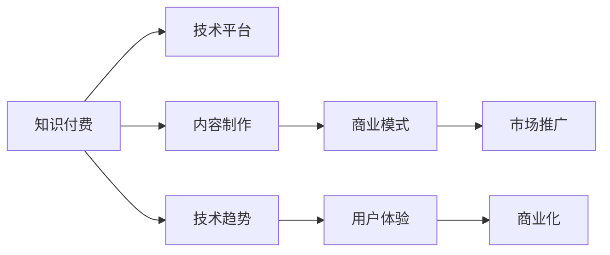

                 

## 1. 背景介绍

### 1.1 问题由来

随着互联网技术的发展和普及，知识付费行业在过去几年中迅速崛起。知识付费平台如得到、喜马拉雅、知乎等，通过提供高质量的课程、音频、视频等知识产品，吸引了大量用户付费订阅。与此同时，科技行业的技术发展也呈现出多样化趋势，从人工智能、区块链、云计算、大数据到量子计算，每个领域都有新的突破和应用，推动了行业的快速发展。

在知识付费和科技发展的双重驱动下，如何商业化成为广大开发者、教育者和企业家们共同关注的问题。如何通过技术手段，结合商业化策略，将知识转化为有价值的商品或服务，是当前科技创业和企业创新的核心课题。本文将从技术趋势和商业化的角度，探讨知识付费的商业化路径，并给出详细的解决方案。

### 1.2 问题核心关键点

知识付费和科技商业化的核心关键点包括：

- 技术平台的选择和搭建：如何选择合适的技术平台，构建稳定的知识付费系统，满足用户需求。
- 内容的制作与优化：如何制作高质量的知识内容，并通过技术手段优化用户体验。
- 商业模式的探索：如何设计合理的内容付费模式，实现收入的最大化。
- 市场的推广与运营：如何通过有效的市场推广和运营策略，吸引和留住用户。
- 技术趋势的把握：如何跟踪和把握技术趋势，不断提升产品竞争力。

这些关键点相互关联，共同构成了知识付费和科技商业化的核心框架。

## 2. 核心概念与联系

### 2.1 核心概念概述

本节将介绍几个关键核心概念及其相互关系：

- **知识付费**：指通过互联网平台提供有价值的知识内容，用户通过付费购买使用权，以满足自身知识需求的经济活动。

- **技术平台**：指搭建知识付费系统的技术基础设施，包括服务器、数据库、云计算平台等。

- **内容制作**：指知识内容的制作过程，包括文本、音频、视频等多种形式的内容，需要充分考虑用户需求和市场趋势。

- **商业模式**：指通过知识付费获得收入的方式，包括订阅制、按需付费、课程包等多种模式。

- **市场推广**：指通过有效的营销策略，吸引新用户和留存老用户，提升平台的用户规模和活跃度。

- **技术趋势**：指当前和未来一段时间内的技术发展方向，包括AI、大数据、区块链、5G等。

- **用户体验**：指用户使用知识付费平台时的体验，包括界面设计、内容质量、互动交流等方面。

- **商业化**：指将知识付费转化为商业活动的整个过程，包括产品设计、市场推广、运营管理等。

这些概念之间的关系可以通过以下Mermaid流程图来展示：



这个流程图展示了知识付费系统中各个环节之间的联系：

1. 知识付费需要依靠技术平台来实现。
2. 内容制作是知识付费的核心。
3. 商业模式决定了知识付费的经济价值。
4. 市场推广是用户增长的关键。
5. 技术趋势影响着平台的发展方向。
6. 用户体验决定了平台的市场竞争力。
7. 商业化是整个系统的最终目标。

## 3. 核心算法原理 & 具体操作步骤

### 3.1 算法原理概述

知识付费和科技商业化的核心算法原理包括：

- **推荐算法**：通过分析用户行为和偏好，推荐符合用户兴趣的知识内容，提升用户满意度。
- **个性化推荐**：根据用户特征和行为数据，动态调整内容推荐策略，实现用户精准定位。
- **内容优化**：通过数据挖掘和机器学习技术，对知识内容进行优化，提高内容质量。
- **用户画像**：通过分析用户数据，构建用户画像，实现精准营销。
- **收入预测**：通过数据挖掘和统计分析，预测知识付费平台的收入，指导商业化策略。

### 3.2 算法步骤详解

基于以上算法原理，知识付费和科技商业化的操作步骤可以归纳为以下几步：

**Step 1: 搭建技术平台**
- 选择合适的云平台，如AWS、阿里云、腾讯云等，搭建知识付费系统的服务器和数据库。
- 部署内容管理系统，如WordPress、Drupal等，实现内容发布和编辑。
- 集成支付系统，如支付宝、微信支付等，实现付费和充值功能。

**Step 2: 制作知识内容**
- 确定知识内容的主题和形式，制作文本、音频、视频等多种形式的内容。
- 分析用户需求和市场趋势，优化内容结构和内容质量。
- 采用数据挖掘和机器学习技术，对内容进行优化，提高用户满意度。

**Step 3: 设计商业模式**
- 根据市场和用户需求，设计合理的收费模式，如按内容付费、按用户付费、按次付费等。
- 确定合理的定价策略，实现收入的最大化。
- 采用会员制、积分系统、折扣优惠等手段，提升用户黏性。

**Step 4: 推广与运营**
- 制定市场推广计划，通过社交媒体、搜索引擎优化等方式吸引新用户。
- 实施用户留存策略，如奖励机制、会员特权等，提升用户留存率。
- 定期收集用户反馈，优化用户体验和平台功能。

**Step 5: 持续优化**
- 采用数据挖掘和机器学习技术，不断优化推荐算法和内容优化策略。
- 跟踪技术趋势，及时引入新技术和新工具，提升平台竞争力。
- 定期评估商业模式和推广策略的效果，不断调整优化。

### 3.3 算法优缺点

知识付费和科技商业化的算法具有以下优点：

- **高效性**：通过数据分析和机器学习技术，可以快速获取用户需求和市场趋势，优化内容推荐和定价策略。
- **精准性**：通过个性化推荐和用户画像分析，实现精准营销，提升用户满意度和平台黏性。
- **可扩展性**：采用云平台和分布式架构，平台可以随时扩展，满足不断增长的用户需求。
- **灵活性**：可以根据市场变化和用户反馈，灵活调整商业模式和推广策略。

但同时，这些算法也存在以下缺点：

- **数据依赖性**：算法的效果依赖于高质量的数据，数据缺失或噪声会影响算法效果。
- **用户隐私问题**：在数据分析和个性化推荐过程中，需要收集大量用户数据，可能涉及用户隐私问题。
- **模型复杂性**：机器学习模型的复杂性较高，需要专业的技术团队进行维护和优化。
- **成本投入**：平台搭建和算法优化需要较高的技术投入和资金支持。

## 4. 数学模型和公式 & 详细讲解 & 举例说明

### 4.1 数学模型构建

本节将使用数学语言对知识付费和科技商业化的算法进行更加严格的刻画。

**推荐算法**：
设用户为 $U$，内容为 $C$，用户对内容的评分记为 $r_{ui}$，用户对内容的偏好度记为 $p_u$，内容的受欢迎度记为 $q_i$，推荐算法可以表示为：

$$
\hat{r}_{ui} = \alpha r_{ui} + (1-\alpha)f(p_u, q_i)
$$

其中 $\alpha$ 为参数，$f(p_u, q_i)$ 为用户对内容的评分函数。

**个性化推荐**：
设用户 $u$ 对内容 $i$ 的评分矩阵为 $R_{ui}$，用户对内容的偏好度矩阵为 $P_u$，内容的受欢迎度矩阵为 $Q_i$，个性化推荐算法可以表示为：

$$
R_u = \text{softmax}(P_u \times Q_i)
$$

其中 $\text{softmax}$ 为softmax函数，用于将向量转化为概率分布。

**内容优化**：
设内容的原始评分为 $R_{oi}$，优化后的评分为 $R'_{oi}$，优化函数可以表示为：

$$
R'_{oi} = \sum_{u \in U} \lambda_u r_{oi} + (1-\lambda_u)f(p_u, q_i)
$$

其中 $\lambda_u$ 为用户 $u$ 的权重，$f(p_u, q_i)$ 为内容评分函数。

**用户画像**：
设用户画像的特征向量为 $x_u$，内容画像的特征向量为 $x_i$，用户画像和内容画像的相似度矩阵为 $S_{ui}$，用户画像分析算法可以表示为：

$$
\hat{x}_u = \max(S_{ui} \times x_i)
$$

其中 $\max$ 为元素取最大值运算。

**收入预测**：
设用户购买内容的平均价格为 $p$，用户购买内容的数量分布为 $n$，预测收入的算法可以表示为：

$$
\hat{R} = p \times \sum_{i \in C} n_i \times f(r_{ui}, q_i)
$$

其中 $f(r_{ui}, q_i)$ 为内容评分函数。

### 4.2 公式推导过程

以下我们以推荐算法为例，推导推荐函数及其梯度计算公式。

**推荐函数推导**：
设用户对内容的评分为 $r_{ui}$，内容受欢迎度为 $q_i$，用户偏好度为 $p_u$，推荐函数为：

$$
\hat{r}_{ui} = \alpha r_{ui} + (1-\alpha)f(p_u, q_i)
$$

**梯度计算**：
推荐函数的梯度计算公式为：

$$
\frac{\partial \hat{r}_{ui}}{\partial r_{ui}} = \alpha
$$

$$
\frac{\partial \hat{r}_{ui}}{\partial p_u} = (1-\alpha) \frac{\partial f(p_u, q_i)}{\partial p_u}
$$

$$
\frac{\partial \hat{r}_{ui}}{\partial q_i} = (1-\alpha) \frac{\partial f(p_u, q_i)}{\partial q_i}
$$

其中 $\frac{\partial f(p_u, q_i)}{\partial p_u}$ 和 $\frac{\partial f(p_u, q_i)}{\partial q_i}$ 为内容评分函数的梯度。

通过梯度计算公式，我们可以使用反向传播算法，更新推荐函数中的参数 $\alpha$ 和 $f(p_u, q_i)$，实现推荐算法的优化。

### 4.3 案例分析与讲解

以用户画像分析为例，我们可以分析其应用场景和效果。

假设用户画像分析的目标是根据用户的浏览历史和购买记录，构建用户画像向量 $x_u$。内容画像向量 $x_i$ 可以根据内容的标签、作者、热度等信息构建。

设用户画像和内容画像的相似度矩阵为 $S_{ui}$，相似度矩阵可以表示为：

$$
S_{ui} = \text{softmax}(x_u \times x_i)
$$

其中 $\text{softmax}$ 函数将向量转化为概率分布。

通过相似度矩阵，我们可以对用户和内容进行匹配，找到最符合用户兴趣的内容。例如，对于用户 $u$，我们可以计算其与内容 $i$ 的相似度，选择相似度最高的内容作为推荐结果。

## 5. 项目实践：代码实例和详细解释说明

### 5.1 开发环境搭建

在进行知识付费和科技商业化的实践前，我们需要准备好开发环境。以下是使用Python进行Flask开发的环境配置流程：

1. 安装Anaconda：从官网下载并安装Anaconda，用于创建独立的Python环境。

2. 创建并激活虚拟环境：
```bash
conda create -n pytorch-env python=3.8 
conda activate pytorch-env
```

3. 安装PyTorch：根据CUDA版本，从官网获取对应的安装命令。例如：
```bash
conda install pytorch torchvision torchaudio cudatoolkit=11.1 -c pytorch -c conda-forge
```

4. 安装Flask：
```bash
pip install flask
```

5. 安装各类工具包：
```bash
pip install numpy pandas scikit-learn matplotlib tqdm jupyter notebook ipython
```

完成上述步骤后，即可在`pytorch-env`环境中开始实践。

### 5.2 源代码详细实现

这里我们以知识推荐系统为例，给出使用Flask框架进行知识付费系统开发的Python代码实现。

首先，定义推荐算法模块：

```python
from sklearn.metrics.pairwise import cosine_similarity
import numpy as np

class RecommendationSystem:
    def __init__(self, ratings, weights):
        self.ratings = ratings
        self.weights = weights
        self.user_ids = np.unique(ratings['user_id'])
        self.item_ids = np.unique(ratings['item_id'])

    def similarity_matrix(self):
        item_ratings = self.ratings.groupby('item_id').mean()
        item_ratings = item_ratings.reset_index()
        user_ratings = self.ratings.groupby('user_id').mean()
        user_ratings = user_ratings.reset_index()
        similarity_matrix = cosine_similarity(item_ratings, user_ratings)
        return similarity_matrix

    def recommendation(self, user_id, k):
        similarity_matrix = self.similarity_matrix()
        similar_items = np.argsort(similarity_matrix[user_id, :])[1:-1][::-1]
        recommended_items = self.item_ids[similar_items]
        recommended_items = recommended_items[:k]
        return recommended_items
```

然后，定义用户画像分析模块：

```python
from sklearn.decomposition import TruncatedSVD

class UserProfile:
    def __init__(self, ratings):
        self.ratings = ratings
        self.user_ids = np.unique(ratings['user_id'])
        self.item_ratings = ratings.groupby('user_id').mean()
        self.item_ratings = self.item_ratings.reset_index()

    def user_profile(self):
        user_profiles = TruncatedSVD(n_components=10).fit_transform(self.item_ratings)
        return user_profiles
```

最后，定义知识付费系统的Flask应用：

```python
from flask import Flask, render_template, request, jsonify

app = Flask(__name__)

@app.route('/recommend', methods=['POST'])
def recommend():
    user_id = request.json['user_id']
    k = request.json['k']
    recommendations = recommendation(user_id, k)
    return jsonify(recommendations)

@app.route('/profile', methods=['POST'])
def profile():
    user_id = request.json['user_id']
    user_profile = user_profile(user_id)
    return jsonify(user_profile)
```

在上述代码中，我们使用了Python的Flask框架，实现了知识推荐和用户画像分析功能。具体来说：

- `RecommendationSystem` 类实现了基于用户-物品评分矩阵的推荐算法。
- `UserProfile` 类实现了基于用户行为矩阵的用户画像分析算法。
- `app` 实例实现了Flask应用，通过`/recommend`和`/profile`两个API接口，分别提供推荐服务和用户画像分析服务。

### 5.3 代码解读与分析

让我们再详细解读一下关键代码的实现细节：

**推荐算法模块**：
- `similarity_matrix` 方法：计算用户和物品之间的相似度矩阵。
- `recommendation` 方法：根据相似度矩阵，为用户推荐最相关的物品。

**用户画像分析模块**：
- `user_profile` 方法：使用TruncatedSVD算法，将用户行为矩阵降维，生成用户画像向量。

**Flask应用**：
- `/recommend` API：接收用户ID和推荐物品数量，调用推荐算法模块生成推荐结果。
- `/profile` API：接收用户ID，调用用户画像分析模块生成用户画像向量。

以上代码展示了使用Python进行知识付费系统开发的流程和具体实现。开发者可以根据具体需求，进一步优化推荐算法和用户画像分析算法，提升系统的性能和用户体验。

## 6. 实际应用场景

### 6.1 在线教育平台

在线教育平台通过知识付费模式，提供高质量的课程内容，满足用户学习需求。平台可以通过推荐算法，为学生推荐最相关的课程和学习资料，提升学习效果。例如，可以将学生过往的浏览记录和评价信息作为输入，推荐最适合学生的课程，同时根据学生的学习进度和反馈，动态调整推荐策略。

### 6.2 企业培训系统

企业通过知识付费系统，为员工提供在线培训课程，提升员工技能和知识水平。系统可以根据员工的岗位需求和职业规划，推荐最适合的课程内容，同时提供个性化的学习路径和进度跟踪，确保员工能够高效地完成培训。例如，可以采用推荐算法，为员工推荐最适合的课程，同时根据员工的学习进度，动态调整推荐策略。

### 6.3 在线图书平台

在线图书平台通过知识付费模式，提供高质量的图书内容，满足用户阅读需求。平台可以根据用户的阅读记录和评论信息，推荐最适合的图书和相关书籍，提升阅读体验。例如，可以将用户的阅读记录和评分信息作为输入，推荐最适合的图书，同时根据用户的阅读进度和反馈，动态调整推荐策略。

### 6.4 未来应用展望

随着知识付费和科技商业化的不断发展，未来的应用场景将会更加广泛和多样化。以下是几个未来的应用场景：

- **智能医疗**：通过知识付费和科技商业化，提供在线医疗咨询和健康管理服务，提升用户的健康水平。系统可以根据用户的健康数据和历史记录，推荐最适合的健康管理方案，同时提供个性化的健康建议和预警。
- **智能家居**：通过知识付费和科技商业化，提供智能家居管理服务，提升用户的生活质量。系统可以根据用户的居住环境和习惯，推荐最适合的家居方案，同时提供个性化的家居建议和优化。
- **智能金融**：通过知识付费和科技商业化，提供在线金融咨询服务，提升用户的金融管理水平。系统可以根据用户的财务数据和投资记录，推荐最适合的投资方案，同时提供个性化的金融建议和预警。
- **智能交通**：通过知识付费和科技商业化，提供智能交通管理服务，提升城市的交通效率。系统可以根据用户的出行记录和偏好，推荐最适合的交通路线和方式，同时提供个性化的出行建议和优化。

## 7. 工具和资源推荐

### 7.1 学习资源推荐

为了帮助开发者系统掌握知识付费和科技商业化的技术基础和实践技巧，这里推荐一些优质的学习资源：

1. 《深度学习与自然语言处理》课程：由斯坦福大学李飞飞教授主讲的深度学习课程，涵盖深度学习的基本概念和自然语言处理技术。
2. 《Python数据科学手册》：一本详细介绍Python数据科学库和工具的书籍，适合初学者和进阶开发者。
3. 《Flask Web Development》：一本详细介绍Flask框架的书籍，适合Flask初学者和进阶开发者。
4. 《Python机器学习》：一本详细介绍Python机器学习库和算法的书籍，适合机器学习初学者和进阶开发者。
5. 《TensorFlow官方文档》：TensorFlow官方文档，详细介绍了TensorFlow框架的使用和高级特性，适合TensorFlow开发者。
6. 《PyTorch官方文档》：PyTorch官方文档，详细介绍了PyTorch框架的使用和高级特性，适合PyTorch开发者。

通过对这些资源的学习实践，相信你一定能够快速掌握知识付费和科技商业化的精髓，并用于解决实际的业务问题。

### 7.2 开发工具推荐

高效的开发离不开优秀的工具支持。以下是几款用于知识付费和科技商业化开发的常用工具：

1. Flask：基于Python的轻量级Web框架，适合快速开发知识付费平台。
2. Django：基于Python的全面Web框架，适合大规模Web应用开发。
3. Redis：高性能的内存数据存储系统，适合在线教育平台和智能家居系统的缓存和数据管理。
4. MongoDB：面向文档的数据库，适合存储用户行为数据和个性化推荐数据。
5. Elasticsearch：面向搜索的数据库，适合构建智能搜索和推荐系统。
6. TensorFlow和PyTorch：基于深度学习的推荐算法和用户画像分析算法。

合理利用这些工具，可以显著提升知识付费和科技商业化系统的开发效率，加快创新迭代的步伐。

### 7.3 相关论文推荐

知识付费和科技商业化的发展源于学界的持续研究。以下是几篇奠基性的相关论文，推荐阅读：

1. "A Survey on Knowledge-Based Recommender Systems"：一篇综述论文，详细介绍了基于知识的推荐算法。
2. "Adaptive Recommendation Algorithms for Large-Scale Multi-Aspect Media Services"：一篇针对大规模媒体服务推荐算法的研究论文。
3. "Personalized Recommendation Systems in E-Learning: A Review"：一篇针对在线教育平台推荐算法的研究论文。
4. "Recommender Systems for Software Engineering: A Survey and Taxonomy"：一篇针对软件工程推荐算法的研究论文。
5. "User Profile and Preference Analysis for Collaborative Filtering"：一篇针对用户画像分析的研究论文。
6. "Deep Learning Techniques for Recommendation Systems"：一篇介绍深度学习在推荐系统中的应用的研究论文。

这些论文代表了大规模推荐系统的发展脉络。通过学习这些前沿成果，可以帮助研究者把握学科前进方向，激发更多的创新灵感。

## 8. 总结：未来发展趋势与挑战

### 8.1 研究成果总结

本文对知识付费和科技商业化的技术趋势和商业化路径进行了全面系统的介绍。首先阐述了知识付费和科技商业化的研究背景和意义，明确了知识付费在技术平台搭建、内容制作、商业模式设计、市场推广等方面的核心关键点。其次，从原理到实践，详细讲解了推荐算法和用户画像分析的数学原理和关键步骤，给出了知识付费和科技商业化的完整代码实例。同时，本文还广泛探讨了知识付费和科技商业化在在线教育、企业培训、在线图书等多个行业领域的应用前景，展示了知识付费和科技商业化的巨大潜力。此外，本文精选了知识付费和科技商业化的各类学习资源，力求为读者提供全方位的技术指引。

通过本文的系统梳理，可以看到，知识付费和科技商业化正在成为科技创业和企业创新的重要方向。借助技术手段，知识付费不仅能提升内容的价值，还能实现商业化目标，为企业带来更多的收入和竞争优势。未来，伴随知识付费和科技商业化的不断进步，我们相信科技行业将会迎来更加多样化和个性化的应用场景，推动社会经济的快速发展。

### 8.2 未来发展趋势

展望未来，知识付费和科技商业化的发展趋势包括：

1. **个性化推荐**：推荐算法将更加个性化和智能化，通过用户画像和行为分析，提供更加精准的推荐服务。
2. **多模态融合**：推荐系统将融合多模态数据，如文本、图像、音频等，提升推荐系统的准确性和多样性。
3. **实时性提升**：推荐算法和系统将更加注重实时性，通过在线学习和增量更新，提升推荐系统的实时性和精准度。
4. **智能决策**：推荐系统将引入智能决策机制，通过深度学习和机器学习，提升推荐决策的智能化和自动化。
5. **用户隐私保护**：随着用户隐私意识的增强，推荐系统将更加注重用户隐私保护，采用差分隐私等技术，确保用户数据的安全和匿名。
6. **跨平台协作**：推荐系统将实现跨平台协作，通过API接口和数据共享，实现不同平台之间的数据协同和推荐共享。

这些趋势将进一步推动知识付费和科技商业化的发展和应用，提升系统的智能性和实用性。

### 8.3 面临的挑战

尽管知识付费和科技商业化已经取得了显著进展，但在迈向更加智能化、普适化应用的过程中，仍然面临诸多挑战：

1. **数据隐私**：推荐系统需要收集大量的用户数据，如何保护用户隐私和数据安全，是一大难题。
2. **推荐准确性**：推荐算法的效果依赖于数据质量和算法模型的优化，如何提升推荐准确性，还需要进一步的研究和实践。
3. **系统复杂性**：知识付费和科技商业化系统涉及多个模块和组件，如何设计合理的系统架构，提升系统的稳定性和可维护性，是一大挑战。
4. **用户留存率**：如何提高用户留存率和平台黏性，保持用户的长期活跃，是一大挑战。
5. **市场竞争**：随着知识付费和科技商业化的发展，市场竞争将更加激烈，如何提升系统竞争力，保持市场领先地位，是一大挑战。

### 8.4 研究展望

面对知识付费和科技商业化所面临的挑战，未来的研究需要在以下几个方面寻求新的突破：

1. **数据隐私保护**：采用差分隐私、联邦学习等技术，保护用户隐私和数据安全。
2. **推荐算法优化**：通过深度学习、强化学习等技术，提升推荐算法的准确性和个性化程度。
3. **系统架构设计**：采用微服务架构、分布式系统等技术，提升系统的可扩展性和稳定性。
4. **用户留存策略**：通过会员制、积分系统、社区建设等手段，提升用户留存率和平台黏性。
5. **市场推广策略**：采用社交媒体营销、搜索引擎优化等手段，提升平台的市场影响力和用户数量。
6. **技术创新**：跟踪和引入前沿技术，如人工智能、区块链、5G等，提升系统的智能化和安全性。

这些研究方向的探索，必将引领知识付费和科技商业化技术迈向更高的台阶，为知识付费和科技商业化的发展提供坚实的技术基础。

## 9. 附录：常见问题与解答

**Q1：知识付费和科技商业化是否适用于所有业务场景？**

A: 知识付费和科技商业化可以应用于大多数业务场景，特别是涉及知识获取和信息分享的场景。但对于一些无需复杂信息分享的业务场景，如传统制造业、实体零售等，可能不适合。需要根据业务特点，选择最合适的商业模式和应用方式。

**Q2：如何选择合适的推荐算法？**

A: 推荐算法的选择要根据业务需求和用户数据特点进行。一般来说，基于内容的推荐算法适用于内容丰富且稳定的业务场景，如在线图书平台；基于协同过滤的推荐算法适用于用户活跃度较高的业务场景，如在线教育平台。

**Q3：如何提高推荐算法的准确性？**

A: 提高推荐算法的准确性需要从数据、算法和系统等多个方面进行优化。具体措施包括：
1. 收集高质量的用户数据，确保数据的丰富性和代表性。
2. 采用深度学习等先进算法，提升推荐模型的预测能力。
3. 设计合理的推荐算法，如基于模型的推荐、基于规则的推荐等。
4. 实现系统优化，如使用分布式计算、缓存机制等，提升系统性能和实时性。

**Q4：知识付费和科技商业化对技术平台有什么要求？**

A: 知识付费和科技商业化对技术平台的要求较高，需要具备高可用性、高扩展性、高安全性等特点。具体要求包括：
1. 高性能的服务器和数据库，保证系统的响应速度和数据安全。
2. 高可扩展的架构，支持大规模用户和内容的存储和处理。
3. 高安全性的系统设计，确保用户数据和系统安全。
4. 高可靠性的监控和运维机制，及时发现和解决系统问题。

**Q5：如何平衡推荐系统的个性化和普适性？**

A: 平衡推荐系统的个性化和普适性需要根据用户数据和业务需求进行优化。具体措施包括：
1. 收集用户个性化数据，如浏览记录、评分信息等，实现个性化推荐。
2. 设计多层次推荐策略，根据用户行为和数据特点，实现多层次推荐。
3. 引入普适性推荐策略，如基于流行度的推荐、基于时间序列的推荐等，确保推荐系统的普适性。
4. 结合用户反馈，动态调整推荐策略，实现个性化和普适性的平衡。

以上问题解答可以帮助开发者更好地理解知识付费和科技商业化的技术细节和实现策略，进一步优化和提升知识付费和科技商业化系统的性能和用户体验。

