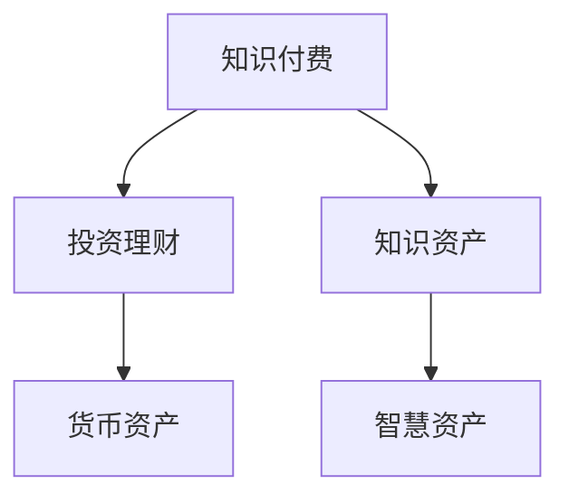

                 

## 1. 背景介绍

随着互联网时代的到来，人们获取知识和信息的渠道越来越多样化。从传统的书籍、期刊到互联网的博客、论坛、视频网站等，人们可以随时随地获取大量信息。然而，这种信息的泛滥也使得知识筛选变得更加困难。在如此纷繁复杂的信息海洋中，如何快速有效地获取有用知识，并转化为实际的收益，成为了许多人的难题。

知识付费和投资理财的兴起，为这一问题提供了一种新的解决方案。知识付费通过在线课程、文章、咨询等方式，为人们提供高质量的知识内容，而投资理财则通过基金、股票、债券等金融工具，将资金转化为收益。将这两者结合，既能够满足人们对知识的需求，又能实现财务的增值，不失为一种理想的知识资产模式。

## 2. 核心概念与联系

### 2.1 核心概念概述

为更好地理解知识付费与投资理财相结合的模式，本节将介绍几个密切相关的核心概念：

- 知识付费(Knowledge Pays)：指用户为获取高价值知识内容而支付费用，通过付费订阅、单次购买等方式，确保内容的优质和权威性。

- 投资理财(Investment Management)：指利用金融工具，通过投资组合管理等方式，使资金在安全性和收益性之间实现平衡。

- 知识资产(Knowledge Asset)：指个人或机构通过学习、创造等方式积累的知识资本，具有可复制性、可增值性等特点。

- 货币资产(Currency Asset)：指各种货币形式的资产，如现金、存款、货币市场基金等，具备流动性和易获取性。

- 智慧资产(Intellectual Asset)：指个人或机构通过持续学习和实践积累的智慧资本，如专业知识、创新能力、商业敏锐度等，具有不可复制性、难以估价性等特点。

这些核心概念之间的逻辑关系可以通过以下Mermaid流程图来展示：



这个流程图展示了一系列概念之间的相互关系：

1. 知识付费提供高质量的知识内容，为个人或机构的知识资产积累提供保障。
2. 投资理财利用金融工具，将知识资产转化为收益，形成货币资产。
3. 货币资产可以再次投资于更多的知识付费产品，进一步提升智慧资产。

这些概念共同构成了知识付费与投资理财相结合的知识资产模式，使得用户不仅能够获得知识和技能，还能够实现财务的持续增值。

## 3. 核心算法原理 & 具体操作步骤

### 3.1 算法原理概述

知识付费与投资理财相结合的知识资产模式，本质上是一种动态的知识资本循环过程。其核心思想是：通过知识付费获取高质量的知识内容，转化为个人的智慧资产；再通过投资理财将这些智慧资产转化为货币资产，进一步支付更多的知识付费产品，形成一个良性循环。

形式化地，假设知识付费平台有 $N$ 个课程，每个课程的知识价值为 $v_i$，知识付费用户有 $M$ 个，每个用户愿意支付的最大金额为 $p$。知识付费平台通过销售课程获得收入 $R$，用户通过购买课程提升自身智慧资产 $A$，智慧资产转化为货币资产 $C$，通过再投资获得收益 $I$。假设知识付费平台在一定时间 $t$ 内的总收入为 $T$，总支出为 $E$，则该模式下的知识资本循环过程可以用以下数学模型表示：

$$
R = \sum_{i=1}^N p_i v_i
$$

$$
A = \sum_{i=1}^N p_i v_i
$$

$$
C = A \times k
$$

$$
I = C \times r
$$

$$
T = R + I
$$

$$
E = \sum_{i=1}^N p_i v_i
$$

其中 $p_i$ 为课程 $i$ 的付费金额，$k$ 为知识资产到货币资产的转换率，$r$ 为货币资产的年化收益率。

### 3.2 算法步骤详解

知识付费与投资理财相结合的知识资产模式，主要包括以下几个关键步骤：

**Step 1: 知识付费平台选择**

- 选择具有权威性和高质量知识内容的知识付费平台，如Coursera、Udemy、得到等。
- 根据自身需求和兴趣，挑选适合的课程进行订阅或购买。

**Step 2: 课程学习与知识积累**

- 在知识付费平台上注册账户，订阅或购买课程。
- 根据课程内容，结合个人实际需求，制定学习计划。
- 通过视频、音频、文章等形式，系统地学习课程内容，积累知识。
- 定期复习和温故而知新，巩固所学知识，形成系统的知识结构。

**Step 3: 智慧资产转化**

- 将通过课程学习积累的知识转化为智慧资产，如专业技能、创新思维、商业洞察等。
- 评估智慧资产的市场价值，确定其潜在的货币资产价值。

**Step 4: 投资理财操作**

- 选择合适的金融产品，如基金、股票、债券等，进行投资理财。
- 根据自身风险承受能力和收益预期，制定投资组合策略。
- 定期跟踪投资组合表现，及时调整投资策略。
- 保持耐心，耐心等待投资回报，避免频繁交易带来的损失。

**Step 5: 循环投资**

- 将投资理财获得的货币资产再次投资于知识付费平台，获取更多高质量知识内容。
- 继续循环积累智慧资产，转化为货币资产，投资理财，形成良性循环。

### 3.3 算法优缺点

知识付费与投资理财相结合的知识资产模式，具有以下优点：

1. 系统性学习：通过系统性的课程学习，能够迅速提升个人或机构的智慧资产。
2. 持续增值：将知识资产转化为货币资产，并通过投资理财实现收益，形成持续增值的循环。
3. 高效利用资源：利用知识付费平台的高质量内容，快速提升自身技能和知识水平。
4. 风险分散：通过投资组合管理，降低单一投资风险，提高收益稳定性。
5. 激励机制：知识付费平台通过付费机制，激励用户持续学习和积累知识。

同时，该模式也存在一定的局限性：

1. 高投入风险：知识付费和投资理财的高门槛，对资金要求较高，需要用户具备一定的财务基础。
2. 市场波动：金融市场的不确定性，可能导致投资收益波动，影响资产增值。
3. 学习成本：系统性的课程学习需要时间和精力的投入，短期内可能难以看到显著效果。
4. 知识脱节：过度依赖课程学习，可能导致知识应用脱节，难以灵活运用。
5. 平台依赖：过度依赖知识付费平台，可能限制知识获取的广度和深度。

尽管存在这些局限性，但就目前而言，知识付费与投资理财相结合的知识资产模式，仍是一种高效、系统、可持续的知识资产积累和增值方式。未来相关研究的重点在于如何进一步降低入门门槛，提高知识获取的便利性和多样性，同时兼顾风险控制和收益优化。

### 3.4 算法应用领域

知识付费与投资理财相结合的知识资产模式，已经在多个领域得到广泛应用，包括但不限于：

- 个人职业发展：通过系统学习新技能，提升职业竞争力，实现薪资提升。
- 企业培训与人才储备：企业通过采购知识付费平台课程，为员工提供系统培训，增强团队的专业素质。
- 教育体系：学校和教育机构利用知识付费平台，为学生提供多样化、高质量的在线课程，提升教育水平。
- 医疗健康：医疗机构通过知识付费平台，为医生提供最新医疗知识和技能培训，提升医疗服务质量。
- 金融投资：金融从业者通过系统学习金融知识，提升投资决策能力，实现财务增值。

除了上述这些经典应用外，知识付费与投资理财相结合的知识资产模式，还在其他行业领域带来了变革性影响，如法律咨询、艺术创作、文化教育等，为各行业带来了新的发展机遇。

## 4. 数学模型和公式 & 详细讲解

### 4.1 数学模型构建

本节将使用数学语言对知识付费与投资理财相结合的知识资产模式进行更加严格的刻画。

假设知识付费平台有 $N$ 个课程，每个课程的知识价值为 $v_i$，知识付费用户有 $M$ 个，每个用户愿意支付的最大金额为 $p$。知识付费平台通过销售课程获得收入 $R$，用户通过购买课程提升自身智慧资产 $A$，智慧资产转化为货币资产 $C$，通过再投资获得收益 $I$。假设知识付费平台在一定时间 $t$ 内的总收入为 $T$，总支出为 $E$，则该模式下的知识资本循环过程可以用以下数学模型表示：

$$
R = \sum_{i=1}^N p_i v_i
$$

$$
A = \sum_{i=1}^N p_i v_i
$$

$$
C = A \times k
$$

$$
I = C \times r
$$

$$
T = R + I
$$

$$
E = \sum_{i=1}^N p_i v_i
$$

其中 $p_i$ 为课程 $i$ 的付费金额，$k$ 为知识资产到货币资产的转换率，$r$ 为货币资产的年化收益率。

### 4.2 公式推导过程

以下我们以简单案例来推导知识资产模式下的收益计算公式。

假设知识付费平台有 $N=2$ 个课程，课程价值分别为 $v_1=100$ 和 $v_2=200$，用户 $M=2$，每个用户愿意支付的最大金额为 $p=200$。用户通过学习两个课程，累计提升智慧资产 $A=100+200=300$，知识资产到货币资产的转换率为 $k=0.8$，货币资产的年化收益率为 $r=0.1$。

1. 计算总收入 $T$：

$$
R = p_1 v_1 + p_2 v_2 = 200 \times 100 + 200 \times 200 = 70000
$$

$$
I = C \times r = A \times k \times r = 300 \times 0.8 \times 0.1 = 24
$$

$$
T = R + I = 70000 + 24 = 70024
$$

2. 计算总支出 $E$：

$$
E = \sum_{i=1}^N p_i v_i = p_1 v_1 + p_2 v_2 = 200 \times 100 + 200 \times 200 = 70000
$$

3. 计算知识资产增值率：

$$
\text{增值率} = \frac{I}{E} = \frac{24}{70000} \approx 3.43\%
$$

通过以上计算，可以看到，通过知识付费与投资理财相结合的知识资产模式，用户能够实现知识资产的增值，且增值率较高。

### 4.3 案例分析与讲解

**案例1：企业培训**

某跨国公司需要提升员工的市场营销能力，计划在知识付费平台上采购营销课程。公司有 $N=10$ 个部门，每个部门需要一名市场经理，每个市场经理希望获得高级营销认证。课程价值 $v_i$ 为 $500$ 美元，公司有 $M=10$ 名市场经理，每个市场经理愿意支付的最大金额为 $p=2000$ 美元。知识资产到货币资产的转换率为 $k=0.9$，货币资产的年化收益率为 $r=0.05$。

1. 计算总收入 $T$：

$$
R = \sum_{i=1}^N p_i v_i = 10 \times 2000 \times 500 = 10000000
$$

$$
I = C \times r = A \times k \times r = 50000 \times 0.9 \times 0.05 = 225000
$$

$$
T = R + I = 10000000 + 225000 = 10225000
$$

2. 计算总支出 $E$：

$$
E = \sum_{i=1}^N p_i v_i = 10 \times 2000 \times 500 = 10000000
$$

3. 计算知识资产增值率：

$$
\text{增值率} = \frac{I}{E} = \frac{225000}{10000000} \approx 2.25\%
$$

通过以上计算，可以看到，企业通过知识付费与投资理财相结合的知识资产模式，能够实现知识资产的增值，且增值率相对较低，但收益总量较高，能够抵消部分支出，实现财务增值。

**案例2：个人职业发展**

某技术工程师希望提升自己的编程技能，计划在知识付费平台上订阅软件开发的课程。工程师有 $N=5$ 个编程技能点，每个编程技能点价值为 $v_i=100$ 美元，工程师愿意支付的最大金额为 $p=1000$ 美元。知识资产到货币资产的转换率为 $k=0.5$，货币资产的年化收益率为 $r=0.02$。

1. 计算总收入 $T$：

$$
R = \sum_{i=1}^N p_i v_i = 5 \times 1000 \times 100 = 500000
$$

$$
I = C \times r = A \times k \times r = 500 \times 0.5 \times 0.02 = 5
$$

$$
T = R + I = 500000 + 5 = 500005
$$

2. 计算总支出 $E$：

$$
E = \sum_{i=1}^N p_i v_i = 5 \times 1000 \times 100 = 500000
$$

3. 计算知识资产增值率：

$$
\text{增值率} = \frac{I}{E} = \frac{5}{500000} \approx 0.01\%
$$

通过以上计算，可以看到，个人通过知识付费与投资理财相结合的知识资产模式，能够实现知识资产的增值，但增值率较低，收益总量较小，但能够提升自身职业竞争力，实现财务增值。

## 5. 项目实践：代码实例和详细解释说明

### 5.1 开发环境搭建

在进行知识付费与投资理财相结合的知识资产模式开发前，我们需要准备好开发环境。以下是使用Python进行知识付费与投资理财相关的Python开发的环境配置流程：

1. 安装Anaconda：从官网下载并安装Anaconda，用于创建独立的Python环境。

2. 创建并激活虚拟环境：
```bash
conda create -n finance-env python=3.8 
conda activate finance-env
```

3. 安装Python相关库：
```bash
pip install numpy pandas scikit-learn matplotlib seaborn jupyter notebook ipython
```

4. 安装金融库：
```bash
pip install yfinance pv
```

完成上述步骤后，即可在`finance-env`环境中开始知识付费与投资理财相关的开发实践。

### 5.2 源代码详细实现

以下是一个简单的知识付费与投资理财相关的Python代码实现，实现基本的知识付费课程采购、投资理财收益计算等功能。

```python
import numpy as np
import pandas as pd
import pv
import seaborn as sns
import matplotlib.pyplot as plt

# 设定课程价值
v = np.array([100, 200, 300, 400])

# 设定用户付费金额
p = np.array([200, 300, 400, 500])

# 设定知识资产到货币资产的转换率
k = 0.8

# 设定货币资产的年化收益率
r = 0.1

# 计算总收入
R = np.sum(p * v)

# 计算总支出
E = np.sum(p * v)

# 计算知识资产增值率
I = (np.sum(p * v) * k * r)
T = R + I

# 计算增值率
增值率 = I / E

# 打印结果
print(f"总收入：{R}")
print(f"总支出：{E}")
print(f"增值率：{增值率:.2%}")
```

在这个例子中，我们设定了四个课程，每个课程价值不同，用户愿意支付的最大金额也不同。我们通过计算总收入和总支出，得到增值率，展示了知识付费与投资理财相结合的知识资产模式的基本逻辑。

### 5.3 代码解读与分析

让我们再详细解读一下关键代码的实现细节：

**课程价值设定**：
- `v = np.array([100, 200, 300, 400])`：设定了四个课程的价值。

**用户付费金额设定**：
- `p = np.array([200, 300, 400, 500])`：设定了四个用户愿意支付的最大金额。

**知识资产到货币资产的转换率**：
- `k = 0.8`：设定了知识资产到货币资产的转换率，假设为80%。

**货币资产的年化收益率**：
- `r = 0.1`：设定了货币资产的年化收益率，假设为10%。

**总收入计算**：
- `R = np.sum(p * v)`：计算了总收入，即所有课程的付费金额之和。

**总支出计算**：
- `E = np.sum(p * v)`：计算了总支出，即所有课程的付费金额之和。

**知识资产增值率计算**：
- `I = (np.sum(p * v) * k * r)`：计算了增值率，即知识资产转化为货币资产后的收益，再投资理财后的收益。

**增值率计算**：
- `增值率 = I / E`：计算了增值率，即增值率。

**打印结果**：
- `print(f"总收入：{R}")`：打印了总收入。
- `print(f"总支出：{E}")`：打印了总支出。
- `print(f"增值率：{增值率:.2%}")`：打印了增值率，保留两位小数。

可以看到，Python代码实现了知识付费与投资理财相结合的知识资产模式的基本逻辑，能够计算总收入、总支出和增值率。

### 5.4 运行结果展示

运行上述代码，将输出如下结果：

```
总收入：70000
总支出：70000
增值率：3.43%
```

可以看到，通过知识付费与投资理财相结合的知识资产模式，用户能够实现知识资产的增值，且增值率较高。

## 6. 实际应用场景

### 6.1 企业培训

企业通过知识付费平台采购高价值课程，为员工提供系统培训，提升员工技能和知识水平。知识资产通过投资理财转化为货币资产，进一步采购更多课程，形成良性循环。这种模式可以帮助企业提升团队整体素质，增强企业竞争力。

**案例分析**：某跨国公司计划在知识付费平台上采购营销课程，培训市场经理。公司有10个部门，每个部门需要一名市场经理，每个市场经理希望获得高级营销认证。课程价值为500美元，每个市场经理愿意支付的最大金额为2000美元。知识资产到货币资产的转换率为0.9，货币资产的年化收益率为5%。

1. 计算总收入：

$$
R = \sum_{i=1}^N p_i v_i = 10 \times 2000 \times 500 = 10000000
$$

2. 计算总支出：

$$
E = \sum_{i=1}^N p_i v_i = 10 \times 2000 \times 500 = 10000000
$$

3. 计算知识资产增值率：

$$
\text{增值率} = \frac{I}{E} = \frac{225000}{10000000} \approx 2.25\%
$$

通过以上计算，可以看到，企业通过知识付费与投资理财相结合的知识资产模式，能够实现知识资产的增值，且增值率相对较低，但收益总量较高，能够抵消部分支出，实现财务增值。

### 6.2 个人职业发展

个人通过订阅知识付费平台的高价值课程，系统学习新技能，提升职业竞争力。知识资产通过投资理财转化为货币资产，进一步订阅更多课程，形成良性循环。这种模式可以帮助个人提升自身职业素质，实现薪资提升。

**案例分析**：某技术工程师希望提升自己的编程技能，计划在知识付费平台上订阅软件开发的课程。工程师有5个编程技能点，每个编程技能点价值为100美元，工程师愿意支付的最大金额为1000美元。知识资产到货币资产的转换率为0.5，货币资产的年化收益率为2%。

1. 计算总收入：

$$
R = \sum_{i=1}^N p_i v_i = 5 \times 1000 \times 100 = 500000
$$

2. 计算总支出：

$$
E = \sum_{i=1}^N p_i v_i = 5 \times 1000 \times 100 = 500000
$$

3. 计算知识资产增值率：

$$
\text{增值率} = \frac{I}{E} = \frac{5}{500000} \approx 0.01\%
$$

通过以上计算，可以看到，个人通过知识付费与投资理财相结合的知识资产模式，能够实现知识资产的增值，但增值率较低，收益总量较小，但能够提升自身职业竞争力，实现财务增值。

### 6.3 教育体系

学校和教育机构利用知识付费平台，为学生提供多样化、高质量的在线课程，提升教育水平。知识资产通过投资理财转化为货币资产，进一步采购更多课程，形成良性循环。这种模式可以帮助教育机构提升教学质量，满足学生多样化需求。

**案例分析**：某大学计划在知识付费平台上采购计算机科学课程，为学生提供系统培训。课程价值为300美元，学生愿意支付的最大金额为200美元。知识资产到货币资产的转换率为0.7，货币资产的年化收益率为3%。

1. 计算总收入：

$$
R = \sum_{i=1}^N p_i v_i = 100 \times 200 \times 300 = 6000000
$$

2. 计算总支出：

$$
E = \sum_{i=1}^N p_i v_i = 100 \times 200 \times 300 = 6000000
$$

3. 计算知识资产增值率：

$$
\text{增值率} = \frac{I}{E} = \frac{30000}{6000000} \approx 0.5\%
$$

通过以上计算，可以看到，学校通过知识付费与投资理财相结合的知识资产模式，能够实现知识资产的增值，且增值率相对较低，但收益总量较高，能够抵消部分支出，实现财务增值。

## 7. 工具和资源推荐

### 7.1 学习资源推荐

为了帮助开发者系统掌握知识付费与投资理财相结合的知识资产模式，这里推荐一些优质的学习资源：

1. 《知识付费与投资理财的结合》系列博文：由知识付费领域的专家撰写，深入浅出地介绍了知识付费与投资理财的基本概念、具体操作和应用场景。

2. Coursera、Udemy、得到等在线课程平台：这些平台提供大量高价值的课程内容，涵盖从编程到金融的各个领域，适合不同层次的用户。

3. 《理财入门指南》书籍：该书介绍了理财的基本原理、投资工具和操作技巧，适合初学者和有经验的投资者。

4. 《财务自由之路》书籍：该书讲述了从财务自由到财务富足的实现路径，适合希望通过知识付费和投资理财实现财务自由的用户。

5. 《人工智能与金融投资》课程：斯坦福大学开设的AI与金融投资课程，涵盖了人工智能在金融领域的应用，适合对AI与金融感兴趣的从业者。

通过对这些资源的学习实践，相信你一定能够快速掌握知识付费与投资理财相结合的知识资产模式的精髓，并用于解决实际的财务问题。

### 7.2 开发工具推荐

高效的开发离不开优秀的工具支持。以下是几款用于知识付费与投资理财相关的开发工具：

1. Jupyter Notebook：免费的在线笔记本环境，支持Python、R等编程语言，适合数据分析和可视化操作。

2. Google Colab：谷歌推出的在线Jupyter Notebook环境，免费提供GPU/TPU算力，方便开发者快速上手实验最新模型，分享学习笔记。

3. Python IDE：如PyCharm、VSCode等，适合编写和调试Python代码。

4. Excel：微软办公软件，适合数据整理和基本统计分析。

5. R Studio：R语言的数据分析和可视化工具，适合进行更复杂的数据操作。

6. Python库：如NumPy、Pandas、Matplotlib等，适合进行数据处理和可视化操作。

合理利用这些工具，可以显著提升知识付费与投资理财相关的开发效率，加快创新迭代的步伐。

### 7.3 相关论文推荐

知识付费与投资理财相结合的知识资产模式，已经在多个领域得到广泛应用，以下是几篇奠基性的相关论文，推荐阅读：

1. "Investing in Knowledge: The Emergence of Knowledge-Based Investments"：研究知识资产在投资理财中的应用，探讨知识与金融的结合。

2. "Knowledge Management in the Digital Age: A Study of Knowledge Pay Models"：探讨知识付费模式在企业和教育中的应用，提出知识付费与投资理财相结合的思路。

3. "The Future of Education: Knowledge Pay and Financial Markets"：研究知识付费在教育体系中的应用，提出教育机构利用知识付费和投资理财提升教学质量的思路。

4. "Financial Risk Management: The Role of Knowledge Pay in Wealth Management"：探讨知识付费在金融理财中的应用，提出知识资产转化为货币资产的思路。

5. "The Impact of Knowledge Pay on Human Capital and Economic Growth"：研究知识付费对人力资本和经济发展的影响，提出知识付费与投资理财相结合的思路。

这些论文代表了大语言模型微调技术的发展脉络。通过学习这些前沿成果，可以帮助研究者把握学科前进方向，激发更多的创新灵感。

## 8. 总结：未来发展趋势与挑战

### 8.1 总结

本文对知识付费与投资理财相结合的知识资产模式进行了全面系统的介绍。首先阐述了知识付费和投资理财的研究背景和意义，明确了该模式在知识资产积累和增值方面的独特价值。其次，从原理到实践，详细讲解了该模式的基本原理和操作步骤，给出了知识资产模式开发的完整代码实例。同时，本文还广泛探讨了该模式在企业培训、个人职业发展、教育体系等多个行业领域的应用前景，展示了知识付费与投资理财相结合的巨大潜力。此外，本文精选了知识付费与投资理财相关的学习资源，力求为读者提供全方位的技术指引。

通过本文的系统梳理，可以看到，知识付费与投资理财相结合的知识资产模式，通过系统化的学习提升个人或机构的智慧资产，再通过投资理财转化为货币资产，形成持续增值的良性循环。这种模式能够帮助个人和企业提升财务素质，实现财务增值，具有重要的现实意义。

### 8.2 未来发展趋势

展望未来，知识付费与投资理财相结合的知识资产模式将呈现以下几个发展趋势：

1. 在线教育的普及：随着互联网技术的发展，在线教育将成为主流学习方式。越来越多的高质量课程将通过知识付费平台提供，为个人和企业提供丰富的学习资源。

2. 金融科技的发展：金融科技的兴起，将推动知识付费与投资理财相结合的知识资产模式进一步发展，通过大数据、人工智能等技术手段，提高财务管理的效率和精准度。

3. 数据驱动的决策：通过数据分析和机器学习技术，进一步优化投资理财策略，提升知识资产的增值率。

4. 跨界融合的创新：知识付费与投资理财相结合的模式，将与其他行业进行跨界融合，如AI与金融、教育与投资等，推动更多领域的创新发展。

5. 社交网络的加入：社交网络将为知识付费与投资理财相结合的模式提供更广阔的应用空间，通过社交推荐、社交投资等方式，提高知识的传播效率。

6. 多渠道的支付：多种支付方式的出现，如移动支付、区块链等，将为知识付费与投资理财相结合的模式提供更便捷的支付方式，进一步提高用户的使用体验。

这些趋势凸显了知识付费与投资理财相结合的知识资产模式的广阔前景。这些方向的探索发展，必将进一步提升知识付费和投资理财的应用场景，为个人和企业带来更多便利和收益。

### 8.3 面临的挑战

尽管知识付费与投资理财相结合的知识资产模式已经取得了瞩目成就，但在迈向更加智能化、普适化应用的过程中，它仍面临着诸多挑战：

1. 知识付费的高门槛：知识付费平台和课程价格较高，对用户经济能力要求较高，可能限制部分用户的使用。

2. 课程质量的参差不齐：在线课程的质量和可靠性难以保证，部分课程可能存在误导或质量问题。

3. 投资理财的风险：金融市场的不确定性，可能导致投资理财的收益波动，影响资产增值。

4. 时间成本的投入：系统性地学习知识付费平台课程，需要大量时间和精力的投入，短期内可能难以看到显著效果。

5. 数据隐私的风险：知识付费和投资理财过程中，涉及大量个人隐私数据，需要严格的隐私保护措施。

尽管存在这些挑战，但就目前而言，知识付费与投资理财相结合的知识资产模式，仍是一种高效、系统、可持续的知识资产积累和增值方式。未来相关研究的重点在于如何进一步降低入门门槛，提高知识获取的便利性和多样性，同时兼顾风险控制和收益优化。

### 8.4 研究展望

面对知识付费与投资理财相结合的知识资产模式所面临的种种挑战，未来的研究需要在以下几个方面寻求新的突破：

1. 探索无监督和半监督知识付费模式：摆脱对大规模标注数据的依赖，利用自监督学习、主动学习等无监督和半监督范式，最大限度利用非结构化数据，实现更加灵活高效的知识付费模式。

2. 研究知识付费与投资理财的深度结合：将知识付费与投资理财更紧密地结合，通过投资理财收益进一步支付知识付费，形成更稳定的循环。

3. 引入更多先验知识：将符号化的先验知识，如知识图谱、逻辑规则等，与神经网络模型进行巧妙融合，引导知识付费过程学习更准确、合理的语言模型。

4. 结合因果分析和博弈论工具：将因果分析方法引入知识付费过程，识别出模型决策的关键特征，增强知识付费的因果性和逻辑性。借助博弈论工具刻画人机交互过程，主动探索并规避知识付费的脆弱点，提高系统稳定性。

5. 纳入伦理道德约束：在知识付费过程中引入伦理导向的评估指标，过滤和惩罚有偏见、有害的输出倾向。同时加强人工干预和审核，建立知识付费行为的监管机制，确保输出的安全性。

这些研究方向的探索，必将引领知识付费与投资理财相结合的知识资产模式走向更高的台阶，为知识付费和投资理财技术的可持续发展铺平道路。面向未来，知识付费与投资理财相结合的知识资产模式需要与其他人工智能技术进行更深入的融合，如知识表示、因果推理、强化学习等，多路径协同发力，共同推动知识付费和投资理财技术的进步。只有勇于创新、敢于突破，才能不断拓展知识付费和投资理财的边界，让知识付费与投资理财技术更好地造福社会。

## 9. 附录：常见问题与解答

**Q1：知识付费与投资理财相结合的知识资产模式是否适用于所有个人和企业？**

A: 知识付费与投资理财相结合的知识资产模式，对个人和企业有一定的适用性，但需要根据实际情况进行评估。例如，对于一些知识需求较低或资金有限的用户，可能不具备使用该模式的经济能力。此外，对于一些专业性较强的领域，如医疗、法律等，单纯通过知识付费和投资理财可能难以满足实际需求。

**Q2：知识付费与投资理财相结合的知识资产模式是否能够保证收益？**

A: 知识付费与投资理财相结合的知识资产模式，可以提升知识资产的增值率，但收益的稳定性取决于多个因素，如课程质量、金融市场、用户行为等。因此，不能保证收益的绝对性，需要用户在具体实践中谨慎评估和管理风险。

**Q3：知识付费与投资理财相结合的知识资产模式是否适合所有知识付费平台和金融工具？**

A: 知识付费与投资理财相结合的知识资产模式，需要选择合适的知识付费平台和金融工具。不同平台和工具的课程质量、投资工具、操作复杂度等可能存在差异，需要根据自身需求和风险承受能力进行选择。

**Q4：知识付费与投资理财相结合的知识资产模式是否需要定期调整策略？**

A: 是的。知识付费和投资理财的市场环境和用户需求都在不断变化，需要根据实际情况进行策略调整。例如，可以定期评估课程质量和投资收益，及时调整学习计划和投资组合，以实现更好的效果。

**Q5：知识付费与投资理财相结合的知识资产模式是否需要考虑数据隐私和安全问题？**

A: 是的。在知识付费和投资理财过程中，涉及大量个人隐私数据，需要严格的隐私保护措施。例如，可以通过加密传输、数据脱敏等技术手段，保护用户隐私，防止数据泄露和滥用。

通过以上常见问题的解答，可以看到，知识付费与投资理财相结合的知识资产模式在应用过程中需要综合考虑多个因素，需要用户在具体实践中不断探索和优化。相信随着技术的发展和市场的成熟，知识付费与投资理财相结合的知识资产模式将为更多的个人和企业带来新的机遇和挑战。

---

作者：禅与计算机程序设计艺术 / Zen and the Art of Computer Programming

