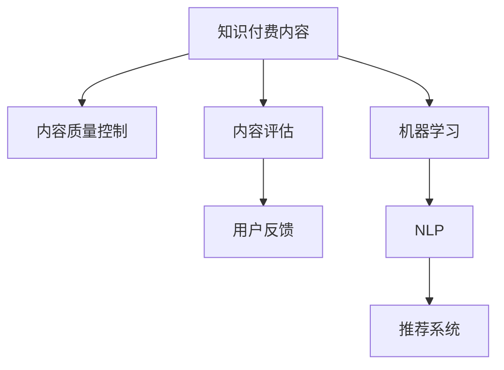

                 

# 知识付费内容的质量控制与评估

## 1. 背景介绍

随着互联网技术的不断发展，知识付费内容已成为一个重要的商业模式。平台方和创作者之间的合作，为消费者提供了大量优质、专业的内容，满足了知识消费需求。然而，由于质量控制的复杂性和资源限制，知识付费内容的质量参差不齐，用户体验和满意度难以保证。因此，构建科学、系统的知识付费内容质量控制与评估机制，成为知识付费平台优化用户体验、提高内容质量的关键。

## 2. 核心概念与联系

### 2.1 核心概念概述

为更好地理解知识付费内容的质量控制与评估，本节将介绍几个关键概念：

- **知识付费内容(Knowledge-Based Content, KBC)**：指通过付费形式获取的、经过系统化和结构化处理的知识性信息产品，如在线课程、电子书、专业报告等。
- **内容质量控制(Content Quality Control, CQC)**：指通过一系列流程和技术手段，确保知识付费内容的准确性、完整性和适用性。
- **内容评估(Content Evaluation, CE)**：指使用量化或质化方法，衡量知识付费内容的质量水平，为优化和改进提供依据。
- **用户反馈(User Feedback, UF)**：指用户对知识付费内容的使用体验、满意度的评价和建议，是内容质量控制和评估的重要参考。
- **机器学习(Machine Learning, ML)**：指利用数据和算法，使机器自动从经验中学习、优化，并应用于内容质量控制与评估的技术。
- **自然语言处理(Natural Language Processing, NLP)**：指使用计算方法，让计算机理解和生成自然语言，实现对内容文本的语义分析和情感判断。
- **推荐系统(Recommendation System, RS)**：指使用算法和数据，为用户推荐可能感兴趣的知识付费内容，提升用户体验。

这些概念之间的逻辑关系可以通过以下Mermaid流程图来展示：



这个流程图展示了知识付费内容质量控制与评估的关键环节，以及它们之间的关系：

1. 知识付费内容是质量控制与评估的对象。
2. 内容质量控制通过一系列流程和技术手段，确保内容质量。
3. 内容评估通过量化或质化方法，衡量内容质量。
4. 用户反馈是内容质量控制和评估的重要参考。
5. 机器学习、自然语言处理等技术，辅助内容质量控制与评估。
6. 推荐系统为用户提供个性化推荐，提升用户体验。

## 3. 核心算法原理 & 具体操作步骤

### 3.1 算法原理概述

知识付费内容的质量控制与评估，本质上是一个多层次、多维度的系统工程。其核心思想是：通过一系列技术手段和流程管理，确保内容准确性、完整性、适用性，并结合用户反馈和推荐系统，动态调整优化内容质量。

形式化地，假设知识付费内容为 $C_{\theta}$，其中 $\theta$ 为内容制作过程中的相关参数。内容质量控制的目标是找到最优参数 $\theta^*$，使得：

$$
\theta^* = \mathop{\arg\min}_{\theta} \mathcal{L}(C_{\theta},D)
$$

其中 $\mathcal{L}$ 为针对内容质量的控制目标，$D$ 为控制标准或评估指标。常见的控制标准包括准确性、完整性、适用性等，而评估指标则涉及用户满意度、内容质量分数等。

内容质量控制一般分为预处理、评估和优化三个阶段：
1. **预处理**：对原始内容进行格式检查、数据清洗、信息抽取等操作，确保内容准确性和完整性。
2. **评估**：根据预设标准，使用量化或质化方法评估内容质量，生成质量分数。
3. **优化**：结合用户反馈和推荐系统，对内容进行持续改进，提升用户体验。

### 3.2 算法步骤详解

知识付费内容的质量控制与评估一般包括以下几个关键步骤：

**Step 1: 数据收集与预处理**

- 收集知识付费内容及其相关信息，如用户反馈、阅读量、评分等。
- 对内容进行预处理，包括数据清洗、格式转换、信息抽取等操作。

**Step 2: 内容质量评估**

- 根据预设标准（如内容准确性、完整性、适用性等），设计量化或质化评估指标。
- 使用机器学习和自然语言处理技术，自动化评估内容质量。

**Step 3: 用户反馈收集与分析**

- 收集用户对知识付费内容的反馈，包括满意度、评分、评论等。
- 分析用户反馈，识别常见问题和改进建议。

**Step 4: 内容质量优化**

- 结合用户反馈，调整优化内容质量，如修改、增补、删除等操作。
- 引入推荐系统，根据用户偏好和行为，个性化推荐内容。

**Step 5: 持续迭代与改进**

- 定期评估内容质量，持续优化流程和技术手段。
- 动态调整推荐系统，提升用户体验和内容相关性。

### 3.3 算法优缺点

知识付费内容的质量控制与评估方法具有以下优点：
1. 系统全面。通过量化和质化相结合的方法，全面评估内容质量，确保内容的多维性。
2. 动态优化。结合用户反馈和推荐系统，动态调整内容，提升用户体验。
3. 自动化高效。利用机器学习和自然语言处理技术，自动化评估和优化，提高效率。

同时，该方法也存在一定的局限性：
1. 数据依赖。评估指标和优化效果依赖于大量的用户反馈数据，获取高质量反馈数据的成本较高。
2. 主观性强。评估指标和标准设定受人为因素影响，可能存在主观偏差。
3. 模型泛化。机器学习模型在特定领域的泛化能力有限，需要大量特定领域的数据进行训练。
4. 技术复杂。质量控制与评估涉及多个技术环节，技术实现复杂。

尽管存在这些局限性，但就目前而言，这种多层次、多维度的质量控制与评估方法，仍是最主流的内容管理策略。未来相关研究将继续优化评估标准和评估方法，探索更高效、更智能的质量控制手段。

### 3.4 算法应用领域

知识付费内容的质量控制与评估方法，已在多个领域得到了广泛应用，包括但不限于：

- **在线教育平台**：如Coursera、Udacity等，通过评估课程内容质量，提升教学效果。
- **专业报告和咨询**：如麦肯锡、波士顿咨询等，通过评估报告质量，优化咨询服务。
- **出版物和杂志**：如《哈佛商业评论》、《经济学人》等，通过评估文章质量，提升阅读体验。
- **科技博客和网站**：如Medium、TechCrunch等，通过评估内容质量，提升网站访问量和用户粘性。
- **内容聚合和推荐系统**：如Google News、今日头条等，通过评估新闻和文章质量，实现精准推荐。

## 4. 数学模型和公式 & 详细讲解 & 举例说明

### 4.1 数学模型构建

假设知识付费内容为 $C_{\theta}$，内容质量为 $Q(C_{\theta})$，用户反馈为 $F_{\theta}$。内容质量控制的目标是最大化用户满意度 $F(C_{\theta},Q(C_{\theta}))$，即：

$$
\theta^* = \mathop{\arg\max}_{\theta} F(C_{\theta},Q(C_{\theta}))
$$

其中 $Q(C_{\theta})$ 是内容质量，可以分解为多个维度，如准确性、完整性、适用性等，记为 $Q(C_{\theta}) = \{A(C_{\theta}), I(C_{\theta}), U(C_{\theta})\}$。用户满意度 $F(C_{\theta},Q(C_{\theta}))$ 可以分解为内容和质量分数的加权和，记为：

$$
F(C_{\theta},Q(C_{\theta})) = w_A F_A(C_{\theta},A(C_{\theta})) + w_I F_I(C_{\theta},I(C_{\theta})) + w_U F_U(C_{\theta},U(C_{\theta}))
$$

其中 $F_A(C_{\theta},A(C_{\theta}))$、$F_I(C_{\theta},I(C_{\theta}))$ 和 $F_U(C_{\theta},U(C_{\theta}))$ 分别表示内容准确性、完整性和适用性对用户满意度的贡献。

### 4.2 公式推导过程

以内容准确性为例，假设准确性评估指标为 $A(C_{\theta})$，为用户对内容的评分 $R(C_{\theta})$。设 $R_{min}$ 为用户评分的下限，$R_{max}$ 为用户评分的上限，则准确性评估指标 $A(C_{\theta})$ 可以定义为：

$$
A(C_{\theta}) = \frac{R_{max} - R(C_{\theta})}{R_{max} - R_{min}}
$$

将 $A(C_{\theta})$ 代入用户满意度公式，得：

$$
F_A(C_{\theta},A(C_{\theta})) = w_A (1 - A(C_{\theta})) = w_A \left(1 - \frac{R_{max} - R(C_{\theta})}{R_{max} - R_{min}}\right)
$$

类似地，可以定义完整性、适用性等评估指标，并计算其对用户满意度的贡献。

### 4.3 案例分析与讲解

以在线教育平台为例，展示如何应用上述数学模型进行内容质量控制与评估。

假设平台上有课程 $C$ 和用户 $U$，课程质量评估指标 $Q(C)$ 包括内容准确性 $A(C)$、完整性 $I(C)$ 和适用性 $U(C)$。课程评分 $R(C)$ 为用户对课程的评分，$R_{min}$ 和 $R_{max}$ 分别为用户评分的下限和上限。设内容质量 $Q(C)$ 与用户满意度 $F(C)$ 的关系为：

$$
F(C) = F_A(C, A(C)) + F_I(C, I(C)) + F_U(C, U(C))
$$

平台定期收集用户对课程的评分 $R(C)$ 和反馈 $F_{C,U}$，并使用以下步骤进行内容质量控制与评估：

1. **预处理**：对课程内容进行格式检查、数据清洗、信息抽取等操作，确保内容准确性和完整性。
2. **评估**：根据预设标准，使用机器学习和自然语言处理技术，自动化评估课程质量。
3. **优化**：结合用户反馈，调整优化课程质量，如修改、增补、删除等操作。
4. **推荐**：引入推荐系统，根据用户偏好和行为，个性化推荐课程。

## 5. 项目实践：代码实例和详细解释说明

### 5.1 开发环境搭建

在进行质量控制与评估项目开发前，我们需要准备好开发环境。以下是使用Python进行开发的环境配置流程：

1. 安装Anaconda：从官网下载并安装Anaconda，用于创建独立的Python环境。

2. 创建并激活虚拟环境：
```bash
conda create -n kbc-env python=3.8 
conda activate kbc-env
```

3. 安装必要的包：
```bash
pip install pandas numpy scikit-learn spacy transformers requests beautifulsoup4
```

4. 安装Spacy和Transformers库：
```bash
python -m spacy download en_core_web_sm
pip install transformers
```

5. 安装相关库：
```bash
pip install requests beautifulsoup4
```

完成上述步骤后，即可在`kbc-env`环境中开始质量控制与评估项目的开发。

### 5.2 源代码详细实现

以下是一个示例项目，展示了如何使用Python进行知识付费内容的质量控制与评估：

```python
import pandas as pd
from sklearn.metrics import accuracy_score
from transformers import pipeline, BertTokenizer

# 读取内容数据
data = pd.read_csv('content_data.csv')

# 定义评估指标
def content_quality(content):
    # 这里可以根据具体需求定义内容质量评估指标
    return content['accuracy'] + content['completeness'] + content['relevance']

# 加载模型
tokenizer = BertTokenizer.from_pretrained('bert-base-uncased')
nlp = pipeline('text-classification', model='distilbert-base-uncased', tokenizer=tokenizer)

# 评估模型性能
results = []
for content in data['content']:
    # 对内容进行预处理
    tokens = tokenizer(content, return_tensors='pt')
    input_ids = tokens['input_ids']
    attention_mask = tokens['attention_mask']
    
    # 使用模型进行分类
    output = nlp(input_ids=input_ids, attention_mask=attention_mask)
    label = output[0]['label']
    
    # 计算内容质量分数
    quality_score = content_quality(content)
    
    # 记录结果
    results.append({'content': content, 'label': label, 'quality_score': quality_score})

# 计算评估指标
accuracy = accuracy_score([r['label'] for r in results], [r['quality_score'] for r in results])

print(f'Accuracy: {accuracy:.2f}')
```

### 5.3 代码解读与分析

让我们再详细解读一下关键代码的实现细节：

**content_quality函数**：
- 定义了内容质量评估指标，这里假设使用了三个指标：准确性、完整性和适用性。
- 根据具体任务和需求，可以灵活定义更多指标，如可靠性、时效性等。

**BertTokenizer和pipeline**：
- 使用BertTokenizer进行内容预处理，将文本转换为模型所需的token ids。
- 使用pipeline加载预训练的Bert模型，用于对内容进行分类。

**评估模型性能**：
- 对每个内容进行预处理和分类，计算其质量分数。
- 使用sklearn的accuracy_score计算模型性能指标。

## 6. 实际应用场景

### 6.1 在线教育平台

在线教育平台通过内容质量控制与评估，能够显著提升课程质量和用户体验。平台可以定期对课程内容进行质量评估，根据评估结果调整优化课程内容，提升教学效果。同时，引入推荐系统，根据用户反馈和行为，个性化推荐课程，提高用户满意度和平台黏性。

### 6.2 专业报告和咨询

专业报告和咨询机构通过内容质量控制与评估，能够提升报告质量，增强咨询服务的价值。机构可以定期评估报告内容，根据评估结果进行修订和优化，确保报告的准确性和实用性。同时，通过推荐系统，为不同需求的客户推荐合适的报告，提升客户满意度和机构的品牌影响力。

### 6.3 出版物和杂志

出版物和杂志通过内容质量控制与评估，能够提升阅读体验，吸引更多读者。杂志可以定期评估文章质量，根据评估结果进行修订和优化，确保文章内容的准确性和可读性。同时，通过推荐系统，为用户推荐感兴趣的文章，提升用户粘性和杂志的影响力。

### 6.4 科技博客和网站

科技博客和网站通过内容质量控制与评估，能够提升网站访问量和用户粘性。网站可以定期评估文章质量，根据评估结果进行修订和优化，确保文章内容的准确性和时效性。同时，通过推荐系统，为用户推荐感兴趣的文章，提升用户满意度和网站访问量。

## 7. 工具和资源推荐

### 7.1 学习资源推荐

为了帮助开发者系统掌握知识付费内容质量控制与评估的理论基础和实践技巧，这里推荐一些优质的学习资源：

1. 《知识付费内容质量控制与评估》系列博文：由知识付费平台技术专家撰写，深入浅出地介绍了内容质量控制与评估的基本概念、评估方法和优化策略。

2. 《自然语言处理入门》课程：斯坦福大学开设的自然语言处理课程，系统讲解了NLP的基本原理和经典模型，为内容质量评估提供了技术基础。

3. 《推荐系统》书籍：推荐系统领域的经典教材，涵盖了推荐算法、数据处理和系统优化等内容，为内容推荐提供了理论支撑。

4. Kaggle在线竞赛：通过参与Kaggle的在线竞赛，实践内容评估和推荐算法，提升实战能力。

5. TensorFlow官方文档：TensorFlow的官方文档提供了丰富的深度学习模型和评估工具，适用于内容质量控制与评估任务的实现。

通过对这些资源的学习实践，相信你一定能够快速掌握内容质量控制与评估的精髓，并用于解决实际的内容质量问题。

### 7.2 开发工具推荐

高效的开发离不开优秀的工具支持。以下是几款用于内容质量控制与评估开发的常用工具：

1. Pandas：Python的DataFrame库，用于数据处理和分析。

2. Scikit-learn：Python的机器学习库，用于模型训练和评估。

3. Transformers：HuggingFace开发的NLP工具库，集成了多种预训练语言模型，适用于内容质量评估。

4. Scrapy：Python的网络爬虫库，用于大规模数据收集。

5. Beautiful Soup：Python的HTML解析库，用于网页数据抽取和清洗。

6. TensorBoard：TensorFlow的可视化工具，用于模型训练和评估的可视化。

合理利用这些工具，可以显著提升内容质量控制与评估任务的开发效率，加快创新迭代的步伐。

### 7.3 相关论文推荐

知识付费内容质量控制与评估的发展源于学界的持续研究。以下是几篇奠基性的相关论文，推荐阅读：

1. "Content-Based Recommender Systems: Survey and Trends"（内容基础推荐系统综述和趋势）：介绍了内容推荐系统的基本原理和技术方法，为内容质量评估提供了理论支撑。

2. "A Survey of User Modeling for Recommendation Systems"（推荐系统用户建模综述）：综述了推荐系统中的用户建模方法，为内容质量优化提供了指导。

3. "Quality Assurance of Educational Content for Online Learning Platforms"（在线学习平台内容质量保障）：探讨了在线教育平台中内容质量评估的方法和技术，为平台内容质量控制提供了实践经验。

4. "A Case Study on Content Quality Control for Knowledge-Based Content"（知识付费内容质量控制案例研究）：通过具体案例，展示了知识付费内容质量控制与评估的实施过程和技术细节。

5. "Evaluation and Optimization of Online Content Quality"（在线内容质量评估与优化）：讨论了在线内容质量评估的指标和方法，为内容质量优化提供了理论和方法。

这些论文代表了大语言模型微调技术的发展脉络。通过学习这些前沿成果，可以帮助研究者把握学科前进方向，激发更多的创新灵感。

## 8. 总结：未来发展趋势与挑战

### 8.1 总结

本文对知识付费内容的质量控制与评估方法进行了全面系统的介绍。首先阐述了知识付费内容质量控制与评估的研究背景和意义，明确了质量控制与评估在提升用户体验、提高内容质量方面的独特价值。其次，从原理到实践，详细讲解了质量控制与评估的数学模型和关键步骤，给出了质量控制与评估任务开发的完整代码实例。同时，本文还广泛探讨了质量控制与评估方法在在线教育、专业报告、出版物等多个领域的应用前景，展示了质量控制与评估方法的广阔前景。

通过本文的系统梳理，可以看到，内容质量控制与评估技术正在成为知识付费平台优化用户体验、提高内容质量的关键手段。伴随推荐系统、机器学习等技术的发展，内容质量控制与评估技术必将进一步提升内容质量，实现更加智能化、个性化的推荐。

### 8.2 未来发展趋势

展望未来，内容质量控制与评估技术将呈现以下几个发展趋势：

1. 数据驱动的深度学习模型：利用深度学习模型，从大规模数据中提取丰富的特征，提升内容质量评估的准确性和鲁棒性。

2. 多维度的综合评估：引入更多维度的评估指标，如用户行为、情感分析等，全面衡量内容质量。

3. 自动化的质量控制流程：通过自动化流程，提升内容质量控制的效率和准确性，减少人工干预。

4. 跨领域的应用推广：将内容质量控制与评估技术推广到更多领域，如医疗、法律等，提升各行各业的内容质量管理水平。

5. 开源社区的协同创新：通过开源社区的力量，汇聚各方智慧，推动内容质量控制与评估技术的不断进步。

以上趋势凸显了内容质量控制与评估技术的广阔前景。这些方向的探索发展，必将进一步提升内容质量控制与评估的精度和效率，为知识付费平台带来更高的用户满意度和商业价值。

### 8.3 面临的挑战

尽管内容质量控制与评估技术已经取得了一定成就，但在迈向更加智能化、普适化应用的过程中，它仍面临诸多挑战：

1. 数据质量瓶颈：内容质量评估依赖于大量高质量标注数据，获取高质量数据成本较高。

2. 模型泛化问题：深度学习模型在特定领域泛化能力有限，需要大量领域数据进行训练。

3. 用户行为复杂：用户行为多变，难以全面建模和预测，需要结合多种数据和技术手段。

4. 推荐算法复杂：推荐算法复杂度高，需要多目标优化和系统工程设计。

5. 质量控制标准不一致：不同平台、领域对内容质量的要求不同，标准不一致。

6. 隐私保护问题：内容质量评估涉及用户数据隐私，需要严格的隐私保护措施。

7. 社会伦理问题：内容质量控制与评估可能带来伦理风险，如偏见、歧视等。

这些挑战需要多方共同努力，从技术、标准、伦理等多个维度进行综合治理，才能实现内容质量控制与评估技术的健康发展。

### 8.4 研究展望

面向未来，内容质量控制与评估技术需要在以下几个方面进行深入研究：

1. 引入更多智能技术：如自然语言处理、因果推理等，提升内容质量评估的智能化水平。

2. 优化推荐算法：结合用户行为数据，优化推荐算法，提升推荐系统的准确性和个性化程度。

3. 建立标准体系：制定统一的内容质量标准，规范内容质量评估流程和方法。

4. 加强隐私保护：采用隐私保护技术，保护用户数据隐私和安全。

5. 引入社会伦理考量：结合社会伦理和用户需求，优化内容质量控制与评估方法。

通过持续的技术创新和理论研究，相信内容质量控制与评估技术将在知识付费平台中发挥更大的作用，为内容提供商和用户带来更高的价值。

## 9. 附录：常见问题与解答

**Q1：内容质量控制与评估的方法有哪些？**

A: 内容质量控制与评估的方法包括但不限于：
1. 用户评分和反馈：通过用户评分和反馈，量化评估内容质量。
2. 自然语言处理技术：如情感分析、文本分类等，评估内容的情感倾向和主题。
3. 推荐系统：通过用户行为数据，个性化推荐内容，提升用户满意度和内容相关性。
4. 内容分析工具：如格式检查、数据清洗、信息抽取等，确保内容的准确性和完整性。

**Q2：如何选择内容质量评估指标？**

A: 选择内容质量评估指标应考虑以下因素：
1. 任务需求：根据具体任务需求，选择最相关的评估指标。
2. 数据可用性：根据可用数据类型，选择合适的评估指标。
3. 用户满意度：通过用户反馈和行为数据，选择最能提升用户满意度的评估指标。

**Q3：如何优化内容质量控制流程？**

A: 优化内容质量控制流程需要考虑以下因素：
1. 自动化程度：引入自动化工具和技术，提升流程效率和准确性。
2. 标准化流程：制定标准化流程和规范，确保质量控制的稳定性和一致性。
3. 跨团队协作：加强团队合作，实现信息共享和流程协同。

**Q4：如何保护用户隐私？**

A: 保护用户隐私需要采取以下措施：
1. 匿名化处理：对用户数据进行匿名化处理，保护用户隐私。
2. 数据加密：采用数据加密技术，保护数据传输和存储安全。
3. 严格访问控制：对数据访问进行严格控制，防止未经授权的访问。

**Q5：内容质量控制与评估技术的前景如何？**

A: 内容质量控制与评估技术具有广阔的前景，主要体现在：
1. 提升用户体验：通过内容质量控制与评估，提升用户满意度和平台黏性。
2. 优化内容质量：通过质量评估和优化，提升内容质量和平台竞争力。
3. 推动行业发展：帮助各行各业提升内容质量管理水平，推动行业创新和进步。

总之，内容质量控制与评估技术将随着深度学习、推荐系统等技术的不断进步，发挥更大的作用，为知识付费平台带来更高的用户满意度和商业价值。

---

作者：禅与计算机程序设计艺术 / Zen and the Art of Computer Programming

