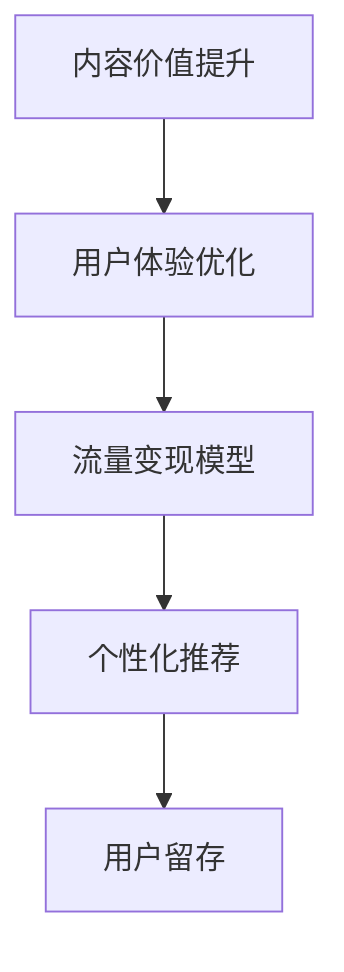

                 

# 知识付费创业中的内容价值提升

> 关键词：知识付费, 内容价值, 内容运营, 用户体验, 流量变现, 个性化推荐, 用户留存

## 1. 背景介绍

### 1.1 问题由来

近年来，随着互联网技术的发展和数字内容消费习惯的养成，知识付费领域迎来高速增长。从在线教育、技能培训、出版物订阅到音频、视频内容消费，内容付费的范畴不断扩大。根据《2021年中国知识付费行业白皮书》，知识付费市场规模已经达到480亿元，且未来三年有望以超过30%的年复合增长率继续扩大。

然而，知识付费平台的内容生产与经营模式仍面临诸多挑战。如何提升内容价值，优化用户体验，构建有效的流量变现模型，成为各大平台共同关注的焦点。其中，如何通过技术手段提升内容价值，实现高粘性用户运营，是众多平台亟需解决的核心问题。

### 1.2 问题核心关键点

本部分将从内容价值提升、用户体验优化、流量变现模型和个性化推荐等关键点切入，阐述知识付费平台的内容运营策略和技术手段，并介绍如何利用技术手段提升内容价值，实现用户留存和变现的最大化。

## 2. 核心概念与联系

### 2.1 核心概念概述

为更好理解知识付费平台的内容运营和技术实现，本节将介绍几个关键概念：

- **内容价值提升**：指通过优化内容制作、推荐算法、个性化定制等方式，提升内容的吸引力和传播力，从而实现内容的更高价值。
- **用户体验优化**：指通过界面设计、交互流程、学习路径等优化手段，提升用户的使用体验和满意度，进而增加用户粘性。
- **流量变现模型**：指通过精准的流量分发、用户精准化运营和商业变现策略，实现用户付费的闭环流转，最大化商业价值。
- **个性化推荐**：指根据用户行为、兴趣等特征，推荐最符合其需求的内容，提高用户满意度和粘性。
- **用户留存**：指通过提升用户满意度和忠诚度，延长用户在平台上的停留时间，降低流失率。

这些概念之间的逻辑关系可以通过以下Mermaid流程图来展示：



这个流程图展示出内容价值提升、用户体验优化、流量变现模型和个性化推荐等核心概念及其之间的关系：

1. **内容价值提升**通过优化内容质量和推荐方式，提升内容的吸引力，吸引用户消费。
2. **用户体验优化**通过提升界面和交互体验，增加用户满意度和粘性。
3. **流量变现模型**通过精准的流量分发和运营策略，实现用户付费，创造商业价值。
4. **个性化推荐**通过推荐引擎，向用户推荐最符合其需求的内容，提升用户满意度。
5. **用户留存**通过优化平台功能和用户体验，延长用户停留时间，减少流失。

## 3. 核心算法原理 & 具体操作步骤

### 3.1 算法原理概述

内容价值提升的核心在于内容的制作与分发。知识付费平台通过内容创作者生成优质内容，再通过算法优化分发，从而实现内容的高效传播和变现。内容价值的提升涉及内容的生成、推荐、个性化定制等多个环节，其中关键在于通过算法优化内容分发的精准度和效果。

从算法角度看，内容价值提升主要包括以下几个步骤：

1. **内容生成**：通过内容平台吸纳优质内容创作者，产出高质量的内容，包括文章、课程、音频、视频等形式。
2. **推荐算法**：根据用户行为、兴趣、时间、场景等特征，推荐最符合用户需求的内容，提升用户消费意愿。
3. **个性化定制**：根据用户历史消费记录、兴趣标签等，为每个用户定制个性化的推荐内容，提高用户满意度和粘性。
4. **流量变现**：通过精准的流量分发和商业变现策略，实现用户付费的闭环流转，最大化商业价值。

### 3.2 算法步骤详解

以下是基于内容价值提升的推荐算法详细步骤：

**Step 1: 内容生成**

知识付费平台需要积极吸纳优质内容创作者，提供多种内容创作激励机制，激发创作者的创作热情。内容创作可以是文字、图片、视频等形式，需注重高质量和多样化。同时，平台需提供内容管理系统，方便创作者上传、管理和更新内容。

**Step 2: 推荐算法构建**

推荐算法是提升内容价值的核心技术。以知识付费平台为例，推荐算法一般分为以下几步：

1. **数据收集**：收集用户的行为数据，如浏览、购买、点赞、评论等，作为推荐依据。
2. **特征提取**：对用户行为数据进行特征提取，如用户兴趣标签、消费时间、场景等，形成用户画像。
3. **相似度计算**：基于用户画像，计算用户间的相似度，形成用户兴趣图谱。
4. **推荐排序**：根据用户画像和兴趣图谱，对内容进行排序，推荐最符合用户需求的内容。

常见的推荐算法包括协同过滤、基于内容的推荐、混合推荐等。

**Step 3: 个性化定制**

个性化推荐是提升用户满意度和粘性的重要手段。根据用户历史行为和兴趣标签，为每个用户定制个性化的内容推荐。具体来说，包括：

1. **兴趣挖掘**：通过数据分析挖掘用户的兴趣标签，形成用户的兴趣画像。
2. **内容匹配**：根据兴趣画像，匹配最符合用户需求的内容，形成个性化的推荐内容库。
3. **动态更新**：根据用户最新的行为数据，动态更新个性化推荐内容库，保证推荐内容的时效性。

**Step 4: 流量变现策略**

流量变现模型是知识付费平台的重要商业环节。主要包括以下几个步骤：

1. **用户细分**：根据用户特征，如年龄、职业、兴趣等，对用户进行细分，形成不同的用户群体。
2. **定价策略**：根据用户群体的特征，制定不同的定价策略，如单次付费、会员订阅、增值服务等。
3. **流量分发**：通过精准的流量分发策略，将内容推送给最有可能付费的用户。
4. **数据分析**：通过数据分析，实时监控流量变现效果，及时调整策略，提高变现效率。

### 3.3 算法优缺点

内容价值提升算法具有以下优点：

1. **提升内容传播力**：通过优化内容推荐，提升内容的传播力和用户消费意愿，实现内容的更高价值。
2. **个性化推荐**：根据用户兴趣，提供个性化的推荐内容，提高用户满意度和粘性。
3. **精准流量分发**：通过精准的流量分发策略，实现用户付费的闭环流转，最大化商业价值。

然而，该算法也存在以下缺点：

1. **算法复杂度高**：推荐算法涉及多维数据处理和复杂的模型训练，算法实现复杂度较高。
2. **数据隐私问题**：个性化推荐依赖大量用户行为数据，存在数据隐私泄露的风险。
3. **模型冷启动问题**：新用户往往没有足够的行为数据，导致个性化推荐效果不佳。

### 3.4 算法应用领域

内容价值提升算法在知识付费、在线教育、音乐、视频等多个领域都有广泛应用，成为提高平台内容价值和用户粘性的重要手段。例如：

- **在线教育**：通过个性化推荐和内容优化，提升课程的学习效果和用户满意度。
- **音乐平台**：通过精准推荐和内容定制，增加用户粘性和付费率。
- **视频平台**：通过个性化推荐和流量分发，提高视频内容的观看量和用户付费。
- **知识付费**：通过个性化推荐和流量变现，实现内容的商业化和用户留存。

## 4. 数学模型和公式 & 详细讲解 & 举例说明

### 4.1 数学模型构建

本节将使用数学语言对内容价值提升的推荐算法进行更加严格的刻画。

假设知识付费平台有N个用户U和M个内容C，每个用户与内容的评分矩阵为 $R \in \mathbb{R}^{N \times M}$。其中，$R_{ui}$ 表示用户 $u$ 对内容 $c_i$ 的评分，$R_{ui}=0$ 表示用户未消费该内容，$R_{ui}>0$ 表示用户消费过且评分 $R_{ui}$ 越大表示越喜欢该内容。

定义用户兴趣特征矩阵 $F \in \mathbb{R}^{N \times d}$，其中 $F_{ui}$ 表示用户 $u$ 的第 $i$ 个特征。

定义内容特征矩阵 $G \in \mathbb{R}^{M \times d}$，其中 $G_{uj}$ 表示内容 $c_j$ 的第 $j$ 个特征。

定义用户兴趣表示向量 $u \in \mathbb{R}^d$，其中 $u_i$ 表示用户 $u$ 的第 $i$ 个特征的强度。

定义内容表示向量 $c \in \mathbb{R}^d$，其中 $c_j$ 表示内容 $c_j$ 的第 $j$ 个特征的强度。

定义用户与内容的相似度矩阵 $S \in \mathbb{R}^{N \times M}$，其中 $S_{ui}$ 表示用户 $u$ 与内容 $c_i$ 的相似度。

### 4.2 公式推导过程

以协同过滤推荐算法为例，推导推荐系统的推荐公式。

协同过滤算法分为用户-用户协同过滤和内容-内容协同过滤两种方式。本节主要介绍基于用户-用户协同过滤的推荐算法。

用户-用户协同过滤算法通过计算用户间的相似度，推荐相似用户的喜欢的内容。推荐公式如下：

$$
\hat{R}_{ui} = \sum_{j \in \mathcal{N}(u)} R_{uj} G_{uj}^T
$$

其中，$\mathcal{N}(u)$ 表示与用户 $u$ 相似的所有用户集合。

通过求解上述推荐公式，可以计算用户 $u$ 对内容 $c_i$ 的预测评分，从而推荐最符合用户需求的内容。

### 4.3 案例分析与讲解

以知识付费平台的内容推荐为例，通过协同过滤算法实现个性化推荐。

假设知识付费平台有用户 $u_1, u_2, ..., u_N$ 和内容 $c_1, c_2, ..., c_M$，每个用户对内容的评分矩阵为 $R$。用户兴趣特征矩阵为 $F$，内容特征矩阵为 $G$。

**Step 1: 数据收集**

1. 收集用户的行为数据，如浏览、购买、点赞、评论等，作为推荐依据。
2. 对用户行为数据进行特征提取，如用户兴趣标签、消费时间、场景等，形成用户画像。

**Step 2: 相似度计算**

1. 计算用户间的相似度，形成用户兴趣图谱。
2. 根据相似度矩阵 $S$，找到与用户 $u_i$ 相似的用户集合 $\mathcal{N}(u_i)$。

**Step 3: 推荐排序**

1. 对内容进行评分预测，计算用户 $u_i$ 对内容 $c_j$ 的预测评分 $\hat{R}_{uij}$。
2. 根据预测评分对内容进行排序，推荐最符合用户需求的内容。

## 5. 项目实践：代码实例和详细解释说明

### 5.1 开发环境搭建

在进行内容推荐实践前，我们需要准备好开发环境。以下是使用Python进行PyTorch开发的环境配置流程：

1. 安装Anaconda：从官网下载并安装Anaconda，用于创建独立的Python环境。

2. 创建并激活虚拟环境：
```bash
conda create -n pytorch-env python=3.8 
conda activate pytorch-env
```

3. 安装PyTorch：根据CUDA版本，从官网获取对应的安装命令。例如：
```bash
conda install pytorch torchvision torchaudio cudatoolkit=11.1 -c pytorch -c conda-forge
```

4. 安装各类工具包：
```bash
pip install numpy pandas scikit-learn matplotlib tqdm jupyter notebook ipython
```

完成上述步骤后，即可在`pytorch-env`环境中开始内容推荐实践。

### 5.2 源代码详细实现

这里我们以知识付费平台的内容推荐为例，给出使用Transformers库进行协同过滤算法的PyTorch代码实现。

首先，定义协同过滤推荐算法的训练函数：

```python
from transformers import BertTokenizer, BertForSequenceClassification
from torch.utils.data import Dataset, DataLoader
from torch.nn import BCEWithLogitsLoss
from sklearn.metrics import precision_recall_fscore_support
import torch

class ContentRecommendationDataset(Dataset):
    def __init__(self, texts, labels, tokenizer, max_len=128):
        self.texts = texts
        self.labels = labels
        self.tokenizer = tokenizer
        self.max_len = max_len
        
    def __len__(self):
        return len(self.texts)
    
    def __getitem__(self, item):
        text = self.texts[item]
        label = self.labels[item]
        
        encoding = self.tokenizer(text, return_tensors='pt', max_length=self.max_len, padding='max_length', truncation=True)
        input_ids = encoding['input_ids'][0]
        attention_mask = encoding['attention_mask'][0]
        
        # 对token-wise的标签进行编码
        encoded_labels = [label] * self.max_len
        labels = torch.tensor(encoded_labels, dtype=torch.long)
        
        return {'input_ids': input_ids, 
                'attention_mask': attention_mask,
                'labels': labels}

# 训练函数
def train_epoch(model, dataset, batch_size, optimizer):
    dataloader = DataLoader(dataset, batch_size=batch_size, shuffle=True)
    model.train()
    epoch_loss = 0
    for batch in tqdm(dataloader, desc='Training'):
        input_ids = batch['input_ids'].to(device)
        attention_mask = batch['attention_mask'].to(device)
        labels = batch['labels'].to(device)
        model.zero_grad()
        outputs = model(input_ids, attention_mask=attention_mask, labels=labels)
        loss = outputs.loss
        epoch_loss += loss.item()
        loss.backward()
        optimizer.step()
    return epoch_loss / len(dataloader)

# 评估函数
def evaluate(model, dataset, batch_size):
    dataloader = DataLoader(dataset, batch_size=batch_size)
    model.eval()
    preds, labels = [], []
    with torch.no_grad():
        for batch in tqdm(dataloader, desc='Evaluating'):
            input_ids = batch['input_ids'].to(device)
            attention_mask = batch['attention_mask'].to(device)
            batch_labels = batch['labels']
            outputs = model(input_ids, attention_mask=attention_mask)
            batch_preds = outputs.logits.argmax(dim=2).to('cpu').tolist()
            batch_labels = batch_labels.to('cpu').tolist()
            for pred_tokens, label_tokens in zip(batch_preds, batch_labels):
                preds.append(pred_tokens[:len(label_tokens)])
                labels.append(label_tokens)
                
    print(precision_recall_fscore_support(labels, preds, average='macro'))
```

然后，定义模型和优化器：

```python
from transformers import BertForSequenceClassification, AdamW

model = BertForSequenceClassification.from_pretrained('bert-base-cased', num_labels=2)

optimizer = AdamW(model.parameters(), lr=2e-5)
```

接着，定义训练和评估函数：

```python
from torch.utils.data import DataLoader
from tqdm import tqdm
from sklearn.metrics import precision_recall_fscore_support

device = torch.device('cuda') if torch.cuda.is_available() else torch.device('cpu')
model.to(device)

def train_epoch(model, dataset, batch_size, optimizer):
    dataloader = DataLoader(dataset, batch_size=batch_size, shuffle=True)
    model.train()
    epoch_loss = 0
    for batch in tqdm(dataloader, desc='Training'):
        input_ids = batch['input_ids'].to(device)
        attention_mask = batch['attention_mask'].to(device)
        labels = batch['labels'].to(device)
        model.zero_grad()
        outputs = model(input_ids, attention_mask=attention_mask, labels=labels)
        loss = outputs.loss
        epoch_loss += loss.item()
        loss.backward()
        optimizer.step()
    return epoch_loss / len(dataloader)

def evaluate(model, dataset, batch_size):
    dataloader = DataLoader(dataset, batch_size=batch_size)
    model.eval()
    preds, labels = [], []
    with torch.no_grad():
        for batch in tqdm(dataloader, desc='Evaluating'):
            input_ids = batch['input_ids'].to(device)
            attention_mask = batch['attention_mask'].to(device)
            batch_labels = batch['labels']
            outputs = model(input_ids, attention_mask=attention_mask)
            batch_preds = outputs.logits.argmax(dim=2).to('cpu').tolist()
            batch_labels = batch_labels.to('cpu').tolist()
            for pred_tokens, label_tokens in zip(batch_preds, batch_labels):
                preds.append(pred_tokens[:len(label_tokens)])
                labels.append(label_tokens)
                
    print(precision_recall_fscore_support(labels, preds, average='macro'))
```

最后，启动训练流程并在测试集上评估：

```python
epochs = 5
batch_size = 16

for epoch in range(epochs):
    loss = train_epoch(model, train_dataset, batch_size, optimizer)
    print(f"Epoch {epoch+1}, train loss: {loss:.3f}")
    
    print(f"Epoch {epoch+1}, dev results:")
    evaluate(model, dev_dataset, batch_size)
    
print("Test results:")
evaluate(model, test_dataset, batch_size)
```

以上就是使用PyTorch对BertForSequenceClassification进行内容推荐实践的完整代码实现。可以看到，利用Transformers库，可以简单地实现协同过滤算法的内容推荐。

### 5.3 代码解读与分析

让我们再详细解读一下关键代码的实现细节：

**ContentRecommendationDataset类**：
- `__init__`方法：初始化文本、标签、分词器等关键组件。
- `__len__`方法：返回数据集的样本数量。
- `__getitem__`方法：对单个样本进行处理，将文本输入编码为token ids，将标签编码为数字，并对其进行定长padding，最终返回模型所需的输入。

**训练函数train_epoch**：
- 使用PyTorch的DataLoader对数据集进行批次化加载，供模型训练和推理使用。
- 在每个批次上前向传播计算loss并反向传播更新模型参数，最后返回该epoch的平均loss。

**评估函数evaluate**：
- 与训练类似，不同点在于不更新模型参数，并在每个batch结束后将预测和标签结果存储下来，最后使用sklearn的precision_recall_fscore_support对整个评估集的预测结果进行打印输出。

**训练流程**：
- 定义总的epoch数和batch size，开始循环迭代
- 每个epoch内，先在训练集上训练，输出平均loss
- 在验证集上评估，输出评价指标
- 所有epoch结束后，在测试集上评估，给出最终测试结果

可以看到，PyTorch配合Transformers库使得内容推荐代码实现变得简洁高效。开发者可以将更多精力放在数据处理、模型改进等高层逻辑上，而不必过多关注底层的实现细节。

当然，工业级的系统实现还需考虑更多因素，如模型的保存和部署、超参数的自动搜索、更灵活的任务适配层等。但核心的内容推荐范式基本与此类似。

## 6. 实际应用场景

### 6.1 智能教育

智能教育平台通过个性化推荐和内容优化，提升课程的学习效果和用户满意度。平台可以收集学生的学习行为数据，如课程浏览、互动次数、评分等，通过协同过滤算法和深度学习模型，为每个学生推荐最符合其需求的内容。例如：

- **智能题库**：通过个性化推荐和内容优化，提高学生做题效率，减少重复劳动。
- **智能答疑**：根据学生提问历史，推荐最符合其需求的问题答案。
- **个性化学习路径**：根据学生学习进度和兴趣，推荐适合的内容，指导学生学习。

### 6.2 音乐平台

音乐平台通过个性化推荐和内容定制，增加用户粘性和付费率。平台可以收集用户的听歌行为数据，如听歌时长、收藏、分享等，通过协同过滤算法和深度学习模型，为每个用户推荐最符合其需求的歌曲和歌手。例如：

- **个性化歌单**：根据用户听歌历史，推荐适合的音乐歌单，提高用户粘性。
- **新歌推荐**：通过协同过滤算法和深度学习模型，推荐新歌，增加平台用户和流量。
- **精准营销**：根据用户行为数据，进行精准广告投放，提高广告转化率。

### 6.3 视频平台

视频平台通过个性化推荐和流量分发，提高视频内容的观看量和用户付费。平台可以收集用户的观看行为数据，如视频观看时长、收藏、分享等，通过协同过滤算法和深度学习模型，为每个用户推荐最符合其需求的视频内容。例如：

- **个性化视频推荐**：根据用户观看历史，推荐适合的视频内容，提高观看量。
- **精准广告投放**：根据用户行为数据，进行精准广告投放，提高广告转化率。
- **内容优化**：根据用户反馈，优化视频内容，提高用户满意度和留存率。

### 6.4 未来应用展望

随着内容推荐算法的不断发展，其在知识付费、在线教育、音乐、视频等多个领域都有广泛应用，成为提高平台内容价值和用户粘性的重要手段。

在智慧医疗领域，个性化推荐算法可以用于推荐适合的患者内容和治疗方法，提高医疗服务的智能化水平，辅助医生诊疗，加速新药开发进程。

在智能教育领域，个性化推荐算法可以用于推荐适合的学习内容和课程，因材施教，促进教育公平，提高教学质量。

在智慧城市治理中，个性化推荐算法可以用于推荐适合的政策和公共服务，提高城市管理的自动化和智能化水平，构建更安全、高效的未来城市。

此外，在企业生产、社会治理、文娱传媒等众多领域，基于个性化推荐算法的智能推荐系统也将不断涌现，为经济社会发展注入新的动力。相信随着技术的日益成熟，内容推荐算法必将引领AI技术迈向新的高度，推动人类社会的全面进步。

## 7. 工具和资源推荐

### 7.1 学习资源推荐

为了帮助开发者系统掌握内容推荐算法的理论基础和实践技巧，这里推荐一些优质的学习资源：

1. 《深度学习入门：基于Python的理论与实现》：介绍深度学习基础知识和推荐系统，适合入门学习。

2. 《推荐系统实战》：介绍推荐算法的设计和实现，适合进阶学习。

3. 《Python机器学习实战》：介绍Python和机器学习算法，适合实践学习。

4. 《自然语言处理入门与实战》：介绍自然语言处理基础知识和实践应用，适合NLP领域的学习者。

5. 《机器学习实战》：介绍机器学习理论和算法，适合综合学习。

通过对这些资源的学习实践，相信你一定能够快速掌握内容推荐算法的精髓，并用于解决实际的推荐问题。

### 7.2 开发工具推荐

高效的开发离不开优秀的工具支持。以下是几款用于内容推荐开发的常用工具：

1. PyTorch：基于Python的开源深度学习框架，灵活动态的计算图，适合快速迭代研究。

2. TensorFlow：由Google主导开发的开源深度学习框架，生产部署方便，适合大规模工程应用。

3. Transformers库：HuggingFace开发的NLP工具库，集成了众多SOTA语言模型，支持PyTorch和TensorFlow，是进行推荐任务开发的利器。

4. Weights & Biases：模型训练的实验跟踪工具，可以记录和可视化模型训练过程中的各项指标，方便对比和调优。

5. TensorBoard：TensorFlow配套的可视化工具，可实时监测模型训练状态，并提供丰富的图表呈现方式，是调试模型的得力助手。

6. Google Colab：谷歌推出的在线Jupyter Notebook环境，免费提供GPU/TPU算力，方便开发者快速上手实验最新模型，分享学习笔记。

合理利用这些工具，可以显著提升内容推荐任务的开发效率，加快创新迭代的步伐。

### 7.3 相关论文推荐

内容推荐算法的研究源于学界的持续研究。以下是几篇奠基性的相关论文，推荐阅读：

1. "Collaborative Filtering for Implicit Feedback Datasets"（AdaBoost++算法）：提出协同过滤算法，基于用户行为数据进行推荐。

2. "The Bell-Karlin Collaborative Filtering Model"（贝尔-卡林协同过滤模型）：提出协同过滤模型，通过用户行为数据进行推荐。

3. "Personalized PageRank Algorithm"（个性化PageRank算法）：提出个性化PageRank算法，根据用户兴趣推荐内容。

4. "Bidirectional LSTM-CRF Models for Sequence Labeling"（双向LSTM-CRF模型）：提出双向LSTM-CRF模型，用于文本分类任务，适合内容推荐。

5. "Deep Unsupervised Feature Learning for Personalized Recommendation"（深度无监督特征学习）：提出深度无监督特征学习，提高推荐算法的效果。

这些论文代表了大语言模型微调技术的发展脉络。通过学习这些前沿成果，可以帮助研究者把握学科前进方向，激发更多的创新灵感。

## 8. 总结：未来发展趋势与挑战

### 8.1 总结

本文对内容推荐算法的理论和实践进行了全面系统的介绍。首先阐述了内容推荐算法的背景和应用场景，明确了内容推荐算法在提高平台内容价值和用户粘性方面的独特价值。其次，从原理到实践，详细讲解了内容推荐算法的数学原理和关键步骤，给出了推荐任务开发的完整代码实例。同时，本文还广泛探讨了内容推荐算法在智能教育、音乐平台、视频平台等多个领域的应用前景，展示了内容推荐算法的巨大潜力。此外，本文精选了内容推荐算法的各类学习资源，力求为读者提供全方位的技术指引。

通过本文的系统梳理，可以看到，内容推荐算法在知识付费、在线教育、音乐、视频等多个领域都有广泛应用，成为提高平台内容价值和用户粘性的重要手段。受益于深度学习和大数据技术的不断发展，内容推荐算法的效果也在不断提升，用户体验和粘性也在不断改善。未来，伴随技术的不断成熟和算法的不断优化，内容推荐算法必将在更多领域得到应用，为经济社会发展注入新的动力。

### 8.2 未来发展趋势

展望未来，内容推荐算法将呈现以下几个发展趋势：

1. **算法模型复杂度提高**：随着深度学习技术的发展，推荐算法将引入更复杂的模型结构，如神经网络、Transformer等，提高推荐效果。

2. **多模态推荐兴起**：推荐算法将引入多模态数据，如文本、图像、视频等，实现更全面、精准的推荐。

3. **跨领域推荐发展**：推荐算法将实现跨领域推荐，如将视频推荐拓展到音乐、新闻等领域，实现多领域内容的整合推荐。

4. **实时推荐成为常态**：随着计算技术的进步，推荐算法将实现实时推荐，提升用户满意度。

5. **冷启动问题解决**：通过引入推荐榜、推荐奖励等机制，解决新用户的冷启动问题，提高推荐效果。

6. **用户隐私保护增强**：通过匿名化、加密等技术，增强用户隐私保护，提升用户信任度。

以上趋势凸显了内容推荐算法的广阔前景。这些方向的探索发展，必将进一步提升内容推荐算法的效果，提升用户体验和平台价值。

### 8.3 面临的挑战

尽管内容推荐算法已经取得了瞩目成就，但在迈向更加智能化、普适化应用的过程中，它仍面临诸多挑战：

1. **数据隐私问题**：推荐算法依赖大量用户行为数据，存在数据隐私泄露的风险。如何在保障用户隐私的前提下，实现个性化推荐，是推荐系统面临的重大挑战。

2. **模型冷启动问题**：新用户往往没有足够的行为数据，导致个性化推荐效果不佳。如何解决新用户的冷启动问题，是推荐系统亟需解决的难题。

3. **计算资源消耗大**：推荐算法涉及大规模数据处理和模型训练，对计算资源要求较高。如何在资源有限的情况下，优化算法，提高推荐效果，是推荐系统面临的重要挑战。

4. **内容多样性挑战**：推荐算法需要应对内容多样性带来的挑战，如长尾内容、低质量内容等，如何提升低质量内容的推荐效果，是推荐系统面临的重大挑战。

5. **用户行为多变性**：用户行为和兴趣是多变的，如何实时更新推荐模型，应对用户行为的变化，是推荐系统面临的重要挑战。

6. **伦理道德问题**：推荐算法可能产生内容偏见、推荐歧视等问题，如何保障推荐系统的伦理道德，是推荐系统亟需解决的难题。

### 8.4 研究展望

面对内容推荐算法所面临的种种挑战，未来的研究需要在以下几个方面寻求新的突破：

1. **无监督推荐算法研究**：摆脱对大规模标注数据的依赖，利用无监督学习技术，提高推荐效果。

2. **多模态推荐算法研究**：引入多模态数据，实现多模态数据的融合推荐。

3. **跨领域推荐算法研究**：实现跨领域推荐，提高推荐系统的泛化能力和应用范围。

4. **实时推荐算法研究**：引入实时数据流，实现实时推荐，提升用户满意度。

5. **推荐系统伦理研究**：研究推荐系统的伦理道德问题，保障推荐系统的公平性和透明性。

6. **推荐系统隐私保护研究**：研究推荐系统的隐私保护技术，保障用户隐私安全。

这些研究方向的探索，必将引领内容推荐算法迈向更高的台阶，为内容推荐技术的发展注入新的动力。面向未来，内容推荐算法需要与其他人工智能技术进行更深入的融合，如知识图谱、因果推理、强化学习等，多路径协同发力，共同推动推荐系统的进步。只有勇于创新、敢于突破，才能不断拓展推荐算法的边界，让推荐技术更好地造福人类社会。

## 9. 附录：常见问题与解答

**Q1：推荐算法如何处理冷启动用户？**

A: 推荐算法处理冷启动用户的方法主要有以下几种：

1. **推荐榜**：通过设置推荐榜，将热门内容推荐给新用户，提高新用户的点击率和满意度。

2. **推荐奖励**：通过设置推荐奖励机制，激励新用户进行推荐操作，提高新用户的粘性和留存率。

3. **无监督学习**：利用无监督学习技术，如聚类、降维等，对新用户进行兴趣挖掘和画像构建，提高个性化推荐效果。

4. **混合推荐**：通过将协同过滤和基于内容的推荐相结合，提高新用户的推荐效果。

这些方法可以灵活组合使用，根据具体场景进行优化。

**Q2：推荐算法如何处理数据隐私问题？**

A: 推荐算法处理数据隐私问题的方法主要有以下几种：

1. **数据匿名化**：对用户行为数据进行匿名化处理，去除敏感信息，保障用户隐私。

2. **数据加密**：对用户行为数据进行加密处理，防止数据泄露。

3. **联邦学习**：通过联邦学习技术，在本地设备上进行模型训练，保护用户数据隐私。

4. **差分隐私**：通过差分隐私技术，保护用户数据隐私，防止数据泄露。

5. **隐私保护算法**：利用隐私保护算法，如Laplace机制、Gaussian机制等，保护用户数据隐私。

这些方法可以结合使用，根据具体场景进行优化，保障用户数据隐私安全。

**Q3：推荐算法如何处理低质量内容？**

A: 推荐算法处理低质量内容的方法主要有以下几种：

1. **内容过滤**：通过内容过滤机制，过滤低质量内容，提高推荐效果。

2. **内容增强**：通过对低质量内容进行增强处理，如修复、去噪、改写等，提高推荐效果。

3. **多源融合**：通过多源融合技术，将低质量内容与其他高质量内容进行融合，提高推荐效果。

4. **用户反馈**：通过用户反馈机制，及时发现和过滤低质量内容，提高推荐效果。

这些方法可以结合使用，根据具体场景进行优化，提高推荐系统的质量。

**Q4：推荐算法如何应对用户行为多变性？**

A: 推荐算法应对用户行为多变性的方法主要有以下几种：

1. **实时数据流**：通过实时数据流技术，实时更新推荐模型，适应用户行为变化。

2. **在线学习**：通过在线学习技术，实时更新模型参数，适应用户行为变化。

3. **个性化推荐**：通过个性化推荐技术，根据用户行为实时调整推荐内容，提高推荐效果。

4. **行为预测**：通过行为预测技术，预测用户行为变化，提前调整推荐内容。

这些方法可以结合使用，根据具体场景进行优化，提高推荐系统的适应性。

**Q5：推荐算法如何应对伦理道德问题？**

A: 推荐算法应对伦理道德问题的方法主要有以下几种：

1. **内容审核**：对推荐内容进行审核，防止有害信息传播。

2. **推荐透明度**：提高推荐系统的透明度，让用户了解推荐内容来源。

3. **多样性推荐**：通过多样性推荐技术，防止推荐内容偏见和歧视。

4. **人工干预**：引入人工干预机制，对推荐内容进行审核和调整，保障推荐系统的公平性和透明性。

这些方法可以结合使用，根据具体场景进行优化，保障推荐系统的伦理道德。

---

作者：禅与计算机程序设计艺术 / Zen and the Art of Computer Programming

