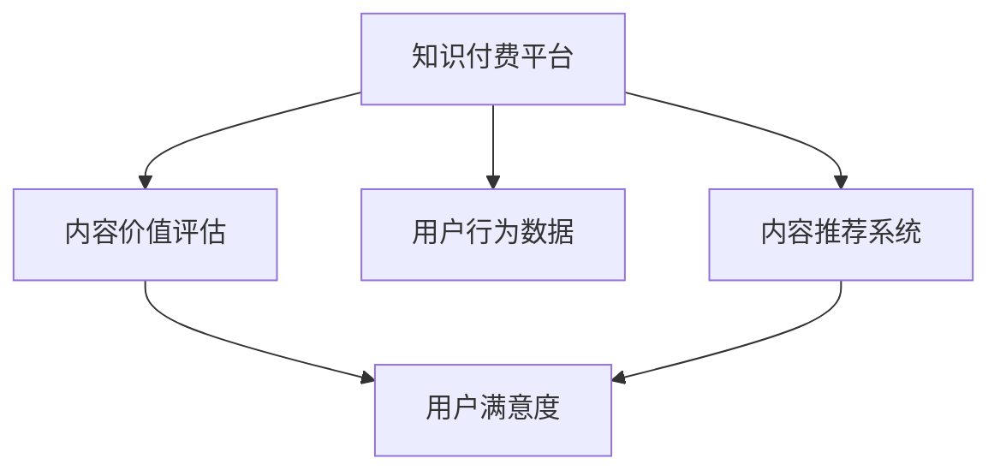

                 

# 知识付费创业中的内容价值评估体系

> 关键词：知识付费,内容价值评估,用户行为分析,推荐系统,内容推荐,转化率优化

## 1. 背景介绍

### 1.1 问题由来

知识付费在近年来逐渐兴起，成为一种新兴的互联网商业模式。知识付费平台通过汇聚专业内容创作者，为用户提供深入、系统、优质的知识产品。然而，随着市场竞争的加剧，用户获取知识和信息的方式日益多元化，如何高效、精准地为用户提供内容推荐，成为知识付费平台亟需解决的核心问题。

内容推荐系统（Recommendation System）通过对用户行为和兴趣进行分析，将合适的知识内容推荐给用户，帮助用户快速找到自己需要的信息，提升用户满意度。然而，现有的内容推荐系统往往依赖于用户行为数据，难以对内容本身的质量进行有效评估。因此，构建一套科学、合理的内容价值评估体系，对知识付费平台显得尤为重要。

### 1.2 问题核心关键点

内容价值评估体系的核心在于如何通过科学的方法，量化知识内容的价值。具体来说，需要解决以下几个关键问题：

1. **内容价值定义**：明确内容价值的内涵，包括内容的深度、广度、时效性、准确性、创新性等维度。
2. **价值评估方法**：设计一套可行的评估方法，量化内容价值，并结合用户行为数据，形成综合的推荐策略。
3. **评估体系构建**：将内容价值评估方法嵌入推荐系统，实现对内容质量的动态监控和调整。
4. **优化算法设计**：开发优化算法，提升内容推荐的精准性和用户满意度。

## 2. 核心概念与联系

### 2.1 核心概念概述

为更好地理解内容价值评估体系，本节将介绍几个关键概念：

- **知识付费平台**：通过订阅制或单次购买等方式，为用户提供专业知识和信息服务的互联网平台。
- **内容推荐系统**：通过对用户行为数据进行分析，预测用户兴趣，推荐合适内容的技术系统。
- **用户行为数据**：用户在知识付费平台上的浏览、购买、评价、分享等行为数据，是推荐系统的重要数据源。
- **内容价值评估**：通过综合考虑内容的多维度价值，量化内容的质量，指导推荐系统精准推荐。
- **用户满意度**：用户在知识付费平台上获取知识内容和服务的满意程度，是衡量平台价值的重要指标。

这些概念之间的逻辑关系可以通过以下Mermaid流程图来展示：



这个流程图展示出知识付费平台中的核心组件及其关联关系：

1. 用户行为数据为内容推荐系统提供输入，驱动推荐算法输出。
2. 内容价值评估体系对内容进行质量评价，指导推荐算法优化。
3. 推荐系统根据评估结果，向用户推荐合适内容，提升用户满意度。

## 3. 核心算法原理 & 具体操作步骤
### 3.1 算法原理概述

内容价值评估体系的核心是构建一套科学、合理的内容价值量化方法。其核心思想是通过对内容的多维度价值进行量化评估，结合用户行为数据，指导推荐系统的优化和调整，从而提升内容推荐的精准性和用户满意度。

具体来说，内容价值评估体系包括以下几个关键步骤：

1. **内容价值定义**：明确内容价值的维度，如深度、广度、时效性、准确性、创新性等。
2. **价值量化模型**：设计量化模型，通过算法自动计算每个维度的评分。
3. **用户行为分析**：分析用户行为数据，提取用户兴趣特征。
4. **综合评估模型**：将内容价值评分和用户兴趣特征结合，生成综合推荐结果。
5. **优化算法设计**：设计优化算法，不断调整推荐模型，提升推荐效果。

### 3.2 算法步骤详解

以下是内容价值评估体系的具体操作步骤：

**Step 1: 内容价值定义**

首先，明确内容价值评估的维度。一般包括以下几个方面：

1. **内容深度**：内容的学术水平、专业性、创新性等。
2. **内容广度**：内容的覆盖范围、全面性、实用性等。
3. **时效性**：内容的时效性、更新频率、新鲜度等。
4. **准确性**：内容的准确性、可信度、科学性等。
5. **创新性**：内容的独特性、前沿性、新颖性等。

针对每个维度，定义相应的评价指标和标准。例如，内容深度可以通过引用文献数量、专家评价等指标来衡量。

**Step 2: 价值量化模型**

设计价值量化模型，通过算法自动计算每个维度的评分。常见的方法包括：

1. **专家评分模型**：邀请领域专家对内容进行打分，综合专家评分生成内容价值评分。
2. **自动评分模型**：使用自然语言处理（NLP）技术，通过文本分析自动化计算内容评分。
3. **多维度评分模型**：综合考虑多个维度，通过加权平均等方法生成综合评分。

**Step 3: 用户行为分析**

分析用户行为数据，提取用户兴趣特征。常见的方法包括：

1. **点击率（CTR）**：衡量用户对内容的兴趣程度，通过点击行为分析用户偏好。
2. **停留时间**：衡量用户对内容的关注度，通过用户停留时长评估内容吸引力。
3. **评价反馈**：通过用户对内容的评价和反馈，提取用户满意度和需求。
4. **分享互动**：分析用户对内容的分享和互动行为，衡量内容的社会影响力。

**Step 4: 综合评估模型**

将内容价值评分和用户兴趣特征结合，生成综合推荐结果。具体步骤如下：

1. **加权平均**：根据内容价值评分和用户行为数据的权重，计算综合评分。
2. **协同过滤**：结合用户行为数据和内容评分，通过协同过滤算法生成推荐列表。
3. **排序优化**：根据综合评分和用户行为数据，优化推荐结果的排序。

**Step 5: 优化算法设计**

设计优化算法，不断调整推荐模型，提升推荐效果。常见的方法包括：

1. **A/B测试**：通过A/B测试比较不同推荐策略的效果，找到最优方案。
2. **动态调整**：根据用户行为和内容评分，动态调整推荐算法参数。
3. **模型迭代**：通过不断迭代优化推荐模型，提升推荐精度和用户满意度。

### 3.3 算法优缺点

内容价值评估体系具有以下优点：

1. **科学评估**：通过量化内容价值，提供客观、可衡量的评估标准。
2. **精准推荐**：结合用户行为数据，实现精准内容推荐。
3. **提升用户满意度**：通过优化推荐结果，提升用户获取知识内容的满意度。
4. **动态调整**：能够根据用户行为和内容评分，实时调整推荐策略。

然而，内容价值评估体系也存在一些缺点：

1. **数据依赖**：评估体系高度依赖用户行为数据，数据不足可能导致评估结果不准确。
2. **多维度平衡**：不同维度的价值评估需要平衡考虑，过度关注某一方面可能导致其他方面的忽视。
3. **模型复杂**：构建完整的评估体系，需要设计多个模型和算法，实现复杂。
4. **动态调整难度大**：用户行为和内容评分实时变化，动态调整推荐模型需要持续优化。

## 4. 数学模型和公式 & 详细讲解
### 4.1 数学模型构建

本节将使用数学语言对内容价值评估体系进行更加严格的刻画。

记内容价值为 $V$，内容价值评估维度为 $d$，每个维度的评分分别为 $V_i$。用户行为数据为 $D$，包括点击率 $CTR$、停留时间 $Time$、评价反馈 $Rating$、分享互动 $Share$ 等指标。内容推荐模型为 $M$，推荐结果为 $R$。

**目标**：最大化推荐效果，即最大化用户满意度和内容价值。

**目标函数**：

$$
\max_{M} \quad \sum_{i=1}^{N} f(V_i, D_i) \times Rating_i
$$

其中 $f$ 为内容价值评估函数，$D_i$ 为第 $i$ 个用户的行为数据。

### 4.2 公式推导过程

以用户评价反馈 $Rating$ 为例，推导内容价值评估函数 $f$。

设内容价值评估函数 $f$ 的输入为内容深度 $Depth$、广度 $Breadth$、时效性 $Timeliness$、准确性 $Accuracy$、创新性 $Innovation$ 等维度，输出为内容价值评分 $V$。

假设 $f$ 为线性函数，则：

$$
f(Depth, Breadth, Timeliness, Accuracy, Innovation) = \alpha_1 \times Depth + \alpha_2 \times Breadth + \alpha_3 \times Timeliness + \alpha_4 \times Accuracy + \alpha_5 \times Innovation
$$

其中 $\alpha_i$ 为每个维度的权重系数。

用户评价反馈 $Rating$ 通常为 $0$ 到 $5$ 之间的整数，记为 $R$。

为了将用户评价转化为内容价值评分，可以对 $Rating$ 进行线性映射：

$$
V = \beta_1 \times R + \beta_0
$$

其中 $\beta_1$ 为评价反馈的放大系数，$\beta_0$ 为常数项。

结合用户行为数据 $D$，综合评分 $Score$ 可以表示为：

$$
Score = V \times Rating
$$

因此，综合评分优化目标函数可以表示为：

$$
\max_{M} \quad \sum_{i=1}^{N} Score_i
$$

其中 $Score_i = V_i \times Rating_i$。

### 4.3 案例分析与讲解

以知识付费平台中一篇文章的推荐为例，分析内容价值评估体系的应用。

假设某篇文章的内容深度 $Depth=4$、广度 $Breadth=5$、时效性 $Timeliness=3$、准确性 $Accuracy=4$、创新性 $Innovation=4$。

设每个维度的权重系数分别为 $\alpha_1=0.2$、$\alpha_2=0.2$、$\alpha_3=0.1$、$\alpha_4=0.2$、$\alpha_5=0.3$。

则内容价值评分 $V$ 可以表示为：

$$
V = 0.2 \times 4 + 0.2 \times 5 + 0.1 \times 3 + 0.2 \times 4 + 0.3 \times 4 = 4.2
$$

用户评价反馈 $Rating=4$，则综合评分 $Score = 4.2 \times 4 = 16.8$。

假设另一篇文章的内容深度 $Depth=5$、广度 $Breadth=4$、时效性 $Timeliness=3$、准确性 $Accuracy=4$、创新性 $Innovation=3$，则：

$$
V = 0.2 \times 5 + 0.2 \times 4 + 0.1 \times 3 + 0.2 \times 4 + 0.3 \times 3 = 4.4
$$

用户评价反馈 $Rating=3$，则综合评分 $Score = 4.4 \times 3 = 13.2$。

因此，推荐算法会优先推荐综合评分高的文章，即用户评价反馈高的文章。

## 5. 项目实践：代码实例和详细解释说明
### 5.1 开发环境搭建

在进行内容价值评估体系开发前，我们需要准备好开发环境。以下是使用Python进行PyTorch开发的环境配置流程：

1. 安装Anaconda：从官网下载并安装Anaconda，用于创建独立的Python环境。

2. 创建并激活虚拟环境：
```bash
conda create -n pytorch-env python=3.8 
conda activate pytorch-env
```

3. 安装PyTorch：根据CUDA版本，从官网获取对应的安装命令。例如：
```bash
conda install pytorch torchvision torchaudio cudatoolkit=11.1 -c pytorch -c conda-forge
```

4. 安装TensorBoard：
```bash
pip install tensorboard
```

5. 安装Flask：
```bash
pip install flask
```

6. 安装SQLAlchemy：
```bash
pip install sqlalchemy
```

完成上述步骤后，即可在`pytorch-env`环境中开始内容价值评估体系的开发。

### 5.2 源代码详细实现

以下是使用PyTorch和Flask实现内容价值评估体系的基本代码框架。

```python
from flask import Flask, request, jsonify
from sqlalchemy import create_engine
from transformers import pipeline
import torch

# 初始化Flask应用
app = Flask(__name__)

# 初始化数据库连接
engine = create_engine('sqlite:///example.db')

# 初始化内容推荐模型
model = pipeline('recommendation')

# 定义内容推荐接口
@app.route('/recommend', methods=['POST'])
def recommend():
    # 获取请求数据
    data = request.get_json()
    
    # 从数据库中获取用户行为数据
    user_data = engine.execute('SELECT * FROM user_data WHERE user_id = ?', data['user_id'])
    
    # 计算内容价值评分
    content_scores = {}
    for content in data['content']:
        content_depth = model(content['depth'])
        content_breadth = model(content['breadth'])
        content_timeliness = model(content['timeliness'])
        content_accuracy = model(content['accuracy'])
        content_innovation = model(content['innovation'])
        content_score = 0.2 * content_depth + 0.2 * content_breadth + 0.1 * content_timeliness + 0.2 * content_accuracy + 0.3 * content_innovation
        content_scores[content['id']] = content_score
    
    # 获取用户评价反馈
    rating_data = engine.execute('SELECT * FROM rating_data WHERE user_id = ?', data['user_id'])
    user_ratings = {}
    for rating in rating_data:
        user_ratings[rating['content_id']] = rating['rating']
    
    # 计算综合评分
    scores = {}
    for content_id, score in content_scores.items():
        if content_id in user_ratings:
            rating = user_ratings[content_id]
            score = score * rating
            scores[content_id] = score
    
    # 返回推荐结果
    return jsonify(scores)

if __name__ == '__main__':
    app.run()
```

在这个示例代码中，我们使用了SQLAlchemy来连接数据库，获取用户行为数据和用户评价反馈。同时，使用了Transformers库中的推荐模型，计算内容价值评分和综合评分。最后，将推荐结果以JSON格式返回。

### 5.3 代码解读与分析

让我们再详细解读一下关键代码的实现细节：

**Flask应用**：
- `Flask` 是一个轻量级的Web框架，方便开发API接口。
- 使用 `@app.route` 装饰器定义接口路由和HTTP方法。
- 使用 `request.get_json()` 方法获取POST请求中的JSON数据。

**数据库连接**：
- 使用 `SQLAlchemy` 连接数据库，创建连接池。
- 通过 `engine.execute()` 执行SQL查询，获取用户行为数据和用户评价反馈。

**内容评分模型**：
- 使用 `pipeline` 方法加载预训练的推荐模型，计算内容评分。
- 假设 `content_depth`、`content_breadth`、`content_timeliness`、`content_accuracy`、`content_innovation` 分别为内容深度、广度、时效性、准确性、创新性的评分。
- 计算每个内容的评分，存储在 `content_scores` 字典中。

**用户评分数据**：
- 使用 `user_ratings` 字典存储用户对每个内容的评价。
- 计算每个内容的综合评分，存储在 `scores` 字典中。

**推荐结果返回**：
- 使用 `jsonify` 方法将推荐结果以JSON格式返回。
- 推荐结果包含每个内容的综合评分。

## 6. 实际应用场景

### 6.1 智能推荐系统

智能推荐系统在知识付费平台中扮演着重要角色。通过对用户行为和内容价值评估，推荐系统能够为用户提供个性化、精准的内容推荐，提升用户满意度。

在实际应用中，推荐系统可以实时监控用户行为数据，动态调整推荐策略。例如，当用户连续多次点击某类内容时，推荐系统可以自动推荐更多相关内容，满足用户深层次的兴趣需求。

### 6.2 知识图谱构建

知识图谱是一种结构化的知识表示方式，将实体和关系映射到图结构中。通过对内容价值进行评估，知识图谱可以更好地捕捉知识间的关联和层次结构。

在知识付费平台中，知识图谱可以用于构建领域知识库，辅助用户快速找到相关内容。例如，用户输入某个主题，知识图谱可以自动推荐与之相关的知识和文章，帮助用户深入学习。

### 6.3 课程推荐与学习路径优化

课程推荐和学习路径优化是知识付费平台中的重要功能。通过对内容价值进行评估，推荐系统可以推荐高质量的课程，指导用户系统化学习。

例如，用户想要学习编程语言，推荐系统可以推荐基础入门课程、进阶课程、实战项目等多种层次的课程，帮助用户构建完整的知识体系。

### 6.4 未来应用展望

随着内容价值评估体系的应用和完善，未来在知识付费平台中将带来更多创新和突破：

1. **个性化推荐**：通过精准的内容价值评估，推荐系统可以实现更加个性化的内容推荐，提升用户满意度。
2. **知识图谱构建**：内容价值评估可以辅助构建高质量的知识图谱，提供结构化的知识服务。
3. **学习路径优化**：通过内容价值评估，推荐系统可以指导用户构建系统的学习路径，提升学习效率。
4. **动态调整**：推荐系统可以实时监控用户行为和内容评分，动态调整推荐策略，提高推荐效果。
5. **跨领域应用**：内容价值评估体系不仅适用于知识付费平台，还可以应用于更多场景，如智能客服、智能广告等。

## 7. 工具和资源推荐
### 7.1 学习资源推荐

为了帮助开发者系统掌握内容价值评估体系的理论基础和实践技巧，这里推荐一些优质的学习资源：

1. 《推荐系统实战》系列博文：由推荐系统专家撰写，涵盖推荐系统的基本原理和实际应用。

2. 《深度学习推荐系统》课程：斯坦福大学开设的推荐系统课程，系统介绍推荐系统的理论基础和算法实现。

3. 《推荐系统》书籍：清华大学教授的推荐系统教材，全面介绍推荐系统的各种算法和技术。

4. Kaggle推荐系统竞赛：通过实际数据集竞赛，掌握推荐系统算法和优化方法。

5. Google Colab：谷歌提供的在线Jupyter Notebook环境，免费提供GPU算力，方便开发者快速实践推荐系统。

通过这些资源的学习实践，相信你一定能够快速掌握内容价值评估体系的精髓，并用于解决实际的推荐问题。

### 7.2 开发工具推荐

高效的开发离不开优秀的工具支持。以下是几款用于内容价值评估体系开发的常用工具：

1. PyTorch：基于Python的开源深度学习框架，适合快速迭代研究。大部分推荐系统模型都有PyTorch版本的实现。

2. TensorFlow：由Google主导开发的开源深度学习框架，适合大规模工程应用。推荐系统模型同样可以在TensorFlow上实现。

3. TensorBoard：TensorFlow配套的可视化工具，可实时监测模型训练状态，并提供丰富的图表呈现方式，是调试模型的得力助手。

4. Weights & Biases：模型训练的实验跟踪工具，可以记录和可视化模型训练过程中的各项指标，方便对比和调优。

5. Google Colab：谷歌提供的在线Jupyter Notebook环境，免费提供GPU算力，方便开发者快速实践推荐系统。

合理利用这些工具，可以显著提升内容价值评估体系的开发效率，加快创新迭代的步伐。

### 7.3 相关论文推荐

内容价值评估体系的研究源于学界的持续研究。以下是几篇奠基性的相关论文，推荐阅读：

1. The BellKor@RecSys Challenge 2008：该竞赛是推荐系统的经典案例，展示了推荐系统在实际应用中的效果和挑战。

2. Advances in Knowledge Discovery and Data Mining (KDD)：该会议每年发布大量推荐系统的最新研究成果，涵盖各种算法和优化方法。

3. IEEE Transactions on Knowledge and Data Engineering (TKDE)：该期刊发表大量高质量的推荐系统论文，涵盖理论研究和实际应用。

4. Recommender Systems Handbook：这本书是推荐系统的经典教材，涵盖推荐系统的各种算法和技术。

这些论文代表了大规模推荐系统的研究进展，通过学习这些前沿成果，可以帮助研究者把握推荐系统的研究方向，激发更多的创新灵感。

## 8. 总结：未来发展趋势与挑战

### 8.1 总结

本文对内容价值评估体系进行了全面系统的介绍。首先阐述了内容价值评估体系的研究背景和意义，明确了内容价值评估在知识付费平台中的重要性和实际应用。其次，从原理到实践，详细讲解了内容价值评估体系的数学模型和关键操作步骤，给出了内容价值评估体系的完整代码实现。同时，本文还广泛探讨了内容价值评估体系在智能推荐、知识图谱、课程推荐等方面的应用前景，展示了内容价值评估体系的巨大潜力。此外，本文精选了内容价值评估体系的学习资源，力求为读者提供全方位的技术指引。

通过本文的系统梳理，可以看到，内容价值评估体系正在成为知识付费平台中的重要技术范式，极大地提升了推荐系统的精准性和用户满意度。未来，伴随内容价值评估体系的不断发展，知识付费平台将能够提供更加丰富、精准、个性化的内容服务，进一步推动知识付费行业的繁荣发展。

### 8.2 未来发展趋势

展望未来，内容价值评估体系将呈现以下几个发展趋势：

1. **数据驱动**：随着数据的积累和算力的提升，内容价值评估体系将更加依赖于数据驱动，通过深度学习等技术，提升评估的准确性和鲁棒性。
2. **多模态融合**：内容价值评估体系将融合文本、图像、视频等多种模态数据，提升对内容的全面理解和评估。
3. **实时更新**：通过动态更新内容评分和用户行为数据，内容价值评估体系将实时调整推荐策略，提升推荐效果。
4. **用户反馈机制**：引入用户反馈机制，根据用户评价和反馈，实时调整内容评分和推荐策略，提升用户满意度。
5. **跨平台应用**：内容价值评估体系不仅适用于知识付费平台，还可以应用于更多场景，如智能广告、智能客服等。

以上趋势凸显了内容价值评估体系的发展前景。这些方向的探索发展，必将进一步提升推荐系统的精准性和用户满意度，为知识付费平台提供更全面的内容服务。

### 8.3 面临的挑战

尽管内容价值评估体系已经取得了瞩目成就，但在迈向更加智能化、普适化应用的过程中，它仍面临诸多挑战：

1. **数据质量和多样性**：推荐系统依赖于用户行为数据，数据的完备性和多样性直接影响推荐效果。
2. **模型复杂性**：内容价值评估体系的构建需要设计多个模型和算法，实现复杂。
3. **实时动态调整**：内容评分和用户行为数据实时变化，动态调整推荐模型需要持续优化。
4. **多维度平衡**：不同维度的价值评估需要平衡考虑，过度关注某一方面可能导致其他方面的忽视。
5. **跨领域应用**：内容价值评估体系在不同领域的应用，需要考虑不同场景下的具体需求。

正视内容价值评估体系面临的这些挑战，积极应对并寻求突破，将是其未来发展的关键。相信随着学界和产业界的共同努力，这些挑战终将一一被克服，内容价值评估体系必将在知识付费平台中发挥更加重要的作用。

### 8.4 研究展望

面向未来，内容价值评估体系需要在以下几个方面进行深入研究：

1. **数据增强**：探索更多数据增强方法，提升数据质量和多样性，优化推荐系统。
2. **多模态融合**：研究融合文本、图像、视频等多种模态数据，提升内容评估的全面性。
3. **跨领域应用**：探索内容价值评估体系在不同领域的应用，提升推荐系统的适应性和精准性。
4. **实时动态调整**：研究实时更新内容评分和用户行为数据，动态调整推荐策略，提升推荐效果。
5. **用户反馈机制**：研究引入用户反馈机制，根据用户评价和反馈，优化推荐模型。

这些研究方向将推动内容价值评估体系不断进步，提升推荐系统的精准性和用户满意度，为知识付费平台提供更全面的内容服务。总之，内容价值评估体系需要从数据、算法、工程、用户等多个维度协同发力，才能真正实现推荐系统的精准和高效。面向未来，内容价值评估体系需要更加智能、普适和用户导向，才能更好地满足用户需求，推动知识付费行业的持续创新和进步。

## 9. 附录：常见问题与解答

**Q1：内容价值评估体系是否适用于所有推荐系统？**

A: 内容价值评估体系适用于多种类型的推荐系统，包括基于协同过滤的推荐系统、基于内容的推荐系统、混合推荐系统等。但在应用时，需要根据具体的推荐场景和推荐算法进行适当调整和优化。

**Q2：如何选择合适的权重系数？**

A: 权重系数的选择需要根据具体的推荐场景和推荐算法进行调整。一般可以通过经验或实验调整，找到最优的权重组合。

**Q3：内容评分模型如何训练？**

A: 内容评分模型通常使用监督学习的方法进行训练。例如，可以使用标注的数据集，训练模型预测内容评分。

**Q4：推荐系统中的冷启动问题如何解决？**

A: 冷启动问题指的是新用户或新商品在推荐系统中的评分数据不足，无法进行有效的推荐。解决冷启动问题的方法包括：

1. 用户行为预测：通过用户的历史行为数据，预测用户未来的兴趣，进行推荐。
2. 内容特征提取：使用内容的多维度特征，提升模型的泛化能力。
3. 多模态融合：融合多种模态的数据，提升模型的评估能力。

**Q5：如何优化推荐系统的计算效率？**

A: 推荐系统的计算效率可以通过以下方法进行优化：

1. 模型压缩：使用模型压缩技术，减小模型的参数量和计算量。
2. 分布式计算：使用分布式计算框架，提升推荐系统的计算能力。
3. 缓存优化：使用缓存技术，减少重复计算，提升推荐效率。

---

作者：禅与计算机程序设计艺术 / Zen and the Art of Computer Programming

