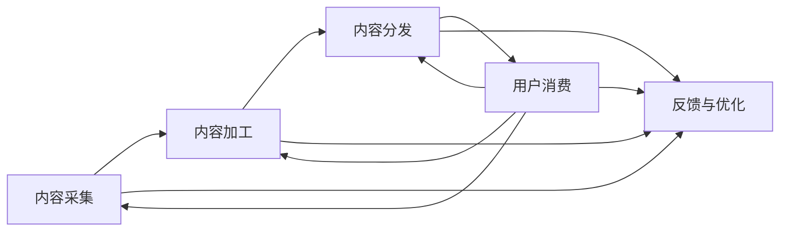

                 

# 知识付费创业中的内容价值链构建

## 1. 背景介绍

随着互联网的普及和智能设备的普及，知识付费逐渐成为一种主流模式。在线课程、电子书、音频、视频等多种形式的知识产品层出不穷，满足了用户日益增长的知识需求。在这个过程中，内容价值链的构建成为了知识付费创业成功的关键。本文将详细探讨内容价值链的构建方法，并结合实际案例，分析其影响因素和未来发展趋势。

## 2. 核心概念与联系

### 2.1 核心概念概述

**内容价值链（Content Value Chain）**：是指从内容采集、加工、分发，到用户消费的全过程，是一个复杂而庞大的价值循环系统。

**内容采集（Content Acquisition）**：通过各种渠道收集知识资源，如专业论文、行业报告、书籍、采访等，为内容创作提供素材。

**内容加工（Content Processing）**：对采集到的内容进行筛选、整理、编辑、解析，形成可供消费的知识产品。

**内容分发（Content Distribution）**：将加工后的知识产品通过各种渠道推送给目标用户，实现精准匹配和精准营销。

**用户消费（User Consumption）**：用户对知识产品的实际使用和反馈，为内容价值的实现提供真实数据。

以上各环节环环相扣，每个环节的优化都会影响整个价值链的效率和效果。

### 2.2 核心概念原理和架构的 Mermaid 流程图



该流程图展示了内容价值链的主要环节及其相互关系。各环节通过数据流、价值流、物流等方式进行联系，形成一个动态循环系统。

## 3. 核心算法原理 & 具体操作步骤

### 3.1 算法原理概述

内容价值链构建的核心在于如何最大化内容价值，即如何将内容产品转化为实际的用户价值，并实现有效的商业化运营。这涉及到多个算法和策略的运用，包括推荐算法、搜索算法、定价策略、运营策略等。

### 3.2 算法步骤详解

**Step 1：内容采集**

- 定义采集策略：明确采集的目标领域、范围、内容形式等，以确保采集到的内容具有高质量和相关性。
- 选择合适的采集工具：如爬虫工具、API接口、合作机构等，根据采集策略灵活选择。
- 数据清洗和预处理：对采集到的数据进行去重、过滤、分类、存储等操作，确保数据的质量和可用性。

**Step 2：内容加工**

- 内容分析与筛选：使用文本分析、标签分析等技术，对采集到的内容进行初步分析，筛选出高质量的内容。
- 内容组织与编辑：将筛选出的内容进行组织、编辑、格式化，形成易于用户消费的形态，如课程、文章、视频等。
- 内容优化与增值：对内容进行深度加工，如加入多媒体元素、互动元素、个性化推荐等，提升用户消费体验。

**Step 3：内容分发**

- 用户画像分析：通过数据分析工具，构建用户画像，了解目标用户的兴趣、需求、行为等特征。
- 渠道选择与优化：根据用户画像，选择适合的分发渠道，如社交媒体、搜索引擎、APP等，并进行渠道优化。
- 精准匹配与推荐：使用推荐算法，实现内容与用户的精准匹配，提高转化率。

**Step 4：用户消费**

- 用户行为分析：通过数据分析工具，实时监测用户行为，了解用户的消费路径、反馈、评价等。
- 内容反馈与优化：根据用户反馈，持续优化内容质量和分发策略，提升用户满意度和忠诚度。
- 收益分析与调整：根据用户消费数据，进行收益分析，调整定价策略和运营策略，实现商业化目标。

### 3.3 算法优缺点

**优点：**
- 精准定位：通过数据分析，实现内容与用户的精准匹配，提高转化率。
- 个性化推荐：根据用户画像和行为数据，实现个性化推荐，提升用户体验。
- 动态优化：通过持续反馈和优化，不断提高内容质量和分发效率。

**缺点：**
- 数据依赖：内容采集、加工、分发等环节高度依赖数据，数据质量直接影响效果。
- 技术复杂：涉及多种算法和策略，技术复杂度高，对团队能力要求高。
- 成本高昂：数据采集、内容加工、渠道推广等环节成本较高，对资金投入要求高。

### 3.4 算法应用领域

内容价值链构建方法广泛应用于在线教育、在线阅读、在线咨询、企业培训等多个领域。以在线教育为例，内容采集包括教材、习题、视频、音频等多种形式；内容加工包括课程设计、内容编辑、多媒体整合等；内容分发包括搜索引擎优化、社交媒体推广、APP推荐等；用户消费包括课程学习、测验评估、用户反馈等。

## 4. 数学模型和公式 & 详细讲解 & 举例说明

### 4.1 数学模型构建

假设内容价值链中的每个环节都涉及多个步骤，可以用数学模型表示为：

- 内容采集：$A = \{a_1, a_2, ..., a_n\}$
- 内容加工：$B = \{b_{a_1}, b_{a_2}, ..., b_{a_n}\}$
- 内容分发：$C = \{c_{b_1}, c_{b_2}, ..., c_{b_n}\}$
- 用户消费：$D = \{d_{c_1}, d_{c_2}, ..., d_{c_n}\}$
- 反馈与优化：$E = \{e_{d_1}, e_{d_2}, ..., e_{d_n}\}$

其中，$a_i$ 表示内容采集的第 $i$ 个步骤，$b_{a_i}$ 表示内容加工的第 $i$ 个步骤，$c_{b_i}$ 表示内容分发的第 $i$ 个步骤，$d_{c_i}$ 表示用户消费的第 $i$ 个步骤，$e_{d_i}$ 表示反馈与优化的第 $i$ 个步骤。

### 4.2 公式推导过程

以在线教育为例，假设内容价值链中的每个环节都涉及多个步骤，可以用数学模型表示为：

- 内容采集：$A = \{教材, 习题, 视频, 音频\}$
- 内容加工：$B = \{课程设计, 内容编辑, 多媒体整合\}$
- 内容分发：$C = \{搜索引擎优化, 社交媒体推广, APP推荐\}$
- 用户消费：$D = \{课程学习, 测验评估, 用户反馈\}$
- 反馈与优化：$E = \{内容优化, 渠道优化, 定价策略调整\}$

通过以上模型，我们可以对内容价值链的各个环节进行量化分析，从而优化各个环节的效率和效果。

### 4.3 案例分析与讲解

以某在线教育平台为例，该平台通过内容价值链的构建，实现了高效的内容生产和分发。具体步骤如下：

1. 内容采集：该平台通过爬虫技术、合作机构等多种方式，采集了大量高质量的教材、习题、视频、音频等资源。
2. 内容加工：该平台对采集到的内容进行了深度加工，如课程设计、内容编辑、多媒体整合等，形成了高质量的课程资源。
3. 内容分发：该平台通过搜索引擎优化、社交媒体推广、APP推荐等多种方式，将课程资源精准推送给目标用户，提高了转化率。
4. 用户消费：该平台实时监测用户行为，进行内容优化和定价策略调整，提升用户体验和满意度。
5. 反馈与优化：该平台根据用户反馈，持续优化内容质量和分发策略，提升平台的用户粘性和收益。

## 5. 项目实践：代码实例和详细解释说明

### 5.1 开发环境搭建

在开始项目实践前，首先需要搭建开发环境。以下是在Python环境下搭建开发环境的流程：

1. 安装Python：从官网下载安装Python，确保版本不低于3.6。
2. 安装虚拟环境：使用`virtualenv`工具创建虚拟环境，并激活该环境。
3. 安装依赖包：通过`pip`安装依赖包，如`requests`、`BeautifulSoup`、`numpy`等。
4. 配置开发工具：使用`jupyter notebook`或其他IDE进行代码编写和调试。

### 5.2 源代码详细实现

以下是一个简单的在线教育平台内容采集系统的代码实现：

```python
import requests
from bs4 import BeautifulSoup
import pandas as pd

# 定义采集函数
def collect_content(url):
    response = requests.get(url)
    soup = BeautifulSoup(response.text, 'html.parser')
    title = soup.title.text
    content = soup.get_text()
    return title, content

# 定义内容处理函数
def process_content(title, content):
    # 对内容进行初步分析，筛选高质量内容
    # 对内容进行组织、编辑、格式化，形成课程资源
    # 对内容进行深度加工，如加入多媒体元素、互动元素、个性化推荐等
    return processed_content

# 定义内容分发函数
def distribute_content(content):
    # 通过搜索引擎优化、社交媒体推广、APP推荐等方式分发内容
    return distributed_content

# 定义用户消费函数
def consume_content(content):
    # 实时监测用户行为，进行内容优化和定价策略调整
    return user_feedback

# 定义反馈与优化函数
def optimize_content(content, feedback):
    # 根据用户反馈，持续优化内容质量和分发策略
    return optimized_content

# 主函数
if __name__ == "__main__":
    # 采集内容
    url = 'https://example.com'
    title, content = collect_content(url)

    # 处理内容
    processed_content = process_content(title, content)

    # 分发内容
    distributed_content = distribute_content(processed_content)

    # 用户消费
    user_feedback = consume_content(distributed_content)

    # 反馈与优化
    optimized_content = optimize_content(processed_content, user_feedback)

    # 输出结果
    print(optimized_content)
```

### 5.3 代码解读与分析

以上代码实现了简单的内容采集、处理、分发、消费、优化的流程。其中，`collect_content`函数通过爬虫技术获取内容标题和内容；`process_content`函数对内容进行初步分析、组织、编辑、格式化等处理；`distribute_content`函数通过搜索引擎优化、社交媒体推广等方式分发内容；`consume_content`函数实时监测用户行为，进行内容优化和定价策略调整；`optimize_content`函数根据用户反馈，持续优化内容质量和分发策略。

## 6. 实际应用场景

### 6.1 在线教育

在线教育是知识付费创业中的典型应用场景。通过内容价值链的构建，在线教育平台能够高效地进行内容采集、加工、分发和消费，满足用户的学习需求，提升平台的市场竞争力。

### 6.2 在线阅读

在线阅读平台通过内容价值链的构建，能够高效地进行内容采集、加工、分发和消费，提供丰富多样的阅读资源，满足用户的阅读需求。

### 6.3 企业培训

企业培训平台通过内容价值链的构建，能够高效地进行内容采集、加工、分发和消费，为员工提供高质量的培训资源，提升企业的培训效果和效率。

### 6.4 未来应用展望

随着人工智能技术的发展，内容价值链的构建将进一步智能化和自动化。未来，内容采集将更加高效和精准，内容加工将更加个性化和智能化，内容分发将更加精准和高效，用户消费将更加便捷和精准。

## 7. 工具和资源推荐

### 7.1 学习资源推荐

- 《深入浅出Python爬虫》：详细讲解了Python爬虫技术，适合初学者入门。
- 《深度学习与自然语言处理》：介绍深度学习在NLP中的应用，适合进阶学习。
- 《算法与数据结构》：全面介绍算法和数据结构，适合计算机科学专业学生学习。
- 《Python编程：从入门到实践》：适合Python编程初学者，内容浅显易懂。

### 7.2 开发工具推荐

- Jupyter Notebook：免费开源的Python开发环境，适合进行数据处理和算法实验。
- VS Code：免费开源的开发工具，支持多种语言，集成了丰富的插件和扩展。
- PyCharm：商业版的Python开发工具，支持多种框架和工具，适合大项目开发。

### 7.3 相关论文推荐

- 《内容推荐系统的设计与实现》：介绍了内容推荐系统的构建方法，适合了解推荐算法。
- 《深度学习在知识付费中的应用》：介绍了深度学习在知识付费中的应用，适合了解深度学习在NLP中的应用。
- 《用户画像的构建与分析》：介绍了用户画像的构建方法，适合了解用户画像分析。

## 8. 总结：未来发展趋势与挑战

### 8.1 总结

本文详细探讨了知识付费创业中的内容价值链构建方法，通过数据分析、推荐算法、内容优化等手段，最大化内容价值，提升用户体验和平台收益。通过系统的理论分析和实际案例，展示了内容价值链构建的必要性和重要性。

### 8.2 未来发展趋势

随着人工智能技术的发展，内容价值链的构建将进一步智能化和自动化。未来，内容采集将更加高效和精准，内容加工将更加个性化和智能化，内容分发将更加精准和高效，用户消费将更加便捷和精准。

### 8.3 面临的挑战

尽管内容价值链构建在知识付费中具有重要意义，但也面临诸多挑战：

- 数据质量问题：内容采集和处理环节高度依赖数据，数据质量直接影响效果。
- 技术复杂度问题：涉及多种算法和策略，技术复杂度高，对团队能力要求高。
- 成本问题：数据采集、内容加工、渠道推广等环节成本较高，对资金投入要求高。

### 8.4 研究展望

未来，内容价值链构建需要进一步优化和改进：

- 提升数据质量：加强数据采集和处理环节的质量控制，提升数据质量。
- 简化技术复杂度：通过算法优化和工具改进，简化内容价值链的构建过程。
- 降低成本：通过数据共享、合作共营等方式，降低内容价值链构建的成本。

总之，内容价值链构建是知识付费创业成功的关键，需要综合考虑数据、技术、市场等多个因素，持续优化和改进，才能实现高效、精准、智能的内容生产和分发。

## 9. 附录：常见问题与解答

**Q1：内容价值链构建需要考虑哪些因素？**

A: 内容价值链构建需要考虑数据、技术、市场等多个因素。数据质量直接影响内容价值链的效果，技术复杂度影响内容价值链的实现，市场需求和用户反馈则影响内容价值链的优化。

**Q2：如何提升内容采集环节的数据质量？**

A: 提升内容采集环节的数据质量需要从多个方面入手：

- 选择合适的采集工具：如爬虫工具、API接口、合作机构等，根据采集策略灵活选择。
- 加强数据清洗和预处理：对采集到的数据进行去重、过滤、分类、存储等操作，确保数据的质量和可用性。
- 使用数据标注和审核：对采集到的数据进行标注和审核，确保数据的准确性和完整性。

**Q3：如何简化内容价值链的技术复杂度？**

A: 简化内容价值链的技术复杂度需要从多个方面入手：

- 优化算法和工具：选择合适的算法和工具，提升算法效率和工具性能。
- 引入人工智能技术：引入人工智能技术，如机器学习、深度学习、自然语言处理等，提升内容价值链的智能化和自动化水平。
- 采用模块化和组件化设计：将内容价值链的各个环节进行模块化和组件化设计，便于维护和升级。

**Q4：如何降低内容价值链的成本？**

A: 降低内容价值链的成本需要从多个方面入手：

- 数据共享和合作共营：通过数据共享和合作共营等方式，降低数据采集和处理的成本。
- 优化分发渠道：选择成本低廉、效果显著的分发渠道，如社交媒体、社区论坛等。
- 采用开源工具：使用开源工具和平台，降低开发和部署成本。

通过不断优化和改进，内容价值链构建将更加高效、精准、智能，为知识付费创业带来新的突破和发展机遇。

---

作者：禅与计算机程序设计艺术 / Zen and the Art of Computer Programming

