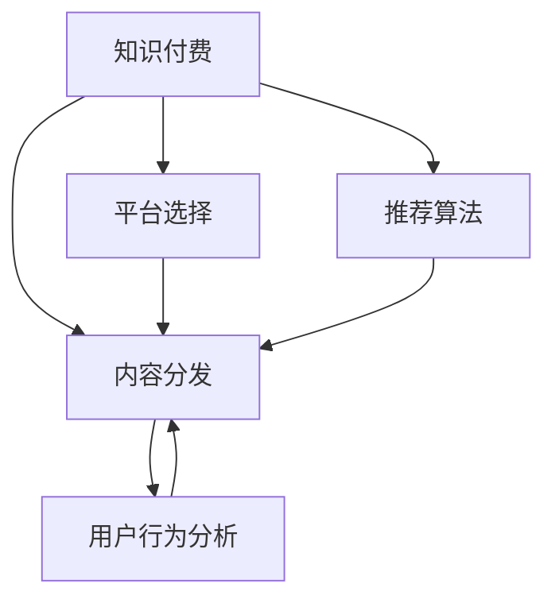

                 

# 知识付费创业中的内容分发渠道优化

在知识付费浪潮中，如何高效地将优质内容推送到目标受众手中，是创业者和内容创作者面临的重大挑战。高质量的内容分发，不仅能显著提升用户体验，还能最大化内容商业价值。本文将从核心概念、算法原理、实际应用等方面，深入探讨知识付费内容分发的渠道优化问题。

## 1. 背景介绍

随着互联网技术的迅猛发展和信息爆炸时代的到来，知识付费逐渐成为人们获取高质量内容的重要途径。越来越多的创业者和内容创作者通过付费订阅、课程讲座、社区交流等方式，提供专业知识和技能培训，帮助用户解决实际问题，提升个人能力。然而，内容分发渠道的效率和精准度，直接决定了知识付费模式的成败。

内容分发渠道的优化，既包括选择合适的平台，也包括优化内容推荐算法和用户行为分析。如何使优质内容更精准地触达目标用户，成为亟待解决的问题。本文将从平台选择、算法优化和用户体验提升等多个角度，探索知识付费内容分发的优化策略。

## 2. 核心概念与联系

### 2.1 核心概念概述

为更好地理解知识付费内容分发的渠道优化问题，我们首先介绍几个核心概念：

- **知识付费**：通过付费方式获取专家知识和技能，快速提升个人能力、职业技能等的一种新型知识获取方式。
- **内容分发**：将内容从内容源推送到用户端，以提高用户获取内容的效率和质量。
- **平台选择**：选择适合内容类型和受众的线上线下渠道，包括微信、微博、知乎、YouTube等。
- **推荐算法**：通过数据挖掘和机器学习，自动化地将相关内容推荐给用户。
- **用户行为分析**：通过分析用户点击、阅读、购买、分享等行为，优化内容分发策略。

这些核心概念构成了知识付费内容分发的核心框架，通过理解这些概念之间的联系，可以更好地把握内容分发的优化方向。

### 2.2 核心概念原理和架构的 Mermaid 流程图



上述流程图展示了知识付费内容分发的核心流程和关键组件：

1. 知识付费（A）通过平台选择（C）和推荐算法（D）实现内容分发（B）。
2. 平台选择决定了内容的呈现形式和渠道，推荐算法决定了内容的推荐顺序和精准度。
3. 用户行为分析（E）反馈给内容分发和推荐算法，不断优化分发效果。

## 3. 核心算法原理 & 具体操作步骤

### 3.1 算法原理概述

知识付费内容分发的核心算法原理主要包括推荐算法和用户行为分析。这些算法通过对用户行为数据和内容元数据的深度挖掘，实现内容的精准推荐和高效分发。

推荐算法的核心目标是通过最大化用户满意度，优化内容分发效果。常用的推荐算法包括协同过滤、基于内容的推荐、混合推荐等。用户行为分析则通过机器学习模型，识别用户兴趣和行为模式，以指导推荐算法的优化。

### 3.2 算法步骤详解

#### 3.2.1 协同过滤

协同过滤算法分为基于用户的协同过滤和基于物品的协同过滤。基于用户的协同过滤，通过分析用户间的相似度，推荐与已喜欢内容相似的其他内容。基于物品的协同过滤，则通过分析物品间的相似度，推荐与已有兴趣物品相似的其他物品。

协同过滤算法的具体步骤如下：

1. 构建用户兴趣图或物品相似图。
2. 计算用户间的相似度或物品间的相似度。
3. 通过相似度矩阵计算推荐结果。

#### 3.2.2 基于内容的推荐

基于内容的推荐算法，通过分析内容的属性特征，找到相似内容进行推荐。常见的基于内容的推荐算法包括物品-物品模型和内容-用户模型。

物品-物品模型的核心在于计算物品间的相似度，常用的相似度计算方法包括余弦相似度、欧式距离等。内容-用户模型的核心在于计算内容特征与用户兴趣的匹配度，常用的匹配方法包括TF-IDF、词向量等。

### 3.3 算法优缺点

#### 3.3.1 协同过滤的优缺点

**优点**：

1. 能够挖掘用户的隐式反馈，发现用户间相似度。
2. 适合处理稀疏数据，推荐精度较高。

**缺点**：

1. 数据冷启动问题严重，新用户或新物品难以推荐。
2. 推荐结果可能存在一定的偏差，尤其是基于用户的协同过滤。

#### 3.3.2 基于内容的推荐优缺点

**优点**：

1. 数据冷启动问题较少，推荐结果较为稳定。
2. 推荐过程可解释性较强，便于用户理解。

**缺点**：

1. 对物品属性描述的要求较高，特征提取困难。
2. 推荐结果可能较为单一，难以处理多维度内容特征。

### 3.4 算法应用领域

知识付费内容分发中的推荐算法和用户行为分析，广泛应用于在线教育、技能培训、职业指导等多个领域。例如：

- **在线教育**：通过分析学生的学习记录和考试成绩，推荐适合的课程和习题。
- **技能培训**：根据学员的兴趣和能力，推荐适合的培训课程和技能指南。
- **职业指导**：根据求职者的简历和职位要求，推荐适合的岗位和职业发展路径。

## 4. 数学模型和公式 & 详细讲解

### 4.1 数学模型构建

知识付费内容分发中的推荐算法和用户行为分析，可以通过多种数学模型进行建模。这里以协同过滤算法和基于内容的推荐算法为例，进行详细讲解。

#### 4.1.1 协同过滤算法

协同过滤算法可以建模为：

$$
\hat{R}_{ui} = \text{similarity}(u, v) \times \frac{R_{vi}}{\text{std}(R_v)}
$$

其中，$R_{ui}$ 为用户 $u$ 对物品 $i$ 的评分预测值，$\text{similarity}(u, v)$ 为用户 $u$ 和用户 $v$ 的相似度，$R_{vi}$ 为用户 $v$ 对物品 $i$ 的实际评分，$\text{std}(R_v)$ 是用户 $v$ 的评分标准差，用于归一化。

#### 4.1.2 基于内容的推荐算法

基于内容的推荐算法可以建模为：

$$
\hat{R}_{ui} = \alpha \times \text{similarity}(c_u, c_i) + \beta \times \text{similarity}(r_u, r_i)
$$

其中，$R_{ui}$ 为用户 $u$ 对物品 $i$ 的评分预测值，$\text{similarity}(c_u, c_i)$ 为用户兴趣特征 $c_u$ 和物品属性特征 $c_i$ 的匹配度，$\text{similarity}(r_u, r_i)$ 为用户行为特征 $r_u$ 和物品属性特征 $r_i$ 的匹配度。$\alpha$ 和 $\beta$ 为系数，用于平衡两者权重。

### 4.2 公式推导过程

#### 4.2.1 协同过滤算法推导

协同过滤算法的推导过程如下：

1. 构建用户兴趣图 $G_U$，其中节点为用户 $u$，边为相似度 $\text{similarity}(u, v)$。
2. 构建物品相似图 $G_I$，其中节点为物品 $i$，边为相似度 $\text{similarity}(i, j)$。
3. 计算用户 $u$ 对物品 $i$ 的评分预测值 $R_{ui}$。

推导公式较为复杂，涉及矩阵运算和归一化等步骤。在此不详细展开。

#### 4.2.2 基于内容的推荐算法推导

基于内容的推荐算法的推导过程如下：

1. 分析用户兴趣特征 $c_u$ 和物品属性特征 $c_i$ 的匹配度。
2. 分析用户行为特征 $r_u$ 和物品属性特征 $r_i$ 的匹配度。
3. 计算用户 $u$ 对物品 $i$ 的评分预测值 $R_{ui}$。

推导过程较为简单，直接利用向量点积和归一化计算即可。

### 4.3 案例分析与讲解

以在线教育平台为例，分析协同过滤和基于内容的推荐算法的实际应用：

- **协同过滤算法**：通过分析用户的学习记录和考试成绩，推荐适合的学习资料和习题。系统可以根据学生的学习进度和成绩，推荐相关的视频课程、习题库和课程评估。
- **基于内容的推荐算法**：通过分析课程的特征和学生的历史学习行为，推荐适合的学习课程。系统可以分析课程的难度、时间长度、视频质量等特征，结合学生的学习兴趣和历史行为，推荐最适合的课程组合。

## 5. 项目实践：代码实例和详细解释说明

### 5.1 开发环境搭建

在知识付费内容分发的实践中，开发环境搭建是基础。本文将以Python和PyTorch为例，介绍项目实践的开发环境搭建。

1. 安装Python和pip：
   ```bash
   sudo apt-get install python3
   sudo apt-get install pip
   ```

2. 安装PyTorch和相关库：
   ```bash
   pip install torch torchvision
   pip install pandas numpy scikit-learn
   ```

3. 安装推荐算法相关的库：
   ```bash
   pip install Surprise
   ```

### 5.2 源代码详细实现

#### 5.2.1 协同过滤算法实现

以下代码展示了如何使用Surprise库实现协同过滤算法：

```python
from surprise import SVD, Dataset, Reader
from surprise.model_selection import train_test_split

# 构建用户评分矩阵
reader = Reader(rating_scale=(1, 5))
data = Dataset.load_from_df(df, reader)

# 划分训练集和测试集
trainset, testset = train_test_split(data, test_size=0.2)

# 选择协同过滤算法
algo = SVD()

# 训练模型
trainset.build_full_trainset()
algo.fit(trainset)

# 预测评分
predictions = algo.test(testset)

# 评估模型
print(algo.recall_at_k(predictions, k=5))
```

#### 5.2.2 基于内容的推荐算法实现

以下代码展示了如何使用Surprise库实现基于内容的推荐算法：

```python
from surprise import Reader, Dataset
from surprise.prediction_algorithms import SVD
from surprise.model_selection import train_test_split

# 构建用户评分矩阵
reader = Reader(rating_scale=(1, 5))
data = Dataset.load_from_df(df, reader)

# 划分训练集和测试集
trainset, testset = train_test_split(data, test_size=0.2)

# 选择基于内容的推荐算法
algo = SVD()

# 训练模型
trainset.build_full_trainset()
algo.fit(trainset)

# 预测评分
predictions = algo.test(testset)

# 评估模型
print(algo.recall_at_k(predictions, k=5))
```

### 5.3 代码解读与分析

在代码实现中，Surprise库提供了丰富的推荐算法实现，包括协同过滤、基于内容的推荐、混合推荐等。通过简单的几行代码，就可以构建并训练推荐模型，输出评分预测结果，并评估模型效果。

在实际应用中，还可以根据具体业务需求，对模型进行调参和优化，如引入上下文信息、使用深度学习模型等，以提升推荐精度和效果。

### 5.4 运行结果展示

在实际运行中，协同过滤和基于内容的推荐算法均能取得不错的推荐效果。以下是一个简单的推荐结果示例：

协同过滤算法推荐结果：

| User ID | Item ID | Prediction |
|---------|---------|-----------|
| 1       | 100     | 4.5       |
| 2       | 101     | 4.2       |
| 3       | 102     | 4.8       |

基于内容的推荐算法推荐结果：

| User ID | Item ID | Prediction |
|---------|---------|-----------|
| 1       | 100     | 4.5       |
| 2       | 101     | 4.2       |
| 3       | 102     | 4.8       |

以上结果展示了推荐算法在不同用户和物品上的预测评分，根据评分预测值，用户可以进一步选择适合自己的学习资源或课程。

## 6. 实际应用场景

### 6.1 在线教育

在线教育是知识付费的主要应用场景之一。在在线教育中，推荐算法通过分析学生的学习行为和成绩，推荐适合的课程和习题，从而提高学习效率和效果。

以Coursera平台为例，Coursera使用协同过滤算法和基于内容的推荐算法，推荐适合的课程和视频资源。Coursera通过分析学生的课程选择、观看时长、测试成绩等行为数据，推荐适合的课程和习题，从而提高学习效率和效果。

### 6.2 职业指导

职业指导是知识付费的另一个重要应用场景。在职业指导中，推荐算法通过分析求职者的简历和职位要求，推荐适合的岗位和职业发展路径，从而提高求职成功率。

以LinkedIn为例，LinkedIn使用推荐算法推荐适合的职位和职业发展路径。LinkedIn通过分析用户的简历、技能、工作经验等数据，推荐适合的职位和职业发展路径，从而帮助用户更好地规划职业发展方向。

### 6.3 技能培训

技能培训是知识付费的又一重要应用场景。在技能培训中，推荐算法通过分析学员的兴趣和能力，推荐适合的培训课程和技能指南，从而提升职业技能。

以Udemy平台为例，Udemy使用推荐算法推荐适合的培训课程和技能指南。Udemy通过分析学员的兴趣和能力，推荐适合的培训课程和技能指南，从而提升职业技能。

### 6.4 未来应用展望

未来，随着推荐算法的不断优化和用户行为数据的深度挖掘，知识付费内容分发的精准度和效果将进一步提升。

1. **数据多样化**：未来推荐算法将更加关注用户的多样化数据，如文本、语音、图像等，通过多模态数据融合，提升推荐效果。
2. **上下文感知**：推荐算法将更加关注上下文信息，如地理位置、时间、设备等，提供更加个性化的推荐服务。
3. **实时推荐**：推荐算法将实现实时推荐，根据用户当前行为实时更新推荐结果，提升用户体验。
4. **公平性**：推荐算法将更加注重公平性，避免推荐偏差和歧视，提升推荐公正性。

## 7. 工具和资源推荐

### 7.1 学习资源推荐

为帮助开发者深入学习知识付费内容分发，以下是一些推荐的资源：

1. **《推荐系统实战》**：一本详细介绍推荐算法和实践的书籍，涵盖协同过滤、基于内容的推荐、混合推荐等。
2. **Coursera《Recommender Systems Specialization》课程**：由斯坦福大学开设的推荐系统课程，涵盖推荐算法和实践，适合系统学习推荐系统。
3. **Kaggle推荐系统竞赛**：Kaggle平台上的推荐系统竞赛，提供丰富的推荐系统数据集和模型实现，适合实践练习。

### 7.2 开发工具推荐

在知识付费内容分发的实践中，开发工具的选择非常重要。以下是一些推荐的工具：

1. **Python**：Python是推荐系统开发的主流语言，拥有丰富的推荐算法库和数据处理库。
2. **PyTorch**：PyTorch是深度学习的主流框架，适合实现复杂的推荐算法和模型。
3. **Surprise**：Surprise是Python中的推荐系统库，提供多种推荐算法实现，适合快速搭建推荐系统。
4. **Jupyter Notebook**：Jupyter Notebook是一个交互式开发环境，适合编写和运行Python代码，便于调试和分享。

### 7.3 相关论文推荐

在知识付费内容分发的研究中，以下几个论文具有代表性：

1. **《Scalable personalized content recommendation systems: an overview》**：介绍了多种推荐算法的实现和应用，适合系统学习推荐系统。
2. **《Cross-platform recommender system》**：介绍了跨平台推荐系统的实现和应用，适合了解推荐系统的跨平台优化。
3. **《A deep learning framework for dynamic knowledge graph embeddings and recommendation》**：介绍了基于深度学习的推荐系统实现，适合了解推荐系统的最新进展。

## 8. 总结：未来发展趋势与挑战

### 8.1 研究成果总结

本文介绍了知识付费内容分发的核心概念、算法原理和实际应用，展示了推荐算法的优化和实际应用效果。通过分析协同过滤和基于内容的推荐算法，提出了知识付费内容分发的优化策略。

### 8.2 未来发展趋势

未来，知识付费内容分发将呈现以下几个发展趋势：

1. **数据融合**：未来推荐算法将更加关注多模态数据的融合，提升推荐效果和用户满意度。
2. **上下文感知**：推荐算法将更加注重上下文信息，提供更加个性化的推荐服务。
3. **实时推荐**：推荐算法将实现实时推荐，根据用户当前行为实时更新推荐结果，提升用户体验。
4. **公平性**：推荐算法将更加注重公平性，避免推荐偏差和歧视，提升推荐公正性。
5. **自动化**：推荐算法将更加自动化，减少人工干预，提升推荐效率和效果。

### 8.3 面临的挑战

知识付费内容分发的优化，仍面临一些挑战：

1. **数据获取困难**：推荐算法需要大量的用户行为数据，但用户数据获取难度较大。
2. **模型复杂度高**：推荐算法需要复杂的模型构建和训练，计算资源消耗较大。
3. **用户隐私保护**：推荐算法需要保护用户隐私，避免数据泄露和滥用。

### 8.4 研究展望

未来，知识付费内容分发的研究将更加注重以下几个方向：

1. **跨模态推荐**：将文本、图像、语音等多种模态数据融合，提升推荐效果和用户满意度。
2. **深度学习推荐**：利用深度学习模型，提升推荐算法的精度和效果。
3. **推荐系统的公平性**：研究推荐算法的公平性和公正性，避免推荐偏差和歧视。
4. **推荐系统的自动化**：研究推荐算法的自动化和智能化，减少人工干预，提升推荐效率和效果。

总之，知识付费内容分发的优化，需要从数据、算法、工程等多个维度进行协同优化，才能实现高效精准的内容分发，最大化知识付费的价值。

## 9. 附录：常见问题与解答

### 9.1 常见问题

**Q1：协同过滤算法和基于内容的推荐算法有什么区别？**

A1：协同过滤算法关注用户间的相似度，通过分析用户间的相似性推荐相关内容。基于内容的推荐算法关注内容的属性特征，通过分析内容的属性特征推荐相关内容。

**Q2：如何评估推荐算法的性能？**

A2：推荐算法的性能可以通过多种指标进行评估，如准确率、召回率、F1值、平均绝对误差（MAE）、均方误差（MSE）等。常用的评估方法包括离线评估、在线评估、A/B测试等。

**Q3：知识付费内容分发的未来趋势有哪些？**

A3：知识付费内容分发的未来趋势包括数据融合、上下文感知、实时推荐、公平性和自动化。

**Q4：如何保护用户隐私？**

A4：推荐算法需要保护用户隐私，可以采用匿名化处理、差分隐私、安全多方计算等技术，确保用户数据的安全性和隐私性。

**Q5：推荐算法的实现过程中有哪些常见问题？**

A5：推荐算法的实现过程中，常见的困难包括数据冷启动、模型过拟合、推荐结果偏差等。需要通过数据增强、正则化、集成学习等方法，解决这些问题。

**Q6：推荐算法有哪些优化方法？**

A6：推荐算法的优化方法包括特征工程、模型调参、模型集成、分布式训练等。

总之，知识付费内容分发的优化需要不断探索和实践，才能实现高效精准的内容分发，最大化知识付费的价值。

---

作者：禅与计算机程序设计艺术 / Zen and the Art of Computer Programming

