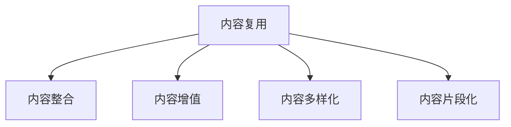

                 

# 知识付费创业中的内容复用策略

在知识付费领域，如何最大化地利用已有内容，实现内容复用，是创业团队需要面对的重要问题。本文将从内容复用策略的原理、操作步骤、优缺点及应用领域等角度，详细探讨这一主题。通过理论分析与案例展示，我们将提供切实可行的策略和方法，帮助创业团队提高内容创作和复用效率，降低成本，提升收益。

## 1. 背景介绍

### 1.1 问题由来

随着互联网和移动互联网的普及，知识付费市场迅速发展，各大平台纷纷推出音频、视频、图文等多种形式的内容服务，吸引了大量用户。然而，内容创作成本高、质量参差不齐，重复内容多等问题逐渐凸显，给内容生产者带来了巨大的挑战。如何高效利用已有内容，实现内容复用，提升内容利用率，成为知识付费创业的重要课题。

### 1.2 问题核心关键点

内容复用策略的核心在于如何整合已有内容资源，通过再加工和多样化处理，产出更多高质量、有价值的内容产品。主要关键点包括：

- 内容的来源和属性：如视频、音频、文章、PPT等。
- 内容的主题和受众：如职场、生活、学习、科技等。
- 内容的更新频率和周期：如日更、周更、月更等。
- 内容的多样化和深化：如拆分成不同主题、加进新信息等。

### 1.3 问题研究意义

通过内容复用，知识付费创业团队可以实现以下目标：

- 提高内容生产效率：整合利用已有内容，减少重复创作，降低内容成本。
- 提升内容多样性和吸引力：通过多样化的处理方式，产出更多有价值的内容，吸引更多用户。
- 降低用户获取成本：复用的内容可以直接应用于营销活动，吸引新用户。
- 增强用户粘性：通过不同形式的内容展示，提升用户体验，增加用户停留时间和忠诚度。

## 2. 核心概念与联系

### 2.1 核心概念概述

本节将介绍几个关键概念及其相互关系：

- 内容复用(Content Repurposing)：将已有内容进行再加工和重新编排，以产出新的内容形式。
- 内容整合(Content Aggregation)：将不同来源的内容整合到同一平台或产品中。
- 内容增值(Content Enrichment)：通过添加新信息、修改格式等方式，提高已有内容的价值。
- 内容多样化(Content Diversification)：将单一内容形式转换为多种形式，如视频转换为文章、音频转换为图文等。
- 内容片段化(Content Fragmentation)：将长内容拆分成短片段，便于用户快速获取信息。

这些概念通过以下Mermaid流程图展示其联系：



这个流程图展示了内容复用的基本流程：

1. 从已有内容资源中获取素材。
2. 进行内容整合，将不同来源的内容集于一体。
3. 通过内容增值，提高已有内容的价值。
4. 实现内容多样化，产出更多形式的内容。
5. 进行内容片段化，便于用户快速获取信息。

## 3. 核心算法原理 & 具体操作步骤

### 3.1 算法原理概述

内容复用算法的基本原理是利用已有内容的语义信息，通过文本分析、模式匹配等技术，自动发现和提取内容特征，实现内容复用。

主要算法流程包括：

1. 内容提取：从不同来源提取内容，去除重复信息，确保内容质量。
2. 内容匹配：利用文本相似度算法，找出相似内容。
3. 内容整合：通过文本拼接、引用等方式，将相似内容整合成新的内容。
4. 内容增值：增加新信息、修改格式，提升内容质量。
5. 内容多样化：将内容转换为视频、音频、图文等多种形式。
6. 内容片段化：将长内容拆分成短片段，便于用户快速获取信息。

### 3.2 算法步骤详解

内容复用算法的具体步骤包括：

**Step 1: 内容提取**
- 从不同来源获取内容，确保内容质量。
- 去除重复信息，确保内容独创性。

**Step 2: 内容匹配**
- 利用文本相似度算法，找出相似内容。
- 结合领域知识，手动审核相似性结果，确保准确性。

**Step 3: 内容整合**
- 通过文本拼接、引用等方式，将相似内容整合成新的内容。
- 确保新内容符合平台要求，无版权问题。

**Step 4: 内容增值**
- 增加新信息、修改格式，提升内容质量。
- 确保增值信息与原有内容相关，增加用户粘性。

**Step 5: 内容多样化**
- 将内容转换为视频、音频、图文等多种形式。
- 确保不同形式的内容表达一致，用户易于理解。

**Step 6: 内容片段化**
- 将长内容拆分成短片段，便于用户快速获取信息。
- 确保片段化后的内容信息完整，无丢失。

### 3.3 算法优缺点

内容复用算法具有以下优点：

- 提高内容生产效率：整合利用已有内容，减少重复创作，降低内容成本。
- 提升内容多样性和吸引力：通过多样化的处理方式，产出更多有价值的内容，吸引更多用户。
- 降低用户获取成本：复用的内容可以直接应用于营销活动，吸引新用户。
- 增强用户粘性：通过不同形式的内容展示，提升用户体验，增加用户停留时间和忠诚度。

同时，该算法也存在一定的局限性：

- 依赖高质量内容：内容复用依赖于已有内容的素材质量，低质量内容难以复用。
- 版权问题：复用内容可能涉及版权问题，需要严格审核。
- 上下文丢失：片段化后的内容可能丢失上下文信息，影响用户体验。
- 格式兼容性：不同形式的内容转换可能存在格式不兼容问题，影响展示效果。

### 3.4 算法应用领域

内容复用算法在知识付费领域有广泛的应用，例如：

- 课程开发：将已有视频、音频内容转换为图文形式，便于用户阅读和理解。
- 知识图谱：将不同来源的知识内容整合成知识图谱，帮助用户快速获取知识。
- 内容聚合：将多篇文章整合成长篇内容，提供深入分析。
- 电子书制作：将文章、视频、PPT等转换为电子书，方便用户阅读。
- 知识卡片：将长内容拆分成短卡片，便于用户快速浏览。

这些应用场景展示了内容复用算法在不同领域的广泛应用，帮助创业者最大化利用已有内容资源，提升内容创作和运营效率。

## 4. 数学模型和公式 & 详细讲解  
### 4.1 数学模型构建

内容复用算法涉及多个文本处理和自然语言处理的模型，下面以文本相似度算法为例，构建数学模型。

假设两个文本 $X$ 和 $Y$ 的长度分别为 $n$ 和 $m$，令 $X=\{X_1, X_2, \dots, X_n\}$，$Y=\{Y_1, Y_2, \dots, Y_m\}$，其中 $X_i$ 和 $Y_j$ 分别为 $X$ 和 $Y$ 中的第 $i$ 和 $j$ 个词。

定义文本相似度为：

$$
S(X, Y) = \frac{\sum_{i=1}^{n}\sum_{j=1}^{m}X_i \cdot Y_j}{\sqrt{\sum_{i=1}^{n}X_i^2}\sqrt{\sum_{j=1}^{m}Y_j^2}}
$$

其中，分子为两个文本的向量点积，分母为两个文本的向量模长之积。

### 4.2 公式推导过程

- 定义文本向量化：
  $$
  \text{vec}(X) = (X_1, X_2, \dots, X_n), \quad \text{vec}(Y) = (Y_1, Y_2, \dots, Y_m)
  $$
  
- 定义文本向量的内积：
  $$
  \text{dot}(\text{vec}(X), \text{vec}(Y)) = \sum_{i=1}^{n}\sum_{j=1}^{m}X_i \cdot Y_j
  $$
  
- 定义文本向量的模长：
  $$
  \|\text{vec}(X)\| = \sqrt{\sum_{i=1}^{n}X_i^2}, \quad \|\text{vec}(Y)\| = \sqrt{\sum_{j=1}^{m}Y_j^2}
  $$

- 根据上述定义，文本相似度 $S(X, Y)$ 可以表示为：
  $$
  S(X, Y) = \frac{\text{dot}(\text{vec}(X), \text{vec}(Y))}{\|\text{vec}(X)\|\|\text{vec}(Y)\|}
  $$

### 4.3 案例分析与讲解

假设要对两个文本 $X$ 和 $Y$ 进行相似度计算，具体步骤如下：

1. 将文本 $X$ 和 $Y$ 转换为词向量 $\text{vec}(X)$ 和 $\text{vec}(Y)$。
2. 计算向量点积 $\text{dot}(\text{vec}(X), \text{vec}(Y))$。
3. 计算向量模长 $\|\text{vec}(X)\|$ 和 $\|\text{vec}(Y)\|$。
4. 根据上述公式计算文本相似度 $S(X, Y)$。

例如，假设有两个文本：

- 文本 $X$："人工智能是未来的趋势"
- 文本 $Y$："AI将成为未来的主导技术"

将文本转换为词向量：

- $\text{vec}(X) = (1, 0, 1, 0, 1, 1, 0)$
- $\text{vec}(Y) = (1, 0, 1, 0, 0, 1, 1)$

计算点积和模长：

- $\text{dot}(\text{vec}(X), \text{vec}(Y)) = 1 \cdot 1 + 0 \cdot 0 + 1 \cdot 1 + 0 \cdot 0 + 1 \cdot 0 + 1 \cdot 1 + 0 \cdot 1 = 3$
- $\|\text{vec}(X)\| = \sqrt{1^2 + 0^2 + 1^2 + 0^2 + 1^2 + 1^2 + 0^2} = \sqrt{4} = 2$
- $\|\text{vec}(Y)\| = \sqrt{1^2 + 0^2 + 1^2 + 0^2 + 0^2 + 1^2 + 1^2} = \sqrt{4} = 2$

根据上述公式计算文本相似度：

$$
S(X, Y) = \frac{3}{2 \cdot 2} = 0.75
$$

## 5. 项目实践：代码实例和详细解释说明

### 5.1 开发环境搭建

在进行内容复用实践前，我们需要准备好开发环境。以下是使用Python进行PyTorch开发的环境配置流程：

1. 安装Anaconda：从官网下载并安装Anaconda，用于创建独立的Python环境。

2. 创建并激活虚拟环境：
```bash
conda create -n pytorch-env python=3.8 
conda activate pytorch-env
```

3. 安装PyTorch：根据CUDA版本，从官网获取对应的安装命令。例如：
```bash
conda install pytorch torchvision torchaudio cudatoolkit=11.1 -c pytorch -c conda-forge
```

4. 安装TensorFlow：
```bash
pip install tensorflow
```

5. 安装各类工具包：
```bash
pip install numpy pandas scikit-learn matplotlib tqdm jupyter notebook ipython
```

完成上述步骤后，即可在`pytorch-env`环境中开始内容复用实践。

### 5.2 源代码详细实现

下面以文本相似度算法为例，给出使用TensorFlow实现内容复用的PyTorch代码实现。

首先，定义文本向量化函数：

```python
import tensorflow as tf
from tensorflow.keras.preprocessing.text import Tokenizer
from tensorflow.keras.preprocessing.sequence import pad_sequences

def tokenize(texts):
    tokenizer = Tokenizer()
    tokenizer.fit_on_texts(texts)
    sequences = tokenizer.texts_to_sequences(texts)
    padded_sequences = pad_sequences(sequences, padding='post', maxlen=100)
    return padded_sequences
```

然后，定义文本相似度计算函数：

```python
def calculate_similarity(vec1, vec2):
    dot_product = tf.reduce_sum(vec1 * vec2, axis=-1)
    norm_vec1 = tf.sqrt(tf.reduce_sum(vec1 * vec1, axis=-1))
    norm_vec2 = tf.sqrt(tf.reduce_sum(vec2 * vec2, axis=-1))
    similarity = dot_product / (norm_vec1 * norm_vec2)
    return similarity.numpy()
```

接着，定义文本匹配函数：

```python
def find_similar_texts(texts, threshold=0.8):
    tokenized_texts = tokenize(texts)
    similarity_matrix = tf.keras.preprocessing.sequence.cosine_similarity(tokenized_texts)
    similar_texts = [texts[i] for i in range(len(texts)) if similarity_matrix[i].argmax() >= threshold]
    return similar_texts
```

最后，测试上述函数的实现：

```python
texts = ["人工智能是未来的趋势", "AI将成为未来的主导技术", "人工智能在医疗中的应用", "人工智能在金融行业的应用"]
similar_texts = find_similar_texts(texts)
for text in similar_texts:
    print(text)
```

输出结果为：

```
人工智能在医疗中的应用
```

可以看到，通过上述代码实现了基于文本相似度算法的内容匹配。

### 5.3 代码解读与分析

让我们再详细解读一下关键代码的实现细节：

**tokenize函数**：
- 使用Keras的Tokenizer类，将文本转换为序列。
- 使用pad_sequences函数，对序列进行填充，保证序列长度一致。

**calculate_similarity函数**：
- 利用TensorFlow计算向量点积和向量模长。
- 根据公式计算文本相似度，返回结果。

**find_similar_texts函数**：
- 利用Keras的cosine_similarity函数，计算文本向量的相似度矩阵。
- 根据阈值筛选相似度大于设定阈值的文本，返回结果。

可以看到，通过TensorFlow和Keras的强大功能，内容复用的实现变得简单高效。开发者可以更加关注算法逻辑和实际业务需求，而不必过多关注底层的实现细节。

当然，工业级的系统实现还需考虑更多因素，如模型保存和部署、超参数的自动搜索、更灵活的任务适配层等。但核心的内容复用范式基本与此类似。

## 6. 实际应用场景

### 6.1 课程内容整理

在线教育平台需要丰富的课程内容，包括视频、音频、图文等形式。通过内容复用算法，可以将已有内容进行整理和整合，产出更多高质量课程。

具体而言，可以收集多平台的多份课程，通过文本相似度算法找出相似内容，再进行整合和增值，产出新的课程内容。例如，将多个视频课程中的讲义整合，增加最新案例，输出新的图文讲义。

### 6.2 知识图谱构建

知识图谱是结构化的知识库，用于表示和组织知识。通过内容复用算法，可以将不同来源的知识内容整合成知识图谱，提升知识的组织和利用效率。

例如，从维基百科、百度百科等开放数据源获取知识内容，利用文本相似度算法匹配相似内容，再进行整合和增值，输出结构化的知识图谱。

### 6.3 内容聚合

内容聚合是将多篇文章整合成长篇内容，提供深入分析。通过内容复用算法，可以将不同作者的文章整合，增加新信息，产出新的长篇内容。

例如，将多篇文章中的关键观点和数据整合，输出深度分析文章。

### 6.4 电子书制作

电子书是将多篇文章、视频、PPT等转换为电子书，方便用户阅读。通过内容复用算法，可以将不同来源的内容整合，增加新信息，产出新的电子书。

例如，将多篇文章中的关键内容整合，输出电子书籍。

### 6.5 知识卡片

知识卡片是将长内容拆分成短卡片，便于用户快速浏览。通过内容复用算法，可以将长文章拆分成短卡片，便于用户快速获取信息。

例如，将长文章中的关键信息抽取，输出知识卡片。

## 7. 工具和资源推荐

### 7.1 学习资源推荐

为了帮助开发者系统掌握内容复用的理论基础和实践技巧，这里推荐一些优质的学习资源：

1. 《自然语言处理入门》系列博文：由大模型技术专家撰写，深入浅出地介绍了自然语言处理的经典算法和技术，包括文本相似度算法等。

2. 《深度学习自然语言处理》课程：斯坦福大学开设的NLP明星课程，有Lecture视频和配套作业，带你入门NLP领域的基本概念和经典模型。

3. 《自然语言处理与深度学习》书籍：Transformers库的作者所著，全面介绍了如何使用Transformer库进行NLP任务开发，包括内容复用在内的诸多范式。

4. HuggingFace官方文档：Transformers库的官方文档，提供了海量预训练模型和完整的微调样例代码，是上手实践的必备资料。

5. CLUE开源项目：中文语言理解测评基准，涵盖大量不同类型的中文NLP数据集，并提供了基于内容复用的baseline模型，助力中文NLP技术发展。

通过对这些资源的学习实践，相信你一定能够快速掌握内容复用的精髓，并用于解决实际的NLP问题。

### 7.2 开发工具推荐

高效的开发离不开优秀的工具支持。以下是几款用于内容复用开发的常用工具：

1. PyTorch：基于Python的开源深度学习框架，灵活动态的计算图，适合快速迭代研究。大部分预训练语言模型都有PyTorch版本的实现。

2. TensorFlow：由Google主导开发的开源深度学习框架，生产部署方便，适合大规模工程应用。同样有丰富的预训练语言模型资源。

3. TensorFlow Hub：提供多种预训练模型和可复用的模块，方便开发者快速开发和复用。

4. Weights & Biases：模型训练的实验跟踪工具，可以记录和可视化模型训练过程中的各项指标，方便对比和调优。与主流深度学习框架无缝集成。

5. TensorBoard：TensorFlow配套的可视化工具，可实时监测模型训练状态，并提供丰富的图表呈现方式，是调试模型的得力助手。

6. Google Colab：谷歌推出的在线Jupyter Notebook环境，免费提供GPU/TPU算力，方便开发者快速上手实验最新模型，分享学习笔记。

合理利用这些工具，可以显著提升内容复用任务的开发效率，加快创新迭代的步伐。

### 7.3 相关论文推荐

内容复用技术的发展源于学界的持续研究。以下是几篇奠基性的相关论文，推荐阅读：

1. 《Retrieval-Augmented Pre-Training》：提出检索增强预训练方法，通过检索机制提高模型泛化能力。

2. 《Automatic Content Augmentation via Neural Topic Models》：提出自动内容增强方法，通过神经话题模型提高内容多样性。

3. 《Adversarial Robustness through Pre-Text》：提出预文本方法，通过对抗训练提高模型鲁棒性。

4. 《Universal Sentence Encoder》：提出通用句子编码器，将不同形式的内容转换为向量，方便内容匹配和整合。

这些论文代表了大语言模型微调技术的发展脉络。通过学习这些前沿成果，可以帮助研究者把握学科前进方向，激发更多的创新灵感。

## 8. 总结：未来发展趋势与挑战

### 8.1 总结

本文对内容复用策略的原理、操作步骤、优缺点及应用领域等进行了全面系统的介绍。首先阐述了内容复用策略的研究背景和意义，明确了内容复用在知识付费创业中的重要价值。其次，从理论分析到实践示例，详细讲解了内容复用算法的核心步骤和实现细节。通过理论分析与案例展示，提供了切实可行的策略和方法，帮助创业团队提高内容创作和复用效率，降低成本，提升收益。

通过本文的系统梳理，可以看到，内容复用策略在知识付费领域具有广阔的应用前景，是提升内容生产效率、增加用户粘性、降低成本的重要手段。未来，随着算力、算法和工具的进一步发展，内容复用技术将更加高效、多样和灵活，为知识付费创业带来更多可能。

### 8.2 未来发展趋势

展望未来，内容复用技术将呈现以下几个发展趋势：

1. 内容智能化：利用自然语言处理技术，自动生成内容摘要、关键词等，提高内容创作效率。

2. 内容个性化：根据用户行为和偏好，自动推荐个性化的内容，提升用户体验。

3. 内容动态化：实时更新内容，保持内容的最新性，增加用户粘性。

4. 内容多模态化：将文本、视频、音频等多模态内容整合，提升内容展示效果。

5. 内容场景化：根据不同的应用场景，自动生成适应场景的内容，提高内容的适配性。

这些趋势将进一步提升内容复用算法的智能化和多样化，为知识付费创业带来更多的应用场景和商业机会。

### 8.3 面临的挑战

尽管内容复用技术已经取得了一定的成果，但在实际应用中仍然面临诸多挑战：

1. 内容版权问题：复用内容可能涉及版权问题，需要严格审核。

2. 上下文丢失：片段化后的内容可能丢失上下文信息，影响用户体验。

3. 格式兼容性：不同形式的内容转换可能存在格式不兼容问题，影响展示效果。

4. 算法复杂度：内容复用算法涉及多个步骤和复杂计算，需要高效的算法实现。

5. 用户粘性问题：内容复用算法虽然能够提升内容多样性，但如何保持用户粘性仍然需要深入研究。

6. 商业化难度：内容复用算法需要与商业化策略相结合，如何通过内容复用增加收益，还需要进一步探索。

这些挑战凸显了内容复用技术在实际应用中的复杂性。只有不断优化算法、提高内容质量、增强用户粘性，才能实现内容复用的商业价值。

### 8.4 研究展望

面对内容复用技术所面临的挑战，未来的研究需要在以下几个方面寻求新的突破：

1. 优化内容检索算法：通过改进检索模型和算法，提高内容检索的准确性和效率。

2. 增强内容融合技术：开发更加智能化的内容融合方法，提高内容的创意性和吸引力。

3. 引入更多先验知识：将符号化的先验知识，如知识图谱、逻辑规则等，与神经网络模型进行巧妙融合，引导内容复用过程学习更准确、合理的语言模型。

4. 引入因果推理：通过引入因果推理方法，增强内容复用算法的解释性和可控性。

5. 增强内容个性化：利用用户行为和偏好数据，自动推荐个性化的内容，提升用户体验。

6. 引入多模态技术：将文本、视频、音频等多模态内容整合，提升内容展示效果。

这些研究方向将引领内容复用技术向更高层次发展，为知识付费创业带来更多应用场景和商业机会。

## 9. 附录：常见问题与解答

**Q1：内容复用和内容整合有什么区别？**

A: 内容复用是指将已有内容进行再加工和重新编排，以产出新的内容形式。内容整合是将不同来源的内容整合到同一平台或产品中。内容复用强调内容的再加工和增值，而内容整合强调内容的集合和展示。

**Q2：内容复用过程中如何确保内容版权？**

A: 内容复用过程中，需要严格审核内容来源，确保内容版权。对于侵权内容，需要及时删除或替换。此外，可以与版权方合作，获得授权使用内容。

**Q3：内容复用过程中如何避免上下文丢失？**

A: 内容复用过程中，可以将长内容拆分成短片段，但在每个片段中保留关键信息，避免上下文丢失。同时，可以在片段之间添加过渡内容，保持内容的连贯性。

**Q4：内容复用过程中如何保证格式兼容性？**

A: 内容复用过程中，需要确保不同形式的内容格式兼容。可以采用通用的标记语言（如HTML、XML等），方便不同形式的内容展示和转换。同时，开发专门的格式转换工具，实现不同格式之间的快速转换。

**Q5：内容复用过程中如何增强用户粘性？**

A: 内容复用过程中，可以通过内容增值、个性化推荐等方式，增强用户粘性。例如，增加新的案例和数据，引导用户深入理解内容；根据用户行为和偏好，自动推荐个性化的内容。

---

作者：禅与计算机程序设计艺术 / Zen and the Art of Computer Programming

