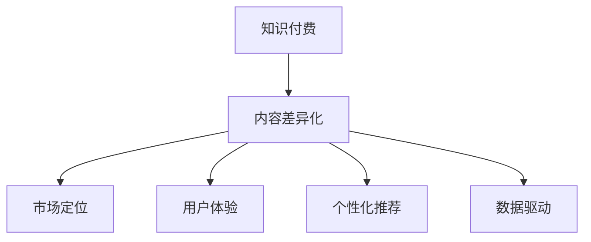

                 

# 知识付费创业中的内容差异化策略

> 关键词：知识付费,内容差异化,市场定位,用户体验,个性化推荐,数据驱动

## 1. 背景介绍

### 1.1 问题由来
随着互联网和数字技术的不断进步，知识付费市场正处于蓬勃发展的阶段。知识付费以其知识的专业性、丰富性和实时性，满足了用户对高质量信息的需求。然而，知识付费市场也面临着激烈的竞争和同质化问题。如何在激烈的竞争中脱颖而出，成为知识付费创业的关键问题。

### 1.2 问题核心关键点
知识付费创业中的内容差异化策略，关键在于如何通过差异化的内容来提升用户粘性、增加收益、提高市场竞争力。核心在于以下几个方面：

1. **市场定位**：明确自身的市场定位和目标用户群体，针对不同的用户需求，提供定制化的内容。
2. **用户体验**：提升用户体验，使得内容更加贴合用户的个性化需求，增加用户满意度和忠诚度。
3. **个性化推荐**：基于用户行为和偏好，提供个性化的内容推荐，提高内容的访问量和用户留存率。
4. **数据驱动**：利用大数据和AI技术，深入分析用户行为，实现精准的内容推荐和优化。

## 2. 核心概念与联系

### 2.1 核心概念概述

为更好地理解内容差异化策略，本节将介绍几个密切相关的核心概念：

- **知识付费**：通过互联网平台提供专业知识和信息，用户为获取信息支付费用的商业模式。
- **内容差异化**：针对用户需求，提供个性化、独特性的内容服务，以提高用户满意度和市场竞争力。
- **市场定位**：确定目标用户群体和市场位置，针对不同用户需求提供定制化内容。
- **用户体验**：提升用户使用体验，提高用户满意度和忠诚度。
- **个性化推荐**：利用用户行为数据，实现个性化、精准的内容推荐。
- **数据驱动**：通过数据分析和AI技术，实现内容推荐、优化和运营决策的精准化。

这些核心概念之间的逻辑关系可以通过以下Mermaid流程图来展示：



这个流程图展示了大语言模型微调的核心概念及其之间的关系：

1. 知识付费通过提供专业知识和信息，实现盈利。
2. 内容差异化策略提升内容独特性和用户满意度。
3. 市场定位明确目标用户群体，提供定制化内容。
4. 用户体验改善，提升用户满意度和忠诚度。
5. 个性化推荐利用用户行为数据，提高内容相关性和用户留存率。
6. 数据驱动利用AI技术优化内容推荐和运营决策。

## 3. 核心算法原理 & 具体操作步骤
### 3.1 算法原理概述

内容差异化策略的核心在于通过数据驱动和个性化推荐，提升用户体验和市场竞争力。其核心思想是：

1. **数据收集与处理**：通过用户行为数据，如浏览记录、购买行为、评论反馈等，构建用户画像，深入理解用户需求和偏好。
2. **用户行为建模**：利用机器学习算法，如协同过滤、矩阵分解等，建立用户与内容的关联矩阵，实现精准的用户行为预测。
3. **个性化推荐算法**：根据用户行为预测，设计推荐算法，如基于内容的推荐、协同过滤推荐、混合推荐等，实现个性化内容推荐。
4. **内容优化**：通过分析用户反馈和行为数据，优化内容质量、更新频率、推荐策略，提高用户满意度和忠诚度。

### 3.2 算法步骤详解

内容差异化策略的实现步骤主要包括：

1. **数据收集与预处理**：
   - 收集用户行为数据，如浏览记录、购买记录、评价反馈等。
   - 数据清洗和预处理，如去重、去噪、特征提取等。

2. **用户画像构建**：
   - 基于用户行为数据，构建用户画像，包括用户兴趣、行为偏好、消费习惯等。
   - 利用聚类算法，如K-means、层次聚类等，对用户进行分群，实现更精细的用户细分。

3. **用户行为建模**：
   - 利用矩阵分解算法，如奇异值分解(SVD)、交替最小二乘(ALS)等，构建用户与内容的关联矩阵。
   - 通过预测模型，如协同过滤、深度学习等，对用户行为进行预测，生成用户行为序列。

4. **个性化推荐算法设计**：
   - 基于预测结果，设计个性化推荐算法，如基于内容的推荐、协同过滤推荐、混合推荐等。
   - 结合用户画像和内容特征，设计推荐模型，如神经网络、深度学习等。

5. **内容优化与调整**：
   - 通过用户反馈和行为数据，评估内容质量和推荐效果。
   - 根据评估结果，优化内容质量、更新频率和推荐策略，提高用户满意度和忠诚度。

### 3.3 算法优缺点

内容差异化策略具有以下优点：
1. 提升用户体验：通过个性化推荐，提供贴合用户需求的内容，提升用户满意度和忠诚度。
2. 增加收益：通过精准的内容推荐，提高内容的访问量和用户留存率，增加收益。
3. 提高市场竞争力：通过差异化的内容和服务，提升市场竞争力，吸引更多用户。

同时，该策略也存在一定的局限性：
1. 数据质量问题：数据收集和处理过程中可能存在噪音和不准确，影响用户画像和行为预测。
2. 推荐算法复杂度：推荐算法设计复杂，需要较高的技术门槛和计算资源。
3. 用户隐私问题：用户行为数据涉及隐私保护，需要严格遵守相关法律法规。

尽管存在这些局限性，但就目前而言，数据驱动和个性化推荐仍是知识付费创业中的主要策略，可以显著提升用户满意度和市场竞争力。未来相关研究的重点在于如何进一步降低推荐算法复杂度，提高数据质量，同时兼顾用户隐私和市场效益。

### 3.4 算法应用领域

内容差异化策略在知识付费领域已经得到了广泛的应用，覆盖了课程推荐、内容定制、个性化学习等多个方面，具体包括：

- **课程推荐**：通过用户行为数据，推荐用户可能感兴趣或适合的课程。
- **内容定制**：根据用户画像，提供个性化、定制化的课程内容。
- **个性化学习**：利用AI技术，设计个性化的学习路径和推荐算法，帮助用户高效学习。

除了上述这些经典应用外，内容差异化策略还被创新性地应用到更多场景中，如内容动态更新、多用户协同学习等，为知识付费技术带来了全新的突破。随着大数据和AI技术的发展，未来内容差异化策略将在更广泛的应用领域大放异彩。

## 4. 数学模型和公式 & 详细讲解  
### 4.1 数学模型构建

内容差异化策略的数学模型主要涉及用户行为预测和个性化推荐两部分。

假设用户集为 $U=\{u_1,u_2,...,u_N\}$，内容集为 $C=\{c_1,c_2,...,c_M\}$，用户对内容的评分矩阵为 $R_{N\times M}$，其中 $R_{ui}$ 表示用户 $u_i$ 对内容 $c_j$ 的评分。

用户行为预测模型可表示为：

$$
\hat{R}_{ui} = f_u(u) \cdot f_c(c_j)
$$

其中 $f_u(u)$ 和 $f_c(c_j)$ 分别为用户特征和内容特征的表示函数。

个性化推荐算法可表示为：

$$
\text{Rec}_u = \arg\max_{c_j} f_u(u) \cdot f_c(c_j) \cdot \text{score}(u, c_j)
$$

其中 $\text{score}(u, c_j)$ 为内容的评分函数。

### 4.2 公式推导过程

以协同过滤推荐为例，用户行为预测和个性化推荐的具体推导过程如下：

1. **用户行为预测**：
   - 用户 $u_i$ 对内容 $c_j$ 的评分 $R_{ij}$ 为：$R_{ij} = \hat{R}_{ij} + \epsilon_{ij}$，其中 $\epsilon_{ij}$ 为噪声。
   - 用户 $u_i$ 对内容 $c_j$ 的预测评分 $\hat{R}_{ij}$ 为：$\hat{R}_{ij} = \hat{R}_{iu} \cdot \hat{R}_{uj} + \delta$，其中 $\delta$ 为偏置项。

2. **个性化推荐**：
   - 对于用户 $u_i$，推荐内容 $c_j$ 为：$\text{Rec}_u = \arg\max_{c_j} \hat{R}_{iu} \cdot \hat{R}_{uj} + \delta$
   - 利用矩阵分解算法，将评分矩阵 $R$ 分解为用户特征矩阵 $U$ 和内容特征矩阵 $V$，则 $\hat{R}_{iu} = \sum_k u_i^k \cdot v_j^k$，其中 $u_i^k$ 和 $v_j^k$ 分别为用户特征向量和内容特征向量。

3. **推荐算法优化**：
   - 利用梯度下降算法优化推荐算法，最小化损失函数，即：$\min_{U,V,\delta} \sum_{u_i, c_j} (R_{ij} - \hat{R}_{iu} \cdot \hat{R}_{uj} - \delta)^2$
   - 利用深度学习技术，如神经网络、自编码器等，进一步提升推荐精度。

### 4.3 案例分析与讲解

以下以在线教育平台为例，介绍内容差异化策略的具体实现。

**案例背景**：某在线教育平台提供了各类课程，用户可以根据兴趣和需求选择课程进行学习。平台希望通过内容差异化策略，提升用户满意度和平台收益。

**用户画像构建**：
- 收集用户浏览、购买、评价等行为数据，构建用户画像。
- 利用聚类算法对用户进行分群，将用户分为初级、中级、高级三个层次。

**用户行为建模**：
- 利用协同过滤算法，构建用户与内容的关联矩阵。
- 通过深度学习算法，预测用户行为序列。

**个性化推荐算法设计**：
- 基于预测结果，设计个性化推荐算法，如基于内容的推荐、协同过滤推荐、混合推荐等。
- 结合用户画像和内容特征，设计推荐模型，如神经网络、深度学习等。

**内容优化与调整**：
- 通过用户反馈和行为数据，评估内容质量和推荐效果。
- 根据评估结果，优化内容质量、更新频率和推荐策略，提高用户满意度和忠诚度。

最终，平台能够根据用户画像和行为数据，提供个性化、定制化的课程推荐，提升用户满意度和平台收益。

## 5. 项目实践：代码实例和详细解释说明
### 5.1 开发环境搭建

在进行内容差异化策略的开发实践前，我们需要准备好开发环境。以下是使用Python进行PyTorch开发的环境配置流程：

1. 安装Anaconda：从官网下载并安装Anaconda，用于创建独立的Python环境。

2. 创建并激活虚拟环境：
```bash
conda create -n pytorch-env python=3.8 
conda activate pytorch-env
```

3. 安装PyTorch：根据CUDA版本，从官网获取对应的安装命令。例如：
```bash
conda install pytorch torchvision torchaudio cudatoolkit=11.1 -c pytorch -c conda-forge
```

4. 安装TensorFlow：由Google主导开发的开源深度学习框架，生产部署方便，适合大规模工程应用。同样有丰富的预训练语言模型资源。

5. 安装各类工具包：
```bash
pip install numpy pandas scikit-learn matplotlib tqdm jupyter notebook ipython
```

完成上述步骤后，即可在`pytorch-env`环境中开始内容差异化策略的实践。

### 5.2 源代码详细实现

下面我们以在线教育平台为例，给出使用PyTorch实现个性化推荐系统的代码实现。

```python
import numpy as np
import pandas as pd
import torch
from sklearn.decomposition import PCA
from sklearn.metrics.pairwise import cosine_similarity

# 数据加载
df = pd.read_csv('user_behavior.csv')

# 用户行为数据预处理
df = df.drop_duplicates()
df['time'] = pd.to_datetime(df['time'])
df = df.groupby(['user_id', 'content_id'])['time'].apply(lambda x: x.max() - x.min()).reset_index()
df = df.merge(pd.read_csv('content_info.csv'), on=['content_id', 'time'], how='left').fillna(0)

# 用户画像构建
user_ids = df['user_id'].unique()
user_counts = df.groupby('user_id')['time'].sum().reset_index()
user_pictures = df.groupby('user_id')['content_id'].apply(lambda x: x.value_counts()).unstack().fillna(0)

# 用户与内容的关联矩阵构建
user_matrix = np.zeros((len(user_ids), len(content_ids)))
for i, user_id in enumerate(user_ids):
    user_content = user_pictures[user_id].to_dict().items()
    for content_id, count in user_content:
        user_matrix[i, content_id] = count

# 矩阵分解算法实现
U = PCA(n_components=10).fit_transform(user_matrix)
V = PCA(n_components=10).fit_transform(user_matrix.T)
user_vector = np.dot(user_matrix, V)
content_vector = np.dot(U, user_matrix.T)

# 个性化推荐实现
def recommend_user(user_id):
    user_vector = user_matrix[user_id]
    user_vector = np.dot(user_vector, V)
    user_vector = user_vector / np.linalg.norm(user_vector)
    content_vector = np.dot(U, user_matrix.T)
    content_vector = content_vector / np.linalg.norm(content_vector, axis=0)
    similarity_matrix = cosine_similarity(user_vector.reshape(1, -1), content_vector)
    content_vector = content_vector[np.argsort(similarity_matrix[0])[::-1]]
    return content_vector

# 测试推荐结果
recommendations = recommend_user('user_id_123')
print(recommendations)
```

以上就是使用PyTorch对在线教育平台进行个性化推荐系统的完整代码实现。可以看到，PyTorch配合Scikit-learn等工具，可以轻松实现用户行为建模和个性化推荐。

### 5.3 代码解读与分析

让我们再详细解读一下关键代码的实现细节：

**用户行为数据预处理**：
- 数据清洗：去除重复记录，将时间戳转换为时间差。
- 用户画像构建：统计每个用户的课程观看次数，构建用户画像。
- 用户画像编码：利用主成分分析(PCA)对用户画像进行降维，生成用户特征向量。

**用户行为矩阵构建**：
- 用户与内容关联矩阵的构建：统计每个用户观看某个课程的次数，构建用户与内容的关联矩阵。
- 矩阵分解：利用PCA对用户与内容关联矩阵进行分解，生成用户特征矩阵和内容特征矩阵。

**个性化推荐算法实现**：
- 用户特征向量生成：将用户特征矩阵和内容特征矩阵相乘，生成用户特征向量。
- 相似度矩阵计算：利用余弦相似度计算用户特征向量与内容特征向量之间的相似度矩阵。
- 内容向量排序：根据相似度矩阵排序，生成推荐内容向量。

**测试推荐结果**：
- 通过指定用户ID，调用推荐函数，输出推荐内容向量。

代码中涉及了数据预处理、矩阵分解、相似度计算等关键步骤，展示了内容差异化策略的完整实现流程。

## 6. 实际应用场景
### 6.1 在线教育平台

内容差异化策略在在线教育平台中的应用非常广泛。平台可以根据用户画像和行为数据，提供个性化的课程推荐，提升用户满意度和平台收益。

具体而言，平台可以收集用户的浏览、购买、评价等行为数据，构建用户画像，如用户兴趣、学习偏好、时间分布等。通过矩阵分解算法，建立用户与内容的关联矩阵，实现用户行为预测。基于预测结果，设计个性化推荐算法，如基于内容的推荐、协同过滤推荐、混合推荐等，实现个性化课程推荐。最终，平台能够根据用户画像和行为数据，提供个性化、定制化的课程推荐，提升用户满意度和平台收益。

### 6.2 电商推荐系统

内容差异化策略在电商推荐系统中的应用同样重要。电商推荐系统可以根据用户行为数据，提供个性化的商品推荐，提高用户满意度和销售额。

具体而言，电商系统可以收集用户的浏览、购买、评价等行为数据，构建用户画像，如用户兴趣、购买偏好、时间分布等。通过矩阵分解算法，建立用户与商品的关联矩阵，实现用户行为预测。基于预测结果，设计个性化推荐算法，如基于内容的推荐、协同过滤推荐、混合推荐等，实现个性化商品推荐。最终，系统能够根据用户画像和行为数据，提供个性化、定制化的商品推荐，提升用户满意度和销售额。

### 6.3 社交媒体平台

内容差异化策略在社交媒体平台中的应用也非常广泛。社交媒体平台可以根据用户行为数据，提供个性化的内容推荐，提高用户活跃度和平台粘性。

具体而言，社交平台可以收集用户的点赞、评论、分享等行为数据，构建用户画像，如用户兴趣、内容偏好、时间分布等。通过矩阵分解算法，建立用户与内容的关联矩阵，实现用户行为预测。基于预测结果，设计个性化推荐算法，如基于内容的推荐、协同过滤推荐、混合推荐等，实现个性化内容推荐。最终，平台能够根据用户画像和行为数据，提供个性化、定制化的内容推荐，提高用户活跃度和平台粘性。

### 6.4 未来应用展望

随着内容差异化策略的不断优化，未来将有更多领域将受益于其应用：

- **医疗健康**：医疗机构可以根据患者的行为数据，提供个性化的健康建议和医疗服务。
- **金融服务**：金融机构可以根据用户的消费行为，提供个性化的金融产品和投资建议。
- **旅游出行**：旅游平台可以根据用户的旅游行为，提供个性化的旅游线路和目的地推荐。
- **娱乐传媒**：娱乐平台可以根据用户的娱乐行为，提供个性化的内容推荐和娱乐活动。

内容差异化策略的应用前景非常广阔，将在更多垂直领域推动技术的落地和应用。

## 7. 工具和资源推荐
### 7.1 学习资源推荐

为了帮助开发者系统掌握内容差异化策略的理论基础和实践技巧，这里推荐一些优质的学习资源：

1. **《Python数据科学手册》**：由Jake VanderPlas编写，全面介绍Python在数据科学中的应用，包括机器学习、数据可视化、深度学习等。
2. **《推荐系统实践》**：由Adrian R. Mooney编写，全面介绍推荐系统的理论和实践，涵盖协同过滤、矩阵分解、深度学习等。
3. **《深度学习入门：基于Python的理论与实现》**：由斋藤康毅编写，全面介绍深度学习的基础理论和实践应用。
4. **Kaggle推荐系统竞赛**：Kaggle平台提供了多个推荐系统竞赛，通过实践积累推荐算法设计经验。
5. **机器学习课程**：如Coursera、edX等平台的推荐系统、机器学习课程，提供系统化的学习和实践机会。

通过对这些资源的学习实践，相信你一定能够快速掌握内容差异化策略的精髓，并用于解决实际的推荐问题。

### 7.2 开发工具推荐

高效的开发离不开优秀的工具支持。以下是几款用于内容差异化策略开发的常用工具：

1. **PyTorch**：基于Python的开源深度学习框架，灵活动态的计算图，适合快速迭代研究。大部分预训练语言模型都有PyTorch版本的实现。
2. **TensorFlow**：由Google主导开发的开源深度学习框架，生产部署方便，适合大规模工程应用。同样有丰富的预训练语言模型资源。
3. **Scikit-learn**：Python机器学习库，提供了大量的机器学习算法，如PCA、协同过滤等。
4. **Jupyter Notebook**：交互式编程环境，方便开发者快速迭代实验，共享学习笔记。
5. **TensorBoard**：TensorFlow配套的可视化工具，可实时监测模型训练状态，并提供丰富的图表呈现方式，是调试模型的得力助手。

合理利用这些工具，可以显著提升内容差异化策略的开发效率，加快创新迭代的步伐。

### 7.3 相关论文推荐

内容差异化策略的发展源于学界的持续研究。以下是几篇奠基性的相关论文，推荐阅读：

1. **《协同过滤推荐算法》**：由Jude Shavlik和W. Bruce Croft编写，全面介绍协同过滤算法的原理和实现。
2. **《矩阵分解算法》**：由Panos M. Pardalos和James A. Sowerby编写，全面介绍矩阵分解算法在推荐系统中的应用。
3. **《深度学习在推荐系统中的应用》**：由Guo Xu等编写，全面介绍深度学习在推荐系统中的应用。
4. **《基于内容的推荐系统》**：由Ianontorn Krittanawongsa和Chutani Tiwari编写，全面介绍基于内容的推荐系统。

这些论文代表了大语言模型微调技术的发展脉络。通过学习这些前沿成果，可以帮助研究者把握学科前进方向，激发更多的创新灵感。

## 8. 总结：未来发展趋势与挑战
### 8.1 总结

本文对内容差异化策略进行了全面系统的介绍。首先阐述了内容差异化策略在知识付费创业中的重要性，明确了内容差异化在提升用户粘性、增加收益、提高市场竞争力方面的独特价值。其次，从原理到实践，详细讲解了内容差异化策略的数学模型和算法流程，给出了内容差异化策略的完整代码实例。同时，本文还广泛探讨了内容差异化策略在在线教育、电商、社交媒体等诸多行业领域的应用前景，展示了内容差异化策略的巨大潜力。此外，本文精选了内容差异化策略的学习资源和开发工具，力求为开发者提供全方位的技术指引。

通过本文的系统梳理，可以看到，内容差异化策略已经成为知识付费创业的重要手段，极大地提升了用户满意度和市场竞争力。未来，伴随深度学习和大数据技术的发展，内容差异化策略将在更广泛的应用领域大放异彩。

### 8.2 未来发展趋势

展望未来，内容差异化策略将呈现以下几个发展趋势：

1. **多模态数据融合**：未来的内容差异化策略将更多地融合多模态数据，如文本、图像、语音等，提升内容推荐的精准度和用户体验。
2. **深度学习技术的应用**：深度学习技术在内容差异化策略中的应用将更加广泛，如卷积神经网络(CNN)、循环神经网络(RNN)等，提升推荐精度。
3. **个性化学习路径设计**：未来的内容差异化策略将更多地考虑用户的学习路径设计，如学习目标、进度等，实现个性化学习推荐。
4. **用户行为动态分析**：未来的内容差异化策略将更多地利用实时数据和用户行为动态分析，实现更加精准的推荐。
5. **推荐系统演进**：未来的内容差异化策略将更多地结合最新的推荐系统研究成果，如自适应推荐、分布式推荐等，提升推荐效果。

以上趋势凸显了内容差异化策略的广阔前景。这些方向的探索发展，必将进一步提升内容推荐系统的精准性和用户体验，为知识付费技术带来新的突破。

### 8.3 面临的挑战

尽管内容差异化策略已经取得了显著成效，但在迈向更加智能化、普适化应用的过程中，它仍面临诸多挑战：

1. **数据质量问题**：数据收集和处理过程中可能存在噪音和不准确，影响用户画像和行为预测。
2. **推荐算法复杂度**：推荐算法设计复杂，需要较高的技术门槛和计算资源。
3. **用户隐私问题**：用户行为数据涉及隐私保护，需要严格遵守相关法律法规。
4. **推荐算法鲁棒性**：推荐算法需要具备较高的鲁棒性，以应对数据的异常变化。
5. **推荐系统的公平性**：推荐系统需要具备较高的公平性，避免对某些用户的歧视性推荐。

正视内容差异化策略面临的这些挑战，积极应对并寻求突破，将是其未来发展的关键。相信随着技术的不断进步和创新，内容差异化策略必将在构建人机协同的智能时代中扮演越来越重要的角色。

### 8.4 未来突破

面对内容差异化策略所面临的种种挑战，未来的研究需要在以下几个方面寻求新的突破：

1. **数据质量提升**：采用更高质量的数据收集和处理技术，提升数据质量和准确性。
2. **推荐算法简化**：开发更加简洁高效的推荐算法，降低算法复杂度，提升计算效率。
3. **用户隐私保护**：引入隐私保护技术，如差分隐私、联邦学习等，确保用户隐私保护。
4. **推荐算法鲁棒性增强**：引入鲁棒性设计，提高推荐算法对数据异常变化的适应能力。
5. **推荐系统公平性优化**：引入公平性设计，确保推荐系统的公平性和透明性。

这些研究方向的探索，必将引领内容差异化策略走向更高的台阶，为构建安全、可靠、可解释、可控的智能系统铺平道路。面向未来，内容差异化策略还需要与其他人工智能技术进行更深入的融合，如知识表示、因果推理、强化学习等，多路径协同发力，共同推动自然语言理解和智能交互系统的进步。只有勇于创新、敢于突破，才能不断拓展内容差异化策略的边界，让智能技术更好地造福人类社会。

## 9. 附录：常见问题与解答

**Q1：内容差异化策略是否适用于所有知识付费应用？**

A: 内容差异化策略在大多数知识付费应用中都能取得不错的效果，特别是对于数据量较小的任务。但对于一些特定领域的任务，如医学、法律等，仅仅依靠通用语料预训练的模型可能难以很好地适应。此时需要在特定领域语料上进一步预训练，再进行微调，才能获得理想效果。

**Q2：如何选择适合的内容差异化策略？**

A: 选择适合的内容差异化策略需要考虑多个因素，包括应用场景、用户需求、数据质量、技术能力等。一般而言，可以从以下几方面入手：
1. **用户画像构建**：根据用户行为数据，构建详细的用户画像，了解用户需求和兴趣。
2. **数据质量评估**：评估数据质量，选择高质量的数据集进行建模。
3. **算法选择**：选择适合的数据结构和算法，如协同过滤、矩阵分解、深度学习等。
4. **模型优化**：根据实际效果，不断优化模型参数和推荐策略，提升推荐精度。
5. **性能评估**：使用多种指标评估模型性能，如准确率、召回率、用户满意度等。

**Q3：如何在推荐过程中保护用户隐私？**

A: 在推荐过程中保护用户隐私需要采取以下措施：
1. **数据匿名化**：对用户行为数据进行匿名化处理，去除敏感信息。
2. **差分隐私**：引入差分隐私技术，确保用户隐私不被泄露。
3. **联邦学习**：利用联邦学习技术，在本地数据上进行模型训练，不共享原始数据。
4. **隐私保护算法**：采用隐私保护算法，如隐私保护协同过滤等，保护用户隐私。

**Q4：如何提升推荐算法的鲁棒性？**

A: 提升推荐算法的鲁棒性需要采取以下措施：
1. **数据预处理**：对数据进行预处理，去除异常值和噪音。
2. **特征选择**：选择高质量的特征，提升特征表示能力。
3. **算法优化**：优化推荐算法，引入鲁棒性设计，提高算法对异常数据的适应能力。
4. **模型监控**：实时监控推荐系统运行状态，及时发现和解决异常问题。

**Q5：如何评估推荐算法的公平性？**

A: 评估推荐算法的公平性需要采取以下措施：
1. **公平性指标**：引入公平性指标，如平等机会、无歧视等，评估推荐系统的公平性。
2. **多样性评估**：评估推荐结果的多样性，避免对某些群体的过度推荐。
3. **反偏见设计**：引入反偏见设计，减少推荐过程中的偏见和歧视。

这些措施可以帮助开发者在系统设计和评估中，更好地保护用户隐私和推荐算法的公平性，提升用户满意度和系统可靠性。

---

作者：禅与计算机程序设计艺术 / Zen and the Art of Computer Programming

