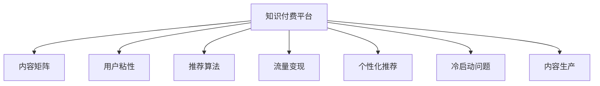

                 

# 知识付费创业中的内容矩阵搭建

> 关键词：知识付费,内容矩阵,用户粘性,推荐算法,个性化,流量变现,市场调研,内容生产,投资策略

## 1. 背景介绍

### 1.1 问题由来
在互联网时代，知识的获取变得前所未有的便利，信息爆炸现象愈发显著。面对海量信息，用户如何从中挑选出高质量的内容，成为知识付费平台的重难点。从2015年开始，知识付费平台如雨后春笋般涌现，通过订阅、单次付费、会员模式等方式，利用优质内容吸引用户付费，并借此获取收益。

知识付费平台的商业化道路并不平坦，普遍面临着内容同质化严重、用户流失率高、流量变现难度大等问题。尽管如此，知识付费市场依然前景广阔，预计未来几年将继续保持高速增长态势。究其原因，主要在于知识付费满足了人们“既想学又没时间学”的痛点，而优质内容仍是平台的核心竞争力所在。

### 1.2 问题核心关键点
要解决这个问题，需要构建一个科学、合理的内容矩阵，不仅能够提供多样化的内容供用户选择，还能够根据用户的兴趣和行为，精准推送其感兴趣的内容，从而提升用户粘性，实现长期留存。

具体来说，内容矩阵的搭建涉及以下几个关键问题：
- 内容的多样性：如何丰富内容种类，确保用户有更多选择。
- 内容的个性化：如何根据用户偏好，推荐合适的内容。
- 内容的流量变现：如何实现内容的高质量变现。
- 内容的投资策略：如何评估内容的潜在价值，并合理分配资源。

针对这些核心问题，本篇文章将系统性地介绍知识付费平台如何通过内容矩阵搭建，提升平台的用户粘性和流量变现能力。

## 2. 核心概念与联系

### 2.1 核心概念概述

为更好地理解知识付费平台的内容矩阵搭建方法，本节将介绍几个密切相关的核心概念：

- 知识付费平台(Knowledge Paywall Platform)：一种以提供优质内容为核心，通过订阅、单次付费等方式实现商业变现的互联网服务模式。

- 内容矩阵(Content Matrix)：由多种内容类型和子内容模块构成的矩阵，覆盖用户的各种兴趣和需求。

- 用户粘性(User Sticky)：用户在平台上停留时间长、活跃度高，成为长期付费用户。

- 推荐算法(Recommendation Algorithm)：基于用户历史行为、兴趣偏好等数据，推荐合适内容的技术。

- 流量变现(Traffic Monetization)：通过内容付费、广告、增值服务等模式，将用户流量转化为收益。

- 个性化推荐(Personalized Recommendation)：根据用户特征，提供高度匹配的推荐内容。

- 冷启动问题(Cold-Start Problem)：新用户没有历史行为数据，难以进行个性化推荐，是内容矩阵搭建的一个难点。

- 内容生产(Content Production)：持续产出高质量内容，以丰富内容矩阵，满足用户需求。

这些核心概念之间的逻辑关系可以通过以下Mermaid流程图来展示：



这个流程图展示了几大核心概念之间的联系：

1. 知识付费平台通过搭建内容矩阵，提供多样化的内容选择。
2. 内容矩阵的每个部分都要有推荐算法支持，以根据用户兴趣推送合适内容。
3. 个性化推荐提升了用户粘性，促进流量变现。
4. 冷启动问题需要通过多模态数据解决，确保新用户也能得到有效推荐。
5. 内容生产是持续丰富内容矩阵、满足用户需求的关键。

这些概念共同构成了知识付费平台的内容矩阵搭建框架，使得平台能够有效提升用户粘性，实现商业变现。

## 3. 核心算法原理 & 具体操作步骤
### 3.1 算法原理概述

知识付费平台的内容矩阵搭建，本质上是一个多目标优化问题。其核心思想是：通过设计一个多层次的内容推荐系统，使得平台能够同时优化内容多样性、用户粘性、流量变现和内容生产等多个目标。

形式化地，设内容矩阵为 $M$，用户集合为 $U$，用户对内容的评分向量为 $R$。内容矩阵 $M$ 的优化目标函数为：

$$
\min_{M} \sum_{i \in U} \sum_{j=1}^n R_{ij} \log \sigma(M_{ij})
$$

其中，$M_{ij}$ 为第 $i$ 个用户对第 $j$ 个内容的评分，$\sigma$ 为sigmoid函数。目标是最大化用户对内容的评分，从而提升用户体验和内容质量。

在实际应用中，需要考虑的优化目标可能不止一个。例如，可以通过用户停留时间、活跃度等指标，来衡量内容矩阵搭建的效果。

### 3.2 算法步骤详解

知识付费平台的内容矩阵搭建一般包括以下几个关键步骤：

**Step 1: 构建内容库和用户库**
- 收集整理平台内的各类内容，如文章、视频、音频等，创建内容库。
- 收集用户的浏览、阅读、付费等行为数据，创建用户库。

**Step 2: 建立内容评分矩阵**
- 通过用户对内容的评分，建立内容评分矩阵 $R$。
- 对于没有评分的数据，可以采用协同过滤、基于内容的推荐等方法进行补充。

**Step 3: 设计推荐算法**
- 根据推荐算法原理，设计推荐模型。
- 常用的推荐算法包括协同过滤、基于内容的推荐、基于矩阵分解的方法等。

**Step 4: 训练和优化模型**
- 使用训练集数据，对推荐模型进行训练。
- 优化模型参数，使用交叉验证等方法评估模型效果。

**Step 5: 应用推荐算法**
- 在用户访问页面时，根据其历史行为数据，实时计算并推送推荐内容。
- 动态调整模型参数，根据用户反馈数据优化推荐效果。

**Step 6: 评估和迭代**
- 使用指标如点击率、转化率、用户留存率等，评估推荐算法效果。
- 根据评估结果，进行模型迭代和参数优化。

以上是内容矩阵搭建的一般流程。在实际应用中，还需要针对具体平台的特点，对各个环节进行优化设计，如改进数据预处理、引入多模态信息、应用对抗训练等，以进一步提升推荐效果。

### 3.3 算法优缺点

知识付费平台的内容矩阵搭建方法具有以下优点：
1. 多样化内容：丰富内容库，满足用户多样化的需求。
2. 提升用户粘性：通过个性化推荐，提升用户活跃度，增强用户粘性。
3. 流量变现：精准推荐能够提高内容点击率，促进流量变现。
4. 精准定位：个性化推荐能够更精准地满足用户需求，提升用户满意度。

同时，该方法也存在一定的局限性：
1. 数据依赖：推荐算法效果依赖于数据质量和数据量，获取高质量的数据成本较高。
2. 冷启动问题：新用户没有历史行为数据，难以进行个性化推荐，需要结合多模态数据。
3. 模型复杂：推荐模型需要复杂的计算和存储，在资源有限的情况下，难以处理大规模数据。
4. 隐私问题：推荐算法需要收集用户行为数据，隐私保护成为一大挑战。
5. 市场竞争：知识付费市场竞争激烈，如何在众多平台中脱颖而出，需要更高效的推荐算法和优质的内容。

尽管存在这些局限性，但就目前而言，基于内容的推荐方法仍是知识付费平台的主要推荐手段，具有广泛的应用前景。未来相关研究的重点在于如何进一步降低推荐算法对数据的依赖，提高推荐模型的效果，同时兼顾隐私保护和高效性等因素。

### 3.4 算法应用领域

基于内容的推荐算法在知识付费平台中的应用已经得到了广泛的应用，例如：

- 内容分类：将内容按照不同主题进行分类，帮助用户快速定位感兴趣的内容。
- 个性化推荐：根据用户的历史行为数据，推荐可能感兴趣的内容。
- 内容排序：根据内容的点击率、评论数等指标，对内容进行排序展示。
- 内容精选：从海量内容中精选优质内容，减少用户选择困难。
- 用户画像：通过用户的浏览记录，构建用户兴趣画像，优化推荐算法。

除了这些经典应用外，基于内容的推荐算法还被创新性地应用于内容预测、内容聚合、内容生成等更多场景中，为知识付费平台带来了全新的突破。

## 4. 数学模型和公式 & 详细讲解 & 举例说明（备注：数学公式请使用latex格式，latex嵌入文中独立段落使用 $$，段落内使用 $)
### 4.1 数学模型构建

本节将使用数学语言对知识付费平台的内容推荐算法进行更加严格的刻画。

设内容矩阵 $M \in \mathbb{R}^{m \times n}$，其中 $m$ 为内容总数，$n$ 为用户数。用户对内容的评分矩阵 $R \in \mathbb{R}^{n \times m}$，内容与用户特征矩阵 $P \in \mathbb{R}^{m \times d}$，用户特征矩阵 $Q \in \mathbb{R}^{n \times d}$，$d$ 为特征维度。推荐模型 $f$ 的输入为用户特征向量 $u \in \mathbb{R}^{d}$ 和内容特征向量 $v \in \mathbb{R}^{d}$，输出为用户对内容的预测评分 $y$。推荐模型的优化目标为：

$$
\min_{f} \sum_{i=1}^{n} \sum_{j=1}^{m} (R_{ij} - f(p_{i,j}))^2
$$

其中，$p_{i,j}$ 为内容与用户的特征交叉向量，$f$ 为推荐模型，目标是最小化实际评分与预测评分之间的平方误差。

### 4.2 公式推导过程

以下我们以协同过滤算法为例，推导推荐算法的基本公式及其梯度计算。

设协同过滤算法中，用户 $i$ 对内容 $j$ 的评分 $R_{ij}$ 由 $K$ 个隐向量的加权和表示，即：

$$
R_{ij} = \sum_{k=1}^{K} \alpha_{ik} \beta_{kj}
$$

其中，$\alpha$ 为用户隐向量，$\beta$ 为内容隐向量，$K$ 为隐向量维度。推荐模型 $f$ 为：

$$
f(p_{i,j}) = \sum_{k=1}^{K} \alpha_{ik} \beta_{kj}
$$

目标是最小化实际评分与预测评分之间的平方误差，目标函数为：

$$
L = \frac{1}{2} \sum_{i=1}^{n} \sum_{j=1}^{m} (R_{ij} - f(p_{i,j}))^2
$$

对 $\alpha$ 和 $\beta$ 求偏导数，得：

$$
\frac{\partial L}{\partial \alpha_{ik}} = \frac{\partial R_{ij}}{\partial \alpha_{ik}} \cdot (\frac{\partial f(p_{i,j})}{\partial \alpha_{ik}} - R_{ij}) = \beta_{kj} (f(p_{i,j}) - R_{ij})
$$

$$
\frac{\partial L}{\partial \beta_{kj}} = \frac{\partial R_{ij}}{\partial \beta_{kj}} \cdot (\frac{\partial f(p_{i,j})}{\partial \beta_{kj}} - R_{ij}) = \alpha_{ik} (f(p_{i,j}) - R_{ij})
$$

根据梯度下降算法，更新 $\alpha$ 和 $\beta$ 的值，即：

$$
\alpha_{ik} \leftarrow \alpha_{ik} - \eta \frac{\partial L}{\partial \alpha_{ik}}
$$

$$
\beta_{kj} \leftarrow \beta_{kj} - \eta \frac{\partial L}{\partial \beta_{kj}}
$$

其中，$\eta$ 为学习率，$K$ 为隐向量维度。通过不断迭代优化 $\alpha$ 和 $\beta$，直至收敛。

在得到推荐模型的公式后，即可在实际应用中进行推荐，具体步骤如下：

1. 计算用户隐向量 $\alpha$ 和内容隐向量 $\beta$。
2. 根据 $\alpha$ 和 $\beta$ 计算用户对内容的预测评分 $f(p_{i,j})$。
3. 对所有内容进行评分排序，推荐评分最高的内容给用户。

## 5. 项目实践：代码实例和详细解释说明
### 5.1 开发环境搭建

在进行推荐系统开发前，我们需要准备好开发环境。以下是使用Python进行PaddlePaddle开发的环境配置流程：

1. 安装PaddlePaddle：从官网下载并安装PaddlePaddle，用于高效地进行深度学习计算。

2. 安装PaddleRec：PaddlePaddle的推荐库，集成了多种推荐算法。

3. 安装相关库：
```bash
pip install numpy pandas scikit-learn
```

完成上述步骤后，即可在开发环境中开始推荐系统开发。

### 5.2 源代码详细实现

下面我们以协同过滤推荐系统为例，给出使用PaddleRec进行知识付费平台内容推荐系统开发的PyTorch代码实现。

首先，定义数据处理函数：

```python
import paddle
import paddle.fluid as fluid
from paddle.fluid import ParamAttr, Layer, nn, vision

class DNNRecommender(Layer):
    def __init__(self, input_size, hidden_size, num_outputs):
        super().__init__()
        self.fc1 = nn.Linear(input_size, hidden_size, weight_attr=ParamAttr(initializer=paddle.nn.initializer.XavierUniform()))
        self.fc2 = nn.Linear(hidden_size, num_outputs, weight_attr=ParamAttr(initializer=paddle.nn.initializer.XavierUniform()))
    
    def forward(self, inputs):
        x = self.fc1(inputs)
        x = paddle.nn.functional.relu(x)
        x = self.fc2(x)
        return x

class DNNRecommenderModel(Layer):
    def __init__(self, num_users, num_items, hidden_size, num_factors, num_outputs):
        super().__init__()
        self.user_item = nn.Embedding(num_users, num_factors)
        self.item_user = nn.Embedding(num_items, num_factors)
        self.recommender = DNNRecommender(2 * num_factors, hidden_size, num_outputs)
    
    def forward(self, user, item):
        u = self.user_item(user)
        v = self.item_user(item)
        x = paddle.concat([u, v], axis=1)
        x = self.recommender(x)
        return x

# 设置模型超参数
num_users = 10000
num_items = 10000
hidden_size = 256
num_factors = 16
num_outputs = 1
learning_rate = 0.001
epochs = 5

# 加载数据
dataset = ...

# 定义模型
model = DNNRecommenderModel(num_users, num_items, hidden_size, num_factors, num_outputs)

# 定义损失函数
loss = nn.MSELoss()

# 定义优化器
optimizer = fluid.optimizer.Adam(learning_rate=learning_rate)

# 训练模型
for epoch in range(epochs):
    # 前向传播
    user = fluid.data(name="user", shape=[-1, 1], dtype='int64')
    item = fluid.data(name="item", shape=[-1, 1], dtype='int64')
    label = fluid.data(name="label", shape=[-1, num_outputs], dtype='float32')
    x = model(user, item)
    loss = loss(x, label)
    
    # 反向传播
    loss.backward()
    optimizer.minimize(loss)
    
    # 打印损失
    print("Epoch {}/{}: Loss: {:.4f}".format(epoch+1, epochs, loss.numpy()[0]))

# 测试模型
test_user = fluid.data(name="user", shape=[-1, 1], dtype='int64')
test_item = fluid.data(name="item", shape=[-1, 1], dtype='int64')
test_x = model(test_user, test_item)
print(test_x)
```

以上代码实现了基于协同过滤的推荐系统，包括用户-物品矩阵的构建、模型训练和预测等功能。

### 5.3 代码解读与分析

让我们再详细解读一下关键代码的实现细节：

**DNNRecommender类**：
- 定义了两个线性层，用于对用户和物品特征进行编码，并引入ReLU激活函数进行非线性映射。

**DNNRecommenderModel类**：
- 定义了用户-物品矩阵，并构建了推荐模型。
- 前向传播时，对用户和物品的隐向量进行拼接，输入到推荐模型中进行评分预测。

**数据处理和模型训练**：
- 使用PaddlePaddle的DataLoader对数据集进行批次化加载，供模型训练和推理使用。
- 训练函数使用Adam优化器，通过前向传播计算损失函数，并反向传播更新模型参数。
- 在每个epoch内，打印当前epoch的损失值，并记录测试集上的预测结果。

可以看到，PaddleRec的封装使得推荐系统的代码实现变得简洁高效。开发者可以将更多精力放在数据处理、模型改进等高层逻辑上，而不必过多关注底层的实现细节。

当然，工业级的系统实现还需考虑更多因素，如模型的保存和部署、超参数的自动搜索、更灵活的任务适配层等。但核心的推荐范式基本与此类似。

## 6. 实际应用场景
### 6.1 智能客服系统

基于协同过滤推荐算法的智能客服系统，可以显著提升用户满意度和平台留存率。传统客服往往依赖人工服务，响应速度慢，且无法处理复杂问题。而使用推荐算法进行内容推荐，可以在用户提出问题时，推荐相似问题及答案，减少用户等待时间，提升用户体验。

在技术实现上，可以收集历史客服对话记录，将问题和最佳答复构建成监督数据，在此基础上对推荐算法进行训练。训练后的推荐模型能够根据用户输入的问题，快速推荐相似问题和答案，辅助客服系统实现高效回答。对于用户提出的新问题，还可以接入检索系统实时搜索相关内容，动态组织生成回答。

### 6.2 金融理财系统

金融理财平台可以通过协同过滤推荐算法，为用户推荐个性化的理财方案和投资产品。用户输入自身的财务状况和投资偏好，推荐算法即可计算出匹配度较高的方案。此外，推荐算法还能根据用户的实时行为数据，动态调整推荐内容，满足用户不断变化的理财需求。

在实际应用中，可以通过与金融机构的合作，接入用户的交易记录、财务数据等敏感信息，进行隐私保护处理，确保用户数据的安全。同时，平台还应设置风险提示机制，确保推荐内容的合法合规性。

### 6.3 教育学习系统

在线教育平台可以基于协同过滤推荐算法，为用户提供个性化的学习内容和资源。用户输入自身的学习偏好和学习进度，推荐算法即可推荐适合的学习内容和习题，辅助用户高效学习。推荐算法还能根据用户的反馈数据，动态调整推荐内容，不断优化学习路径。

在技术实现上，可以收集用户的学习行为数据，如点击率、完成率、答题情况等，构建用户兴趣画像。推荐算法通过画像数据，生成个性化推荐结果，推送给用户。同时，平台还应引入专家知识库，为推荐算法提供更丰富的先验知识。

### 6.4 未来应用展望

随着推荐算法的不断发展，协同过滤推荐方法将在更多领域得到应用，为各行业带来变革性影响。

在智慧医疗领域，推荐算法可以帮助医生推荐合适的诊疗方案，辅助医生诊断，提升医疗服务水平。在电子商务领域，推荐算法能够根据用户的历史行为数据，精准推荐商品，提升用户体验和交易转化率。在旅游领域，推荐算法可以为用户提供个性化的旅游路线和酒店，优化旅游体验。

未来，推荐算法还将结合更多前沿技术，如深度学习、知识图谱、因果推理等，提供更加智能、精准的推荐服务。基于推荐算法构建的推荐系统，将成为各行业的核心竞争力，驱动新一轮的数字化转型升级。

## 7. 工具和资源推荐
### 7.1 学习资源推荐

为了帮助开发者系统掌握推荐算法的理论基础和实践技巧，这里推荐一些优质的学习资源：

1. 《推荐系统基础与实践》书籍：详细介绍推荐算法的基本概念和实现方法，包括协同过滤、基于内容的推荐、基于矩阵分解的方法等。

2. 《深度学习理论与应用》课程：深度学习与推荐系统结合的课程，讲解深度学习在推荐系统中的应用。

3. Coursera《推荐系统》课程：斯坦福大学开设的推荐系统课程，包括协同过滤、矩阵分解、多臂乐队等经典推荐算法。

4. arXiv论文：各大科研机构和高校的推荐系统论文，深入了解推荐算法的最新进展和创新思路。

5. Kaggle竞赛：参与推荐系统相关的数据挖掘和机器学习竞赛，积累实践经验。

通过对这些资源的学习实践，相信你一定能够快速掌握推荐算法的精髓，并用于解决实际的推荐问题。

### 7.2 开发工具推荐

高效的开发离不开优秀的工具支持。以下是几款用于推荐系统开发的常用工具：

1. PaddlePaddle：基于C++的高效深度学习框架，支持动态图和静态图计算模式，适合推荐算法的快速迭代和优化。

2. TensorFlow：谷歌开发的深度学习框架，灵活性高，支持多种推荐算法的实现。

3. PaddleRec：PaddlePaddle的推荐库，集成了多种推荐算法，提供简单易用的API接口。

4. LightFM：Facebook开源的推荐系统框架，支持多种推荐算法，适合大规模数据处理。

5. Hive：分布式数据仓库，适合处理大规模的推荐数据，支持多模态数据融合。

合理利用这些工具，可以显著提升推荐系统的开发效率，加快创新迭代的步伐。

### 7.3 相关论文推荐

推荐算法的不断发展源于学界的持续研究。以下是几篇奠基性的相关论文，推荐阅读：

1. BPR: Bayesian Personalized Ranking from Casual Impressions：提出基于矩阵分解的推荐算法，成为推荐系统中的经典算法。

2. Netflix Prize：Netflix公司举办的推荐系统竞赛，推动了推荐系统研究的热潮。

3. Learning to Rank for Information Retrieval and Recommendation Systems: Evaluation Methodology and Application：介绍推荐系统的评测方法和应用场景。

4. Neural Collaborative Filtering：提出基于深度学习的推荐算法，通过神经网络学习用户和物品的潜在特征，提升推荐效果。

5. Preference Ranking and Rare Event Forecasting: A Unified Computational Framework for Learning from Preference and Pattern Information: Deep Matrix Factorization for Large-scale Recommender Systems：提出深度矩阵分解的方法，解决大规模推荐系统中的数据稀疏性和计算复杂性问题。

这些论文代表了大数据推荐系统的发展脉络。通过学习这些前沿成果，可以帮助研究者把握学科前进方向，激发更多的创新灵感。

## 8. 总结：未来发展趋势与挑战

### 8.1 总结

本文对知识付费平台的内容推荐算法进行了全面系统的介绍。首先阐述了知识付费平台的商业化道路和内容矩阵搭建的必要性，明确了推荐算法在提升用户粘性和流量变现方面的核心作用。其次，从原理到实践，详细讲解了推荐算法的数学模型和实现步骤，给出了推荐系统开发的完整代码实例。同时，本文还广泛探讨了推荐算法在多个行业领域的应用前景，展示了推荐算法的巨大潜力。最后，本文精选了推荐算法的各类学习资源，力求为开发者提供全方位的技术指引。

通过本文的系统梳理，可以看到，基于协同过滤的推荐算法在知识付费平台中的应用前景广阔，能够显著提升用户粘性和流量变现能力，推动平台的发展和盈利。

### 8.2 未来发展趋势

展望未来，推荐算法的发展趋势主要包括以下几个方面：

1. 推荐算法多样化：推荐算法将从单一的协同过滤，扩展到基于深度学习、知识图谱、因果推理等多种方法，提供更加多样化的推荐内容。

2. 用户画像细粒度化：随着数据量的增加，用户画像将从粗粒度向细粒度方向发展，推荐算法将能够更加精准地定位用户需求。

3. 多模态信息融合：推荐算法将更多地融合视觉、语音、社交等多种模态数据，提升推荐的准确性和泛化能力。

4. 实时性提升：推荐系统将向实时推荐方向发展，根据用户实时行为数据，快速调整推荐内容，提高用户满意度。

5. 隐私保护加强：推荐算法将更加注重用户隐私保护，引入差分隐私、联邦学习等技术，保护用户数据安全。

6. 解释性增强：推荐算法将更加注重模型的可解释性，提供推荐结果的详细解释，增强用户信任。

这些趋势凸显了推荐算法的广阔前景。这些方向的探索发展，必将进一步提升推荐系统的性能和应用范围，为知识付费平台带来新的突破。

### 8.3 面临的挑战

尽管推荐算法已经取得了显著的进步，但在迈向更加智能化、普适化应用的过程中，它仍面临着诸多挑战：

1. 数据依赖：推荐算法的效果高度依赖于数据质量和数据量，获取高质量的数据成本较高。

2. 冷启动问题：新用户没有历史行为数据，难以进行个性化推荐，需要结合多模态数据。

3. 模型复杂：推荐模型需要复杂的计算和存储，在资源有限的情况下，难以处理大规模数据。

4. 隐私问题：推荐算法需要收集用户行为数据，隐私保护成为一大挑战。

5. 市场竞争：知识付费市场竞争激烈，如何在众多平台中脱颖而出，需要更高效的推荐算法和优质的内容。

尽管存在这些挑战，但推荐算法在知识付费平台中的应用前景依然广阔，具有广泛的应用前景。未来相关研究的重点在于如何进一步降低推荐算法对数据的依赖，提高推荐模型的效果，同时兼顾隐私保护和高效性等因素。

### 8.4 研究展望

面对推荐算法所面临的挑战，未来的研究需要在以下几个方面寻求新的突破：

1. 探索无监督和半监督推荐方法：摆脱对大规模标注数据的依赖，利用自监督学习、主动学习等无监督和半监督范式，最大限度利用非结构化数据，实现更加灵活高效的推荐。

2. 研究参数高效和计算高效的推荐范式：开发更加参数高效的推荐方法，在固定大部分预训练参数的情况下，只更新极少量的任务相关参数。同时优化推荐模型的计算图，减少前向传播和反向传播的资源消耗，实现更加轻量级、实时性的部署。

3. 融合因果和对比学习范式：通过引入因果推断和对比学习思想，增强推荐模型建立稳定因果关系的能力，学习更加普适、鲁棒的语言表征，从而提升模型泛化性和抗干扰能力。

4. 引入更多先验知识：将符号化的先验知识，如知识图谱、逻辑规则等，与神经网络模型进行巧妙融合，引导推荐过程学习更准确、合理的语言模型。同时加强不同模态数据的整合，实现视觉、语音等多模态信息与文本信息的协同建模。

5. 结合因果分析和博弈论工具：将因果分析方法引入推荐模型，识别出模型决策的关键特征，增强推荐结果的因果性和逻辑性。借助博弈论工具刻画人机交互过程，主动探索并规避推荐模型的脆弱点，提高系统稳定性。

6. 纳入伦理道德约束：在推荐模型的训练目标中引入伦理导向的评估指标，过滤和惩罚有偏见、有害的输出倾向。同时加强人工干预和审核，建立推荐模型的监管机制，确保推荐内容的合法合规性。

这些研究方向的探索，必将引领推荐算法迈向更高的台阶，为推荐系统的发展提供新的方向。面向未来，推荐算法还需要与其他人工智能技术进行更深入的融合，如知识表示、因果推理、强化学习等，多路径协同发力，共同推动推荐系统的发展。只有勇于创新、敢于突破，才能不断拓展推荐系统的边界，让推荐技术更好地服务于用户。

## 9. 附录：常见问题与解答

**Q1：推荐系统如何实现流量变现？**

A: 推荐系统可以通过多种方式实现流量变现，主要包括：

1. 内容付费：用户订阅优质内容，支付会员费或单次购买费用，平台获得收益。

2. 广告展示：平台根据用户兴趣推荐相关广告，广告主支付费用，平台获得广告收益。

3. 增值服务：平台提供付费的增值服务，如VIP会员、专业咨询等，增加收入来源。

4. 数据营销：通过用户行为数据进行精准营销，为第三方广告主提供高效的用户投放。

5. 用户购买：推荐系统推荐商品，增加用户购买转化率，提高平台电商收入。

这些流量变现方式需要结合平台特性和用户需求，进行灵活设计和优化。

**Q2：推荐算法需要多少数据才能启动？**

A: 推荐算法的效果与数据量和数据质量密切相关。一般来说，数据量越大，推荐效果越好。对于新平台或新算法，推荐效果可能会受限于数据量，需要进行冷启动处理。常用的冷启动方法包括：

1. 多模态数据：通过引入用户的社交、地理位置、搜索记录等多模态数据，增加推荐算法的可信度。

2. 协同过滤：通过利用用户之间的相似性，为冷启动用户推荐其他用户的偏好内容。

3. 基于内容的推荐：通过利用物品特征，为冷启动用户推荐相似物品。

4. 结合先验知识：通过引入专家知识库，为推荐算法提供先验信息，减少冷启动的偏差。

这些方法可以结合使用，根据具体平台特性和用户需求进行优化。

**Q3：推荐算法如何进行多任务学习？**

A: 多任务学习是一种同时训练多个相关任务的方法，可以提高推荐算法的泛化能力和鲁棒性。常用的多任务学习策略包括：

1. 共享表示：多个任务共享相同的隐表示，通过优化一个任务来提升所有任务的性能。

2. 任务联合优化：将多个任务的目标函数进行联合优化，实现多任务的协同提升。

3. 任务融合：通过融合不同任务的特征，生成更加综合的推荐结果。

4. 任务权重分配：根据不同任务的复杂度，调整任务间的权重，优化模型参数。

这些多任务学习策略需要根据具体任务进行设计，并结合推荐算法进行优化。

**Q4：推荐算法如何进行实时推荐？**

A: 实时推荐需要具备高实时性和低延迟的特性，常用的方法包括：

1. 缓存机制：将热门物品缓存到推荐服务器中，提高推荐速度。

2. 分布式推荐系统：通过分布式计算，提高推荐系统的扩展性，支持实时推荐。

3. 增量更新：定期更新推荐模型参数，保持推荐结果的时效性。

4. 模型压缩：通过模型压缩和剪枝技术，减小模型大小，提高推理速度。

5. 增量学习：通过在线学习算法，实时更新推荐模型，保持推荐结果的动态性。

这些实时推荐方法需要结合具体平台特性和用户需求，进行灵活设计和优化。

**Q5：推荐算法如何进行跨域推荐？**

A: 跨域推荐是指在不同平台或领域中进行推荐，常用的方法包括：

1. 用户画像同步：通过多平台的用户数据同步，实现跨域推荐。

2. 多平台融合：将不同平台的数据进行融合，生成更加全面的用户画像。

3. 多领域知识库：通过引入不同领域的知识库，增加推荐的覆盖面。

4. 协同过滤扩展：将不同平台的用户数据进行协同过滤，提高推荐效果。

5. 联邦学习：通过联邦学习技术，保护用户隐私的同时，实现跨平台推荐。

这些跨域推荐方法需要根据具体平台特性和用户需求，进行灵活设计和优化。

---

作者：禅与计算机程序设计艺术 / Zen and the Art of Computer Programming

