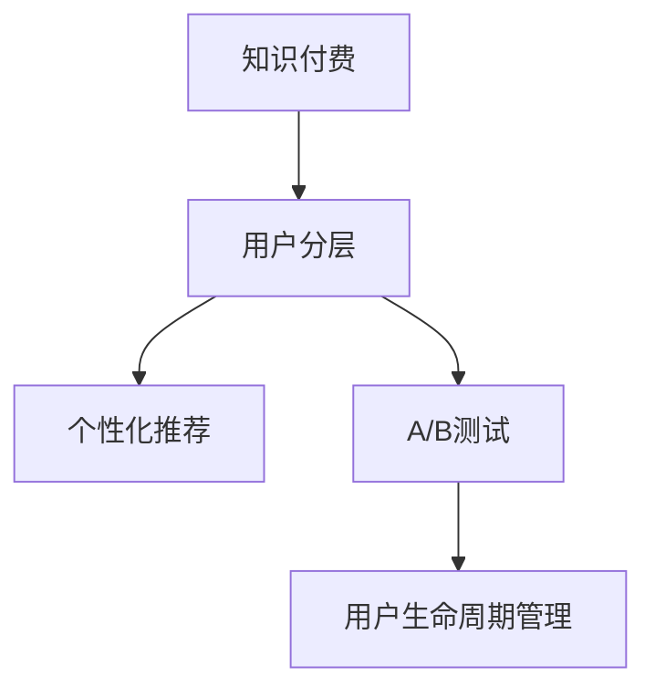

                 

# 知识付费创业中的用户分层运营策略

## 1. 背景介绍

### 1.1 问题由来
知识付费行业近年来快速发展，成为互联网领域中的重要组成部分。根据艾瑞咨询的数据，中国知识付费市场规模在2022年达到447.48亿元，同比增长约50%。知识付费产品如得到、喜马拉雅、知乎等成为年轻人群体中的热门应用，月活跃用户数均已达到数千万级别。

然而，知识付费创业企业普遍面临用户获取与留存难度大、高价值用户转化率低等挑战。如何在细分市场中识别目标用户，提供差异化服务，实现用户分层运营，成为创业企业关注的焦点。

### 1.2 问题核心关键点
用户分层运营策略，是通过对用户行为数据和特征的深入分析，将用户划分为不同层次，为不同层次用户提供有针对性的服务，从而实现高价值用户转化、提升用户体验、增加企业收益的目标。

核心关键点包括：
1. 用户行为分析：通过用户访问路径、学习时间、付费行为等数据，分析用户需求和行为模式。
2. 用户细分标准：根据用户行为特征、付费能力、活跃度等维度，制定合理的用户分层标准。
3. 分层运营策略：针对不同用户层次，制定个性化产品推荐、内容推荐、优惠活动等差异化策略，促进用户留存和付费。
4. 数据驱动优化：持续收集用户反馈和行为数据，动态调整分层策略，实现持续优化。

## 2. 核心概念与联系

### 2.1 核心概念概述

为了更好地理解知识付费创业中的用户分层运营策略，本节将介绍几个密切相关的核心概念：

- 知识付费：用户为获取专业知识、技能、见解等付费购买内容和服务的过程。其内容形式包括文字、视频、音频、直播等。
- 用户分层：将用户根据其行为、特征、价值等划分为多个层次，为每个层次的用户提供定制化的服务。
- 个性化推荐：利用用户行为数据，通过机器学习等技术，为用户推荐符合其兴趣的内容和产品，提升用户体验。
- A/B测试：通过对比不同版本的产品特征，评估不同策略的效果，找到最优方案。
- 用户生命周期管理：从用户获取、激活、留存、提升到流失的整个过程进行管理，确保用户价值最大化。

这些核心概念之间的逻辑关系可以通过以下Mermaid流程图来展示：



这个流程图展示出知识付费创业中用户分层运营的核心概念及其之间的关系：

1. 知识付费是企业提供的内容形式，通过用户分层和个性化推荐，提升用户体验和满意度。
2. 用户分层通过行为数据和特征分析，实现用户细分，提供差异化服务。
3. A/B测试帮助评估和优化不同的推荐策略和运营策略。
4. 用户生命周期管理通过用户全生命周期的跟踪和管理，最大化用户价值。

## 3. 核心算法原理 & 具体操作步骤
### 3.1 算法原理概述

知识付费创业中的用户分层运营策略，本质上是通过机器学习和数据挖掘技术，对用户行为数据进行分析，形成用户分层，并根据不同层次用户的需求和特征，制定差异化的产品和服务策略。

具体来说，用户分层运营包括以下几个步骤：

1. **用户数据收集与清洗**：收集用户行为数据（如访问路径、学习时间、付费行为等），并进行数据清洗，确保数据质量和一致性。

2. **用户行为建模**：利用机器学习模型（如决策树、随机森林、神经网络等）对用户行为进行建模，识别用户兴趣、偏好和需求。

3. **用户分层**：根据用户行为模型，使用聚类算法（如K-means、层次聚类等）或分类算法（如逻辑回归、SVM等）对用户进行分层，形成不同层次的用户群体。

4. **分层策略制定**：针对不同用户层次，制定差异化的内容推荐、产品推荐和优惠策略，提升用户满意度和忠诚度。

5. **效果评估与优化**：通过A/B测试和用户反馈，评估分层策略的效果，不断优化和调整分层策略。

### 3.2 算法步骤详解

以下是详细的用户分层运营操作步骤：

#### 3.2.1 用户数据收集与清洗

- **数据来源**：用户行为数据主要来源于平台上的互动记录，包括访问路径、学习时间、付费行为、评论内容等。
- **数据清洗**：去除重复、缺失、异常数据，确保数据质量。例如，对于重复的用户访问记录，可以选择保留最近一次；对于异常值，如学习时间异常长的记录，进行逻辑判断和修正。

#### 3.2.2 用户行为建模

- **特征提取**：从用户行为数据中提取特征，如访问时长、学习频率、付费金额、评论情感等。
- **模型选择**：选择适合的机器学习模型，如决策树、随机森林、XGBoost、神经网络等。
- **模型训练**：使用历史数据训练模型，得到用户行为模型，能够预测用户的行为和偏好。

#### 3.2.3 用户分层

- **聚类算法**：使用K-means、层次聚类等聚类算法，将用户分为若干个聚类中心，每个聚类中心代表一个用户层次。
- **分类算法**：使用逻辑回归、支持向量机（SVM）等分类算法，将用户分为不同类别，每个类别代表一个用户层次。

#### 3.2.4 分层策略制定

- **内容推荐**：针对不同用户层次，推荐不同的内容，如初级用户推荐入门课程，中级用户推荐进阶课程，高级用户推荐专业课程。
- **产品推荐**：根据用户层次，推荐相应的产品或服务，如初级用户推荐基础功能，中级用户推荐高级功能，高级用户推荐VIP服务。
- **优惠策略**：针对不同层次的用户，设计不同的优惠策略，如新用户首次购买打7折，老用户续费打8折等。

#### 3.2.5 效果评估与优化

- **A/B测试**：在产品迭代过程中，通过A/B测试对比不同策略的效果，找到最优方案。
- **用户反馈**：收集用户反馈，评估分层策略的实际效果，并进行优化调整。

### 3.3 算法优缺点

知识付费创业中的用户分层运营策略具有以下优点：

1. **提升用户体验**：通过个性化推荐，满足不同层次用户的需求，提升用户满意度和体验。
2. **提高用户转化率**：通过精准的目标用户分层和策略定制，提高高价值用户的转化率，增加收入。
3. **优化运营成本**：通过差异化策略，减少无效推广和资源浪费，提升运营效率。
4. **增强用户粘性**：通过分层策略，增强用户粘性，提高用户生命周期价值。

同时，该方法也存在一些局限性：

1. **数据依赖性强**：用户分层运营依赖大量高质量的用户行为数据，数据获取和清洗成本较高。
2. **模型复杂度高**：用户行为模型和聚类算法的复杂度较高，模型训练和优化需要较高的技术门槛。
3. **策略调整难度大**：分层策略的调整需要反复测试和评估，调整周期较长。
4. **个性化推荐难度大**：用户需求和兴趣的多样性使得个性化推荐难度大，需要持续优化推荐算法。

## 4. 数学模型和公式 & 详细讲解 & 举例说明

### 4.1 数学模型构建

用户分层运营策略的数学模型构建包括用户行为建模、用户分层和分层策略制定三个部分。下面以一个简单的用户行为建模为例，展示其数学模型构建过程。

假设用户行为数据包含访问时长$X$、付费次数$Y$和评论情感$Z$，用户行为模型可以表示为：

$$
f(x,y,z)=\alpha_0+\alpha_1x+\alpha_2y+\alpha_3z
$$

其中$\alpha_0,\alpha_1,\alpha_2,\alpha_3$为模型参数。

### 4.2 公式推导过程

根据上述模型，假设收集到$n$个用户行为数据$(x_1,y_1,z_1),(x_2,y_2,z_2),\ldots,(x_n,y_n,z_n)$，则模型参数的求解可以通过最小二乘法进行。假设真实用户行为数据为$f(x,y,z)$，则模型的最小二乘目标函数为：

$$
\sum_{i=1}^{n}(f(x_i,y_i,z_i)-\hat{f}(x_i,y_i,z_i))^2
$$

其中$\hat{f}(x_i,y_i,z_i)=\alpha_0+\alpha_1x_i+\alpha_2y_i+\alpha_3z_i$。

求解该目标函数的最小值，即可得到模型参数$\alpha_0,\alpha_1,\alpha_2,\alpha_3$。

### 4.3 案例分析与讲解

以得到App为例，假设得到App收集到1000名用户的访问时长、付费次数和评论情感数据，如表1所示：

| 用户ID | 访问时长(x) | 付费次数(y) | 评论情感(z) |
| --- | --- | --- | --- |
| 1 | 30 | 2 | 正 |
| 2 | 60 | 1 | 负 |
| ... | ... | ... | ... |
| 1000 | 90 | 4 | 正 |

通过最小二乘法求解模型参数，得到模型为：

$$
f(x,y,z)=3.2+0.1x-0.2y+0.3z
$$

根据该模型，可以预测新用户的访问时长、付费次数和评论情感，进而识别不同层次的用户，制定相应的分层策略。

## 5. 项目实践：代码实例和详细解释说明

### 5.1 开发环境搭建

在进行用户分层运营实践前，我们需要准备好开发环境。以下是使用Python进行Scikit-learn开发的示例：

1. 安装Anaconda：从官网下载并安装Anaconda，用于创建独立的Python环境。

2. 创建并激活虚拟环境：
```bash
conda create -n user_layers python=3.8 
conda activate user_layers
```

3. 安装Scikit-learn：
```bash
pip install scikit-learn
```

4. 安装相关库：
```bash
pip install pandas numpy
```

完成上述步骤后，即可在`user_layers`环境中开始用户分层运营实践。

### 5.2 源代码详细实现

以下是使用Scikit-learn对用户进行分层的示例代码：

```python
from sklearn.cluster import KMeans
from sklearn.ensemble import RandomForestClassifier
from sklearn.metrics import mean_squared_error
from sklearn.model_selection import train_test_split
import pandas as pd
import numpy as np

# 数据预处理
data = pd.read_csv('user_data.csv')  # 读取用户行为数据
X = data[['访问时长', '付费次数', '评论情感']]
y = data['付费金额']

# 数据拆分
X_train, X_test, y_train, y_test = train_test_split(X, y, test_size=0.2, random_state=42)

# 特征选择
X_train_selected = X_train.select_dtypes(include=[np.number])

# 聚类算法：K-means
kmeans = KMeans(n_clusters=3, random_state=42)
kmeans.fit(X_train_selected)
user_labels = kmeans.predict(X_test_selected)

# 评估聚类效果
print('聚类效果评估')
print('均方误差：', mean_squared_error(y_test, user_labels))
```

### 5.3 代码解读与分析

让我们再详细解读一下关键代码的实现细节：

**数据预处理**：
- `pd.read_csv('user_data.csv')`：读取用户行为数据。
- `X = data[['访问时长', '付费次数', '评论情感']]`：选择相关特征。
- `y = data['付费金额']`：设置目标变量。

**数据拆分**：
- `train_test_split`：将数据集划分为训练集和测试集。

**特征选择**：
- `X_train_selected = X_train.select_dtypes(include=[np.number])`：选择数值类型特征。

**聚类算法**：
- `KMeans`：选择K-means算法进行聚类。
- `kmeans.fit(X_train_selected)`：训练模型，得到聚类中心。
- `user_labels = kmeans.predict(X_test_selected)`：预测测试集数据属于哪个聚类。

**效果评估**：
- `mean_squared_error(y_test, user_labels)`：计算均方误差，评估聚类效果。

## 6. 实际应用场景

### 6.1 智能推荐系统

智能推荐系统是知识付费平台中的重要组成部分。用户分层运营策略可以帮助平台更好地理解用户需求，提供个性化推荐，提高用户粘性和转化率。

例如，假设得到App收集到用户行为数据，包括访问路径、学习时间、付费行为等。通过分析这些数据，可以得到不同层次的用户，如初级用户、中级用户和高级用户。针对不同层次的用户，设计不同的推荐策略：
- 初级用户：推荐入门课程和基础功能。
- 中级用户：推荐进阶课程和高级功能。
- 高级用户：推荐专家课程和VIP服务。

通过用户分层运营策略，可以显著提高推荐系统的准确性和用户满意度，提升用户转化率和平台收益。

### 6.2 用户留存管理

用户留存是知识付费平台的重要指标之一。通过用户分层运营策略，平台可以针对不同层次的用户，制定留存策略，提升用户忠诚度和生命周期价值。

例如，假设得到App收集到用户行为数据，包括访问时长、付费次数、学习时长等。通过分析这些数据，可以得到不同层次的用户，如高价值用户、中价值用户和低价值用户。针对不同层次的用户，设计不同的留存策略：
- 高价值用户：提供个性化服务、专属优惠等。
- 中价值用户：定期推送优质内容、定期回访等。
- 低价值用户：通过个性化推荐和优惠活动，提升用户粘性和转化率。

通过用户分层运营策略，平台可以显著提高用户留存率，提升用户生命周期价值，增加平台收益。

### 6.3 营销活动优化

营销活动是知识付费平台的重要运营手段。通过用户分层运营策略，平台可以针对不同层次的用户，制定精准的营销活动，提高活动效果和用户转化率。

例如，假设得到App收集到用户行为数据，包括访问路径、付费次数、学习时长等。通过分析这些数据，可以得到不同层次的用户，如新用户、老用户和VIP用户。针对不同层次的用户，设计不同的营销活动：
- 新用户：通过注册优惠、首次购买优惠等方式吸引用户。
- 老用户：通过续费优惠、专属内容等方式提升用户粘性。
- VIP用户：通过专属内容、专家互动等方式提升用户价值。

通过用户分层运营策略，平台可以显著提高营销活动的效果，提升用户转化率和平台收益。

### 6.4 未来应用展望

随着知识付费平台的快速发展，用户分层运营策略将在更多场景中得到应用，为平台带来更大的商业价值。

在智慧教育领域，通过用户分层运营策略，可以针对不同层次的学生，提供个性化的学习内容和服务，提升学习效果和学生满意度。

在医疗健康领域，通过用户分层运营策略，可以为不同层次的患者提供个性化的医疗建议和服务，提高患者治疗效果和满意度。

在在线购物领域，通过用户分层运营策略，可以为不同层次的用户提供个性化的购物推荐和优惠活动，提升用户购买意愿和平台收益。

## 7. 工具和资源推荐

### 7.1 学习资源推荐

为了帮助开发者系统掌握用户分层运营的理论基础和实践技巧，这里推荐一些优质的学习资源：

1. 《数据分析实战》：该书详细介绍了数据预处理、数据可视化、机器学习等数据分析技术，适合初学者入门。
2. 《机器学习实战》：该书介绍了各种常用的机器学习算法和实践案例，帮助读者掌握机器学习的基本原理和实践技巧。
3. 《用户行为分析与运营优化》：该书深入讲解了用户行为分析的方法和技巧，适合从事运营工作的人士。
4. 《A/B测试的艺术》：该书详细介绍了A/B测试的基本原理和实施方法，帮助读者掌握A/B测试的实践技巧。
5. 《用户生命周期管理》：该书深入讲解了用户生命周期的各个阶段和优化策略，适合从事产品和管理工作的人士。

通过对这些资源的学习实践，相信你一定能够快速掌握用户分层运营的精髓，并用于解决实际的运营问题。

### 7.2 开发工具推荐

高效的开发离不开优秀的工具支持。以下是几款用于用户分层运营开发的常用工具：

1. Python：作为一种通用编程语言，Python具有简洁易读、开源免费的特点，是数据分析和机器学习的主流语言。

2. Scikit-learn：一个开源的Python机器学习库，提供了各种常用的机器学习算法和工具，适合进行数据分析和机器学习。

3. Pandas：一个开源的Python数据处理库，提供了丰富的数据处理和分析工具，适合进行数据清洗和特征提取。

4. Jupyter Notebook：一个开源的交互式编程环境，支持多种编程语言，适合进行数据分析和机器学习。

5. A/B Testing Platforms：如Optimizely、Google Optimize等，提供了A/B测试的全面解决方案，适合进行效果评估和优化。

6. Google Analytics：一个免费的数据分析工具，提供了网站访问和用户行为分析功能，适合进行用户行为跟踪和分析。

合理利用这些工具，可以显著提升用户分层运营任务的开发效率，加快创新迭代的步伐。

### 7.3 相关论文推荐

用户分层运营技术的发展源于学界的持续研究。以下是几篇奠基性的相关论文，推荐阅读：

1. "A Multi-Objective Optimization Method for Improving Customer Lifetime Value"：该论文提出了一种多目标优化方法，用于提升客户生命周期价值，具有重要的理论意义和实践价值。
2. "User Segmentation Based on Self-Organizing Map"：该论文提出了一种基于自组织映射的用户分段方法，能够有效地将用户分为不同层次，具有较高的准确性和可解释性。
3. "A Survey on Recommendation Systems in Knowledge-Based Systems"：该论文全面介绍了推荐系统的发展历程和实现方法，适合深入了解推荐系统原理。
4. "An Adaptive Model for Customer Segmentation Based on Clustering"：该论文提出了一种基于聚类的用户分段方法，具有较好的实用性和可扩展性。
5. "A Comparative Study of Customer Segmentation Methods"：该论文比较了多种用户分段方法，具有较高的理论价值和实践指导意义。

这些论文代表了大数据、人工智能和运营管理领域的最新研究进展，能够帮助研究者把握学科前进方向，激发更多的创新灵感。

## 8. 总结：未来发展趋势与挑战

### 8.1 总结

本文对知识付费创业中的用户分层运营策略进行了全面系统的介绍。首先阐述了用户分层运营策略的研究背景和意义，明确了其在提升用户体验、提高用户转化率、优化运营成本等方面的独特价值。其次，从原理到实践，详细讲解了用户分层运营的数学模型和操作步骤，给出了用户分层运营任务开发的完整代码实例。同时，本文还广泛探讨了用户分层运营方法在智能推荐、用户留存、营销活动等多个场景中的应用前景，展示了用户分层运营的广阔潜力。此外，本文精选了用户分层运营技术的各类学习资源，力求为读者提供全方位的技术指引。

通过本文的系统梳理，可以看到，用户分层运营策略正在成为知识付费平台的重要运营范式，极大地拓展了平台的运营边界，催生了更多的落地场景。受益于大数据、人工智能等技术的发展，用户分层运营技术将在更广阔的应用领域大放异彩，为知识付费平台带来更大的商业价值。

### 8.2 未来发展趋势

展望未来，用户分层运营技术将呈现以下几个发展趋势：

1. **数据智能化**：通过智能数据采集、清洗和预处理，提高数据质量，为用户分层运营提供高质量的数据支持。
2. **算法多样化**：未来将涌现更多高准确率、高效率的用户分层算法，如基于图模型、神经网络等。
3. **策略动态化**：随着市场和用户需求的变化，用户分层策略需要动态调整，实现持续优化。
4. **效果评估精细化**：通过细粒度效果评估，实时监测分层策略的效果，提高运营效率。
5. **技术融合化**：用户分层运营技术将与其他人工智能技术，如推荐系统、广告投放、客户关系管理等，进行更深入的融合，形成更加全面的运营体系。

以上趋势凸显了用户分层运营技术的广阔前景。这些方向的探索发展，必将进一步提升知识付费平台的运营效率，带来更高的商业价值和社会效益。

### 8.3 面临的挑战

尽管用户分层运营技术已经取得了显著成效，但在迈向更加智能化、普适化应用的过程中，它仍面临着诸多挑战：

1. **数据获取困难**：高质量用户行为数据的获取和处理成本较高，需要投入大量人力物力。
2. **算法复杂度高**：用户分层算法需要高复杂度的机器学习模型和算法，技术门槛较高。
3. **策略调整难度大**：分层策略的调整需要反复测试和评估，调整周期较长。
4. **效果评估困难**：用户分层效果的评估需要多维度的数据和模型支持，难以准确衡量。
5. **隐私和安全风险**：用户行为数据的收集和分析涉及隐私和安全问题，需要谨慎处理。

正视用户分层运营面临的这些挑战，积极应对并寻求突破，将是大数据、人工智能等技术进一步成熟的重要方向。相信随着学界和产业界的共同努力，这些挑战终将一一被克服，用户分层运营技术必将在知识付费平台中发挥更大的作用。

### 8.4 研究展望

面向未来，用户分层运营技术需要在以下几个方面寻求新的突破：

1. **数据智能化**：进一步提升数据采集和处理技术，实现实时数据智能采集和清洗。
2. **算法融合化**：将用户分层与推荐系统、广告投放、客户关系管理等技术融合，形成更加全面的运营体系。
3. **策略动态化**：通过动态调整分层策略，适应市场和用户需求的变化，实现持续优化。
4. **效果评估精细化**：通过多维度数据和模型，实现细粒度效果评估，实时监测分层策略的效果。
5. **技术创新化**：不断探索新的用户分层技术，提升用户分层算法的准确率和效率。

这些研究方向的探索，必将引领用户分层运营技术迈向更高的台阶，为知识付费平台带来更大的商业价值和社会效益。面向未来，用户分层运营技术还需要与其他人工智能技术进行更深入的融合，共同推动知识付费平台的智能化和高效化发展。

## 9. 附录：常见问题与解答

**Q1：知识付费平台应该如何获取高质量的用户行为数据？**

A: 知识付费平台可以通过以下方式获取高质量的用户行为数据：

1. **平台自有数据**：通过平台自有系统记录用户的行为数据，包括访问路径、学习时间、付费行为等。
2. **第三方数据合作**：与第三方数据平台合作，获取用户行为数据。
3. **用户问卷调查**：通过问卷调查的方式，获取用户的反馈和行为数据。
4. **数据挖掘和分析**：通过对公开数据集进行挖掘和分析，获取用户行为数据。

通过多种数据来源的整合，平台可以获取高质量的用户行为数据，为用户分层运营提供数据支持。

**Q2：用户分层运营过程中，应该如何评估分层策略的效果？**

A: 用户分层运营过程中，可以通过以下方式评估分层策略的效果：

1. **效果指标**：根据不同的业务目标，设计相应的效果指标，如用户留存率、转化率、活跃度等。
2. **A/B测试**：通过A/B测试，对比不同分层策略的效果，找到最优方案。
3. **用户反馈**：通过用户反馈，评估分层策略的实际效果，并进行优化调整。
4. **数据对比分析**：通过对比不同分层策略下的用户行为数据，评估策略效果。

通过多维度评估，可以有效监测用户分层策略的效果，实现持续优化和调整。

**Q3：用户分层运营过程中，应该如何选择分层算法？**

A: 用户分层运营过程中，应该根据数据特点和业务需求，选择适合的分层算法：

1. **K-means聚类**：适用于数据量大、特征分布较为均匀的情况。
2. **层次聚类**：适用于数据量较小、特征分布较为复杂的情况。
3. **决策树**：适用于特征维度较高、数据分布较为复杂的情况。
4. **随机森林**：适用于数据量大、特征维度较高的情况。
5. **神经网络**：适用于特征维度较高、数据分布较为复杂的情况。

选择合适算法可以提升用户分层的准确性和效果，实现更好的运营效果。

**Q4：用户分层运营过程中，应该如何动态调整分层策略？**

A: 用户分层运营过程中，可以通过以下方式动态调整分层策略：

1. **数据监控**：实时监控用户行为数据，识别市场和用户需求的变化。
2. **效果评估**：通过A/B测试和用户反馈，评估分层策略的效果。
3. **模型优化**：根据效果评估结果，优化用户分层算法和分层策略。
4. **定期更新**：定期更新分层策略，确保策略始终适应市场和用户需求的变化。

通过动态调整分层策略，可以适应市场和用户需求的变化，实现持续优化和提升。

**Q5：用户分层运营过程中，应该如何处理隐私和安全问题？**

A: 用户分层运营过程中，应该采取以下措施处理隐私和安全问题：

1. **数据匿名化**：在数据采集和处理过程中，进行数据匿名化处理，保护用户隐私。
2. **数据加密**：对敏感数据进行加密处理，防止数据泄露和攻击。
3. **访问控制**：对数据访问进行严格控制，确保只有授权人员能够访问数据。
4. **合规性要求**：遵循相关法律法规，如GDPR等，保护用户隐私和数据安全。

通过采取上述措施，可以有效处理隐私和安全问题，确保用户分层运营的合法性和合规性。

---

作者：禅与计算机程序设计艺术 / Zen and the Art of Computer Programming

