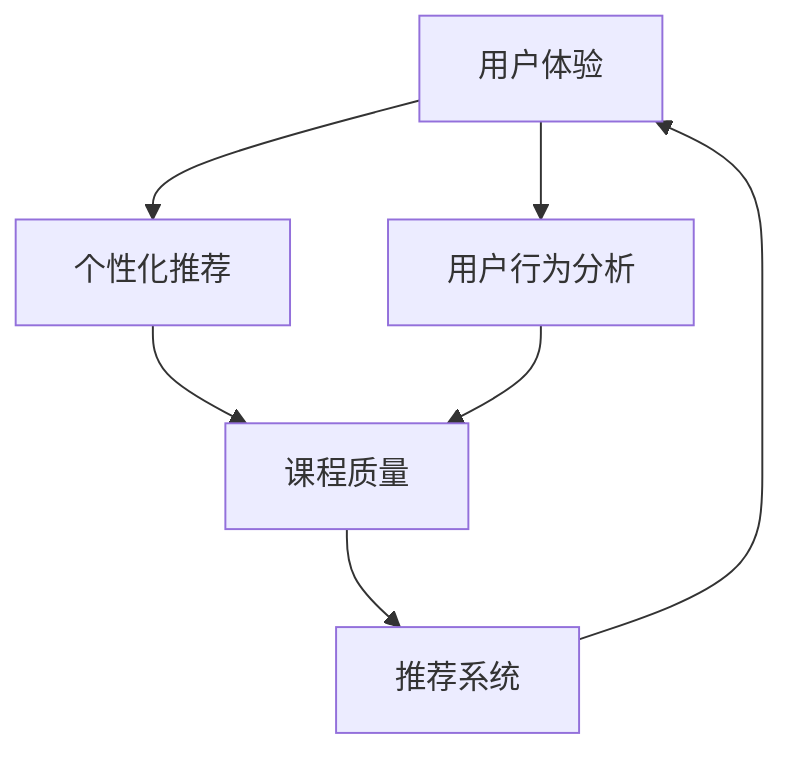

                 

# 知识付费创业中的用户转化策略

> 关键词：知识付费,用户转化,教育科技,用户行为分析,推荐系统,个性化推荐

## 1. 背景介绍

随着互联网和信息技术的不断进步，知识付费逐渐成为了一个热门领域。越来越多的人选择在线学习，以满足个人成长和职业发展的需求。在这样的背景下，教育科技(EdTech)公司如雨后春笋般涌现，旨在通过高质量的教育内容和智能化的学习平台，为用户提供定制化的学习服务。

然而，尽管内容质量得到了显著提升，用户转化率仍然是教育科技公司面临的一个重大挑战。如何有效引导用户从注册到付费，乃至完成课程，成为了教育科技公司必须回答的核心问题。本文将从用户转化策略的角度，探讨知识付费创业中的一些关键问题。

## 2. 核心概念与联系

### 2.1 核心概念概述

在教育科技领域，用户转化指的是将潜在用户转变为付费用户的全过程，包括注册、登陆、购买、课程完成等多个阶段。一个成功的用户转化策略需要全面考虑用户体验、个性化推荐、课程质量、售后服务等多方面因素，形成闭环式的用户体验体系。

以下是对几个核心概念的简要介绍：

- **用户体验**：通过优化产品的界面设计、交互逻辑、内容呈现等方式，提高用户的使用体验，增加用户粘性。
- **个性化推荐**：利用数据分析和机器学习技术，为用户提供符合其兴趣和需求的学习内容和课程推荐，提高用户的满意度和转化率。
- **课程质量**：保障课程内容的深度、宽度、广度，符合用户的学习预期和需求，是用户转化的基础。
- **用户行为分析**：通过收集和分析用户行为数据，洞察用户的购买偏好、学习习惯等，优化产品策略，提升用户转化率。
- **推荐系统**：基于用户行为和兴趣数据，自动推荐相关课程和学习内容，提升用户体验和转化率。

### 2.2 核心概念原理和架构的 Mermaid 流程图(Mermaid 流程节点中不要有括号、逗号等特殊字符)



这个流程图展示了用户体验、个性化推荐、课程质量、用户行为分析和推荐系统之间的联系。首先，用户通过体验产品获得良好的印象，这会促使他们进行深入了解。接着，个性化推荐系统根据用户行为，向用户推荐相关课程，提升用户满意度和转化率。同时，课程质量作为核心，直接影响用户是否继续购买。最后，推荐系统通过数据分析进一步优化课程推荐，形成闭环。

## 3. 核心算法原理 & 具体操作步骤

### 3.1 算法原理概述

用户转化的算法原理主要基于机器学习和数据挖掘技术，通过分析用户行为数据，预测用户是否可能转化为付费用户。常用的方法包括协同过滤、矩阵分解、深度学习等。

- **协同过滤**：基于用户之间的相似度，推荐其他用户喜欢的课程。
- **矩阵分解**：通过分解用户-课程评分矩阵，预测用户对未评分课程的评分，进而推荐相关课程。
- **深度学习**：使用神经网络等深度学习模型，根据用户行为数据和课程特征，预测用户是否会购买课程。

### 3.2 算法步骤详解

以下是一个基本的用户转化算法步骤：

1. **数据收集**：收集用户的行为数据，如访问页面次数、停留时间、浏览课程内容、购买记录等。
2. **特征工程**：从收集的数据中提取有意义的特征，如用户活跃度、课程难度、课程评价等。
3. **模型训练**：使用机器学习算法训练模型，预测用户是否会购买课程。
4. **模型评估**：使用交叉验证等方法评估模型的预测准确度。
5. **预测和推荐**：将模型应用于新用户的行为数据，预测其是否会购买课程，并根据预测结果进行个性化推荐。

### 3.3 算法优缺点

- **优点**：
  - 数据驱动：通过分析用户行为数据，可以精准预测用户是否会购买课程。
  - 个性化推荐：能够根据用户兴趣和需求，推荐相关课程，提高用户满意度和转化率。
  - 可扩展性：算法可以随着数据量和用户规模的增加不断优化。

- **缺点**：
  - 数据隐私：需要收集大量的用户数据，存在隐私泄露的风险。
  - 模型复杂性：深度学习模型需要较大的计算资源和数据量。
  - 泛化能力：模型可能会过拟合训练数据，导致预测结果不适用于新数据。

### 3.4 算法应用领域

用户转化算法不仅适用于知识付费领域，还可以应用于电商、在线广告、社交网络等多个领域。例如：

- **电商**：根据用户浏览和购买记录，推荐相关商品。
- **在线广告**：预测用户是否会点击广告，优化广告投放策略。
- **社交网络**：推荐用户可能感兴趣的内容，提升用户活跃度。

## 4. 数学模型和公式 & 详细讲解 & 举例说明

### 4.1 数学模型构建

假设用户有$U$个，课程有$C$个，用户对课程的评分有$R_{uc}$表示，其中$u$为用户，$c$为课程。我们的目标是预测用户$u$是否会购买课程$c$，建立如下的二分类模型：

$$
y_{uc} = f(x_{uc}, w)
$$

其中$y_{uc} \in \{0, 1\}$表示用户$u$是否购买了课程$c$，$x_{uc} \in \mathbb{R}^n$为特征向量，$w \in \mathbb{R}^n$为模型参数。

### 4.2 公式推导过程

我们以矩阵分解为例，进行详细推导。假设用户和课程的评分矩阵为$M_{UC}$，将其分解为两个矩阵$P_U$和$Q_C$的乘积，即：

$$
M_{UC} = P_U Q_C^T
$$

其中$P_U$为$U \times K$的矩阵，$Q_C$为$C \times K$的矩阵，$K$为分解后的维度。用户$u$对课程$c$的评分可以表示为：

$$
y_{uc} = \langle P_U^u, Q_C^c \rangle = \sum_{k=1}^K P_{uk}Q_{ck}
$$

通过最大化$y_{uc}$来预测用户$u$是否购买课程$c$，得到预测结果：

$$
\hat{y_{uc}} = \text{sigmoid}(\sum_{k=1}^K P_{uk}Q_{ck})
$$

其中$\text{sigmoid}$为逻辑回归函数。

### 4.3 案例分析与讲解

假设我们有一个电商平台，收集了用户$U$和商品$C$的评分数据，使用矩阵分解的方法预测用户是否购买商品。首先，我们需要将评分矩阵$M_{UC}$进行分解，得到$P_U$和$Q_C$。然后，对于新的用户$u$和商品$c$，计算预测结果$\hat{y_{uc}}$。如果$\hat{y_{uc}} > 0.5$，则认为用户$u$会购买商品$c$，反之则不会。

## 5. 项目实践：代码实例和详细解释说明

### 5.1 开发环境搭建

- **Python**：推荐使用Python 3.6及以上版本，可以使用Anaconda创建虚拟环境。
- **Scikit-learn**：用于机器学习模型的实现和评估。
- **Numpy**：用于数据处理和计算。
- **Pandas**：用于数据读写和预处理。

### 5.2 源代码详细实现

```python
import numpy as np
from sklearn.decomposition import NMF

# 假设我们有一个评分矩阵
M = np.array([
    [5, 3, 2, 4],
    [3, 5, 1, 2],
    [1, 2, 5, 3],
    [4, 3, 5, 1]
])

# 分解评分矩阵
nmf = NMF(n_components=2)
P, Q = nmf.fit_transform(M)

# 预测新用户对新商品是否购买
new_user = np.array([3, 4, 1, 5])
predicted = np.dot(P[new_user], Q.T)

# 输出预测结果
print(predicted)
```

### 5.3 代码解读与分析

上述代码实现了矩阵分解算法，用于预测用户是否购买商品。我们使用了scikit-learn库中的NMF算法进行分解，得到用户和商品的低维表示。然后，根据预测结果，判断新用户对新商品是否会购买。

## 6. 实际应用场景

### 6.1 智能推荐系统

智能推荐系统是用户转化的重要组成部分。通过分析用户行为数据，推荐系统能够提供个性化的课程和学习内容，提升用户体验和转化率。例如，B站根据用户的观看历史和点赞记录，推荐相关视频和up主，提升用户粘性和付费意愿。

### 6.2 个性化学习路径

个性化学习路径为用户提供了定制化的学习方案，帮助用户更好地掌握知识。例如，Coursera根据用户的学习进度和考试成绩，推荐适合的课程和习题，提升学习效果和转化率。

### 6.3 社交网络互动

在社交网络中，用户之间的互动也能促进转化。例如，LinkedIn根据用户之间的联系和互动，推荐相关职位和文章，提升用户活跃度和转化率。

### 6.4 未来应用展望

未来，随着大数据和人工智能技术的发展，用户转化算法将更加智能化和高效化。例如：

- **深度学习**：使用深度学习模型，提高预测准确度和个性化推荐效果。
- **多模态数据**：结合视频、音频等多模态数据，提升用户转化的精准性。
- **实时预测**：实时分析用户行为数据，动态调整推荐策略，提升转化率。

## 7. 工具和资源推荐

### 7.1 学习资源推荐

- **Coursera**：提供大量在线课程，涵盖数据科学、机器学习等多个领域，适合初学者入门。
- **Kaggle**：数据科学竞赛平台，可以参与实际项目，提升实践能力。
- **GitHub**：开源代码库，可以学习优秀的推荐系统实现和应用案例。

### 7.2 开发工具推荐

- **Jupyter Notebook**：交互式编程环境，适合数据处理和模型调试。
- **TensorFlow**：深度学习框架，适合实现复杂的深度学习模型。
- **PyTorch**：深度学习框架，适合快速迭代和实验。

### 7.3 相关论文推荐

- **Collaborative Filtering for Implicit Feedback Datasets**：介绍协同过滤算法的基本原理和实现方法。
- **Matrix Factorization Techniques for Recommender Systems**：综述矩阵分解算法在推荐系统中的应用。
- **Deep Learning Recommendation Systems**：介绍深度学习在推荐系统中的应用，涵盖多种深度学习模型。

## 8. 总结：未来发展趋势与挑战

### 8.1 研究成果总结

用户转化算法在知识付费创业中发挥了重要作用，通过分析用户行为数据，提升个性化推荐效果，提高用户满意度和转化率。当前，深度学习技术在推荐系统中的应用，已取得显著成果。

### 8.2 未来发展趋势

未来，用户转化算法将更加智能化和高效化，结合多模态数据和实时预测，提升转化率和用户体验。深度学习技术将继续发挥重要作用，推动推荐系统的发展。

### 8.3 面临的挑战

尽管用户转化算法取得了显著进展，但仍然面临以下挑战：

- **数据隐私**：用户数据的收集和存储，存在隐私泄露的风险。
- **模型复杂性**：深度学习模型的训练和部署需要较大的计算资源。
- **可解释性**：模型决策过程的黑盒化，难以解释用户推荐结果的来源。

### 8.4 研究展望

未来的研究方向包括：

- **隐私保护**：研究数据隐私保护技术，确保用户数据的安全。
- **可解释性**：开发可解释的推荐模型，提升用户信任度。
- **多模态数据融合**：结合视频、音频等多模态数据，提升推荐效果。

## 9. 附录：常见问题与解答

**Q1：如何提高推荐系统的个性化程度？**

A: 提高推荐系统的个性化程度，需要从以下几个方面入手：

- **特征工程**：提取有意义的特征，如用户历史行为、兴趣标签等，提升模型的预测准确度。
- **模型优化**：选择适合的数据和特征，优化推荐算法，提升推荐效果。
- **多维度数据融合**：结合用户历史数据、实时数据、社交网络数据等多维度数据，提升推荐系统的精准度。

**Q2：推荐系统如何避免冷启动问题？**

A: 冷启动问题是指新用户或新商品加入推荐系统时，由于缺乏历史数据，推荐效果不佳。以下是一些应对冷启动问题的方法：

- **基于内容的推荐**：根据商品属性和用户标签，推荐相关商品。
- **基于用户兴趣的推荐**：通过用户行为数据，推测用户兴趣，推荐相关商品。
- **社交网络推荐**：利用用户之间的社交关系，推荐相关商品。

**Q3：推荐系统如何提升实时性？**

A: 提升推荐系统的实时性，需要从以下几个方面入手：

- **数据实时更新**：实时更新用户行为数据，动态调整推荐策略。
- **模型实时训练**：使用在线学习算法，实时更新模型参数，提升预测准确度。
- **缓存机制**：使用缓存机制，减少数据查询和模型计算的时间，提升推荐速度。

**Q4：推荐系统如何处理数据稀疏性问题？**

A: 推荐系统通常面临数据稀疏性问题，即用户和商品的评分数据较少。以下是一些应对数据稀疏性问题的方法：

- **矩阵补全**：利用矩阵补全算法，填补缺失的评分数据，提升推荐效果。
- **协同过滤**：使用协同过滤算法，利用用户之间的相似度，推荐相关商品。
- **混合推荐**：结合基于内容的推荐和协同过滤推荐，提升推荐效果。

通过解决这些常见问题，可以进一步提升推荐系统的性能和用户体验，实现更高的用户转化率。

