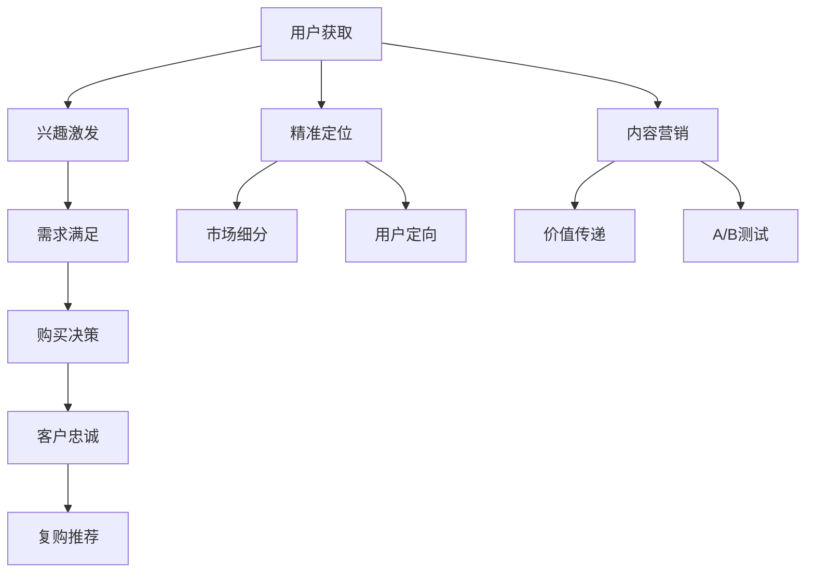

                 

# 知识付费创业中的用户转化策略

> 关键词：知识付费、用户转化、内容营销、精准定位、A/B测试、客户忠诚度、价值主张、用户体验

## 1. 背景介绍

随着互联网技术的飞速发展，知识付费成为新兴的商业模式，逐渐成为连接知识创作者与消费者的桥梁。尤其是在信息爆炸的时代，知识的获取和利用变得愈加高效和便捷，用户对高质量知识的渴求日益高涨。而知识付费平台正是顺应这一趋势应运而生，通过订阅、单次购买、会员制等方式，为消费者提供专业、系统、个性化的知识服务。

然而，尽管知识付费市场前景广阔，实际运营中用户转化却是一个巨大挑战。由于市场竞争激烈，用户选择众多，如何在海量信息中脱颖而出，将潜在用户转化为付费用户，成为了知识付费创业的关键问题。本文章将系统阐述知识付费创业中用户转化的策略，旨在帮助创业者构建高效的转化流程，提升用户满意度和忠诚度，实现业务增长。

## 2. 核心概念与联系

### 2.1 核心概念概述

**知识付费**：指的是用户为获取特定知识内容而支付费用的商业模式。平台或创作者通过提供深度、系统、专业的知识内容，满足用户获取知识的需求，从而实现商业价值。

**用户转化**：指的是将潜在用户转化为付费用户的过程。这一过程涉及用户获取、兴趣激发、需求满足、购买决策等多个环节。

**内容营销**：通过提供有价值的内容，吸引用户关注，提升用户对品牌的好感和信任度，进而促使转化。

**精准定位**：指通过数据分析和市场研究，准确识别目标用户的特征和需求，从而实现有效的市场细分和用户定向。

**A/B测试**：通过对比不同版本的页面或内容，评估哪个版本更优，从而进行产品优化。

**客户忠诚度**：指用户对品牌和产品的长期依赖和偏好，体现在复购率、推荐率、品牌忠诚度等方面。

**价值主张**：指的是平台或产品向用户传递的核心价值，包括独特性、稀缺性、便利性和成本效益等。

**用户体验**：指用户在使用产品或服务过程中，感受到的整体满意度和愉悦度。

这些概念相互联系，共同构成知识付费创业用户转化的整体框架。其中，精准定位和内容营销是吸引用户的关键，A/B测试是优化产品的重要手段，客户忠诚度和价值主张是提升转化率的基础，用户体验则是保障用户留存和复购的核心。

### 2.2 核心概念原理和架构的 Mermaid 流程图(Mermaid 流程节点中不要有括号、逗号等特殊字符)



这个流程图展示了用户转化全过程的逻辑关系。用户获取后，通过精准定位和内容营销激发其兴趣，满足其需求，并引导其做出购买决策。在转化过程中，不断提升客户忠诚度，并通过复购推荐等方式，增强用户粘性。

## 3. 核心算法原理 & 具体操作步骤

### 3.1 算法原理概述

知识付费用户转化策略的核心在于如何通过内容营销和精准定位，有效吸引和转化用户。这一过程涉及多个环节，包括用户获取、兴趣激发、需求满足和购买决策等。

### 3.2 算法步骤详解

**Step 1: 用户获取**

用户获取是转化的第一步。常见的用户获取方式包括：

- **搜索引擎优化(SEO)**：通过优化网站和内容，提升在搜索引擎中的排名，吸引潜在用户。
- **社交媒体营销**：利用社交平台如微信、微博、知乎等，通过内容推广、广告投放等方式吸引用户。
- **电子邮件营销**：通过发送高质量的电子邮件内容，吸引用户订阅或访问。
- **合作伙伴推荐**：与相关行业或领域的机构、企业进行合作，互相推荐用户。

**Step 2: 精准定位**

精准定位是用户转化的关键。常见的定位方式包括：

- **用户画像**：通过数据分析，构建目标用户的特征画像，包括年龄、性别、职业、兴趣、行为等。
- **市场细分**：将市场细分为多个子市场，识别最具潜力的细分市场。
- **用户定向**：通过精准的定向广告投放，将内容推送给潜在用户。

**Step 3: 内容营销**

内容营销是激发用户兴趣和满足用户需求的重要手段。常见的内容营销策略包括：

- **高质量内容**：提供深度、系统、专业的知识内容，满足用户知识获取的需求。
- **用户互动**：通过问答、讨论、社区等方式，增强用户与内容的互动，提升用户粘性。
- **内容推荐**：根据用户行为和偏好，推荐相关内容，提升用户浏览和停留时间。

**Step 4: 需求满足和购买决策**

需求满足和购买决策是用户转化的核心。常见的策略包括：

- **价值主张明确**：清晰地传达平台或产品的核心价值，如专业性、便利性、成本效益等。
- **价格策略合理**：根据用户需求和价值感知，制定合理的定价策略。
- **购买路径简化**：简化购买流程，降低购买门槛，提升用户体验。

**Step 5: 客户忠诚度提升**

客户忠诚度是长期转化的基础。常见的提升策略包括：

- **优质服务**：提供优质的客户服务和售后支持，增强用户满意度。
- **会员体系**：建立会员体系，提供会员专属权益，增强用户粘性。
- **推荐奖励**：通过推荐机制，鼓励用户分享和推荐，提升品牌影响力。

### 3.3 算法优缺点

精准定位和内容营销策略具有以下优点：

- **提升转化率**：通过精准定位和高质量内容，有效吸引和转化潜在用户。
- **提升用户体验**：用户能快速找到所需内容，满足需求，提升满意度。

但同时也存在一些缺点：

- **成本高**：精准定位和内容营销需要投入大量时间和资源，尤其是在用户获取初期。
- **效果不确定**：市场和用户行为变化快速，无法保证定位和内容的长期有效性。

A/B测试策略具有以下优点：

- **优化产品**：通过对比不同版本的页面或内容，找到最优方案，提升转化率。
- **数据驱动**：基于数据分析，客观评估不同策略的效果，提高决策准确性。

但同时也存在一些缺点：

- **实验周期长**：A/B测试需要较长时间才能完成，无法快速见效。
- **实验成本高**：需要投入大量资源进行实验设计和实施。

客户忠诚度策略具有以下优点：

- **提升复购率**：通过优质服务和会员体系，增强用户粘性，提升复购率。
- **提升品牌影响力**：用户推荐和分享，增强品牌影响力，吸引更多新用户。

但同时也存在一些缺点：

- **资源消耗大**：需要持续投入资源进行服务和售后支持，保持用户满意度。
- **依赖用户口碑**：客户忠诚度依赖用户口碑，难以控制。

### 3.4 算法应用领域

精准定位和内容营销策略适用于多种知识付费平台，包括在线教育、职业技能培训、知识库订阅等。A/B测试策略适用于产品优化和用户行为分析，广泛应用于网站、APP等平台。客户忠诚度策略适用于所有知识付费平台，通过持续优化服务，提升用户满意度和忠诚度。

## 4. 数学模型和公式 & 详细讲解 & 举例说明

### 4.1 数学模型构建

知识付费用户转化的数学模型可以表示为：

$$
T = C_1 + C_2 + C_3 + C_4
$$

其中，$T$ 表示用户转化率，$C_1$ 表示用户获取率，$C_2$ 表示精准定位率，$C_3$ 表示内容营销效果，$C_4$ 表示客户忠诚度。

### 4.2 公式推导过程

通过数学模型，我们可以对用户转化率进行分解，识别出各个环节的贡献。具体推导过程如下：

1. **用户获取率**：
   $$
   C_1 = \frac{U_1}{U_0}
   $$
   其中，$U_0$ 表示潜在用户总数，$U_1$ 表示成功获取的用户数量。

2. **精准定位率**：
   $$
   C_2 = \frac{P}{U_1}
   $$
   其中，$P$ 表示精准定位到潜在用户的比例。

3. **内容营销效果**：
   $$
   C_3 = \frac{I}{P}
   $$
   其中，$I$ 表示内容营销后的用户兴趣率。

4. **客户忠诚度**：
   $$
   C_4 = \frac{R}{I}
   $$
   其中，$R$ 表示客户忠诚度下的复购率。

### 4.3 案例分析与讲解

假设某知识付费平台的目标用户总数为100万人，期望用户转化率为10%，即1万人。

1. **用户获取率**：
   $$
   C_1 = \frac{1}{100} = 0.01
   $$
   需要获取10万潜在用户。

2. **精准定位率**：
   $$
   C_2 = 0.1
   $$
   通过精准定位，需要30万精准用户。

3. **内容营销效果**：
   $$
   C_3 = 0.9
   $$
   需要90%的用户被内容激发兴趣。

4. **客户忠诚度**：
   $$
   C_4 = 0.1
   $$
   需要10%的用户进行复购。

通过上述分析，可以发现，精准定位和内容营销是提升转化率的关键。精准定位率需要优化，以提升精准用户数量。内容营销效果需要提升，以激发更多用户兴趣。

## 5. 项目实践：代码实例和详细解释说明

### 5.1 开发环境搭建

进行用户转化策略的开发，需要搭建一套完整的数据分析和转化优化平台。以下是具体的开发环境搭建步骤：

1. **数据收集**：
   - **数据来源**：通过API接口、网站分析工具、用户反馈等渠道，收集用户行为数据。
   - **数据存储**：使用MySQL、MongoDB等数据库，存储和处理用户数据。

2. **数据分析工具**：
   - **Python**：使用Pandas、NumPy等库，进行数据分析和处理。
   - **R语言**：使用ggplot2、dplyr等库，进行数据可视化。

3. **机器学习工具**：
   - **Scikit-learn**：使用分类、回归等机器学习算法，进行精准定位和内容营销效果预测。
   - **XGBoost**：使用梯度提升树算法，优化用户转化模型。

4. **推荐系统**：
   - **TensorFlow**：使用TensorFlow实现推荐系统，进行内容推荐和个性化推送。
   - **MySQL**：使用MySQL实现推荐系统的存储和查询。

### 5.2 源代码详细实现

以下是使用Python进行精准定位和内容营销效果分析的代码实现：

```python
import pandas as pd
from sklearn.model_selection import train_test_split
from sklearn.linear_model import LogisticRegression
from sklearn.metrics import accuracy_score

# 加载数据
data = pd.read_csv('user_data.csv')

# 数据预处理
X = data[['age', 'gender', 'occupation', 'interest']]
y = data['purchase']

# 划分训练集和测试集
X_train, X_test, y_train, y_test = train_test_split(X, y, test_size=0.2, random_state=42)

# 训练模型
model = LogisticRegression()
model.fit(X_train, y_train)

# 预测效果
y_pred = model.predict(X_test)
accuracy = accuracy_score(y_test, y_pred)
print('Accuracy:', accuracy)
```

### 5.3 代码解读与分析

上述代码中，我们使用了Pandas库进行数据加载和预处理，使用Scikit-learn库进行逻辑回归模型的训练和预测，计算了模型的准确率。代码实现了精准定位率和内容营销效果的初步分析，为后续优化提供了数据支持。

### 5.4 运行结果展示

通过上述代码，我们可以得到精准定位率和内容营销效果的初步分析结果。例如，对于某个特定用户，我们可以预测其是否会进行购买，从而进行定向营销。

## 6. 实际应用场景

### 6.1 智能课程推荐

智能课程推荐是知识付费平台的重要应用场景之一。通过精准定位和内容营销，平台能够向用户推荐符合其兴趣和需求的课程，提升用户体验和转化率。

1. **精准定位**：通过用户画像和行为数据，识别用户的学习兴趣和偏好。
2. **内容营销**：利用课程介绍、用户评价、试听视频等形式，激发用户购买兴趣。
3. **推荐系统**：使用协同过滤、基于内容的推荐算法，提供个性化推荐。

### 6.2 职业培训课程订阅

职业培训课程订阅是知识付费平台的重要业务模式之一。通过精准定位和内容营销，平台能够吸引更多企业员工和自由职业者订阅课程，提升企业员工的技能水平和市场竞争力。

1. **精准定位**：通过企业信息、职位要求、员工画像等，识别企业的培训需求和员工的职业发展规划。
2. **内容营销**：利用专家访谈、案例分析、项目实战等形式，展示课程的实际效果和价值。
3. **推荐系统**：使用基于职业发展路径的推荐算法，提供课程组合推荐。

### 6.3 知识库订阅

知识库订阅是知识付费平台的另一种业务模式。通过精准定位和内容营销，平台能够吸引更多专业人士和企业订阅知识库，获取高价值的知识内容。

1. **精准定位**：通过用户职业、行业、兴趣等，识别用户的专业需求和知识兴趣。
2. **内容营销**：利用专家访谈、案例分析、实际操作等形式，展示知识库的全面性和权威性。
3. **推荐系统**：使用基于关键词和用户行为分析的推荐算法，提供知识库内容推荐。

## 7. 工具和资源推荐

### 7.1 学习资源推荐

为了帮助创业者系统掌握知识付费用户转化的策略，以下是一些优质的学习资源：

1. **《数字营销革命》**：讲述数字营销的最新趋势和策略，包括SEO、内容营销、社交媒体等。
2. **《用户体验设计》**：详细讲解用户体验设计的原理和实践，涵盖用户研究和界面设计等方面。
3. **《数据分析实战》**：介绍数据分析的基本方法和工具，通过实际案例演示数据分析的应用。
4. **《机器学习实战》**：讲解机器学习的基本算法和实现，涵盖分类、回归、推荐系统等。
5. **《算法之美》**：通过实际案例演示机器学习算法的应用，涵盖数据预处理、模型训练和评估等方面。

### 7.2 开发工具推荐

进行知识付费用户转化策略的开发，需要一套完整的工具链支持。以下是一些推荐的开发工具：

1. **MySQL**：关系型数据库，存储用户行为数据。
2. **Python**：高效的数据分析和处理工具，涵盖Pandas、NumPy等库。
3. **R语言**：用于数据可视化和分析，涵盖ggplot2、dplyr等库。
4. **Scikit-learn**：机器学习库，涵盖分类、回归、聚类等算法。
5. **TensorFlow**：深度学习库，涵盖神经网络、推荐系统等应用。
6. **PyTorch**：深度学习库，涵盖自动微分、模型优化等。

### 7.3 相关论文推荐

以下是几篇重要的相关论文，推荐阅读：

1. **《用户行为分析：基于协同过滤的推荐系统》**：介绍协同过滤算法在推荐系统中的应用。
2. **《机器学习在精准定位中的应用》**：讲述机器学习在精准定位和内容推荐中的应用。
3. **《知识付费平台的用户行为研究》**：通过数据分析，探讨知识付费平台的用户行为和转化策略。
4. **《智能推荐系统的研究》**：介绍智能推荐系统的基本原理和实现方法。

## 8. 总结：未来发展趋势与挑战

### 8.1 研究成果总结

本文对知识付费创业中用户转化的策略进行了系统阐述，从用户获取、精准定位、内容营销、需求满足、购买决策和客户忠诚度等多个环节，提出了具体的优化策略。

### 8.2 未来发展趋势

未来，知识付费用户转化策略将呈现以下趋势：

1. **个性化推荐**：通过深度学习和大数据技术，实现更加精准和个性化的推荐，提升用户满意度和转化率。
2. **用户画像精细化**：通过多维数据融合，构建更全面的用户画像，实现更加精准的定向营销。
3. **用户行为分析**：通过数据分析，深入理解用户行为和需求，提供更贴合用户期望的服务。
4. **内容质量提升**：通过内容优化和改进，提升课程和内容的价值和吸引力，增强用户粘性和转化率。
5. **多渠道融合**：通过多种渠道的整合，实现全渠道用户获取和转化，提升整体转化率。

### 8.3 面临的挑战

尽管知识付费用户转化策略取得了一定的进展，但在实际应用中仍面临以下挑战：

1. **数据质量问题**：用户数据的准确性和完整性对精准定位和内容营销效果的影响巨大，需要投入大量资源进行数据清洗和校验。
2. **模型复杂性**：大规模推荐系统的构建和优化，需要高水平的算法和模型支持，对技术要求较高。
3. **用户隐私保护**：用户在平台上的行为数据涉及隐私保护，如何平衡用户体验和数据安全，是亟待解决的问题。
4. **用户粘性保持**：用户获取容易，但保持粘性难，需要通过持续的内容优化和服务提升，增强用户粘性。

### 8.4 研究展望

未来的研究需要在以下几个方面寻求新的突破：

1. **数据驱动**：利用大数据和机器学习技术，深入挖掘用户需求和行为，提升精准定位和内容营销的效果。
2. **算法创新**：开发更加高效和精确的推荐算法，提升推荐系统的效果和用户体验。
3. **技术融合**：将知识图谱、自然语言处理等技术融合到推荐系统中，提升推荐的精准性和多样性。
4. **隐私保护**：建立完善的用户数据隐私保护机制，确保用户数据的安全性和匿名性。

这些研究方向的探索，必将引领知识付费用户转化策略的发展，为平台和创作者提供更有力的工具和支持，促进知识付费行业的健康发展。

## 9. 附录：常见问题与解答

### Q1: 如何通过精准定位和内容营销提升用户转化率？

A: 精准定位和内容营销是提升用户转化率的关键。首先，通过数据分析和用户画像构建，识别目标用户的关键特征和需求。然后，提供高质量的内容和个性化的推荐，激发用户的兴趣和购买欲望。例如，利用用户兴趣标签推荐相关课程，或通过用户行为数据预测其购买意向。

### Q2: 在精准定位中，如何获取高质量的用户画像？

A: 获取高质量的用户画像需要进行多维数据的收集和分析。通过网站分析工具、用户行为数据、社交媒体数据等，可以构建全面的用户画像。同时，利用机器学习算法，对数据进行建模和分析，提升画像的准确性和全面性。

### Q3: 如何进行内容营销的优化？

A: 内容营销的优化需要关注以下几个方面：

- **内容质量**：提供深度、系统、专业的知识内容，满足用户知识获取的需求。
- **内容形式**：通过视频、图文、互动等多种形式，增强内容的吸引力和用户参与度。
- **内容推广**：通过社交媒体、搜索引擎、邮件营销等渠道，扩大内容的覆盖范围。

### Q4: 在用户获取阶段，如何降低成本？

A: 用户获取成本主要来自于广告投放和用户运营。为降低成本，可以考虑以下策略：

- **高效广告**：选择精准的广告投放平台，如谷歌、Facebook等，提升广告的效果和转化率。
- **用户运营**：通过社交媒体和社区运营，提高用户粘性和留存率，降低再次获取的成本。

### Q5: 如何进行客户忠诚度的提升？

A: 提升客户忠诚度需要关注以下几个方面：

- **优质服务**：提供及时、专业的客户服务和售后支持，增强用户满意度和信任感。
- **会员体系**：建立会员体系，提供专属权益和优惠，增强用户粘性。
- **推荐机制**：通过推荐奖励机制，鼓励用户分享和推荐，增强品牌影响力。

通过这些策略的综合运用，可以在知识付费创业中实现用户的高效转化，提升业务增长和市场竞争力。

