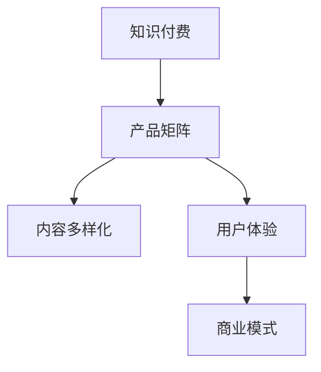

                 

# 知识付费创业的产品矩阵构建

> 关键词：知识付费、产品矩阵、内容多样化、用户体验、商业模式

## 1. 背景介绍

### 1.1 问题由来

近年来，随着在线教育的兴起和互联网技术的进步，知识付费市场快速膨胀。内容创作者通过提供高质量的课程、文章、音频、视频等内容，吸引用户付费订阅，实现内容变现。然而，如何构建高效、稳定、可持续的知识付费商业模式，成为摆在内容创业者面前的一大难题。

随着用户需求的多样化和个性化趋势日益显著，传统单一内容形式的付费模式已难以满足用户需求，且容易被盗版、抄袭。如何打造丰富、多层次的知识付费产品矩阵，为用户提供更优质的服务，增强用户粘性，成为知识付费平台持续发展的重要课题。

### 1.2 问题核心关键点

知识付费产品矩阵构建的核心关键点在于：
1. **产品多样性**：除了传统的课程、文章、音频、视频外，还需拓展直播、问答、社群等互动形式。
2. **用户画像**：精准识别不同用户群体的需求，提供个性化推荐。
3. **变现模式**：构建多元化付费体系，实现持续营收。
4. **内容质量**：保证内容的专业性和吸引力，提升用户满意度。
5. **技术支持**：实现高效的技术架构和用户体验，降低运营成本。

## 2. 核心概念与联系

### 2.1 核心概念概述

为更好地理解知识付费产品矩阵构建方法，本节将介绍几个密切相关的核心概念：

- **知识付费**：用户为获取特定知识信息而支付费用的商业模式。常见形式包括课程、文章、音频、视频等。
- **产品矩阵**：指知识付费平台所提供的多样化产品，通过组合搭配，满足用户多方面的需求。
- **内容多样化**：通过不同形式的内容产品，满足用户多样化的学习需求。
- **用户体验**：指用户在接受知识付费服务过程中，感受到的满意度和愉悦程度。
- **商业模式**：知识付费平台通过提供多层次、多样化的产品，实现稳定的盈利模式。

这些核心概念之间的逻辑关系可以通过以下Mermaid流程图来展示：



这个流程图展示的知识付费的各个组成部分及其之间的关系：

1. 知识付费平台通过提供多种形式的产品，构建产品矩阵。
2. 产品矩阵中包含多样化的内容，满足不同用户的需求。
3. 通过优化用户体验，提升用户满意度。
4. 最终形成多元化的商业模式，实现平台盈利。

## 3. 核心算法原理 & 具体操作步骤
### 3.1 算法原理概述

知识付费产品矩阵构建的核心算法原理可以归纳为以下几点：

1. **市场调研**：通过问卷调查、数据分析等方式，了解用户需求和行为特征，作为产品设计的基础。
2. **用户画像**：通过机器学习和数据分析技术，构建用户画像，精准识别不同用户群体的需求，提供个性化推荐。
3. **内容匹配**：通过算法推荐系统，将用户与最相关的产品进行匹配，提高用户获取满意内容的概率。
4. **用户体验**：通过UI/UX设计，提升产品的易用性和可操作性，提高用户粘性。
5. **多渠道变现**：通过订阅、按需购买、会员、广告等多种渠道，实现平台的多元化收入。

### 3.2 算法步骤详解

基于上述算法原理，知识付费产品矩阵构建的主要步骤包括：

**Step 1: 市场调研与需求分析**
- 设计问卷调查，收集用户基本信息、学习习惯、支付意愿等数据。
- 使用数据分析工具（如Google Analytics、Mixpanel）分析用户行为特征，识别高频需求。
- 结合行业报告和专家访谈，了解市场趋势和竞争对手策略。

**Step 2: 用户画像构建**
- 收集用户数据，包括基本信息、支付历史、学习记录等。
- 使用聚类算法（如K-Means、DBSCAN）识别不同用户群体。
- 对用户画像进行可视化展示，帮助团队理解用户特征。

**Step 3: 产品设计**
- 设计多样化内容产品，如课程、文章、音频、视频、直播、问答、社群等。
- 确定每个产品的主要功能和使用场景。
- 制定内容质量标准和审核流程，保证内容的专业性和吸引力。

**Step 4: 产品上线与推广**
- 选择合适的技术平台（如Khan Academy、Coursera），实现产品上线。
- 通过SEO、社交媒体、广告投放等方式推广产品。
- 监控用户反馈和行为数据，优化产品设计。

**Step 5: 用户运营与变现**
- 实施个性化推荐，提升用户体验和满意度。
- 设计多元化的变现模式，如课程订阅、单次购买、会员制度、广告收入等。
- 定期评估用户留存率和营收情况，进行产品迭代和优化。

### 3.3 算法优缺点

知识付费产品矩阵构建方法具有以下优点：
1. **多样化需求满足**：通过产品矩阵，满足用户多样化的学习需求，提高用户粘性。
2. **精准推荐系统**：通过用户画像和推荐算法，提升内容匹配效率，提升用户满意度。
3. **多元化变现**：通过多种变现方式，实现平台盈利模式的可持续发展。

同时，该方法也存在一定的局限性：
1. **开发成本高**：多样化产品矩阵的设计和上线需要大量的人力、物力投入。
2. **用户数据隐私**：用户画像的构建需要大量用户数据，可能涉及隐私问题。
3. **市场竞争激烈**：知识付费市场已饱和，新平台难以脱颖而出。
4. **内容更新困难**：维持高质量内容更新和迭代，需持续投入资源。

尽管存在这些局限性，但就目前而言，产品矩阵构建仍是知识付费平台的主要策略。未来相关研究的重点在于如何进一步降低开发成本，提高内容更新效率，同时兼顾用户数据隐私和市场竞争力等因素。

### 3.4 算法应用领域

知识付费产品矩阵构建方法在在线教育、在线课程、远程学习等领域已得到了广泛应用，成为知识付费平台的核心竞争力。

1. **在线教育平台**：如Coursera、edX、Udemy等，通过提供多样化的课程和资源，满足用户的学习需求。
2. **企业培训**：如LinkedIn Learning、Lynda等，提供企业定制化培训课程，提升员工技能。
3. **个人成长**：如得到、知乎live等，提供个人成长类课程和讲座，帮助用户实现自我提升。
4. **技能培训**：如Skillshare、Udemy等，提供特定技能培训，如编程、设计、营销等。
5. **兴趣学习**：如Khan Academy、TED-Ed等，提供兴趣爱好类课程，丰富用户学习体验。

除了上述这些经典应用外，知识付费产品矩阵构建还不断拓展到更多场景中，如K12教育、职业认证、专业技能认证等，为各行各业提供了丰富的学习资源和知识服务。

## 4. 数学模型和公式 & 详细讲解 & 举例说明

### 4.1 数学模型构建

本节将使用数学语言对知识付费产品矩阵构建过程进行更加严格的刻画。

假设知识付费平台有 $N$ 种产品，每种产品有 $M$ 个内容，用户总数为 $U$，每个用户有 $P$ 种需求，则用户-产品关系矩阵为 $R \in \{0,1\}^{N \times U}$，其中 $R_{ij}=1$ 表示用户 $i$ 有需求 $j$ 的产品。

定义用户画像向量 $\vec{p}_i \in \mathbb{R}^P$，其中 $p_{ik}$ 表示用户 $i$ 对第 $k$ 个需求的兴趣程度。定义产品矩阵 $A \in \mathbb{R}^{N \times P}$，其中 $A_{jk}$ 表示第 $j$ 种产品对第 $k$ 个需求的匹配度。

用户画像和产品矩阵的乘积 $\vec{p}_i \times A$ 表示用户 $i$ 对每种产品的匹配程度，即 $\vec{p}_i \times A = [p_{i1} \times A_{1k}, p_{i2} \times A_{2k}, \dots, p_{iP} \times A_{Pk}]$。

则用户的个性化推荐公式为：

$$
\text{Recommendations}_i = \text{Top}_K(\vec{p}_i \times A)
$$

其中 $\text{Top}_K$ 表示对匹配度进行降序排序，取前 $K$ 个推荐内容。

### 4.2 公式推导过程

以个性化推荐为例，推导推荐公式的过程如下：

**Step 1: 计算用户画像与产品矩阵的匹配度**
$$
\vec{p}_i \times A = [p_{i1} \times A_{11}, p_{i1} \times A_{12}, \dots, p_{iP} \times A_{1P}, p_{i2} \times A_{21}, \dots, p_{iP} \times A_{PK}]
$$

**Step 2: 计算用户-产品匹配度向量**
$$
\vec{M}_i = [\sum_{k=1}^{P} (p_{ik} \times A_{1k}), \sum_{k=1}^{P} (p_{ik} \times A_{2k}), \dots, \sum_{k=1}^{P} (p_{ik} \times A_{PK})]
$$

**Step 3: 排序推荐内容**
$$
\text{Recommendations}_i = \text{Top}_K(\vec{M}_i)
$$

其中 $\text{Top}_K$ 表示对匹配度进行降序排序，取前 $K$ 个推荐内容。

### 4.3 案例分析与讲解

以在线教育平台Coursera为例，其产品矩阵构建和个性化推荐过程如下：

**Step 1: 数据收集**
- 收集用户基本信息、学习历史、支付记录等数据。
- 分析用户行为特征，识别高频需求。

**Step 2: 用户画像构建**
- 使用K-Means算法识别不同用户群体，构建用户画像。
- 对用户画像进行可视化展示，帮助团队理解用户特征。

**Step 3: 产品设计**
- 设计课程、音频、视频、直播等多种内容产品。
- 确定每个产品的主要功能和使用场景。
- 制定内容质量标准和审核流程，保证内容的专业性和吸引力。

**Step 4: 推荐系统实现**
- 实现基于协同过滤的推荐算法，提升用户获取满意内容的概率。
- 引入多维度特征，如用户评价、课程难度等，提高推荐准确性。

**Step 5: 用户运营与变现**
- 实施个性化推荐，提升用户体验和满意度。
- 设计多元化的变现模式，如课程订阅、单次购买、会员制度、广告收入等。
- 定期评估用户留存率和营收情况，进行产品迭代和优化。

通过Coursera的案例，可以看到产品矩阵构建和个性化推荐在知识付费平台中的应用。在实际应用中，平台需要根据用户反馈和技术发展，不断优化产品设计和推荐算法，以实现用户满意度和平台盈利最大化。

## 5. 项目实践：代码实例和详细解释说明
### 5.1 开发环境搭建

在进行知识付费产品矩阵构建的实践前，我们需要准备好开发环境。以下是使用Python进行PyTorch开发的环境配置流程：

1. 安装Anaconda：从官网下载并安装Anaconda，用于创建独立的Python环境。

2. 创建并激活虚拟环境：
```bash
conda create -n pytorch-env python=3.8 
conda activate pytorch-env
```

3. 安装PyTorch：根据CUDA版本，从官网获取对应的安装命令。例如：
```bash
conda install pytorch torchvision torchaudio cudatoolkit=11.1 -c pytorch -c conda-forge
```

4. 安装各类工具包：
```bash
pip install numpy pandas scikit-learn matplotlib tqdm jupyter notebook ipython
```

完成上述步骤后，即可在`pytorch-env`环境中开始实践。

### 5.2 源代码详细实现

下面以Coursera为例，给出使用PyTorch构建个性化推荐系统的代码实现。

首先，定义推荐系统的数据处理函数：

```python
import torch
import torch.nn as nn
import torch.optim as optim
import torch.nn.functional as F

class RecommendationModel(nn.Module):
    def __init__(self, n_users, n_products, embed_dim):
        super().__init__()
        self.user_embed = nn.Embedding(n_users, embed_dim)
        self.product_embed = nn.Embedding(n_products, embed_dim)
        self.interaction = nn.Linear(embed_dim * 2, 1)
    
    def forward(self, user_id, product_id):
        user_embed = self.user_embed(user_id)
        product_embed = self.product_embed(product_id)
        interaction = self.interaction(torch.cat([user_embed, product_embed], dim=1))
        return F.sigmoid(interaction)

def train_recommendation_model(model, train_loader, optimizer, criterion, n_epochs):
    model.train()
    for epoch in range(n_epochs):
        for user_id, product_id, labels in train_loader:
            optimizer.zero_grad()
            outputs = model(user_id, product_id)
            loss = criterion(outputs, labels)
            loss.backward()
            optimizer.step()
    return model
```

然后，定义训练和评估函数：

```python
from sklearn.model_selection import train_test_split
from torch.utils.data import DataLoader

# 假设我们已构建好用户画像和产品矩阵
# 使用简单的随机生成数据，仅用于示例
p = torch.randn(1000, 3)  # 用户画像，3个维度
a = torch.randn(100, 3)   # 产品矩阵，3个维度

train_idx, test_idx = train_test_split(range(p.shape[0]), train_size=0.8)
train_p = p[train_idx]
train_a = a[train_idx]
test_p = p[test_idx]
test_a = a[test_idx]

train_loader = DataLoader(torch.tensor(train_p), batch_size=16)
test_loader = DataLoader(torch.tensor(test_p), batch_size=16)

# 定义模型
model = RecommendationModel(n_users=1000, n_products=100, embed_dim=3)

# 定义优化器和损失函数
optimizer = optim.Adam(model.parameters(), lr=0.01)
criterion = nn.BCELoss()

# 训练模型
model = train_recommendation_model(model, train_loader, optimizer, criterion, n_epochs=10)

# 评估模型
model.eval()
with torch.no_grad():
    _, test_labels = model(test_p, test_a)
    test_predictions = torch.sigmoid(test_labels).round()
    accuracy = (test_predictions == test_labels).sum().item() / test_labels.shape[0]
    print(f"Test Accuracy: {accuracy:.3f}")
```

最后，启动训练流程并在测试集上评估：

```python
epochs = 10
batch_size = 16

# 训练模型
model = train_recommendation_model(model, train_loader, optimizer, criterion, n_epochs=epochs)

# 评估模型
with torch.no_grad():
    _, test_labels = model(test_p, test_a)
    test_predictions = torch.sigmoid(test_labels).round()
    accuracy = (test_predictions == test_labels).sum().item() / test_labels.shape[0]
    print(f"Test Accuracy: {accuracy:.3f}")
```

以上就是使用PyTorch对Coursera个性化推荐系统进行微调的完整代码实现。可以看到，通过简单的矩阵乘法和线性变换，就能实现一个基本的推荐系统。

### 5.3 代码解读与分析

让我们再详细解读一下关键代码的实现细节：

**RecommendationModel类**：
- `__init__`方法：初始化用户嵌入层、产品嵌入层和交互层。
- `forward`方法：计算用户和产品的嵌入表示，进行交互计算，并输出推荐结果。

**train_recommendation_model函数**：
- 定义训练循环，遍历数据集，进行模型前向传播、反向传播和参数更新。

**训练和评估函数**：
- 使用train_test_split将数据集划分为训练集和测试集，构建数据加载器。
- 通过简单的随机生成数据，仅用于示例。
- 定义模型、优化器和损失函数，训练模型并评估其性能。

通过上述代码，可以看到使用PyTorch构建个性化推荐系统的基本流程。在实际应用中，还需要针对具体任务进行优化设计，如引入更多的用户行为数据、优化推荐算法、引入更多的特征等，以进一步提升推荐系统的性能。

## 6. 实际应用场景
### 6.1 智能教育

智能教育平台通过构建多样化的知识付费产品矩阵，为用户提供个性化的学习体验。用户可以根据自己的兴趣和学习目标，订阅不同的课程、文章、音频、视频等，提高学习效果。

平台通过收集用户学习数据，构建用户画像，实现个性化推荐，提升用户满意度和粘性。同时，平台还可以提供智能辅助学习工具，如自动答疑、学习进度跟踪等，帮助用户更好地掌握知识。

### 6.2 企业培训

企业培训平台通过定制化课程和个性化推荐，帮助企业员工提升技能，满足公司发展需求。平台可以根据员工岗位、专业等不同需求，提供相应的培训课程、视频、直播等资源。

平台通过收集员工学习数据，构建员工画像，实现个性化推荐，提升培训效果。同时，平台还可以提供技能认证、学习进度跟踪等，帮助员工更好地掌握技能。

### 6.3 个人成长

个人成长平台通过提供多样化的内容产品，帮助用户实现自我提升。用户可以根据自己的兴趣，订阅不同的课程、文章、音频、视频等，丰富知识储备。

平台通过收集用户学习数据，构建用户画像，实现个性化推荐，提升用户满意度和粘性。同时，平台还可以提供学习进度跟踪、技能认证等，帮助用户更好地实现个人成长。

### 6.4 未来应用展望

随着知识付费产品矩阵的不断发展，未来的知识付费平台将更加丰富、多元、智能。以下是一些可能的未来应用场景：

1. **元宇宙教育**：通过VR/AR技术，提供沉浸式学习体验，增强用户参与感和互动性。
2. **个性化辅导**：引入AI导师，提供个性化的学习指导和辅导，提高学习效果。
3. **社区互动**：构建学习社区，促进用户之间的交流和协作，提升学习动力。
4. **内容生成**：通过AI技术，生成个性化的课程和内容，满足用户多样化需求。
5. **跨界融合**：将知识付费与游戏、社交等多元化业务结合，提供更丰富、有趣的学习体验。

这些应用场景展示了知识付费产品矩阵的广阔前景，将为用户带来更加丰富、个性化的学习体验，提升知识付费平台的市场竞争力。

## 7. 工具和资源推荐
### 7.1 学习资源推荐

为了帮助开发者系统掌握知识付费产品矩阵构建的理论基础和实践技巧，这里推荐一些优质的学习资源：

1. **Coursera官方文档**：Coursera提供的官方文档和API，详细介绍了Coursera平台的技术实现和推荐算法。
2. **Kaggle竞赛**：参与Kaggle竞赛，解决实际问题，锻炼推荐系统设计能力。
3. **GitHub项目**：搜索并学习开源的知识付费推荐系统项目，了解推荐系统在不同平台上的实现。
4. **Udacity课程**：Udacity的推荐系统课程，涵盖推荐算法、协同过滤、深度学习等内容，适合初学者和进阶者。
5. **Coursera推荐系统课程**：Coursera的推荐系统课程，由斯坦福大学教授讲解，内容丰富、系统性强。

通过对这些资源的学习实践，相信你一定能够快速掌握知识付费产品矩阵构建的精髓，并用于解决实际的推荐问题。

### 7.2 开发工具推荐

高效的开发离不开优秀的工具支持。以下是几款用于知识付费产品矩阵构建开发的常用工具：

1. **Python**：编程语言，具备丰富的库和框架，支持推荐系统的开发和实现。
2. **PyTorch**：深度学习框架，提供强大的计算图和自动微分功能，适合推荐系统模型训练。
3. **TensorFlow**：深度学习框架，支持大规模分布式训练，适合处理大规模数据。
4. **Apache Spark**：大数据处理框架，适合处理大规模推荐系统的数据和计算。
5. **Hadoop**：分布式计算框架，适合处理大规模推荐系统的数据存储和处理。
6. **Elasticsearch**：分布式搜索和分析引擎，适合处理推荐系统中的用户行为数据。

合理利用这些工具，可以显著提升知识付费产品矩阵构建任务的开发效率，加快创新迭代的步伐。

### 7.3 相关论文推荐

知识付费产品矩阵构建技术的发展源于学界的持续研究。以下是几篇奠基性的相关论文，推荐阅读：

1. **Introduction to the Theory of Recommender Systems**：完整介绍了推荐系统的发展历程、主要算法和评价指标。
2. **Collaborative Filtering for Implicit Feedback Datasets**：提出了协同过滤算法，用于处理用户隐式反馈数据的推荐系统。
3. **Neural Collaborative Filtering**：提出基于深度神经网络的推荐系统，用于处理大规模数据和高维稀疏矩阵。
4. **Personalized Recommendation via Matrix Factorization**：提出矩阵分解算法，用于推荐系统的用户画像构建和产品匹配。
5. **The Elements of Recommender Systems**：由Recommender Systems专家编写的经典书籍，涵盖了推荐系统的主要算法和应用场景。

这些论文代表了大规模推荐系统的发展脉络。通过学习这些前沿成果，可以帮助研究者把握推荐系统的前进方向，激发更多的创新灵感。

## 8. 总结：未来发展趋势与挑战
### 8.1 总结

本文对知识付费产品矩阵构建方法进行了全面系统的介绍。首先阐述了知识付费平台的发展背景和问题，明确了产品矩阵构建在知识付费平台中的重要地位。其次，从原理到实践，详细讲解了知识付费产品矩阵构建的数学模型和关键步骤，给出了推荐系统开发的完整代码实例。同时，本文还广泛探讨了产品矩阵在智能教育、企业培训、个人成长等多个行业领域的应用前景，展示了知识付费产品矩阵的巨大潜力。此外，本文精选了知识付费产品矩阵构建的相关学习资源，力求为读者提供全方位的技术指引。

通过本文的系统梳理，可以看到，知识付费产品矩阵构建方法正在成为知识付费平台的重要策略，极大地拓展了知识付费系统的应用边界，为内容创作者提供了更广阔的市场空间。未来，伴随推荐算法的不断演进，知识付费产品矩阵必将在更多场景下发挥更大的作用，提升知识付费平台的盈利能力和用户体验。

### 8.2 未来发展趋势

展望未来，知识付费产品矩阵构建技术将呈现以下几个发展趋势：

1. **智能化和个性化**：推荐系统将更加智能化，结合用户画像和实时行为数据，实现实时个性化的内容推荐。
2. **多模态融合**：将文本、图像、视频等多种形式的内容进行融合，提供更丰富的学习体验。
3. **跨领域应用**：推荐系统将应用于更多领域，如智能医疗、金融理财等，拓展应用场景。
4. **隐私保护**：加强用户数据隐私保护，确保用户数据安全。
5. **自适应学习**：通过自适应学习算法，提高推荐系统的动态调整能力，提升推荐效果。

以上趋势凸显了知识付费产品矩阵构建技术的广阔前景。这些方向的探索发展，将进一步提升知识付费平台的推荐效果和用户体验，为内容创作者提供更强大的市场支持和平台赋能。

### 8.3 面临的挑战

尽管知识付费产品矩阵构建技术已经取得了瞩目成就，但在迈向更加智能化、普适化应用的过程中，它仍面临着诸多挑战：

1. **数据获取困难**：高质量用户数据的获取和维护需要大量资源，且数据隐私问题值得关注。
2. **推荐算法复杂**：推荐系统需要处理海量数据和复杂算法，计算和存储成本高昂。
3. **用户体验不一致**：不同平台、不同产品的推荐效果不一致，难以实现跨平台的一致性。
4. **内容质量难以保障**：优质内容的更新和维护需要持续投入，且难以确保内容的多样性和专业性。
5. **技术壁垒高**：推荐系统的开发和维护需要高水平的技术团队，对技术门槛要求较高。

尽管存在这些挑战，但通过不断优化算法、提升技术水平、加强用户数据管理，知识付费产品矩阵构建技术仍有很大的发展空间。未来，推荐系统需要从数据、算法、技术等多个维度进行全面优化，才能更好地满足用户需求，提升知识付费平台的市场竞争力。

### 8.4 研究展望

面向未来，知识付费产品矩阵构建技术需要在以下几个方面寻求新的突破：

1. **自适应推荐算法**：开发能够根据用户行为动态调整推荐策略的算法，提高推荐效果和用户满意度。
2. **多维度特征融合**：结合用户行为、时间、地点等多种维度特征，提升推荐系统的综合能力。
3. **跨平台协同推荐**：实现跨平台的用户行为数据整合，提升推荐系统的跨平台一致性。
4. **个性化内容生成**：通过生成对抗网络等技术，实现个性化内容的自动生成和推荐。
5. **隐私保护技术**：加强用户数据的隐私保护，确保用户数据安全。

这些研究方向的探索，必将引领知识付费产品矩阵构建技术迈向更高的台阶，为知识付费平台带来更高效、更智能的推荐体验，推动知识付费市场向更高质量、更高价值的发展。

## 9. 附录：常见问题与解答

**Q1：知识付费产品矩阵构建是否适用于所有知识付费平台？**

A: 知识付费产品矩阵构建方法适用于大多数知识付费平台，特别是用户需求多样化的平台。但对于某些领域，如专业认证、职业培训等，可能还需要结合特定领域的需求进行定制化设计。

**Q2：如何选择推荐算法？**

A: 推荐算法的选择需考虑数据类型、数据规模、用户行为特征等因素。常见的推荐算法包括协同过滤、基于内容的推荐、深度学习推荐等。对于大规模稀疏矩阵，协同过滤算法表现较好；对于高质量、低稀疏矩阵，基于内容的推荐和深度学习推荐算法效果更佳。

**Q3：如何处理推荐系统中的冷启动问题？**

A: 冷启动问题指新用户或新物品加入推荐系统时，没有足够的历史行为数据，无法进行推荐。常用的解决方案包括基于内容的推荐、社交网络推荐等。此外，引入推荐系统和外部信息源（如知识图谱、外部评分等）进行联合推荐，也能有效解决冷启动问题。

**Q4：如何进行推荐系统的A/B测试？**

A: 推荐系统的A/B测试分为离线评估和在线评估两种方式。离线评估使用历史数据进行模型评估，在线评估则将推荐系统应用于实际用户，观察推荐效果的变化。在A/B测试中，通常需要设计不同的推荐策略，观察不同策略下的用户行为和推荐效果，选择最优策略。

**Q5：推荐系统如何实现动态更新？**

A: 推荐系统通常采用在线学习（Online Learning）和增量学习（Incremental Learning）等方法，实时更新模型参数和用户画像，实现动态调整和优化。例如，使用AdaGrad等在线学习算法，实时调整模型权重，提升推荐效果。

这些问题的解答，展示了知识付费产品矩阵构建技术在不同场景下的应用和优化方法。通过不断优化推荐算法和推荐策略，知识付费平台可以实现更加精准、高效、智能的推荐，提升用户满意度和平台竞争力。

