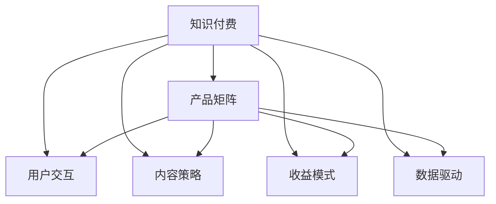

                 

## 1. 背景介绍

### 1.1 问题由来

在知识付费领域，随着用户对高质量、深度化内容的需求不断增长，传统单一内容形式已经无法满足用户多维度的学习需求。知识付费创业企业需要构建多元化的产品矩阵，以形成完备的知识付费生态，提供立体化的知识服务。同时，随着市场竞争日益激烈，如何在激烈的市场环境中脱颖而出，构建具有市场竞争力的产品矩阵，成为创业企业需要重点解决的问题。

### 1.2 问题核心关键点

知识付费创业企业的产品矩阵构建主要涉及以下几个核心关键点：

- **市场定位**：明确目标用户群体和市场需求，确定产品矩阵的核心功能和服务对象。
- **内容策略**：基于用户需求，选择合适的知识内容形式，如文章、视频、音频等，实现内容多样化。
- **用户交互**：设计互动性强的用户界面和功能，提升用户体验，增强用户粘性。
- **收益模式**：探索多样化的商业模式，如订阅制、单次购买、免费增值等，实现盈利。
- **数据驱动**：利用数据挖掘和分析技术，持续优化产品功能和用户体验。

### 1.3 问题研究意义

构建科学、高效的知识付费产品矩阵，对于提升企业市场竞争力、增强用户粘性、实现可持续盈利具有重要意义：

- **市场拓展**：通过多样化产品矩阵，满足不同用户的学习需求，扩大用户群体。
- **提升体验**：通过互动性强、内容丰富的产品功能，增强用户的学习体验，提升用户满意度。
- **增加收入**：通过多样化商业模式，增加收入来源，提高企业盈利能力。
- **数据驱动**：通过数据分析和用户反馈，持续优化产品功能和运营策略，提升整体竞争力。

## 2. 核心概念与联系

### 2.1 核心概念概述

为更好地理解知识付费创业的产品矩阵构建，本节将介绍几个密切相关的核心概念：

- **知识付费（Knowledge Pay）**：用户为获取知识内容而支付费用的服务形式，如在线课程、文章、视频等。
- **产品矩阵（Product Matrix）**：企业提供的多样化产品组合，以形成互补、互惠的产品服务体系，满足不同用户的多样化需求。
- **用户交互（User Interaction）**：用户与知识内容、知识付费平台之间的互动行为，包括阅读、观看、讨论、反馈等。
- **内容策略（Content Strategy）**：选择和规划知识内容的形式和内容，以吸引和保留用户。
- **收益模式（Revenue Model）**：知识付费企业获取收入的渠道和方式，如订阅制、单次购买、免费增值等。
- **数据驱动（Data-Driven）**：利用数据分析和用户反馈，持续优化产品和服务，提升用户体验。

这些核心概念之间的逻辑关系可以通过以下Mermaid流程图来展示：



这个流程图展示的知识付费创业企业的产品矩阵构建的关键概念及其之间的关系：

1. 知识付费通过内容形式为用户提供知识服务。
2. 产品矩阵是多样化的产品组合，满足不同用户需求。
3. 用户交互提升用户体验，增强用户粘性。
4. 内容策略选择合适的内容形式，吸引用户。
5. 收益模式提供多种收入渠道，增加盈利。
6. 数据驱动持续优化产品和服务。

## 3. 核心算法原理 & 具体操作步骤

### 3.1 算法原理概述

知识付费创业企业的产品矩阵构建，本质上是一个面向用户需求的多维服务组合优化问题。其核心思想是通过数据分析和用户反馈，构建一个满足用户多样化需求、具有竞争力的产品矩阵。

形式化地，假设企业提供的产品矩阵为 $P=\{P_1,P_2,...,P_n\}$，其中 $P_i$ 表示第 $i$ 种知识付费产品。设 $u$ 为目标用户的集合，$X$ 为市场细分后的用户需求集合。则产品矩阵构建的目标是最大化用户满意度：

$$
\max_{P} \sum_{i,j} P_i \times \sum_{u} f(u,P_i) \times \sum_{j} g(u,j)
$$

其中 $f(u,P_i)$ 表示用户 $u$ 对产品 $P_i$ 的满意度函数，$g(u,j)$ 表示用户 $u$ 对产品 $P_i$ 的购买意愿函数。

### 3.2 算法步骤详解

知识付费创业企业的产品矩阵构建一般包括以下几个关键步骤：

**Step 1: 需求分析与市场定位**

- 进行用户需求调研，了解用户对知识内容的需求和偏好。
- 分析市场竞争格局，确定产品矩阵的核心功能和市场定位。

**Step 2: 内容策略制定**

- 根据用户需求，选择合适的知识内容形式，如文章、视频、音频等。
- 确定内容发布节奏和更新周期，确保内容的持续性和多样性。

**Step 3: 产品矩阵设计**

- 设计产品矩阵框架，包括核心产品、周边产品、附加服务等。
- 对产品进行功能优化，提升用户体验，增加用户粘性。

**Step 4: 用户交互设计**

- 设计互动性强的用户界面和功能，如评论、点赞、分享等。
- 引入社交元素，增强用户之间的互动和社区氛围。

**Step 5: 收益模式探索**

- 根据产品特点和用户需求，探索适合的收益模式，如订阅制、单次购买、免费增值等。
- 设计灵活的定价策略，平衡用户付费意愿和收益。

**Step 6: 数据驱动优化**

- 利用数据挖掘和分析技术，评估产品矩阵的效果和用户满意度。
- 根据用户反馈和数据结果，持续优化产品功能和运营策略。

以上是知识付费创业企业产品矩阵构建的一般流程。在实际应用中，还需要针对具体用户需求和市场特点，对产品矩阵的各个环节进行优化设计，如改进用户界面、引入新技术、优化收益模式等，以进一步提升产品矩阵的竞争力和用户体验。

### 3.3 算法优缺点

构建知识付费创业企业的产品矩阵，具有以下优点：

1. 满足多样化需求。通过多元化产品矩阵，满足不同用户的学习需求，扩大用户群体。
2. 提升用户体验。通过互动性强、内容丰富的产品功能，增强用户的学习体验，提升用户满意度。
3. 增加收入来源。通过多样化商业模式，增加收入渠道，提高企业盈利能力。
4. 数据驱动优化。通过数据分析和用户反馈，持续优化产品功能和运营策略，提升整体竞争力。

同时，该方法也存在一定的局限性：

1. 开发成本高。构建和维护一个完善的产品矩阵需要大量资源投入，包括人力、技术和运营成本。
2. 市场风险大。产品矩阵的复杂性和多样性增加了市场不确定性，需要不断调整和优化。
3. 用户体验不一致。不同产品之间的界面和功能设计不一致，可能导致用户体验差异，影响用户粘性。

尽管存在这些局限性，但就目前而言，构建多元化产品矩阵仍是知识付费创业企业获取竞争优势的重要策略。未来相关研究的重点在于如何通过数据驱动优化产品矩阵，降低开发成本，提高用户体验和市场竞争力。

### 3.4 算法应用领域

知识付费创业企业的产品矩阵构建方法，已经在多个领域得到广泛应用，例如：

- **在线教育**：提供课程、视频、阅读等多种形式的教育内容，满足不同用户的学习需求。
- **职场培训**：提供技能培训、职业发展、招聘信息等多种服务，提升职场竞争力。
- **个人成长**：提供心理健康、生活技巧、自我管理等多种内容，帮助用户实现个人成长。
- **科技资讯**：提供技术动态、最新研究、产品评测等多种信息，帮助用户了解科技前沿。
- **健康生活**：提供健康管理、营养食谱、健身训练等多种内容，提升用户生活质量。

除了上述这些经典应用外，知识付费创业企业的产品矩阵构建方法也在不断创新，覆盖更多垂直领域，为知识付费技术的发展带来了新的突破。

## 4. 数学模型和公式 & 详细讲解 & 举例说明

### 4.1 数学模型构建

本节将使用数学语言对知识付费创业企业产品矩阵构建过程进行更加严格的刻画。

记知识付费企业的产品矩阵为 $P=\{P_1,P_2,...,P_n\}$，其中 $P_i$ 表示第 $i$ 种知识付费产品。设 $u$ 为目标用户的集合，$X$ 为市场细分后的用户需求集合。设 $f(u,P_i)$ 表示用户 $u$ 对产品 $P_i$ 的满意度函数，$g(u,j)$ 表示用户 $u$ 对产品 $P_i$ 的购买意愿函数。

产品矩阵构建的目标是最大化用户满意度：

$$
\max_{P} \sum_{i,j} P_i \times \sum_{u} f(u,P_i) \times \sum_{j} g(u,j)
$$

在实践中，我们通常使用多目标优化算法（如遗传算法、粒子群算法等）来近似求解上述最优化问题。

### 4.2 公式推导过程

以下我们以在线教育平台为例，推导用户满意度函数和购买意愿函数的计算公式。

假设用户 $u$ 对在线教育平台某门课程 $P_i$ 的满意度为 $f(u,P_i)=a_u \times c_{P_i} \times r_{P_i}$，其中 $a_u$ 为用户 $u$ 对教育内容的接受度，$c_{P_i}$ 为课程 $P_i$ 的质量，$r_{P_i}$ 为用户 $u$ 的评价和反馈。

用户 $u$ 对课程 $P_i$ 的购买意愿为 $g(u,P_i)=b_u \times d_{P_i} \times s_{P_i}$，其中 $b_u$ 为用户 $u$ 的预算，$d_{P_i}$ 为课程 $P_i$ 的价格，$s_{P_i}$ 为用户 $u$ 的购买记录和偏好。

将上述函数代入产品矩阵构建的目标函数，得：

$$
\max_{P} \sum_{i,j} P_i \times \left(\sum_{u} a_u \times c_{P_i} \times r_{P_i}\right) \times \left(\sum_{u} b_u \times d_{P_i} \times s_{P_i}\right)
$$

利用多目标优化算法，求解上述函数的最大值，即可得到最优的产品矩阵配置。

### 4.3 案例分析与讲解

假设某在线教育平台提供课程 $P_1,P_2,...,P_n$，根据用户调研，确定了如下满意度函数和购买意愿函数：

- $f(u,P_i)=a_u \times c_{P_i} \times r_{P_i}$
- $g(u,P_i)=b_u \times d_{P_i} \times s_{P_i}$

其中 $a_u,b_u$ 为用户的接受度和预算，$c_{P_i},d_{P_i}$ 为课程的质量和价格，$r_{P_i},s_{P_i}$ 为用户的评价和偏好。

假设用户 $u_1,u_2,...,u_m$ 对不同课程的满意度如表所示：

| 用户 | $a_{u_1}$ | $a_{u_2}$ | ... | $a_{u_m}$ |
| --- | --- | --- | --- | --- |

| 课程 | $c_{P_1}$ | $c_{P_2}$ | ... | $c_{P_n}$ |
| --- | --- | --- | --- | --- |

| 用户 | $b_{u_1}$ | $b_{u_2}$ | ... | $b_{u_m}$ |
| --- | --- | --- | --- | --- |

| 课程 | $d_{P_1}$ | $d_{P_2}$ | ... | $d_{P_n}$ |
| --- | --- | --- | --- | --- |

| 用户 | $r_{u_1}$ | $r_{u_2}$ | ... | $r_{u_m}$ |
| --- | --- | --- | --- | --- |

| 用户 | $s_{u_1}$ | $s_{u_2}$ | ... | $s_{u_m}$ |
| --- | --- | --- | --- | --- |

假设用户对课程 $P_1,P_2,...,P_n$ 的购买意愿如表所示：

| 用户 | $d_{P_1}$ | $d_{P_2}$ | ... | $d_{P_n}$ |
| --- | --- | --- | --- | --- |

通过求解上述多目标优化问题，可以得到最优的产品矩阵配置。

## 5. 项目实践：代码实例和详细解释说明

### 5.1 开发环境搭建

在进行产品矩阵构建实践前，我们需要准备好开发环境。以下是使用Python进行Flask开发的环境配置流程：

1. 安装Anaconda：从官网下载并安装Anaconda，用于创建独立的Python环境。

2. 创建并激活虚拟环境：
```bash
conda create -n flask-env python=3.8 
conda activate flask-env
```

3. 安装Flask：根据官方文档安装Flask：
```bash
pip install flask
```

4. 安装SQLite：用于数据库存储，Flask默认支持。
```bash
pip install sqlite3
```

5. 安装Flask-RESTful：用于构建RESTful API接口。
```bash
pip install Flask-RESTful
```

6. 安装Flask-SQLAlchemy：用于与SQLite数据库交互。
```bash
pip install Flask-SQLAlchemy
```

完成上述步骤后，即可在`flask-env`环境中开始产品矩阵构建实践。

### 5.2 源代码详细实现

下面我们以在线教育平台为例，给出使用Flask构建知识付费产品矩阵的Python代码实现。

首先，定义用户、课程和评价的数据模型：

```python
from flask_sqlalchemy import SQLAlchemy
from flask import Flask

app = Flask(__name__)
app.config['SQLALCHEMY_DATABASE_URI'] = 'sqlite:///users.db'
db = SQLAlchemy(app)

class User(db.Model):
    id = db.Column(db.Integer, primary_key=True)
    name = db.Column(db.String(100))
    budget = db.Column(db.Float)
    courses = db.relationship('Course', backref='users')

class Course(db.Model):
    id = db.Column(db.Integer, primary_key=True)
    name = db.Column(db.String(100))
    price = db.Column(db.Float)
    ratings = db.Column(db.Float)
    users = db.relationship('User', backref='courses')

class Review(db.Model):
    id = db.Column(db.Integer, primary_key=True)
    user_id = db.Column(db.Integer, db.ForeignKey('user.id'))
    course_id = db.Column(db.Integer, db.ForeignKey('course.id'))
    score = db.Column(db.Float)
```

然后，定义API接口：

```python
from flask_restful import Resource, Api

api = Api(app)

class UserList(Resource):
    def get(self):
        users = User.query.all()
        return {'users': [{'id': user.id, 'name': user.name, 'budget': user.budget} for user in users]}

class CourseList(Resource):
    def get(self):
        courses = Course.query.all()
        return {'courses': [{'id': course.id, 'name': course.name, 'price': course.price} for course in courses]}

class Enroll(Resource):
    def post(self, course_id):
        user = User.query.get(user_id)
        course = Course.query.get(course_id)
        user.enroll(course)
        return {'message': 'User enrolled in course'}

class Review(Resource):
    def post(self, course_id, user_id):
        user = User.query.get(user_id)
        course = Course.query.get(course_id)
        review = Review(user=user, course=course, score=score)
        db.session.add(review)
        db.session.commit()
        return {'message': 'Review submitted'}
```

最后，启动Flask服务器：

```python
if __name__ == '__main__':
    app.run(debug=True)
```

以上就是使用Flask构建知识付费产品矩阵的完整代码实现。可以看到，通过Flask和SQLite，开发者可以快速搭建一个功能丰富的在线教育平台，并进行数据分析和用户交互。

### 5.3 代码解读与分析

让我们再详细解读一下关键代码的实现细节：

**User模型**：
- 包含用户ID、姓名、预算等信息，并定义了与课程模型的关联。

**Course模型**：
- 包含课程ID、名称、价格等信息，并定义了与用户模型的关联。

**Review模型**：
- 包含评价ID、用户ID、课程ID和评分等信息，用于存储用户对课程的评价。

**UserList类**：
- 提供获取用户列表的接口，用于展示所有用户。

**CourseList类**：
- 提供获取课程列表的接口，用于展示所有课程。

**Enroll类**：
- 提供用户选课接口，用于用户选修课程。

**Review类**：
- 提供用户评价接口，用于用户提交课程评价。

这些API接口定义了用户和课程的基本操作，使得前端页面可以方便地进行用户管理和课程浏览。同时，通过SQLite数据库的存储，实现了用户和课程的基本数据管理。

当然，工业级的系统实现还需考虑更多因素，如数据库的扩展性、API的安全性、用户权限控制等。但核心的产品矩阵构建流程基本与此类似。

## 6. 实际应用场景

### 6.1 在线教育

基于知识付费创业企业的产品矩阵构建方法，在线教育平台可以快速拓展课程种类，满足不同用户的学习需求。例如，某在线教育平台可以根据用户调研，选择推出数学、编程、外语等多种课程，并根据用户购买意愿和满意度数据，动态调整课程价格和营销策略，提升课程转化率和用户满意度。

### 6.2 职场培训

职场培训平台可以利用产品矩阵构建方法，提供多层次的职场培训服务。例如，某职场培训平台可以根据用户职业背景和培训需求，推出初级、中级、高级不同层次的课程，并根据用户反馈，不断优化课程内容和培训方式，提升用户的学习效果和培训满意度。

### 6.3 个人成长

个人成长平台可以利用产品矩阵构建方法，提供多样化的个人成长服务。例如，某个人成长平台可以根据用户兴趣爱好，推出读书会、写作课、心理辅导等多种服务，并根据用户评价和反馈，持续优化内容和形式，提升用户体验和粘性。

### 6.4 科技资讯

科技资讯平台可以利用产品矩阵构建方法，提供多元化的科技信息服务。例如，某科技资讯平台可以根据用户兴趣，推出新闻、研究、产品评测等多种内容，并根据用户互动数据，动态调整内容推荐策略，提升用户获取信息的效率和满意度。

### 6.5 健康生活

健康生活平台可以利用产品矩阵构建方法，提供全方位的健康管理服务。例如，某健康生活平台可以根据用户健康需求，推出饮食管理、运动指导、心理健康等多种服务，并根据用户反馈，不断优化健康计划和内容，提升用户生活质量和健康水平。

## 7. 工具和资源推荐

### 7.1 学习资源推荐

为了帮助开发者系统掌握知识付费创业的产品矩阵构建的理论基础和实践技巧，这里推荐一些优质的学习资源：

1. **《知识付费业务发展战略与运营管理》**：深入讲解知识付费业务的商业模式、市场趋势和运营管理，提供实用的商业案例分析。
2. **《知识付费产品经理修炼之道》**：全面介绍知识付费产品经理的角色职责、工作流程和技能要求，提供系统化的管理思路和方法。
3. **《知识付费平台的运营策略与实战经验》**：系统讲解知识付费平台的运营策略、用户管理和内容优化，提供实战经验和案例分析。
4. **《知识付费生态系统的构建与运营》**：全面介绍知识付费生态系统的构建思路、市场竞争和用户需求分析，提供系统化的运营思路和方法。
5. **《知识付费平台的商业模式创新》**：深入探讨知识付费平台的商业模式创新、收益模式优化和盈利策略，提供前沿的商业思路和方法。

通过这些资源的学习实践，相信你一定能够快速掌握知识付费创业的产品矩阵构建的精髓，并用于解决实际的NLP问题。

### 7.2 开发工具推荐

高效的开发离不开优秀的工具支持。以下是几款用于知识付费创业产品矩阵构建开发的常用工具：

1. **Flask**：Python的开源Web框架，灵活的扩展机制，适合快速构建Web应用。
2. **SQLite**：轻量级SQL数据库，适合小型Web应用的数据存储和管理。
3. **Flask-RESTful**：Flask的扩展，用于构建RESTful API接口，支持高效的接口开发。
4. **Flask-SQLAlchemy**：Flask与SQLAlchemy的结合，提供快速的数据库交互功能。
5. **SQLAlchemy**：Python的ORM框架，支持复杂的数据库操作，提供对象-关系映射。
6. **Jupyter Notebook**：交互式的Python开发环境，支持数据可视化、代码调试和协作开发。

合理利用这些工具，可以显著提升知识付费创业产品矩阵构建的开发效率，加快创新迭代的步伐。

### 7.3 相关论文推荐

知识付费创业企业的产品矩阵构建技术，已经得到了学界的持续研究。以下是几篇奠基性的相关论文，推荐阅读：

1. **《知识付费平台用户行为分析与建模》**：通过对用户行为数据的分析，探索知识付费平台用户需求的特征和规律，提出用户行为建模方法。
2. **《知识付费平台的个性化推荐系统设计》**：基于用户画像和行为数据，设计个性化推荐系统，提升用户的学习体验和满意度。
3. **《知识付费平台的收益模式研究》**：研究知识付费平台的多种收益模式，如订阅制、单次购买、免费增值等，探讨各模式的优缺点和适用场景。
4. **《知识付费平台的市场竞争分析》**：通过对市场竞争格局的分析，提出知识付费平台的市场竞争策略，提升平台的市场竞争力。
5. **《知识付费平台的运营优化》**：基于用户数据和市场反馈，提出知识付费平台的运营优化策略，提升平台的运营效率和用户满意度。

这些论文代表了大规模知识付费平台的用户行为、收益模式和运营优化等方向的研究进展，对于知识付费创业企业的产品矩阵构建具有重要的参考价值。

## 8. 总结：未来发展趋势与挑战

### 8.1 总结

本文对知识付费创业企业的产品矩阵构建方法进行了全面系统的介绍。首先阐述了知识付费创业企业的产品矩阵构建的研究背景和意义，明确了产品矩阵的核心功能和服务对象。其次，从原理到实践，详细讲解了产品矩阵的数学模型和构建流程，给出了产品矩阵构建的完整代码实例。同时，本文还广泛探讨了产品矩阵在在线教育、职场培训、个人成长、科技资讯、健康生活等多个领域的应用前景，展示了产品矩阵构建方法的巨大潜力。此外，本文精选了产品矩阵构建的各类学习资源，力求为读者提供全方位的技术指引。

通过本文的系统梳理，可以看到，构建科学、高效的知识付费产品矩阵，对于提升企业市场竞争力、增强用户粘性、实现可持续盈利具有重要意义。构建产品矩阵的实践中，开发团队需要从市场需求、内容策略、用户交互、收益模式、数据驱动等多个维度综合考虑，方能构建出具备市场竞争力的产品矩阵。

### 8.2 未来发展趋势

展望未来，知识付费创业企业的产品矩阵构建技术将呈现以下几个发展趋势：

1. **多样化内容形态**：随着用户需求的多样化，知识付费创业企业将探索更多元化的内容形态，如视频、音频、直播、互动课程等，提升用户的学习体验。
2. **个性化推荐**：通过大数据和AI技术，构建个性化的推荐系统，实现精准的内容推送，提升用户的学习效果和满意度。
3. **多渠道分发**：利用多种渠道（如社交媒体、搜索引擎、广告平台等）进行内容分发，扩大知识的传播范围，提升平台的曝光度和用户覆盖率。
4. **跨平台协同**：通过API接口和数据共享，实现多平台之间的协同和互通，提升用户的跨平台学习体验。
5. **用户社区建设**：构建用户社区，增强用户之间的互动和交流，提升用户粘性和平台活跃度。
6. **新业务拓展**：探索新的业务模式和应用场景，如知识付费与教育、医疗、金融等领域的结合，拓展知识付费的行业应用。

以上趋势凸显了知识付费创业企业产品矩阵构建技术的广阔前景。这些方向的探索发展，必将进一步提升知识付费平台的竞争力和用户满意度，为知识付费技术带来新的突破。

### 8.3 面临的挑战

尽管知识付费创业企业的产品矩阵构建技术已经取得了一定的进展，但在迈向更加智能化、普适化应用的过程中，它仍面临诸多挑战：

1. **数据隐私和安全**：知识付费平台需要处理大量的用户数据，如何保障用户数据隐私和安全，防止数据泄露和滥用，是一个重要的挑战。
2. **内容质量控制**：内容质量直接影响到用户的满意度和平台的信誉度，如何保证内容的高质量和真实性，是一个持续的挑战。
3. **平台运营成本**：知识付费平台需要投入大量的人力、技术和运营成本，如何降低运营成本，提高运营效率，是一个重要的挑战。
4. **市场竞争压力**：知识付费市场竞争激烈，如何提升平台的竞争力，保持市场份额，是一个持续的挑战。
5. **用户体验一致性**：不同产品之间的界面和功能设计不一致，可能导致用户体验差异，影响用户粘性。

尽管存在这些挑战，但通过不断优化产品矩阵的各个环节，提升数据隐私和安全保障，提升内容质量控制，降低运营成本，增强平台竞争力，提高用户体验一致性，知识付费创业企业的产品矩阵构建技术必将迎来新的突破，为知识付费技术的发展带来新的活力。

### 8.4 研究展望

未来，知识付费创业企业的产品矩阵构建技术需要在以下几个方面进行深入研究：

1. **大数据分析与智能决策**：利用大数据分析和AI技术，实现对用户需求和市场趋势的智能决策，提升产品矩阵的科学性和前瞻性。
2. **用户画像与个性化推荐**：基于用户画像和行为数据，构建个性化的推荐系统，实现精准的内容推送，提升用户的学习效果和满意度。
3. **平台协同与生态建设**：构建跨平台的协同机制，实现知识的无缝传播和互通，提升平台的曝光度和用户覆盖率。
4. **多模态内容融合**：利用多模态内容（如视频、音频、图像等）融合，提升用户的沉浸式学习体验。
5. **新业务模式探索**：探索新的业务模式和应用场景，如知识付费与教育、医疗、金融等领域的结合，拓展知识付费的行业应用。
6. **知识付费平台的可持续发展**：研究知识付费平台的可持续发展策略，平衡收入和成本，实现平台的长期健康发展。

这些研究方向的探索，必将引领知识付费创业企业产品矩阵构建技术迈向更高的台阶，为知识付费技术带来新的突破，推动知识付费行业的健康发展。面向未来，知识付费创业企业的产品矩阵构建技术需要与其他人工智能技术进行更深入的融合，如知识表示、因果推理、强化学习等，多路径协同发力，共同推动知识付费系统的进步。

## 9. 附录：常见问题与解答

**Q1：知识付费创业企业如何选择合适的收益模式？**

A: 知识付费创业企业选择合适的收益模式，需要考虑多个因素，如市场定位、用户需求、内容形态等。常见的收益模式包括订阅制、单次购买、免费增值等。建议根据具体业务情况，选择合适的收益模式，并进行灵活的定价策略，平衡用户付费意愿和收益。

**Q2：知识付费创业企业如何构建跨平台的用户社区？**

A: 构建跨平台的用户社区，需要设计统一的社区界面和功能，提供跨平台的数据共享和互通。可以使用API接口和用户ID唯一标识，实现用户信息的跨平台传递。同时，通过社区活动和互动，增强用户之间的交流和粘性。

**Q3：知识付费创业企业如何提高平台的用户粘性？**

A: 提高平台的用户粘性，需要从内容质量、用户体验、用户互动等多个方面进行优化。可以设计互动性强的内容形式，如视频、直播、互动课程等，提升用户的学习体验。同时，通过社区活动、奖励机制等，增强用户之间的互动和社区氛围。

**Q4：知识付费创业企业如何实现内容的个性化推荐？**

A: 实现内容的个性化推荐，需要利用用户画像和行为数据，构建推荐算法模型。可以通过用户画像标签、历史行为、偏好等特征，构建推荐模型，实现精准的内容推送。同时，利用多目标优化算法，不断调整和优化推荐策略，提升用户的学习效果和满意度。

**Q5：知识付费创业企业如何进行数据隐私和安全保障？**

A: 知识付费创业企业进行数据隐私和安全保障，需要采取多种措施，如数据加密、访问控制、隐私政策等。可以采用数据加密技术，保护用户数据的安全性。同时，设置严格的访问控制机制，防止数据泄露和滥用。制定明确的隐私政策，告知用户数据的使用和保护措施。

通过不断优化产品矩阵的各个环节，提升数据隐私和安全保障，提升内容质量控制，降低运营成本，增强平台竞争力，提高用户体验一致性，知识付费创业企业的产品矩阵构建技术必将迎来新的突破，为知识付费技术的发展带来新的活力。总之，知识付费创业企业的产品矩阵构建需要开发团队从市场需求、内容策略、用户交互、收益模式、数据驱动等多个维度综合考虑，方能构建出具备市场竞争力的产品矩阵。

---

作者：禅与计算机程序设计艺术 / Zen and the Art of Computer Programming

