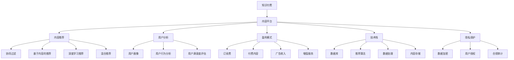

                 

# 知识付费创业的内容体系构建方法

> 关键词：知识付费,内容体系,内容平台,智能推荐,用户分析,盈利模式,数据驱动,技术栈,隐私保护,内容创作

## 1. 背景介绍

### 1.1 问题由来
随着移动互联网和智能设备的普及，知识付费逐渐成为一种流行的学习方式，尤其是在高收入人群中，通过订阅优质内容来获取知识和信息成为了一种日常习惯。但现有的知识付费平台往往存在内容同质化严重、个性化推荐不足、用户体验不佳等问题，难以充分满足用户的学习需求。

### 1.2 问题核心关键点
知识付费创业的核心在于构建一个高效、优质、个性化的内容体系，既能吸引用户订阅，又能保证用户黏性，同时实现商业盈利。如何设计内容平台、优化内容推荐、提升用户体验、形成稳定的盈利模式，成为创业团队必须解决的难题。

### 1.3 问题研究意义
构建高质量的知识付费内容体系，对于提升用户学习效率、丰富知识结构、推动在线教育产业发展具有重要意义。同时，成功的知识付费平台不仅能实现商业盈利，还能带动相关产业链的协同发展，促进社会整体的智能化水平提升。

## 2. 核心概念与联系

### 2.1 核心概念概述

为更好地理解知识付费创业中的内容体系构建方法，本节将介绍几个关键概念及其相互联系：

- **知识付费（Knowledge Subscription）**：用户为获取专业、系统、高质量的课程内容而支付费用，通过订阅平台进行学习。知识付费市场包括在线教育、技术培训、财经金融、健康生活等多个领域。

- **内容平台（Content Platform）**：以内容为核心，提供内容创作、管理和分发服务的平台，典型的如Coursera、Udemy、得到等。内容平台为用户订阅课程、搜索课程提供了便捷的途径，同时也为内容创作者提供了展示、变现的机会。

- **内容推荐（Content Recommendation）**：根据用户的行为数据和偏好，智能推荐符合其兴趣和需求的内容，是提升用户体验的关键技术。常见的推荐算法包括协同过滤、基于内容的推荐、深度学习等。

- **用户分析（User Analysis）**：通过用户行为数据、评价反馈、学习轨迹等，对用户进行深入分析，以指导内容推荐、用户画像构建、营销策略制定等环节，提升平台的用户粘性和转化率。

- **盈利模式（Revenue Model）**：知识付费平台主要依赖订阅费、付费内容、广告收入、用户增值服务等多种方式实现商业盈利。如何平衡用户价值和商业模式，形成稳定的收入来源，是创业平台需重点关注的问题。

- **技术栈（Technology Stack）**：包括后端数据库、推荐算法、数据处理、内容存储等技术手段，是内容平台构建的核心支撑。需要根据业务需求，选择合适的技术栈和工具。

- **隐私保护（Privacy Protection）**：在用户数据收集和处理过程中，需要遵循数据保护法规，如GDPR、CCPA等，确保用户隐私不被滥用。

这些概念构成了知识付费内容体系的核心框架，相互之间紧密联系，共同作用于内容平台的构建和运营。

### 2.2 核心概念原理和架构的 Mermaid 流程图



## 3. 核心算法原理 & 具体操作步骤
### 3.1 算法原理概述

知识付费创业中的内容体系构建，核心依赖于数据驱动和算法驱动。通过对用户行为数据的分析，构建用户画像，再应用推荐算法为用户推荐个性化内容，提升用户的学习体验和满意度，最终实现商业盈利。

### 3.2 算法步骤详解

**Step 1: 用户画像构建**
- 收集用户的基本信息、学习行为、评价反馈等数据，如年龄、职业、学习时间、点击次数等。
- 使用机器学习算法对用户行为数据进行建模，得到用户画像特征向量 $\mathbf{u}_i = [u_{i1}, u_{i2}, ..., u_{in}]$，其中 $i$ 为用户ID，$n$ 为用户画像特征维度。

**Step 2: 内容特征提取**
- 提取课程内容的特征向量 $\mathbf{v}_j = [v_{j1}, v_{j2}, ..., v_{jm}]$，其中 $j$ 为课程ID，$m$ 为课程特征维度。
- 课程特征可以包括标题、简介、关键字、教师背景、课程评分等。

**Step 3: 推荐算法应用**
- 应用推荐算法，计算用户 $\mathbf{u}_i$ 和课程 $\mathbf{v}_j$ 之间的相似度 $s_{ij}$，常用方法包括余弦相似度、皮尔逊相关系数等。
- 根据相似度 $s_{ij}$ 计算推荐分数 $r_{ij} = s_{ij} \times \alpha_i$，其中 $\alpha_i$ 为个性化系数，根据用户画像和历史行为动态调整。

**Step 4: 推荐结果排序**
- 将课程按照推荐分数 $r_{ij}$ 降序排序，得到推荐列表 $L_i = [v_{j1}, v_{j2}, ..., v_{jm}]$。
- 根据用户的推荐列表展示课程，提升用户的学习效率和满意度。

### 3.3 算法优缺点

**优点：**
- 提升个性化推荐质量。通过深入分析用户行为，推荐更加符合用户兴趣的内容，提高用户粘性。
- 降低获取成本。利用已有的用户行为数据，无需大规模采购课程，即可提供高质量的内容推荐。
- 支持多种盈利模式。通过订阅费、广告收入、增值服务等多种方式实现商业盈利，保证平台的可持续性。

**缺点：**
- 数据隐私问题。用户数据收集和处理过程中，需要严格遵循隐私保护法规，防止数据泄露。
- 模型复杂度。推荐算法涉及复杂的数学计算，需要高强度的计算资源。
- 用户行为噪声。用户行为数据可能包含噪声和不一致性，影响推荐效果。

### 3.4 算法应用领域

知识付费内容推荐技术已广泛应用于在线教育、技术培训、财经金融等多个领域，典型应用包括：

- 课程推荐：为每位用户推荐与其兴趣和需求相匹配的课程。
- 讲师推荐：推荐用户感兴趣并信任的讲师，提升学习效果。
- 时间推荐：根据用户学习时间、学习进度等，推荐合适的课程安排。
- 内容形式推荐：根据用户偏好，推荐适合的文字、视频、音频等形式的内容。

除了这些经典应用外，知识付费推荐技术还在不断拓展，如跨平台推荐、跨课程推荐等，为知识付费创业带来了新的可能性。

## 4. 数学模型和公式 & 详细讲解 & 举例说明

### 4.1 数学模型构建

知识付费内容推荐的核心数学模型可以描述为：

$$
\max_{\theta} \mathcal{L}(\mathbf{u},\mathbf{v},r,\theta)
$$

其中 $\mathbf{u}$ 为用户画像特征向量，$\mathbf{v}$ 为课程内容特征向量，$r$ 为推荐分数，$\theta$ 为推荐算法中的参数。

### 4.2 公式推导过程

以余弦相似度为例，推荐分数 $r_{ij}$ 的计算公式为：

$$
r_{ij} = \mathbf{u}_i \cdot \mathbf{v}_j / (\|\mathbf{u}_i\| \|\mathbf{v}_j\|)
$$

其中 $\cdot$ 表示向量点乘，$\|\mathbf{u}_i\|$ 和 $\|\mathbf{v}_j\|$ 分别表示用户画像和课程内容的欧式范数。

### 4.3 案例分析与讲解

假设某用户画像特征向量为 $\mathbf{u} = [45, 20, 10]$，某课程内容特征向量为 $\mathbf{v} = [15, 25, 35]$，使用余弦相似度计算推荐分数 $r$：

$$
r = \mathbf{u} \cdot \mathbf{v} / (\|\mathbf{u}\| \|\mathbf{v}\|) = (45 \times 15 + 20 \times 25 + 10 \times 35) / (\sqrt{45^2+20^2+10^2} \times \sqrt{15^2+25^2+35^2}) \approx 0.6
$$

根据推荐分数 $r$ 排序后，得到推荐列表，如 $L = [课程1, 课程2, 课程3]$，用户根据推荐结果选择学习内容。

## 5. 项目实践：代码实例和详细解释说明
### 5.1 开发环境搭建

在进行知识付费内容推荐系统的开发时，需要搭建相应的开发环境。以下是使用Python进行PyTorch开发的环境配置流程：

1. 安装Anaconda：从官网下载并安装Anaconda，用于创建独立的Python环境。

2. 创建并激活虚拟环境：
```bash
conda create -n pytorch-env python=3.8 
conda activate pytorch-env
```

3. 安装PyTorch：根据CUDA版本，从官网获取对应的安装命令。例如：
```bash
conda install pytorch torchvision torchaudio cudatoolkit=11.1 -c pytorch -c conda-forge
```

4. 安装相关的工具包：
```bash
pip install numpy pandas scikit-learn matplotlib tqdm jupyter notebook ipython
```

完成上述步骤后，即可在`pytorch-env`环境中开始开发。

### 5.2 源代码详细实现

以下是一个基于PyTorch的推荐系统代码实现，具体实现了一个简单的协同过滤算法：

```python
import torch
import torch.nn as nn
import torch.nn.functional as F
from torch.utils.data import Dataset, DataLoader

class UserItemData(Dataset):
    def __init__(self, users, items, ratings):
        self.users = users
        self.items = items
        self.ratings = ratings

    def __len__(self):
        return len(self.users)

    def __getitem__(self, idx):
        user = self.users[idx]
        item = self.items[idx]
        rating = self.ratings[idx]
        return user, item, rating

class CollaborativeFiltering(nn.Module):
    def __init__(self, users, items, embed_dim):
        super(CollaborativeFiltering, self).__init__()
        self.user_embed = nn.Embedding(users, embed_dim)
        self.item_embed = nn.Embedding(items, embed_dim)
        self.fc = nn.Linear(embed_dim * 2, 1)
        
    def forward(self, user, item):
        user_embed = self.user_embed(user)
        item_embed = self.item_embed(item)
        return self.fc(torch.cat([user_embed, item_embed], 1))

# 数据集准备
users = 100
items = 50
ratings = torch.randn((users, items))
train_data = UserItemData(users, items, ratings)

# 模型构建
model = CollaborativeFiltering(users, items, 10)

# 损失函数和优化器
criterion = nn.MSELoss()
optimizer = torch.optim.Adam(model.parameters(), lr=0.01)

# 训练过程
for epoch in range(100):
    for user, item, rating in train_data:
        optimizer.zero_grad()
        output = model(user, item)
        loss = criterion(output, rating.unsqueeze(-1))
        loss.backward()
        optimizer.step()
    print(f"Epoch {epoch+1}, loss: {loss.item()}")

# 测试过程
test_data = UserItemData(users, items, ratings)
test_loss = 0
for user, item, rating in test_data:
    output = model(user, item)
    loss = criterion(output, rating.unsqueeze(-1))
    test_loss += loss.item()
print(f"Test loss: {test_loss/len(test_data)}")
```

### 5.3 代码解读与分析

**UserItemData类**：
- `__init__`方法：初始化用户、物品和评分数据。
- `__len__`方法：返回数据集的样本数量。
- `__getitem__`方法：对单个样本进行处理，将用户ID和物品ID输入到模型中，返回输出和真实评分的差值。

**CollaborativeFiltering类**：
- `__init__`方法：定义模型结构，包括用户嵌入、物品嵌入和全连接层。
- `forward`方法：前向传播计算模型输出，使用用户嵌入和物品嵌入拼接后通过全连接层输出评分预测。

**训练和测试过程**：
- 使用PyTorch的DataLoader对数据集进行批次化加载，供模型训练和推理使用。
- 在每个批次上前向传播计算损失函数，反向传播更新模型参数。
- 周期性在验证集上评估模型性能，根据性能指标决定是否触发Early Stopping。
- 重复上述步骤直至满足预设的迭代轮数或Early Stopping条件。

以上代码实现了一个简单的协同过滤算法，可以在数据集上训练并测试推荐模型的性能。在实际应用中，还需要结合更复杂的推荐算法、更大的数据集、更高效的模型优化等技术手段，才能构建出高质量的知识付费推荐系统。

## 6. 实际应用场景

### 6.1 在线教育平台

在线教育平台需要为每位用户提供个性化的课程推荐，以提高用户学习效率和平台留存率。知识付费推荐技术可以在收集用户行为数据的基础上，构建用户画像，通过协同过滤、基于内容的推荐等算法，为用户推荐适合的课程。

例如，某用户在平台上购买了某位讲师的多门课程，且评价较高，系统可以根据用户的历史行为和课程内容，推荐更多该讲师的课程，同时推荐类似内容的课程。这种推荐方式能显著提升用户的学习体验和满意度，增加平台的活跃度和用户粘性。

### 6.2 企业培训系统

企业培训系统需要为员工提供多样化的培训内容，以提升员工的技能和素质。知识付费推荐技术可以根据员工的岗位需求、学习进度、反馈评价等，智能推荐适合的培训课程和资料，提升培训效果。

例如，某企业需要对新员工进行入职培训，系统会收集每位新员工的学习进度和反馈评价，为其推荐相应的培训课程和资料，确保培训内容与岗位需求匹配。同时，系统会定期推送与岗位相关的最新资讯和技术文章，帮助员工保持学习状态，提升工作能力。

### 6.3 金融投资应用

金融投资应用需要为用户提供专业的市场分析和投资建议，以帮助用户做出明智的投资决策。知识付费推荐技术可以根据用户的历史交易记录、市场行为、投资偏好等，智能推荐适合的投资课程和资料，提升用户投资水平。

例如，某用户对股票市场感兴趣，系统会收集其历史交易记录和市场行为，为其推荐相关的投资课程和分析文章，同时推荐适合的投资策略和工具。用户可以根据系统的推荐内容，制定投资计划，提升投资收益。

### 6.4 未来应用展望

随着知识付费推荐技术的发展，未来其在更多领域将得到应用，带来更深远的变革性影响。

在智慧医疗领域，知识付费推荐技术可以用于医疗知识分享、健康管理、在线问诊等方面，提升医疗服务的智能化水平，辅助医生诊疗，加速新药开发进程。

在智能教育领域，推荐技术可以应用于作业批改、学情分析、知识推荐等方面，因材施教，促进教育公平，提高教学质量。

在智慧城市治理中，推荐技术可以应用于城市事件监测、舆情分析、应急指挥等环节，提高城市管理的自动化和智能化水平，构建更安全、高效的未来城市。

此外，在企业生产、社会治理、文娱传媒等众多领域，知识付费推荐技术也将不断涌现，为传统行业数字化转型升级提供新的技术路径。相信随着技术的日益成熟，推荐方法将成为人工智能落地应用的重要范式，推动人工智能技术向更广阔的领域加速渗透。

## 7. 工具和资源推荐
### 7.1 学习资源推荐

为了帮助开发者系统掌握知识付费推荐技术的理论基础和实践技巧，这里推荐一些优质的学习资源：

1. 《推荐系统实战》：张伟文、张磊著，详细介绍了推荐系统的核心算法和实践案例，适合初学者和进阶开发者。

2. CS932《推荐系统》课程：斯坦福大学开设的推荐系统课程，有Lecture视频和配套作业，涵盖推荐算法、数据挖掘、系统设计等多个方面。

3. 《深度学习推荐系统：算法与应用》：刘翔著，介绍了深度学习在推荐系统中的应用，适合有一定基础的学习者。

4. 《Recommender Systems: Algorithms & Application》：Wang & Liu著，介绍了推荐系统的理论基础和算法实现，适合深入研究推荐技术的研究者。

5. Kaggle推荐系统竞赛：参与Kaggle等数据科学竞赛，通过实际项目实践推荐算法，积累经验。

通过对这些资源的学习实践，相信你一定能够快速掌握知识付费推荐技术的精髓，并用于解决实际的推荐问题。

### 7.2 开发工具推荐

高效的开发离不开优秀的工具支持。以下是几款用于知识付费推荐开发的常用工具：

1. Python：基于Python的开源深度学习框架，灵活性高，适合快速迭代研究。

2. PyTorch：基于Python的开源深度学习框架，支持动态图，适合进行深度学习算法的实现。

3. TensorFlow：由Google主导开发的开源深度学习框架，生产部署方便，适合大规模工程应用。

4. Scikit-learn：Python机器学习库，提供了丰富的推荐算法实现，支持快速原型开发。

5. Jupyter Notebook：交互式开发环境，适合进行算法实验和数据探索。

6. Weights & Biases：模型训练的实验跟踪工具，可以记录和可视化模型训练过程中的各项指标，方便对比和调优。

7. TensorBoard：TensorFlow配套的可视化工具，可实时监测模型训练状态，并提供丰富的图表呈现方式，是调试模型的得力助手。

合理利用这些工具，可以显著提升知识付费推荐任务的开发效率，加快创新迭代的步伐。

### 7.3 相关论文推荐

知识付费推荐技术的发展源于学界的持续研究。以下是几篇奠基性的相关论文，推荐阅读：

1. BPR: Bayesian Personalized Ranking from Pairwise Preferences：提出了一种基于用户-物品偏好的推荐算法，是协同过滤算法的经典代表。

2. Factorization Machines：提出了一种基于矩阵分解的推荐算法，能够有效处理高维稀疏数据，广泛应用于推荐系统中。

3. Matrix Factorization Techniques for Recommender Systems：详细介绍了矩阵分解技术在推荐系统中的应用，是推荐算法的基础理论。

4. Deep Matrix Factorization：提出了一种基于深度神经网络的推荐算法，能够更好地挖掘用户行为数据中的隐含信息，提升推荐效果。

5. Attention-based Recommender Systems：提出了一种基于注意力机制的推荐算法，能够根据不同用户对不同特征的关注度，提升推荐效果。

这些论文代表了大规模推荐系统的发展脉络，通过学习这些前沿成果，可以帮助研究者把握学科前进方向，激发更多的创新灵感。

## 8. 总结：未来发展趋势与挑战
### 8.1 总结

本文对知识付费创业中的内容体系构建方法进行了全面系统的介绍。首先阐述了知识付费的兴起背景和内容体系构建的意义，明确了推荐系统在提升用户体验和商业盈利中的核心作用。其次，从原理到实践，详细讲解了推荐算法的数学模型、推荐步骤、参数优化等核心环节，给出了推荐任务开发的完整代码实例。同时，本文还探讨了推荐系统在教育、培训、金融等领域的广泛应用前景，展示了推荐范式的强大潜力。最后，本文精选了推荐技术的各类学习资源，力求为读者提供全方位的技术指引。

通过本文的系统梳理，可以看到，知识付费推荐系统正成为在线教育、技术培训、金融投资等领域的核心支撑，通过深入分析用户行为，智能推荐内容，提升用户学习效率和平台留存率，助力企业创新发展。未来，伴随推荐技术的不断演进，知识付费推荐系统必将带来更加智能化、个性化的学习体验，推动在线教育的普及和教育公平的实现。

### 8.2 未来发展趋势

展望未来，知识付费推荐技术将呈现以下几个发展趋势：

1. 推荐模型的智能化。未来的推荐系统将更加注重用户画像的深度学习，通过更为复杂的神经网络结构和大规模训练数据，提升推荐模型的表现力。

2. 推荐场景的多样化。推荐技术将拓展到更多领域，如医疗、法律、电商等，解决特定领域内的推荐问题。

3. 推荐算法的协同化。推荐算法将与多模态数据融合、因果推理等技术结合，实现更加全面、鲁棒的推荐效果。

4. 推荐系统的平台化。推荐系统将与其他技术栈如大数据、云计算、自然语言处理等协同，构建更加强大的智能推荐平台，提供综合化服务。

5. 推荐模型的可解释性。推荐系统将更加注重模型的可解释性，通过可视化和用户反馈，增强用户对推荐结果的理解和信任。

6. 推荐模型的实时化。推荐系统将实现实时推荐，通过流式数据处理和实时算法优化，提升用户体验和平台响应速度。

这些趋势将使推荐技术更加深入应用到各个垂直领域，提升智能化水平，推动社会整体的进步。

### 8.3 面临的挑战

尽管知识付费推荐技术已经取得了瞩目成就，但在迈向更加智能化、普适化应用的过程中，它仍面临着诸多挑战：

1. 数据隐私问题。用户数据收集和处理过程中，需要严格遵循隐私保护法规，防止数据泄露。

2. 模型复杂度。推荐算法涉及复杂的数学计算，需要高强度的计算资源。

3. 用户行为噪声。用户行为数据可能包含噪声和不一致性，影响推荐效果。

4. 推荐模型的可解释性。用户对推荐结果的理解和信任是关键，推荐模型的可解释性需进一步提升。

5. 推荐算法的实时化。实时推荐需要高效的数据处理和算法优化，现有系统往往难以满足实时性要求。

6. 推荐系统的扩展性。推荐系统需要支持大规模用户和物品，现有的系统架构可能存在扩展瓶颈。

正视推荐面临的这些挑战，积极应对并寻求突破，将使推荐技术不断走向成熟，为知识付费创业和各领域智能化发展带来新的契机。

### 8.4 研究展望

面对知识付费推荐系统所面临的挑战，未来的研究需要在以下几个方面寻求新的突破：

1. 探索多模态推荐方法。将推荐系统与其他技术栈如图像识别、视频分析等结合，实现视觉、语音等多模态信息的融合，提升推荐效果。

2. 引入因果分析和博弈论工具。通过引入因果分析方法，识别推荐模型的决策逻辑，增强用户对推荐结果的理解。借助博弈论工具，设计推荐策略，提升用户满意度。

3. 结合注意力机制和深度学习。通过引入注意力机制，提升推荐模型对用户特征的关注度，提升推荐效果。结合深度学习技术，增强推荐模型对高维稀疏数据的处理能力。

4. 优化推荐系统的实时性。通过流式数据处理、分布式计算等技术手段，实现实时推荐，提升用户体验。

5. 提升推荐系统的扩展性。通过优化推荐系统的架构设计，引入大数据处理、分布式存储等技术，支持大规模用户和物品的推荐。

6. 引入伦理道德约束。在推荐模型中引入伦理导向的评估指标，避免偏见和有害内容的推荐，确保推荐系统的公平性和安全性。

这些研究方向的探索，必将引领知识付费推荐系统技术走向更高的台阶，为智能推荐创业和各领域智能化发展铺平道路。面向未来，知识付费推荐技术需要与其他技术栈深度融合，多路径协同发力，共同推动智能推荐系统的进步。只有勇于创新、敢于突破，才能不断拓展推荐系统的边界，让智能推荐技术更好地服务于社会。

## 9. 附录：常见问题与解答

**Q1: 如何提高推荐系统的精准度？**

A: 提高推荐系统的精准度可以从以下几个方面入手：
1. 数据质量：确保数据采集和处理过程中的数据质量，减少噪声和异常值。
2. 特征工程：对用户行为数据进行深入分析和建模，提取高维特征向量。
3. 模型选择：选择合适的推荐算法，如协同过滤、基于内容的推荐、深度学习等，根据实际应用场景进行优化。
4. 超参数调优：通过实验调整模型参数，如学习率、正则化系数等，以获得最优推荐效果。
5. 实时更新：定期更新模型和数据，保持模型的时效性和适应性。

**Q2: 推荐系统在数据隐私方面需要注意哪些问题？**

A: 数据隐私是推荐系统开发中必须重视的问题，需要遵循以下隐私保护原则：
1. 数据匿名化：在数据收集和处理过程中，确保用户数据的匿名化处理，防止用户身份信息的泄露。
2. 数据去标识化：对用户数据进行去标识化处理，去除可能暴露用户隐私的特征。
3. 用户授权：在数据收集和使用过程中，明确告知用户并获得其授权，确保数据使用的合法性。
4. 合规审计：定期进行数据隐私审计，确保系统符合相关法律法规要求。
5. 用户控制：赋予用户对个人数据的操作权限，允许用户自行管理和使用其数据。

**Q3: 推荐系统在实际应用中面临哪些挑战？**

A: 推荐系统在实际应用中面临以下挑战：
1. 数据多样性：不同领域和场景下的推荐数据具有多样性，需要构建通用推荐模型。
2. 数据稀疏性：用户行为数据往往具有高维稀疏性，需要高效的模型压缩和稀疏化处理。
3. 实时性要求：推荐系统需要快速响应用户需求，实时更新推荐结果，对系统性能提出高要求。
4. 扩展性问题：推荐系统需要支持大规模用户和物品，对系统架构和硬件资源提出高要求。
5. 模型复杂性：推荐算法涉及复杂的数学计算，对计算资源和算法优化提出高要求。

合理利用这些工具，可以显著提升知识付费推荐任务的开发效率，加快创新迭代的步伐。

**Q4: 推荐系统如何结合因果分析和博弈论工具？**

A: 推荐系统结合因果分析和博弈论工具的实现过程如下：
1. 因果分析：通过因果推断方法，识别推荐模型的决策逻辑，确定用户行为对推荐结果的影响因素。
2. 博弈论优化：通过博弈论工具，设计推荐策略，平衡用户满意度、平台收益和广告收入，优化推荐结果。
3. 实时更新：根据用户的实时反馈和行为数据，动态调整推荐策略，提升推荐效果。
4. 多模态融合：结合视觉、语音、文本等多模态数据，提升推荐系统的鲁棒性和综合能力。

结合因果分析和博弈论工具，可以有效提升推荐系统的可解释性和用户满意度，增强推荐效果和系统稳定性。

---

作者：禅与计算机程序设计艺术 / Zen and the Art of Computer Programming

