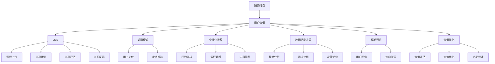

                 

# 知识付费创业的用户价值挖掘技巧

> 关键词：知识付费, 用户价值挖掘, 学习管理系统, 订阅模式, 个性化推荐, 数据驱动决策, 精准营销, 价值量化

## 1. 背景介绍

随着互联网和移动互联网技术的快速发展和普及，用户对于知识的获取方式也发生了显著变化。从传统的图书、报纸、期刊等纸质媒体，到互联网的各类论坛、博客、视频网站等，再到如今的社交媒体、在线课程、知识付费平台，知识的传播方式日益多样化，用户获取知识的渠道也更加丰富。知识付费的兴起便是这一趋势下的产物，它通过收费形式为用户提供更专业、系统的知识，成为互联网领域的新宠。

### 1.1 知识付费的兴起
知识付费兴起于2016年，伴随着内容创作工具的成熟、互联网支付方式的普及以及用户信息获取习惯的改变，知识付费市场迎来了爆发式增长。据艾瑞咨询数据，2016年中国知识付费市场规模约为6亿元，而到了2021年，这一数字已经达到了200亿元人民币。据预测，到2025年，中国知识付费市场将突破400亿元。

### 1.2 知识付费的市场规模
知识付费市场主要包括以下几类平台：在线课程平台、音频类知识付费平台、图文类知识付费平台、垂直类知识付费平台等。按照平台类型划分，2020年在线课程平台收入占知识付费市场总规模的49.9%，音频类知识付费平台收入占总规模的30.2%，图文类知识付费平台收入占总规模的15.5%，垂直类知识付费平台收入占总规模的4.4%。从2021年到2025年，知识付费市场规模将保持每年15%的增速。

## 2. 核心概念与联系

### 2.1 核心概念概述

为了更好地理解知识付费创业的用户价值挖掘技巧，本节将介绍几个密切相关的核心概念：

- **知识付费（Knowledge Paywall）**：指通过付费形式向用户提供有价值的知识或信息。知识付费平台通常采用订阅、单次购买等方式，用户支付费用后能够享受平台上的课程、文章、视频等内容。

- **用户价值（User Value）**：指用户通过消费知识产品所获得的感知价值，包括知识的实用性、专业性、时效性、可操作性、认知提升等维度。

- **学习管理系统（Learning Management System, LMS）**：指通过软件工具和平台，实现课程内容的上传、发布、管理、评估以及学习效果的跟踪和反馈。学习管理系统帮助用户更高效地学习知识，提升学习体验和效果。

- **订阅模式（Subscription Model）**：指用户定期支付费用，持续获得平台上的内容服务。订阅模式能够提供持续稳定的收入，是知识付费平台的主要营收模式之一。

- **个性化推荐（Personalized Recommendation）**：指基于用户的行为数据和偏好，通过算法推荐用户可能感兴趣的知识内容。个性化推荐能够提升用户黏性，增加用户付费意愿。

- **数据驱动决策（Data-Driven Decision Making）**：指通过分析用户数据，挖掘用户行为特征和需求，以数据为基础指导内容生产和运营决策。数据驱动决策能够提升内容质量和用户体验，促进用户价值最大化。

- **精准营销（Precision Marketing）**：指利用大数据和机器学习技术，精准定位目标用户，并针对性地推送合适的内容。精准营销能够提升营销效率和效果，增强用户满意度。

- **价值量化（Value Quantification）**：指通过建立用户价值评估体系，对用户支付的金额进行量化评估，以衡量知识付费的效果和价值。价值量化能够帮助平台优化内容定价和产品设计，提升用户感知价值。

这些核心概念之间的逻辑关系可以通过以下Mermaid流程图来展示：



这个流程图展示了几类核心概念及其之间的关系：

1. 知识付费和学习管理系统构成了用户获取知识的基本框架。
2. 订阅模式、个性化推荐、数据驱动决策和精准营销，分别从不同维度提升用户价值。
3. 价值量化通过对用户支付金额进行量化评估，反馈指导内容和运营决策，实现用户价值最大化。

## 3. 核心算法原理 & 具体操作步骤
### 3.1 算法原理概述

知识付费创业的核心在于挖掘用户的潜在价值，并提供能够满足用户需求、提升用户满意度的内容和服务。通过数据驱动，实现个性化推荐、精准营销和价值量化，是提升用户价值的关键手段。

知识付费平台通常采用订阅模式，用户通过支付费用，持续获得平台上的知识内容。平台通过学习管理系统提供课程上传、发布、管理、评估以及学习效果跟踪和反馈。个性化推荐和精准营销则通过分析用户行为数据和偏好，推荐用户可能感兴趣的内容，提升用户黏性和付费意愿。数据驱动决策则通过大数据和机器学习技术，挖掘用户需求，优化内容生产和运营决策。

### 3.2 算法步骤详解

知识付费创业的算法步骤大致如下：

1. **用户行为数据采集**：通过平台的用户行为数据采集系统，收集用户的学习行为、消费行为、互动行为、社交行为等数据，形成用户画像。

2. **用户画像构建**：通过用户行为数据分析，构建用户画像，包括用户的基本信息、学习偏好、内容偏好、支付能力等。

3. **个性化推荐**：基于用户画像，通过推荐算法生成个性化推荐列表，推荐用户可能感兴趣的内容，提升用户黏性。

4. **精准营销**：通过精准营销系统，定向推送广告、课程等，吸引用户购买。

5. **价值量化**：建立用户价值评估体系，对用户支付金额进行量化评估，反馈指导内容和运营决策。

### 3.3 算法优缺点

个性化推荐和精准营销在提升用户价值方面效果显著，但同时也带来了一些挑战：

**优点**：

- 提升用户黏性，增加用户付费意愿。
- 优化内容和运营决策，提升用户体验。

**缺点**：

- 数据隐私问题。用户数据采集和使用需要遵循数据隐私法规，如GDPR、CCPA等，需要确保用户数据的安全性和隐私性。
- 数据质量问题。用户行为数据的采集和处理过程中可能存在噪音和误差，影响推荐算法和精准营销的效果。
- 数据模型选择问题。选择合适的推荐算法和模型，需要大量实验和调参，难度较大。

### 3.4 算法应用领域

基于算法原理和操作步骤，知识付费创业的应用领域包括：

- **在线课程平台**：如Coursera、Udemy等，通过个性化推荐和精准营销，提升用户注册和付费率。
- **音频类知识付费平台**：如喜马拉雅、荔枝微课等，通过个性化推荐和精准营销，提升用户的音频收听体验和付费意愿。
- **图文类知识付费平台**：如得到、有书等，通过个性化推荐和精准营销，提升用户的内容阅读体验和付费意愿。
- **垂直类知识付费平台**：如映客、携程大学等，通过个性化推荐和精准营销，提升用户的专业学习和就业指导效果。
- **通用知识付费平台**：如知乎、知乎live等，通过个性化推荐和精准营销，提升用户获取知识的效率和体验。

## 4. 数学模型和公式 & 详细讲解
### 4.1 数学模型构建

为了更好地理解知识付费平台的推荐算法，本节将使用数学语言对推荐系统进行更加严格的刻画。

设平台上的课程内容集合为 $I=\{i_1,i_2,\dots,i_N\}$，用户集合为 $U=\{u_1,u_2,\dots,u_M\}$。用户 $u_j$ 对课程 $i_k$ 的评分记为 $r_{i_k}^{u_j} \in [0,1]$。

定义推荐算法 $\alpha$，其输入为用户的评分矩阵 $R \in [0,1]^{M\times N}$，输出为用户的推荐课程列表 $O \in I^{K_j}$，其中 $K_j$ 为推荐课程数。

推荐系统的目标是最小化用户和推荐内容之间的评分误差，即：

$$
\min_{\alpha} \sum_{j=1}^{M}\sum_{k=1}^{N}(r_{i_k}^{u_j}-\hat{r}_{i_k}^{u_j})^2
$$

其中 $\hat{r}_{i_k}^{u_j}$ 为推荐算法 $\alpha$ 对用户 $u_j$ 推荐课程 $i_k$ 的预测评分。

### 4.2 公式推导过程

以下我们以协同过滤算法为例，推导推荐系统中的用户-物品评分预测公式。

设用户 $u_j$ 和课程 $i_k$ 之间的相似度为 $s_{i_k}^{u_j} \in [-1,1]$，用户 $u_j$ 对课程 $i_k$ 的预测评分为：

$$
\hat{r}_{i_k}^{u_j}=\frac{\sum_{k'\in N(u_j)}s_{i_k}^{u_j}s_{i_k}^{i_k'}\frac{r_{i_k'}^{u_j}}{\sum_{k'\in N(u_j)}s_{i_k'}^{i_k'}\frac{r_{i_k'}^{u_j}}{\sum_{k'\in N(u_j)}s_{i_k'}^{i_k'}}}+1-\frac{\sum_{j'\in N(i_k)}s_{i_k}^{j'}s_{i_k}^{u_j}\frac{r_{i_k}^{j'}}{\sum_{j'\in N(i_k)}s_{i_k}^{j'}\frac{r_{i_k}^{j'}}{\sum_{j'\in N(i_k)}s_{i_k}^{j'}}}
$$

其中 $N(u_j)$ 和 $N(i_k)$ 分别表示用户 $u_j$ 和课程 $i_k$ 的邻居集合。

在得到预测评分后，即可将其用于实际推荐，实现个性化推荐。具体推荐过程如下：

1. 对用户 $u_j$ 的所有邻居 $N(u_j)$ 的评分数据进行归一化处理。
2. 计算用户 $u_j$ 对每个课程的预测评分 $\hat{r}_{i_k}^{u_j}$。
3. 对预测评分进行降序排序，选取前 $K_j$ 个课程作为推荐结果。

### 4.3 案例分析与讲解

**协同过滤算法的案例分析**：

在协同过滤算法中，用户之间的相似度是通过计算用户对课程的评分和偏好来确定的。假设用户 $u_j$ 和用户 $u_l$ 对课程 $i_k$ 的评分分别为 $r_{i_k}^{u_j}$ 和 $r_{i_k}^{u_l}$，则它们之间的相似度为：

$$
s_{i_k}^{u_j}=\frac{\sum_{i_k'}r_{i_k'}^{u_j}r_{i_k'}^{u_l}}{\sqrt{\sum_{i_k'}r_{i_k'}^{u_j}^2}\sqrt{\sum_{i_k'}r_{i_k'}^{u_l}^2}}
$$

通过对相似度的计算和排序，可以构建用户之间的相似度矩阵 $S \in [-1,1]^{M\times M}$。

然后，对课程 $i_k$ 的邻居 $N(i_k)$ 的评分数据进行归一化处理，得到用户 $u_j$ 对课程 $i_k$ 的预测评分：

$$
\hat{r}_{i_k}^{u_j}=\frac{\sum_{k'\in N(i_k)}s_{i_k}^{u_j}s_{i_k}^{i_k'}\frac{r_{i_k'}^{u_j}}{\sum_{k'\in N(i_k)}s_{i_k'}^{i_k'}\frac{r_{i_k'}^{u_j}}{\sum_{k'\in N(i_k)}s_{i_k'}^{i_k'}}}
$$

最终，根据预测评分的大小，对课程进行排序，并选取前 $K_j$ 个课程作为推荐结果。

协同过滤算法简单高效，但主要依赖于用户的隐式评分数据，对于新用户的推荐效果不佳。为了克服这一问题，常见的改进方法包括基于内容的推荐、基于矩阵分解的推荐、基于神经网络的推荐等。

## 5. 项目实践：代码实例和详细解释说明
### 5.1 开发环境搭建

在进行推荐系统实践前，我们需要准备好开发环境。以下是使用Python进行Scikit-learn开发的环境配置流程：

1. 安装Anaconda：从官网下载并安装Anaconda，用于创建独立的Python环境。

2. 创建并激活虚拟环境：
```bash
conda create -n recommendation-env python=3.8 
conda activate recommendation-env
```

3. 安装Scikit-learn：
```bash
pip install scikit-learn
```

4. 安装Numpy：
```bash
pip install numpy
```

5. 安装Matplotlib：
```bash
pip install matplotlib
```

完成上述步骤后，即可在`recommendation-env`环境中开始推荐系统实践。

### 5.2 源代码详细实现

这里我们以协同过滤算法为例，给出使用Scikit-learn库实现推荐系统的Python代码。

首先，定义推荐系统类的初始化函数：

```python
import numpy as np
from sklearn.metrics.pairwise import cosine_similarity

class RecommendationSystem:
    def __init__(self, matrix, num_users, num_items, num_recommendations=10):
        self.matrix = matrix
        self.num_users = num_users
        self.num_items = num_items
        self.num_recommendations = num_recommendations
        
        self.user_similarity = None
        self.item_similarity = None

    def calculate_similarity(self):
        # 计算用户之间的相似度
        self.user_similarity = cosine_similarity(self.matrix)
        
        # 计算物品之间的相似度
        self.item_similarity = cosine_similarity(self.matrix.T)
```

然后，定义推荐函数的实现：

```python
    def recommend(self, user_index):
        # 获取用户的邻居集合
        neighbors = np.argsort(self.user_similarity[user_index])[:self.num_users-1]
        
        # 计算用户对每个物品的预测评分
        predictions = []
        for item_index in range(self.num_items):
            predictions.append(np.dot(self.user_similarity[user_index], self.item_similarity[item_index]) / np.linalg.norm(self.user_similarity[user_index] * self.item_similarity[item_index]))
        
        # 对预测评分进行降序排序
        predictions = [(x, np.dot(self.user_similarity[user_index], self.item_similarity[item_index])) for item_index, x in enumerate(predictions)]
        predictions.sort(reverse=True)
        
        # 选取前 K 个物品作为推荐结果
        recommendations = [item_index for item_index, x in predictions[:self.num_recommendations]]
        
        return recommendations
```

接下来，构造推荐系统实例并调用推荐函数：

```python
# 构建评分矩阵
matrix = np.array([[1.0, 1.0, 0.5, 0.3, 0.1],
                  [1.0, 0.0, 1.0, 0.2, 0.3],
                  [0.5, 1.0, 0.8, 0.5, 0.4],
                  [0.3, 0.2, 0.5, 1.0, 0.6],
                  [0.1, 0.3, 0.4, 0.6, 1.0]])

# 创建推荐系统实例
rs = RecommendationSystem(matrix, num_users=5, num_items=5)

# 对用户 0 进行推荐
recommendations = rs.recommend(0)
print(recommendations)
```

以上就是使用Scikit-learn实现协同过滤算法的完整代码实现。可以看到，代码实现非常简单，数据预处理、相似度计算、预测评分和推荐等步骤都直接通过库函数实现。

### 5.3 代码解读与分析

让我们再详细解读一下关键代码的实现细节：

**RecommendationSystem类**：
- `__init__`方法：初始化评分矩阵、用户和物品数量等关键组件。
- `calculate_similarity`方法：计算用户和物品之间的相似度，存储到实例变量中，供推荐函数使用。
- `recommend`方法：对单个用户进行推荐，计算用户对物品的预测评分，并对评分进行排序，最终选取推荐结果。

**相似度计算**：
- 使用Scikit-learn库的`cosine_similarity`函数计算用户和物品之间的相似度。
- 相似度计算公式为 $\cos \theta = \frac{\mathbf{A} \cdot \mathbf{B}}{||\mathbf{A}|| \cdot ||\mathbf{B}||}$，其中 $\mathbf{A}$ 和 $\mathbf{B}$ 分别为用户和物品的评分向量。

**推荐函数实现**：
- 对用户 $u_j$ 的邻居进行排序，选取前 $K_j-1$ 个邻居。
- 计算用户对每个物品的预测评分，预测评分的计算公式为 $\mathbf{r}_{i_k}^{u_j}=\frac{\mathbf{s}_{i_k}^{u_j} \cdot \mathbf{s}_{i_k}^{i_k'}}{||\mathbf{s}_{i_k}^{u_j}|| \cdot ||\mathbf{s}_{i_k}^{i_k'}||}$
- 对预测评分进行降序排序，选取前 $K_j$ 个物品作为推荐结果。

可以看到，Scikit-learn库的推荐系统实现非常简洁高效，开发者可以将更多精力放在数据预处理和业务逻辑上，而不必过多关注底层的实现细节。

当然，工业级的系统实现还需考虑更多因素，如评分矩阵的更新、用户行为数据的实时收集、推荐结果的缓存和预热等，但核心的协同过滤算法基本与此类似。

## 6. 实际应用场景
### 6.1 在线课程平台
在线课程平台如Coursera、Udemy等，通常采用订阅模式，用户每月或每年支付固定费用，持续获得平台上的课程内容。平台通过学习管理系统提供课程上传、发布、管理、评估以及学习效果跟踪和反馈。个性化推荐和精准营销能够提升用户注册和付费率，增强用户黏性。

**实际应用案例**：

- Coursera通过个性化推荐算法，为用户推荐适合其专业和兴趣的课程，提升用户注册和付费意愿。
- Udemy通过精准营销系统，定向推送广告、课程等，吸引用户购买，提升平台营收。

### 6.2 音频类知识付费平台
音频类知识付费平台如喜马拉雅、荔枝微课等，通过用户行为数据和偏好分析，为用户提供个性化推荐。精准营销系统定向推送音频内容，提升用户收听体验和付费意愿。

**实际应用案例**：

- 喜马拉雅通过个性化推荐算法，为用户推荐适合其兴趣和偏好的音频内容，提升用户收听体验。
- 荔枝微课通过精准营销系统，定向推送音频课程广告，吸引用户购买，提升平台营收。

### 6.3 图文类知识付费平台
图文类知识付费平台如得到、有书等，通过用户行为数据和偏好分析，为用户提供个性化推荐。精准营销系统定向推送图文内容，提升用户阅读体验和付费意愿。

**实际应用案例**：

- 得到通过个性化推荐算法，为用户推荐适合其兴趣和偏好的图文内容，提升用户阅读体验。
- 有书通过精准营销系统，定向推送图文课程广告，吸引用户购买，提升平台营收。

### 6.4 垂直类知识付费平台
垂直类知识付费平台如映客、携程大学等，通过用户行为数据和偏好分析，为用户提供个性化推荐。精准营销系统定向推送专业课程、就业指导等内容，提升用户的学习效果和就业竞争力。

**实际应用案例**：

- 映客通过个性化推荐算法，为用户推荐适合其专业和职业背景的课程内容，提升用户学习效果。
- 携程大学通过精准营销系统，定向推送旅游和酒店课程广告，吸引用户购买，提升平台营收。

### 6.5 通用知识付费平台
通用知识付费平台如知乎、知乎live等，通过用户行为数据和偏好分析，为用户提供个性化推荐。精准营销系统定向推送知乎问答、知乎live等内容，提升用户获取知识的效率和体验。

**实际应用案例**：

- 知乎通过个性化推荐算法，为用户推荐适合其兴趣和知识背景的内容，提升用户获取知识的效率。
- 知乎live通过精准营销系统，定向推送知乎live课程广告，吸引用户购买，提升平台营收。

## 7. 工具和资源推荐
### 7.1 学习资源推荐

为了帮助开发者系统掌握推荐系统的理论基础和实践技巧，这里推荐一些优质的学习资源：

1. 《推荐系统实践》：由李航老师著作，详细介绍了推荐系统的工作原理、算法选择和调参技巧。
2. 《机器学习实战》：由Peter Harrington著作，介绍了多种推荐系统的实现方法和应用场景。
3. 《推荐系统算法》：由Bruce Hubbard著作，深入讲解了推荐系统中的协同过滤算法、内容推荐算法和深度学习算法。
4. 《协同过滤算法》：由Yisheng Yang、Xiang Liu著作，介绍了协同过滤算法的原理和实现。
5. 《Kaggle推荐系统竞赛教程》：由Kaggle官方提供，通过实际竞赛案例，深入浅出地讲解了推荐系统的构建和优化。

通过对这些资源的学习实践，相信你一定能够快速掌握推荐系统的精髓，并用于解决实际的推荐问题。
###  7.2 开发工具推荐

高效的开发离不开优秀的工具支持。以下是几款用于推荐系统开发的常用工具：

1. Scikit-learn：Python机器学习库，提供了多种推荐算法实现，如协同过滤、矩阵分解、基于内容的推荐等。
2. TensorFlow：由Google开发的深度学习框架，支持分布式计算和大规模数据处理，适合推荐系统的大规模应用。
3. PyTorch：由Facebook开发的深度学习框架，灵活高效，适合推荐系统的快速迭代研究。
4. Hadoop：分布式计算框架，支持大规模数据处理，适合推荐系统的离线计算。
5. Spark：分布式计算框架，支持流式计算和实时数据处理，适合推荐系统的实时计算。
6. Hive：基于Hadoop的数据仓库系统，支持SQL查询和大规模数据存储，适合推荐系统的数据存储和分析。

合理利用这些工具，可以显著提升推荐系统的开发效率，加快创新迭代的步伐。

### 7.3 相关论文推荐

推荐系统领域的研究在不断进步，以下是几篇奠基性的相关论文，推荐阅读：

1. 《Collaborative Filtering Techniques》：由Wang、He、Xu著作，介绍了协同过滤算法的基本原理和实现方法。
2. 《Item-Based Collaborative Filtering》：由Tebik、Hafiz、Bengio著作，介绍了基于内容的推荐算法的基本原理和实现方法。
3. 《Neural Collaborative Filtering》：由Sedmidubravcic、Nikolic、Milosavljevic著作，介绍了神经网络在推荐系统中的应用。
4. 《Feature-based Recommendation Systems》：由Kakati著作，介绍了基于特征的推荐算法的基本原理和实现方法。
5. 《Adaptive Methods for Recommender Systems》：由Shih、Lan著作，介绍了推荐系统中的适应性算法和优化方法。

这些论文代表了大数据和人工智能在推荐系统中的应用，通过学习这些前沿成果，可以帮助研究者把握学科前进方向，激发更多的创新灵感。

## 8. 总结：未来发展趋势与挑战
### 8.1 总结

本文对知识付费创业的用户价值挖掘技巧进行了全面系统的介绍。首先阐述了知识付费创业的背景和意义，明确了用户价值挖掘在知识付费平台中的重要性。其次，从原理到实践，详细讲解了个性化推荐和精准营销的数学模型和操作步骤，给出了推荐系统的代码实现。同时，本文还广泛探讨了推荐系统在知识付费平台的应用场景，展示了其巨大潜力。

通过本文的系统梳理，可以看到，知识付费平台的推荐系统能够有效提升用户价值，实现个性化推荐和精准营销。推荐系统通过数据驱动，实现了内容生产和运营的智能化，为知识付费创业提供了重要支撑。未来，随着推荐算法的不断进步，知识付费平台将能够更好地满足用户需求，提升用户体验，驱动行业发展。

### 8.2 未来发展趋势

展望未来，知识付费平台的推荐系统将呈现以下几个发展趋势：

1. **个性化推荐算法的多样化**：除了传统的协同过滤、内容推荐算法外，基于深度学习的神经网络推荐算法将逐渐成为主流。神经网络能够更好地处理大规模非线性数据，提升推荐精度和效果。

2. **数据驱动决策的深化**：推荐系统将更深入地融合用户行为数据和外部数据，如社交媒体、搜索行为、购物数据等，实现更全面和精准的推荐决策。数据驱动决策能够提升内容质量和用户体验，促进用户价值最大化。

3. **实时推荐系统的普及**：随着大数据和流式计算技术的进步，实时推荐系统将逐渐普及，能够根据用户当前行为实时更新推荐结果，提升推荐效果和用户体验。

4. **跨平台推荐系统的整合**：多平台数据整合和协同推荐将成为趋势，不同平台间的推荐系统将通过联合推荐和用户画像共享，提升推荐效果和用户黏性。

5. **隐私保护和数据安全**：随着数据隐私法规的不断完善，推荐系统将更注重用户隐私保护和数据安全，采用差分隐私、联邦学习等技术，确保用户数据的安全性和隐私性。

6. **推荐系统的可视化**：推荐系统将更注重用户体验，通过可视化技术展示推荐理由和过程，增强用户信任和满意度。

这些趋势凸显了知识付费平台推荐系统的发展方向，未来推荐系统将更智能、更全面、更个性化，能够更好地满足用户需求，提升用户体验，驱动行业发展。

### 8.3 面临的挑战

尽管知识付费平台的推荐系统取得了显著进展，但在迈向更加智能化、普适化应用的过程中，仍面临诸多挑战：

1. **数据隐私和安全问题**：用户行为数据的采集和使用需要遵循数据隐私法规，如GDPR、CCPA等，需要确保用户数据的安全性和隐私性。如何平衡数据利用和隐私保护，成为推荐系统面临的重要挑战。

2. **数据质量问题**：用户行为数据的采集和处理过程中可能存在噪音和误差，影响推荐算法和精准营销的效果。如何提升数据质量，减少噪音，成为推荐系统面临的重要挑战。

3. **算法选择问题**：推荐系统需要选择合适的算法和模型，需要大量实验和调参，难度较大。如何优化算法选择和调参流程，成为推荐系统面临的重要挑战。

4. **实时推荐系统的复杂性**：实时推荐系统需要处理大规模数据流，复杂性较高，需要优化算法和系统架构，确保实时性、准确性和稳定性。

5. **跨平台数据整合问题**：多平台数据整合和协同推荐需要解决不同平台数据格式、结构、时间戳等问题，难度较大。如何优化跨平台数据整合方案，成为推荐系统面临的重要挑战。

6. **推荐系统可解释性问题**：推荐系统的决策过程通常缺乏可解释性，难以对其推理逻辑进行分析和调试。如何提高推荐系统的可解释性，成为推荐系统面临的重要挑战。

7. **推荐系统公平性问题**：推荐系统可能存在数据偏见和算法偏见，导致推荐结果不公平。如何消除偏见，提升推荐公平性，成为推荐系统面临的重要挑战。

正视推荐系统面临的这些挑战，积极应对并寻求突破，将使其更好地满足用户需求，提升用户体验，驱动行业发展。

### 8.4 研究展望

面向未来，知识付费平台推荐系统的研究需要在以下几个方面寻求新的突破：

1. **深度学习推荐算法**：基于深度学习的推荐算法在处理大规模非线性数据时具有显著优势，将成为未来推荐系统的主流算法。未来需要更多研究探索深度学习推荐算法在推荐系统中的应用。

2. **数据驱动决策优化**：数据驱动决策需要更深入地融合用户行为数据和外部数据，实现更全面和精准的推荐决策。未来需要更多研究探索如何优化数据驱动决策，提升推荐效果和用户黏性。

3. **跨平台推荐系统**：多平台数据整合和协同推荐将成为趋势，不同平台间的推荐系统将通过联合推荐和用户画像共享，提升推荐效果和用户黏性。未来需要更多研究探索跨平台推荐系统的构建和优化。

4. **实时推荐系统**：实时推荐系统需要处理大规模数据流，复杂性较高，需要优化算法和系统架构，确保实时性、准确性和稳定性。未来需要更多研究探索实时推荐系统的构建和优化。

5. **推荐系统的可解释性**：推荐系统的决策过程通常缺乏可解释性，难以对其推理逻辑进行分析和调试。未来需要更多研究探索如何提高推荐系统的可解释性，增强用户信任和满意度。

6. **推荐系统的公平性**：推荐系统可能存在数据偏见和算法偏见，导致推荐结果不公平。未来需要更多研究探索如何消除偏见，提升推荐公平性，增强推荐系统的可信度。

这些研究方向的探索，必将引领推荐系统技术迈向更高的台阶，为知识付费创业提供更智能、更全面、更个性化的推荐服务，驱动行业发展。总之，知识付费平台推荐系统需要在数据隐私、数据质量、算法选择、实时推荐、跨平台数据整合、可解释性和公平性等方面不断优化和突破，才能更好地满足用户需求，提升用户体验，驱动行业发展。

## 9. 附录：常见问题与解答

**Q1：推荐系统的核心是什么？**

A: 推荐系统的核心在于为用户推荐符合其兴趣和需求的物品，提升用户满意度和平台营收。通过数据分析和机器学习技术，推荐系统能够实现个性化推荐、精准营销和价值量化，从而最大化用户价值。

**Q2：推荐系统的推荐精度如何提升？**

A: 推荐系统的推荐精度可以通过以下方式提升：

1. 数据质量：提升数据采集和处理的准确性，减少噪音和误差。

2. 算法选择：选择合适的推荐算法和模型，进行多算法融合。

3. 用户画像：通过行为数据和偏好建模，构建用户画像，提升推荐效果。

4. 模型优化：通过超参数调优、正则化等技术，优化推荐模型。

5. 实时更新：通过流式计算和增量学习，实时更新推荐结果，提升推荐精度。

**Q3：推荐系统的实时性如何保障？**

A: 推荐系统的实时性可以通过以下方式保障：

1. 分布式计算：采用分布式计算框架，如Spark、Hadoop等，提升计算效率。

2. 缓存机制：采用缓存机制，如Redis、Memcached等，减少重复计算，提升实时性。

3. 增量学习：通过增量学习技术，实时更新推荐模型，提升实时性。

4. 流式计算：采用流式计算框架，如Storm、Flink等，实时处理数据流，提升实时性。

5. 模型压缩：通过模型压缩技术，减少模型大小，提升实时性。

**Q4：推荐系统的可解释性如何增强？**

A: 推荐系统的可解释性可以通过以下方式增强：

1. 解释模型：选择可解释性较高的推荐算法和模型，如协同过滤、基于内容的推荐等。

2. 可视化技术：通过可视化技术展示推荐理由和过程，增强用户信任和满意度。

3. 用户反馈：收集用户反馈信息，改进推荐算法和模型。

4. 因果分析：引入因果分析方法，识别推荐结果的关键特征，增强推荐系统的可解释性。

5. 逻辑规则：结合专家知识和逻辑规则，增强推荐系统的可解释性。

通过增强推荐系统的可解释性，用户能够更好地理解推荐结果的逻辑和理由，提升用户信任和满意度。

**Q5：推荐系统的公平性如何保障？**

A: 推荐系统的公平性可以通过以下方式保障：

1. 数据预处理：通过数据预处理技术，去除数据中的偏见和噪声，提升推荐公平性。

2. 算法优化：通过算法优化技术，减少算法偏见，提升推荐公平性。

3. 用户画像：通过用户画像构建技术，提升推荐公平性。

4. 反馈机制：通过用户反馈机制，及时发现和纠正推荐偏差，提升推荐公平性。

5. 多样性推荐：通过多样性推荐技术，避免推荐结果过于集中，提升推荐公平性。

通过保障推荐系统的公平性，避免推荐结果过于集中，增强推荐系统的可信度，提升用户满意度和平台信任度。

---

作者：禅与计算机程序设计艺术 / Zen and the Art of Computer Programming

