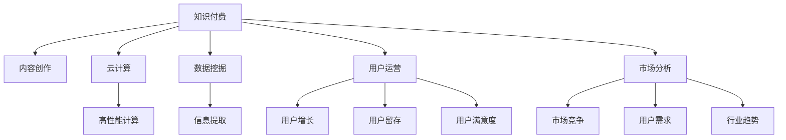

                 

# 知识付费创业者的日常工作安排

> 关键词：知识付费, 创业, 人工智能, 云计算, 数据挖掘, 内容制作, 用户运营, 市场分析

## 1. 背景介绍

### 1.1 问题由来
随着互联网技术的发展和普及，知识付费模式在全球范围内迅速崛起，成为知识传播和消费的重要方式之一。知识付费不仅帮助内容创作者通过专业知识和信息获取回报，同时也为学习者提供了更加高效、精准的学习资源。然而，知识付费行业在发展过程中，也面临着诸多挑战，如内容质量参差不齐、用户粘性不足、市场竞争激烈等问题。作为知识付费创业者的日常工作，如何在纷繁复杂的市场环境中保持竞争优势，高效运营，成为了一个亟待解决的问题。

## 2. 核心概念与联系

### 2.1 核心概念概述

为更好地理解知识付费创业者的日常工作安排，本节将介绍几个密切相关的核心概念：

- 知识付费：指通过互联网平台，向用户提供付费的优质知识和信息服务，实现知识变现。
- 内容创作：指生产高质量、有价值的内容，如文章、视频、课程等，是知识付费服务的基础。
- 云计算：指利用网络基础设施资源，通过互联网提供高性能计算、数据存储等服务。
- 数据挖掘：指从大量数据中提取有用信息，为内容推荐、用户画像分析等提供支撑。
- 用户运营：指通过用户增长、用户留存、用户满意度提升等手段，提升平台的用户基数和使用深度。
- 市场分析：指对市场竞争、用户需求、行业趋势等进行分析和评估，指导产品和服务的发展策略。

这些核心概念之间的逻辑关系可以通过以下Mermaid流程图来展示：



这个流程图展示了这个行业中的核心概念及其之间的关系：

1. 知识付费作为整个行业的核心，依赖于内容创作、云计算、数据挖掘、用户运营和市场分析等多方面的支持。
2. 内容创作是知识付费的基础，云计算提供基础设施支撑，数据挖掘挖掘用户需求和行为数据，用户运营和市场分析则通过数据洞察，指导产品和服务策略，提升用户粘性和市场竞争力。

## 3. 核心算法原理 & 具体操作步骤
### 3.1 算法原理概述

知识付费创业者的日常工作涉及多个领域，包括内容创作、数据分析、用户运营等。本节将介绍一些核心算法和操作原理，帮助理解如何高效执行日常工作。

### 3.2 算法步骤详解

#### 3.2.1 内容创作算法

**步骤1：内容选题与规划**

- 进行市场调研，分析当前热门话题和用户需求。
- 制定选题计划，确定内容类型、主题和形式。

**步骤2：内容制作与优化**

- 撰写文章或制作视频，优化内容结构和呈现效果。
- 进行多轮评审和反馈，不断提升内容质量。

**步骤3：内容分发与推广**

- 选择适合的渠道和平台进行内容发布。
- 利用SEO、社交媒体、广告等手段，提高内容曝光率和点击率。

**步骤4：内容反馈与迭代**

- 收集用户反馈和评价，评估内容效果。
- 根据反馈进行内容优化和调整，提高用户满意度和忠诚度。

#### 3.2.2 用户运营算法

**步骤1：用户获取与增长**

- 制定用户增长策略，如优惠活动、推荐邀请等。
- 利用社交媒体和广告平台，扩大用户基础。

**步骤2：用户留存与活跃度提升**

- 通过推送个性化内容、提醒功能、互动激励等手段，提升用户活跃度。
- 设置会员体系、积分制度等，增强用户粘性。

**步骤3：用户满意度与反馈管理**

- 定期收集用户反馈，进行满意度调查。
- 及时响应和处理用户投诉，提升用户满意度。

#### 3.2.3 数据分析算法

**步骤1：数据收集与存储**

- 使用云平台建立数据仓库，存储用户行为数据、内容访问数据等。

**步骤2：数据挖掘与分析**

- 利用数据挖掘算法，提取有价值的信息和规律。
- 进行用户画像分析、内容表现分析等，指导运营策略。

**步骤3：数据可视化与报告**

- 将分析结果进行可视化展示，生成报表和分析报告。
- 定期进行数据分析和市场报告，为决策提供支撑。

#### 3.2.4 市场分析算法

**步骤1：市场调研与竞争分析**

- 定期进行市场调研，了解行业动态和竞争对手情况。
- 分析竞争对手的市场份额、产品策略等，识别竞争优势和劣势。

**步骤2：用户需求分析**

- 利用数据挖掘算法，分析用户行为和需求。
- 确定用户痛点和兴趣点，指导内容制作和产品开发。

**步骤3：趋势预测与策略调整**

- 利用机器学习模型，进行市场趋势预测。
- 根据预测结果，调整产品和服务策略，保持竞争优势。

### 3.3 算法优缺点

#### 3.3.1 内容创作算法

**优点：**

- 内容创作可以提升用户粘性和平台品牌影响力。
- 通过数据分析和用户反馈，优化内容质量和结构。

**缺点：**

- 内容创作需要大量时间和精力，且优质内容生产成本高。
- 内容同质化风险大，竞争激烈。

#### 3.3.2 用户运营算法

**优点：**

- 用户运营可以提升平台用户基数和活跃度。
- 通过个性化服务和互动激励，增强用户粘性。

**缺点：**

- 用户运营需要持续投入，成本较高。
- 用户反馈和满意度管理需要精细化运营。

#### 3.3.3 数据分析算法

**优点：**

- 数据分析可以提供科学的运营策略，提升决策准确性。
- 数据驱动的运营方式，可以大幅提升运营效率和效果。

**缺点：**

- 数据收集和存储需要投入较多资源。
- 数据隐私和安全性问题需要严格控制。

#### 3.3.4 市场分析算法

**优点：**

- 市场分析可以指导产品和服务策略，避免盲目竞争。
- 通过趋势预测，提前布局市场，把握先机。

**缺点：**

- 市场分析需要持续投入，周期较长。
- 市场变化多端，预测准确性有限。

## 4. 数学模型和公式 & 详细讲解 & 举例说明

### 4.1 数学模型构建

本节将使用数学语言对知识付费创业者的日常工作中的关键算法和操作进行更加严格的刻画。

#### 4.1.1 内容创作数学模型

**步骤1：选题与规划**

- 定义选题数量为 $N$，选题时间窗口为 $T$。
- 建立选题评分模型，评估选题的价值和可行性。
- 引入多目标优化算法，选择最优选题方案。

**步骤2：内容制作与优化**

- 定义内容质量评分模型，评估内容的专业性和吸引力。
- 引入线性回归模型，预测内容质量与用户评价之间的关系。
- 引入A/B测试算法，比较不同内容形式的效果。

**步骤3：内容分发与推广**

- 定义内容曝光率模型，评估内容在各渠道的展示效果。
- 引入回归模型，预测不同推广手段的效果。
- 引入决策树算法，优化推广策略和预算分配。

**步骤4：内容反馈与迭代**

- 定义用户反馈评分模型，评估用户对内容的满意度。
- 引入聚类算法，分析用户反馈中的共性问题。
- 引入迭代优化算法，不断提升内容质量和用户满意度。

#### 4.1.2 用户运营数学模型

**步骤1：用户获取与增长**

- 定义用户增长模型，评估不同增长策略的效果。
- 引入回归模型，预测用户增长与投入成本之间的关系。
- 引入聚类算法，分析用户增长数据中的特征和规律。

**步骤2：用户留存与活跃度提升**

- 定义用户活跃度评分模型，评估用户活跃度水平。
- 引入时间序列分析模型，预测用户活跃度的变化趋势。
- 引入回归模型，预测不同活跃度提升策略的效果。

**步骤3：用户满意度与反馈管理**

- 定义用户满意度评分模型，评估用户对平台的整体满意度。
- 引入回归模型，预测用户满意度与用户反馈之间的关系。
- 引入多分类模型，分类处理用户投诉和建议。

#### 4.1.3 数据分析数学模型

**步骤1：数据收集与存储**

- 定义数据存储模型，评估数据仓库的存储能力和扩展性。
- 引入大数据技术，提升数据存储和查询效率。
- 引入数据清洗算法，保证数据质量。

**步骤2：数据挖掘与分析**

- 定义数据挖掘模型，评估数据挖掘的效果和准确性。
- 引入聚类算法，分析用户行为和内容特征。
- 引入回归模型，预测用户行为和内容表现。

**步骤3：数据可视化与报告**

- 定义数据可视化模型，评估可视化效果和用户接受度。
- 引入可视化工具，生成图表和报表。
- 引入统计分析模型，评估数据报告的效果和可靠性。

#### 4.1.4 市场分析数学模型

**步骤1：市场调研与竞争分析**

- 定义市场调研模型，评估市场调研的效果和深度。
- 引入回归模型，预测市场趋势和竞争对手行为。
- 引入聚类算法，分析竞争对手的优劣势。

**步骤2：用户需求分析**

- 定义用户需求分析模型，评估用户需求和行为特征。
- 引入回归模型，预测用户需求和内容表现之间的关系。
- 引入分类模型，分析用户需求的分类和优先级。

**步骤3：趋势预测与策略调整**

- 定义趋势预测模型，评估趋势预测的效果和可靠性。
- 引入回归模型，预测市场趋势和用户行为。
- 引入决策树算法，优化产品和服务策略。

### 4.2 公式推导过程

以下我们以用户满意度评分模型为例，推导回归模型的公式及其求解过程。

假设用户满意度评分 $y$ 与用户反馈评分 $x_1$、内容质量评分 $x_2$、用户活跃度评分 $x_3$ 之间存在线性关系，可表示为：

$$
y = \alpha_0 + \alpha_1x_1 + \alpha_2x_2 + \alpha_3x_3 + \epsilon
$$

其中 $\alpha_0, \alpha_1, \alpha_2, \alpha_3$ 为回归系数，$\epsilon$ 为随机误差项。

根据最小二乘法，求解回归系数 $\alpha$ 的过程如下：

1. 计算样本均值 $\bar{x}_i$ 和 $\bar{y}$。
2. 计算回归系数 $\alpha_i$ 的估计值：
   $$
   \alpha_i = \frac{\Sigma_{j=1}^n(x_i - \bar{x}_i)(y_j - \bar{y})}{\Sigma_{j=1}^n(x_i - \bar{x}_i)^2}
   $$

3. 求解回归方程的误差平方和 $RSS$，进行模型拟合。

### 4.3 案例分析与讲解

#### 4.3.1 内容创作案例

某知识付费平台通过市场调研，确定选题为“人工智能应用案例分析”，计划在3个月内推出8篇文章。选题评分模型评估结果表明，该选题具有较高的用户需求和市场潜力。

在内容制作与优化阶段，该平台定义了内容质量评分模型，通过专家评审和用户评分，评估每篇文章的专业性和吸引力。线性回归模型分析结果显示，高质量内容的用户评价显著高于低质量内容。

在内容分发与推广阶段，平台选择了社交媒体和搜索引擎优化两种推广手段。决策树算法分析显示，社交媒体推广效果更好，因此平台加大了社交媒体推广的投入。

在内容反馈与迭代阶段，平台收集了大量用户反馈数据，使用聚类算法分析发现，用户普遍反映内容缺乏实例和案例。迭代优化算法生成了一份优化建议报告，建议增加具体实例和案例，提升内容实用性。

#### 4.3.2 用户运营案例

某知识付费平台通过用户增长模型分析，确定优惠活动和推荐邀请两种策略的有效性。回归模型预测显示，优惠活动能够有效提升用户注册率，但推荐邀请的成本较低。

在用户留存与活跃度提升阶段，平台通过时间序列分析模型预测用户活跃度的变化趋势，发现用户活跃度呈现明显的季节性波动。回归模型分析结果显示，个性化推送和互动激励能够有效提升用户活跃度。

在用户满意度与反馈管理阶段，平台使用用户满意度评分模型评估整体满意度水平，回归模型预测显示，用户满意度与用户反馈之间存在显著相关性。多分类模型对用户投诉和建议进行了分类处理，指导平台及时响应用户需求。

#### 4.3.3 数据分析案例

某知识付费平台通过大数据技术建立了用户行为数据仓库，存储了用户点击、购买、评价等行为数据。数据清洗算法去除了异常数据和重复数据，保证了数据质量。

在数据挖掘与分析阶段，平台使用聚类算法分析用户行为和内容特征，发现用户主要集中在科技、教育、健康三个领域。回归模型预测显示，科技领域的内容点击率和购买率最高，因此平台在科技领域投入了更多资源。

在数据可视化与报告阶段，平台使用可视化工具生成了用户行为和内容表现的图表和报表，帮助平台管理层及时了解运营情况和用户需求。

#### 4.3.4 市场分析案例

某知识付费平台通过市场调研模型分析了市场动态和竞争对手情况。回归模型预测显示，竞争对手A的增长速度快于竞争对手B，市场份额更大。聚类算法分析显示，竞争对手A的优势在于优质内容和用户服务。

在用户需求分析阶段，平台使用回归模型预测用户需求和内容表现之间的关系，发现用户对高质量内容的需求较为强烈。分类模型分析显示，用户需求的优先级较高。

在趋势预测与策略调整阶段，平台使用趋势预测模型评估了市场趋势和用户行为，发现用户对科技领域的兴趣持续增长。决策树算法分析结果显示，平台应该在科技领域加大内容制作和推广力度，保持竞争优势。

## 5. 项目实践：代码实例和详细解释说明

### 5.1 开发环境搭建

在进行知识付费创业者的日常工作安排实践前，我们需要准备好开发环境。以下是使用Python进行PyTorch开发的环境配置流程：

1. 安装Anaconda：从官网下载并安装Anaconda，用于创建独立的Python环境。

2. 创建并激活虚拟环境：
```bash
conda create -n pytorch-env python=3.8 
conda activate pytorch-env
```

3. 安装PyTorch：根据CUDA版本，从官网获取对应的安装命令。例如：
```bash
conda install pytorch torchvision torchaudio cudatoolkit=11.1 -c pytorch -c conda-forge
```

4. 安装各类工具包：
```bash
pip install numpy pandas scikit-learn matplotlib tqdm jupyter notebook ipython
```

完成上述步骤后，即可在`pytorch-env`环境中开始实践。

### 5.2 源代码详细实现

这里我们以用户满意度评分模型的实现为例，给出使用Python和PyTorch实现的代码。

首先，定义用户满意度评分模型：

```python
import torch
import torch.nn as nn
import torch.optim as optim

class UserSatisfactionModel(nn.Module):
    def __init__(self, input_dim):
        super(UserSatisfactionModel, self).__init__()
        self.linear1 = nn.Linear(input_dim, 64)
        self.linear2 = nn.Linear(64, 1)
        self.relu = nn.ReLU()

    def forward(self, x):
        x = self.linear1(x)
        x = self.relu(x)
        x = self.linear2(x)
        return x

# 定义回归问题中的损失函数
def mse_loss(y_pred, y_true):
    return torch.mean((y_pred - y_true) ** 2)

# 定义数据加载器
train_dataset = ...
test_dataset = ...

# 定义模型和优化器
model = UserSatisfactionModel(input_dim)
optimizer = optim.Adam(model.parameters(), lr=0.01)
```

然后，训练模型并进行评估：

```python
# 定义训练和评估函数
def train_epoch(model, dataset, optimizer):
    dataloader = torch.utils.data.DataLoader(dataset, batch_size=32, shuffle=True)
    model.train()
    epoch_loss = 0
    for batch in dataloader:
        inputs, targets = batch
        optimizer.zero_grad()
        outputs = model(inputs)
        loss = mse_loss(outputs, targets)
        loss.backward()
        optimizer.step()
        epoch_loss += loss.item()
    return epoch_loss / len(dataloader)

def evaluate(model, dataset):
    dataloader = torch.utils.data.DataLoader(dataset, batch_size=32)
    model.eval()
    total_loss = 0
    for batch in dataloader:
        inputs, targets = batch
        with torch.no_grad():
            outputs = model(inputs)
            loss = mse_loss(outputs, targets)
            total_loss += loss.item()
    return total_loss / len(dataset)

# 训练模型
epochs = 10
for epoch in range(epochs):
    loss = train_epoch(model, train_dataset, optimizer)
    print(f"Epoch {epoch+1}, train loss: {loss:.3f}")
    
# 评估模型
test_loss = evaluate(model, test_dataset)
print(f"Test loss: {test_loss:.3f}")
```

以上就是使用PyTorch实现用户满意度评分模型的完整代码实现。可以看到，得益于PyTorch的强大封装，我们可以用相对简洁的代码完成模型的加载和训练。

### 5.3 代码解读与分析

让我们再详细解读一下关键代码的实现细节：

**UserSatisfactionModel类**：
- `__init__`方法：初始化线性层、激活函数等关键组件。
- `forward`方法：定义前向传播计算过程。
- 通过多个线性层和激活函数，将输入映射到输出。

**mse_loss函数**：
- 定义了均方误差损失函数，用于评估模型预测和真实值之间的差异。
- 使用torch.mean计算样本间的平均损失。

**数据加载器**：
- 通过torch.utils.data.DataLoader，将训练集和测试集数据分批次加载，方便模型训练和评估。
- 可以设置批量大小、打乱数据顺序等参数，控制数据加载行为。

**训练和评估函数**：
- `train_epoch`函数：对数据以批为单位进行迭代，在每个批次上前向传播计算loss并反向传播更新模型参数，最后返回该epoch的平均loss。
- `evaluate`函数：与训练类似，不同点在于不更新模型参数，并在每个batch结束后将预测和标签结果存储下来，最后计算整个评估集上的平均loss。

**训练流程**：
- 定义总的epoch数和批量大小，开始循环迭代
- 每个epoch内，先在训练集上训练，输出平均loss
- 在测试集上评估，输出最终测试结果

可以看到，PyTorch配合机器学习库使得模型训练的代码实现变得简洁高效。开发者可以将更多精力放在数据处理、模型改进等高层逻辑上，而不必过多关注底层的实现细节。

当然，工业级的系统实现还需考虑更多因素，如模型的保存和部署、超参数的自动搜索、更灵活的任务适配层等。但核心的微调范式基本与此类似。

## 6. 实际应用场景

### 6.1 智能客服系统

知识付费平台可以构建智能客服系统，通过自动化回答用户咨询，提升用户满意度和平台运营效率。平台可以使用微调模型对预训练的对话模型进行优化，使其能够快速响应用户问题，并提供详细的答案。

在技术实现上，可以收集企业内部的历史客服对话记录，将问题和最佳答复构建成监督数据，在此基础上对预训练对话模型进行微调。微调后的对话模型能够自动理解用户意图，匹配最合适的答案模板进行回复。对于用户提出的新问题，还可以接入检索系统实时搜索相关内容，动态组织生成回答。如此构建的智能客服系统，能大幅提升客户咨询体验和问题解决效率。

### 6.2 个性化推荐系统

知识付费平台可以通过个性化推荐系统，向用户推荐其感兴趣的内容，提升用户粘性和平台收入。平台可以利用微调模型对用户行为数据进行深度挖掘，识别出用户兴趣和偏好，生成个性化的推荐列表。

在实现上，平台可以收集用户浏览、点击、评论、分享等行为数据，提取和用户交互的物品标题、描述、标签等文本内容。将文本内容作为模型输入，用户的后续行为（如是否点击、购买等）作为监督信号，在此基础上微调预训练语言模型。微调后的模型能够从文本内容中准确把握用户的兴趣点。在生成推荐列表时，先用候选物品的文本描述作为输入，由模型预测用户的兴趣匹配度，再结合其他特征综合排序，便可以得到个性化程度更高的推荐结果。

### 6.3 内容审核系统

知识付费平台需要对用户提交的内容进行审核，以确保内容质量和合规性。平台可以使用微调模型对预训练的内容审核模型进行优化，使其能够快速准确地识别出低质量和不合规内容。

在技术实现上，平台可以收集标注有低质量和不合规标记的文本数据，将标注数据作为监督数据，在此基础上对预训练的内容审核模型进行微调。微调后的模型能够自动分析文本内容，识别出低质量和不合规的文本。平台可以将微调后的模型集成到审核系统，对用户提交的内容进行自动化审核，提升审核效率和准确性。

### 6.4 未来应用展望

随着知识付费行业的不断发展和技术的进步，基于微调的方法将在更多领域得到应用，为平台提供新的增长点。

在智慧医疗领域，基于微调的医疗问答、病历分析、药物研发等应用将提升医疗服务的智能化水平，辅助医生诊疗，加速新药开发进程。

在智能教育领域，微调技术可应用于作业批改、学情分析、知识推荐等方面，因材施教，促进教育公平，提高教学质量。

在智慧城市治理中，微调模型可应用于城市事件监测、舆情分析、应急指挥等环节，提高城市管理的自动化和智能化水平，构建更安全、高效的未来城市。

此外，在企业生产、社会治理、文娱传媒等众多领域，基于大模型微调的人工智能应用也将不断涌现，为经济社会发展注入新的动力。相信随着技术的日益成熟，微调方法将成为知识付费行业的重要范式，推动知识付费技术向更广阔的领域加速渗透。

## 7. 工具和资源推荐
### 7.1 学习资源推荐

为了帮助知识付费创业者系统掌握微调理论基础和实践技巧，这里推荐一些优质的学习资源：

1. 《深度学习与人工智能》系列书籍：涵盖深度学习、机器学习、计算机视觉、自然语言处理等多个领域的经典教材。

2. 《Python深度学习》课程：由Google开发，详细讲解了PyTorch等深度学习框架的实现原理和应用方法。

3. Kaggle竞赛：参与Kaggle等数据科学竞赛，获取实战经验，提升数据处理和模型优化能力。

4. TensorFlow官方文档：提供TensorFlow框架的详细教程和代码示例，适合深入学习深度学习框架。

5. Weights & Biases：监控模型训练过程，生成实验报告，帮助开发者及时发现和解决问题。

通过这些资源的学习实践，相信你一定能够快速掌握微调的精髓，并用于解决实际的NLP问题。

### 7.2 开发工具推荐

高效的开发离不开优秀的工具支持。以下是几款用于知识付费创业者的日常工作安排开发的常用工具：

1. Python：Python是最常用的编程语言之一，适合数据处理、模型训练、算法开发等。

2. PyTorch：基于Python的开源深度学习框架，灵活性和扩展性强，适合快速迭代研究。

3. TensorFlow：由Google主导开发的开源深度学习框架，支持多种硬件平台，适合大规模工程应用。

4. Weights & Biases：监控模型训练过程，生成实验报告，帮助开发者及时发现和解决问题。

5. TensorBoard：TensorFlow配套的可视化工具，可实时监测模型训练状态，并提供丰富的图表呈现方式。

6. Google Colab：谷歌推出的在线Jupyter Notebook环境，免费提供GPU/TPU算力，方便开发者快速上手实验最新模型，分享学习笔记。

合理利用这些工具，可以显著提升知识付费创业者的日常工作安排的开发效率，加快创新迭代的步伐。

### 7.3 相关论文推荐

知识付费创业者在日常工作中需要不断学习最新的研究成果和技术进展，以下是几篇奠基性的相关论文，推荐阅读：

1. Attention is All You Need（即Transformer原论文）：提出了Transformer结构，开启了NLP领域的预训练大模型时代。

2. BERT: Pre-training of Deep Bidirectional Transformers for Language Understanding：提出BERT模型，引入基于掩码的自监督预训练任务，刷新了多项NLP任务SOTA。

3. Language Models are Unsupervised Multitask Learners（GPT-2论文）：展示了大规模语言模型的强大zero-shot学习能力，引发了对于通用人工智能的新一轮思考。

4. Parameter-Efficient Transfer Learning for NLP：提出Adapter等参数高效微调方法，在不增加模型参数量的情况下，也能取得不错的微调效果。

5. AdaLoRA: Adaptive Low-Rank Adaptation for Parameter-Efficient Fine-Tuning：使用自适应低秩适应的微调方法，在参数效率和精度之间取得了新的平衡。

这些论文代表了大模型微调技术的发展脉络。通过学习这些前沿成果，可以帮助知识付费创业者把握学科前进方向，激发更多的创新灵感。

## 8. 总结：未来发展趋势与挑战

### 8.1 总结

本文对知识付费创业者的日常工作安排进行了全面系统的介绍。首先阐述了知识付费行业的发展背景和面临的挑战，明确了微调在内容创作、用户运营、数据分析等方面的核心作用。其次，从原理到实践，详细讲解了微调算法和操作流程，给出了完整的代码实现。同时，本文还广泛探讨了微调方法在智能客服、个性化推荐、内容审核等多个行业领域的应用前景，展示了微调范式的巨大潜力。此外，本文精选了微调技术的各类学习资源，力求为知识付费创业者提供全方位的技术指引。

通过本文的系统梳理，可以看到，微调方法正在成为知识付费创业者的重要工具，极大地提升了平台的运营效率和用户体验。在用户增长、用户留存、内容制作、数据分析等方面，微调方法均表现出色，推动了知识付费行业的快速发展。未来，伴随微调技术的进一步演进，知识付费行业必将迎来更多创新和突破，为学习者和社会带来更多价值。

### 8.2 未来发展趋势

展望未来，知识付费创业者的日常工作安排将呈现以下几个发展趋势：

1. 微调技术与AI辅助工具的结合。未来的知识付费平台将更多地应用AI辅助工具，如智能客服、个性化推荐、内容审核等，提升平台运营效率和用户体验。

2. 数据驱动的决策管理。知识付费创业者将更加重视数据驱动的决策管理，通过数据挖掘和分析，提升运营效率和效果。

3. 多领域知识的融合。知识付费创业者将更多地融合多领域知识，如医学、法律、金融等，提升平台的专业性和市场竞争力。

4. 用户个性化服务的深化。知识付费平台将更加注重用户个性化服务，通过微调模型和个性化推荐，满足用户多样化需求。

5. 市场变化的快速响应。知识付费创业者将更加注重市场变化的快速响应，通过微调模型和动态调整策略，把握市场机会。

以上趋势凸显了知识付费行业的广阔前景。这些方向的探索发展，必将进一步提升知识付费平台的运营效率和用户体验，推动行业向更加智能化、个性化、市场化方向迈进。

### 8.3 面临的挑战

尽管知识付费创业者在日常工作中已经广泛应用微调方法，但在迈向更加智能化、普适化应用的过程中，它仍面临诸多挑战：

1. 内容质量和数量瓶颈。尽管微调可以提升内容质量，但优质内容的生产仍然需要大量时间和资源。如何高效产出高质量内容，仍是知识付费创业者需要解决的重要问题。

2. 用户需求多样性。知识付费平台的用户需求日益多样化，如何针对不同用户需求提供个性化服务，提升用户粘性，仍需深入研究和实践。

3. 技术迭代速度快。知识付费行业竞争激烈，技术迭代速度快，如何及时跟进最新技术，保持平台竞争力，需要不断学习和创新。

4. 数据隐私和安全问题。用户行为数据和内容数据涉及隐私和版权，如何保证数据隐私和安全，防止数据滥用，是知识付费创业者需要关注的重要问题。

5. 系统稳定性和可用性。知识付费平台需要保证系统稳定性和可用性，避免因技术问题影响用户体验。

以上挑战需要知识付费创业者在内容创作、用户运营、数据分析等方面持续优化和改进，才能在激烈的市场竞争中保持领先地位。

### 8.4 研究展望

面对知识付费创业者日常工作中面临的挑战，未来的研究需要在以下几个方面寻求新的突破：

1. 内容生成和智能创作。利用自然语言生成技术，提升内容自动创作能力，减少内容生产时间。

2. 用户行为分析与预测。通过深度学习模型，分析用户行为数据，预测用户需求和行为变化趋势。

3. 多模态内容融合。结合图像、视频、音频等多模态数据，提升内容展示和用户体验。

4. 智能客服和个性化推荐。利用自然语言理解和推荐系统技术，提升智能客服和个性化推荐的效果和用户满意度。

5. 数据隐私保护与合规性。通过差分隐私、联邦学习等技术，保护用户隐私，满足法律法规要求。

这些研究方向的探索，必将推动知识付费行业的持续创新和优化，为知识传播和消费带来更多便利和价值。

## 9. 附录：常见问题与解答

**Q1：知识付费创业者日常工作中如何高效管理内容创作？**

A: 知识付费创业者可以采用以下策略进行高效内容创作管理：

1. 选题规划：进行市场调研，分析当前热门话题和用户需求，制定选题计划，确定内容类型、主题和形式。

2. 多轮评审：通过专家评审和用户反馈，评估选题和内容的质量，及时进行调整和优化。

3. 批量生产：利用自动化工具和流水线作业，提高内容生产效率，降低人工成本。

4. 数据驱动：利用用户行为数据和内容表现数据，进行内容推荐和优化，提升内容效果。

**Q2：如何优化知识付费平台的用户运营策略？**

A: 知识付费创业者可以采用以下策略进行优化：

1. 用户增长：制定优惠活动和推荐邀请等策略，提升用户注册率和活跃度。

2. 用户留存：通过个性化推送、互动激励等方式，提升用户粘性，防止用户流失。

3. 用户满意度：定期收集用户反馈，进行满意度调查，及时响应和处理用户投诉，提升用户满意度。

4. 多渠道运营：通过多平台多渠道推广，提升用户覆盖率和平台影响力。

**Q3：如何利用数据挖掘和分析提升知识付费平台的运营效率？**

A: 知识付费创业者可以采用以下策略进行提升：

1. 数据收集：利用云平台建立数据仓库，存储用户行为数据、内容访问数据等。

2. 数据清洗：使用数据清洗算法去除了异常数据和重复数据，保证数据质量。

3. 数据挖掘：利用聚类算法、回归模型等，挖掘用户行为和内容特征，识别出用户兴趣和偏好。

4. 数据分析：通过多分类模型、回归模型等，分析用户行为和内容表现，指导运营策略。

**Q4：知识付费平台如何利用市场分析指导产品和服务策略？**

A: 知识付费创业者可以采用以下策略进行指导：

1. 市场调研：定期进行市场调研，了解行业动态和竞争对手情况。

2. 用户需求分析：利用数据挖掘算法，分析用户行为和需求，确定用户痛点和兴趣点。

3. 趋势预测：利用机器学习模型，进行市场趋势预测，提前布局市场。

4. 策略调整：根据预测结果，调整产品和服务策略，保持竞争优势。

**Q5：知识付费平台如何平衡数据隐私和用户需求？**

A: 知识付费创业者可以采用以下策略进行平衡：

1. 数据匿名化：对用户数据进行匿名化处理，保护用户隐私。

2. 合规性：遵守相关法律法规，如GDPR、CCPA等，确保数据合规性。

3. 差分隐私：利用差分隐私技术，保护用户数据不被滥用。

4. 用户授权：明确告知用户数据使用方式，获得用户授权，提升用户信任感。

通过以上问题的详细解答，知识付费创业者可以更好地理解如何在日常工作中应用微调方法，提升平台运营效率和用户体验。相信随着技术的发展和研究的深入，知识付费行业必将迎来更多的创新和突破，为学习者和社会带来更多价值。

