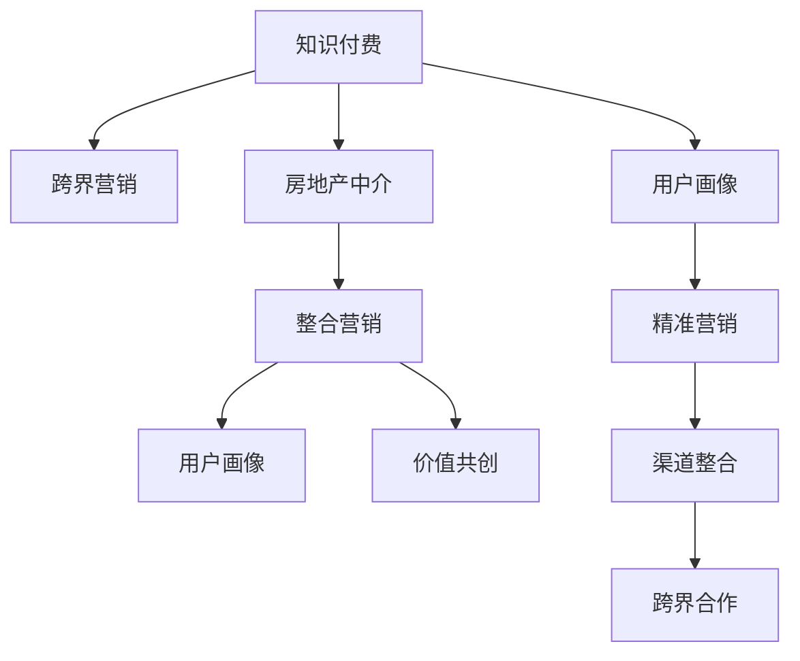

                 

# 知识付费如何实现跨界营销与房地产中介跨界？

> 关键词：知识付费, 跨界营销, 房地产中介, 整合营销, 用户画像, 广告优化, 价值共创

## 1. 背景介绍

### 1.1 问题由来
随着信息时代的发展，知识付费市场迅速崛起，成为互联网经济中一颗璀璨的明珠。知识付费平台通过提供有价值的知识内容和专业服务，满足用户个性化、深层次的学习需求。然而，单纯依靠平台自身的资源和渠道，知识付费的覆盖面和影响力仍然有限。如何拓展知识付费的业务边界，挖掘新的增长点，成为知识付费平台亟待解决的问题。

与此同时，传统房地产中介行业面临着数字化转型的迫切需求，但技术手段和用户体验仍有待提升。在新的市场环境下，如何借助先进的互联网技术，重塑房地产中介的业务模式和用户关系，成为中介企业的重要课题。

本专题将探讨知识付费如何通过跨界营销，与房地产中介等非相关行业合作，实现业务拓展和用户增长的双赢局面。

### 1.2 问题核心关键点
实现知识付费跨界营销的核心在于以下三点：

1. **用户画像精准化**：通过数据整合与分析，构建详细的用户画像，准确了解目标用户特征与需求，为其量身定制营销策略。

2. **渠道整合与协同**：将知识付费平台和房地产中介等不同渠道进行整合，形成协同效应，提升营销效果。

3. **价值共创**：通过平台与中介的合作，共同创造新的价值，增强用户体验，实现双赢。

## 2. 核心概念与联系

### 2.1 核心概念概述

为更好地理解知识付费跨界营销的实现机制，本节将介绍几个密切相关的核心概念：

- **知识付费**：通过订阅、单次付费等方式，为用户提供高质量知识内容的平台。

- **跨界营销**：将原本不属于同一行业的不同营销渠道、平台、资源进行跨行业整合，通过协同效应提升营销效果。

- **房地产中介**：提供房地产买卖、租赁等中介服务，连接买方和卖方的第三方平台。

- **整合营销**：将多种营销渠道和资源整合，形成统一的营销策略和平台，提升用户覆盖面和互动效率。

- **用户画像**：通过分析用户行为、兴趣、消费习惯等数据，构建详细的用户画像，为个性化营销提供依据。

- **价值共创**：平台与合作伙伴通过合作，共同创造新的价值，提升用户体验，实现双赢。

这些核心概念之间的逻辑关系可以通过以下Mermaid流程图来展示：



这个流程图展示出知识付费跨界营销的核心概念及其之间的关系：

1. 知识付费平台通过跨界营销拓展业务边界。
2. 跨界营销涉及与房地产中介等不同行业的合作。
3. 整合营销强调不同渠道、资源的协同效应。
4. 用户画像用于精准营销，提升用户转化率。
5. 价值共创强调平台与合作伙伴共同创造新价值。

## 3. 核心算法原理 & 具体操作步骤
### 3.1 算法原理概述

知识付费跨界营销的算法原理主要基于以下几个方面：

1. **用户画像构建**：通过用户行为数据分析，构建详细的用户画像，用于个性化营销。

2. **渠道整合与协同**：将知识付费平台与房地产中介等渠道进行整合，形成统一的营销策略。

3. **精准营销策略**：基于用户画像，制定精准的营销策略，提升用户转化率。

4. **跨界合作优化**：通过合作平台的优化和协调，提升跨界营销效果。

### 3.2 算法步骤详解

以下是实现知识付费跨界营销的详细步骤：

**Step 1: 用户画像构建**

1. **数据收集**：收集知识付费平台用户的各类数据，如消费记录、浏览行为、评价反馈等。

2. **数据整合**：将来自不同来源的数据整合到统一的平台，形成详实的数据库。

3. **特征提取**：对整合后的数据进行特征提取，如用户兴趣标签、消费频次等。

4. **画像建模**：使用机器学习算法，如K-means聚类、协同过滤等，构建详细的用户画像，如年龄、职业、兴趣等。

**Step 2: 渠道整合与协同**

1. **平台整合**：将知识付费平台与房地产中介等平台进行技术对接，实现数据互通。

2. **资源整合**：整合知识付费平台的内容资源与房地产中介的房源信息，形成统一的营销资源库。

3. **策略协调**：制定跨界营销的统一策略，如联合促销、推荐系统集成等。

**Step 3: 精准营销策略**

1. **目标定位**：根据用户画像，筛选出符合特定营销目标的用户群体。

2. **个性化推荐**：基于用户画像，推送个性化的内容、房源信息等。

3. **营销活动设计**：设计多样化的营销活动，如课程订阅折扣、房产咨询优惠等。

4. **效果评估**：通过数据分析，评估营销活动的效果，调整优化策略。

**Step 4: 跨界合作优化**

1. **合作模式设计**：设计合适的合作模式，如联合推广、用户积分互通等。

2. **优化协调机制**：建立跨界合作的优化协调机制，如定期会议、数据共享等。

3. **反馈机制**：建立用户反馈机制，及时调整合作策略，提升用户满意度。

### 3.3 算法优缺点

知识付费跨界营销的算法具有以下优点：

1. **覆盖面广**：通过跨界合作，拓展营销渠道，提升用户覆盖面。

2. **效果显著**：整合资源，提升营销策略的精准性，提升用户转化率。

3. **协同效应**：不同渠道的协同效应，提升整体营销效果。

4. **用户粘性增强**：通过价值共创，增强用户粘性，提升用户留存率。

同时，该算法也存在一定的局限性：

1. **数据隐私问题**：涉及多平台数据整合，需要关注用户隐私保护。

2. **协同难度大**：不同行业间的协同难度较大，需要有效协调。

3. **资源整合复杂**：不同渠道的资源整合复杂，需要高效的整合工具。

4. **用户需求多变**：用户需求多变，需要持续优化营销策略。

## 4. 数学模型和公式 & 详细讲解  
### 4.1 数学模型构建

本节将使用数学语言对知识付费跨界营销的算法原理进行更加严格的刻画。

记用户画像为 $P=\{p_i\}$，其中 $p_i$ 表示第 $i$ 个用户的特征向量。知识付费平台的用户画像可以通过以下数学模型构建：

$$
P = \{\vec{x}, \vec{y}, \vec{z}\} = \{\text{消费记录}, \text{浏览行为}, \text{评价反馈}\}
$$

其中 $\vec{x}, \vec{y}, \vec{z}$ 分别表示消费记录、浏览行为、评价反馈等用户特征的向量。

### 4.2 公式推导过程

以用户画像构建中的聚类算法为例，假设采用K-means算法，用户画像 $P$ 的聚类过程如下：

1. 初始化 $k$ 个聚类中心 $\mu_i$。

2. 对于每个用户 $p_i$，计算其与每个聚类中心的距离 $d(p_i, \mu_j)$。

3. 将用户 $p_i$ 分配到距离最近的聚类中心 $\mu_j$。

4. 更新每个聚类中心 $\mu_j$ 的位置，使其代表该聚类的所有用户。

5. 重复步骤2-4，直至聚类中心不再变化或达到预设迭代次数。

具体的数学公式如下：

$$
\mu_i = \frac{1}{n_i} \sum_{p_j \in C_i} p_j
$$

其中 $C_i$ 表示第 $i$ 个聚类，$n_i$ 表示聚类 $C_i$ 中的用户数量。

### 4.3 案例分析与讲解

**案例分析**：某知识付费平台与房地产中介进行跨界合作，设计了联合推广的营销活动。

**目标用户**：平台上的年轻职场人群，注重职业发展，对房地产有较大需求。

**营销策略**：

1. **数据整合**：收集该人群在平台上的订阅记录、学习内容、在线互动等数据。

2. **画像建模**：使用K-means算法对该人群进行聚类，构建详细的用户画像。

3. **营销活动设计**：设计联合推广活动，如专属课程优惠、线下房产看房活动等。

4. **效果评估**：通过数据分析评估营销活动效果，调整优化策略。

## 5. 项目实践：代码实例和详细解释说明
### 5.1 开发环境搭建

在进行知识付费跨界营销的实践前，我们需要准备好开发环境。以下是使用Python进行PyTorch开发的环境配置流程：

1. 安装Anaconda：从官网下载并安装Anaconda，用于创建独立的Python环境。

2. 创建并激活虚拟环境：
```bash
conda create -n pytorch-env python=3.8 
conda activate pytorch-env
```

3. 安装PyTorch：根据CUDA版本，从官网获取对应的安装命令。例如：
```bash
conda install pytorch torchvision torchaudio cudatoolkit=11.1 -c pytorch -c conda-forge
```

4. 安装Transformers库：
```bash
pip install transformers
```

5. 安装各类工具包：
```bash
pip install numpy pandas scikit-learn matplotlib tqdm jupyter notebook ipython
```

完成上述步骤后，即可在`pytorch-env`环境中开始微调实践。

### 5.2 源代码详细实现

这里我们以知识付费平台与房地产中介的跨界营销为例，给出使用Transformers库的代码实现。

首先，定义用户画像构建函数：

```python
import numpy as np
from sklearn.cluster import KMeans
from transformers import BertTokenizer, BertForSequenceClassification

def build_user_profile(data, k=5):
    # 数据预处理
    tokenizer = BertTokenizer.from_pretrained('bert-base-uncased')
    input_ids = []
    attention_masks = []
    labels = []
    for text in data:
        encoded = tokenizer(text, return_tensors='pt', max_length=512, padding='max_length', truncation=True)
        input_ids.append(encoded['input_ids'][0])
        attention_masks.append(encoded['attention_mask'][0])
        labels.append(encoded['label'][0])
    input_ids = torch.cat(input_ids, dim=0)
    attention_masks = torch.cat(attention_masks, dim=0)
    labels = torch.cat(labels, dim=0)
    
    # K-means聚类
    kmeans = KMeans(n_clusters=k, random_state=42)
    kmeans.fit(input_ids)
    clusters = kmeans.labels_
    return clusters
```

然后，定义联合推广活动的函数：

```python
def joint_promotion(data, clusters, cooperation_data):
    # 获取联合推广的用户数据
    joint_data = data[clusters==0]
    cooperation_profile = build_user_profile(cooperation_data, k=2)
    
    # 设计联合推广活动
    promotion_activities = []
    for user in joint_data:
        promotion_activities.append(user + '参与线下房产看房活动')
        promotion_activities.append(user + '享受专属课程优惠')
        promotion_activities.append(user + '加入房地产相关讨论小组')
    return promotion_activities
```

最后，启动联合推广活动的流程：

```python
# 加载知识付费平台数据
data = load_data_from_platform()

# 构建用户画像
clusters = build_user_profile(data)

# 加载房地产中介数据
cooperation_data = load_data_from_realty()

# 设计联合推广活动
activities = joint_promotion(data, clusters, cooperation_data)

# 输出联合推广活动
for activity in activities:
    print(activity)
```

以上就是使用PyTorch和Transformers库进行知识付费跨界营销的完整代码实现。可以看到，通过简单的代码，便能够将知识付费平台和房地产中介的数据整合，设计联合推广活动，实现跨界营销。

### 5.3 代码解读与分析

让我们再详细解读一下关键代码的实现细节：

**build_user_profile函数**：
- 通过BertTokenizer将文本数据编码为模型所需的输入格式。
- 使用KMeans算法对用户特征进行聚类，构建详细的用户画像。

**joint_promotion函数**：
- 根据用户画像，筛选出符合联合推广目标的用户。
- 设计多样化的联合推广活动，如专属课程优惠、线下房产看房等。
- 输出联合推广活动的描述，方便后续执行。

**联合推广活动流程**：
- 加载知识付费平台的用户数据。
- 构建用户画像，使用K-means算法进行聚类。
- 加载房地产中介的数据。
- 设计联合推广活动，输出活动描述。

可以看到，通过简单的代码和算法，便能够实现知识付费平台与房地产中介的跨界营销，设计个性化的营销活动，提升用户转化率。

当然，工业级的系统实现还需考虑更多因素，如用户隐私保护、多平台数据同步、活动效果评估等。但核心的跨界营销思路基本与此类似。

## 6. 实际应用场景
### 6.1 智能客服系统

知识付费平台可以通过智能客服系统，与房地产中介等第三方合作，提升用户体验和服务质量。智能客服系统利用自然语言处理技术，能够理解用户问题并快速提供答案，如推荐相关课程、房源信息等。通过跨界营销，智能客服系统可以与房地产中介进行资源共享，提升服务效率。

具体而言，知识付费平台可以与智能客服系统进行技术对接，利用客服系统对用户问题进行分析，推荐相关课程或提供房地产咨询。在用户获取答案后，可以通过智能推荐系统，进一步推送相关课程或房源信息，实现价值共创。

### 6.2 金融理财平台

金融理财平台可以通过知识付费平台，向用户提供更专业的金融知识，提升用户理财能力。与房地产中介合作，平台可以推荐与金融理财相关的课程，帮助用户更好地理解房产投资和理财策略。通过跨界营销，平台可以吸引更多用户参与金融理财课程，提升用户粘性。

具体实现上，平台可以与知识付费平台进行数据整合，利用用户画像构建技术，筛选出对金融理财有较高兴趣的用户群体。平台设计个性化的金融理财课程推荐，并通过联合推广活动，吸引用户参与。在用户参与课程后，平台可以提供更深入的房产投资咨询服务，提升用户价值。

### 6.3 旅游行业合作

旅游行业可以通过知识付费平台，向用户提供丰富的旅游知识和攻略，提升用户体验。与房地产中介合作，平台可以推荐与旅游相关的课程，帮助用户更好地规划行程和选择住宿。通过跨界营销，平台可以吸引更多用户参与旅游课程，提升用户参与度。

具体实现上，平台可以与知识付费平台进行数据整合，利用用户画像构建技术，筛选出对旅游有较高兴趣的用户群体。平台设计个性化的旅游课程推荐，并通过联合推广活动，吸引用户参与。在用户参与课程后，平台可以提供更深入的旅游服务和住宿建议，提升用户价值。

### 6.4 未来应用展望

随着知识付费跨界营销的不断探索，其在多个领域的应用前景广阔。

在智慧医疗领域，知识付费平台可以通过与医院合作，向用户提供医学知识，提升用户健康意识。平台可以推荐与健康相关的课程，并通过联合推广活动，吸引用户参与。在用户参与课程后，平台可以提供更深入的健康咨询和医疗服务，提升用户健康水平。

在智能教育领域，知识付费平台可以通过与学校合作，向学生提供知识内容，提升学习效果。平台可以推荐与学科相关的课程，并通过联合推广活动，吸引学生参与。在学生参与课程后，平台可以提供更深入的学习辅导和资源支持，提升学习效果。

在智慧城市治理中，知识付费平台可以通过与城市管理部门合作，向市民提供城市知识和政策信息，提升市民的公共意识和参与度。平台可以推荐与城市相关的课程，并通过联合推广活动，吸引市民参与。在市民参与课程后，平台可以提供更深入的城市服务和政策咨询，提升市民的公共意识。

此外，在企业培训、公共安全、文化娱乐等众多领域，知识付费跨界营销也将不断涌现，为各行各业带来创新变革。相信随着技术的发展和应用的深入，知识付费跨界营销必将在更多领域大放异彩，实现知识与业务的深度融合。

## 7. 工具和资源推荐
### 7.1 学习资源推荐

为了帮助开发者系统掌握知识付费跨界营销的理论基础和实践技巧，这里推荐一些优质的学习资源：

1. 《深度学习与知识图谱》系列博文：由知识图谱专家撰写，深入浅出地介绍了深度学习在知识图谱中的应用，包括用户画像构建、联合推荐等前沿话题。

2. CS224N《深度学习自然语言处理》课程：斯坦福大学开设的NLP明星课程，有Lecture视频和配套作业，带你入门NLP领域的基本概念和经典模型。

3. 《深度学习与推荐系统》书籍：全面介绍了推荐系统的构建和优化，包括知识付费平台的用户画像和个性化推荐等实用技术。

4. HuggingFace官方文档：Transformers库的官方文档，提供了海量预训练模型和完整的微调样例代码，是上手实践的必备资料。

5. Kaggle开源项目：包含大量不同领域的推荐系统案例，通过数据集和代码，帮助你理解知识付费跨界营销的实现。

通过对这些资源的学习实践，相信你一定能够快速掌握知识付费跨界营销的精髓，并用于解决实际的业务问题。

### 7.2 开发工具推荐

高效的开发离不开优秀的工具支持。以下是几款用于知识付费跨界营销开发的常用工具：

1. PyTorch：基于Python的开源深度学习框架，灵活动态的计算图，适合快速迭代研究。大部分预训练语言模型都有PyTorch版本的实现。

2. TensorFlow：由Google主导开发的开源深度学习框架，生产部署方便，适合大规模工程应用。同样有丰富的预训练语言模型资源。

3. Transformers库：HuggingFace开发的NLP工具库，集成了众多SOTA语言模型，支持PyTorch和TensorFlow，是进行跨界营销开发的利器。

4. Weights & Biases：模型训练的实验跟踪工具，可以记录和可视化模型训练过程中的各项指标，方便对比和调优。与主流深度学习框架无缝集成。

5. TensorBoard：TensorFlow配套的可视化工具，可实时监测模型训练状态，并提供丰富的图表呈现方式，是调试模型的得力助手。

6. Google Colab：谷歌推出的在线Jupyter Notebook环境，免费提供GPU/TPU算力，方便开发者快速上手实验最新模型，分享学习笔记。

合理利用这些工具，可以显著提升知识付费跨界营销任务的开发效率，加快创新迭代的步伐。

### 7.3 相关论文推荐

知识付费跨界营销的发展源于学界的持续研究。以下是几篇奠基性的相关论文，推荐阅读：

1. Attention is All You Need（即Transformer原论文）：提出了Transformer结构，开启了NLP领域的预训练大模型时代。

2. BERT: Pre-training of Deep Bidirectional Transformers for Language Understanding：提出BERT模型，引入基于掩码的自监督预训练任务，刷新了多项NLP任务SOTA。

3. Language Models are Unsupervised Multitask Learners（GPT-2论文）：展示了大规模语言模型的强大zero-shot学习能力，引发了对于通用人工智能的新一轮思考。

4. Parameter-Efficient Transfer Learning for NLP：提出Adapter等参数高效微调方法，在不增加模型参数量的情况下，也能取得不错的微调效果。

5. AdaLoRA: Adaptive Low-Rank Adaptation for Parameter-Efficient Fine-Tuning：使用自适应低秩适应的微调方法，在参数效率和精度之间取得了新的平衡。

6. Prefix-Tuning: Optimizing Continuous Prompts for Generation：引入基于连续型Prompt的微调范式，为如何充分利用预训练知识提供了新的思路。

这些论文代表了大语言模型微调技术的发展脉络。通过学习这些前沿成果，可以帮助研究者把握学科前进方向，激发更多的创新灵感。

## 8. 总结：未来发展趋势与挑战
### 8.1 总结

本文对知识付费跨界营销的实现机制进行了全面系统的介绍。首先阐述了知识付费跨界营销的背景和意义，明确了跨界营销在拓展业务边界、提升用户体验方面的独特价值。其次，从原理到实践，详细讲解了跨界营销的数学原理和关键步骤，给出了跨界营销任务开发的完整代码实例。同时，本文还广泛探讨了跨界营销在智能客服、金融理财、旅游行业等多个领域的应用前景，展示了跨界营销范式的巨大潜力。此外，本文精选了跨界营销技术的各类学习资源，力求为读者提供全方位的技术指引。

通过本文的系统梳理，可以看到，知识付费跨界营销的算法原理和方法论在多个领域得到了广泛应用，为知识付费平台的业务拓展和用户增长提供了新的思路。

### 8.2 未来发展趋势

展望未来，知识付费跨界营销技术将呈现以下几个发展趋势：

1. **多平台协同优化**：随着平台间数据共享机制的完善，不同平台间的协同效应将进一步提升，实现更加高效的营销效果。

2. **个性化推荐算法优化**：随着机器学习算法的发展，个性化推荐算法将不断优化，实现更精准的用户画像和推荐。

3. **跨界合作模式多样化**：除了联合推广，跨界合作将更多地涉及技术深度融合、资源共享等多样化的合作模式。

4. **用户参与度提升**：通过更好的用户体验设计和价值共创，跨界营销将进一步提升用户的参与度和粘性。

5. **数据隐私保护加强**：随着数据隐私保护意识的提升，跨界营销将更加注重数据隐私和安全，确保用户信息安全。

6. **价值共创模式创新**：平台间的跨界合作将更多地涉及内容共享、技术融合等创新模式，提升用户价值。

以上趋势凸显了知识付费跨界营销技术的广阔前景。这些方向的探索发展，必将进一步提升跨界营销的效果和用户满意度，为知识付费平台的业务拓展提供新的动力。

### 8.3 面临的挑战

尽管知识付费跨界营销技术已经取得了不小的进展，但在迈向更加智能化、普适化应用的过程中，仍面临诸多挑战：

1. **数据隐私保护**：涉及多平台数据整合，需要关注用户隐私保护，确保数据安全。

2. **协同难度大**：不同行业间的协同难度较大，需要有效协调，确保数据准确性。

3. **资源整合复杂**：不同平台的资源整合复杂，需要高效的整合工具，确保数据流畅传递。

4. **用户需求多变**：用户需求多变，需要持续优化营销策略，确保用户满意度。

5. **协同效果评估**：不同平台的协同效果难以量化，需要建立有效的评估机制，确保跨界营销效果。

6. **用户粘性保持**：通过跨界营销提升的用户粘性需要持续维护，确保用户长期参与。

正视跨界营销面临的这些挑战，积极应对并寻求突破，将是大语言模型微调走向成熟的必由之路。相信随着学界和产业界的共同努力，这些挑战终将一一被克服，跨界营销方法将成为知识付费平台业务拓展的重要范式，推动知识付费平台的发展。

### 8.4 研究展望

面对知识付费跨界营销所面临的种种挑战，未来的研究需要在以下几个方面寻求新的突破：

1. **多平台协同优化**：开发更加高效的多平台协同技术，提升数据整合和共享效率。

2. **个性化推荐算法优化**：探索更多机器学习算法，提升个性化推荐算法的准确性和效果。

3. **数据隐私保护加强**：开发更加安全的跨界合作模式，确保用户数据隐私和安全。

4. **跨界合作模式创新**：探索更多创新的跨界合作模式，提升用户价值和平台收益。

5. **协同效果评估**：建立有效的协同效果评估机制，确保跨界营销效果可量化、可评估。

这些研究方向的探索，必将引领知识付费跨界营销技术迈向更高的台阶，为知识付费平台的业务拓展提供新的思路，推动知识付费平台的发展。

## 9. 附录：常见问题与解答

**Q1：知识付费跨界营销如何实现用户画像构建？**

A: 知识付费跨界营销的用户画像构建主要通过以下步骤：

1. **数据收集**：收集知识付费平台用户的各类数据，如消费记录、浏览行为、评价反馈等。

2. **数据整合**：将来自不同来源的数据整合到统一的平台，形成详实的数据库。

3. **特征提取**：对整合后的数据进行特征提取，如用户兴趣标签、消费频次等。

4. **画像建模**：使用机器学习算法，如K-means聚类、协同过滤等，构建详细的用户画像，如年龄、职业、兴趣等。

通过这些步骤，可以构建出详实准确的用户画像，用于个性化营销和跨界推广。

**Q2：知识付费跨界营销中如何设计联合推广活动？**

A: 设计联合推广活动主要通过以下步骤：

1. **目标用户筛选**：根据用户画像，筛选出符合特定营销目标的用户群体。

2. **个性化推荐**：基于用户画像，推送个性化的内容、房源信息等。

3. **营销活动设计**：设计多样化的营销活动，如专属课程优惠、线下房产看房等。

4. **效果评估**：通过数据分析评估营销活动效果，调整优化策略。

通过这些步骤，可以设计出多种形式的联合推广活动，提升用户转化率和参与度。

**Q3：知识付费跨界营销中的数据隐私问题如何解决？**

A: 解决知识付费跨界营销中的数据隐私问题主要通过以下方式：

1. **数据匿名化**：在数据整合过程中，对用户的敏感信息进行匿名化处理，确保用户隐私安全。

2. **数据加密**：在数据传输和存储过程中，采用加密技术，防止数据泄露。

3. **访问控制**：建立严格的访问控制机制，确保只有授权人员可以访问数据。

4. **隐私政策透明**：制定透明的隐私政策，告知用户数据使用情况，增强用户信任。

通过这些措施，可以有效保障数据隐私安全，确保用户信息安全。

**Q4：知识付费跨界营销中的协同难度如何克服？**

A: 克服知识付费跨界营销中的协同难度主要通过以下方式：

1. **统一标准**：制定统一的数据标准和接口规范，确保不同平台的数据互通。

2. **定期沟通**：建立定期的沟通机制，确保合作双方的信息及时传递和共享。

3. **技术对接**：通过技术手段，实现平台间的深度对接，确保数据流畅传递。

4. **合同签订**：签订合作协议，明确各方的责任和义务，确保合作顺利进行。

通过这些方式，可以有效克服知识付费跨界营销中的协同难度，确保跨界营销的成功实施。

**Q5：知识付费跨界营销中的用户粘性如何保持？**

A: 保持知识付费跨界营销中的用户粘性主要通过以下方式：

1. **价值共创**：通过联合推广和内容推荐，提升用户价值，增强用户粘性。

2. **用户反馈**：建立用户反馈机制，及时调整优化营销策略，确保用户满意度。

3. **个性化服务**：提供个性化的内容和推荐，满足用户多样化需求。

4. **社交互动**：鼓励用户参与社交互动，增强用户参与感和归属感。

通过这些方式，可以有效保持用户粘性，提升用户长期参与度。

---

作者：禅与计算机程序设计艺术 / Zen and the Art of Computer Programming

