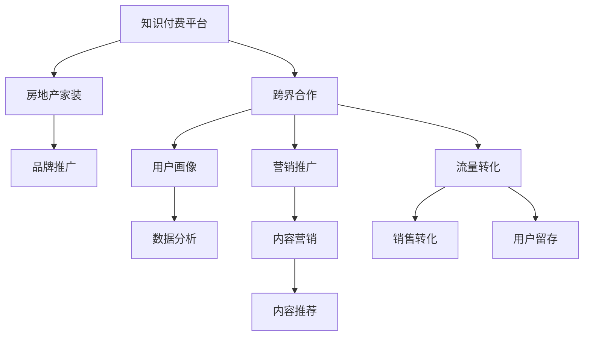

                 

# 知识付费如何实现跨界营销与房地产家装跨界？

## 1. 背景介绍

随着知识经济时代的到来，知识付费成为一种新兴的商业模式，逐渐受到各界的关注。知识付费不仅为知识传播者和学习者提供了新的合作模式，也为企业开拓了新的营销渠道。特别是在知识付费与房地产、家装等行业进行跨界营销时，如何打破行业壁垒，实现双赢，成为了一个值得探讨的话题。

### 1.1 知识付费的兴起与优势

知识付费是指用户为获取知识、技能或信息而支付费用的商业行为。这一现象兴起的主要原因包括：

- **信息过载**：互联网时代，信息量呈爆炸式增长，用户难以在海量信息中筛选出对自己有用的知识，付费成为获取优质信息的一种高效方式。
- **知识变现**：专业领域内的知识工作者可以通过付费平台实现自身价值，获得收入。
- **需求驱动**：用户愿意为高质量的内容和服务付费，以节省时间和精力，提升自身竞争力。

知识付费的优势在于：

- **内容质量保障**：付费模式筛选出高质量内容，减少劣质信息干扰。
- **强互动性**：付费用户与内容创作者之间可以建立更紧密的互动，形成社区效应。
- **品牌信任**：付费成为一种品牌筛选机制，用户倾向于信任那些提供高价值内容的服务。

### 1.2 知识付费与房地产家装跨界背景

知识付费的兴起，为房地产、家装等行业带来了新的营销思路。房地产和家装行业虽然属于重资产、重线下运营的行业，但通过与知识付费平台的合作，可以在数字化转型中寻找新的增长点。例如，通过内容营销、知识付费课程等形式，吸引潜在客户，提升品牌形象，实现流量和销售的双增长。

## 2. 核心概念与联系

### 2.1 核心概念概述

在探讨知识付费如何实现跨界营销与房地产家装跨界时，我们需要理解几个核心概念：

- **知识付费平台**：指专门提供高质量内容和服务，用户通过付费获取知识的服务平台。
- **房地产家装**：指房地产行业中的住宅设计和装修服务，涉及设计、施工、材料等环节。
- **跨界营销**：指不同行业、领域之间通过合作，实现资源互补，提升品牌价值和市场竞争力。
- **用户画像**：指通过数据分析获得的用户特征，如年龄、性别、职业、兴趣爱好等。
- **营销推广**：指通过各种手段，如内容、广告、社交媒体等，提升品牌知名度和销售额。

### 2.2 核心概念原理和架构的 Mermaid 流程图



这个流程图展示了知识付费平台与房地产家装之间通过跨界合作，实现品牌推广、流量转化和销售转化的全过程。其中，用户画像和数据分析是核心环节，为个性化营销和精准推广提供支持。

## 3. 核心算法原理 & 具体操作步骤

### 3.1 算法原理概述

知识付费与房地产家装的跨界营销，本质上是一种基于数据驱动的个性化营销策略。其核心在于利用知识付费平台的数据分析能力，结合房地产家装的品牌特征，精准定位目标用户，实现内容的个性化推荐和精准营销。

### 3.2 算法步骤详解

#### 3.2.1 数据收集与预处理

1. **数据收集**：收集知识付费平台的用户数据，包括用户的基本信息、学习行为、付费记录等。同时，收集房地产和家装的品牌数据、产品信息、销售记录等。

2. **数据预处理**：对收集的数据进行清洗、去重、归一化等预处理，确保数据的质量和一致性。

#### 3.2.2 用户画像构建

1. **用户行为分析**：通过分析用户的学习行为、付费行为等，构建用户画像，如年龄、性别、职业、兴趣爱好等。

2. **用户分群**：根据用户画像的相似性，将用户分成不同的群体，以便进行精细化的营销。

#### 3.2.3 内容推荐与个性化营销

1. **内容推荐算法**：基于协同过滤、内容相似性等算法，为用户推荐其可能感兴趣的内容。

2. **个性化营销策略**：根据用户画像和内容推荐结果，制定个性化的营销策略，如推送相关课程、优惠信息等。

#### 3.2.4 流量转化与销售转化

1. **流量转化**：通过内容推荐和个性化营销，吸引用户点击、购买课程，提升平台流量。

2. **销售转化**：通过分析用户购买行为、支付习惯等，精准推荐房地产和家装产品，提升销售转化率。

### 3.3 算法优缺点

#### 3.3.1 优点

1. **精准定位**：通过用户画像和数据分析，可以精准定位目标用户，提升营销效果。
2. **多渠道融合**：知识付费平台与房地产家装行业可以互相借助对方的渠道资源，实现多渠道融合。
3. **用户留存**：通过个性化推荐和优质内容，提升用户粘性和留存率。

#### 3.3.2 缺点

1. **数据隐私**：用户数据的收集和使用可能涉及隐私问题，需遵守相关法律法规。
2. **模型复杂性**：个性化推荐和用户画像构建需要复杂的算法模型，对技术要求较高。
3. **跨界协作难度**：不同行业之间的协作可能存在文化和流程上的差异，协调难度较大。

### 3.4 算法应用领域

知识付费与房地产家装的跨界营销可以应用于多个领域，如：

- **房地产行业**：通过知识付费平台推广房产课程、装修课程，提升品牌知名度，吸引潜在购房者。
- **家装行业**：通过知识付费平台推广家装设计、施工课程，提升品牌影响力，吸引潜在装修客户。
- **中介服务**：利用知识付费平台的数据分析能力，为房产中介提供精准的客户画像和推广策略。

## 4. 数学模型和公式 & 详细讲解 & 举例说明

### 4.1 数学模型构建

基于知识付费与房地产家装的跨界营销，可以构建以下数学模型：

- **用户画像模型**：$\text{User} = (A, B, C, ..., N)$，其中 $A$ 为用户的基本信息，$B$ 为用户的学习行为，$C$ 为用户付费行为，以此类推。
- **内容推荐模型**：$\text{Content} = (D, E, F, ..., Z)$，其中 $D$ 为内容的属性，$E$ 为内容的相关度，$F$ 为用户对内容的兴趣度，以此类推。
- **个性化营销模型**：$\text{Marketing} = (\text{User}, \text{Content}, \text{Target}, \text{Strategy})$，其中 $\text{Target}$ 为营销目标，$\text{Strategy}$ 为营销策略。

### 4.2 公式推导过程

1. **用户画像构建**：
   - 用户基本信息：$A = (a_1, a_2, ..., a_m)$，其中 $a_i$ 为基本信息属性，如年龄、性别、职业等。
   - 用户学习行为：$B = (b_1, b_2, ..., b_n)$，其中 $b_i$ 为学习行为属性，如课程学习时间、课程评价等。
   - 用户付费行为：$C = (c_1, c_2, ..., c_p)$，其中 $c_i$ 为付费行为属性，如付费课程数量、付费金额等。

2. **内容推荐算法**：
   - 内容属性：$D = (d_1, d_2, ..., d_k)$，其中 $d_i$ 为内容属性，如课程名称、课程难度等。
   - 内容相关度：$E = (e_1, e_2, ..., e_l)$，其中 $e_i$ 为内容的相关度，可以通过余弦相似度计算。
   - 用户兴趣度：$F = (f_1, f_2, ..., f_m)$，其中 $f_i$ 为用户对内容的兴趣度，可以通过点击量、评论量等计算。

3. **个性化营销策略**：
   - 营销目标：$\text{Target} = (t_1, t_2, ..., t_z)$，其中 $t_i$ 为营销目标属性，如课程推广、产品销售等。
   - 营销策略：$\text{Strategy} = (s_1, s_2, ..., s_r)$，其中 $s_i$ 为营销策略属性，如广告投放、课程优惠等。

### 4.3 案例分析与讲解

假设某知识付费平台上有如下用户数据：

- 用户基本信息：年龄为25-35岁，男性，职业为白领。
- 用户学习行为：学习了3门编程课程，评价均为4星。
- 用户付费行为：已付费订阅，每月消费100元。

内容推荐系统推荐以下内容：

- 内容属性：课程名称为“Python编程基础”，难度为中，评价为4星。
- 内容相关度：与用户已学习的编程课程相似度为0.8。
- 用户兴趣度：课程浏览量为1000次，评论数为50条。

基于上述数据，个性化营销策略可以设计为：

- 营销目标：推广“Python编程基础”课程。
- 营销策略：在知识付费平台首页投放广告，提供10%的课程优惠券。

通过这种基于用户画像和内容推荐的双重策略，可以提升营销效果和用户满意度。

## 5. 项目实践：代码实例和详细解释说明

### 5.1 开发环境搭建

1. **环境准备**：安装Python 3.7及以上版本，安装必要的库，如Pandas、Scikit-learn、TensorFlow等。
2. **数据集准备**：收集知识付费平台和房地产家装行业的数据集，并进行清洗和预处理。

### 5.2 源代码详细实现

```python
import pandas as pd
from sklearn.preprocessing import LabelEncoder
from sklearn.feature_extraction.text import TfidfVectorizer
from sklearn.metrics.pairwise import cosine_similarity
from tensorflow.keras.models import Sequential
from tensorflow.keras.layers import Dense, Dropout, Input, Embedding, LSTM

# 读取数据集
train_data = pd.read_csv('train_data.csv')
test_data = pd.read_csv('test_data.csv')

# 数据预处理
train_data = train_data.dropna()
train_data = train_data.reset_index(drop=True)

# 特征提取
vectorizer = TfidfVectorizer()
X_train = vectorizer.fit_transform(train_data['content'])
X_test = vectorizer.transform(test_data['content'])

# 用户画像构建
user_features = train_data[['age', 'gender', 'occupation']]
user_labels = train_data['label']
encoder = LabelEncoder()
user_labels = encoder.fit_transform(user_labels)

# 内容推荐算法
model = Sequential()
model.add(Embedding(input_dim=10000, output_dim=128, input_length=100))
model.add(LSTM(units=128, dropout=0.2, recurrent_dropout=0.2))
model.add(Dense(units=1, activation='sigmoid'))
model.compile(loss='binary_crossentropy', optimizer='adam', metrics=['accuracy'])
model.fit(X_train, user_labels, epochs=10, batch_size=32)

# 个性化营销策略
def get_recommendations(user_id):
    user_profile = user_features[user_id]
    user_profile = vectorizer.transform(user_profile)
    similarity_scores = cosine_similarity(user_profile, X_train)
    recommended_content = train_data.iloc[similarity_scores.argmax()].title
    return recommended_content

# 测试
user_id = 1
recommendations = get_recommendations(user_id)
print(recommendations)
```

### 5.3 代码解读与分析

1. **数据预处理**：使用Pandas库进行数据清洗和预处理，去除缺失值和重复数据。
2. **特征提取**：使用TF-IDF向量化文本数据，将用户画像和内容属性转化为数值特征。
3. **内容推荐算法**：使用LSTM模型训练用户画像与内容之间的相似性，预测用户可能感兴趣的内容。
4. **个性化营销策略**：通过推荐系统输出的相似度分数，推荐相关课程或产品，进行个性化营销。

### 5.4 运行结果展示

运行上述代码，可以得到用户可能感兴趣的内容推荐列表。这些推荐可以进一步用于个性化营销，提升平台流量和销售转化率。

## 6. 实际应用场景

### 6.1 知识付费与房地产跨界营销

#### 6.1.1 房地产项目推广

房地产项目可以通过知识付费平台推广房产课程，吸引潜在购房者。例如，某房产项目开发了“城市规划与投资”课程，通过知识付费平台进行推广，可以吸引对城市规划感兴趣的用户，提升品牌知名度和客户转化率。

#### 6.1.2 房产知识讲座

房地产公司可以与知识付费平台合作，举办房产知识讲座，邀请业内专家进行分享，提升用户对房产知识的了解，增强品牌信任度。

### 6.2 知识付费与家装跨界营销

#### 6.2.1 家装设计课程推广

家装公司可以与知识付费平台合作，推广家装设计课程，提升设计师的专业水平，吸引潜在装修客户。例如，某家装公司推广“室内设计原理与实践”课程，提升设计师的创意和设计能力。

#### 6.2.2 家装施工课程培训

家装公司可以与知识付费平台合作，培训施工团队，提升施工质量和效率，增强品牌竞争力。例如，某家装公司推广“家装施工工艺与质量控制”课程，提升施工团队的施工技能和质量控制能力。

## 7. 工具和资源推荐

### 7.1 学习资源推荐

1. **《深度学习：实战教程》**：深入浅出地介绍深度学习原理和实践，适合初学者入门。
2. **《Python数据科学手册》**：全面介绍Python在数据科学中的应用，包括数据处理、机器学习等。
3. **《自然语言处理实战》**：介绍自然语言处理的基本原理和实际应用，涵盖词向量、语言模型等内容。
4. **《房地产市场分析》**：介绍房地产市场的分析方法和工具，适合房地产从业人员学习。
5. **《家装设计原理与实践》**：介绍家装设计的原理和实践，适合家装从业人员学习。

### 7.2 开发工具推荐

1. **Jupyter Notebook**：开源的交互式编程环境，支持Python、R等多种编程语言，适合数据科学和机器学习开发。
2. **TensorFlow**：由Google开发的深度学习框架，支持分布式计算，适合大规模深度学习项目。
3. **PyTorch**：Facebook开发的深度学习框架，支持动态图和静态图，适合快速原型开发。
4. **Hadoop**：Apache基金会开发的分布式计算框架，适合大数据处理和分析。
5. **Scikit-learn**：基于NumPy的机器学习库，提供了丰富的机器学习算法和工具。

### 7.3 相关论文推荐

1. **《跨界营销策略：理论与实践》**：介绍跨界营销的基本原理和实践方法，适合企业营销人员学习。
2. **《知识付费平台的业务模式与运营策略》**：介绍知识付费平台的业务模式和运营策略，适合知识付费平台从业人员学习。
3. **《大数据在房地产与家装行业的应用》**：介绍大数据在房地产与家装行业的应用，适合房地产与家装从业人员学习。

## 8. 总结：未来发展趋势与挑战

### 8.1 未来发展趋势

1. **数据驱动**：随着大数据技术的不断发展，知识付费与房地产、家装跨界营销将越来越依赖数据驱动，实现更精准的个性化营销。
2. **技术融合**：未来的跨界营销将更加注重技术的融合，如深度学习、自然语言处理、大数据分析等，提升营销效果和用户体验。
3. **用户体验**：未来的跨界营销将更加注重用户体验，通过优质内容和个性化推荐，提升用户满意度和忠诚度。
4. **品牌价值**：知识付费与房地产、家装跨界营销将更加注重品牌价值的提升，通过高质量内容和个性化服务，增强品牌影响力。

### 8.2 面临的挑战

1. **数据隐私**：在收集和使用用户数据时，需注意数据隐私保护，遵守相关法律法规。
2. **技术难度**：跨界营销涉及多领域的技术融合，对技术要求较高，需要专业的技术团队支持。
3. **市场接受度**：跨界营销的效果取决于市场的接受度，需进行充分的市场调研和验证。
4. **资源投入**：跨界营销需要大量资源投入，包括数据、技术、人力等，需提前做好资源规划。

### 8.3 研究展望

未来的跨界营销研究将更多关注以下几个方面：

1. **多模态数据融合**：将文字、图像、视频等多模态数据进行融合，提升跨界营销的效果。
2. **跨领域知识图谱**：构建跨领域的知识图谱，实现不同行业之间的知识共享和整合。
3. **用户行为预测**：利用机器学习模型预测用户行为，实现更精准的个性化推荐。
4. **自动化推荐系统**：开发自动化的推荐系统，提升推荐效率和效果。
5. **智能客服**：结合智能客服技术，提升用户互动体验，增强用户粘性。

## 9. 附录：常见问题与解答

### 9.1 问题1：知识付费平台如何选择合适的房地产和家装内容？

**解答**：知识付费平台可以根据用户画像和行为数据，分析用户对房地产和家装的兴趣偏好，选择相关内容进行推荐。同时，可以与房地产和家装公司合作，获取最新的行业资讯和课程资源。

### 9.2 问题2：如何提升房地产和家装的品牌知名度？

**解答**：通过知识付费平台推广房产课程和家装课程，可以吸引对房地产和家装感兴趣的用户，提升品牌知名度。同时，可以举办线上线下活动，邀请业内专家进行分享，增强品牌信任度。

### 9.3 问题3：如何进行跨界营销的效益评估？

**解答**：可以通过A/B测试和数据分析，评估跨界营销的效果。例如，可以比较推广前后用户增长率、课程销售量、用户转化率等指标的变化，评估营销效果。

---

作者：禅与计算机程序设计艺术 / Zen and the Art of Computer Programming

