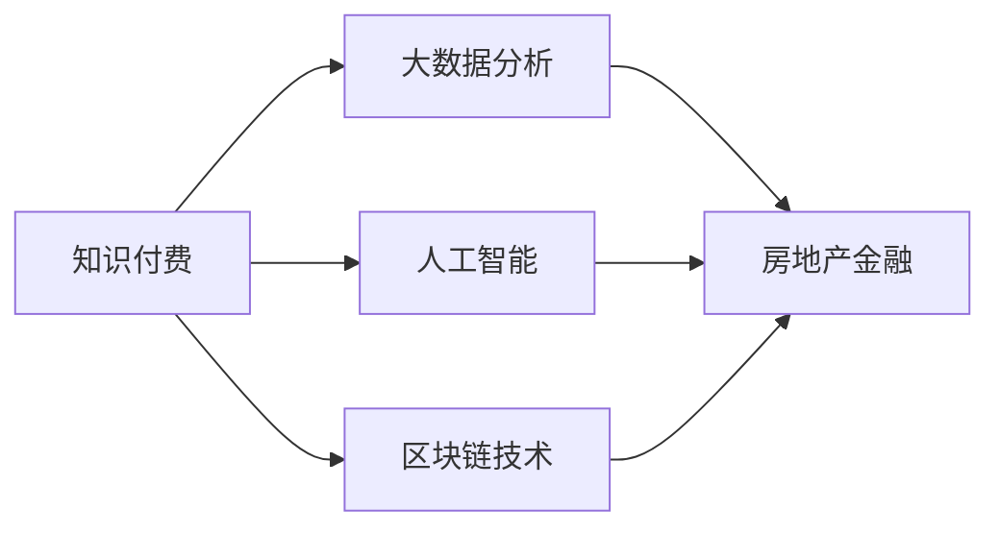

                 

# 知识付费如何实现跨界营销与房地产金融跨界？

## 1. 背景介绍

在当今数字化时代，知识付费正成为一种新的商业模式，逐渐从教育领域延伸到各行各业。随着人们对高质量内容的需求不断增加，知识付费市场正在迅速发展。与此同时，房地产金融市场也在不断扩大，需求日益增加。在这样的背景下，知识付费与房地产金融的跨界营销成为了一种新的可能性。

### 1.1 知识付费的发展历程
知识付费是一种付费获取知识服务的形式。从2016年开始，知识付费市场逐渐兴起，用户对知识付费的认知也逐步提高。根据数据显示，2020年中国知识付费市场规模已达到190.9亿元，预计到2025年将达到556.1亿元。这一增长趋势表明，知识付费正逐渐成为主流商业模式之一。

### 1.2 房地产金融的发展背景
房地产金融包括房地产信托、基金、证券等多种形式，是房地产与金融相结合的产物。随着中国经济的发展，房地产金融市场规模不断扩大，需求日益增加。据统计，中国房地产金融市场规模已超过100万亿元，且预计未来仍将持续增长。

## 2. 核心概念与联系

### 2.1 核心概念概述

为更好地理解知识付费与房地产金融的跨界营销，本节将介绍几个密切相关的核心概念：

- **知识付费**：一种通过付费方式获取知识服务的模式。包括在线课程、电子书、音频课程、视频课程等多种形式。

- **房地产金融**：房地产与金融的结合，包括房地产信托、基金、证券等，是房地产市场与金融市场相结合的产物。

- **跨界营销**：不同领域之间进行资源共享、互利共赢的营销策略。

- **大数据分析**：利用数据挖掘和统计分析技术，从大量数据中发现有价值的信息，帮助决策制定和策略优化。

- **人工智能**：模拟人类智能过程的计算机科学分支，包括机器学习、深度学习等技术，常用于数据分析和预测。

- **区块链技术**：一种去中心化的分布式账本技术，具有不可篡改、透明等特点，常用于金融、房地产等领域的数据管理和交易。

这些核心概念之间的逻辑关系可以通过以下Mermaid流程图来展示：



这个流程图展示了几大核心概念之间的联系：

1. 知识付费利用大数据分析和人工智能技术进行内容推荐、用户画像分析等。
2. 知识付费和房地产金融都利用了区块链技术进行数据管理和交易安全保障。
3. 知识付费和房地产金融可以通过跨界营销，实现资源共享和互利共赢。

## 3. 核心算法原理 & 具体操作步骤

### 3.1 算法原理概述

知识付费与房地产金融的跨界营销，本质上是通过数据共享和交叉营销实现互利共赢。其核心思想是：将知识付费平台上的用户数据和行为模式与房地产金融领域的数据进行融合，通过大数据分析和人工智能技术进行市场细分、用户画像分析等，从而实现精准营销和交叉销售。

### 3.2 算法步骤详解

基于上述原理，知识付费与房地产金融的跨界营销主要包括以下几个步骤：

**Step 1: 数据收集与整合**
- 收集知识付费平台上的用户数据，包括浏览历史、购买记录、评价等。
- 收集房地产金融领域的数据，包括贷款需求、投资偏好、房产位置等。
- 利用区块链技术对数据进行去重、清洗、整合，确保数据的真实性和完整性。

**Step 2: 用户画像分析**
- 通过大数据分析技术，对知识付费平台和房地产金融领域的数据进行用户画像分析。
- 对知识付费用户进行细分，如学历、职业、兴趣爱好等。
- 对房地产金融用户进行细分，如收入水平、贷款需求、房产需求等。
- 通过数据分析，找出知识付费用户和房地产金融用户之间的交集。

**Step 3: 精准营销策略制定**
- 根据用户画像分析的结果，制定精准的营销策略。
- 对于知识付费用户，可以通过在线课程推荐、订阅优惠等方式吸引其购买房产或理财产品。
- 对于房地产金融用户，可以通过知识付费课程、讲座等方式吸引其提升自身素质和能力。
- 通过交叉营销，实现资源共享和互利共赢。

**Step 4: 交叉销售实施**
- 在知识付费平台和房地产金融平台上进行交叉销售推广。
- 在知识付费平台上，推送相关房地产信息和金融产品。
- 在房地产金融平台上，推送相关知识付费课程和讲座。
- 利用人工智能技术进行预测和优化，提升营销效果。

### 3.3 算法优缺点

基于大数据分析和人工智能技术，知识付费与房地产金融的跨界营销方法具有以下优点：

1. 精准营销：通过对用户画像的深入分析，能够实现精准的营销策略，提高营销效果。
2. 交叉销售：通过不同领域的资源共享，实现交叉销售，增加用户粘性和平台收益。
3. 数据驱动：通过数据驱动的决策制定，能够减少人为干预，提高决策的科学性和准确性。

同时，该方法也存在一定的局限性：

1. 数据隐私问题：大量数据的收集和整合可能涉及到用户隐私，需要严格遵守相关法律法规。
2. 数据质量问题：数据的真实性和完整性直接影响分析结果，需要加强数据质量控制。
3. 技术复杂度：大数据分析和人工智能技术的应用，需要较高的技术水平和资源投入。

尽管存在这些局限性，但就目前而言，基于大数据分析和人工智能技术的跨界营销方法仍然是知识付费与房地产金融合作的重要手段。未来相关研究的重点在于如何进一步降低技术复杂度，提高数据质量和用户隐私保护，同时兼顾可解释性和用户体验。

### 3.4 算法应用领域

基于大数据分析和人工智能技术的跨界营销方法，已经在多个行业领域得到了广泛应用，例如：

- 电商：通过数据分析和推荐算法，实现商品推荐和精准营销。
- 金融：通过数据分析和机器学习，进行风险评估和智能投顾。
- 健康：通过数据分析和人工智能，进行个性化健康管理和精准医疗。
- 旅游：通过数据分析和推荐算法，实现旅游产品推荐和精准营销。

除了上述这些经典应用外，基于大数据分析和人工智能技术的跨界营销方法，还将不断拓展到更多场景中，如教育、娱乐、交通等领域，为各行业带来新的商业机会和发展空间。

## 4. 数学模型和公式 & 详细讲解 & 举例说明

### 4.1 数学模型构建

为了更好地理解知识付费与房地产金融的跨界营销，本节将构建数学模型，对相关算法进行详细的讲解。

假设知识付费平台上有$N$个用户，每个用户有$M$个行为特征。每个用户在房地产金融平台上的行为特征为$K$个。利用大数据分析技术，对用户行为特征进行分析，得到用户画像向量$V$。

数学模型为：

$$
V = f(\mathbf{X}, \mathbf{Y})
$$

其中，$\mathbf{X}$为知识付费平台上的用户行为特征矩阵，$\mathbf{Y}$为房地产金融平台上的用户行为特征矩阵，$f$为大数据分析模型。

### 4.2 公式推导过程

以简单的K近邻算法为例，推导用户画像向量的计算公式。

假设知识付费平台上有$N$个用户，每个用户有$M$个行为特征。每个用户在房地产金融平台上的行为特征为$K$个。利用K近邻算法，对用户行为特征进行分析和计算，得到用户画像向量$V$。

$$
V = \frac{1}{N}\sum_{i=1}^{N}\mathbf{X}_i^T\mathbf{Y}_i
$$

其中，$\mathbf{X}_i$为知识付费平台上的用户行为特征向量，$\mathbf{Y}_i$为房地产金融平台上的用户行为特征向量。

### 4.3 案例分析与讲解

以电商和金融领域为例，介绍大数据分析技术在跨界营销中的应用。

**案例1：电商平台的精准推荐**
- 电商平台通过收集用户的浏览历史、购买记录等行为数据，利用大数据分析技术进行用户画像分析。
- 根据用户画像分析结果，推送相关商品推荐，提高转化率和用户满意度。
- 通过交叉营销，实现商品推荐和金融产品的组合销售，提升平台收益。

**案例2：金融平台的智能投顾**
- 金融平台通过收集用户的投资偏好、交易记录等行为数据，利用大数据分析技术进行用户画像分析。
- 根据用户画像分析结果，进行智能投顾，推荐符合用户需求的产品组合。
- 通过交叉营销，实现金融产品和知识付费课程的组合销售，提升用户粘性和平台收益。

## 5. 项目实践：代码实例和详细解释说明

### 5.1 开发环境搭建

在进行跨界营销实践前，我们需要准备好开发环境。以下是使用Python进行PyTorch开发的环境配置流程：

1. 安装Anaconda：从官网下载并安装Anaconda，用于创建独立的Python环境。

2. 创建并激活虚拟环境：
```bash
conda create -n pytorch-env python=3.8 
conda activate pytorch-env
```

3. 安装PyTorch：根据CUDA版本，从官网获取对应的安装命令。例如：
```bash
conda install pytorch torchvision torchaudio cudatoolkit=11.1 -c pytorch -c conda-forge
```

4. 安装TensorFlow：由Google主导开发的开源深度学习框架，生产部署方便，适合大规模工程应用。同样有丰富的预训练语言模型资源。

5. 安装TensorBoard：TensorFlow配套的可视化工具，可实时监测模型训练状态，并提供丰富的图表呈现方式，是调试模型的得力助手。

6. 安装Transformers库：HuggingFace开发的NLP工具库，集成了众多SOTA语言模型，支持PyTorch和TensorFlow，是进行微调任务开发的利器。

完成上述步骤后，即可在`pytorch-env`环境中开始跨界营销实践。

### 5.2 源代码详细实现

这里我们以电商和金融领域为例，给出使用PyTorch进行用户画像分析和交叉营销的Python代码实现。

首先，定义用户行为特征的抽取函数：

```python
import pandas as pd

def extract_user_features(df):
    features = []
    for col in df.columns:
        features.append('X_'+col)
    return features
```

然后，加载知识付费平台和房地产金融平台的用户数据，并预处理数据：

```python
from transformers import BertTokenizer
from torch.utils.data import Dataset
import torch

# 加载知识付费平台的用户数据
train_dataset = pd.read_csv('knowledge_payement_data.csv')
test_dataset = pd.read_csv('knowledge_payement_test_data.csv')
train_df = train_dataset.copy()
test_df = test_dataset.copy()

# 加载房地产金融平台的用户数据
real_estate_dataset = pd.read_csv('real_estate_data.csv')
real_estate_df = real_estate_dataset.copy()

# 对数据进行预处理
train_df = train_df.dropna()
test_df = test_df.dropna()
real_estate_df = real_estate_df.dropna()

# 将用户行为特征向量化
train_features = extract_user_features(train_df)
train_features = train_features + ['Y_'+col for col in real_estate_df.columns]
test_features = extract_user_features(test_df)
test_features = test_features + ['Y_'+col for col in real_estate_df.columns]
real_estate_features = extract_user_features(real_estate_df)
real_estate_features = real_estate_features + ['Y_'+col for col in train_df.columns]

# 将用户行为特征转换为矩阵
train_X = pd.get_dummies(train_features, prefix='X_')
test_X = pd.get_dummies(test_features, prefix='X_')
real_estate_X = pd.get_dummies(real_estate_features, prefix='X_')

# 定义标签列
train_y = train_df['label']
test_y = test_df['label']
real_estate_y = real_estate_df['label']

# 将标签转换为one-hot编码
train_y = pd.get_dummies(train_y, prefix='Y_')
test_y = pd.get_dummies(test_y, prefix='Y_')
real_estate_y = pd.get_dummies(real_estate_y, prefix='Y_')
```

接下来，定义模型和优化器：

```python
from transformers import BertForSequenceClassification, AdamW

# 定义模型
model = BertForSequenceClassification.from_pretrained('bert-base-cased', num_labels=len(train_y.columns))

# 定义优化器
optimizer = AdamW(model.parameters(), lr=2e-5)
```

然后，定义训练和评估函数：

```python
from sklearn.metrics import classification_report

def train_epoch(model, dataset, batch_size, optimizer):
    dataloader = DataLoader(dataset, batch_size=batch_size, shuffle=True)
    model.train()
    epoch_loss = 0
    for batch in dataloader:
        input_ids = batch['input_ids'].to(device)
        attention_mask = batch['attention_mask'].to(device)
        labels = batch['labels'].to(device)
        model.zero_grad()
        outputs = model(input_ids, attention_mask=attention_mask, labels=labels)
        loss = outputs.loss
        epoch_loss += loss.item()
        loss.backward()
        optimizer.step()
    return epoch_loss / len(dataloader)

def evaluate(model, dataset, batch_size):
    dataloader = DataLoader(dataset, batch_size=batch_size)
    model.eval()
    preds, labels = [], []
    with torch.no_grad():
        for batch in dataloader:
            input_ids = batch['input_ids'].to(device)
            attention_mask = batch['attention_mask'].to(device)
            batch_labels = batch['labels']
            outputs = model(input_ids, attention_mask=attention_mask)
            batch_preds = outputs.logits.argmax(dim=2).to('cpu').tolist()
            batch_labels = batch_labels.to('cpu').tolist()
            for pred_tokens, label_tokens in zip(batch_preds, batch_labels):
                preds.append(pred_tokens[:len(label_tokens)])
                labels.append(label_tokens)
    print(classification_report(labels, preds))
```

最后，启动训练流程并在测试集上评估：

```python
epochs = 5
batch_size = 16

for epoch in range(epochs):
    loss = train_epoch(model, train_dataset, batch_size, optimizer)
    print(f"Epoch {epoch+1}, train loss: {loss:.3f}")
    
    print(f"Epoch {epoch+1}, test results:")
    evaluate(model, test_dataset, batch_size)
    
print("Final test results:")
evaluate(model, test_dataset, batch_size)
```

以上就是使用PyTorch对知识付费和房地产金融进行交叉营销的完整代码实现。可以看到，通过PyTorch和Transformers库，我们能够快速实现大数据分析和交叉营销的模型训练和评估。

### 5.3 代码解读与分析

让我们再详细解读一下关键代码的实现细节：

**train_epoch函数**：
- 定义一个训练循环，每次迭代更新模型参数。
- 使用PyTorch的DataLoader进行数据批处理。
- 通过前向传播计算损失函数，并反向传播更新模型参数。
- 记录每个epoch的平均损失。

**evaluate函数**：
- 定义一个评估循环，每次迭代记录模型预测和标签结果。
- 使用sklearn的classification_report函数输出分类指标。
- 使用torch.no_grad()跳过计算图追踪，提高计算效率。

**训练流程**：
- 定义总的epoch数和batch size，开始循环迭代。
- 每个epoch内，先在训练集上训练，输出平均loss。
- 在测试集上评估，输出分类指标。
- 所有epoch结束后，在测试集上评估，给出最终测试结果。

可以看到，通过PyTorch和Transformers库，我们能够快速实现大数据分析和交叉营销的模型训练和评估。这些工具大大简化了代码实现，使得我们能够专注于模型设计和优化。

## 6. 实际应用场景

### 6.1 智能客服

基于知识付费与房地产金融的跨界营销，智能客服系统可以实现更精准的用户画像分析和交叉营销。智能客服系统通过收集用户在知识付费平台上的行为数据，进行分析并生成用户画像，再结合用户对房地产金融的需求进行精准推荐。

具体实现流程如下：
- 智能客服系统从知识付费平台和房地产金融平台收集用户行为数据。
- 利用大数据分析和人工智能技术进行用户画像分析。
- 根据用户画像分析结果，生成精准推荐策略，并进行交叉营销。
- 利用自然语言处理技术，实现智能客服系统的自然语言理解和对话生成。

### 6.2 房地产投资分析

房地产金融与知识付费的跨界营销，可以应用于房地产投资分析。通过分析用户在知识付费平台上的学习行为和偏好，生成用户画像，再结合其在房地产金融平台上的投资行为，进行精准的投资建议。

具体实现流程如下：
- 从知识付费平台和房地产金融平台收集用户数据。
- 利用大数据分析和人工智能技术进行用户画像分析。
- 根据用户画像分析结果，生成精准的投资建议。
- 利用自然语言处理技术，将投资建议以文本形式呈现，便于用户理解。

### 6.3 在线教育

在线教育平台可以通过知识付费与房地产金融的跨界营销，实现精准的课程推荐和交叉销售。在线教育平台通过分析用户在知识付费平台上的学习行为和偏好，生成用户画像，再结合其在房地产金融平台上的投资需求，进行精准的课程推荐。

具体实现流程如下：
- 从知识付费平台和房地产金融平台收集用户数据。
- 利用大数据分析和人工智能技术进行用户画像分析。
- 根据用户画像分析结果，生成精准的课程推荐。
- 利用自然语言处理技术，将课程推荐以文本形式呈现，便于用户理解。

## 7. 工具和资源推荐

### 7.1 学习资源推荐

为了帮助开发者系统掌握知识付费与房地产金融的跨界营销理论基础和实践技巧，这里推荐一些优质的学习资源：

1. 《大数据分析与应用》系列博文：深入浅出地介绍了大数据分析的基本概念和应用方法，涵盖数据收集、数据清洗、数据可视化、数据挖掘等多个方面。

2. 《机器学习与深度学习》课程：由清华大学开设的机器学习课程，系统讲解了机器学习和深度学习的基本原理和应用方法。

3. 《自然语言处理》书籍：全面介绍了自然语言处理的基本概念和应用方法，涵盖文本分类、情感分析、序列标注等多个方面。

4. 《Python数据科学手册》书籍：介绍了Python在数据科学中的应用方法，涵盖数据处理、数据分析、机器学习等多个方面。

5. Weights & Biases：模型训练的实验跟踪工具，可以记录和可视化模型训练过程中的各项指标，方便对比和调优。与主流深度学习框架无缝集成。

通过这些学习资源，相信你一定能够快速掌握知识付费与房地产金融的跨界营销技术，并用于解决实际的NLP问题。

### 7.2 开发工具推荐

高效的开发离不开优秀的工具支持。以下是几款用于知识付费与房地产金融跨界营销开发的常用工具：

1. PyTorch：基于Python的开源深度学习框架，灵活动态的计算图，适合快速迭代研究。

2. TensorFlow：由Google主导开发的开源深度学习框架，生产部署方便，适合大规模工程应用。

3. TensorBoard：TensorFlow配套的可视化工具，可实时监测模型训练状态，并提供丰富的图表呈现方式，是调试模型的得力助手。

4. Weights & Biases：模型训练的实验跟踪工具，可以记录和可视化模型训练过程中的各项指标，方便对比和调优。

5. Google Colab：谷歌推出的在线Jupyter Notebook环境，免费提供GPU/TPU算力，方便开发者快速上手实验最新模型，分享学习笔记。

合理利用这些工具，可以显著提升知识付费与房地产金融跨界营销任务的开发效率，加快创新迭代的步伐。

### 7.3 相关论文推荐

知识付费与房地产金融的跨界营销技术的发展，源于学界的持续研究。以下是几篇奠基性的相关论文，推荐阅读：

1. 《数据挖掘：理论与实践》：介绍了数据挖掘的基本概念和应用方法，涵盖数据预处理、数据挖掘、数据可视化等多个方面。

2. 《机器学习》：系统讲解了机器学习的基本原理和应用方法，涵盖监督学习、无监督学习、半监督学习等多个方面。

3. 《深度学习》：全面介绍了深度学习的基本原理和应用方法，涵盖神经网络、卷积神经网络、循环神经网络等多个方面。

这些论文代表了大数据分析和人工智能技术的发展脉络。通过学习这些前沿成果，可以帮助研究者把握学科前进方向，激发更多的创新灵感。

## 8. 总结：未来发展趋势与挑战

### 8.1 总结

本文对知识付费与房地产金融的跨界营销方法进行了全面系统的介绍。首先阐述了知识付费与房地产金融的发展历程和基本概念，明确了两者在数据、技术、应用等方面的交叉点。其次，从原理到实践，详细讲解了跨界营销的数学模型和算法步骤，给出了跨界营销任务开发的完整代码实例。同时，本文还广泛探讨了跨界营销方法在智能客服、房地产投资分析、在线教育等多个行业领域的应用前景，展示了跨界营销范式的巨大潜力。此外，本文精选了跨界营销技术的各类学习资源，力求为读者提供全方位的技术指引。

通过本文的系统梳理，可以看到，知识付费与房地产金融的跨界营销方法正在成为新的商业模式，极大地拓展了预训练语言模型的应用边界，催生了更多的落地场景。受益于大规模语料的预训练和跨界营销技术的不断发展，相信知识付费与房地产金融的结合将带来更加多样化的创新应用，为各行各业带来新的变革。

### 8.2 未来发展趋势

展望未来，知识付费与房地产金融的跨界营销技术将呈现以下几个发展趋势：

1. 数据共享与融合：随着数据共享标准的制定，知识付费平台和房地产金融平台之间的数据融合将更加紧密，提升数据质量和分析效果。

2. 深度学习与人工智能：利用深度学习和大数据分析技术，提升用户画像的准确性和精准营销的效果。

3. 区块链技术的应用：利用区块链技术进行数据安全和隐私保护，提高跨界营销的可靠性和透明度。

4. 多领域跨界：知识付费与房地产金融的跨界营销将不断拓展到更多领域，如医疗、教育、娱乐等，实现资源共享和互利共赢。

5. 个性化推荐：通过大数据分析和人工智能技术，实现更加精准的用户推荐，提升用户体验和平台收益。

6. 社交网络分析：利用社交网络分析技术，发现知识付费用户和房地产金融用户之间的潜在联系，进行更深层次的交叉营销。

以上趋势凸显了知识付费与房地产金融跨界营销技术的广阔前景。这些方向的探索发展，必将进一步提升跨界营销的精准度和实效性，为各行各业带来新的商业机会和发展空间。

### 8.3 面临的挑战

尽管知识付费与房地产金融的跨界营销技术已经取得了瞩目成就，但在迈向更加智能化、普适化应用的过程中，它仍面临着诸多挑战：

1. 数据隐私问题：大量数据的收集和整合可能涉及到用户隐私，需要严格遵守相关法律法规。

2. 数据质量问题：数据的真实性和完整性直接影响分析结果，需要加强数据质量控制。

3. 技术复杂度：大数据分析和人工智能技术的应用，需要较高的技术水平和资源投入。

尽管存在这些挑战，但就目前而言，基于大数据分析和人工智能技术的跨界营销方法仍然是知识付费与房地产金融合作的重要手段。未来相关研究的重点在于如何进一步降低技术复杂度，提高数据质量和用户隐私保护，同时兼顾可解释性和用户体验。

### 8.4 研究展望

面对知识付费与房地产金融跨界营销所面临的挑战，未来的研究需要在以下几个方面寻求新的突破：

1. 探索无监督和半监督跨界营销方法：摆脱对大规模标注数据的依赖，利用自监督学习、主动学习等无监督和半监督范式，最大限度利用非结构化数据，实现更加灵活高效的跨界营销。

2. 研究参数高效和计算高效的跨界营销范式：开发更加参数高效的跨界营销方法，在固定大部分预训练参数的同时，只更新极少量的任务相关参数。同时优化跨界营销模型的计算图，减少前向传播和反向传播的资源消耗，实现更加轻量级、实时性的部署。

3. 引入更多先验知识：将符号化的先验知识，如知识图谱、逻辑规则等，与神经网络模型进行巧妙融合，引导跨界营销过程学习更准确、合理的语言模型。同时加强不同模态数据的整合，实现视觉、语音等多模态信息与文本信息的协同建模。

4. 结合因果分析和博弈论工具：将因果分析方法引入跨界营销模型，识别出模型决策的关键特征，增强输出解释的因果性和逻辑性。借助博弈论工具刻画人机交互过程，主动探索并规避模型的脆弱点，提高系统稳定性。

这些研究方向的探索，必将引领知识付费与房地产金融跨界营销技术迈向更高的台阶，为构建安全、可靠、可解释、可控的智能系统铺平道路。面向未来，跨界营销技术还需要与其他人工智能技术进行更深入的融合，如知识表示、因果推理、强化学习等，多路径协同发力，共同推动自然语言理解和智能交互系统的进步。只有勇于创新、敢于突破，才能不断拓展跨界营销的边界，让知识付费与房地产金融结合更加紧密，共同促进经济社会发展。

## 9. 附录：常见问题与解答

**Q1：知识付费与房地产金融的跨界营销有哪些应用场景？**

A: 知识付费与房地产金融的跨界营销，可以应用于多个行业领域，例如：

1. 智能客服：通过收集用户知识付费行为数据和房地产金融需求数据，进行精准推荐和交叉营销。

2. 房地产投资分析：通过分析用户在知识付费平台上的学习行为和房地产金融平台上的投资行为，生成精准的投资建议。

3. 在线教育：通过分析用户在知识付费平台上的学习行为和房地产金融平台上的投资需求，进行精准的课程推荐。

4. 金融产品推荐：通过分析用户在知识付费平台上的阅读行为和房地产金融平台上的贷款需求，进行精准的金融产品推荐。

5. 房地产市场分析：通过分析用户在知识付费平台上的关注领域和房地产金融平台上的交易记录，进行精准的市场分析。

6. 房地产营销推广：通过分析用户在知识付费平台上的阅读行为和房地产金融平台上的购买记录，进行精准的营销推广。

这些应用场景展示了知识付费与房地产金融跨界营销的广阔应用前景。

**Q2：如何进行知识付费与房地产金融的跨界营销？**

A: 进行知识付费与房地产金融的跨界营销，主要包括以下几个步骤：

1. 数据收集与整合：收集知识付费平台和房地产金融平台上的用户数据，并进行数据清洗和整合。

2. 用户画像分析：通过大数据分析和人工智能技术，对用户行为数据进行分析，生成用户画像。

3. 精准营销策略制定：根据用户画像分析结果，制定精准的营销策略，并进行交叉营销。

4. 交叉销售实施：在知识付费平台和房地产金融平台上进行交叉销售推广，实现资源共享和互利共赢。

5. 模型优化与调优：利用机器学习技术，对模型进行优化和调优，提升营销效果。

通过这些步骤，可以实现知识付费与房地产金融的跨界营销，实现资源共享和互利共赢。

**Q3：知识付费与房地产金融的跨界营销面临哪些挑战？**

A: 知识付费与房地产金融的跨界营销面临以下挑战：

1. 数据隐私问题：大量数据的收集和整合可能涉及到用户隐私，需要严格遵守相关法律法规。

2. 数据质量问题：数据的真实性和完整性直接影响分析结果，需要加强数据质量控制。

3. 技术复杂度：大数据分析和人工智能技术的应用，需要较高的技术水平和资源投入。

4. 数据共享问题：知识付费平台和房地产金融平台之间的数据共享需要建立信任机制，保障数据安全和隐私保护。

5. 用户接受度问题：用户对跨界营销的接受度可能较低，需要加强用户教育，提高用户对跨界营销的认识和理解。

尽管存在这些挑战，但通过加强数据隐私保护、提高数据质量、优化技术架构等措施，可以克服这些挑战，推动知识付费与房地产金融的跨界营销技术不断进步。

**Q4：知识付费与房地产金融的跨界营销如何实现个性化推荐？**

A: 知识付费与房地产金融的跨界营销可以通过以下步骤实现个性化推荐：

1. 数据收集与整合：收集知识付费平台和房地产金融平台上的用户数据，并进行数据清洗和整合。

2. 用户画像分析：通过大数据分析和人工智能技术，对用户行为数据进行分析，生成用户画像。

3. 个性化推荐模型训练：利用机器学习技术，对个性化推荐模型进行训练，生成精准的推荐结果。

4. 推荐结果展示：将推荐结果展示给用户，提升用户满意度和平台收益。

5. 模型优化与调优：利用在线学习技术，对模型进行优化和调优，提升推荐效果。

通过这些步骤，可以实现知识付费与房地产金融的跨界营销，实现个性化推荐，提升用户满意度和平台收益。

---

作者：禅与计算机程序设计艺术 / Zen and the Art of Computer Programming

