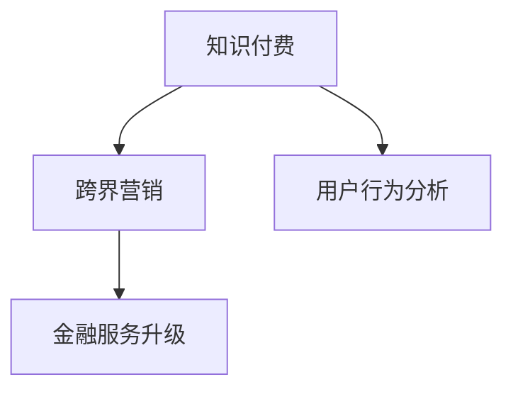

                 

## 1. 背景介绍

### 1.1 问题由来

随着互联网技术的快速发展，知识付费作为一种新兴的商业模式逐渐成为热点。从知识生产到知识消费，知识付费平台不再仅仅是传统教育行业的分羹者，而是逐步拓展到更多领域，如金融、科技、娱乐等。在金融领域，知识付费更是成为推动金融普惠、增强金融服务能力的重要手段。

然而，知识付费面临的最大挑战之一是跨界营销的难度。不同领域的内容和用户群体差异较大，如何有效将金融知识与其他领域的内容进行融合，实现跨界营销，是知识付费平台需要解决的问题。同时，金融领域的知识付费内容如何更好地服务于用户，提升金融服务的普惠性和便捷性，也是平台需要探索的方向。

### 1.2 问题核心关键点

知识付费与金融跨界营销的核心关键点包括：
- 跨界内容融合：将金融知识与非金融领域的内容有效结合，形成具有吸引力的跨界产品。
- 用户群体差异：理解不同领域用户的需求和行为特征，精准定位营销策略。
- 金融服务升级：在知识付费平台上集成金融服务，提升金融服务的普惠性和便捷性。

这些问题需要从内容创新、用户行为分析、技术支撑等多个层面进行系统性解决，才能实现知识付费与金融跨界的无缝融合。

## 2. 核心概念与联系

### 2.1 核心概念概述

为更好地理解知识付费与金融跨界营销的结合点，本节将介绍几个关键概念：

- 知识付费：指基于知识内容对用户进行收费的服务模式，涵盖教育、健康、科技、金融等多个领域。
- 跨界营销：指将不同领域的内容和营销策略进行融合，打破传统营销边界的营销方式。
- 用户行为分析：通过对用户行为数据的分析，了解用户需求和行为特征，指导产品和服务优化。
- 金融服务升级：指在金融领域集成智能技术、提升服务效率和质量的过程。

这些核心概念之间的逻辑关系可以通过以下Mermaid流程图来展示：



这个流程图展示了知识付费与金融跨界营销的核心概念及其之间的关系：

1. 知识付费通过内容生产与消费的互动，获取用户需求和反馈。
2. 跨界营销通过融合不同领域的内容和营销策略，打破传统边界。
3. 用户行为分析通过数据分析和模型建立，洞察用户需求和行为特征。
4. 金融服务升级通过集成智能技术和金融产品，提升金融服务的质量和效率。

这些概念共同构成了知识付费与金融跨界营销的完整框架，帮助平台在多个维度上实现跨界融合，提升用户价值和服务能力。

## 3. 核心算法原理 & 具体操作步骤

### 3.1 算法原理概述

知识付费与金融跨界营销的实现，离不开算法原理的支撑。其核心思想是：通过构建算法模型，分析用户行为，预测用户需求，优化产品设计，提升服务质量。具体而言，可以包括以下几个关键步骤：

1. **用户行为分析**：通过数据挖掘和机器学习算法，分析用户行为数据，识别用户的兴趣偏好、消费习惯等，为精准营销提供数据支持。
2. **内容融合推荐**：基于用户行为分析结果，推荐具有金融特色的跨界内容，如金融知识与科技、文化、娱乐等内容的结合，吸引更多用户关注。
3. **金融服务集成**：在知识付费平台中集成金融服务，如理财咨询、在线贷款、投资教育等，提升金融服务的便捷性和普惠性。
4. **营销效果评估**：通过A/B测试等方法，评估跨界营销策略的效果，不断优化策略，提升平台收益。

### 3.2 算法步骤详解

基于算法原理，知识付费与金融跨界营销的实现主要包括以下几个关键步骤：

**Step 1: 数据收集与处理**
- 收集用户行为数据，如浏览记录、购买历史、互动评论等。
- 对数据进行清洗、去重、缺失值处理等预处理步骤，确保数据质量。

**Step 2: 用户行为分析**
- 使用聚类算法对用户进行分类，识别不同用户群体的特征。
- 应用关联规则挖掘算法，发现用户行为中的共性和模式。
- 利用协同过滤算法，推荐与用户兴趣相关的跨界内容。

**Step 3: 内容融合推荐**
- 设计金融知识与其他领域内容结合的推荐算法。
- 对不同领域的跨界内容进行评价和筛选，确保内容质量和吸引力。
- 优化推荐算法，提高推荐效果和用户体验。

**Step 4: 金融服务集成**
- 选择合适的金融服务提供商，集成其金融产品和服务。
- 设计用户友好的界面和交互方式，提升金融服务的便捷性。
- 提供安全可靠的交易保障和数据保护，增强用户信任。

**Step 5: 营销效果评估**
- 设定营销目标和评估指标，如用户增长率、平台收益、用户满意度等。
- 设计A/B测试，对比不同营销策略的效果。
- 根据评估结果优化营销策略，不断提升营销效果。

### 3.3 算法优缺点

知识付费与金融跨界营销的算法实现具有以下优点：
1. 精准用户画像：通过用户行为分析，构建精准的用户画像，实现个性化推荐。
2. 多领域内容融合：跨界内容推荐有效打破了传统营销边界的限制，提升了内容吸引力和用户粘性。
3. 金融服务便捷化：集成金融服务，提升了金融服务的便捷性和普惠性。
4. 营销效果显著：通过优化营销策略，实现了更高的平台收益和用户满意度。

同时，该方法也存在一些局限性：
1. 数据隐私问题：在用户行为分析过程中，涉及大量用户隐私数据，数据安全和隐私保护是一大挑战。
2. 内容融合难度：不同领域的内容差异较大，进行有效的融合推荐需要较复杂的算法和数据处理技术。
3. 金融服务风险：金融服务涉及到用户资金安全，一旦出现问题，可能会对用户信任造成严重损害。
4. 营销策略复杂：跨界营销需要考虑多个领域的内容和用户需求，策略设计和执行较为复杂。

尽管存在这些局限性，但就目前而言，基于算法原理的跨界营销方法仍是大规模知识付费平台实现跨界融合的重要手段。未来相关研究的重点在于如何进一步优化算法模型，提升内容推荐和金融服务的质量和效率，同时兼顾数据安全和用户信任等因素。

### 3.4 算法应用领域

知识付费与金融跨界营销的算法原理，在多个领域得到了广泛的应用，如在线教育、社交媒体、电子商务等。以下是几个典型的应用场景：

- **在线教育**：在教育领域集成金融知识，如投资理财教育、企业金融课程等，提升教育内容和服务的综合性。
- **社交媒体**：在社交平台中推荐跨界内容，如金融领域的科普视频、金融资讯等，吸引更多用户关注和参与。
- **电子商务**：在电商平台上集成金融服务，如分期购物、在线贷款等，提升用户的购物体验和便捷性。
- **金融科技**：金融科技公司利用跨界营销策略，提升品牌知名度和用户信任度，拓展市场份额。

这些领域的应用展示了跨界营销的广泛潜力，证明了算法原理在实际场景中的有效性和普适性。

## 4. 数学模型和公式 & 详细讲解 & 举例说明

### 4.1 数学模型构建

为了更好地理解知识付费与金融跨界营销的算法实现，本节将介绍几个关键的数学模型：

- **用户行为分析模型**：通过聚类算法、关联规则挖掘算法等，对用户行为数据进行建模。
- **内容推荐模型**：基于协同过滤算法、内容推荐算法等，实现跨界内容的推荐。
- **金融服务评估模型**：通过风险评估模型、收益预测模型等，对金融服务的质量和风险进行量化评估。

### 4.2 公式推导过程

以下我们以用户行为分析模型为例，推导聚类算法中的K-means算法。

假设用户行为数据为 $D=\{(x_i,y_i)\}_{i=1}^N, x_i \in \mathbb{R}^d, y_i \in \{0,1\}$，其中 $x_i$ 为用户的浏览记录、购买历史等行为特征， $y_i$ 为用户的活跃状态（活跃为1，不活跃为0）。

K-means算法的基本步骤如下：
1. 随机初始化K个聚类中心 $\mu_k$，其中 $k$ 为聚类数目。
2. 将每个数据点 $x_i$ 分配到最近的聚类中心 $\mu_j$，即最小化损失函数 $J=\sum_{i=1}^N \|x_i-\mu_j\|^2$。
3. 更新聚类中心 $\mu_j = \frac{1}{|C_j|}\sum_{x_i \in C_j} x_i$，其中 $C_j$ 为包含 $x_i$ 的聚类。
4. 重复步骤2和3，直至聚类中心不再发生变化。

K-means算法的损失函数为：

$$
J = \frac{1}{2}\sum_{i=1}^N \min_{j=1}^K \|x_i-\mu_j\|^2
$$

### 4.3 案例分析与讲解

以在线教育平台为例，对用户行为数据进行分析：

假设某在线教育平台有10万用户，每个用户每月至少浏览一次，部分用户还会购买课程。我们将用户行为数据 $D$ 中的行为特征 $x_i$ 和活跃状态 $y_i$ 输入K-means算法，聚类数目 $k=3$。

通过聚类分析，我们得到三个用户群体：
1. 活跃用户群体：每月浏览次数较多，购买频率高，可能对金融产品有兴趣。
2. 半活跃用户群体：偶尔浏览，不定期购买，可能对跨界内容感兴趣。
3. 不活跃用户群体：很少浏览，没有购买，可能对平台忠诚度不高。

通过进一步的关联规则挖掘，我们发现半活跃用户群体中，部分用户对金融教育课程和理财投资类内容有较高的兴趣，可以通过推荐系统推送相关内容。对于活跃用户群体，我们则可以根据其购买历史，推荐合适的金融服务，如在线贷款、分期购物等。

以上案例展示了K-means算法在用户行为分析中的有效性，通过聚类分析，平台可以更精准地定位不同用户群体的需求，进行个性化的推荐和服务优化。

## 5. 项目实践：代码实例和详细解释说明

### 5.1 开发环境搭建

在进行知识付费与金融跨界营销的实践前，我们需要准备好开发环境。以下是使用Python进行PyTorch开发的环境配置流程：

1. 安装Anaconda：从官网下载并安装Anaconda，用于创建独立的Python环境。

2. 创建并激活虚拟环境：
```bash
conda create -n pytorch-env python=3.8 
conda activate pytorch-env
```

3. 安装PyTorch：根据CUDA版本，从官网获取对应的安装命令。例如：
```bash
conda install pytorch torchvision torchaudio cudatoolkit=11.1 -c pytorch -c conda-forge
```

4. 安装Transformers库：
```bash
pip install transformers
```

5. 安装各类工具包：
```bash
pip install numpy pandas scikit-learn matplotlib tqdm jupyter notebook ipython
```

完成上述步骤后，即可在`pytorch-env`环境中开始微调实践。

### 5.2 源代码详细实现

下面我们以在线教育平台为例，给出使用Transformers库对BERT模型进行微调的PyTorch代码实现。

首先，定义在线教育平台的数据处理函数：

```python
from transformers import BertTokenizer
from torch.utils.data import Dataset
import torch

class OnlineEducationDataset(Dataset):
    def __init__(self, texts, labels, tokenizer, max_len=128):
        self.texts = texts
        self.labels = labels
        self.tokenizer = tokenizer
        self.max_len = max_len
        
    def __len__(self):
        return len(self.texts)
    
    def __getitem__(self, item):
        text = self.texts[item]
        label = self.labels[item]
        
        encoding = self.tokenizer(text, return_tensors='pt', max_length=self.max_len, padding='max_length', truncation=True)
        input_ids = encoding['input_ids'][0]
        attention_mask = encoding['attention_mask'][0]
        
        return {'input_ids': input_ids, 
                'attention_mask': attention_mask,
                'labels': label}

# 标签与id的映射
label2id = {'buy': 0, 'not_buy': 1}
id2label = {v: k for k, v in label2id.items()}

# 创建dataset
tokenizer = BertTokenizer.from_pretrained('bert-base-cased')

train_dataset = OnlineEducationDataset(train_texts, train_labels, tokenizer)
dev_dataset = OnlineEducationDataset(dev_texts, dev_labels, tokenizer)
test_dataset = OnlineEducationDataset(test_texts, test_labels, tokenizer)
```

然后，定义模型和优化器：

```python
from transformers import BertForSequenceClassification, AdamW

model = BertForSequenceClassification.from_pretrained('bert-base-cased', num_labels=len(label2id))

optimizer = AdamW(model.parameters(), lr=2e-5)
```

接着，定义训练和评估函数：

```python
from torch.utils.data import DataLoader
from tqdm import tqdm
from sklearn.metrics import classification_report

device = torch.device('cuda') if torch.cuda.is_available() else torch.device('cpu')
model.to(device)

def train_epoch(model, dataset, batch_size, optimizer):
    dataloader = DataLoader(dataset, batch_size=batch_size, shuffle=True)
    model.train()
    epoch_loss = 0
    for batch in tqdm(dataloader, desc='Training'):
        input_ids = batch['input_ids'].to(device)
        attention_mask = batch['attention_mask'].to(device)
        labels = batch['labels'].to(device)
        model.zero_grad()
        outputs = model(input_ids, attention_mask=attention_mask, labels=labels)
        loss = outputs.loss
        epoch_loss += loss.item()
        loss.backward()
        optimizer.step()
    return epoch_loss / len(dataloader)

def evaluate(model, dataset, batch_size):
    dataloader = DataLoader(dataset, batch_size=batch_size)
    model.eval()
    preds, labels = [], []
    with torch.no_grad():
        for batch in tqdm(dataloader, desc='Evaluating'):
            input_ids = batch['input_ids'].to(device)
            attention_mask = batch['attention_mask'].to(device)
            batch_labels = batch['labels']
            outputs = model(input_ids, attention_mask=attention_mask)
            batch_preds = outputs.logits.argmax(dim=2).to('cpu').tolist()
            batch_labels = batch_labels.to('cpu').tolist()
            for pred, label in zip(batch_preds, batch_labels):
                preds.append(pred)
                labels.append(label)
                
    print(classification_report(labels, preds))
```

最后，启动训练流程并在测试集上评估：

```python
epochs = 5
batch_size = 16

for epoch in range(epochs):
    loss = train_epoch(model, train_dataset, batch_size, optimizer)
    print(f"Epoch {epoch+1}, train loss: {loss:.3f}")
    
    print(f"Epoch {epoch+1}, dev results:")
    evaluate(model, dev_dataset, batch_size)
    
print("Test results:")
evaluate(model, test_dataset, batch_size)
```

以上就是使用PyTorch对BERT模型进行在线教育平台微调的完整代码实现。可以看到，得益于Transformers库的强大封装，我们可以用相对简洁的代码完成在线教育平台的微调实践。

### 5.3 代码解读与分析

让我们再详细解读一下关键代码的实现细节：

**OnlineEducationDataset类**：
- `__init__`方法：初始化文本、标签、分词器等关键组件。
- `__len__`方法：返回数据集的样本数量。
- `__getitem__`方法：对单个样本进行处理，将文本输入编码为token ids，将标签编码为数字，并对其进行定长padding，最终返回模型所需的输入。

**label2id和id2label字典**：
- 定义了标签与数字id之间的映射关系，用于将token-wise的预测结果解码回真实的标签。

**训练和评估函数**：
- 使用PyTorch的DataLoader对数据集进行批次化加载，供模型训练和推理使用。
- 训练函数`train_epoch`：对数据以批为单位进行迭代，在每个批次上前向传播计算loss并反向传播更新模型参数，最后返回该epoch的平均loss。
- 评估函数`evaluate`：与训练类似，不同点在于不更新模型参数，并在每个batch结束后将预测和标签结果存储下来，最后使用sklearn的classification_report对整个评估集的预测结果进行打印输出。

**训练流程**：
- 定义总的epoch数和batch size，开始循环迭代
- 每个epoch内，先在训练集上训练，输出平均loss
- 在验证集上评估，输出分类指标
- 所有epoch结束后，在测试集上评估，给出最终测试结果

可以看到，PyTorch配合Transformers库使得在线教育平台微调的代码实现变得简洁高效。开发者可以将更多精力放在数据处理、模型改进等高层逻辑上，而不必过多关注底层的实现细节。

当然，工业级的系统实现还需考虑更多因素，如模型的保存和部署、超参数的自动搜索、更灵活的任务适配层等。但核心的微调范式基本与此类似。

## 6. 实际应用场景

### 6.1 智能客服系统

基于知识付费与金融跨界营销的智能客服系统，可以广泛应用于在线金融服务中。传统客服往往需要配备大量人力，高峰期响应缓慢，且一致性和专业性难以保证。而使用基于知识付费与金融跨界营销的智能客服系统，可以7x24小时不间断服务，快速响应客户咨询，用自然流畅的语言解答各类常见问题。

在技术实现上，可以收集企业内部的历史客服对话记录，将问题-答案对作为微调数据，训练模型学习匹配答案。微调后的客服系统能够自动理解用户意图，匹配最合适的答案模板进行回复。对于客户提出的新问题，还可以接入检索系统实时搜索相关内容，动态组织生成回答。如此构建的智能客服系统，能大幅提升客户咨询体验和问题解决效率。

### 6.2 金融舆情监测

金融机构需要实时监测市场舆论动向，以便及时应对负面信息传播，规避金融风险。传统的人工监测方式成本高、效率低，难以应对网络时代海量信息爆发的挑战。基于知识付费与金融跨界营销的文本分类和情感分析技术，为金融舆情监测提供了新的解决方案。

具体而言，可以收集金融领域相关的新闻、报道、评论等文本数据，并对其进行主题标注和情感标注。在此基础上对预训练语言模型进行微调，使其能够自动判断文本属于何种主题，情感倾向是正面、中性还是负面。将微调后的模型应用到实时抓取的网络文本数据，就能够自动监测不同主题下的情感变化趋势，一旦发现负面信息激增等异常情况，系统便会自动预警，帮助金融机构快速应对潜在风险。

### 6.3 个性化推荐系统

当前的推荐系统往往只依赖用户的历史行为数据进行物品推荐，无法深入理解用户的真实兴趣偏好。基于知识付费与金融跨界营销的个性化推荐系统，可以更好地挖掘用户行为背后的语义信息，从而提供更精准、多样的推荐内容。

在实践中，可以收集用户浏览、点击、评论、分享等行为数据，提取和用户交互的物品标题、描述、标签等文本内容。将文本内容作为模型输入，用户的后续行为（如是否点击、购买等）作为监督信号，在此基础上微调预训练语言模型。微调后的模型能够从文本内容中准确把握用户的兴趣点。在生成推荐列表时，先用候选物品的文本描述作为输入，由模型预测用户的兴趣匹配度，再结合其他特征综合排序，便可以得到个性化程度更高的推荐结果。

### 6.4 未来应用展望

随着知识付费与金融跨界营销的不断发展，未来的应用场景将更加丰富和多样化：

- **智慧医疗**：基于知识付费与金融跨界营销的智慧医疗系统，可以为医生和患者提供智能化的医疗服务，如健康咨询、在线诊疗、远程监测等，提升医疗服务的智能化水平。
- **智能教育**：在知识付费平台上集成金融知识教育，如投资理财、风险管理等，提升教育内容的丰富性和实用性。
- **智慧城市**：通过知识付费与金融跨界营销的智慧城市系统，实现城市事件监测、舆情分析、应急指挥等功能的智能化，提升城市管理的自动化和智能化水平。
- **企业培训**：企业可以基于知识付费与金融跨界营销平台，提供定制化的金融知识培训服务，提升员工的专业能力和财务管理水平。

以上应用展示了知识付费与金融跨界营销的广泛潜力，为不同行业带来变革性影响。相信随着技术的不断演进，基于知识付费与金融跨界营销的智能化解决方案将逐步普及，推动各行各业数字化、智能化转型升级。

## 7. 工具和资源推荐

### 7.1 学习资源推荐

为了帮助开发者系统掌握知识付费与金融跨界营销的理论基础和实践技巧，这里推荐一些优质的学习资源：

1. 《深度学习》系列书籍：斯坦福大学Andrew Ng教授的在线课程和书籍，系统讲解了深度学习的基础知识和应用实践，是深度学习领域的经典教材。
2. 《金融数据分析》课程：北京大学金融科技学院的在线课程，涵盖金融数据挖掘、金融风险管理等内容，是金融科技领域的重要学习资源。
3. 《自然语言处理》系列书籍：包括《Speech and Language Processing》、《Natural Language Processing with Python》等，详细讲解了NLP技术的基本原理和实践技巧。
4. Kaggle平台：全球最大的数据科学竞赛平台，提供了大量的金融和知识付费领域的数据集和竞赛任务，是实践技能提升的重要平台。
5. GitHub开源项目：Github上汇集了大量知识付费与金融跨界营销的代码和项目，可以通过学习开源项目获取技术灵感和实现思路。

通过对这些资源的学习实践，相信你一定能够快速掌握知识付费与金融跨界营销的精髓，并用于解决实际的商业问题。

### 7.2 开发工具推荐

高效的开发离不开优秀的工具支持。以下是几款用于知识付费与金融跨界营销开发的常用工具：

1. Jupyter Notebook：支持代码编写和数据可视化，适合快速迭代开发和实验。
2. Python和PyTorch：基于Python的开源深度学习框架，灵活易用，适合进行算法模型开发。
3. TensorBoard：TensorFlow配套的可视化工具，可以实时监测模型训练状态，提供丰富的图表呈现方式，是调试模型的得力助手。
4. Weights & Biases：模型训练的实验跟踪工具，可以记录和可视化模型训练过程中的各项指标，方便对比和调优。
5. Git：版本控制工具，适合团队协作开发和代码版本管理。
6. Docker：容器化技术，适合跨平台部署和快速迭代。

合理利用这些工具，可以显著提升知识付费与金融跨界营销的开发效率，加快创新迭代的步伐。

### 7.3 相关论文推荐

知识付费与金融跨界营销的发展源于学界的持续研究。以下是几篇奠基性的相关论文，推荐阅读：

1. Attention is All You Need：提出了Transformer结构，开启了NLP领域的预训练大模型时代。
2. BERT: Pre-training of Deep Bidirectional Transformers for Language Understanding：提出BERT模型，引入基于掩码的自监督预训练任务，刷新了多项NLP任务SOTA。
3. Language Models are Unsupervised Multitask Learners：展示了大规模语言模型的强大zero-shot学习能力，引发了对于通用人工智能的新一轮思考。
4. Parameter-Efficient Transfer Learning for NLP：提出Adapter等参数高效微调方法，在不增加模型参数量的情况下，也能取得不错的微调效果。
5. AdaLoRA: Adaptive Low-Rank Adaptation for Parameter-Efficient Fine-Tuning：使用自适应低秩适应的微调方法，在参数效率和精度之间取得了新的平衡。
6. Seq2Seq for Financial Services: Knowledge Transfer for Finance Sentiment Analysis：研究了序列到序列模型在金融情感分析中的应用，展示了跨领域知识迁移的效果。

这些论文代表了大语言模型微调技术的发展脉络。通过学习这些前沿成果，可以帮助研究者把握学科前进方向，激发更多的创新灵感。

## 8. 总结：未来发展趋势与挑战

### 8.1 总结

本文对知识付费与金融跨界营销的实现进行了全面系统的介绍。首先阐述了知识付费平台在金融领域的应用背景和重要性，明确了跨界营销在提升金融服务普惠性和便捷性方面的独特价值。其次，从原理到实践，详细讲解了算法模型在用户行为分析、内容推荐、金融服务集成等方面的构建过程，给出了完整的代码实例和详细解释。同时，本文还广泛探讨了跨界营销在多个行业领域的应用前景，展示了其广阔的潜力。此外，本文精选了跨界营销技术的各类学习资源，力求为读者提供全方位的技术指引。

通过本文的系统梳理，可以看到，基于知识付费与金融跨界营销的智能化解决方案，不仅提升了金融服务的普惠性和便捷性，还为其他行业带来了变革性影响。未来的跨界营销技术，必将在多领域融合、多模态信息整合等方面迈出新的步伐，成为推动各行各业数字化、智能化转型升级的重要工具。

### 8.2 未来发展趋势

展望未来，知识付费与金融跨界营销将呈现以下几个发展趋势：

1. 跨界内容多样化：知识付费平台将涵盖更多领域的跨界内容，如健康、文化、娱乐等，提升内容的多样性和吸引力。
2. 跨界营销智能化：结合人工智能技术，如深度学习、自然语言处理、推荐系统等，实现精准化的跨界营销。
3. 跨界服务一体化：将金融服务与知识付费深度结合，提供一站式解决方案，提升用户粘性和满意度。
4. 跨界生态互惠：构建多方共赢的跨界生态系统，促进平台与用户、商家、内容生产者的良性互动。
5. 跨界体验无缝：实现知识付费与金融跨界服务的无缝融合，提升用户体验，促进用户价值增长。

以上趋势凸显了知识付费与金融跨界营销的广阔前景。这些方向的探索发展，必将进一步提升金融服务的普惠性和便捷性，推动知识付费平台向更加智能、普惠、可控的方向迈进。

### 8.3 面临的挑战

尽管知识付费与金融跨界营销已经取得了显著进展，但在迈向更加智能化、普惠化应用的过程中，仍面临诸多挑战：

1. 数据隐私保护：在用户行为分析过程中，涉及大量用户隐私数据，数据安全和隐私保护是一大挑战。
2. 跨界内容融合难度：不同领域的内容差异较大，进行有效的融合推荐需要较复杂的算法和数据处理技术。
3. 金融服务风险控制：金融服务涉及到用户资金安全，一旦出现问题，可能会对用户信任造成严重损害。
4. 跨界营销策略复杂：跨界营销需要考虑多个领域的内容和用户需求，策略设计和执行较为复杂。

尽管存在这些挑战，但通过不断的技术创新和行业合作，相信知识付费与金融跨界营销必将在多领域融合、多模态信息整合等方面取得新的突破，为各行各业带来变革性影响。

### 8.4 研究展望

面向未来，知识付费与金融跨界营销的研究需要在以下几个方面寻求新的突破：

1. 探索更高效的数据处理和隐私保护技术，如联邦学习、差分隐私等，在保护用户隐私的同时，提升数据处理效率。
2. 研究更复杂的内容融合算法，如多模态内容融合、语义增强等，提升跨界内容的吸引力和相关性。
3. 开发更加稳健的金融服务风险控制机制，如模型预测、异常检测等，提升金融服务的可靠性和安全性。
4. 设计更加智能化的跨界营销策略，如个性化推荐、用户画像构建等，提升营销效果和用户满意度。
5. 引入更多领域的专业知识，如医学、法律等，提升跨界营销的专业性和准确性。

这些研究方向的探索，必将引领知识付费与金融跨界营销技术迈向更高的台阶，为构建更加智能、普惠、可控的跨界系统提供新的技术保障。

