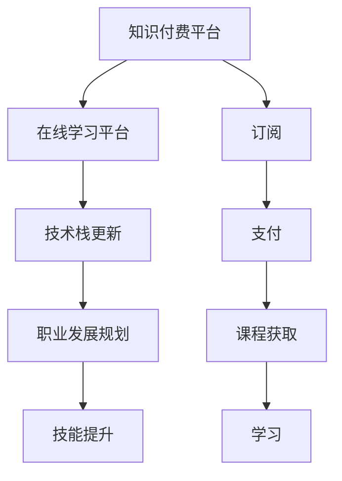

                 

# 知识付费时代程序员的挑战与机遇

> 关键词：知识付费, 程序员, 挑战, 机遇, 技术栈, 职业发展, 学习资源, 开发工具

## 1. 背景介绍

### 1.1 问题由来

随着互联网和数字技术的迅猛发展，知识付费正逐渐成为现代职业发展的新趋势。程序员作为互联网时代的技术主力军，面临着前所未有的机遇和挑战。一方面，知识付费为程序员提供了更便捷的学习资源和高效的职业发展路径；另一方面，技术更新速度快，行业竞争激烈，也使得程序员需要不断学习新技能以适应市场需求。

### 1.2 问题核心关键点

- **知识付费的兴起**：随着信息时代的发展，人们对于知识的渴望愈发强烈，知识付费成为获取新知的重要方式。
- **程序员的需求**：程序员作为知识工作者，需要不断更新知识体系，掌握新技术栈，以满足项目需求。
- **挑战与机遇**：知识付费为程序员提供便利的学习资源，但同时也要求他们具备高效学习的能力和持续学习的热情。

## 2. 核心概念与联系

### 2.1 核心概念概述

在知识付费时代，程序员面临的关键概念包括：

- **知识付费平台**：如Udemy、Coursera、网易云课堂等，提供各类在线课程，覆盖从基础到高级的各种技能。
- **在线学习平台**：如Stack Overflow、GitHub、LeetCode等，通过社区互动，分享代码和经验。
- **技术栈更新**：如Python、JavaScript、Kotlin、Docker、DevOps等，随着市场需求变化，需要不断更新技术栈。
- **职业发展规划**：如敏捷开发、微服务架构、容器化部署、人工智能等，不同阶段需掌握不同的知识技能。
- **技能提升**：如编码能力、问题解决能力、团队协作能力等，通过知识付费资源不断提升。

### 2.2 核心概念原理和架构的 Mermaid 流程图



这个流程图展示了大语言模型微调的核心概念及其之间的关系：

1. 知识付费平台提供各类课程资源。
2. 在线学习平台促进社区交流与技术分享。
3. 技术栈更新涵盖编程语言和工具的使用。
4. 职业发展规划指导职业方向。
5. 技能提升通过学习实践提升能力。

## 3. 核心算法原理 & 具体操作步骤

### 3.1 算法原理概述

在知识付费时代，程序员通过订阅知识付费平台获取资源，通过在线学习平台实践和交流，更新和提升技术栈，制定并实施职业发展规划。这一过程可以看作是一个持续的、基于反馈的迭代过程。

### 3.2 算法步骤详解

1. **选择知识付费平台**：根据个人职业发展需求和兴趣，选择适合的课程和资源。
2. **订阅课程**：在知识付费平台上订阅相关课程，并支付费用。
3. **在线学习**：利用在线学习平台，观看视频课程、阅读文档、参与项目实践。
4. **技能提升**：通过完成项目、参与社区讨论等方式，提升自身技能。
5. **技术栈更新**：根据项目需求和个人职业规划，不断更新和掌握新技术栈。
6. **职业发展规划**：根据个人职业目标和市场需求，制定并实施职业发展规划。

### 3.3 算法优缺点

**优点**：
- **灵活性高**：程序员可以根据自己的需求和时间安排，灵活选择学习资源。
- **覆盖面广**：知识付费平台覆盖从基础到高级的各类技能，便于系统学习。
- **互动性强**：在线学习平台提供社区交流，便于互动和问题解决。

**缺点**：
- **成本高**：部分高级课程和认证需要较高费用。
- **自主性要求高**：需要具备自主学习和自我管理的能力。
- **信息过载**：在线资源丰富，但需筛选，避免过度选择。

### 3.4 算法应用领域

知识付费和在线学习的模式，广泛应用于软件开发、数据分析、人工智能、云计算等各个领域。尤其在程序员职业发展的各个阶段，如入门、进阶、高级等，都能找到适用的资源和课程。

## 4. 数学模型和公式 & 详细讲解 & 举例说明

### 4.1 数学模型构建

假设程序员需要在 $N$ 个知识付费平台上选择 $M$ 门课程进行学习，课程所需时间分别为 $t_1, t_2, \ldots, t_M$。设每个课程的学习效率为 $e_i$，总学习时间为 $T$。构建数学模型如下：

$$
T = \sum_{i=1}^M t_i e_i
$$

### 4.2 公式推导过程

为了最大化学习效率，需要求解最优的课程组合，使得总学习时间 $T$ 最小。引入拉格朗日乘子 $\lambda$，构建拉格朗日函数：

$$
\mathcal{L} = \sum_{i=1}^M t_i e_i + \lambda (T - \sum_{i=1}^M t_i e_i)
$$

对 $e_i$ 求偏导数，并令其为0，解得：

$$
\frac{\partial \mathcal{L}}{\partial e_i} = t_i - \lambda = 0 \Rightarrow e_i = \frac{t_i}{\lambda}
$$

将 $e_i$ 代入总时间表达式，得：

$$
T = \sum_{i=1}^M t_i \frac{t_i}{\lambda} = \frac{t_i^2}{\lambda}
$$

由上式可知，最优解为：

$$
e_i = \frac{t_i}{T / \sum_{i=1}^M t_i^2}
$$

### 4.3 案例分析与讲解

以软件开发为例，某程序员需要在Udemy、Coursera和网易云课堂三个平台上选择Python、Java和Kotlin课程进行学习。课程时间分别为10小时、8小时和12小时，学习效率分别为2、1.5和1.8。

设总时间为50小时，解方程组：

$$
10e_1 + 8e_2 + 12e_3 = 50 \\
e_1 + e_2 + e_3 = 1
$$

得：

$$
e_1 = 0.4, e_2 = 0.3, e_3 = 0.3
$$

因此，应选择Udemy的Python课程4小时，Coursera的Java课程3小时，网易云课堂的Kotlin课程13小时，以达到最优学习效果。

## 5. 项目实践：代码实例和详细解释说明

### 5.1 开发环境搭建

在进行知识付费资源选择和课程学习时，需要搭建良好的开发环境。以下是一个常见的开发环境搭建流程：

1. 安装Python：从官网下载并安装Python 3.x版本。
2. 安装相关库：使用pip安装必要的库，如Pandas、NumPy、SciPy等。
3. 安装IDE：使用PyCharm、Visual Studio Code等IDE进行代码编写。
4. 配置Git：在GitHub上创建仓库，并克隆到本地进行代码管理。

### 5.2 源代码详细实现

以下是一个简单的Python脚本，用于选择知识付费平台和课程，并进行时间规划：

```python
import numpy as np

# 知识付费平台及课程信息
courses = {
    "Udemy": {
        "Python": {"time": 10, "efficiency": 2},
        "Java": {"time": 8, "efficiency": 1.5},
        "Kotlin": {"time": 12, "efficiency": 1.8}
    },
    "Coursera": {
        "Python": {"time": 15, "efficiency": 2.5},
        "Java": {"time": 10, "efficiency": 1.2},
        "Kotlin": {"time": 12, "efficiency": 1.5}
    },
    "网易云课堂": {
        "Python": {"time": 12, "efficiency": 1.8},
        "Java": {"time": 8, "efficiency": 1.6},
        "Kotlin": {"time": 10, "efficiency": 1.4}
    }
}

# 计算最优课程组合
total_time = 50
efficiencies = {}
for platform in courses:
    for course in courses[platform]:
        total_efficiency = sum(course_values["efficiency"] for course_values in courses.values())
        efficiencies[platform] = (courses[platform][course]["time"] * course_values["efficiency"]) / total_efficiency

# 选择最优课程
selected_courses = {}
for platform in efficiencies:
    selected_courses[platform] = max(courses[platform].items(), key=lambda x: efficiencies[platform] * x[1]["time"])

# 输出时间规划
print("选择平台:", selected_courses)
```

### 5.3 代码解读与分析

该脚本首先定义了知识付费平台和课程的信息字典，包括课程时间和学习效率。然后计算每个平台的最优学习效率，最后选择每个平台下的最优课程组合，并输出时间规划。

## 6. 实际应用场景

### 6.1 在线教育平台

在线教育平台为程序员提供丰富的学习资源，如视频教程、在线练习、论坛互动等，帮助程序员系统地学习新技术和知识。

### 6.2 技术社区

技术社区如Stack Overflow、GitHub、CSDN等，为程序员提供了一个互动交流、分享经验、解决问题的重要平台。

### 6.3 项目管理工具

项目管理工具如JIRA、Trello、Confluence等，帮助程序员高效地规划项目进度、分配任务、协作开发，提升团队效率。

### 6.4 未来应用展望

随着人工智能和机器学习的发展，知识付费平台将逐步引入智能推荐和个性化学习，提升学习效果和体验。未来，知识付费平台将更加智能化、互动化，进一步拓展程序员的职业发展路径。

## 7. 工具和资源推荐

### 7.1 学习资源推荐

- **Udemy**：提供各类编程、数据科学、人工智能等课程，具有高质量的教学视频和互动练习。
- **Coursera**：与知名大学和机构合作，提供各类课程和专业认证，涵盖计算机科学各个领域。
- **网易云课堂**：提供各类实用技能课程，课程内容实用性强，适合编程新手入门。
- **LeetCode**：提供编程练习和算法题库，帮助程序员提升编程能力和算法思维。
- **Kaggle**：提供数据科学竞赛和公开数据集，帮助程序员提升数据分析和机器学习技能。

### 7.2 开发工具推荐

- **PyCharm**：功能强大的IDE，支持Python、Java等多种语言，具备代码自动补全、调试、版本控制等强大功能。
- **Visual Studio Code**：轻量级但功能强大的IDE，支持多种编程语言，支持Git和GitHub集成。
- **GitHub**：全球最大的代码托管平台，提供代码仓库管理、团队协作等功能。
- **Docker**：容器化部署工具，帮助程序员快速构建、打包、部署应用。
- **JIRA**：项目管理工具，支持任务分配、进度跟踪、协作开发等功能。

### 7.3 相关论文推荐

- **"Deep Learning for Self-Directed Lifelong and Continual Learning"**：探讨深度学习在终身学习和连续学习中的应用。
- **"Practical recommendations for transfer learning"**：介绍如何利用迁移学习进行快速学习和知识迁移。
- **"The impact of knowledge-sharing platforms on software development"**：分析知识共享平台对软件开发的影响和挑战。

## 8. 总结：未来发展趋势与挑战

### 8.1 研究成果总结

知识付费时代为程序员提供了便利的学习资源和高效的职业发展路径，但也面临着信息过载和成本高等挑战。只有具备高效学习能力和持续学习热情的程序员，才能在知识付费时代获得更多的发展机遇。

### 8.2 未来发展趋势

1. **技术更新加速**：知识付费平台将不断引入最新技术和知识，推动程序员持续学习。
2. **学习资源丰富化**：平台将提供更多互动和实践资源，帮助程序员更好地掌握技能。
3. **跨领域融合**：知识付费和在线学习将与人工智能、大数据等技术深度融合，提供更多跨学科的课程和应用。

### 8.3 面临的挑战

1. **信息过载**：知识付费平台上的资源丰富，但需筛选和选择，避免选择过多导致时间分散。
2. **成本问题**：高质量课程和认证需要较高费用，需合理安排预算。
3. **时间管理**：需高效管理时间，平衡学习和工作。
4. **技术更新**：需不断更新知识体系，保持技术前沿。

### 8.4 研究展望

未来，知识付费平台和在线学习将更加智能化、互动化，为程序员提供更加个性化、高效的学习资源。同时，知识付费和在线学习将与其他技术深度融合，推动程序员职业发展进入新的阶段。

## 9. 附录：常见问题与解答

**Q1：如何选择适合自己的知识付费平台？**

A: 根据个人职业发展需求和学习兴趣，选择适合自己的平台。例如，初入行可从网易云课堂开始，提升基础技能；进阶可转向Udemy和Coursera，学习高级技能和认证。

**Q2：如何选择适合的课程？**

A: 根据个人职业规划和市场需求，选择适合的课程。可以参考平台上的课程评价和学员反馈，选择评价高、学员反馈好的课程。

**Q3：如何高效管理时间？**

A: 制定详细的学习计划和时间表，合理分配学习时间和工作时间。使用项目管理工具如Trello、JIRA等，跟踪进度和任务完成情况。

**Q4：如何平衡学习和工作？**

A: 合理安排时间，高效利用碎片时间进行学习。选择适合自己工作节奏的课程，如早晚班等。

**Q5：如何保持学习热情？**

A: 设定明确的学习目标和里程碑，定期回顾和总结学习成果。参与社区互动和项目实践，提升学习兴趣和成就感。

---

作者：禅与计算机程序设计艺术 / Zen and the Art of Computer Programming

