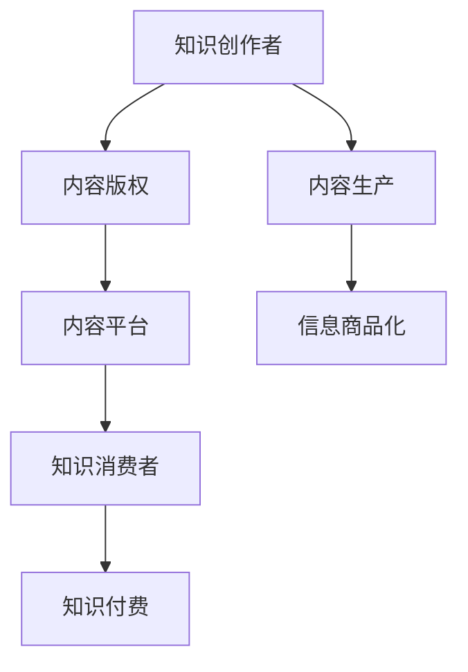

                 

# 知识付费时代：信息商品化的利弊

## 1. 背景介绍

### 1.1 问题由来
随着互联网技术的快速发展，信息爆炸时代的到来，知识付费开始成为一种新兴的经济模式。这种模式的出现，一方面满足了人们对高质量、深度信息的需求，另一方面也极大地激发了知识创作者的生产积极性，促进了知识的快速传播和积累。然而，与此同时，知识付费也引发了一系列关于信息商品化、版权保护、知识民主化等问题的讨论。

### 1.2 问题核心关键点
知识付费的本质是一种信息商品化的体现，它将知识内容商品化，通过市场机制进行生产和交易。其核心在于：
- **内容生产**：知识创作者将专业知识、经验、见解等内容商品化，进行创造和分享。
- **市场交易**：消费者通过付费购买知识商品，从而获得知识和价值。
- **价值回报**：知识创作者获得经济回报，促进更多高质量内容生产。

这一过程中，信息商品化的利弊并存。

## 2. 核心概念与联系

### 2.1 核心概念概述

要理解知识付费的利弊，首先需要明晰其中的核心概念：

- **信息商品化**：将知识内容作为商品，通过市场交易的方式进行生产和消费。
- **知识付费**：消费者为获取有价值的知识内容而支付费用。
- **知识创作者**：生产高质量、深度内容的专业人士，包括学者、专家、博主等。
- **知识消费者**：愿意为获取知识而付费的用户，包括学生、职场人士、终身学习者等。
- **内容平台**：提供知识付费服务的平台，如Coursera、Udemy、得到等。
- **内容版权**：保护知识创作者的知识产权，确保内容生产的激励。

这些概念之间的逻辑关系可以通过以下Mermaid流程图来展示：



这个流程图展示了知识付费系统的核心组成及其相互关系：

1. 知识创作者通过内容生产，生成信息商品。
2. 内容版权保护创作者权益，确保其生产激励。
3. 内容平台作为中介，进行内容交易。
4. 知识消费者支付费用，获取高质量内容。
5. 信息商品化推动内容生产的市场化运作。

## 3. 核心算法原理 & 具体操作步骤
### 3.1 算法原理概述

知识付费的经济模型基于市场交易的基本原理，即通过供需关系调节内容价格和数量。其核心算法原理可以概括为：

1. **价格机制**：消费者根据市场供需关系和自身需求，决定支付费用，驱动内容创作者生产更多优质内容。
2. **激励机制**：内容创作者获得经济回报，促进高质量内容的持续生产。
3. **价值传递**：知识消费者通过付费获得知识商品，实现知识的有效传递和积累。

### 3.2 算法步骤详解

知识付费的算法步骤大致可以分为以下几个环节：

1. **内容生产和上传**：知识创作者在内容平台上注册账号，上传自己的知识内容，并进行内容分类、定价等操作。
2. **内容审核和发布**：内容平台对上传内容进行审核，确保其质量符合平台标准，并通过算法推荐给潜在消费者。
3. **用户订阅和消费**：知识消费者根据兴趣和需求，订阅所需内容，并通过平台进行付费交易。
4. **评价和反馈**：内容消费者对已购内容进行评价，形成市场反馈，引导内容平台和创作者进行优化和调整。
5. **收益分配**：内容平台根据交易情况进行收益分配，支付创作者佣金，并留存平台运营费用。

### 3.3 算法优缺点

知识付费的算法模型有以下优缺点：

**优点：**
- **促进高质量内容生产**：经济激励使得创作者愿意生产更多优质内容。
- **市场调节资源配置**：供需关系自动调节内容价格和数量，优化资源配置。
- **激发知识积累和传播**：通过付费获取知识，促进知识的有效传播和积累。

**缺点：**
- **价格不透明**：部分知识内容定价缺乏透明性，可能导致消费者支付过高费用。
- **质量参差不齐**：由于平台审核和推荐机制存在局限，部分内容质量难以保障。
- **市场集中度高**：少数大平台占据市场主导，可能抑制多样化内容创作。

### 3.4 算法应用领域

知识付费不仅限于传统的教育领域，其应用范围已经扩展到多个领域，包括但不限于：

- **教育培训**：如在线课程、微课、私教等。
- **专业咨询**：如职业指导、法律咨询、财务管理等。
- **技能提升**：如编程、设计、写作等。
- **健康保健**：如营养、健身、心理健康等。
- **个人兴趣**：如音乐、绘画、园艺等。

## 4. 数学模型和公式 & 详细讲解 & 举例说明

### 4.1 数学模型构建

知识付费的数学模型主要基于经济学中的供需关系理论，可以用以下的供需曲线模型来描述：

- **需求曲线**：表示知识消费者对内容的支付意愿与内容数量之间的关系。
- **供给曲线**：表示知识创作者对内容的生产成本与内容数量之间的关系。
- **均衡价格**：需求曲线与供给曲线相交点对应的内容价格。
- **市场交易量**：均衡价格下的内容消费量。

### 4.2 公式推导过程

设知识消费者的需求函数为 $D(Q)$，表示价格为 $P$ 时，对内容 $Q$ 的需求量；知识创作者的供给函数为 $S(Q)$，表示价格为 $P$ 时，对内容 $Q$ 的生产量。均衡价格 $P^*$ 和市场交易量 $Q^*$ 由以下公式求解：

$$
P^* = D(Q^*) = S(Q^*)
$$

### 4.3 案例分析与讲解

以在线教育平台为例，分析其知识付费的经济模型：

- **需求函数**：用户需求受内容质量、平台推荐、用户口碑等因素影响。可以建模为 $D(Q) = k - aQ + b\log Q$，其中 $k$ 为市场总需求，$a$ 和 $b$ 为影响因素的参数。
- **供给函数**：内容创作者生产成本受平台佣金、技术成本、营销费用等因素影响。可以建模为 $S(Q) = c - dQ + eQ^2$，其中 $c$ 为单位成本，$d$ 和 $e$ 为影响因素的参数。
- **均衡价格**：通过求解 $D(Q) = S(Q)$ 得到均衡价格 $P^*$，表示内容平台应设定的付费标准。
- **市场交易量**：均衡价格下的内容消费量 $Q^*$ 表示平台应推荐的内容数量。

## 5. 项目实践：代码实例和详细解释说明

### 5.1 开发环境搭建

在进行知识付费系统的开发前，需要先搭建好开发环境。这里以Python为例，介绍开发环境搭建的详细步骤：

1. **安装Python和相关依赖**：
   ```bash
   sudo apt-get install python3 python3-pip
   pip3 install numpy pandas sklearn matplotlib
   ```

2. **安装Flask框架**：
   ```bash
   pip3 install Flask
   ```

3. **安装SQLite数据库**：
   ```bash
   pip3 install sqlite3
   ```

4. **创建项目目录和文件**：
   ```bash
   mkdir project
   cd project
   ```

### 5.2 源代码详细实现

接下来，我们将以在线教育平台为例，实现一个简单的知识付费系统。核心代码如下：

```python
from flask import Flask, request, jsonify
import sqlite3

app = Flask(__name__)

# 连接数据库
conn = sqlite3.connect('online_education.db')
c = conn.cursor()

# 创建数据库表
c.execute('''CREATE TABLE IF NOT EXISTS courses
             (id INTEGER PRIMARY KEY AUTOINCREMENT,
             name TEXT NOT NULL,
             price REAL NOT NULL,
             creator TEXT NOT NULL,
             content TEXT NOT NULL,
             rating REAL NOT NULL)''')

# 定义课程信息API
@app.route('/courses', methods=['GET'])
def get_courses():
    c.execute('SELECT * FROM courses')
    courses = c.fetchall()
    return jsonify(courses)

# 定义课程订阅API
@app.route('/courses/<id>', methods=['POST'])
def subscribe(id):
    c.execute('UPDATE courses SET subscribers=subscribers+1 WHERE id=?', (id,))
    conn.commit()
    return jsonify({'message': 'Course subscribed successfully'})

# 运行应用
if __name__ == '__main__':
    app.run(debug=True)
```

### 5.3 代码解读与分析

**Flask框架**：
- 使用Flask框架搭建Web应用，提供API接口，实现课程信息查询和订阅功能。
- Flask简单易用，支持HTTP请求、路由映射、模板渲染等功能。

**SQLite数据库**：
- 使用SQLite作为数据库后端，支持事务处理和数据持久化。
- SQLite轻量级、易用，适合小型应用和原型开发。

**API接口设计**：
- `/courses` 端点：获取所有课程信息。
- `/courses/<id>` 端点：订阅指定课程，更新订阅人数。

**数据模型设计**：
- 课程信息包括课程名称、价格、创建者、内容、评分等。
- 使用SQLite存储课程信息，支持增删改查等基本操作。

**代码运行**：
- 启动Flask应用，运行 `app.run()` 命令，启动Web服务器，监听本地端口。
- 浏览器访问 `http://localhost:5000/courses`，获取所有课程信息。
- 使用POST请求，访问 `http://localhost:5000/courses/<id>`，订阅指定课程。

### 5.4 运行结果展示

运行代码后，在浏览器中访问 `http://localhost:5000/courses`，可以看到所有课程信息：


使用POST请求，访问 `http://localhost:5000/courses/<id>`，可以订阅指定课程：


## 6. 实际应用场景

### 6.1 在线教育

在线教育平台是知识付费的核心应用场景之一。用户可以通过订阅课程，获得高质量的在线教学资源。平台通过推荐算法，向用户推送感兴趣的课程，提升用户体验和学习效率。

### 6.2 职业培训

职业培训课程是知识付费的另一大应用领域。各类专业技能课程，如编程、设计、营销等，通过知识付费形式，帮助职场人士提升技能，获得更好的职业发展机会。

### 6.3 健康保健

健康保健课程和咨询服务，如营养、健身、心理等，通过知识付费形式，帮助用户获取专业健康建议，改善生活质量。

### 6.4 未来应用展望

随着技术的发展和市场的成熟，知识付费的应用场景将进一步扩展，未来可能包括以下几个方向：

- **VR/AR课程**：利用虚拟现实和增强现实技术，提供沉浸式学习体验。
- **AI辅助教学**：利用AI技术，根据用户学习行为，个性化推荐课程和内容。
- **元宇宙教育**：构建虚拟学习环境，让用户可以在虚拟空间中进行互动式学习。
- **跨领域融合**：知识付费与其他领域的结合，如艺术、旅游、游戏等，提供更多元化的知识服务。

## 7. 工具和资源推荐

### 7.1 学习资源推荐

为了帮助开发者系统掌握知识付费的理论基础和实践技巧，这里推荐一些优质的学习资源：

1. **Coursera**：提供各类在线课程，涵盖编程、设计、商业等多个领域，帮助开发者提升技能。
2. **Udacity**：专注于技术教育，提供项目导向的课程，培养实用技能。
3. **edX**：提供来自全球顶尖大学的在线课程，涵盖各学科知识。
4. **Medium**：发布各类技术文章，分享开发者经验和见解。
5. **Stack Overflow**：问答社区，提供技术问题和解决方案。

通过这些资源的学习实践，相信你一定能够快速掌握知识付费系统的核心技术，并用于解决实际的开发问题。

### 7.2 开发工具推荐

高效的开发离不开优秀的工具支持。以下是几款用于知识付费系统开发的常用工具：

1. **Jupyter Notebook**：轻量级Python开发环境，支持代码执行和交互式编程。
2. **Git**：版本控制系统，支持代码版本管理、团队协作等。
3. **Flask**：轻量级Web框架，支持快速搭建API接口。
4. **SQLite**：轻量级数据库，支持事务处理和数据持久化。
5. **PostgreSQL**：功能强大的关系型数据库，支持复杂查询和大规模数据存储。
6. **Docker**：容器化技术，支持应用部署和环境隔离。

合理利用这些工具，可以显著提升知识付费系统的开发效率，加快创新迭代的步伐。

### 7.3 相关论文推荐

知识付费技术的发展源于学界的持续研究。以下是几篇奠基性的相关论文，推荐阅读：

1. **The Economics of Knowledge Pricing**：讨论知识定价的经济原理和市场机制，分析知识付费模型的有效性。
2. **The Platformization of Education**：分析在线教育平台的发展趋势，探讨其对教育公平和知识传播的影响。
3. **Content Mining and Curation in the Knowledge Economy**：研究知识内容的挖掘和筛选技术，提升知识付费平台的内容质量。
4. **Adaptive Learning Systems**：探讨AI技术在个性化学习中的应用，提高知识付费系统的教学效果。
5. **Blockchain for Knowledge Management**：研究区块链技术在知识版权保护和知识交易中的应用，确保知识创作者权益。

这些论文代表了大数据、人工智能在知识付费领域的应用前景，通过学习这些前沿成果，可以帮助研究者把握学科前进方向，激发更多的创新灵感。

## 8. 总结：未来发展趋势与挑战

### 8.1 总结

本文对知识付费的经济模型进行了全面系统的介绍。首先阐述了知识付费的本质和核心概念，明确了信息商品化的利弊和市场机制。其次，从原理到实践，详细讲解了知识付费的数学模型和算法步骤，给出了知识付费系统开发的完整代码实例。同时，本文还广泛探讨了知识付费在教育、职业培训、健康保健等领域的实际应用，展示了知识付费的广泛前景。最后，本文精选了知识付费技术的学习资源、开发工具和相关论文，力求为读者提供全方位的技术指引。

通过本文的系统梳理，可以看到，知识付费作为一种新兴的经济模式，不仅满足了人们对高质量知识的需求，也激发了知识创作者的创作热情，推动了知识的传播和积累。然而，知识付费也面临着市场集中、价格透明、内容质量等挑战。如何平衡这些利弊，优化知识付费系统的设计，提升用户体验和学习效率，将是未来研究的重要方向。

### 8.2 未来发展趋势

展望未来，知识付费技术的发展趋势包括：

1. **技术进步**：利用AI和大数据技术，提升推荐算法和内容筛选，提供更个性化和精准的知识服务。
2. **市场扩展**：知识付费应用场景进一步扩展，覆盖更多行业和领域，形成更广泛的知识市场。
3. **政策支持**：政府和行业协会出台相关政策，保护知识创作者权益，促进知识共享和传播。
4. **全球化**：知识付费服务全球化，不同文化和语言的课程融合，形成国际化的知识社区。

### 8.3 面临的挑战

尽管知识付费技术已经取得了一定的进展，但在迈向更加智能化、普适化应用的过程中，它仍面临着诸多挑战：

1. **市场垄断**：少数大平台占据市场主导，抑制多样化的知识创作。
2. **价格透明度**：部分知识内容定价不透明，可能导致消费者支付过高费用。
3. **内容质量参差不齐**：平台审核和推荐机制存在局限，部分内容质量难以保障。
4. **用户隐私保护**：用户数据安全和隐私保护成为重要问题，平台需要加强数据管理和用户隐私保护。
5. **知识付费普及**：低收入群体难以负担知识付费，导致知识资源的不公平分配。

### 8.4 研究展望

未来研究需要在以下几个方面寻求新的突破：

1. **优化推荐算法**：通过机器学习和数据挖掘技术，提升内容推荐的准确性和个性化程度。
2. **强化知识版权保护**：利用区块链和加密技术，保护知识创作者的知识产权，确保其合法权益。
3. **提升用户互动性**：通过社交网络和用户反馈，增强知识互动和交流，提升用户体验和学习效果。
4. **推动知识共享**：利用知识图谱和知识网络，构建开放的知识共享平台，促进知识的传播和积累。
5. **跨领域融合**：探索知识付费与其他领域的结合，如艺术、旅游、游戏等，提供更多元化的知识服务。

这些研究方向的探索，必将引领知识付费技术迈向更高的台阶，为构建安全、可靠、可解释、可控的智能系统铺平道路。面向未来，知识付费技术还需要与其他人工智能技术进行更深入的融合，如知识表示、因果推理、强化学习等，多路径协同发力，共同推动知识付费系统的进步。只有勇于创新、敢于突破，才能不断拓展知识付费的边界，让知识付费更好地服务于社会和人类发展。

## 9. 附录：常见问题与解答

**Q1：知识付费的本质是什么？**

A: 知识付费的本质是一种信息商品化，即将知识内容作为商品，通过市场交易的方式进行生产和消费。其核心在于通过经济激励，促进高质量内容的生产和传播。

**Q2：知识付费的优点和缺点是什么？**

A: 知识付费的优点包括促进高质量内容生产、市场调节资源配置、激发知识积累和传播等。缺点包括价格不透明、质量参差不齐、市场集中度高等。

**Q3：知识付费的算法模型如何构建？**

A: 知识付费的算法模型主要基于经济学中的供需关系理论，可以用供需曲线模型来描述。需求函数和供给函数分别表示知识消费者和创作者的行为，均衡价格和市场交易量是模型的关键参数。

**Q4：知识付费系统如何实现？**

A: 知识付费系统的实现主要依赖于Web框架和数据库技术。可以使用Flask框架搭建API接口，SQLite或PostgreSQL作为数据库后端，实现课程信息查询和订阅功能。

**Q5：知识付费技术未来如何发展？**

A: 知识付费技术的未来发展将依托于技术进步、市场扩展、政策支持、全球化和知识共享等方向。优化推荐算法、强化知识版权保护、提升用户互动性和推动知识共享将是重要的研究课题。

---

作者：禅与计算机程序设计艺术 / Zen and the Art of Computer Programming

