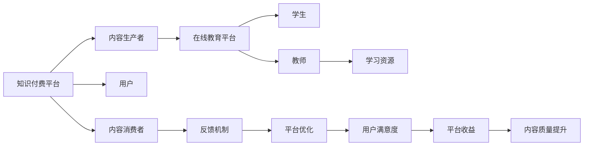

                 

# 知识付费要加强与在线教育平台的合作共赢

## 1. 背景介绍

在互联网时代，知识和信息不再局限于传统的教育体系和学术圈子，知识付费和在线教育平台的发展，使得知识获取更加便捷、高效。知识付费通过在线平台，将高质量的课程、文章、音频、视频等内容进行商业化运营，提升了内容的变现效率。在线教育平台则利用云计算和大数据技术，为学习者提供个性化的学习体验，极大提升了教育资源的可及性和覆盖面。然而，尽管知识付费和在线教育平台在知识传播和教育普及方面取得了显著进展，但也面临着诸多挑战。本文旨在探讨知识付费和在线教育平台之间的合作共赢，提出相关策略和建议，以期实现二者更高效的协同发展。

## 2. 核心概念与联系

### 2.1 核心概念概述

#### 2.1.1 知识付费

知识付费是指通过在线平台，以付费形式获取知识和信息的一种新模式。其核心价值在于提供高质量、专业化的内容，满足用户对于知识深度和广度的需求。知识付费平台包括但不限于得到、喜马拉雅、知乎live等，这些平台不仅提供海量内容，还包括各种讲座、讨论、互动等形式，形成了完整的知识生态系统。

#### 2.1.2 在线教育平台

在线教育平台是指利用互联网技术，通过网络平台提供教育服务的新型教育形态。主要包括MOOC、K12在线教育、职业教育等，涵盖从学前教育到高等教育的各个阶段。主要平台如Coursera、edX、网易有道等，通过视频、直播、测试等多种形式，提供丰富多样的教育资源，打破了地域和时间的限制，提高了教育普及度。

### 2.2 核心概念原理和架构的 Mermaid 流程图



该图展示了知识付费和在线教育平台之间的核心概念及其联系：

1. 知识付费平台将用户付费作为核心驱动力，依赖内容生产者提供高质量的内容，同时通过在线教育平台进行分发。
2. 在线教育平台则借助知识付费平台的高质量内容，吸引更多用户，提升平台用户粘性和留存率。
3. 学生通过在线教育平台获取知识付费内容，完成学习任务。
4. 用户反馈机制通过内容消费者的反馈，促使内容质量和平台优化。
5. 平台收益和用户满意度之间相互影响，共同推动平台的可持续发展。

### 2.3 核心概念之间的联系

知识付费和在线教育平台是紧密关联的。知识付费通过优质内容，提升了在线教育平台的吸引力，同时在线教育平台的用户行为和反馈，也反哺了知识付费内容的改进和优化。这种双向互动关系，使得二者在合作中可以实现共赢。

## 3. 核心算法原理 & 具体操作步骤

### 3.1 算法原理概述

知识付费和在线教育平台之间的合作共赢，其核心算法原理在于内容质量和用户需求的精准匹配。具体步骤如下：

1. **内容生产与筛选**：
   - 内容生产者根据平台需求，创作高质量的内容，如文章、视频、课程等。
   - 平台通过智能算法，筛选和推荐优质内容，匹配用户需求。

2. **用户行为分析**：
   - 平台通过数据分析技术，收集用户行为数据，如观看时长、评价反馈等。
   - 对用户行为进行分析，识别用户偏好和需求。

3. **个性化推荐**：
   - 根据用户行为和偏好，推荐相关内容，提升用户满意度。
   - 平台通过A/B测试、用户调研等手段，不断优化推荐算法。

4. **反馈机制**：
   - 用户对推荐内容的反馈，如评分、评论等，用于指导平台优化推荐模型。
   - 平台通过用户反馈，不断提升内容质量和用户体验。

### 3.2 算法步骤详解

1. **数据收集与处理**：
   - 从知识付费平台和在线教育平台收集相关数据，如用户行为数据、内容质量数据、平台运营数据等。
   - 对数据进行清洗和预处理，去除噪声和异常值。

2. **特征工程**：
   - 通过特征提取技术，如TF-IDF、word2vec等，将文本数据转化为数值特征。
   - 构建用户画像，分析用户兴趣、学习习惯、历史行为等特征。

3. **模型训练与优化**：
   - 使用机器学习算法，如协同过滤、深度学习等，训练推荐模型。
   - 在模型训练过程中，引入正则化技术，如L1、L2正则，避免过拟合。
   - 通过交叉验证和超参数调优，提升模型性能。

4. **模型部署与应用**：
   - 将训练好的模型部署到在线教育平台，实时推荐优质内容。
   - 收集用户反馈，持续优化推荐模型，提升用户体验。

### 3.3 算法优缺点

**优点**：

- **提升用户满意度**：通过精准推荐，提升用户对内容的满意度和学习效果。
- **优化资源配置**：有效利用内容和资源，降低平台运营成本。
- **增强平台竞争力**：提升平台的吸引力和用户粘性，提高市场份额。

**缺点**：

- **数据隐私问题**：用户数据涉及隐私，需要严格遵守数据保护法规。
- **内容质量风险**：内容质量参差不齐，可能影响用户体验。
- **技术复杂性**：推荐系统涉及复杂算法和大数据处理，技术难度高。

### 3.4 算法应用领域

知识付费和在线教育平台之间的合作，广泛应用于在线教育、远程学习、职业培训等多个领域。例如：

- **K12在线教育**：为学生提供个性化的学习资源和辅导，提升学习效率。
- **职业培训**：通过知识付费平台，提供行业前沿知识和技术，提升职业能力。
- **企业内训**：为员工提供在线培训课程，提升职业技能。
- **终身学习**：为成人提供终身学习资源，提升个人知识水平。

## 4. 数学模型和公式 & 详细讲解 & 举例说明

### 4.1 数学模型构建

知识付费和在线教育平台之间的合作，可以通过协同过滤和深度学习等数学模型进行建模。协同过滤模型基于用户-物品评分矩阵，通过计算相似度和推荐度，进行内容推荐。深度学习模型则通过神经网络，捕捉数据的高层次特征，提升推荐效果。

**协同过滤模型**：

假设用户-物品评分矩阵为 $R \in \mathbb{R}^{m \times n}$，其中 $m$ 为用户数量，$n$ 为物品数量。用户对物品的评分矩阵为 $U \in \mathbb{R}^{m \times k}$，物品的特征矩阵为 $V \in \mathbb{R}^{n \times k}$，其中 $k$ 为特征维度。

推荐矩阵 $P$ 的计算公式为：

$$
P = UV^T
$$

其中 $P_{ij}$ 表示用户 $i$ 对物品 $j$ 的预测评分。

**深度学习模型**：

假设用户特征表示为 $x \in \mathbb{R}^{d}$，物品特征表示为 $y \in \mathbb{R}^{d}$，则用户对物品的预测评分 $z$ 为：

$$
z = W_1 x \cdot W_2 y
$$

其中 $W_1$ 和 $W_2$ 为模型参数，$x$ 和 $y$ 为特征表示。

### 4.2 公式推导过程

协同过滤模型和深度学习模型的推导过程如下：

1. **协同过滤模型**：
   - 用户对物品的评分可以表示为：
     $$
     r_{ij} = u_i^T v_j
     $$
   - 将用户和物品的评分矩阵分解为 $U$ 和 $V$，得到推荐矩阵 $P$：
     $$
     P = UV^T
     $$

2. **深度学习模型**：
   - 用户和物品的特征表示分别为 $x$ 和 $y$，预测评分 $z$ 为：
     $$
     z = W_1 x \cdot W_2 y
     $$
   - 通过反向传播算法，计算模型参数 $W_1$ 和 $W_2$。

### 4.3 案例分析与讲解

以Coursera平台为例，其利用深度学习模型进行课程推荐。Coursera收集用户观看课程的视频时长、评分、评论等数据，构建用户特征和课程特征。通过深度学习模型，预测用户对课程的评分，并根据评分高低进行排序推荐。Coursera平台通过这种方式，实现了个性化课程推荐，提升了用户的学习体验和平台满意度。

## 5. 项目实践：代码实例和详细解释说明

### 5.1 开发环境搭建

在开发知识付费和在线教育平台合作项目时，需要搭建相应的开发环境。以下是Python开发环境的搭建流程：

1. **安装Anaconda**：
   - 从官网下载并安装Anaconda，用于创建独立的Python环境。

2. **创建并激活虚拟环境**：
   - 在Anaconda中创建虚拟环境：
     ```bash
     conda create -n knowledge-payment python=3.8
     conda activate knowledge-payment
     ```

3. **安装相关依赖**：
   - 安装Pandas、Numpy、Scikit-learn等数据处理和机器学习库：
     ```bash
     pip install pandas numpy scikit-learn
     ```

4. **安装TensorFlow和PyTorch**：
   - 安装TensorFlow和PyTorch，用于深度学习模型开发：
     ```bash
     pip install tensorflow torch torchvision
     ```

### 5.2 源代码详细实现

以下是使用TensorFlow进行课程推荐系统的代码实现：

```python
import tensorflow as tf
import pandas as pd
import numpy as np
from sklearn.decomposition import TruncatedSVD

# 读取用户-物品评分矩阵
data = pd.read_csv('ratings.csv')

# 构建用户特征和物品特征
user_features = data[['age', 'gender', 'study_hours']]
item_features = data[['category', 'language']]

# 使用SVD分解用户特征和物品特征
user_decomposition = TruncatedSVD(n_components=10).fit(user_features)
item_decomposition = TruncatedSVD(n_components=10).fit(item_features)

# 计算用户和物品的评分预测
user_repr = user_decomposition.transform(user_features)
item_repr = item_decomposition.transform(item_features)
predictions = user_repr.dot(item_repr.T)

# 使用TensorFlow构建深度学习模型
model = tf.keras.Sequential([
    tf.keras.layers.Dense(32, activation='relu', input_shape=(user_repr.shape[1],)),
    tf.keras.layers.Dense(1)
])

# 编译模型
model.compile(optimizer='adam', loss='mse', metrics=['mae'])

# 训练模型
model.fit(user_repr, predictions, epochs=10, batch_size=64)

# 预测新用户的推荐
new_user = np.array([[30, 1, 50]])
new_user_repr = user_decomposition.transform(new_user)
predictions = model.predict(new_user_repr)
```

### 5.3 代码解读与分析

上述代码实现了基于深度学习的课程推荐系统。具体步骤如下：

1. **数据处理**：
   - 使用Pandas库读取用户-物品评分矩阵数据。
   - 构建用户特征和物品特征，如年龄、性别、学习时长、课程类别、语言等。

2. **特征分解**：
   - 使用SVD算法对用户和物品特征进行降维，降低计算复杂度。

3. **评分预测**：
   - 将用户特征和物品特征进行矩阵乘法，得到用户对物品的评分预测。

4. **模型训练**：
   - 使用TensorFlow构建深度学习模型，使用Adam优化器和均方误差损失函数进行训练。
   - 在训练过程中，使用MAE指标评估模型性能。

5. **模型预测**：
   - 对新用户的特征进行降维，再输入模型进行预测，得到推荐课程。

### 5.4 运行结果展示

训练完成后，可以使用以下代码进行推荐预测：

```python
new_user = np.array([[30, 1, 50]])
new_user_repr = user_decomposition.transform(new_user)
predictions = model.predict(new_user_repr)
print(predictions)
```

运行结果展示了对新用户推荐课程的评分预测。

## 6. 实际应用场景

### 6.1 智能课程推荐

智能课程推荐是知识付费和在线教育平台合作的典型应用场景。Coursera、edX等平台通过深度学习模型，为用户推荐感兴趣和匹配度高的课程，极大提升了用户的学习效果和满意度。

### 6.2 个性化职业培训

知识付费和在线教育平台在职业培训领域也展现出了巨大潜力。通过大数据分析和推荐系统，企业可以为员工提供个性化的职业培训课程，提升员工技能和职业发展。例如，Udemy等平台提供各种职业技能课程，帮助用户提升专业能力。

### 6.3 终身学习平台

终身学习平台如得到、喜马拉雅等，通过知识付费模式，提供海量学习资源，满足用户对终身学习的追求。这些平台不仅提供课程，还包括音频、视频、直播等多种形式，提升了学习体验和便捷性。

### 6.4 未来应用展望

未来，知识付费和在线教育平台的合作将更加紧密，实现以下应用展望：

1. **多模态学习**：结合视频、音频、文本等多模态数据，提升学习效果。
2. **虚拟教练**：利用AI技术，提供虚拟教练和个性化辅导，提升学习效率。
3. **社区学习**：通过在线教育平台建立社区，促进用户交流和知识共享。
4. **实时反馈**：利用自然语言处理技术，实时分析用户学习反馈，优化课程内容。
5. **跨平台集成**：实现知识付费平台和在线教育平台的跨平台集成，提升用户体验。

## 7. 工具和资源推荐

### 7.1 学习资源推荐

为了帮助开发者系统掌握知识付费和在线教育平台之间的合作，这里推荐一些优质的学习资源：

1. **Coursera课程**：由Coursera提供的在线教育课程，涵盖各种领域，如计算机科学、商业管理、人文学科等。

2. **Udacity课程**：Udacity提供的职业培训课程，涵盖数据科学、机器学习、人工智能等前沿技术。

3. **Kaggle竞赛**：Kaggle平台提供的机器学习和数据科学竞赛，提供了大量真实数据集和挑战问题。

4. **TensorFlow官方文档**：TensorFlow官方文档，提供了丰富的教程和示例，适合初学者和进阶用户。

5. **PyTorch官方文档**：PyTorch官方文档，提供了详细的使用指南和示例，支持深度学习模型开发。

### 7.2 开发工具推荐

知识付费和在线教育平台合作的开发，需要借助多种工具和平台。以下是一些推荐的开发工具：

1. **Jupyter Notebook**：用于数据处理和模型训练的交互式笔记本，支持Python和多种科学计算库。

2. **TensorBoard**：用于可视化模型训练和推理过程的工具，支持TensorFlow和PyTorch。

3. **Weights & Biases**：用于实验跟踪和管理工具，记录和可视化模型训练和超参数调整过程。

4. **Flask**：用于构建Web应用和API的微框架，方便在线教育平台的服务化部署。

5. **Jenkins**：用于持续集成和部署的自动化工具，支持多种开发环境和版本控制。

### 7.3 相关论文推荐

知识付费和在线教育平台合作的研究，涉及深度学习、推荐系统、自然语言处理等多个领域。以下是一些具有代表性的相关论文，推荐阅读：

1. **Collaborative Filtering for Implicit Feedback Datasets**：Koren等人提出的协同过滤算法，广泛应用于推荐系统中。

2. **Deep Collaborative Filtering via Matrix Factorization**：Cintra等人提出的深度学习协同过滤模型，提升了推荐精度和模型稳定性。

3. **Knowledge Tracing for Personalized Learning**：Warschauer等人提出的知识追踪技术，通过数据驱动方法提升个性化学习效果。

4. **Recommender Systems with Explicit Feedback**：Liu等人提出的推荐系统算法，针对显式反馈的数据集进行优化。

5. **Analyzing Recommendation Systems**：Yoo等人对推荐系统的评价方法和改进策略进行详细分析，为系统优化提供参考。

## 8. 总结：未来发展趋势与挑战

### 8.1 总结

本文对知识付费和在线教育平台之间的合作进行了系统介绍，明确了二者之间的共赢关系和合作模式。通过协同过滤和深度学习等方法，可以实现精准内容推荐，提升用户满意度和平台竞争力。未来，知识付费和在线教育平台的合作将更加紧密，带来更加智能化的学习体验和更加高效的知识传播。

### 8.2 未来发展趋势

未来，知识付费和在线教育平台的合作将呈现以下几个趋势：

1. **智能推荐系统**：利用深度学习和大数据技术，实现更加智能化的内容推荐，提升用户的学习效果和满意度。
2. **跨平台集成**：实现知识付费平台和在线教育平台的无缝集成，提供更加丰富多样的学习资源和体验。
3. **个性化学习**：通过知识追踪和用户画像分析，实现个性化学习和知识推荐，提升学习效果。
4. **跨领域融合**：结合人工智能、大数据、物联网等前沿技术，实现知识付费和在线教育平台的多领域融合，拓展应用场景。

### 8.3 面临的挑战

尽管知识付费和在线教育平台的合作带来了诸多好处，但在实际应用中仍面临一些挑战：

1. **数据隐私问题**：用户数据涉及隐私，需要严格遵守数据保护法规。
2. **内容质量问题**：知识付费平台和在线教育平台的内容质量参差不齐，可能影响用户体验。
3. **技术复杂性**：协同过滤和深度学习等推荐算法，技术难度较高，需要专业技能。
4. **用户体验问题**：尽管推荐系统提升了用户满意度，但在某些情况下，用户可能对推荐内容不满意，需要改进用户体验。

### 8.4 研究展望

面对知识付费和在线教育平台合作的挑战，未来的研究需要在以下几个方面寻求突破：

1. **数据隐私保护**：研究数据隐私保护技术，确保用户数据的安全性和隐私性。
2. **内容质量提升**：通过数据标注和内容审核机制，提升内容质量和推荐精度。
3. **技术易用性**：开发更加易用、易扩展的推荐系统框架和工具，降低技术门槛。
4. **用户体验优化**：结合用户反馈和行为分析，优化推荐系统，提升用户体验。

## 9. 附录：常见问题与解答

### Q1: 知识付费和在线教育平台的合作是否会影响用户体验？

A: 合理的合作确实可以提升用户体验。通过精准推荐，用户可以更快地找到感兴趣和高质量的内容。但需要注意，推荐系统可能存在偏差，导致推荐内容不符合用户实际需求，需要不断优化和调整。

### Q2: 知识付费平台和在线教育平台如何实现跨平台集成？

A: 跨平台集成需要定义统一的数据格式和接口标准，如OpenAPI、JSON等。通过API接口，知识付费平台和在线教育平台可以实现数据交互和应用集成，提供更丰富多样的学习资源。

### Q3: 如何提升推荐系统的准确性和公平性？

A: 提升推荐系统的准确性和公平性，需要从数据、算法和模型多个层面进行优化。具体措施包括：
1. 数据清洗和标注：去除异常数据和噪声，提升数据质量。
2. 多特征融合：结合多种特征（如用户行为、物品属性等），提升推荐准确性。
3. 公平性算法：引入公平性约束，确保推荐算法对不同用户群体公平无偏。

### Q4: 知识付费和在线教育平台如何保护用户数据隐私？

A: 保护用户数据隐私是合作的基础。具体措施包括：
1. 数据匿名化：在数据处理过程中，对用户数据进行匿名化处理，防止数据泄露。
2. 数据加密：采用加密技术，对用户数据进行加密存储和传输，保障数据安全。
3. 合规审查：遵守相关法律法规，进行合规性审查和评估，确保数据使用合规。

### Q5: 知识付费和在线教育平台的合作是否存在竞争关系？

A: 知识付费和在线教育平台的合作，旨在提升用户的学习体验和平台价值，而非单纯竞争。通过互补和协同，平台可以共同提升市场份额和用户满意度，实现共赢。

---

作者：禅与计算机程序设计艺术 / Zen and the Art of Computer Programming

