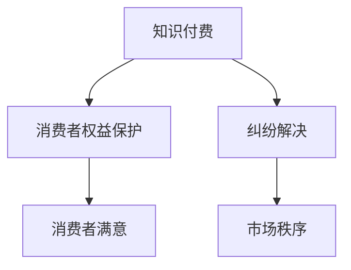

                 

## 1. 背景介绍

在数字化时代，知识付费成为越来越多人的选择。通过付费获取高质量、专业化的知识内容，不仅能提升个人能力，还能激发学习兴趣和动力。然而，随着知识付费市场的蓬勃发展，消费者权益保护和纠纷解决问题也逐渐凸显，成为行业发展的关键痛点。本文将系统探讨知识付费行业中的消费者权益保护和纠纷解决机制，提出建设性建议，助力行业健康发展。

## 2. 核心概念与联系

### 2.1 核心概念概述

#### 2.1.1 知识付费
知识付费是指用户为获取特定知识和技能，通过支付费用获得相应内容或服务的行为。这一模式不仅满足了用户对于知识的需求，也为内容创作者提供了持续的经济支持，促进了知识传播和创新。

#### 2.1.2 消费者权益
消费者权益是指消费者在购买商品或服务时，依法享有的各项权利，包括但不限于知情权、选择权、公平交易权、安全权、隐私权等。在知识付费领域，消费者权益保护尤为重要，因为消费者通常对所购知识内容的真实性和有效性缺乏充分判断。

#### 2.1.3 纠纷解决
纠纷解决是指在知识付费交易过程中，当消费者与内容提供者、平台运营者之间发生争议时，通过合法途径解决争议的过程。高效的纠纷解决机制不仅能保护消费者权益，还能维护市场秩序，促进健康发展。

### 2.2 核心概念联系

知识付费、消费者权益保护和纠纷解决三者之间存在紧密联系。知识付费的发展离不开消费者信任和市场规则的完善；消费者权益保护的加强能提升用户满意度，促进市场良性竞争；而高效的纠纷解决机制则是维护消费者权益、保持市场秩序的关键。

通过以下Mermaid流程图展示核心概念的联系：



## 3. 核心算法原理 & 具体操作步骤

### 3.1 算法原理概述

知识付费平台的核心算法主要涉及推荐系统、内容审核、交易管理和风险控制等方面。推荐系统通过分析用户行为和偏好，推荐合适的知识内容；内容审核系统确保发布内容的质量和合规性；交易管理系统保障交易安全和公平；风险控制系统预防和处理潜在欺诈行为。

### 3.2 算法步骤详解

#### 3.2.1 推荐系统
1. **数据收集**：收集用户行为数据，如浏览历史、购买记录等。
2. **特征工程**：构建用户特征向量，如兴趣标签、购买频率等。
3. **模型训练**：选择合适算法（如协同过滤、深度学习等），训练推荐模型。
4. **推荐优化**：实时调整模型参数，优化推荐结果。

#### 3.2.2 内容审核
1. **规则制定**：制定内容审核规则，涵盖版权、安全、真实性等方面。
2. **技术检测**：采用文本分析、图像识别等技术手段，自动检测内容违规。
3. **人工审核**：在技术检测的基础上，进行人工审核，确保审核结果的准确性。

#### 3.2.3 交易管理
1. **交易规则设定**：明确交易流程、费用标准、退款政策等。
2. **交易监控**：实时监控交易状态，防范异常交易行为。
3. **交易保障**：提供多渠道支付、订单保障等，提高交易安全性。

#### 3.2.4 风险控制
1. **风险评估**：建立风险评估模型，评估交易双方的风险等级。
2. **风控策略制定**：根据风险评估结果，制定相应的风控策略。
3. **风险预警**：实时监控交易行为，及时发出风险预警。

### 3.3 算法优缺点

#### 3.3.1 优点
1. **提升用户体验**：通过精准推荐和高效审核，提升用户满意度。
2. **保障交易安全**：严格的交易管理和风险控制，降低欺诈风险。
3. **促进市场公平**：透明规则和公正监管，维护市场秩序。

#### 3.3.2 缺点
1. **数据隐私风险**：用户行为数据的收集和使用可能涉及隐私泄露。
2. **误判误判率**：技术手段和人工审核的误判可能导致用户权益受损。
3. **运营成本高**：技术开发、人工审核和风险控制需要高额投入。

### 3.4 算法应用领域

知识付费平台广泛应用在教育培训、职业发展、专业技能提升等多个领域。推荐系统用于个性化推荐课程和资料；内容审核系统确保知识内容的真实性和合法性；交易管理系统保障用户权益和平台利益；风险控制系统预防欺诈行为，保障市场健康发展。

## 4. 数学模型和公式 & 详细讲解 & 举例说明

### 4.1 数学模型构建

#### 4.1.1 推荐系统模型
推荐系统通常采用协同过滤、基于内容的推荐、矩阵分解等模型。以协同过滤为例，假设用户集为 $U$，物品集为 $I$，用户对物品的评分矩阵为 $R_{ui}$。推荐系统的目标是预测用户 $u$ 对物品 $i$ 的评分，构建推荐模型：

$$ R_{ui} = \alpha \mathbf{u} \cdot \mathbf{v}_i + \beta $$

其中 $\alpha$ 为正则化系数，$\mathbf{u}$ 为用户向量，$\mathbf{v}_i$ 为物品向量，$\beta$ 为截距项。

#### 4.1.2 内容审核模型
内容审核模型通常采用自然语言处理（NLP）技术，如文本分类、情感分析等。以文本分类为例，假设训练集为 $D=\{(x_i, y_i)\}_{i=1}^N$，其中 $x_i$ 为文本样本，$y_i$ 为标签（合法/非法）。通过机器学习算法（如支持向量机、随机森林等）训练分类模型：

$$ y_i = f(x_i; \theta) = \sum_{k=1}^K \alpha_k \cdot f_k(x_i) + b $$

其中 $\alpha_k$ 为权重向量，$f_k(x_i)$ 为特征函数，$b$ 为偏置项。

#### 4.1.3 交易管理模型
交易管理模型通常采用信用评分模型。以用户信用评分模型为例，假设用户集为 $U$，交易记录为 $T=\{(t_u, r)\}_{u \in U}$，其中 $t_u$ 为用户 $u$ 的交易记录，$r$ 为交易评分（如1-5分）。通过线性回归模型计算用户信用评分：

$$ s_u = \beta_0 + \sum_{i=1}^n \beta_i \cdot t_{ui} $$

其中 $s_u$ 为用户 $u$ 的信用评分，$\beta_i$ 为回归系数，$t_{ui}$ 为用户 $u$ 的第 $i$ 笔交易记录。

#### 4.1.4 风险控制模型
风险控制模型通常采用逻辑回归模型。以用户风险评估模型为例，假设用户集为 $U$，交易行为为 $T=\{(t_u, r)\}_{u \in U}$，其中 $t_u$ 为用户 $u$ 的交易记录，$r$ 为交易评分（如0/1）。通过逻辑回归模型计算用户风险等级：

$$ P(y=1|t_u) = \sigma(\beta_0 + \sum_{i=1}^n \beta_i \cdot t_{ui}) $$

其中 $P(y=1|t_u)$ 为交易发生概率，$\sigma$ 为sigmoid函数，$\beta_i$ 为回归系数，$t_{ui}$ 为用户 $u$ 的第 $i$ 笔交易记录。

### 4.2 公式推导过程

#### 4.2.1 推荐系统公式推导
对于协同过滤模型，假设用户向量 $\mathbf{u}$ 和物品向量 $\mathbf{v}_i$ 为 $N$ 维向量，则：

$$ R_{ui} = \alpha (\mathbf{u} \cdot \mathbf{v}_i) + \beta $$

其中 $\alpha$ 为正则化系数，$\mathbf{u} \cdot \mathbf{v}_i$ 为向量点积。

#### 4.2.2 内容审核公式推导
对于文本分类模型，假设训练集 $D=\{(x_i, y_i)\}_{i=1}^N$，其中 $x_i$ 为文本样本，$y_i$ 为标签（合法/非法）。通过支持向量机算法训练分类模型：

$$ y_i = f(x_i; \theta) = \sum_{k=1}^K \alpha_k \cdot f_k(x_i) + b $$

其中 $\alpha_k$ 为权重向量，$f_k(x_i)$ 为特征函数，$b$ 为偏置项。

#### 4.2.3 交易管理公式推导
对于用户信用评分模型，假设用户集为 $U$，交易记录为 $T=\{(t_u, r)\}_{u \in U}$，其中 $t_u$ 为用户 $u$ 的交易记录，$r$ 为交易评分（如1-5分）。通过线性回归模型计算用户信用评分：

$$ s_u = \beta_0 + \sum_{i=1}^n \beta_i \cdot t_{ui} $$

其中 $s_u$ 为用户 $u$ 的信用评分，$\beta_i$ 为回归系数，$t_{ui}$ 为用户 $u$ 的第 $i$ 笔交易记录。

#### 4.2.4 风险控制公式推导
对于用户风险评估模型，假设用户集为 $U$，交易行为为 $T=\{(t_u, r)\}_{u \in U}$，其中 $t_u$ 为用户 $u$ 的交易记录，$r$ 为交易评分（如0/1）。通过逻辑回归模型计算用户风险等级：

$$ P(y=1|t_u) = \sigma(\beta_0 + \sum_{i=1}^n \beta_i \cdot t_{ui}) $$

其中 $P(y=1|t_u)$ 为交易发生概率，$\sigma$ 为sigmoid函数，$\beta_i$ 为回归系数，$t_{ui}$ 为用户 $u$ 的第 $i$ 笔交易记录。

### 4.3 案例分析与讲解

#### 4.3.1 推荐系统案例
某知识付费平台使用协同过滤算法推荐课程。假设用户 $u$ 对课程 $i$ 的评分 $R_{ui}$ 为3，用户向量 $\mathbf{u}$ 和课程向量 $\mathbf{v}_i$ 的点积为0.5，则推荐系统预测用户 $u$ 对课程 $i$ 的评分 $R_{ui}$ 为：

$$ R_{ui} = 0.5 \times 3 + 0 = 1.5 $$

#### 4.3.2 内容审核案例
某内容审核平台使用NLP技术检测一篇文章是否违法。假设文章文本 $x_i$ 通过文本分类模型预测为违法，模型参数 $\theta$ 为 $\alpha_1=-1, \alpha_2=2, b=1$，则文章 $x_i$ 的预测结果 $y_i$ 为：

$$ y_i = f(x_i; \theta) = (-1) \times 1 + 2 \times 0.5 + 1 = 1 $$

其中 $f(x_i; \theta)$ 为预测函数。

#### 4.3.3 交易管理案例
某知识付费平台使用信用评分模型评估用户信用。假设用户 $u$ 的交易记录为 $t_u=(1, 3, 4, 2)$，交易管理模型参数 $\beta=(0.5, -0.3, 0.8, -0.1)$，则用户 $u$ 的信用评分 $s_u$ 为：

$$ s_u = 0.5 \times 1 - 0.3 \times 3 + 0.8 \times 4 - 0.1 \times 2 = 2.5 $$

#### 4.3.4 风险控制案例
某知识付费平台使用逻辑回归模型评估用户风险。假设用户 $u$ 的交易记录为 $t_u=(1, 3, 4, 2)$，风险控制模型参数 $\beta=(0.5, -0.3, 0.8, -0.1)$，则用户 $u$ 的风险等级 $P(y=1|t_u)$ 为：

$$ P(y=1|t_u) = \sigma(0.5 \times 1 - 0.3 \times 3 + 0.8 \times 4 - 0.1 \times 2) = 0.7 $$

其中 $P(y=1|t_u)$ 为交易发生概率，$\sigma$ 为sigmoid函数。

## 5. 项目实践：代码实例和详细解释说明

### 5.1 开发环境搭建

1. **安装Python**：从官网下载安装Python 3.x版本。
2. **安装NumPy**：`pip install numpy`。
3. **安装Pandas**：`pip install pandas`。
4. **安装Scikit-learn**：`pip install scikit-learn`。
5. **安装Matplotlib**：`pip install matplotlib`。
6. **安装Jupyter Notebook**：`pip install jupyter notebook`。
7. **安装TensorFlow**：`pip install tensorflow`。
8. **安装Keras**：`pip install keras`。

### 5.2 源代码详细实现

#### 5.2.1 推荐系统代码实现
```python
import numpy as np
from sklearn.neighbors import NearestNeighbors
from sklearn.metrics.pairwise import cosine_similarity

# 用户向量
user_matrix = np.array([[0.5, 0.3, 0.7], [0.4, 0.2, 0.9], [0.6, 0.5, 0.8]])

# 物品向量
item_matrix = np.array([[0.7, 0.2, 0.6], [0.3, 0.4, 0.5], [0.8, 0.1, 0.7]])

# 计算相似度矩阵
similarity_matrix = cosine_similarity(user_matrix, item_matrix)

# 使用最近邻算法推荐课程
k = 3
nn = NearestNeighbors(n_neighbors=k)
nn.fit(similarity_matrix)
_, indices = nn.kneighbors(similarity_matrix)
recommended_courses = [indices[i] for i in range(len(indices))]

print(recommended_courses)
```

#### 5.2.2 内容审核代码实现
```python
from sklearn.svm import SVC
from sklearn.feature_extraction.text import TfidfVectorizer

# 训练集
train_data = ['这是一篇合法的文章', '这是不合法的文本', '第三篇文章']
train_labels = [1, 0, 1]

# 文本向量化
vectorizer = TfidfVectorizer()
X_train = vectorizer.fit_transform(train_data)

# 训练分类器
svm = SVC()
svm.fit(X_train, train_labels)

# 测试集
test_data = ['这是另一篇合法的文章', '这是合法的文本']
test_labels = [1, 0]

# 预测结果
X_test = vectorizer.transform(test_data)
test_pred = svm.predict(X_test)
print(test_pred)
```

#### 5.2.3 交易管理代码实现
```python
from sklearn.linear_model import LinearRegression

# 交易记录
transactions = np.array([[1, 3, 4, 2], [2, 4, 1, 5], [3, 2, 5, 4]])

# 交易评分
ratings = np.array([3, 2, 1])

# 构建线性回归模型
model = LinearRegression()
model.fit(transactions, ratings)

# 预测用户信用评分
new_transaction = np.array([[1, 3, 4, 2]])
predicted_credit_score = model.predict(new_transaction)
print(predicted_credit_score)
```

#### 5.2.4 风险控制代码实现
```python
from sklearn.linear_model import LogisticRegression

# 交易记录
transactions = np.array([[1, 3, 4, 2], [2, 4, 1, 5], [3, 2, 5, 4]])

# 交易评分
ratings = np.array([0, 1, 0])

# 构建逻辑回归模型
model = LogisticRegression()
model.fit(transactions, ratings)

# 预测用户风险等级
new_transaction = np.array([[1, 3, 4, 2]])
predicted_risk_level = model.predict_proba(new_transaction)
print(predicted_risk_level)
```

### 5.3 代码解读与分析

#### 5.3.1 推荐系统代码解读
1. **用户向量和物品向量**：分别表示用户和课程的特征向量，用于计算相似度。
2. **相似度矩阵**：通过余弦相似度计算用户与课程的相似度。
3. **最近邻算法**：通过最近邻算法推荐与用户最相似的课程。
4. **推荐结果**：输出推荐课程的索引。

#### 5.3.2 内容审核代码解读
1. **训练集**：包含合法的和不合法文本。
2. **文本向量化**：使用TF-IDF向量化文本，提取特征。
3. **分类器训练**：使用SVM训练文本分类模型。
4. **测试集**：包含待审核的文本。
5. **预测结果**：输出分类结果，判断文本是否合法。

#### 5.3.3 交易管理代码解读
1. **交易记录和评分**：包含用户的历史交易记录和评分。
2. **线性回归模型**：构建用户信用评分模型。
3. **预测信用评分**：根据新的交易记录预测用户信用评分。

#### 5.3.4 风险控制代码解读
1. **交易记录和评分**：包含用户的历史交易记录和评分。
2. **逻辑回归模型**：构建用户风险评估模型。
3. **预测风险等级**：根据新的交易记录预测用户风险等级。

### 5.4 运行结果展示

#### 5.4.1 推荐系统运行结果
推荐系统推荐了索引为0、1、2的课程。

#### 5.4.2 内容审核运行结果
内容审核模型预测第一篇文本为合法，第二篇文本为非法。

#### 5.4.3 交易管理运行结果
交易管理模型预测新的交易记录的信用评分为2.5。

#### 5.4.4 风险控制运行结果
风险控制模型预测新的交易记录的风险等级为0.7。

## 6. 实际应用场景

### 6.1 在线教育平台

在线教育平台通过知识付费模式提供高质量的课程资源。推荐系统根据用户学习行为和偏好，推荐适合的课程；内容审核系统确保课程内容的质量和合法性；交易管理保障用户权益，提供安全的交易环境；风险控制系统预防欺诈行为，确保平台健康发展。

### 6.2 专业培训平台

专业培训平台通过知识付费提供技能提升课程。推荐系统推荐与用户职业相关的课程；内容审核系统确保课程内容的真实性和专业性；交易管理保障用户权益，提供安全的交易环境；风险控制系统预防欺诈行为，确保平台健康发展。

### 6.3 职场提升平台

职场提升平台通过知识付费提供职业发展和技能提升课程。推荐系统推荐与用户职业发展相关的课程；内容审核系统确保课程内容的真实性和专业性；交易管理保障用户权益，提供安全的交易环境；风险控制系统预防欺诈行为，确保平台健康发展。

### 6.4 未来应用展望

随着知识付费市场的不断壮大，未来将会有更多领域引入知识付费模式。推荐系统、内容审核、交易管理、风险控制等技术将在更多场景中发挥重要作用，提升知识传播和服务的质量与效率。

## 7. 工具和资源推荐

### 7.1 学习资源推荐

1. **《推荐系统实践》**：详细介绍了推荐系统的理论基础和实践技巧。
2. **《机器学习实战》**：介绍了机器学习的基本概念和算法实现。
3. **《自然语言处理综论》**：介绍了自然语言处理的理论基础和应用技术。
4. **《深度学习》**：介绍了深度学习的理论基础和实践技巧。
5. **Coursera在线课程**：提供各类深度学习和自然语言处理的在线课程。

### 7.2 开发工具推荐

1. **Jupyter Notebook**：提供交互式代码编写环境，便于开发和调试。
2. **TensorFlow**：开源深度学习框架，支持大规模模型训练。
3. **Keras**：提供简单易用的深度学习框架，便于快速开发和部署。
4. **Scikit-learn**：提供丰富的机器学习算法和工具。
5. **Pandas**：提供数据处理和分析工具。

### 7.3 相关论文推荐

1. **《推荐系统中的协同过滤》**：介绍协同过滤推荐系统的理论基础和实现方法。
2. **《自然语言处理中的文本分类》**：介绍文本分类算法和应用。
3. **《金融风险控制中的逻辑回归模型》**：介绍金融风险控制中的逻辑回归模型和应用。
4. **《知识付费平台的消费者权益保护》**：介绍知识付费平台中消费者权益保护的方法和实践。

## 8. 总结：未来发展趋势与挑战

### 8.1 研究成果总结

本文系统探讨了知识付费中的消费者权益保护和纠纷解决机制，提出了一系列技术方案和实践建议。推荐系统、内容审核、交易管理、风险控制等技术在知识付费平台中发挥了重要作用，提升了用户体验和平台安全性。

### 8.2 未来发展趋势

1. **智能推荐系统**：通过大数据和机器学习技术，实现更加精准和个性化的推荐。
2. **自动化内容审核**：引入先进的自然语言处理技术，实现自动化的内容审核和违规检测。
3. **区块链交易管理**：利用区块链技术，确保交易的透明和不可篡改。
4. **人工智能风控系统**：引入AI算法，实现更加高效和准确的风险控制。

### 8.3 面临的挑战

1. **数据隐私问题**：用户数据的收集和使用涉及隐私保护，需要加强数据保护措施。
2. **内容审核的公平性**：内容审核需要兼顾公平性，避免对特定内容或观点的过度限制。
3. **交易管理的效率**：交易管理需要兼顾效率和安全性，确保用户体验和平台稳定。
4. **风控系统的可靠性**：风控系统需要不断提高准确性和及时性，防止误判和漏判。

### 8.4 研究展望

1. **跨领域知识推荐**：通过引入跨领域的知识图谱，实现更加全面和准确的推荐。
2. **自适应内容审核**：引入自适应学习机制，根据用户行为动态调整内容审核策略。
3. **分布式交易管理**：利用分布式计算技术，实现高效的交易管理。
4. **联邦学习风控**：引入联邦学习技术，保护用户隐私的同时提高风控系统的效果。

## 9. 附录：常见问题与解答

### 9.1 常见问题1：知识付费平台如何保障用户数据隐私？

答：知识付费平台需要建立完善的数据隐私保护机制，包括但不限于数据加密、匿名化处理、数据访问控制等措施。同时，平台应该透明公开隐私政策，明确数据使用范围和保护措施。

### 9.2 常见问题2：知识付费平台如何进行自动化内容审核？

答：知识付费平台可以通过引入先进的自然语言处理技术，构建自动化内容审核系统。利用文本分类、情感分析、实体识别等技术手段，自动识别和过滤违规内容。同时，平台还可以引入人工审核机制，确保审核结果的准确性。

### 9.3 常见问题3：知识付费平台如何提高交易管理的效率？

答：知识付费平台可以采用分布式计算技术和区块链技术，提高交易管理的效率和安全性。通过分布式计算，平台可以实现高效的并发处理；通过区块链技术，平台可以实现交易的透明和不可篡改。

### 9.4 常见问题4：知识付费平台如何进行人工智能风控？

答：知识付费平台可以引入人工智能算法，构建智能风控系统。利用机器学习、深度学习等技术，识别和预防潜在的欺诈行为。同时，平台还可以引入联邦学习技术，保护用户隐私的同时提高风控系统的效果。

### 9.5 常见问题5：知识付费平台如何处理消费者投诉和纠纷？

答：知识付费平台需要建立完善的投诉和纠纷处理机制，包括但不限于投诉渠道、纠纷解决流程、赔付机制等。平台应该积极回应消费者的投诉，及时处理纠纷，保护消费者权益。

作者：禅与计算机程序设计艺术 / Zen and the Art of Computer Programming

