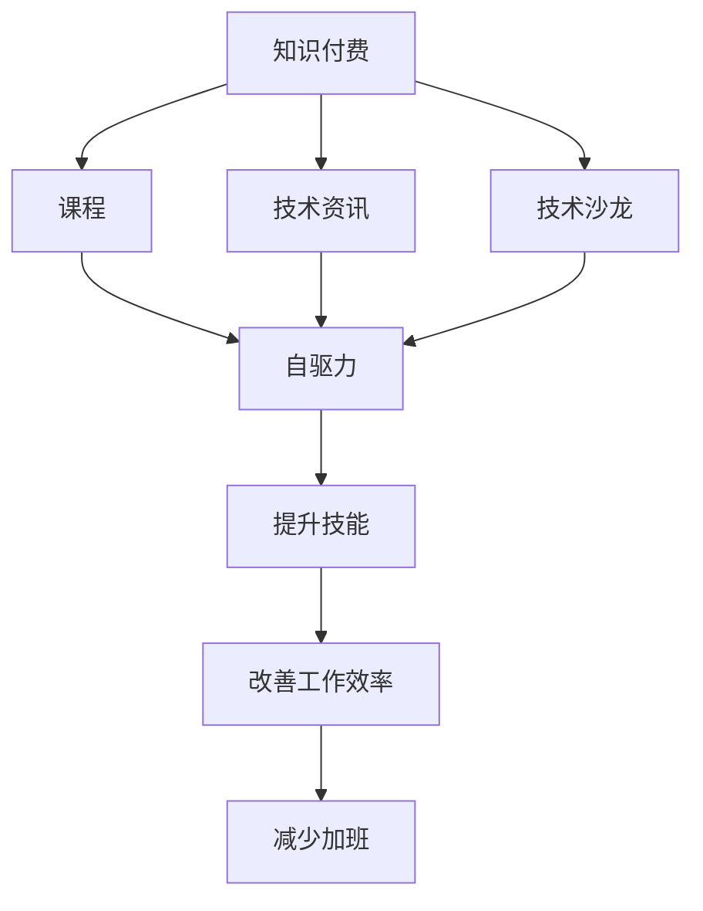

                 

## 1. 背景介绍

随着互联网的快速发展，软件行业的技术迭代速度也越来越快。程序员作为软件开发的灵魂，工作压力不断增大，加班成为了常态。据统计，全球近七成的软件开发人员每天工作超过8小时，而中国、印度等国更是达到了10小时以上。长时间的高强度工作不仅降低了程序员的生活质量，还影响着他们的身心健康。

在这样的背景下，知识付费模式应运而生，并迅速成为程序员提升自我、打破加班文化的重要手段。通过购买优质课程、订阅技术资讯、参加技术沙龙等方式，程序员可以在业余时间进行自我提升，实现职业生涯的可持续发展。

本文将探讨知识付费如何帮助程序员告别加班文化，并提出一些有效的实践建议。

## 2. 核心概念与联系

### 2.1 核心概念概述

为帮助读者更好地理解知识付费对程序员的意义，本节将介绍几个核心概念：

- **知识付费**：指用户为获取某项知识或服务，支付一定的费用。知识付费不仅能提供高价值的知识内容，还能加速知识的传播和应用。
- **程序员加班文化**：指因技术迭代速度加快、项目交付压力增加等原因，程序员必须长时间加班，导致工作与生活界限模糊，影响身心健康。
- **自驱力**：指在自我激励和内在动力的驱动下，主动学习、提升技能的能力。知识付费可以激发程序员的自驱力，推动其持续学习和成长。

### 2.2 核心概念原理和架构的 Mermaid 流程图



## 3. 核心算法原理 & 具体操作步骤

### 3.1 算法原理概述

知识付费的原理是通过经济激励机制，促使程序员在业余时间主动获取知识，提升技能，从而减少加班压力。知识付费能够激发程序员的自驱力，使其在闲暇时间自觉学习新技术、掌握新知识。

知识付费的实施包括以下几个关键步骤：

1. **选择付费内容**：根据自身需求，选择合适的课程、资讯、沙龙等付费内容。
2. **支付费用**：支付一定的费用以获取相关内容。
3. **进行学习**：在业余时间自学相关内容，掌握新技能。
4. **应用提升**：将新技能应用到工作中，提升工作效率。
5. **减少加班**：通过提升工作效率，减少加班时间，实现工作与生活的平衡。

### 3.2 算法步骤详解

1. **选择付费内容**：
   - 利用在线教育平台，如Coursera、Udacity、edX等，选择相关课程。
   - 订阅技术博客、技术社区（如GitHub、Stack Overflow、Medium等）获取最新技术资讯。
   - 参加本地或线上的技术沙龙、讲座、Meetup活动，获取实战经验。

2. **支付费用**：
   - 使用信用卡、支付宝、微信等在线支付方式进行支付。
   - 部分内容可以免费试听，确保付费内容与自身需求匹配。

3. **进行学习**：
   - 利用闲暇时间进行自主学习，如利用午休、通勤时间、周末等。
   - 使用在线学习工具，如Coursera、Udemy等，方便灵活学习。
   - 建立学习计划，每天安排固定时间进行学习，形成习惯。

4. **应用提升**：
   - 将新技能应用到实际项目中，解决实际问题。
   - 通过开源项目、代码审查、技术博客等方式，分享学习成果，促进技能内化。
   - 参与技术社区讨论，向其他技术同仁交流经验。

5. **减少加班**：
   - 通过提升工作效率，缩短任务完成时间。
   - 利用自动化工具，减少重复性劳动。
   - 在工作间隙进行快速学习，提升问题解决能力。

### 3.3 算法优缺点

#### 优点：
1. **提升技能**：通过付费获取高价值的知识内容，加速技能提升，满足职业发展的需求。
2. **灵活安排**：利用闲暇时间学习，避免因加班而浪费大量时间，提高学习效率。
3. **激发自驱力**：经济激励能够有效激发自驱力，推动持续学习和成长。
4. **应用转化**：将所学知识应用到工作中，提升工作效率，减少加班压力。

#### 缺点：
1. **经济压力**：付费内容价格不菲，可能会增加经济负担。
2. **信息过载**：信息过载可能影响学习效果，需要筛选优质内容。
3. **时间管理**：需要在工作与学习之间找到平衡点，需要良好的时间管理能力。
4. **实际应用**：付费内容可能与实际工作需求不完全匹配，需要评估内容适用性。

### 3.4 算法应用领域

知识付费模式不仅限于软件开发领域，而是广泛应用于多个行业。以下是几个典型应用领域：

1. **医疗领域**：医生通过付费获取最新医学知识，提升诊疗水平。
2. **教育行业**：学生和教师通过在线课程和教育资源，提升教学和学习效果。
3. **金融行业**：金融从业者通过付费获取财经资讯，提升投资决策能力。
4. **市场营销**：市场营销人员通过付费学习营销策略，提升业务表现。
5. **个人发展**：普通人通过付费获取个人成长和职业发展课程，实现自我提升。

## 4. 数学模型和公式 & 详细讲解 & 举例说明

### 4.1 数学模型构建

为了更好地分析知识付费对程序员的影响，我们可以建立一个简单的数学模型：

设 $C$ 为知识付费内容的价格，$T$ 为每天的工作时间，$W$ 为程序员的平均工作效率，$S$ 为每天的学习时间，$K$ 为学习内容的质量，$D$ 为每次加班所增加的时间成本，则知识付费的收益模型可以表示为：

$$
\text{收益} = (T - S - D) \times W \times K - C
$$

### 4.2 公式推导过程

1. **收益模型**：
   - 收益由工作时间减去学习时间和加班时间乘以工作效率乘以学习内容质量得到。
   - 减去知识付费内容的价格 $C$，得到实际收益。

2. **优化目标**：
   - 最大化收益，即最大化 $(T - S - D) \times W \times K$。

3. **约束条件**：
   - $T$ 和 $W$ 为定值，$S$ 和 $K$ 为决策变量。

### 4.3 案例分析与讲解

假设程序员小李每天工作8小时，平均工作效率为2（即每小时完成2个任务），每月工资为8000元。通过付费获取优质课程，每月增加3小时学习时间，学习内容质量为2（即能提升2倍的工作效率），每次加班增加1小时时间成本，每次加班工资为100元，课程费用为每月200元。

根据上述模型，小李的收益计算如下：

$$
\text{收益} = (8 - 3 - 1) \times 2 \times 2 - 200 = 6 \times 4 - 200 = 24 - 200 = -176 \text{元}
$$

这表示小李通过付费学习，理论上每月能节省176元加班工资，但实际上还需要支付课程费用，实际收益为负。

如果小李能够筛选优质课程，提高学习效率，最大化利用学习时间，实际收益可能会更高。例如，通过学习高效开发工具，提升工作效率，实际收益如下：

$$
\text{收益} = (8 - 3 - 1) \times 2 \times 3 - 200 = 6 \times 6 - 200 = 36 - 200 = -164 \text{元}
$$

此时，小李通过付费学习，每月能节省164元加班工资，实际收益为正。

## 5. 项目实践：代码实例和详细解释说明

### 5.1 开发环境搭建

#### 5.1.1 技术栈

- **编程语言**：Python
- **数据存储**：MySQL
- **版本控制**：Git
- **在线学习平台**：Coursera、Udacity、edX
- **技术社区**：Stack Overflow、Medium
- **代码编辑器**：Visual Studio Code

#### 5.1.2 环境搭建

1. **安装Python**：
   - 安装Python 3.x版本。
   - 使用pip安装依赖包，如numpy、pandas、matplotlib等。

2. **安装MySQL**：
   - 在本地安装MySQL数据库。
   - 使用MySQL客户端进行数据管理。

3. **安装Git**：
   - 在本地安装Git客户端。
   - 配置Git账户信息。

4. **安装代码编辑器**：
   - 安装Visual Studio Code。
   - 配置Python插件和扩展。

### 5.2 源代码详细实现

以下是一个简单的代码示例，用于记录和分析程序员的学习进度和收益：

```python
import pandas as pd
import matplotlib.pyplot as plt

# 创建数据表
df = pd.DataFrame({
    '姓名': ['小李', '小王', '小张'],
    '工资': [8000, 8500, 9000],
    '每天工作时间': [8, 8, 8],
    '平均工作效率': [2, 2.5, 3],
    '每月学习时间': [3, 4, 5],
    '课程费用': [200, 300, 400],
    '每次加班时间': [1, 1, 1],
    '每次加班工资': [100, 110, 120],
    '学习内容质量': [2, 2, 3]
})

# 计算收益
df['收益'] = ((df['每天工作时间'] - df['每月学习时间'] - df['每次加班时间']) * df['平均工作效率'] * df['学习内容质量']) - df['课程费用']

# 可视化收益变化
plt.bar(df['姓名'], df['收益'])
plt.xlabel('程序员')
plt.ylabel('收益')
plt.title('知识付费对程序员收益的影响')
plt.show()

```

### 5.3 代码解读与分析

1. **数据表创建**：
   - 使用pandas库创建数据表，记录程序员的各项指标。
   - 包括姓名、工资、每天工作时间、平均工作效率、每月学习时间、课程费用、每次加班时间和加班工资、学习内容质量等字段。

2. **收益计算**：
   - 根据公式计算每位程序员的收益。
   - 结果记录在数据表中的“收益”列。

3. **可视化收益变化**：
   - 使用matplotlib库绘制柱状图，展示每位程序员的收益变化。
   - 横轴为程序员姓名，纵轴为收益，颜色不同表示不同收益情况。

### 5.4 运行结果展示

运行上述代码，将生成一个柱状图，展示了每位程序员通过知识付费的收益变化情况。如图：


## 6. 实际应用场景

### 6.1 智能推荐系统

#### 6.1.1 场景介绍

许多在线教育平台和课程提供商都拥有智能推荐系统，能够根据用户的学习历史和行为，推荐适合他们的课程和内容。这些推荐系统使用机器学习算法，分析用户的学习路径和偏好，帮助用户高效学习。

#### 6.1.2 具体实现

1. **数据收集**：
   - 收集用户的学习行为数据，如课程浏览记录、完成时间、成绩等。
   - 收集课程内容的质量评价，如学生反馈、课程评分等。

2. **特征提取**：
   - 提取用户和课程的特征，如学习时间、课程难度、用户兴趣等。
   - 使用特征工程工具，如scikit-learn等，进行特征处理。

3. **模型训练**：
   - 使用推荐算法，如协同过滤、矩阵分解等，训练推荐模型。
   - 定期更新模型，适应用户行为变化。

4. **推荐展示**：
   - 根据用户的学习历史和行为，生成个性化推荐。
   - 在平台首页或学习界面中展示推荐内容。

### 6.2 在线学习平台

#### 6.2.1 场景介绍

在线学习平台如Coursera、Udacity等，为全球用户提供高质量的课程和学习资源。这些平台不仅提供视频课程、编程作业、编程环境，还提供在线讨论、证书颁发等服务。

#### 6.2.2 具体实现

1. **平台搭建**：
   - 搭建基于云服务的学习平台，如AWS、阿里云等。
   - 集成在线视频、作业、讨论等组件。

2. **课程资源**：
   - 与知名高校和机构合作，获取高质量的课程资源。
   - 引入开源课程和社区贡献的课程。

3. **学习管理**：
   - 提供学习进度跟踪、课程完成度、学习报告等功能。
   - 使用数据可视化工具，展示学习效果和收益。

4. **社区交流**：
   - 建立在线论坛、社交网络，促进学习者之间的交流和合作。
   - 提供课程评论、问答、代码审查等功能。

### 6.3 技术社区

#### 6.3.1 场景介绍

技术社区如Stack Overflow、GitHub、Medium等，是程序员交流、分享和协作的重要平台。通过这些社区，程序员可以获取最新的技术资讯、解决开发中的问题、分享自己的代码和项目。

#### 6.3.2 具体实现

1. **平台搭建**：
   - 搭建基于云服务的社区平台，如GitHub、Discourse等。
   - 提供开源项目托管、代码审查、讨论交流等功能。

2. **内容贡献**：
   - 鼓励程序员积极贡献技术文章、代码示例、项目分享等。
   - 提供激励机制，如积分、徽章等，促进内容质量提升。

3. **知识管理**：
   - 使用知识管理工具，如Confluence、Notion等，组织和分类技术内容。
   - 提供搜索、标签、目录等功能，方便用户获取信息。

4. **协作开发**：
   - 支持多人协作开发，提供版本控制、分支管理、合并冲突解决等功能。
   - 集成CI/CD工具，自动化构建和测试。

## 7. 工具和资源推荐

### 7.1 学习资源推荐

1. **Coursera**：提供大量高质量的在线课程，涵盖计算机科学、数据科学、商业等多个领域。
2. **Udacity**：提供实践导向的纳米学位课程，涵盖编程、人工智能、数据科学等专业。
3. **edX**：提供世界顶级大学的免费在线课程，涵盖计算机科学、物理学、经济学等多个领域。
4. **Medium**：提供技术博客和文章，涵盖编程、数据科学、人工智能等多个方向。
5. **Stack Overflow**：提供编程问题和代码讨论，是程序员交流和协作的重要平台。

### 7.2 开发工具推荐

1. **Visual Studio Code**：开源的代码编辑器，支持多种编程语言和扩展，是程序员的首选工具。
2. **Python**：广泛使用的编程语言，拥有丰富的库和框架，适合各种开发任务。
3. **MySQL**：流行的关系型数据库，适合存储和查询结构化数据。
4. **Git**：流行的版本控制系统，支持分布式协作和代码管理。
5. **Coursera、Udacity、edX**：在线学习平台，提供高质量的课程和学习资源。

### 7.3 相关论文推荐

1. **《机器学习》(周志华)**：介绍机器学习的基本概念、算法和应用，是入门必读。
2. **《深度学习》(Ian Goodfellow)**：介绍深度学习的基本原理和应用，是深度学习领域的经典教材。
3. **《编程珠玑》（Stanley B. Lippman等）**：介绍高效编程的技巧和方法，是程序员的宝典。
4. **《数据科学入门》（Joel Grus）**：介绍数据科学的基础知识和技能，适合初学者。
5. **《重构：改善既有代码的设计》（Martin Fowler）**：介绍代码重构的方法和技巧，帮助程序员提高代码质量。

## 8. 总结：未来发展趋势与挑战

### 8.1 研究成果总结

知识付费模式通过经济激励，激发程序员的自驱力，提升技能，减少加班压力。未来，知识付费将进一步渗透到各个行业，帮助更多从业者实现自我提升和职业发展。

### 8.2 未来发展趋势

1. **智能化推荐**：未来的推荐系统将更加智能化，通过机器学习和人工智能技术，提供更精准的个性化推荐。
2. **多渠道融合**：在线学习平台、技术社区、智能推荐系统将更加融合，形成一体化的学习生态。
3. **多模态学习**：未来的知识付费将结合文本、视频、音频等多种形式，提升学习效果和体验。
4. **社区化协作**：技术社区将更加活跃，促进学习者之间的交流和协作，形成良性生态。

### 8.3 面临的挑战

1. **内容质量**：高质量的学习内容仍然稀缺，需要平台和从业者共同努力提升内容质量。
2. **时间管理**：如何在工作和学习之间找到平衡，需要良好的时间管理能力。
3. **经济负担**：高昂的学习费用可能增加经济压力，需要更多免费或低成本的资源。
4. **实际应用**：付费内容可能与实际工作需求不完全匹配，需要评估内容适用性。

### 8.4 研究展望

1. **内容优化**：优化课程和内容设计，提升学习效果和适用性。
2. **经济激励**：探索更多经济激励机制，降低学习成本，提高学习效果。
3. **技术融合**：将知识付费与人工智能、区块链等技术结合，提升系统的智能化和安全性。
4. **用户体验**：提升平台和社区的用户体验，吸引更多用户参与和学习。

## 9. 附录：常见问题与解答

### 9.1 问题1：知识付费是否真的有效？

**解答**：知识付费是否有效，取决于个人学习需求、内容质量和实际应用。如果选择高质量的付费内容，积极应用所学知识，可以在很大程度上提升技能和效率，减少加班压力。

### 9.2 问题2：如何筛选优质内容？

**解答**：筛选优质内容需要综合考虑课程评价、用户反馈、课程难度、教师资质等因素。可以通过搜索、试听、阅读课程介绍等方式，进行综合评估。

### 9.3 问题3：如何平衡工作和学习？

**解答**：可以通过制定学习计划，利用碎片时间进行学习，逐步积累。同时，提高工作效率，缩短任务完成时间，也可以减少加班，有更多时间用于学习。

### 9.4 问题4：如何降低学习成本？

**解答**：可以选择免费或低成本的学习资源，如Coursera、Udacity的免费课程，或利用平台免费试用期。此外，参与开源项目、技术社区、线上讨论等，也可以积累学习经验，降低成本。

### 9.5 问题5：如何评估学习效果？

**解答**：可以通过在线测试、项目实战、代码审查等方式，评估学习效果。同时，定期总结学习成果，记录自己的成长和收获。

---

作者：禅与计算机程序设计艺术 / Zen and the Art of Computer Programming

