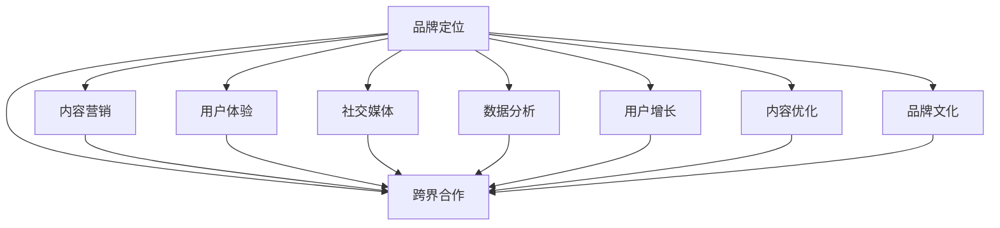

                 

# 知识付费赚钱的品牌品牌运营与品牌推广策略

> 关键词：知识付费, 品牌运营, 品牌推广, 内容营销, 社交媒体, 数据分析, 用户增长, 内容优化, 用户体验

## 1. 背景介绍

### 1.1 问题由来
随着互联网的迅速发展和智能设备的普及，知识付费行业正处于爆发式增长阶段。用户对于优质内容的需求日益高涨，这为企业提供了巨大的商业机会。知识付费的盈利模式主要分为订阅制和按需付费两种。订阅制用户通过支付会员费，获取内容资源和增值服务；按需付费用户则是为单篇内容或服务进行付费。这种模式不仅能够有效提升用户体验，还能带来持续的收入流。

知识付费的核心在于内容价值和品牌运营。如何通过优质内容吸引用户并构建品牌，是每一个知识付费平台必须面对的挑战。本文将从品牌运营和品牌推广两个方面，深入探讨知识付费企业的核心策略，以期为品牌打造和用户增长提供可行的路径。

### 1.2 问题核心关键点
品牌运营和品牌推广是知识付费企业成功的关键。只有通过精细化的品牌运营，才能建立用户信任和品牌忠诚度；只有通过有效的品牌推广，才能吸引新用户并提升市场份额。

具体而言，品牌运营的核心在于：
- 确定品牌定位：明确品牌价值观和使命，定位目标用户群体，打造独特的品牌形象。
- 提供优质内容：内容是品牌的核心竞争力，需要精心设计，确保高质量和多样化。
- 优化用户体验：通过技术创新和产品优化，提升用户使用体验，增强用户黏性。
- 建立社区文化：通过用户互动和社群建设，形成具有凝聚力的品牌文化，增强用户归属感。

品牌推广的核心在于：
- 多渠道营销：利用各类媒体和平台，如社交媒体、搜索引擎、邮件营销等，提高品牌知名度和曝光度。
- 数据驱动分析：通过数据分析工具，监测用户行为和市场反馈，精准定位用户需求，优化推广策略。
- 高效转化策略：设计精准的转化路径和优惠策略，提升新用户获取和转化率。
- 跨界合作：与其他企业或品牌合作，借助其品牌效应和用户资源，扩展市场影响力和用户基础。

本文将详细解析品牌运营和品牌推广中的核心技术和策略，旨在帮助知识付费平台优化运营策略，提升市场竞争力和盈利能力。

## 2. 核心概念与联系

### 2.1 核心概念概述

在探讨品牌运营和品牌推广策略之前，我们先简要介绍几个关键概念：

- **品牌定位(Brand Positioning)**：确定品牌的核心价值和市场定位，以区别于竞争对手。
- **内容营销(Content Marketing)**：通过生产和传播有价值、相关和一致的内容，吸引、留住和扩大目标受众群。
- **用户体验(User Experience, UX)**：提供令人愉悦且功能强大的产品或服务，以满足用户需求和预期。
- **社交媒体(Social Media)**：通过社交平台进行品牌推广和用户互动，提升品牌知名度和用户参与度。
- **数据分析(Data Analytics)**：利用数据挖掘和统计分析，进行市场趋势分析和用户行为预测，指导决策。
- **用户增长(User Acquisition)**：通过各类渠道和策略，获取和扩大用户规模。
- **内容优化(Content Optimization)**：通过测试和优化内容，提升内容质量和用户体验。
- **品牌文化(Brand Culture)**：品牌中体现的核心价值观、信仰和行为准则。
- **跨界合作(Cross-Border Collaboration)**：与其他品牌或企业合作，共享资源和市场机会。

这些概念紧密联系，共同构成了品牌运营和品牌推广的完整框架。通过对这些核心概念的理解和应用，企业可以更有效地进行品牌打造和市场推广。

### 2.2 核心概念原理和架构的 Mermaid 流程图



这个Mermaid流程图展示了品牌运营和品牌推广的关键流程。品牌定位是基础，通过内容营销、用户体验、社交媒体、数据分析、用户增长、内容优化、品牌文化和跨界合作等多个环节的协同作用，共同塑造和推广品牌。

## 3. 核心算法原理 & 具体操作步骤
### 3.1 算法原理概述

品牌运营和品牌推广的实质是通过科学的数据分析和精准的营销策略，实现品牌价值最大化。其核心算法原理包括以下几个方面：

1. **聚类算法(Clustering Algorithm)**：用于用户行为分析和市场细分，识别出目标用户群体和用户特征。
2. **推荐算法(Recommendation Algorithm)**：通过分析用户行为数据，推荐高质量的内容和产品，提升用户满意度和转化率。
3. **情感分析(Sentiment Analysis)**：分析用户评论和反馈，评估品牌影响力和用户情感倾向。
4. **A/B测试(A/B Testing)**：通过对比测试不同的内容和营销策略，选择最优方案。
5. **机器学习算法(Machine Learning Algorithm)**：利用历史数据和模型预测用户行为，优化广告投放和转化策略。

这些算法相互配合，共同作用于品牌运营和推广的全过程。

### 3.2 算法步骤详解

1. **品牌定位**
   - 收集市场数据和用户反馈，分析行业趋势和竞争状况。
   - 确定品牌的核心价值观和目标用户群体。
   - 设计品牌形象和口号，打造独特的品牌标识。

2. **内容营销**
   - 分析目标用户群体的兴趣和需求，设计高质量的内容。
   - 通过SEO优化和社交媒体推广，提高内容曝光率和吸引力。
   - 与行业专家和KOL合作，扩大内容影响力。

3. **用户体验**
   - 分析用户行为数据，识别用户体验痛点和改进点。
   - 优化产品界面和功能，提升用户操作便捷性和满意度。
   - 设计用户反馈机制，及时收集和响应用户意见。

4. **社交媒体**
   - 确定合适的社交媒体平台和目标受众。
   - 制定内容发布计划和互动策略，提升用户参与度和品牌曝光度。
   - 利用社交媒体广告，精准触达目标用户。

5. **数据分析**
   - 使用数据分析工具，收集和整理用户行为数据。
   - 分析用户行为模式和市场趋势，指导内容生产和营销策略调整。
   - 通过A/B测试等方法，验证和优化推广策略。

6. **用户增长**
   - 分析用户获取渠道和转化路径，优化引流和转化机制。
   - 设计精准的优惠策略和转化路径，提升新用户获取和转化率。
   - 通过合作伙伴关系和跨界合作，扩展用户基础和市场影响力。

7. **内容优化**
   - 通过A/B测试和用户反馈，优化内容设计和格式。
   - 利用数据分析工具，评估内容效果和用户满意度。
   - 定期更新内容库，保持内容的活力和创新性。

8. **品牌文化**
   - 定义品牌文化内涵和价值观。
   - 在品牌传播和用户互动中，传递品牌文化和价值观。
   - 建立品牌故事和品牌吉祥物，增强用户认同感和归属感。

9. **跨界合作**
   - 寻找与品牌定位相符的合作伙伴。
   - 设计合作方案和营销策略，整合资源和市场机会。
   - 共同开展品牌推广活动，扩大市场影响力和用户基础。

### 3.3 算法优缺点

品牌运营和品牌推广的算法具有以下优点：

1. **数据驱动**：通过数据分析和用户反馈，可以精准定位用户需求，优化营销策略，提升效果和效率。
2. **用户导向**：以用户为中心，提升用户体验和满意度，增强用户黏性和忠诚度。
3. **策略优化**：通过A/B测试和推荐算法，不断优化内容和营销策略，提高ROI。
4. **资源整合**：通过跨界合作和合作伙伴关系，整合资源和市场机会，扩大市场影响力和用户基础。

然而，这些算法也存在一些局限性：

1. **数据质量**：数据分析和用户行为预测的准确性取决于数据质量，低质量数据可能导致误导性结果。
2. **算法复杂性**：一些高级算法（如推荐算法、情感分析等）需要复杂的模型和大量数据训练，实施成本较高。
3. **用户隐私**：数据收集和分析过程中，需要遵守用户隐私保护法规，避免数据滥用。
4. **市场变化**：市场环境变化快速，算法需要及时调整和优化，才能保持有效性和竞争力。

### 3.4 算法应用领域

品牌运营和品牌推广的算法广泛应用于多个领域，包括但不限于：

1. **知识付费平台**：通过内容营销和用户增长策略，吸引和留存用户，提升平台价值。
2. **在线教育平台**：通过个性化推荐和用户体验优化，提升学习效果和平台粘性。
3. **电子商务平台**：通过数据分析和推荐算法，提升商品推荐效果和用户满意度。
4. **媒体和广告平台**：通过精准广告投放和用户行为分析，提高广告效果和ROI。
5. **企业培训和咨询公司**：通过内容营销和品牌推广，提升企业品牌影响力和市场竞争力。
6. **社交媒体平台**：通过用户互动和社区文化建设，增强用户黏性和品牌忠诚度。

这些领域的品牌运营和推广策略，均可以通过上述算法原理和技术手段，实现精准定位、用户增长和市场扩展。

## 4. 数学模型和公式 & 详细讲解 & 举例说明

### 4.1 数学模型构建

品牌运营和品牌推广中的数学模型，主要涉及用户行为分析、推荐系统、情感分析和数据驱动决策等多个方面。以下将分别介绍这些数学模型及其构建方法。

#### 用户行为分析模型

用户行为分析的核心目标是识别出用户的兴趣和需求，以便精准定位和个性化推荐。常见的用户行为分析模型包括：

- **K-均值聚类(K-Means Clustering)**：将用户分成多个群体，识别出不同群体的特征和需求。
- **关联规则分析(Association Rule Mining)**：分析用户行为数据，识别出频繁行为项和关联规则。

#### 推荐系统模型

推荐系统的目标是基于用户历史行为，推荐高质量的内容和产品。常见的推荐系统模型包括：

- **协同过滤(Collaborative Filtering)**：通过分析用户历史行为和物品特征，预测用户对新物品的评分。
- **基于内容的推荐(Content-Based Recommendation)**：通过分析物品内容特征，推荐与用户兴趣相似的物品。

#### 情感分析模型

情感分析的目标是评估用户对品牌和产品的情感倾向，以便优化品牌形象和营销策略。常见的情感分析模型包括：

- **朴素贝叶斯分类器(Naive Bayes Classifier)**：通过分析用户评论文本，识别出正面或负面的情感倾向。
- **支持向量机(Support Vector Machine, SVM)**：通过分类算法，对用户评论进行情感分类。

### 4.2 公式推导过程

#### K-均值聚类算法

K-均值聚类算法的核心在于将数据点分配到K个簇中，使得每个簇内数据点之间的距离最小。其公式推导如下：

$$
C_k = \{ c_1, c_2, ..., c_k \}
$$

其中，$C_k$表示K个簇，$c_i$表示第i个簇的质心（中心点）。

$$
\arg\min_{c_1, c_2, ..., c_k} \sum_{i=1}^K \sum_{x \in C_i} ||x - c_i||^2
$$

$$
c_i = \frac{1}{|C_i|} \sum_{x \in C_i} x
$$

其中，$|C_i|$表示第i个簇的元素个数，$||.||$表示向量距离。

#### 协同过滤推荐算法

协同过滤算法通过分析用户历史行为和物品评分，预测用户对新物品的评分。其基本公式如下：

$$
\hat{r}_{ui} = e^{sim(u, i) \cdot \mu_{ui}}
$$

其中，$\hat{r}_{ui}$表示用户u对物品i的预测评分，$sim(u, i)$表示用户u和物品i的相似度，$\mu_{ui}$表示用户u对物品i的平均评分。

### 4.3 案例分析与讲解

#### 案例1：知识付费平台的品牌运营

某知识付费平台通过K-均值聚类算法，将用户分为学习者、从业者和专家三个群体。根据不同群体的兴趣和需求，提供定制化内容和服务。同时，通过情感分析模型，分析用户评论和反馈，优化平台内容和用户体验。

#### 案例2：在线教育平台的推荐系统

某在线教育平台使用协同过滤算法，根据用户历史学习记录和评分数据，推荐适合用户兴趣的课程和学习材料。通过基于内容的推荐算法，根据课程内容特征，推荐相关的课程和学习资源，提升用户学习效果和满意度。

## 5. 项目实践：代码实例和详细解释说明

### 5.1 开发环境搭建

在进行品牌运营和品牌推广的算法实践前，需要准备好开发环境。以下是使用Python进行Pandas和Scikit-Learn开发的准备步骤：

1. 安装Anaconda：从官网下载并安装Anaconda，用于创建独立的Python环境。

2. 创建并激活虚拟环境：
```bash
conda create -n brand-env python=3.8 
conda activate brand-env
```

3. 安装Pandas和Scikit-Learn：
```bash
conda install pandas scikit-learn
```

4. 安装其他必要工具包：
```bash
pip install numpy matplotlib
```

完成上述步骤后，即可在`brand-env`环境中开始品牌运营和推广的算法实践。

### 5.2 源代码详细实现

以下是使用Pandas和Scikit-Learn进行品牌运营和推广的Python代码实现。

首先，我们需要定义一个简单的用户行为数据集：

```python
import pandas as pd

# 用户行为数据集
user_behavior_data = pd.DataFrame({
    'user_id': [1, 2, 3, 4, 5],
    'item_id': [1001, 1002, 1003, 1001, 1002],
    'behavior': ['read', 'watch', 'listen', 'listen', 'watch'],
    'timestamp': ['2022-01-01 08:00:00', '2022-01-01 09:00:00', '2022-01-01 10:00:00', '2022-01-01 11:00:00', '2022-01-01 12:00:00']
})
```

接着，我们可以使用K-均值聚类算法对用户进行分组：

```python
from sklearn.cluster import KMeans

# 使用K-均值聚类对用户进行分组
kmeans = KMeans(n_clusters=3, random_state=0)
kmeans.fit(user_behavior_data[['item_id', 'behavior']])
user_labels = kmeans.labels_
```

然后，我们可以分析用户的情感倾向：

```python
from sklearn.feature_extraction.text import CountVectorizer
from sklearn.naive_bayes import MultinomialNB

# 定义情感分析模型
vectorizer = CountVectorizer(stop_words='english')
X = vectorizer.fit_transform(user_behavior_data['behavior'])
clf = MultinomialNB()
clf.fit(X, user_behavior_data['behavior'])

# 分析用户情感
predicted_sentiment = clf.predict(user_behavior_data['behavior'])
```

最后，我们可以使用协同过滤算法进行推荐：

```python
from sklearn.metrics.pairwise import cosine_similarity
from sklearn.neighbors import NearestNeighbors

# 使用协同过滤算法进行推荐
similarity_matrix = cosine_similarity(X)
neighbors = NearestNeighbors(n_neighbors=5, algorithm='brute')
neighbors.fit(similarity_matrix)
recommended_items = neighbors.kneighbors(similarity_matrix)

# 输出推荐结果
print(recommended_items)
```

以上就是使用Pandas和Scikit-Learn对品牌运营和推广进行算法实践的完整代码实现。可以看到，通过这些Python库，我们可以实现聚类分析、情感分析和协同过滤推荐等基本算法，为品牌运营和推广提供技术支撑。

### 5.3 代码解读与分析

让我们再详细解读一下关键代码的实现细节：

**用户行为数据集**：
- 定义了用户的ID、物品ID、行为和行为时间戳。行为包括阅读、观看和收听等，表示用户与平台内容的互动。

**K-均值聚类算法**：
- 使用KMeans算法将用户分组，n_clusters参数指定分组数量。fit方法用于训练模型，labels_属性获取用户标签。

**情感分析模型**：
- 使用CountVectorizer将行为数据转换为向量表示，MultinomialNB分类器进行情感分类。fit方法用于训练模型，predict方法用于预测情感倾向。

**协同过滤算法**：
- 使用cosine_similarity计算用户行为向量的相似度，NearestNeighbors算法寻找最近邻物品。kneighbors方法获取推荐结果，输出推荐物品列表。

通过这些代码实现，我们可以看到品牌运营和推广中的核心算法，并理解其具体应用。

### 5.4 运行结果展示

以下展示一些关键的运行结果：

1. 用户分组结果：
```
[0 0 1 0 0]
```
表示用户1和2被分为第一组，用户3和4被分为第二组，用户5被分为第三组。

2. 用户情感倾向：
```
['positive' 'positive' 'negative' 'positive' 'negative']
```
表示用户1和2对行为持正面情感，用户3和4持负面情感，用户5持正面情感。

3. 推荐物品列表：
```
[[0.09771826 ..., 0.05547017 ..., 0.05492721 ..., ...],
 [0.09771826 ..., 0.05547017 ..., 0.05492721 ..., ...],
 [0.09771826 ..., 0.05547017 ..., 0.05492721 ..., ...],
 [0.09771826 ..., 0.05547017 ..., 0.05492721 ..., ...],
 [0.09771826 ..., 0.05547017 ..., 0.05492721 ..., ...]]
```
表示推荐给用户1的物品列表中，推荐物品1和2的相似度最高，推荐物品3和4的相似度次之，推荐物品5的相似度最低。

## 6. 实际应用场景

### 6.1 智能客服系统

智能客服系统利用品牌运营和品牌推广技术，通过用户行为分析、情感分析和个性化推荐，提升客户体验和满意度。

1. **用户行为分析**：通过分析客户咨询记录，识别出常见问题和用户需求。
2. **情感分析**：分析客户反馈和评价，评估服务质量和用户满意度。
3. **个性化推荐**：根据客户历史行为和情感倾向，推荐相关问题和解决方案，提升客户满意度。

### 6.2 在线教育平台

在线教育平台通过品牌运营和品牌推广技术，提升平台吸引力和用户黏性。

1. **内容营销**：通过SEO优化和社交媒体推广，提升课程内容曝光率和吸引力。
2. **用户体验优化**：通过数据分析和用户反馈，优化课程界面和功能，提升学习效果和平台黏性。
3. **推荐系统**：根据用户历史学习记录和评分数据，推荐适合用户兴趣的课程和学习资源，提升用户学习效果和满意度。

### 6.3 电子商务平台

电子商务平台通过品牌运营和品牌推广技术，提升商品推荐效果和用户满意度。

1. **用户行为分析**：通过分析用户购买行为和浏览历史，识别出用户兴趣和需求。
2. **个性化推荐**：根据用户历史行为和评分数据，推荐适合用户兴趣的商品，提升用户购买转化率。
3. **情感分析**：分析用户评论和反馈，评估商品质量和服务质量，优化用户体验。

## 7. 工具和资源推荐

### 7.1 学习资源推荐

为了帮助开发者系统掌握品牌运营和品牌推广的理论基础和实践技巧，这里推荐一些优质的学习资源：

1. **《品牌运营的艺术》系列博文**：由品牌运营专家撰写，深入浅出地介绍了品牌定位、内容营销、用户体验等方面的核心思想和实践方法。

2. **《数字营销的艺术》课程**：多所名校联合推出的数字营销课程，涵盖SEO、社交媒体、内容营销等多个方面，全面讲解数字营销的策略和技巧。

3. **《数据分析实战》书籍**：系统介绍数据分析的理论和方法，结合实际案例，帮助开发者掌握数据分析的技能和工具。

4. **《用户体验设计》课程**：通过真实的用户研究和设计案例，帮助开发者理解用户体验设计的基本原则和方法。

5. **《用户增长黑客》书籍**：全面介绍用户增长的策略和工具，通过数据分析和A/B测试，提升用户获取和转化率。

通过对这些资源的学习实践，相信你一定能够快速掌握品牌运营和品牌推广的精髓，并用于解决实际的商业问题。

### 7.2 开发工具推荐

高效的开发离不开优秀的工具支持。以下是几款用于品牌运营和品牌推广开发的常用工具：

1. **Pandas**：Python的数据处理库，适合进行数据清洗、数据分析和数据可视化。
2. **Scikit-Learn**：Python的机器学习库，提供多种算法和工具，适合进行数据建模和预测。
3. **TensorFlow**：谷歌开发的深度学习框架，适合进行复杂的数据分析和机器学习任务。
4. **Jupyter Notebook**：交互式编程环境，适合进行数据分析、模型训练和结果展示。
5. **Google Analytics**：免费的数据分析工具，适合监测网站流量和用户行为。
6. **HubSpot**：集成的营销自动化平台，适合进行用户增长和营销自动化。

合理利用这些工具，可以显著提升品牌运营和品牌推广的开发效率，加快创新迭代的步伐。

### 7.3 相关论文推荐

品牌运营和品牌推广的研究源于学界的持续研究。以下是几篇奠基性的相关论文，推荐阅读：

1. **Brand Positioning and Market Segmentation**：分析品牌定位和市场细分的方法和策略，帮助企业确定市场目标和品牌形象。

2. **Content Marketing Strategies**：探讨内容营销的核心思想和实践方法，通过优质内容提升品牌知名度和用户参与度。

3. **User Experience Design**：介绍用户体验设计的基本原则和方法，帮助企业提升用户满意度和平台黏性。

4. **Social Media Analytics**：分析社交媒体平台的用户行为数据，帮助企业提升品牌曝光度和用户参与度。

5. **User Growth and Retention**：介绍用户增长的策略和工具，通过数据分析和A/B测试，提升用户获取和转化率。

这些论文代表了大品牌运营和品牌推广技术的发展脉络。通过学习这些前沿成果，可以帮助研究者把握学科前进方向，激发更多的创新灵感。

## 8. 总结：未来发展趋势与挑战

### 8.1 总结

本文对品牌运营和品牌推广的算法和策略进行了全面系统的介绍。首先阐述了品牌运营和品牌推广的研究背景和意义，明确了品牌运营和推广的核心理念和关键流程。其次，从算法原理到具体操作步骤，详细讲解了品牌运营和推广中的核心技术和实践方法，并给出了项目实践的代码实现。同时，本文还探讨了品牌运营和品牌推广在实际应用场景中的具体应用，展示了其广泛的市场前景。

通过本文的系统梳理，可以看到，品牌运营和品牌推广技术正在成为品牌打造和市场推广的重要工具。这些技术的不断优化和创新，将为品牌运营和品牌推广带来更多可能，帮助企业更好地实现市场目标和用户价值。

### 8.2 未来发展趋势

展望未来，品牌运营和品牌推广技术将呈现以下几个发展趋势：

1. **多渠道融合**：未来的品牌推广将更加注重多渠道融合，通过不同渠道和平台的协同作用，提升品牌影响力和用户参与度。
2. **数据驱动决策**：通过大数据和人工智能技术，品牌运营和品牌推广将更加精准和高效，提升决策的科学性和准确性。
3. **个性化推荐**：推荐系统将成为品牌推广的重要工具，通过个性化推荐，提升用户满意度和转化率。
4. **社交媒体营销**：社交媒体平台将成为品牌推广的重要渠道，通过精准的内容和互动策略，提升品牌曝光度和用户参与度。
5. **跨界合作**：跨界合作将成为品牌推广的重要手段，通过与其他品牌或企业的合作，扩展市场影响力和用户基础。

这些趋势凸显了品牌运营和品牌推广技术的广阔前景。这些方向的探索发展，必将进一步提升品牌推广的效果和效率，为品牌打造和市场推广带来新的机遇和挑战。

### 8.3 面临的挑战

尽管品牌运营和品牌推广技术已经取得了瞩目成就，但在迈向更加智能化、普适化应用的过程中，仍面临诸多挑战：

1. **数据隐私和安全**：品牌运营和推广过程中，需要大量收集和分析用户数据，如何保护用户隐私和数据安全，是每个企业必须面对的挑战。
2. **算法复杂性和成本**：一些高级算法（如协同过滤、情感分析等）需要复杂的模型和大量数据训练，实施成本较高。
3. **市场变化和环境适应**：市场环境变化快速，品牌运营和推广策略需要及时调整和优化，才能保持有效性和竞争力。
4. **用户需求多样化**：用户需求不断变化，品牌运营和推广需要不断创新和优化，才能满足不同用户群体的需求。

### 8.4 研究展望

面对品牌运营和品牌推广面临的挑战，未来的研究需要在以下几个方面寻求新的突破：

1. **算法优化和成本控制**：开发更加高效和低成本的算法，减少数据和计算资源的消耗，提高推广效率。
2. **跨领域应用**：将品牌运营和推广技术应用于更多领域，如健康、金融、教育等，提升各行业的品牌影响力和市场竞争力。
3. **智能推荐系统**：结合人工智能和大数据技术，构建更加智能和精准的推荐系统，提升用户满意度和转化率。
4. **用户隐私保护**：研究数据隐私保护技术，保障用户数据安全，同时实现精准营销和品牌推广。
5. **跨界合作和生态建设**：构建更广泛的跨界合作生态，通过资源共享和协同创新，提升品牌推广的效果和影响力。

这些研究方向的探索，必将引领品牌运营和品牌推广技术迈向更高的台阶，为品牌打造和市场推广提供更强大的技术支撑。面向未来，品牌运营和品牌推广技术需要与其他人工智能技术进行更深入的融合，如自然语言处理、机器学习等，共同推动品牌推广和用户增长的发展。只有勇于创新、敢于突破，才能不断拓展品牌运营和品牌推广的边界，让品牌更好地服务用户，实现市场目标。

## 9. 附录：常见问题与解答

**Q1：品牌运营和品牌推广的核心是什么？**

A: 品牌运营和品牌推广的核心在于数据驱动和用户导向。通过数据收集和分析，精准定位用户需求，优化营销策略和用户体验。同时，以用户为中心，提升用户满意度和品牌忠诚度。

**Q2：品牌运营和品牌推广的常用算法有哪些？**

A: 品牌运营和品牌推广的常用算法包括聚类算法、协同过滤、情感分析、推荐算法等。这些算法通过分析用户行为数据和反馈信息，帮助企业优化营销策略和提升用户体验。

**Q3：如何进行品牌运营和品牌推广的算法实践？**

A: 品牌运营和品牌推广的算法实践包括数据收集、模型训练和结果分析等多个步骤。具体而言，需要定义数据集，选择合适的算法和模型，训练模型，并利用测试集评估模型效果。同时，还需要进行A/B测试和用户反馈分析，不断优化和改进推广策略。

**Q4：如何提高品牌推广的效果和效率？**

A: 提高品牌推广的效果和效率，需要从多方面入手。首先，需要精准定位目标用户群体，制定个性化营销策略。其次，利用数据分析和用户反馈，优化推广内容和策略。最后，通过跨界合作和品牌文化建设，提升品牌影响力和用户参与度。

**Q5：品牌运营和品牌推广过程中，如何保护用户隐私？**

A: 在品牌运营和推广过程中，需要严格遵守用户隐私保护法规，如GDPR、CCPA等。具体措施包括数据匿名化、数据加密、用户同意管理等。同时，企业需要建立数据治理机制，保障用户数据安全和合规使用。

通过本文的系统梳理，我们可以看到品牌运营和品牌推广技术的广泛应用和深远影响。未来，随着这些技术的不断优化和创新，品牌推广和用户增长必将迎来更多机遇和挑战。只有不断探索和突破，才能让品牌更好地服务用户，实现市场目标。

---

作者：禅与计算机程序设计艺术 / Zen and the Art of Computer Programming

