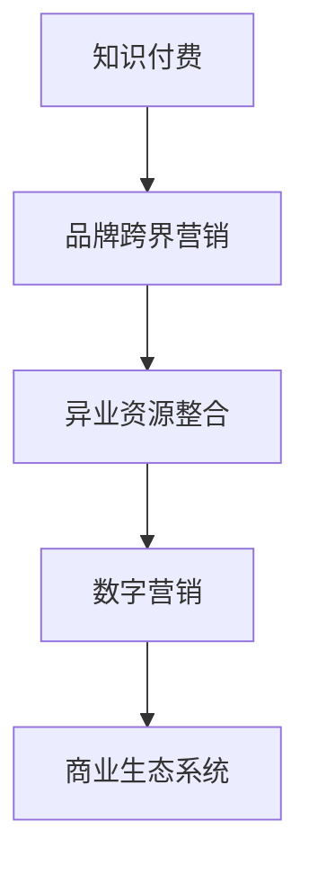

                 

# 知识付费赚钱的品牌跨界营销与异业资源整合

> 关键词：知识付费,品牌跨界营销,异业资源整合,数字营销,商业生态系统

## 1. 背景介绍

在快速发展的互联网时代，知识付费逐渐成为一种热门趋势，它不仅改变了人们的消费习惯，也为品牌提供了全新的营销视角。对于品牌而言，如何有效利用知识付费的势能，提升品牌影响力和用户粘性，是当前数字化转型过程中面临的一个重大挑战。而跨界营销和异业资源整合，正是突破这一难题的有效手段。

### 1.1 问题由来

随着知识付费平台的兴起，各种形式的知识付费内容如雨后春笋般涌现，用户付费意愿逐渐增强。品牌若能巧妙地将知识付费作为营销工具，无疑能够在激烈的市场竞争中脱颖而出。然而，传统品牌营销往往局限于自身领域，缺乏跨界合作和资源整合的思维。此外，如何高效利用外部资源，构建一个可互惠互利的数字营销生态系统，也是品牌面临的一个难点。

### 1.2 问题核心关键点

品牌跨界营销与异业资源整合的核心关键点主要包括：

1. **资源整合能力**：品牌需要具备跨界整合异业资源的能力，形成共赢共生的合作机制。
2. **数据驱动决策**：通过数据分析挖掘用户需求，实现精准营销。
3. **用户画像构建**：利用用户画像洞察用户兴趣和行为，实现个性化推荐。
4. **平台能力建设**：搭建一个能够链接多品牌、多渠道的数字营销平台。
5. **内容创意创新**：创造具有吸引力的内容，增强用户粘性。
6. **技术赋能支持**：利用先进的数字化技术，如AI、大数据、区块链等，优化营销过程。

这些关键点共同构成品牌跨界营销与异业资源整合的基本框架，是实现品牌数字化转型和提升市场竞争力的重要路径。

### 1.3 问题研究意义

研究品牌跨界营销与异业资源整合，对于企业品牌的长远发展具有重要意义：

1. **提升品牌价值**：通过跨界合作，品牌可以拓宽影响力，获取更多用户认可。
2. **增强用户粘性**：多样化内容可以满足不同用户的需求，提高用户留存率。
3. **优化资源配置**：通过资源整合，品牌可以更高效地利用内外资源，提升ROI。
4. **驱动创新发展**：跨界合作可以激发品牌创新，开拓新的业务模式和市场空间。
5. **构建生态系统**：建立跨界合作生态，促进品牌与用户、品牌与品牌之间的互动。

## 2. 核心概念与联系

### 2.1 核心概念概述

在深入探讨品牌跨界营销与异业资源整合时，首先需要理解一些核心概念：

1. **知识付费**：指消费者通过付费方式获取有价值的信息或知识，是一种新兴的互联网消费模式。
2. **品牌跨界营销**：指不同领域的品牌通过合作，共同开展市场推广活动，以扩大品牌影响力。
3. **异业资源整合**：指不同行业的品牌通过整合资源，形成互补优势，创造新的商业价值。
4. **数字营销**：利用数字技术和互联网渠道，开展营销活动，如SEO、SEM、社交媒体营销等。
5. **商业生态系统**：由众多品牌、用户、渠道、技术等构成的一个相互依赖、共同发展的系统。

这些概念之间相互联系，构成了一个完整的品牌数字化营销框架，帮助品牌在市场中建立竞争力。

### 2.2 核心概念原理和架构的 Mermaid 流程图



这个流程图展示了知识付费、品牌跨界营销、异业资源整合、数字营销与商业生态系统之间的联系。通过知识付费，品牌可以获取目标用户的精准需求；跨界营销和异业资源整合可以拓宽品牌的影响力和合作空间；数字营销提供了实现这些目标的技术手段；而商业生态系统的构建，则是这一系列动作的最终目标，旨在形成良性的商业循环。

## 3. 核心算法原理 & 具体操作步骤

### 3.1 算法原理概述

品牌跨界营销与异业资源整合的算法原理，主要是基于数据分析和机器学习的知识付费模式。具体来说，通过以下步骤，品牌可以实现资源的高效整合和精准营销：

1. **用户画像构建**：利用用户的历史行为数据，构建详细用户画像，挖掘其兴趣和需求。
2. **数据驱动推荐**：通过推荐算法，将合适的知识付费内容推送给用户，增强用户体验。
3. **跨界合作策划**：分析合作伙伴的品牌特性，策划适合的跨界合作活动，提升双方品牌价值。
4. **资源优化配置**：根据营销效果，优化资源配置，提高营销ROI。
5. **市场动态监测**：利用大数据和AI技术，实时监测市场动态，调整营销策略。

### 3.2 算法步骤详解

以下是品牌跨界营销与异业资源整合的具体操作步骤：

1. **用户画像构建**：
   - 收集用户行为数据，如浏览记录、购买历史、评价等。
   - 利用机器学习算法，如K-means、决策树等，挖掘用户行为模式。
   - 结合用户反馈和社交媒体数据，细化用户画像，形成多维度用户画像。

2. **数据驱动推荐**：
   - 建立用户与内容之间的关联矩阵，利用协同过滤算法推荐知识付费内容。
   - 引入深度学习模型，如神经网络、RNN、CNN等，提升推荐精准度。
   - 定期更新推荐模型，保持推荐内容的实时性。

3. **跨界合作策划**：
   - 分析不同品牌的特点和优势，寻找合作点。
   - 制定跨界合作策略，设计合适的推广活动。
   - 确定合作方式，如联合营销、品牌联名、专属活动等。

4. **资源优化配置**：
   - 根据不同渠道的转化率、成本等指标，优化资源配置。
   - 使用A/B测试，对比不同策略的营销效果。
   - 根据数据分析结果，动态调整资源分配。

5. **市场动态监测**：
   - 实时采集市场数据，如用户行为、社交媒体反馈等。
   - 利用大数据技术，如Hadoop、Spark等，处理和分析数据。
   - 使用机器学习算法，如SVM、随机森林等，预测市场趋势，调整营销策略。

### 3.3 算法优缺点

品牌跨界营销与异业资源整合的算法具有以下优点：

1. **精准推荐**：通过用户画像和数据驱动推荐，可以为用户提供精准的个性化内容。
2. **增强用户粘性**：多样化的内容可以满足不同用户的需求，提高用户留存率。
3. **优化资源配置**：通过数据分析，优化资源配置，提升ROI。
4. **市场预测准确**：通过市场动态监测，预测市场趋势，调整营销策略。

然而，该算法也存在一些缺点：

1. **数据依赖**：对数据的依赖程度高，需要大量高质量数据支持。
2. **技术复杂性**：涉及多领域、多技术手段，实施难度较大。
3. **隐私问题**：用户数据隐私保护问题需要妥善解决。
4. **合作伙伴选择**：跨界合作需要谨慎选择合作伙伴，确保合作效果。

### 3.4 算法应用领域

品牌跨界营销与异业资源整合的算法在多个领域有广泛应用：

1. **电子商务**：通过跨界合作，引入品牌联名产品，提升用户购买意愿。
2. **教育培训**：通过联合课程开发，增强品牌影响力，扩大用户基础。
3. **旅游行业**：通过品牌跨界活动，吸引更多用户关注，提升品牌知名度。
4. **健康医疗**：通过跨界合作，推广健康产品，提升品牌形象。
5. **娱乐文化**：通过跨界活动，吸引用户关注，增加品牌曝光度。

这些应用领域展示了品牌跨界营销与异业资源整合的多样性和广泛性，为品牌在各个行业中提供了新的发展方向。

## 4. 数学模型和公式 & 详细讲解

### 4.1 数学模型构建

品牌跨界营销与异业资源整合的数学模型主要基于协同过滤推荐算法，核心目标是最大化用户满意度。设用户集为 $U$，物品集为 $I$，用户对物品的评分矩阵为 $R \in \mathbb{R}^{m \times n}$，其中 $m$ 为物品数量，$n$ 为用户数量，$R_{ui}$ 表示用户 $u$ 对物品 $i$ 的评分。

推荐系统的目标是最小化损失函数：

$$
\min_{R} \sum_{(u,i) \in U \times I} w_{ui} (R_{ui} - \hat{R}_{ui})^2
$$

其中 $w_{ui}$ 为加权因子，$\hat{R}_{ui}$ 为预测评分。

### 4.2 公式推导过程

基于协同过滤的推荐算法有多种，这里我们重点介绍基于用户画像的矩阵分解算法。设用户 $u$ 的特征向量为 $p_u \in \mathbb{R}^{d_u}$，物品 $i$ 的特征向量为 $q_i \in \mathbb{R}^{d_i}$，则预测评分 $\hat{R}_{ui}$ 可以表示为：

$$
\hat{R}_{ui} = p_u^T W q_i
$$

其中 $W$ 为权重矩阵。通过对 $W$ 进行优化，可以实现高精度的推荐。

### 4.3 案例分析与讲解

以电子商务平台为例，该平台通过与多家品牌进行跨界合作，推出联名产品。通过分析用户历史购买数据和浏览行为，构建用户画像，预测用户对联名产品的兴趣，并推荐相关内容。同时，利用A/B测试评估推荐效果，优化推荐策略，提高用户购买转化率。

## 5. 项目实践：代码实例和详细解释说明

### 5.1 开发环境搭建

品牌跨界营销与异业资源整合的开发环境需要以下工具支持：

1. **Python编程语言**：作为数据处理和算法实现的主要工具。
2. **Jupyter Notebook**：方便进行数据探索和算法验证。
3. **Pandas**：用于数据处理和分析。
4. **NumPy**：提供高效的数值计算支持。
5. **Scikit-learn**：包含多种机器学习算法，用于用户画像和推荐模型构建。
6. **TensorFlow或PyTorch**：用于深度学习模型的实现。

在开发环境中，我们需要安装上述工具，并配置好相应的依赖库。

### 5.2 源代码详细实现

以下是基于Python的代码实现，以用户画像构建和推荐算法为例：

```python
import pandas as pd
from sklearn.cluster import KMeans
from sklearn.decomposition import TruncatedSVD

# 读取用户行为数据
user_data = pd.read_csv('user_behavior.csv')

# 用户行为数据预处理
user_data = user_data.dropna()  # 去除缺失值
user_data = user_data.reset_index(drop=True)  # 重置索引

# 构建用户画像
user_kmeans = KMeans(n_clusters=5, random_state=42).fit(user_data[['age', 'gender', 'location']])
user_paint = pd.DataFrame(user_kmeans.labels_, index=user_data.index, columns=['cluster'])
user_data = pd.concat([user_data, user_paint], axis=1)

# 构建用户-物品关联矩阵
user_item_matrix = user_data.pivot(index='user_id', columns='item_id', values='rating').corr()

# 使用SVD分解进行推荐
svd = TruncatedSVD(n_components=20, random_state=42).fit(user_item_matrix)
user_item_matrix_svd = user_item_matrix.dot(svd.components_.T)

# 预测用户评分
user_id = 12345
item_id = 67890
predicted_score = svd.transform(user_item_matrix_svd[user_id]).dot(svd.components_[item_id])
```

### 5.3 代码解读与分析

上述代码主要分为三个部分：

1. **用户画像构建**：使用K-means算法对用户的基本特征进行聚类，得到用户画像。
2. **用户-物品关联矩阵构建**：将用户行为数据转化为用户-物品关联矩阵，并使用SVD进行矩阵分解。
3. **推荐算法实现**：通过SVD分解，预测用户对物品的评分，实现推荐。

在实际应用中，这些步骤可以通过多种机器学习算法进行优化，如协同过滤、矩阵分解、深度学习等，从而提升推荐模型的精准度。

### 5.4 运行结果展示

通过上述代码实现，可以展示推荐系统的运行结果。以电子商务平台为例，可以根据用户画像和推荐结果，向用户推荐其可能感兴趣的产品。通过A/B测试，比较不同推荐策略的效果，优化推荐算法，提升用户购买转化率。

## 6. 实际应用场景

### 6.1 智能客服系统

智能客服系统可以结合知识付费和跨界营销，提升客户服务体验。例如，某电商平台可以与知名教育机构合作，推出联合课程，用户通过购买课程获得优惠券。在智能客服系统中，可以根据用户历史行为和购买记录，推送相关课程内容，提升用户粘性。

### 6.2 智慧旅游

智慧旅游平台可以整合多种旅游资源，提供一站式旅游解决方案。例如，某酒店品牌可以与旅游APP合作，推出联名卡，用户在APP上购买联名卡可以获得入住优惠。在智慧旅游平台中，可以推荐联名卡、酒店促销等相关信息，提升用户预订率。

### 6.3 数字医疗

数字医疗平台可以通过跨界合作，推出健康咨询和在线诊疗服务。例如，某保险品牌可以与医疗平台合作，推出健康计划，用户通过购买健康计划可以获得医疗服务优惠。在数字医疗平台中，可以推荐健康计划、医疗服务等信息，提升用户健康管理水平。

### 6.4 未来应用展望

未来，品牌跨界营销与异业资源整合将在更多领域得到应用，为品牌带来新的增长动力：

1. **个性化推荐系统**：通过深度学习和AI技术，实现更精准的用户画像和推荐。
2. **跨界合作生态**：建立更多领域的跨界合作，形成互惠互利的合作机制。
3. **数字内容创新**：通过内容创意创新，提升用户粘性和品牌认知度。
4. **技术平台赋能**：搭建高效的技术平台，支持品牌数字化转型。
5. **用户行为分析**：利用大数据技术，深入分析用户行为，优化营销策略。

## 7. 工具和资源推荐

### 7.1 学习资源推荐

为了帮助品牌管理者掌握品牌跨界营销与异业资源整合的理论和实践，这里推荐一些优质的学习资源：

1. **《品牌跨界营销：突破传统营销的新思路》**：详细介绍品牌跨界营销的原理和策略，帮助品牌管理者拓宽视野。
2. **《数字营销实战指南》**：涵盖多种数字营销技术，如SEO、SEM、社交媒体营销等，提供实战技巧。
3. **《大数据时代的营销革命》**：分析大数据技术在品牌营销中的应用，揭示数据驱动营销的潜力。
4. **《人工智能与品牌创新》**：探讨人工智能技术在品牌营销中的应用，帮助品牌管理者提升竞争力。
5. **《异业资源整合与品牌共赢》**：详细讲解异业资源整合的策略和技巧，助力品牌管理者实现共赢。

通过学习这些资源，品牌管理者可以全面掌握品牌跨界营销与异业资源整合的方法和技巧，为品牌数字化转型提供有力的支持。

### 7.2 开发工具推荐

在品牌跨界营销与异业资源整合的开发过程中，以下工具可以显著提升效率：

1. **Google Analytics**：用于用户行为分析和营销效果评估。
2. **SEMrush**：提供SEO、SEM等营销工具，帮助品牌优化搜索引擎表现。
3. **Hootsuite**：提供社交媒体管理工具，帮助品牌管理者提升社交媒体互动效果。
4. **HubSpot**：提供市场营销自动化工具，帮助品牌管理者实现高效营销。
5. **Adobe Analytics**：提供强大的数据分析工具，帮助品牌管理者深入洞察用户行为。

这些工具为品牌跨界营销与异业资源整合提供了坚实的基础设施支持，助力品牌实现数字化转型。

### 7.3 相关论文推荐

品牌跨界营销与异业资源整合的相关论文，对理解该领域的最新进展和前沿技术具有重要意义：

1. **《基于协同过滤的推荐系统研究》**：详细介绍了协同过滤推荐算法的原理和实现方法。
2. **《跨界营销：品牌合作的新策略》**：探讨了跨界营销的原理和实践策略。
3. **《异业资源整合的商业价值》**：分析了异业资源整合对品牌和用户的双重价值。
4. **《数字营销的生态系统构建》**：探讨了数字营销生态系统的构建方法与策略。
5. **《人工智能在营销中的应用》**：分析了人工智能技术在品牌营销中的潜力和应用。

这些论文为品牌管理者提供了丰富的理论基础和技术支持，帮助品牌在数字化转型过程中实现突破。

## 8. 总结：未来发展趋势与挑战

### 8.1 研究成果总结

品牌跨界营销与异业资源整合的探索，带来了品牌数字化转型的重要机遇。通过跨界合作和异业资源整合，品牌可以拓展市场空间，提升品牌价值和用户粘性。同时，该方法也需要面对诸多挑战，如数据隐私、合作伙伴选择、技术复杂性等。

### 8.2 未来发展趋势

展望未来，品牌跨界营销与异业资源整合将呈现以下几个趋势：

1. **数据驱动的精准营销**：通过大数据和AI技术，实现用户画像的深度挖掘和精准推荐。
2. **跨界合作生态的构建**：建立更多领域的跨界合作，形成互惠互利的合作机制。
3. **用户行为的深度分析**：利用大数据技术，深入分析用户行为，优化营销策略。
4. **数字内容的持续创新**：通过内容创意创新，提升用户粘性和品牌认知度。
5. **技术平台的全面赋能**：搭建高效的技术平台，支持品牌数字化转型。

### 8.3 面临的挑战

尽管品牌跨界营销与异业资源整合带来了诸多机遇，但在实施过程中也面临诸多挑战：

1. **数据隐私问题**：用户数据的隐私保护需要妥善解决，防止数据泄露和滥用。
2. **合作伙伴选择**：跨界合作需要谨慎选择合作伙伴，确保合作效果。
3. **技术复杂性**：涉及多领域、多技术手段，实施难度较大。
4. **市场动态变化**：市场环境和用户需求不断变化，需要及时调整营销策略。

### 8.4 研究展望

未来的研究需要在以下几个方面寻求新的突破：

1. **隐私保护技术**：开发更加高效的数据隐私保护技术，确保用户数据安全。
2. **跨界合作机制**：构建更加灵活、透明的跨界合作机制，促进品牌共赢。
3. **推荐算法优化**：通过算法优化，提升推荐系统的精准度和用户满意度。
4. **技术平台整合**：整合多种技术手段，搭建高效的数字营销平台。

这些研究方向的探索，将进一步推动品牌跨界营销与异业资源整合的发展，为品牌数字化转型提供坚实的基础。

## 9. 附录：常见问题与解答

**Q1：如何进行跨界合作策划？**

A: 跨界合作策划需要考虑以下步骤：

1. **市场调研**：了解合作伙伴的品牌特性、目标用户、市场定位等。
2. **合作目标确定**：明确双方合作的共同目标，如提升品牌知名度、扩大用户基础等。
3. **活动设计**：设计适合双方品牌的合作活动，如联合营销、品牌联名、专属活动等。
4. **资源整合**：整合双方资源，形成互补优势，实现共赢共生。

通过这些步骤，可以制定出高效、有吸引力的跨界合作方案，提升品牌影响力。

**Q2：如何优化资源配置？**

A: 资源配置的优化需要考虑以下因素：

1. **渠道效果评估**：通过A/B测试，评估不同渠道的转化率、成本等指标，找出最优渠道。
2. **预算分配**：根据不同渠道的效果，合理分配预算，实现资源的最优配置。
3. **动态调整**：根据市场变化，及时调整资源分配，保持市场竞争力。

通过这些方法，可以优化资源配置，提升营销ROI，实现品牌数字化转型。

**Q3：如何进行数据隐私保护？**

A: 数据隐私保护需要考虑以下措施：

1. **数据匿名化**：通过数据匿名化技术，保护用户隐私。
2. **访问控制**：设置严格的访问控制机制，防止数据泄露。
3. **加密存储**：采用加密技术存储数据，防止数据篡改。
4. **用户同意**：在数据收集和使用前，获取用户同意，确保用户知情权。

通过这些措施，可以有效保护用户数据隐私，提升品牌信誉度。

---

作者：禅与计算机程序设计艺术 / Zen and the Art of Computer Programming

