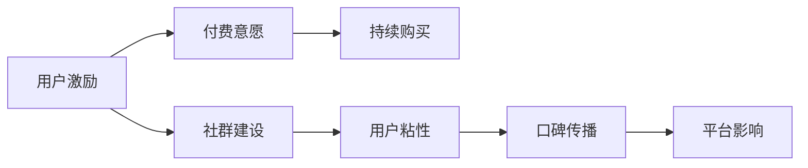

                 

## 1. 背景介绍

在数字化时代，知识付费正逐渐成为人们获取知识、提升技能、创造价值的新方式。它打破了传统教育的界限，提供了更加灵活、高效的学习途径。然而，如何吸引用户付费、维持用户粘性、构建活跃的社群，是知识付费平台面临的共同挑战。本文将深入探讨用户激励与社群建设的双重策略，并结合实践案例，为知识付费平台的成功提供参考。

## 2. 核心概念与联系

### 2.1 核心概念概述

在知识付费的商业生态中，用户激励与社群建设是两大关键环节。其中，用户激励旨在通过合理的策略设计，提升用户参与度和付费意愿；社群建设则通过构建一个有粘性、有价值的社群环境，增强用户归属感，提升平台影响力。

### 2.2 核心概念原理和架构的 Mermaid 流程图



这个流程图展示了用户激励与社群建设之间的内在联系。用户激励旨在提升用户付费意愿，进而促成持续购买。社群建设则通过增强用户粘性，最终实现口碑传播和平台影响力的提升。两者相辅相成，共同构建了知识付费平台的商业生态。

## 3. 核心算法原理 & 具体操作步骤

### 3.1 算法原理概述

用户激励与社群建设的策略设计，本质上是一个多目标优化问题。目标函数包括提高用户付费意愿、增加用户粘性、提升平台影响力等。通过综合考虑这些目标，并设计合理的激励机制和社群建设方案，可以实现平台效益的最大化。

### 3.2 算法步骤详解

**Step 1: 数据收集与分析**

- 收集用户行为数据，如付费记录、互动次数、学习时长等。
- 通过数据分析，识别出影响用户付费和粘性的关键因素，如课程内容质量、用户画像特征、市场推广策略等。

**Step 2: 激励机制设计**

- 根据数据分析结果，设计有针对性的用户激励策略。例如，对于课程推荐和用户画像特征进行个性化推荐，以提升用户的学习体验和满意度。
- 设计阶梯式付费计划，通过不同价格梯度的课程设计，满足不同层次用户的消费需求。
- 引入奖励机制，如积分、优惠券、VIP会员等，提升用户黏性，促进复购。

**Step 3: 社群建设方案**

- 建立以内容为核心、兴趣为导向的社群环境，通过高质量的课程和互动活动吸引用户加入。
- 引入KOL（关键意见领袖）和意见领袖，增强社群的权威性和影响力。
- 定期举办线上线下活动，如讲座、研讨会、沙龙等，增强社群活力和用户参与度。

### 3.3 算法优缺点

**优点：**
- 通过数据驱动的策略设计，可以更精准地满足用户需求，提升用户满意度和忠诚度。
- 阶梯式付费计划和奖励机制可以有效促进用户持续购买和复购。
- 社群建设方案有助于增强用户粘性，提升平台影响力。

**缺点：**
- 设计复杂的激励机制和社群建设方案，可能会增加运营成本和复杂度。
- 数据分析和策略优化需要一定的技术实力和数据基础，对平台的运营团队提出了较高的要求。

### 3.4 算法应用领域

用户激励与社群建设的策略设计，可以广泛应用于各类知识付费平台，如在线教育、职业技能培训、健康管理、个人成长等领域。通过对不同类型用户的分析和需求理解，设计针对性的激励机制和社群建设方案，可以有效提升用户参与度和平台效益。

## 4. 数学模型和公式 & 详细讲解 & 举例说明

### 4.1 数学模型构建

假设知识付费平台有 $N$ 名用户，用户付费意愿为 $P$，社群活跃度为 $A$，平台影响力为 $I$。用户激励和社群建设的策略设计目标为最大化这些指标的加权和。设 $W_P, W_A, W_I$ 分别为 $P, A, I$ 的权重，则优化目标函数为：

$$
\max_{\text{策略}} \, W_P \cdot P + W_A \cdot A + W_I \cdot I
$$

### 4.2 公式推导过程

为了简化计算，我们引入用户参与度 $C$ 和复购率 $R$ 作为中间变量，它们与用户付费意愿、社群活跃度和平台影响力密切相关。设 $P = \alpha \cdot C$，$A = \beta \cdot C$，$I = \gamma \cdot C$，其中 $\alpha, \beta, \gamma$ 为调整系数。则目标函数变为：

$$
\max_{\text{策略}} \, W_P \cdot (\alpha \cdot C) + W_A \cdot (\beta \cdot C) + W_I \cdot (\gamma \cdot C)
$$

进一步简化得到：

$$
\max_{\text{策略}} \, C (\alpha W_P + \beta W_A + \gamma W_I)
$$

这意味着用户参与度 $C$ 最大化是策略设计的核心。通过最大化 $C$，可以实现平台效益最大化。

### 4.3 案例分析与讲解

以Coursera为例，其成功的关键在于以下几个方面：

1. **个性化推荐**：通过大数据分析，提供个性化课程推荐，提升用户的学习体验和满意度。
2. **阶梯式付费**：提供单次课程购买和会员订阅两种付费方式，满足不同层次用户的消费需求。
3. **社群建设**：通过课程论坛、在线讲座等活动，增强用户粘性和社群活跃度。

Coursera的成功在于其将用户激励和社群建设有机结合，通过多维度的策略设计，实现了用户参与度的最大化，从而带来了平台收益的显著提升。

## 5. 项目实践：代码实例和详细解释说明

### 5.1 开发环境搭建

- **Python**：安装Python 3.8及以上版本。
- **Pandas**：安装Pandas库，用于数据处理和分析。
- **Numpy**：安装Numpy库，用于数值计算。
- **Scikit-learn**：安装Scikit-learn库，用于机器学习算法和模型评估。

### 5.2 源代码详细实现

```python
import pandas as pd
from sklearn.linear_model import LogisticRegression
from sklearn.model_selection import train_test_split
from sklearn.metrics import accuracy_score, roc_auc_score

# 数据准备
data = pd.read_csv('user_behavior.csv')
X = data[['age', 'gender', 'study_hours', 'interaction_frequency']]
y = data['is_paying_user']

# 数据分割
X_train, X_test, y_train, y_test = train_test_split(X, y, test_size=0.2, random_state=42)

# 模型训练
model = LogisticRegression()
model.fit(X_train, y_train)

# 模型评估
y_pred = model.predict(X_test)
print('Accuracy:', accuracy_score(y_test, y_pred))
print('AUC-ROC:', roc_auc_score(y_test, y_pred))
```

### 5.3 代码解读与分析

以上代码展示了如何使用Python和Scikit-learn库进行简单的用户行为分析，判断用户是否付费。模型通过Logistic Regression实现，训练集和测试集的分割比例为80%和20%。模型训练完成后，对测试集进行评估，输出准确率和AUC-ROC值。

## 6. 实际应用场景

### 6.1 在线教育平台

在线教育平台如Coursera、Udemy等，通过个性化推荐、阶梯式付费、社群建设等策略，有效地提升了用户参与度和付费意愿。这些平台的用户激励与社群建设策略，为其他知识付费平台提供了有益的借鉴。

### 6.2 职业技能培训平台

职业技能培训平台如Udacity、LinkedIn Learning等，通过职业导向的课程设计和互动式的学习体验，吸引了大量职场人士的关注。其成功的关键在于精准的用户画像和丰富的社群活动。

### 6.3 健康管理平台

健康管理平台如Keep、Fitbit等，通过健身挑战、健康分享、社区互动等方式，增强用户的参与感和粘性。其成功的关键在于以健康数据为基础，构建了有价值的社群环境。

### 6.4 未来应用展望

未来，随着技术的进步和数据量的积累，知识付费平台的用户激励与社群建设将进一步优化。例如，通过AI驱动的个性化推荐系统，提供更精准的用户画像和课程推荐；通过区块链技术，增强社群活动的透明度和信任度；通过虚拟现实技术，提升用户的学习体验和互动效果。

## 7. 工具和资源推荐

### 7.1 学习资源推荐

1. **《深度学习》（Ian Goodfellow 著）**：深入讲解深度学习原理和算法，为知识付费平台的技术储备打下坚实基础。
2. **Coursera官方课程**：涵盖各类知识付费平台的实践案例，了解不同平台的用户激励和社群建设策略。
3. **Kaggle竞赛平台**：通过参与数据科学竞赛，提升数据分析和机器学习技能，为知识付费平台的策略设计提供数据支持。

### 7.2 开发工具推荐

1. **Jupyter Notebook**：免费的交互式编程环境，支持Python、R等多种语言，适合数据分析和模型训练。
2. **Tableau**：强大的数据可视化工具，便于数据的探索和分析。
3. **GitHub**：全球最大的开源社区，提供丰富的代码库和工具，方便代码管理和协作。

### 7.3 相关论文推荐

1. **《用户驱动的内容推荐系统》**：探讨基于用户行为数据的推荐算法，提升用户满意度和粘性。
2. **《社区驱动的在线教育平台》**：分析社区建设对用户参与度和平台影响力的提升作用。
3. **《基于区块链的用户激励机制》**：探讨区块链技术在知识付费平台的应用，增强用户信任和平台透明度。

## 8. 总结：未来发展趋势与挑战

### 8.1 研究成果总结

本文通过对知识付费平台的用户激励与社群建设策略的深入分析，揭示了其成功背后的核心要素。用户激励和社群建设的双重策略设计，为平台带来了显著的用户参与度和平台效益。未来，随着技术的进步和数据量的积累，这些策略将进一步优化和提升。

### 8.2 未来发展趋势

1. **AI驱动的个性化推荐**：通过大数据和机器学习算法，提供更精准的用户画像和课程推荐。
2. **区块链技术的应用**：增强社群活动的透明度和信任度，提升用户粘性和平台影响力。
3. **虚拟现实技术**：提升用户的学习体验和互动效果，构建更具沉浸感和互动性的学习环境。

### 8.3 面临的挑战

1. **数据隐私保护**：如何在提升用户参与度的同时，保护用户数据隐私，是平台运营面临的重要挑战。
2. **用户激励机制的公平性**：如何设计公平合理的激励机制，避免用户流失和平台竞争力的削弱。
3. **社群建设的长期维护**：如何持续保持社群活力，避免社群成员流失和平台影响力的下降。

### 8.4 研究展望

未来，知识付费平台的用户激励与社群建设将继续探索新的方法和技术，以实现平台效益的最大化。通过技术创新和数据驱动，这些策略将为知识付费平台的长期发展和用户满意度的提升提供有力保障。

## 9. 附录：常见问题与解答

**Q1: 知识付费平台如何通过个性化推荐提升用户参与度？**

A: 个性化推荐系统通过分析用户的学习行为和兴趣偏好，推荐与其匹配的课程和资源。这可以通过协同过滤、内容基推荐、混合推荐等算法实现。

**Q2: 社群建设对知识付费平台有哪些具体作用？**

A: 社群建设可以增强用户粘性，提升平台影响力。用户通过参与社群活动，可以分享学习经验、获取专业指导，形成学习共同体。社群建设还可以增强平台的品牌效应和用户忠诚度。

**Q3: 用户激励机制设计中，如何平衡成本与效果？**

A: 用户激励机制设计中，需要综合考虑成本和效果。可以通过小额激励、阶梯式付费等方式，平衡成本与用户参与度的提升。

**Q4: 知识付费平台如何应对数据隐私保护的要求？**

A: 知识付费平台可以通过匿名化处理、数据加密、访问控制等措施，保护用户数据隐私。同时，平台需要对用户数据的使用进行明确告知，获取用户的同意。

**Q5: 如何设计公平合理的激励机制？**

A: 设计公平合理的激励机制，需要考虑不同层次用户的需求和消费能力。可以通过积分系统、阶梯式付费、KOL推荐等方式，满足不同用户的需求。

