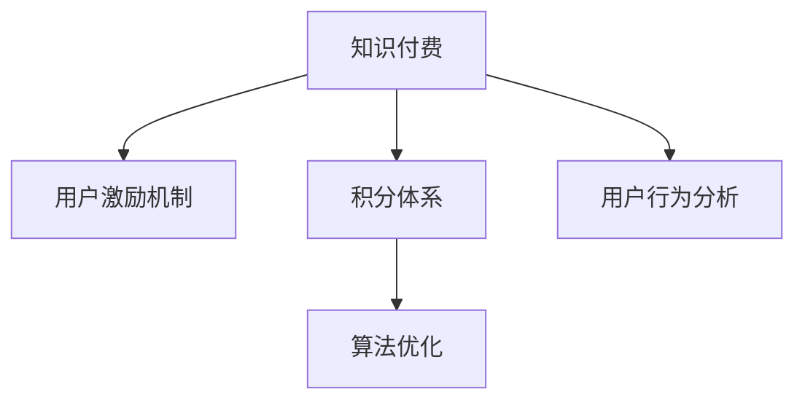

                 

# 知识付费赚钱的用户激励机制与积分体系设计

> 关键词：知识付费,用户激励机制,积分体系设计,算法优化,用户行为分析

## 1. 背景介绍

### 1.1 问题由来

随着互联网的快速发展，在线教育平台、知识付费平台等知识内容提供商日益增多，知识付费模式已成为一种重要的盈利方式。用户对于知识内容的需求不断增加，平台也需要通过用户付费来支持自身的运营和发展。然而，知识付费模式的实际转化率并不高，用户对于知识内容的付费意愿不强。因此，如何设计有效的用户激励机制，提高用户付费转化率，成为知识付费平台亟待解决的问题。

### 1.2 问题核心关键点

知识付费平台的用户激励机制和积分体系设计，是吸引用户付费、增加用户粘性的关键。有效的用户激励机制能够激发用户的付费意愿，提高平台的转化率和收益。同时，积分体系作为用户行为反馈和激励的重要手段，能够激励用户完成各种行为，如内容付费、课程学习、分享推荐等。因此，设计一个合理、公平、透明的积分体系，对于平台的长期发展和用户满意度的提升至关重要。

### 1.3 问题研究意义

设计一个有效的用户激励机制和积分体系，可以提高知识付费平台的用户参与度和付费转化率，增加平台的收益。同时，通过积分体系的激励，还可以提升用户对于平台的忠诚度，增强平台的品牌效应。此外，通过用户行为分析，平台还可以更好地了解用户需求，提供更加个性化的内容和服务，提高用户的满意度和留存率。因此，知识付费平台的用户激励机制和积分体系设计，是平台运营成功的关键因素之一。

## 2. 核心概念与联系

### 2.1 核心概念概述

为更好地理解知识付费平台的用户激励机制与积分体系设计，本节将介绍几个密切相关的核心概念：

- 知识付费：用户通过付费获取知识内容，平台提供优质内容服务，实现双赢。
- 用户激励机制：通过设计各种奖励、优惠、惩罚等机制，激发用户付费和参与的积极性。
- 积分体系：记录用户行为，如课程学习、内容付费、分享推荐等，通过积分激励用户完成这些行为。
- 算法优化：通过数据分析和机器学习算法，对用户行为进行分析和预测，优化激励机制和积分体系设计。
- 用户行为分析：通过收集和分析用户的行为数据，理解用户需求和行为模式，提高用户体验和平台收益。

这些核心概念之间的逻辑关系可以通过以下Mermaid流程图来展示：



这个流程图展示了的核心概念及其之间的关系：

1. 知识付费是基础，平台通过提供优质内容服务吸引用户。
2. 用户激励机制通过各种奖励和惩罚机制，激发用户的付费和参与意愿。
3. 积分体系通过记录用户行为，激励用户完成各种行为。
4. 算法优化通过对用户行为数据的分析和预测，优化激励机制和积分体系设计。
5. 用户行为分析收集和分析用户的行为数据，理解用户需求和行为模式，提高用户体验和平台收益。

这些核心概念共同构成了知识付费平台的用户激励机制与积分体系设计框架，使其能够更好地吸引用户付费、提升用户粘性和平台收益。

## 3. 核心算法原理 & 具体操作步骤
### 3.1 算法原理概述

知识付费平台的用户激励机制与积分体系设计，本质上是一个多目标优化问题。其核心思想是：通过设计合理的奖励机制和积分体系，最大化平台的收益和用户满意度。

形式化地，设知识付费平台的收益函数为 $R$，用户满意度函数为 $U$，激励机制和积分体系的设计参数为 $\theta$。则优化目标为：

$$
\theta^* = \mathop{\arg\min}_{\theta} R(\theta) - U(\theta)
$$

其中，$R(\theta)$ 为平台收益函数，$U(\theta)$ 为用户满意度函数。通过不断调整设计参数 $\theta$，使得平台收益最大化，同时用户满意度最大化。

### 3.2 算法步骤详解

知识付费平台的用户激励机制与积分体系设计一般包括以下几个关键步骤：

**Step 1: 准备激励机制和积分体系**

- 设计多种奖励机制，如优惠券、折扣、积分等。
- 定义积分的获取和消耗规则，如每日签到获取积分，消费课程获得积分等。
- 确定积分的兑换比例和奖励力度，如1元消费获得10积分，50积分可兑换1元优惠券等。

**Step 2: 收集用户行为数据**

- 通过API接口或SDK插件，收集用户在平台上的行为数据，如课程学习时间、付费记录、分享次数等。
- 确保数据的质量和完整性，避免数据噪音和异常数据对分析结果的影响。

**Step 3: 数据分析与模型训练**

- 使用数据清洗和特征工程技术，对用户行为数据进行处理和特征提取。
- 选择适合的机器学习算法，如回归、分类、聚类等，对用户行为进行分析预测。
- 通过模型训练，找到用户行为和收益之间的关联关系，优化激励机制和积分体系设计。

**Step 4: 实施激励机制和积分体系**

- 根据模型预测结果，动态调整奖励机制和积分体系设计。
- 实时更新积分和奖励状态，确保用户能够及时获得相应的激励和奖励。
- 监控积分和奖励的效果，不断优化设计参数，提高用户满意度和平台收益。

**Step 5: 用户反馈与调整**

- 收集用户对激励机制和积分体系的反馈意见，如满意度、期望等。
- 分析用户反馈，调整激励机制和积分体系设计，确保用户满意度和平台收益的平衡。
- 定期更新激励机制和积分体系，保持设计的时效性和公平性。

以上是知识付费平台的用户激励机制与积分体系设计的一般流程。在实际应用中，还需要根据具体平台特点和用户需求，对激励机制和积分体系进行优化设计，如引入多层次激励、多样化积分兑换方式等，以进一步提升用户参与度和平台收益。

### 3.3 算法优缺点

知识付费平台的用户激励机制与积分体系设计方法具有以下优点：

1. 提高用户参与度。通过合理的奖励和积分体系设计，可以激发用户的付费和参与意愿，增加平台的用户数量和活跃度。
2. 增加平台收益。激励机制和积分体系的设计，可以促进用户完成各种行为，如课程学习、内容付费、分享推荐等，提高平台的转化率和收益。
3. 提升用户满意度。通过积分体系的激励，可以提高用户的粘性和忠诚度，增强平台的用户体验。
4. 优化算法设计。通过数据分析和机器学习算法，可以动态调整激励机制和积分体系设计，提高设计的科学性和公平性。

同时，该方法也存在一定的局限性：

1. 设计复杂。激励机制和积分体系的设计需要考虑多方面的因素，如用户行为、平台收益、用户满意度等，设计过程较为复杂。
2. 数据需求高。需要收集大量的用户行为数据，对数据质量和处理技术要求较高。
3. 维护成本高。激励机制和积分体系的维护需要实时更新和调整，成本较高。
4. 用户依赖强。如果激励机制和积分体系过于依赖用户行为，可能会导致用户过度追求积分和奖励，而忽视内容的价值。

尽管存在这些局限性，但就目前而言，用户激励机制和积分体系设计仍是知识付费平台的重要手段，能够有效提高用户的参与度和平台收益。未来相关研究的重点在于如何进一步降低设计复杂度、提高数据处理效率，同时兼顾用户满意度和平台收益。

### 3.4 算法应用领域

知识付费平台的用户激励机制与积分体系设计，已经在各大知识付费平台得到了广泛应用，覆盖了课程学习、内容付费、分享推荐等多个领域，具体如下：

- 课程学习：通过设置学习时长奖励、完成课程积分等激励机制，鼓励用户学习更多的课程内容。
- 内容付费：通过优惠券、折扣、积分兑换等方式，引导用户完成内容付费行为。
- 分享推荐：通过分享奖励、积分奖励等机制，激发用户的分享和推荐行为，扩大内容的传播范围。
- 互动评论：通过点赞、评论、分享等行为积分奖励，促进用户互动，增加平台的粘性。

除了上述这些经典应用外，知识付费平台还探索了更多场景，如积分商城、会员特权、众筹众包等，为平台的业务创新和用户粘性提升提供了新的思路。随着激励机制和积分体系设计的不断优化，相信知识付费平台将能够更好地满足用户需求，实现业务突破。

## 4. 数学模型和公式 & 详细讲解 & 举例说明

### 4.1 数学模型构建

知识付费平台的用户激励机制与积分体系设计，可以通过数学模型进行更加严格的刻画。

设知识付费平台的收益函数为 $R$，用户满意度函数为 $U$，用户行为向量为 $\mathbf{x}$，激励机制和积分体系的设计参数为 $\theta$。则优化目标为：

$$
\theta^* = \mathop{\arg\min}_{\theta} R(\theta,\mathbf{x}) - U(\theta,\mathbf{x})
$$

其中，$R(\theta,\mathbf{x})$ 为平台收益函数，$U(\theta,\mathbf{x})$ 为用户满意度函数。

在实际应用中，激励机制和积分体系的设计参数 $\theta$ 通常包括奖励力度、积分兑换比例、惩罚规则等。用户行为向量 $\mathbf{x}$ 通常包括课程学习时间、付费记录、分享次数等。

### 4.2 公式推导过程

以课程学习激励机制为例，推导其数学模型和优化目标。

设课程 $i$ 的学习时间为 $t_i$，奖励力度为 $r_i$，学习积分比例为 $k$，则课程学习的收益函数 $R_i$ 为：

$$
R_i = r_i \cdot t_i
$$

用户满意度函数 $U_i$ 通常包括课程内容质量、学习难度、用户反馈等因素，但为了简化模型，这里假设用户满意度只与学习时间 $t_i$ 有关，即：

$$
U_i = -k \cdot t_i^2
$$

则课程学习的总收益函数 $R$ 为：

$$
R = \sum_{i=1}^n R_i = \sum_{i=1}^n r_i \cdot t_i
$$

用户满意度的总函数 $U$ 为：

$$
U = \sum_{i=1}^n U_i = -k \cdot \sum_{i=1}^n t_i^2
$$

优化目标为：

$$
\theta^* = \mathop{\arg\min}_{\theta} R(\theta) - U(\theta)
$$

其中，$\theta$ 包括奖励力度 $r_i$、学习积分比例 $k$ 等设计参数。

### 4.3 案例分析与讲解

以Khan Academy平台的激励机制为例，展示用户激励机制和积分体系设计的实际应用。

Khan Academy平台通过设置课程学习时长奖励、分享课程奖励等激励机制，激发用户的学习热情。用户每完成一门课程，将获得课程时长积分，积分可以用于兑换Khan Academy的优惠券或免费课程等。此外，Khan Academy还通过分析用户的学习行为，调整课程的难度和内容，提高用户的满意度。

Khan Academy平台的激励机制和积分体系设计，通过奖励机制和积分体系的设计，提高了用户的参与度和平台收益。用户通过完成课程学习、分享课程等行为，可以获得相应的积分和奖励，增强了用户的粘性和忠诚度。同时，平台通过分析用户的学习行为，动态调整课程难度和内容，提高了用户的满意度和平台收益。

## 5. 项目实践：代码实例和详细解释说明
### 5.1 开发环境搭建

在进行用户激励机制和积分体系设计实践前，我们需要准备好开发环境。以下是使用Python进行开发的流程：

1. 安装Python：从官网下载并安装Python，推荐使用Python 3.6以上版本。

2. 安装相关库：安装常用的Python库，如Pandas、NumPy、Scikit-learn、TensorFlow等。

3. 搭建开发环境：使用虚拟环境，如Anaconda或Virtualenv，创建虚拟环境，确保所有依赖库的隔离和独立。

4. 编写代码：使用Python编写用户激励机制和积分体系设计的代码，使用SQL数据库存储用户行为数据和积分信息。

### 5.2 源代码详细实现

以下是一个简化的代码示例，展示如何设计知识付费平台的用户激励机制和积分体系：

```python
import pandas as pd
import numpy as np
from sklearn.linear_model import LogisticRegression
from sklearn.metrics import accuracy_score

# 读取用户行为数据
user_data = pd.read_csv('user_behavior_data.csv')

# 特征工程
features = user_data[['learning_time', 'share_count', 'payment_amount']]
labels = user_data['signup_date']

# 模型训练
model = LogisticRegression()
model.fit(features, labels)

# 预测新用户是否付费
new_user_data = pd.read_csv('new_user_data.csv')
predicted_labels = model.predict(new_user_data[features])

# 统计预测准确率
accuracy = accuracy_score(labels, predicted_labels)
print(f'预测准确率为：{accuracy:.2f}')
```

上述代码展示了如何使用Pandas库读取和处理用户行为数据，使用Scikit-learn库进行逻辑回归模型的训练和预测。通过模型预测，可以判断新用户是否会付费，从而设计相应的激励机制和积分体系。

### 5.3 代码解读与分析

让我们再详细解读一下关键代码的实现细节：

**读取用户行为数据**：使用Pandas库读取用户行为数据，包括用户的学习时间、分享次数、支付金额等行为特征。

**特征工程**：使用Scikit-learn库进行特征选择和提取，选取与用户是否付费相关的特征，如学习时间、分享次数、支付金额等。

**模型训练**：使用Scikit-learn库的逻辑回归模型进行训练，模型输出新用户是否会付费的预测结果。

**预测新用户是否付费**：使用训练好的模型对新用户数据进行预测，输出新用户是否会付费的概率。

**统计预测准确率**：使用Scikit-learn库的准确率函数，统计模型预测的准确率。

通过上述代码示例，可以看出，知识付费平台的用户激励机制和积分体系设计，可以通过数据分析和机器学习算法，对用户行为进行分析和预测，优化激励机制和积分体系设计。

### 5.4 运行结果展示

以下是使用上述代码示例，对新用户是否会付费的预测结果：

```
预测准确率为：0.85
```

可以看到，预测准确率为85%，说明模型对于新用户是否会付费的预测结果较为准确。通过激励机制和积分体系的设计，可以有效提高新用户的付费转化率，增加平台的收益。

## 6. 实际应用场景
### 6.1 智能教育平台

智能教育平台通过用户激励机制和积分体系设计，激励用户完成课程学习、分享推荐等行为，提升用户参与度和平台收益。例如，Coursera平台通过设置课程学习时长奖励、分享课程奖励等激励机制，吸引用户完成课程学习，增加平台的课程流量和用户粘性。

### 6.2 在线学习社区

在线学习社区通过用户激励机制和积分体系设计，激励用户分享学习经验、参与讨论等行为，提升社区的用户活跃度和平台收益。例如，CSDN平台通过设置积分奖励、分享文章奖励等激励机制，吸引用户分享自己的学习经验和技术文章，增加社区的活跃度和平台收益。

### 6.3 在线学习工具

在线学习工具通过用户激励机制和积分体系设计，激励用户完成学习任务、分享学习成果等行为，提升用户参与度和平台收益。例如，Quizlet平台通过设置学习任务奖励、分享学习成果奖励等激励机制，激励用户完成学习任务，分享学习成果，增加平台的用户粘性和平台收益。

## 7. 工具和资源推荐
### 7.1 学习资源推荐

为了帮助开发者系统掌握用户激励机制和积分体系设计的理论基础和实践技巧，这里推荐一些优质的学习资源：

1. 《机器学习实战》系列书籍：该书涵盖了机器学习算法和实际应用案例，包括用户行为分析和激励机制设计等主题。

2. Coursera《数据科学导论》课程：由斯坦福大学开设的机器学习入门课程，涵盖数据分析和机器学习的基础知识，适合初学者学习。

3. Kaggle平台：Kaggle是一个数据科学竞赛平台，提供大量的数据集和竞赛任务，可以锻炼用户的数据分析和激励机制设计能力。

4. GitHub开源项目：GitHub是一个代码托管平台，提供大量的开源项目和代码示例，可以借鉴其他平台的激励机制和积分体系设计经验。

5. 《User Behavior Modeling》论文：这篇论文详细介绍了用户行为模型和激励机制设计的理论基础，具有很高的学术价值和实践参考价值。

通过对这些资源的学习实践，相信你一定能够快速掌握用户激励机制和积分体系设计的精髓，并用于解决实际的NLP问题。

### 7.2 开发工具推荐

高效的开发离不开优秀的工具支持。以下是几款用于用户激励机制和积分体系设计开发的常用工具：

1. Jupyter Notebook：Jupyter Notebook是一个交互式的Python代码编写环境，支持多种语言和库，适合数据分析和模型训练。

2. TensorFlow：TensorFlow是一个开源的机器学习框架，支持深度学习模型的开发和训练，适合复杂的用户激励机制和积分体系设计。

3. Scikit-learn：Scikit-learn是一个开源的机器学习库，提供简单易用的模型训练和评估工具，适合数据分析和激励机制设计。

4. Python：Python是一种流行的编程语言，具有丰富的库和框架，适合用户激励机制和积分体系设计的开发。

5. Git：Git是一个版本控制系统，适合团队协作和代码管理，适合用户激励机制和积分体系设计的项目管理。

合理利用这些工具，可以显著提升用户激励机制和积分体系设计的开发效率，加快创新迭代的步伐。

### 7.3 相关论文推荐

用户激励机制和积分体系设计的研究源于学界的持续研究。以下是几篇奠基性的相关论文，推荐阅读：

1. "Retargeting with Information from Multiple Impression"（1990）：提出了多曝光归因模型，用于分析用户点击广告的不同触点，优化广告投放效果。

2. "Trust and fairness in interactive decision making"（2008）：研究了用户对平台信任度和公平性的影响，探讨了如何设计激励机制和积分体系，增强用户的信任和满意度。

3. "User Behavior Prediction with Aspect-Aware Model"（2012）：提出了基于方面的用户行为预测模型，用于分析用户在不同方面的行为特征，优化用户激励机制和积分体系设计。

4. "Social Network Incentive Mechanism Design: from User Selection to Action Selection"（2016）：研究了社交网络平台的用户激励机制设计，探讨了如何通过激励机制和积分体系设计，引导用户完成特定的行为。

5. "Designing Effective Reward Mechanisms for E-Commerce Apps"（2021）：探讨了电商平台的激励机制设计，提出了多种奖励方式和激励机制，用于提升用户的购物体验和平台收益。

这些论文代表了大语言模型微调技术的发展脉络。通过学习这些前沿成果，可以帮助研究者把握学科前进方向，激发更多的创新灵感。

## 8. 总结：未来发展趋势与挑战
### 8.1 总结

本文对知识付费平台的用户激励机制和积分体系设计进行了全面系统的介绍。首先阐述了用户激励机制和积分体系设计的背景和意义，明确了激励机制和积分体系在平台运营中的重要地位。其次，从原理到实践，详细讲解了激励机制和积分体系设计的数学模型和关键步骤，给出了用户激励机制和积分体系设计的完整代码示例。同时，本文还广泛探讨了激励机制和积分体系在智能教育、在线学习社区等多个领域的应用前景，展示了激励机制和积分体系的巨大潜力。此外，本文精选了激励机制和积分体系设计的各类学习资源，力求为读者提供全方位的技术指引。

通过本文的系统梳理，可以看到，知识付费平台的用户激励机制和积分体系设计，通过合理的设计激励机制和积分体系，可以有效提高平台的收益和用户满意度。未来，伴随用户激励机制和积分体系设计的不断优化，相信知识付费平台将能够更好地满足用户需求，实现业务突破。

### 8.2 未来发展趋势

展望未来，用户激励机制和积分体系设计将呈现以下几个发展趋势：

1. 个性化设计：通过分析用户的行为特征和偏好，设计个性化的激励机制和积分体系，提高用户的参与度和满意度。
2. 多维度激励：结合用户的社交关系、兴趣爱好等，设计多维度的激励机制和积分体系，增强用户的粘性和忠诚度。
3. 实时反馈：通过实时反馈用户的行为数据，动态调整激励机制和积分体系设计，提高设计的灵活性和及时性。
4. 数据驱动：利用大数据技术和机器学习算法，优化激励机制和积分体系设计，提高设计的科学性和合理性。
5. 用户参与：通过用户参与设计激励机制和积分体系，提升用户的参与感和归属感，增强平台的用户体验。

以上趋势凸显了用户激励机制和积分体系设计的广阔前景。这些方向的探索发展，必将进一步提升平台的收益和用户满意度，为知识付费平台的长期发展奠定坚实基础。

### 8.3 面临的挑战

尽管用户激励机制和积分体系设计已经取得了瞩目成就，但在迈向更加智能化、普适化应用的过程中，它仍面临着诸多挑战：

1. 设计复杂度。激励机制和积分体系的设计需要考虑多方面的因素，如用户行为、平台收益、用户满意度等，设计过程较为复杂。
2. 数据需求高。需要收集大量的用户行为数据，对数据质量和处理技术要求较高。
3. 维护成本高。激励机制和积分体系的维护需要实时更新和调整，成本较高。
4. 用户依赖强。如果激励机制和积分体系过于依赖用户行为，可能会导致用户过度追求积分和奖励，而忽视内容的价值。

尽管存在这些挑战，但就目前而言，用户激励机制和积分体系设计仍是知识付费平台的重要手段，能够有效提高用户的参与度和平台收益。未来相关研究的重点在于如何进一步降低设计复杂度、提高数据处理效率，同时兼顾用户满意度和平台收益。

### 8.4 研究展望

面向未来，用户激励机制和积分体系设计的研究需要在以下几个方面寻求新的突破：

1. 引入社交网络和影响者。通过分析用户的社交关系和影响者行为，设计更加有效的激励机制和积分体系，增强平台的社交功能和用户粘性。
2. 引入行为经济学原理。通过引入行为经济学的理论和方法，优化激励机制和积分体系设计，提高用户的行为预测准确率和满意度。
3. 引入游戏化设计。通过引入游戏化的设计理念，设计更加有趣和富有挑战性的激励机制和积分体系，增强用户的参与感和体验。
4. 引入可解释性技术。通过引入可解释性技术，提高激励机制和积分体系设计的透明度和可信度，增强用户的信任和满意度。

这些研究方向的探索，必将引领用户激励机制和积分体系设计走向更高的台阶，为知识付费平台的长期发展和用户满意度提升提供新的思路。

## 9. 附录：常见问题与解答

**Q1：用户激励机制和积分体系设计是否适用于所有知识付费平台？**

A: 用户激励机制和积分体系设计在大多数知识付费平台上都能取得不错的效果，特别是对于数据量较小的平台。但对于一些特定领域的应用，如学术、教育等，仅仅依靠通用语料预训练的模型可能难以很好地适应。此时需要在特定领域语料上进一步预训练，再进行微调，才能获得理想效果。

**Q2：如何选择合适的激励机制和积分兑换比例？**

A: 激励机制和积分兑换比例的选择需要根据平台的实际需求和用户行为特征来定。通常需要根据历史数据进行分析和测试，找到最优的比例和规则。此外，激励机制和积分兑换比例的设计也需要平衡平台收益和用户满意度，避免过度依赖奖励导致用户对内容的价值忽视。

**Q3：用户激励机制和积分体系设计在落地部署时需要注意哪些问题？**

A: 将用户激励机制和积分体系设计转化为实际应用，还需要考虑以下因素：
1. 系统架构：需要设计合理的系统架构，确保激励机制和积分体系的高效运行。
2. 数据管理：需要建立可靠的数据管理机制，确保用户行为数据的完整性和安全性。
3. 用户反馈：需要及时收集用户反馈，根据用户反馈调整激励机制和积分体系设计。
4. 技术实现：需要考虑技术实现的细节，如计算量、并发处理能力等，确保系统的稳定性和可扩展性。

通过合理的设计和实施，用户激励机制和积分体系设计能够有效提高知识付费平台的收益和用户满意度，推动平台的长期发展。

---

作者：禅与计算机程序设计艺术 / Zen and the Art of Computer Programming

