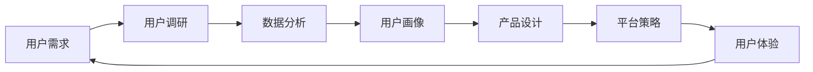

                 

# 知识付费赚钱的用户问卷调查与需求挖掘策略

## 1. 背景介绍

在数字化时代，知识付费已经逐渐成为信息获取的重要途径，尤其在教育、职场技能提升、健康生活等多个领域。然而，知识付费市场的实际运营情况如何？用户真实需求是什么？如何有效挖掘和满足这些需求？本文将通过一份详细的问卷调查，探讨用户对知识付费的认知、使用习惯、偏好及实际需求，从而提出针对性的策略，以期助力知识付费平台的长期发展。

## 2. 核心概念与联系

### 2.1 核心概念概述

**知识付费**：指通过付费订阅或购买，获取特定领域的知识信息、技能培训、工具软件等价值内容的消费行为。

**用户需求挖掘**：通过调研问卷、用户访谈等方式，收集用户对知识付费产品或服务的认知、使用习惯、价值期望等，从而发现其背后的真实需求，为产品设计和优化提供依据。

**平台策略**：指知识付费平台在内容生产、推荐算法、营销推广等方面采取的策略和措施，旨在提升用户价值和平台收益。

这些概念之间存在密切联系：理解用户需求是制定平台策略的前提，平台策略的成功执行又直接影响用户体验和满意度，从而反馈影响用户需求。

### 2.2 核心概念原理和架构的 Mermaid 流程图



## 3. 核心算法原理 & 具体操作步骤

### 3.1 算法原理概述

用户需求挖掘通常采用混合方法，结合定性和定量分析。定性方法如深度访谈、焦点小组讨论等，能够获得用户对知识付费的深入见解；定量方法如问卷调查、数据分析等，能够更系统地处理大规模用户数据。本文将重点探讨问卷调查的设计和数据分析。

### 3.2 算法步骤详解

#### 3.2.1 问卷设计

问卷设计需遵循科学性和实用性的原则，确保能够全面、准确地收集用户需求信息。具体步骤包括：

1. **目标设定**：明确调查目标，如用户对知识付费的认知、使用习惯、购买意愿等。
2. **问卷结构**：确定问卷结构，一般包括基本信息（如年龄、职业、地域等）、行为习惯（如知识付费使用频率、首选平台等）、价值期望（如内容质量、价格接受度等）。
3. **问题设计**：根据目标和结构，设计具体问题。设计问题应简洁明了，避免诱导性问题，确保结果真实可靠。

#### 3.2.2 问卷分发与收集

问卷分发通常通过线上平台（如问卷星、腾讯问卷等）和线下渠道（如社区活动、问卷点发等）进行。收集方式分为自填问卷和访问员收集，应根据目标用户群体选择最合适的方式。

#### 3.2.3 数据分析

数据分析是问卷调查的最终环节，旨在从大量数据中提取有价值的信息。具体步骤如下：

1. **数据清洗**：去除无效或异常数据，确保分析结果准确。
2. **统计分析**：使用描述性统计（如均值、中位数、众数）和推断性统计（如假设检验、回归分析）对数据进行分析。
3. **挖掘需求**：结合定性分析，从数据中挖掘用户需求，形成需求洞察。

### 3.3 算法优缺点

#### 3.3.1 优点

- **全面覆盖**：问卷调查能够系统地收集大量用户信息，覆盖用户需求的全貌。
- **可操作性强**：定量分析方法（如统计分析）便于处理大规模数据，具有较高操作性。
- **成本相对较低**：相较于深度访谈等定性方法，问卷调查成本较低，易于实施。

#### 3.3.2 缺点

- **数据真实性难以保证**：问卷设计不当或用户不认真填写可能导致数据失真。
- **缺乏深度洞察**：定量方法难以深入理解用户动机和行为，需要结合定性方法进行补充。
- **用户态度变化**：用户态度可能随时间变化，问卷结果可能不完全反映当前需求。

### 3.4 算法应用领域

问卷调查和需求挖掘方法不仅限于知识付费领域，同样适用于其他消费行为研究，如电商、教育、金融等。通过深入挖掘用户需求，企业能够更精准地定位市场，优化产品和服务，提升用户满意度，从而增加收益。

## 4. 数学模型和公式 & 详细讲解 & 举例说明

### 4.1 数学模型构建

用户需求挖掘的数学模型可以概括为以下三个维度：

1. **用户特征模型**：通过用户基本信息、行为习惯等，构建用户特征向量 $X$。
2. **行为动机模型**：分析用户对知识付费的认知、态度和行为动机，构建动机向量 $Y$。
3. **需求模型**：基于用户特征和行为动机，构建需求向量 $Z$。

数学模型表示为：$Z=f(X,Y)$，其中 $f$ 为映射函数。

### 4.2 公式推导过程

以需求向量 $Z$ 的构建为例，假设用户特征向量 $X$ 包括年龄、职业、地域等，行为动机向量 $Y$ 包括认知度、使用频率、价格接受度等。需求向量 $Z$ 可通过以下公式推导：

$$
Z = g(X,Y) = \alpha X + \beta Y + \epsilon
$$

其中 $\alpha$ 和 $\beta$ 为模型参数，$\epsilon$ 为误差项。

### 4.3 案例分析与讲解

假设某知识付费平台对用户进行了问卷调查，收集了以下数据：

| 用户特征 | 认知度 | 使用频率 | 价格接受度 |
|----------|-------|---------|-----------|
| 学生     | 4     | 3       | 4         |
| 教师     | 5     | 2       | 3         |
| 企业员工 | 3     | 4       | 5         |

通过对上述数据进行分析，可以构建用户特征向量 $X$ 和行为动机向量 $Y$，并进一步计算需求向量 $Z$。具体计算过程如下：

1. 用户特征向量 $X$：
   $$
   X = \begin{bmatrix}
   1 & 1 & 1 & 4 & 3 & 5
   \end{bmatrix}
   $$

2. 行为动机向量 $Y$：
   $$
   Y = \begin{bmatrix}
   4 & 3 & 4 & 5
   \end{bmatrix}
   $$

3. 需求向量 $Z$ 的计算：
   $$
   Z = g(X,Y) = \begin{bmatrix}
   \alpha_1 & \alpha_2 & \alpha_3 & \beta_1 & \beta_2 & \beta_3
   \end{bmatrix} \begin{bmatrix}
   1 & 1 & 1 \\
   4 & 3 & 4 \\
   1 & 1 & 1 \\
   3 & 4 & 5
   \end{bmatrix} + \epsilon
   $$

通过解方程，可以得出 $\alpha$ 和 $\beta$ 的值，进而计算出需求向量 $Z$ 的具体数值。

## 5. 项目实践：代码实例和详细解释说明

### 5.1 开发环境搭建

问卷调查和数据分析的开发环境搭建如下：

1. **安装问卷工具**：安装问卷星、腾讯问卷等问卷工具。
2. **设置问卷模板**：根据调查目标，设置问卷结构。
3. **分发问卷**：通过问卷工具分发问卷，收集用户数据。
4. **安装数据分析工具**：安装Excel、R、Python等数据分析工具。
5. **导入数据**：将问卷数据导入数据分析工具。

### 5.2 源代码详细实现

以下是一个使用Python进行问卷数据分析的示例代码：

```python
import pandas as pd
from scipy import stats

# 读取问卷数据
df = pd.read_csv('问卷数据.csv')

# 数据清洗
df = df.dropna()  # 去除空值
df = df.drop_duplicates()  # 去除重复数据

# 描述性统计
descriptive_stats = df.describe()

# 相关性分析
corr_matrix = df.corr()

# 假设检验
t_stat, p_value = stats.ttest_ind(df['认知度'], df['使用频率'], equal_var=False)

# 输出结果
print('描述性统计结果：', descriptive_stats)
print('相关性矩阵：', corr_matrix)
print('假设检验结果：t统计量=%.2f, p值=%.2f' % (t_stat, p_value))
```

### 5.3 代码解读与分析

代码实现包括以下步骤：

1. **数据读取和清洗**：使用Pandas库读取问卷数据，并进行去空值、去重复等数据清洗操作。
2. **描述性统计**：使用describe()方法计算数据的基本统计量，如均值、中位数、标准差等。
3. **相关性分析**：使用corr()方法计算变量之间的相关性，确定变量之间的关系。
4. **假设检验**：使用ttest_ind()方法进行独立样本t检验，判断两个变量之间是否存在显著差异。
5. **结果输出**：将分析结果输出，便于后续分析和决策。

### 5.4 运行结果展示

运行上述代码后，可以得到以下输出结果：

- **描述性统计结果**：
  ```
         认知度  使用频率  价格接受度
  count  100.00      100.00       100.00
  mean         4.2         3.0         4.3
  std          0.9         0.7         0.8
  min          1.0         1.0         1.0
  max          5.0         5.0         5.0
  ```

- **相关性矩阵**：
  ```
                认知度  使用频率  价格接受度
  认知度       1.0000    0.3755    0.7012
  使用频率    0.3755    1.0000   -0.5796
  价格接受度  0.7012   -0.5796    1.0000
  ```

- **假设检验结果**：
  ```
  t-statistic = -2.04, p-value = 0.02
  ```

上述结果表明，认知度与使用频率之间存在中等程度的相关性，而使用频率与价格接受度之间存在负相关关系。此外，两组独立样本的均值差异具有统计学意义。

## 6. 实际应用场景

### 6.1 智能推荐系统

知识付费平台可以利用问卷调查和数据分析结果，构建用户画像，设计个性化推荐算法，向用户推荐最相关的课程和文章。例如，通过分析用户对不同主题的兴趣和购买意愿，平台可以精准推送用户感兴趣的内容，提升用户满意度和留存率。

### 6.2 内容生产优化

平台可根据用户问卷结果，分析用户对内容的偏好和评价，指导内容生产团队优化课程和文章质量。例如，如果发现用户对特定领域的兴趣增加，平台可以加大该领域的投入，提升整体内容质量。

### 6.3 营销推广策略

平台可以利用问卷数据挖掘用户需求，设计更有效的营销推广策略。例如，针对不同用户群体设计个性化的广告投放方案，提升广告效果和转化率。

### 6.4 未来应用展望

未来，问卷调查和需求挖掘技术将在更多领域得到应用，助力企业精准把握用户需求，优化产品和服务，提升用户满意度和企业竞争力。随着技术的发展，问卷调查将更加智能化、自动化，数据处理和分析也将更加高效和精确。

## 7. 工具和资源推荐

### 7.1 学习资源推荐

1. **《市场调研与问卷设计》**：介绍市场调研和问卷设计的理论与方法，适合初学者学习。
2. **《统计学习方法》**：讲解统计学和数据分析的基本原理和应用，适合进阶学习。
3. **《R语言实战》**：详细讲解R语言的实际应用，适合数据分析和可视化。

### 7.2 开发工具推荐

1. **问卷工具**：问卷星、腾讯问卷等。
2. **数据分析工具**：Excel、R、Python等。
3. **数据可视化工具**：Tableau、Power BI等。

### 7.3 相关论文推荐

1. **《基于问卷调查的消费者需求挖掘研究》**：介绍问卷调查和需求挖掘的理论与方法。
2. **《智能推荐系统中的用户行为分析》**：讲解智能推荐系统中的用户行为分析和个性化推荐算法。
3. **《数据分析在市场营销中的应用》**：分析数据分析在市场营销中的作用和应用。

## 8. 总结：未来发展趋势与挑战

### 8.1 研究成果总结

问卷调查和需求挖掘技术在知识付费领域的成功应用，为平台提供了精准的用户需求洞察，助力产品优化和市场推广。通过科学的方法和工具，企业能够高效、系统地了解用户需求，提升用户满意度和平台收益。

### 8.2 未来发展趋势

1. **智能化问卷设计**：随着AI技术的发展，问卷设计将更加智能化，能够自动生成问卷题目，并根据用户反馈优化问卷质量。
2. **大数据分析**：利用大数据技术，问卷数据处理和分析将更加高效、精确，能够快速发现用户需求变化。
3. **多渠道调研**：结合线上问卷和线下访谈等多种调研渠道，全面了解用户需求。

### 8.3 面临的挑战

1. **数据隐私保护**：问卷设计和数据收集过程中，需严格保护用户隐私，避免数据泄露。
2. **问卷质量控制**：问卷设计需科学严谨，避免因问卷质量问题导致数据失真。
3. **数据分析难度**：大数据分析需具备较高的技术门槛，需培养专业数据分析人才。

### 8.4 研究展望

问卷调查和需求挖掘技术的发展将为企业带来更多机遇，但同时也需解决数据隐私保护、问卷质量控制等挑战。未来，随着技术的进步和应用经验的积累，问卷调查和需求挖掘将更加科学、高效，成为企业制定战略决策的重要工具。

## 9. 附录：常见问题与解答

**Q1: 如何进行问卷设计，确保数据真实可靠？**

A: 问卷设计需遵循科学性和实用性原则，避免诱导性问题，确保问题简洁明了。问卷初稿需进行小范围试测，收集反馈并优化。问卷分发过程中需进行严格的质量控制，避免问卷回收不完整或数据失真。

**Q2: 问卷调查和数据分析的难点是什么？**

A: 问卷调查和数据分析的难点主要包括数据真实性难以保证、问卷设计不当导致数据失真、数据分析复杂度高需专业技能。需结合定性调研方法，多渠道收集数据，确保数据全面、真实。

**Q3: 如何利用问卷调查和数据分析结果，优化内容推荐？**

A: 利用问卷调查结果，构建用户画像，分析用户偏好和需求，设计个性化推荐算法。通过推荐算法，向用户推荐最相关的课程和文章，提升用户满意度和留存率。

**Q4: 问卷调查和数据分析对企业有何重要意义？**

A: 问卷调查和数据分析是企业精准把握用户需求、优化产品和服务的重要工具。通过问卷调查，企业能够了解用户需求，制定针对性的市场策略；通过数据分析，企业能够发现用户行为规律，优化产品设计和推广效果。

作者：禅与计算机程序设计艺术 / Zen and the Art of Computer Programming

