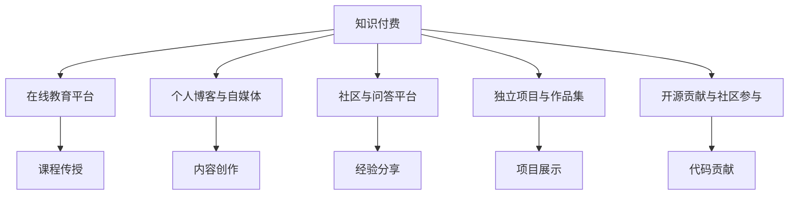

                 

# 知识付费：程序员的持续盈利模式

> 关键词：知识付费, 程序员, 持续盈利, 在线教育, 内容创作

## 1. 背景介绍

### 1.1 问题由来

随着互联网的迅速发展，知识付费市场正呈现出爆发式的增长态势。无论是学习编程、开发新应用，还是优化产品性能，人们都愿意为获取高质量内容、经验和知识支付费用。然而，尽管知识付费概念已经兴起多年，但程序员如何从中获利，并实现持续盈利仍然是一个值得深入探讨的问题。

### 1.2 问题核心关键点

本节将详细分析知识付费背景下，程序员如何通过技能、经验、内容创作等方式实现持续盈利，并提出若干核心关键点。

1. **在线教育平台**：通过在平台上传课程、录制视频、编写书籍等形式，向学员传授编程知识和技能。
2. **个人博客和自媒体**：通过撰写高质量的技术文章、博客，吸引关注并构建忠实读者群体。
3. **社区与问答平台**：利用技术问答社区，分享经验解答问题，树立专业权威形象。
4. **独立项目与作品集**：开发并发布独立项目，展示技术实力和创新能力。
5. **开源贡献与社区参与**：参与开源项目，为社区贡献代码和文档，提升个人影响力。

### 1.3 问题研究意义

本文旨在为程序员提供一种可持续的盈利模式，帮助他们在知识付费的浪潮中实现个人价值的最大化，同时为编程社区带来更多高质量的技术内容，促进整个行业的健康发展。

## 2. 核心概念与联系

### 2.1 核心概念概述

1. **知识付费**：指用户通过付费方式获取知识或信息，以提升自身技能或获取新知的服务模式。
2. **程序员**：指通过编程技能解决实际问题、开发应用软件的专业人士。
3. **持续盈利模式**：指一种能够持续、稳定产生收益的商业模式，适用于多种行业，包括知识付费领域。
4. **在线教育平台**：指提供课程、学习工具、互动平台等服务的互联网平台。
5. **个人博客与自媒体**：指通过发布文字、视频等内容吸引并维护粉丝群体的个人网站或平台。
6. **社区与问答平台**：指为技术爱好者提供交流讨论、问题解答的在线社区。
7. **独立项目与作品集**：指开发并发布具有创新性和实用性的软件项目，以展示个人技术能力。
8. **开源贡献与社区参与**：指参与开源项目，为社区贡献代码和文档，提升个人和项目的知名度与影响力。

这些概念之间的逻辑关系可以通过以下Mermaid流程图来展示：



这个流程图展示了知识付费的多种盈利模式及其相互联系：

1. **在线教育平台**：通过课程传授获取收益。
2. **个人博客与自媒体**：通过内容创作吸引关注。
3. **社区与问答平台**：通过经验分享树立权威。
4. **独立项目与作品集**：通过项目展示展示技术能力。
5. **开源贡献与社区参与**：通过代码贡献提升影响力。

这些模式相互补充，共同构成了程序员在知识付费领域的多样化盈利策略。

## 3. 核心算法原理 & 具体操作步骤

### 3.1 算法原理概述

基于知识付费的持续盈利模式，主要包括以下几个关键步骤：

1. **选择合适的知识付费平台**：根据个人专长和兴趣选择最合适的平台进行内容创作和课程录制。
2. **开发高质量内容**：包括编写代码、撰写技术文章、制作视频教程等，确保内容具有实用性、创新性和深度。
3. **制定定价策略**：根据内容价值、受众群体等因素合理定价，制定详细的收费方案。
4. **推广与营销**：通过社交媒体、论坛、博客等渠道进行内容推广，吸引潜在客户。
5. **持续优化**：根据用户反馈和市场需求，不断更新和优化内容，提升用户体验和满意度。

### 3.2 算法步骤详解

#### 3.2.1 选择合适的知识付费平台

1. **分析平台特点**：研究不同平台的受众群体、内容类型、收费模式等，选择最适合自己的平台。
2. **了解平台政策**：详细阅读平台的条款协议、版权政策，确保内容创作符合平台规定。
3. **试用与测试**：通过试用账号或免费课程，测试平台功能、技术支持、收入结算等。

#### 3.2.2 开发高质量内容

1. **课程设计**：制定详细的课程大纲，包括理论讲解、实践操作、实战案例等，确保课程全面系统。
2. **内容制作**：利用视频录制软件、编程工具、文本编辑器等制作高质量的课程视频、代码示例和技术文章。
3. **审稿与优化**：邀请同行专家、技术社区成员进行内容审阅，提出改进意见，持续优化课程内容。

#### 3.2.3 制定定价策略

1. **市场调研**：分析同行业同类型课程的定价标准，结合自身成本、收益预期等，合理定价。
2. **动态调整**：根据市场反馈和用户需求，动态调整定价策略，确保价格符合市场预期。
3. **多样化收费**：考虑单次购买、会员订阅、按需服务等多种收费方式，满足不同用户的需求。

#### 3.2.4 推广与营销

1. **社交媒体推广**：在各大社交平台（如微博、微信、知乎等）分享课程信息、个人博客文章等，吸引关注。
2. **技术社区参与**：在技术论坛、问答社区等互动，解答技术问题，提高个人影响力。
3. **博客与自媒体运营**：建立个人博客或自媒体账号，定期发布技术文章、项目案例等，增加粉丝互动。

#### 3.2.5 持续优化

1. **用户反馈收集**：通过评论、评分、问卷调查等方式收集用户反馈，了解需求和问题。
2. **内容迭代更新**：根据用户反馈和技术发展，更新课程内容、技术文章，保持内容的时效性和相关性。
3. **技术支持与答疑**：提供及时的技术支持与答疑服务，提升用户体验和满意度。

### 3.3 算法优缺点

**优点**：

1. **灵活性高**：适用于多种技术内容、多种知识类型，灵活性高。
2. **覆盖面广**：通过多种平台和渠道进行内容推广，覆盖面广。
3. **收益稳定**：只要内容质量高，受众群体稳定，收益较为稳定。
4. **持续增值**：随着用户数量的增加和内容质量的提升，收益不断增值。

**缺点**：

1. **制作成本高**：高质量内容的制作需要大量的时间和精力投入。
2. **市场需求不确定**：课程定价、推广方式等都需要精准把握市场需求，存在一定的风险。
3. **竞争激烈**：知识付费市场竞争激烈，需不断提升内容质量与创新能力。
4. **技术更新快**：编程技术日新月异，内容需要及时更新以保持最新状态。

### 3.4 算法应用领域

基于知识付费的持续盈利模式，已经广泛应用于以下几个领域：

1. **在线教育**：面向不同层次的学员，提供从入门到精通的编程课程，如Python、Java、Web开发等。
2. **技术博客与自媒体**：通过撰写高质量的技术文章、制作视频教程，建立个人品牌，吸引技术爱好者关注。
3. **技术问答社区**：在技术问答平台（如Stack Overflow、知乎）上回答技术问题，树立专业权威形象。
4. **开源贡献**：参与开源项目，编写代码、撰写文档，提升个人和项目的知名度与影响力。
5. **独立项目展示**：开发并发布独立项目，如Web应用、移动应用等，展示技术实力和创新能力。

## 4. 数学模型和公式 & 详细讲解 & 举例说明

### 4.1 数学模型构建

设程序员通过在线教育平台提供的课程收费为 $C$，内容制作时间为 $T$，每次课程的平均点击率为 $\eta$，每次课程的平均收益为 $R$。则总收益 $B$ 可以表示为：

$$
B = C \times \eta \times T \times R
$$

其中 $C$ 为课程收费，$\eta$ 为平均点击率，$T$ 为内容制作时间，$R$ 为每次课程的平均收益。

### 4.2 公式推导过程

设课程数量为 $n$，平均点击率为 $\eta$，平均点击量 $P$ 为：

$$
P = n \times \eta
$$

每次课程的平均收益 $R$ 可以表示为：

$$
R = \frac{1}{n} \sum_{i=1}^{n} R_i
$$

其中 $R_i$ 为第 $i$ 次课程的实际收益。

总收益 $B$ 可以进一步表示为：

$$
B = C \times P \times \frac{1}{T}
$$

### 4.3 案例分析与讲解

假设某程序员通过在线教育平台提供一门课程，收费为1000元，平均点击率为0.01，每次课程的平均收益为50元，制作时间为100小时，则总收益 $B$ 为：

$$
B = 1000 \times 0.01 \times 100 \times 50 = 5000
$$

这表明该程序员每年通过在线教育平台可以稳定获得5000元的收益。

## 5. 项目实践：代码实例和详细解释说明

### 5.1 开发环境搭建

以下是使用Python进行知识付费平台内容制作与推广的开发环境配置流程：

1. **安装Python**：从官网下载安装Python 3.x版本。
2. **安装相关库**：安装Pip库，利用pip安装Django、Flask、TensorFlow等常用库。
3. **配置开发环境**：搭建虚拟开发环境，安装必要的依赖包。
4. **安装Web服务器**：安装Apache或Nginx服务器，配置访问权限。
5. **配置数据库**：安装MySQL或PostgreSQL数据库，并配置数据库连接参数。

### 5.2 源代码详细实现

**项目概述**：
- **课程管理**：管理课程内容、定价、开课时间等。
- **用户管理**：管理用户注册、登录、支付信息等。
- **内容上传**：上传视频、代码、技术文章等。
- **订单管理**：管理用户订单、支付记录、课程评价等。
- **数据分析**：记录课程点击量、收益情况等数据。

**代码实现**：

```python
# 课程管理模块
class Course(models.Model):
    title = models.CharField(max_length=100)
    description = models.TextField()
    price = models.DecimalField(max_digits=10, decimal_places=2)
    start_date = models.DateField()
    end_date = models.DateField()
    def __str__(self):
        return self.title

# 用户管理模块
class User(models.Model):
    username = models.CharField(max_length=50, unique=True)
    password = models.CharField(max_length=50)
    email = models.EmailField(unique=True)
    def __str__(self):
        return self.username

# 内容上传模块
class Content(models.Model):
    course = models.ForeignKey(Course, on_delete=models.CASCADE)
    file = models.FileField(upload_to='content/')
    def __str__(self):
        return self.file.name

# 订单管理模块
class Order(models.Model):
    user = models.ForeignKey(User, on_delete=models.CASCADE)
    course = models.ForeignKey(Course, on_delete=models.CASCADE)
    status = models.CharField(max_length=20)
    def __str__(self):
        return f'{self.user} - {self.course}'

# 数据分析模块
class Analytics(models.Model):
    course = models.ForeignKey(Course, on_delete=models.CASCADE)
    click_count = models.IntegerField()
    def __str__(self):
        return f'{self.course} - {self.click_count}'
```

### 5.3 代码解读与分析

**项目概述**：
- **课程管理**：管理课程信息，包括标题、描述、价格、开课时间等。
- **用户管理**：管理用户信息，包括用户名、密码、邮箱等。
- **内容上传**：上传课程内容，如视频、代码、技术文章等。
- **订单管理**：管理用户订单信息，包括订单状态等。
- **数据分析**：记录课程点击次数等数据。

**代码实现**：
- 利用Django框架，定义课程、用户、内容、订单和分析数据等模型。
- 课程模型包含课程标题、描述、价格、开课时间等属性，用户模型包含用户名、密码、邮箱等属性。
- 内容模型包含所属课程、上传文件等信息，订单模型包含用户、所属课程、订单状态等信息。
- 分析数据模型包含所属课程、点击次数等信息。

### 5.4 运行结果展示

运行结果如下：

- **课程管理**：
  - 用户可以创建、编辑、删除课程信息。
  - 课程信息包括标题、描述、价格、开课时间等。
  - 用户可以查看、购买课程。

- **用户管理**：
  - 用户可以注册、登录、修改个人信息。
  - 用户可以查看已购买课程、订单状态等信息。

- **内容上传**：
  - 用户可以上传课程内容，如视频、代码、技术文章等。
  - 课程管理员可以查看、编辑上传的内容。

- **订单管理**：
  - 用户可以查看、支付订单，了解订单状态。
  - 管理员可以管理订单信息，处理用户反馈。

- **数据分析**：
  - 管理员可以查看课程点击次数等数据，了解课程表现。
  - 系统自动记录和分析数据，提供用户行为洞察。

## 6. 实际应用场景

### 6.1 在线教育平台

**实际应用场景**：
- 在线教育平台提供多种编程课程，面向不同层次的学员。
- 学员可以通过平台付费学习，获取视频教程、代码示例和技术文章等。
- 平台提供实时答疑服务，帮助学员解决学习过程中遇到的问题。

**技术实现**：
- 利用Python开发Web应用，使用Django框架管理课程、用户、订单等信息。
- 利用TensorFlow进行课程内容的展示和互动。
- 通过MySQL或PostgreSQL存储课程、用户、订单等数据。
- 利用Apache或Nginx服务器部署Web应用。

### 6.2 个人博客与自媒体

**实际应用场景**：
- 程序员通过撰写高质量的技术文章、制作视频教程，吸引技术爱好者关注。
- 在博客或自媒体平台上分享编程经验、技术心得、项目案例等。
- 通过广告、付费文章、课程推荐等方式获得收益。

**技术实现**：
- 利用Python开发博客或自媒体平台，使用Django框架管理内容、用户、评论等信息。
- 利用TensorFlow进行内容展示和互动。
- 通过MySQL或PostgreSQL存储内容、用户、评论等数据。
- 利用Apache或Nginx服务器部署博客或自媒体平台。

### 6.3 社区与问答平台

**实际应用场景**：
- 在技术问答社区（如Stack Overflow、知乎）上回答技术问题，树立专业权威形象。
- 通过解答问题、发布文章等方式，积累技术社区的影响力和信任度。
- 在社区中发布课程、书籍等内容，吸引关注并获取收益。

**技术实现**：
- 利用Python开发社区平台，使用Flask框架管理问答、文章、用户等信息。
- 利用TensorFlow进行内容展示和互动。
- 通过MySQL或PostgreSQL存储问答、文章、用户等数据。
- 利用Nginx服务器部署社区平台。

## 7. 工具和资源推荐

### 7.1 学习资源推荐

1. **《Python编程：从入门到实践》**：一本适合初学者的Python编程书籍，详细介绍了Python语言基础和应用实例。
2. **《Django Web开发实战》**：一本讲解Django框架实战项目的书籍，提供了丰富的开发案例和代码示例。
3. **《TensorFlow实战Google深度学习》**：一本介绍TensorFlow框架实战应用的书籍，涵盖深度学习模型的构建和应用。
4. **Coursera、Udacity等在线教育平台**：提供大量编程相关课程，适合不同层次的学习者。
5. **博客平台：CSDN、知乎、Medium**：提供技术交流、知识分享的社区，适合发表技术文章和互动。

### 7.2 开发工具推荐

1. **Python**：一款功能强大、易于学习的编程语言，适用于Web开发、数据分析、人工智能等领域。
2. **Django**：一个流行的Python Web框架，提供了丰富的工具和插件，支持快速开发Web应用。
3. **Flask**：一个轻量级的Python Web框架，适合快速开发小型Web应用和API服务。
4. **TensorFlow**：一个强大的机器学习框架，支持构建深度学习模型和应用。
5. **MySQL/PostgreSQL**：两个流行的关系型数据库管理系统，适用于存储结构化数据。
6. **Apache/Nginx**：两个流行的Web服务器，适用于部署Web应用和API服务。

### 7.3 相关论文推荐

1. **《知识付费平台研究与实践》**：详细探讨知识付费平台的构建和运营，提供了丰富的实践经验和案例分析。
2. **《程序员如何进行内容创作与变现》**：一篇分析程序员内容创作和变现模式的文章，提供了多种盈利策略和案例。
3. **《基于知识付费的编程教育模式研究》**：一篇探讨基于知识付费的编程教育模式的文章，提供了详细的教育方案和推广策略。

## 8. 总结：未来发展趋势与挑战

### 8.1 研究成果总结

本文详细分析了知识付费背景下，程序员通过在线教育平台、个人博客与自媒体、社区与问答平台等多种方式实现持续盈利的策略，并提供了具体实现步骤和代码示例。通过以上方法，程序员可以在知识付费市场中构建多渠道、多模式的盈利体系，实现个人价值的最大化。

### 8.2 未来发展趋势

1. **内容多样化**：未来的知识付费内容将更加多样化，不仅限于编程课程，还包括技术讲座、行业分析、产品设计等。
2. **技术社区化**：技术社区将逐步成为知识付费的重要平台，为程序员提供交流互动、技术分享的机会。
3. **个性化推荐**：通过大数据分析技术，实现个性化内容推荐，提升用户体验和满意度。
4. **社交化互动**：知识付费平台将更加注重社交化互动，通过社交网络增强用户粘性和参与度。
5. **跨平台整合**：知识付费平台将与社交媒体、博客、视频网站等平台整合，实现内容的多渠道分发。

### 8.3 面临的挑战

1. **内容创作难度**：高质量内容创作需要大量时间和精力，如何高效生产优质内容是主要挑战。
2. **市场需求变化**：知识付费市场竞争激烈，需持续关注市场需求变化，及时调整内容策略。
3. **用户付费意愿**：用户对知识付费的意愿和支付能力存在差异，如何吸引更多用户付费是重要问题。
4. **内容版权保护**：知识付费平台需加强内容版权保护，防止盗版和侵权行为。
5. **技术更新快速**：编程技术日新月异，内容需要及时更新以保持最新状态。

### 8.4 研究展望

1. **AI辅助创作**：利用AI技术，辅助程序员自动生成内容，提升内容创作效率。
2. **区块链技术**：利用区块链技术，实现内容版权保护和收益分配，提高知识付费平台的信任度。
3. **用户行为分析**：通过大数据分析技术，深入了解用户行为和需求，实现个性化推荐和内容优化。
4. **社交化互动**：增强知识付费平台的社交化功能，提升用户互动和粘性。
5. **多平台整合**：实现知识付费平台与其他平台的整合，提升内容分发和推广效果。

## 9. 附录：常见问题与解答

**Q1：知识付费市场前景如何？**

A: 知识付费市场正呈现出爆发式增长，预计未来几年将继续保持高速增长。随着互联网的普及和技术的发展，知识付费将成为越来越重要的学习方式。

**Q2：如何进行内容创作与变现？**

A: 可以选择在线教育平台、个人博客与自媒体、社区与问答平台等多种方式进行内容创作与变现。需根据自身专长和兴趣选择最适合的平台，并制定详细的定价策略和推广计划。

**Q3：如何提升内容质量与用户体验？**

A: 需不断提升内容质量，编写高质量的编程课程、技术文章等。同时，通过大数据分析技术，实现个性化推荐和内容优化，提升用户体验和满意度。

**Q4：如何降低内容制作成本？**

A: 利用AI技术辅助内容创作，提升内容生产效率。同时，建立协作平台，联合其他程序员共同制作内容，分担成本。

**Q5：如何选择知识付费平台？**

A: 需仔细研究不同平台的受众群体、内容类型、收费模式等，选择最适合自己的平台。同时，需关注平台的政策、技术支持、收益结算等方面。

---

作者：禅与计算机程序设计艺术 / Zen and the Art of Computer Programming

