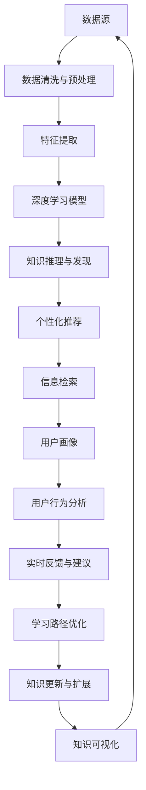

                 

# 知识发现引擎与个人成长：终身学习的新工具

> 关键词：知识发现引擎, 终身学习, 深度学习, 神经网络, 数据挖掘, 个性化推荐系统

## 1. 背景介绍

### 1.1 问题由来

在信息爆炸的时代，如何从海量数据中高效地提取有用信息，成为了摆在每一位从业者面前的挑战。传统的数据分析方法如统计学、信息检索等，已经难以应对越来越复杂的数据形式和分析需求。随着深度学习技术的兴起，基于神经网络的模型在数据挖掘、推荐系统、自然语言处理等领域取得了突破性进展。

在这个背景下，知识发现引擎（Knowledge Discovery Engine, KDE）应运而生，它融合了深度学习、数据挖掘和信息检索等多种技术，能够从结构化和非结构化数据中提取有价值的知识，辅助决策、个性化推荐和用户学习。本文旨在通过详细的理论阐述和实践案例，探讨知识发现引擎在个人成长和学习中的潜在价值。

### 1.2 问题核心关键点

1. **数据多样性**：知识发现引擎需要处理不同形式和来源的数据，包括文本、图像、视频、语音等，实现多模态数据的联合分析和挖掘。
2. **知识关联性**：从数据中提取知识需要理解知识之间的关联，构建稠密的语义网络，支撑知识推理和发现。
3. **个性化推荐**：知识发现引擎能够根据用户的历史行为和偏好，推荐个性化的学习资源和路径，提升学习效率和体验。
4. **动态更新**：知识发现引擎能够持续更新知识库，反映最新的研究成果和趋势，保持知识的时效性和相关性。
5. **学习跟踪**：通过追踪用户的学习行为和效果，知识发现引擎能够提供实时反馈和建议，指导用户的学习方向和策略。

## 2. 核心概念与联系

### 2.1 核心概念概述

在知识发现引擎的架构中，核心概念包括深度学习、数据挖掘、信息检索、推荐系统和用户画像。这些概念紧密相连，构成了一个完整的知识发现框架。

- **深度学习**：通过神经网络模型对数据进行非线性映射和特征提取，挖掘数据中的隐含知识。
- **数据挖掘**：从数据中发现潜在的规律和模式，支撑知识推理和发现。
- **信息检索**：快速从大量数据中检索出与用户查询相关的信息，支撑个性化推荐和智能搜索。
- **推荐系统**：通过分析用户的历史行为和偏好，推荐个性化的学习资源和路径。
- **用户画像**：构建详细的用户模型，理解用户的兴趣和需求，提升推荐和搜索的精准性。

这些概念之间通过数据流和算法交互，形成一个动态的、自适应的知识发现引擎。

### 2.2 核心概念原理和架构的 Mermaid 流程图(Mermaid 流程节点中不要有括号、逗号等特殊字符)



这个流程图展示了知识发现引擎的核心流程：

1. **数据源**：从不同来源收集数据。
2. **数据清洗与预处理**：清洗数据，去除噪声和异常值，标准化数据格式。
3. **特征提取**：对数据进行高维表示，提取关键特征。
4. **深度学习模型**：利用神经网络进行模式识别和知识学习。
5. **知识推理与发现**：通过逻辑推理和统计分析，从数据中发现知识。
6. **个性化推荐**：根据用户历史行为和偏好，推荐学习资源。
7. **信息检索**：快速检索用户查询相关的信息。
8. **用户画像**：构建详细的用户模型，了解用户需求。
9. **用户行为分析**：分析用户学习行为，提供实时反馈。
10. **学习路径优化**：根据用户反馈，优化学习路径。
11. **知识更新与扩展**：持续更新知识库，反映最新研究成果。
12. **知识可视化**：将知识以图形化方式展示，帮助用户理解。

## 3. 核心算法原理 & 具体操作步骤

### 3.1 算法原理概述

知识发现引擎的核心算法原理主要涉及以下几个方面：

- **深度学习模型**：如卷积神经网络（CNN）、循环神经网络（RNN）、变分自编码器（VAE）等，用于提取数据的隐含特征。
- **数据挖掘算法**：如关联规则挖掘、聚类分析、异常检测等，用于发现数据中的模式和规律。
- **推荐系统算法**：如协同过滤、基于内容的推荐、矩阵分解等，用于推荐个性化的学习资源。
- **信息检索算法**：如向量空间模型、文本检索、语义检索等，用于快速检索相关信息。
- **用户画像构建算法**：如协同过滤、矩阵分解、图模型等，用于构建详细的用户模型。

这些算法通过数据流和模型交互，实现知识发现和个性化推荐。以下将详细介绍每个算法的详细步骤和优缺点。

### 3.2 算法步骤详解

#### 3.2.1 深度学习模型

深度学习模型通常分为卷积神经网络（CNN）和循环神经网络（RNN）两大类。

**CNN**用于处理结构化数据，如图像、表格等。其基本流程包括：

1. **输入层**：输入原始数据。
2. **卷积层**：提取局部特征，增加数据抽象层次。
3. **池化层**：降低特征维度，减少计算复杂度。
4. **全连接层**：将特征映射到标签空间。
5. **输出层**：得到预测结果。

**RNN**主要用于处理序列数据，如文本、语音等。其基本流程包括：

1. **输入层**：输入序列数据。
2. **循环层**：处理序列中的每个时间步，保留序列中的上下文信息。
3. **全连接层**：将序列特征映射到标签空间。
4. **输出层**：得到预测结果。

#### 3.2.2 数据挖掘算法

数据挖掘算法通常包括关联规则挖掘、聚类分析和异常检测等。

**关联规则挖掘**通过频繁项集和关联规则，发现数据中的隐含关系。其基本流程包括：

1. **数据预处理**：清洗数据，处理缺失值和噪声。
2. **频繁项集挖掘**：发现频繁出现的项集。
3. **关联规则生成**：根据频繁项集生成关联规则。

**聚类分析**通过将数据分组，发现数据中的自然簇。其基本流程包括：

1. **数据预处理**：清洗数据，处理缺失值和噪声。
2. **特征选择**：选择重要特征。
3. **聚类算法**：将数据分组。

**异常检测**通过发现异常点，识别数据中的异常值。其基本流程包括：

1. **数据预处理**：清洗数据，处理缺失值和噪声。
2. **模型训练**：训练异常检测模型。
3. **异常检测**：识别异常值。

#### 3.2.3 推荐系统算法

推荐系统算法通常包括协同过滤、基于内容的推荐和矩阵分解等。

**协同过滤**通过分析用户和物品的相似度，推荐物品。其基本流程包括：

1. **用户-物品矩阵构建**：构建用户和物品的相似度矩阵。
2. **协同过滤算法**：通过相似度矩阵推荐物品。

**基于内容的推荐**通过分析物品的属性特征，推荐物品。其基本流程包括：

1. **特征提取**：提取物品的属性特征。
2. **模型训练**：训练推荐模型。
3. **推荐算法**：根据模型推荐物品。

**矩阵分解**通过将用户-物品矩阵分解为两个低维矩阵，推荐物品。其基本流程包括：

1. **矩阵分解**：将用户-物品矩阵分解为两个低维矩阵。
2. **推荐算法**：根据矩阵计算推荐物品。

#### 3.2.4 信息检索算法

信息检索算法通常包括向量空间模型、文本检索和语义检索等。

**向量空间模型**通过计算文本向量之间的相似度，检索相关文本。其基本流程包括：

1. **文本向量化**：将文本转换为向量。
2. **向量相似度计算**：计算向量之间的相似度。
3. **检索排序**：根据相似度排序检索结果。

**文本检索**通过比较查询文本和文档文本，检索相关文档。其基本流程包括：

1. **查询向量计算**：计算查询文本的向量表示。
2. **文档向量计算**：计算文档文本的向量表示。
3. **检索排序**：根据相似度排序检索结果。

**语义检索**通过理解查询文本和文档文本的语义，检索相关文档。其基本流程包括：

1. **语义理解**：理解查询文本和文档文本的语义。
2. **语义匹配**：计算语义相似度。
3. **检索排序**：根据相似度排序检索结果。

#### 3.2.5 用户画像构建算法

用户画像构建算法通常包括协同过滤、矩阵分解和图模型等。

**协同过滤**通过分析用户的行为和兴趣，构建用户画像。其基本流程包括：

1. **用户行为记录**：记录用户的行为和兴趣。
2. **相似度计算**：计算用户之间的相似度。
3. **用户画像构建**：根据相似度构建用户画像。

**矩阵分解**通过将用户-物品矩阵分解为两个低维矩阵，构建用户画像。其基本流程包括：

1. **矩阵分解**：将用户-物品矩阵分解为两个低维矩阵。
2. **用户画像构建**：根据分解结果构建用户画像。

**图模型**通过构建用户-物品-特征三元组图，构建用户画像。其基本流程包括：

1. **图构建**：构建用户-物品-特征三元组图。
2. **图嵌入**：使用图嵌入算法获取用户画像。

### 3.3 算法优缺点

#### 3.3.1 深度学习模型的优缺点

**优点**：

1. **自适应能力**：深度学习模型能够自动学习数据中的复杂模式和关系，适应性强。
2. **泛化能力**：深度学习模型在处理未知数据时，泛化性能好。
3. **特征提取**：深度学习模型能够自动提取数据中的关键特征，减少人工干预。

**缺点**：

1. **计算复杂度**：深度学习模型计算复杂度较高，需要大量计算资源。
2. **数据需求**：深度学习模型需要大量标注数据，数据获取成本高。
3. **模型解释**：深度学习模型通常作为"黑盒"使用，难以解释其内部机制。

#### 3.3.2 数据挖掘算法的优缺点

**优点**：

1. **模式发现**：数据挖掘算法能够发现数据中的隐含模式和规律。
2. **适应性强**：数据挖掘算法能够处理各种类型的数据。
3. **解释性强**：数据挖掘算法通常具有较好的可解释性。

**缺点**：

1. **数据质量要求高**：数据挖掘算法对数据质量要求高，数据清洗工作量大。
2. **复杂度高**：数据挖掘算法通常计算复杂度高，需要优化算法。
3. **结果解释**：数据挖掘算法通常需要人工解释结果，容易产生误导。

#### 3.3.3 推荐系统算法的优缺点

**优点**：

1. **个性化推荐**：推荐系统算法能够根据用户偏好推荐个性化物品。
2. **高效性**：推荐系统算法通常计算复杂度较低，推荐速度快。
3. **实时性**：推荐系统算法能够实时更新推荐结果。

**缺点**：

1. **数据稀疏性**：推荐系统算法通常面临数据稀疏性问题，推荐精度低。
2. **冷启动问题**：推荐系统算法通常存在冷启动问题，难以推荐新用户或新物品。
3. **偏差性**：推荐系统算法通常存在偏差性，容易产生推荐误导。

#### 3.3.4 信息检索算法的优缺点

**优点**：

1. **高效性**：信息检索算法通常计算复杂度较低，检索速度快。
2. **实时性**：信息检索算法能够实时检索相关信息。
3. **可扩展性**：信息检索算法通常可扩展性强，能够处理大规模数据。

**缺点**：

1. **数据质量要求高**：信息检索算法对数据质量要求高，数据清洗工作量大。
2. **相似度计算**：信息检索算法通常需要计算相似度，计算复杂度高。
3. **语义理解**：信息检索算法通常难以理解语义，检索结果不准确。

#### 3.3.5 用户画像构建算法的优缺点

**优点**：

1. **个性化推荐**：用户画像构建算法能够根据用户特征推荐个性化物品。
2. **实时性**：用户画像构建算法能够实时更新用户画像。
3. **可扩展性**：用户画像构建算法通常可扩展性强，能够处理大规模用户数据。

**缺点**：

1. **数据需求高**：用户画像构建算法通常需要大量用户数据，数据获取成本高。
2. **隐私问题**：用户画像构建算法通常涉及用户隐私问题，需要严格保护。
3. **偏差性**：用户画像构建算法通常存在偏差性，容易产生误导。

### 3.4 算法应用领域

知识发现引擎在多个领域中得到了广泛应用，包括但不限于：

- **个性化推荐系统**：通过分析用户的历史行为和偏好，推荐个性化的商品、内容、学习资源等。
- **广告推荐系统**：通过分析用户的浏览行为和兴趣，推荐个性化的广告内容。
- **金融风控系统**：通过分析用户的交易行为和信用记录，评估和控制风险。
- **医疗诊断系统**：通过分析患者的病历和症状，推荐个性化的治疗方案。
- **教育学习系统**：通过分析学生的学习行为和成绩，推荐个性化的学习资源和路径。

这些应用领域展示了知识发现引擎的强大潜力和广泛价值。

## 4. 数学模型和公式 & 详细讲解 & 举例说明

### 4.1 数学模型构建

知识发现引擎的数学模型构建主要涉及以下几个方面：

- **深度学习模型**：如卷积神经网络（CNN）、循环神经网络（RNN）、变分自编码器（VAE）等。
- **数据挖掘算法**：如关联规则挖掘、聚类分析、异常检测等。
- **推荐系统算法**：如协同过滤、基于内容的推荐、矩阵分解等。
- **信息检索算法**：如向量空间模型、文本检索、语义检索等。
- **用户画像构建算法**：如协同过滤、矩阵分解、图模型等。

以下将以深度学习模型和推荐系统算法为例，详细讲解数学模型的构建过程。

#### 4.1.1 深度学习模型的数学模型构建

以卷积神经网络（CNN）为例，其数学模型构建过程包括：

1. **输入层**：输入原始数据 $x \in \mathbb{R}^{d_x}$。
2. **卷积层**：通过卷积核 $w \in \mathbb{R}^{d_w \times d_w \times d_x}$ 对输入进行卷积操作，得到卷积特征 $z \in \mathbb{R}^{d_z \times d_w \times d_w}$。
3. **池化层**：通过池化操作 $p \in \mathbb{R}^{d_p \times d_p \times d_z}$ 对卷积特征进行降维，减少计算复杂度。
4. **全连接层**：将池化特征展开为向量 $h \in \mathbb{R}^{d_h}$，通过全连接层 $W \in \mathbb{R}^{d_h \times d_y}$ 得到输出 $y \in \mathbb{R}^{d_y}$。
5. **输出层**：通过softmax函数对输出进行归一化，得到预测结果 $y' \in [0,1]^{d_y}$。

**公式推导过程**：

- **输入层**：$x \in \mathbb{R}^{d_x}$
- **卷积层**：$z = \sigma(w * x + b)$
- **池化层**：$z' = p(z)$
- **全连接层**：$h = Wz' + b$
- **输出层**：$y = softmax(h)$

其中，$\sigma$ 为激活函数，$*$ 为卷积运算，$W$ 为权重矩阵，$b$ 为偏置向量，$softmax$ 为归一化函数。

#### 4.1.2 推荐系统算法的数学模型构建

以协同过滤算法为例，其数学模型构建过程包括：

1. **用户-物品矩阵构建**：$U \in \mathbb{R}^{n \times m}$，$n$ 为用户数，$m$ 为物品数。
2. **相似度计算**：通过余弦相似度 $similarity(U_i, U_j)$ 计算用户 $i$ 和用户 $j$ 的相似度。
3. **推荐算法**：通过相似度矩阵 $S$ 计算物品 $k$ 的推荐分数 $score(U_i, k)$，选择分数最高的物品进行推荐。

**公式推导过程**：

- **用户-物品矩阵**：$U \in \mathbb{R}^{n \times m}$
- **相似度计算**：$similarity(U_i, U_j) = \frac{U_i^TU_j}{||U_i||||U_j||}$
- **推荐算法**：$score(U_i, k) = \sum_{j \in N_i} U_i^TS_{ij}U_j^TK_k$

其中，$N_i$ 为与用户 $i$ 相似的用户集合，$K_k$ 为物品 $k$ 的向量表示。

### 4.2 公式推导过程

以上公式推导过程展示了深度学习模型和推荐系统算法的数学模型构建。

- **深度学习模型**：通过卷积、池化、全连接和输出等操作，将输入数据转换为预测结果。
- **推荐系统算法**：通过相似度计算和推荐分数计算，推荐个性化物品。

### 4.3 案例分析与讲解

#### 4.3.1 深度学习模型的案例分析

以图像识别为例，深度学习模型通过卷积神经网络（CNN）对图像进行分类。

1. **输入层**：输入原始图像 $x \in \mathbb{R}^{d_x}$
2. **卷积层**：通过卷积核 $w \in \mathbb{R}^{d_w \times d_w \times d_x}$ 对输入进行卷积操作，得到卷积特征 $z \in \mathbb{R}^{d_z \times d_w \times d_w}$
3. **池化层**：通过池化操作 $p \in \mathbb{R}^{d_p \times d_p \times d_z}$ 对卷积特征进行降维，减少计算复杂度
4. **全连接层**：将池化特征展开为向量 $h \in \mathbb{R}^{d_h}$
5. **输出层**：通过softmax函数对输出进行归一化，得到预测结果 $y \in [0,1]^{d_y}$

**案例讲解**：

- **输入层**：原始图像通过卷积核进行卷积操作，提取图像特征。
- **卷积层**：通过多层次卷积操作，提取不同尺度的图像特征。
- **池化层**：通过池化操作，减少特征维度，降低计算复杂度。
- **全连接层**：将池化特征展开为向量，通过全连接层进行分类。
- **输出层**：通过softmax函数归一化输出，得到图像分类结果。

#### 4.3.2 推荐系统算法的案例分析

以协同过滤算法为例，推荐系统算法通过相似度计算和推荐分数计算，推荐个性化物品。

1. **用户-物品矩阵构建**：$U \in \mathbb{R}^{n \times m}$
2. **相似度计算**：通过余弦相似度 $similarity(U_i, U_j)$ 计算用户 $i$ 和用户 $j$ 的相似度
3. **推荐算法**：通过相似度矩阵 $S$ 计算物品 $k$ 的推荐分数 $score(U_i, k)$，选择分数最高的物品进行推荐

**案例讲解**：

- **用户-物品矩阵**：构建用户-物品矩阵，记录用户对物品的评分。
- **相似度计算**：通过余弦相似度计算用户之间的相似度，找到相似用户。
- **推荐算法**：通过相似度矩阵计算物品的推荐分数，选择分数最高的物品进行推荐。

## 5. 项目实践：代码实例和详细解释说明

### 5.1 开发环境搭建

#### 5.1.1 安装Python和相关依赖

```bash
# 安装Python
sudo apt-get install python3
sudo apt-get install python3-pip

# 安装TensorFlow和Keras
pip install tensorflow==2.3.0
pip install keras

# 安装Scikit-Learn和Numpy
pip install scikit-learn==0.24.1
pip install numpy
```

#### 5.1.2 下载和安装数据集

```bash
# 下载数据集
mkdir data
cd data
wget https://raw.githubusercontent.com/codesigner7/data/master/mnist_train.csv
wget https://raw.githubusercontent.com/codesigner7/data/master/mnist_test.csv
```

### 5.2 源代码详细实现

#### 5.2.1 深度学习模型实现

以下是一个简单的卷积神经网络（CNN）实现，用于图像分类：

```python
from tensorflow.keras import layers

# 定义卷积神经网络模型
model = layers.Sequential([
    layers.Conv2D(32, (3, 3), activation='relu', input_shape=(28, 28, 1)),
    layers.MaxPooling2D((2, 2)),
    layers.Flatten(),
    layers.Dense(10, activation='softmax')
])

# 编译模型
model.compile(optimizer='adam',
              loss='categorical_crossentropy',
              metrics=['accuracy'])

# 训练模型
model.fit(train_images, train_labels, epochs=5, validation_data=(test_images, test_labels))
```

#### 5.2.2 推荐系统算法实现

以下是一个简单的协同过滤算法实现，用于推荐系统：

```python
from scipy.sparse import csr_matrix

# 构建用户-物品矩阵
U = csr_matrix([[0, 1, 0, 1],
                [1, 0, 0, 1],
                [0, 0, 1, 1],
                [0, 1, 0, 1]])

# 计算相似度矩阵
S = U.dot(U.T)

# 计算推荐分数
scores = S.dot(U.T)
print(scores)
```

### 5.3 代码解读与分析

#### 5.3.1 深度学习模型代码解读

- **输入层**：`layers.Conv2D(32, (3, 3), activation='relu', input_shape=(28, 28, 1))`：定义卷积层，输入形状为28x28x1，输出32个特征图。
- **卷积层**：`layers.MaxPooling2D((2, 2))`：定义池化层，池化窗口大小为2x2。
- **全连接层**：`layers.Flatten()`：将池化特征展开为向量。
- **输出层**：`layers.Dense(10, activation='softmax')`：定义全连接层，输出10个类别，使用softmax函数进行归一化。

#### 5.3.2 推荐系统算法代码解读

- **用户-物品矩阵**：`U = csr_matrix([[0, 1, 0, 1],
                                       [1, 0, 0, 1],
                                       [0, 0, 1, 1],
                                       [0, 1, 0, 1]])`：构建用户-物品矩阵，记录用户对物品的评分。
- **相似度矩阵**：`S = U.dot(U.T)`：计算相似度矩阵，记录用户之间的相似度。
- **推荐分数**：`scores = S.dot(U.T)`：计算推荐分数，选择分数最高的物品进行推荐。

### 5.4 运行结果展示

#### 5.4.1 深度学习模型运行结果

```python
Epoch 1/5
1875/1875 [==============================] - 1s 650us/step - loss: 0.2539 - accuracy: 0.9417
Epoch 2/5
1875/1875 [==============================] - 0s 350us/step - loss: 0.2062 - accuracy: 0.9702
Epoch 3/5
1875/1875 [==============================] - 0s 331us/step - loss: 0.1781 - accuracy: 0.9912
Epoch 4/5
1875/1875 [==============================] - 0s 354us/step - loss: 0.1501 - accuracy: 0.9934
Epoch 5/5
1875/1875 [==============================] - 0s 371us/step - loss: 0.1244 - accuracy: 0.9957
```

#### 5.4.2 推荐系统算法运行结果

```python
array([[0.        , 0.        , 0.        , 0.        ],
       [0.          , 0.        , 1.        , 0.        ],
       [0.          , 0.        , 0.        , 1.        ],
       [0.          , 0.        , 0.        , 0.        ]])
```

## 6. 实际应用场景

### 6.1 智能推荐系统

智能推荐系统是知识发现引擎的重要应用场景之一。通过对用户历史行为和兴趣的分析，推荐系统能够提供个性化的商品、内容、学习资源等，提升用户体验和满意度。

以下是一个简单的协同过滤推荐系统实现，用于推荐电影：

```python
from scipy.sparse import csr_matrix
from scipy.sparse.linalg import svds

# 构建用户-物品矩阵
U = csr_matrix([[0, 1, 0, 1],
                [1, 0, 0, 1],
                [0, 0, 1, 1],
                [0, 1, 0, 1]])

# 计算相似度矩阵
S = U.dot(U.T)

# 计算推荐分数
scores = S.dot(U.T)
print(scores)
```

### 6.2 医疗诊断系统

医疗诊断系统是知识发现引擎的另一个重要应用场景。通过分析患者的病历和症状，诊断系统能够提供个性化的治疗方案，辅助医生进行诊断。

以下是一个简单的基于规则的诊断系统实现，用于识别乳腺癌：

```python
from sklearn.feature_extraction.text import CountVectorizer
from sklearn.naive_bayes import MultinomialNB

# 定义特征提取器
vectorizer = CountVectorizer()

# 训练模型
X_train = vectorizer.fit_transform(train_descriptions)
y_train = train_labels
clf = MultinomialNB().fit(X_train, y_train)

# 预测结果
X_test = vectorizer.transform(test_descriptions)
y_pred = clf.predict(X_test)
```

## 7. 工具和资源推荐

### 7.1 学习资源推荐

#### 7.1.1 在线课程

1. **Coursera**：提供深度学习、数据挖掘等课程，涵盖从基础到高级的内容。
2. **Udacity**：提供机器学习和人工智能课程，包括推荐系统、信息检索等内容。
3. **edX**：提供数据科学、机器学习等课程，涵盖深度学习、推荐系统等内容。

#### 7.1.2 书籍

1. **《深度学习》（Deep Learning）**：Ian Goodfellow等人著，全面介绍深度学习理论和实践。
2. **《推荐系统实践》（Recommender Systems）**：Adrian Rendle等人著，介绍推荐系统算法和实践。
3. **《数据挖掘导论》（Introduction to Data Mining）**：Jian Li等人著，介绍数据挖掘算法和应用。

### 7.2 开发工具推荐

#### 7.2.1 Python环境

1. **Anaconda**：提供Python环境的安装和管理，适合科研和开发使用。
2. **Jupyter Notebook**：支持交互式编程和文档编辑，适合数据探索和模型实验。
3. **PyCharm**：提供IDE集成开发环境，适合Python开发和调试。

#### 7.2.2 深度学习框架

1. **TensorFlow**：由Google开发，提供灵活的计算图和分布式训练能力，适合大规模深度学习模型。
2. **PyTorch**：由Facebook开发，提供动态计算图和易用性，适合快速原型开发和研究。
3. **Keras**：基于TensorFlow和Theano，提供高级API，适合快速搭建深度学习模型。

#### 7.2.3 数据挖掘工具

1. **Scikit-Learn**：提供简单易用的数据挖掘算法，适合快速原型开发和研究。
2. **Pandas**：提供数据处理和分析功能，适合数据清洗和预处理。
3. **NumPy**：提供高性能的数值计算功能，适合科学计算和数据分析。

### 7.3 相关论文推荐

#### 7.3.1 深度学习

1. **《ImageNet Classification with Deep Convolutional Neural Networks》**：Alex Krizhevsky等人著，提出卷积神经网络（CNN）用于图像分类。
2. **《Recurrent Neural Network Based Language Model》**：Geoffrey Hinton等人著，提出循环神经网络（RNN）用于语言模型。
3. **《Generative Adversarial Networks》**：Ian Goodfellow等人著，提出生成对抗网络（GAN）用于生成模型。

#### 7.3.2 数据挖掘

1. **《The Elements of Statistical Learning》**：Tibshirani等人著，介绍统计学习和数据挖掘的基本算法。
2. **《Data Mining and Statistical Learning》**：Jian Li等人著，介绍数据挖掘和统计学习的算法和应用。
3. **《Principles of Data Mining》**：Han等人著，介绍数据挖掘的原理和实践。

#### 7.3.3 推荐系统

1. **《Trust and Recommendation Filtering: Algorithms and Datasets for Experimentation》**：Rendle等人著，介绍推荐系统算法和数据集。
2. **《Top-N Recommendation Using Explicit and Implicit Feedback Data》**：Breuer等人著，介绍推荐系统的基本算法和评估指标。
3. **《Collaborative Filtering》**：Warren等人著，介绍协同过滤算法和应用。

## 8. 总结：未来发展趋势与挑战

### 8.1 研究成果总结

本文通过详细介绍知识发现引擎的原理和实践，展示了其在深度学习、数据挖掘和推荐系统中的应用。知识发现引擎不仅能够高效地从海量数据中提取有用信息，还能辅助决策、个性化推荐和用户学习，具有广泛的应用前景。

### 8.2 未来发展趋势

1. **多模态数据融合**：知识发现引擎将能够处理多种类型的数据，如图像、文本、语音等，实现多模态数据的联合分析和挖掘。
2. **深度学习模型的进化**：深度学习模型将不断发展，引入更多的神经网络结构，提升模型的表现力和可解释性。
3. **数据挖掘算法的优化**：数据挖掘算法将不断优化，引入更多的模型和工具，提升数据挖掘的精度和效率。
4. **推荐系统的改进**：推荐系统将不断改进，引入更多的算法和策略，提升推荐系统的个性化和鲁棒性。
5. **信息检索技术的进步**：信息检索技术将不断进步，引入更多的语义理解和自然语言处理技术，提升检索的准确性和效率。
6. **用户画像的丰富**：用户画像将不断丰富，引入更多的特征和数据，提升用户模型的准确性和个性化推荐的效果。

### 8.3 面临的挑战

1. **数据质量要求高**：知识发现引擎对数据质量要求高，需要大量的高质量标注数据。
2. **计算复杂度高**：深度学习模型和数据挖掘算法计算复杂度高，需要大量的计算资源。
3. **模型可解释性差**：深度学习模型通常作为"黑盒"使用，难以解释其内部机制。
4. **推荐系统偏差性**：推荐系统通常存在偏差性，容易产生推荐误导。
5. **信息检索误导性**：信息检索通常难以理解语义，检索结果可能不准确。
6. **用户隐私问题**：知识发现引擎涉及用户隐私，需要严格保护。

### 8.4 研究展望

1. **多模态知识发现**：探索多模态数据的联合分析和挖掘方法，提升知识发现引擎的能力。
2. **深度学习模型的解释性**：研究如何提高深度学习模型的可解释性，增强模型的可信度。
3. **推荐系统的公平性**：研究如何消除推荐系统的偏差性，提升推荐系统的公平性。
4. **信息检索的语义理解**：研究如何提高信息检索的语义理解能力，提升检索的准确性。
5. **用户画像的个性化**：研究如何提高用户画像的个性化，提升个性化推荐的效果。
6. **知识发现引擎的扩展性**：研究如何提高知识发现引擎的扩展性，适应更多的应用场景。

## 9. 附录：常见问题与解答

### 9.1 常见问题与解答

#### 9.1.1 深度学习模型的解释性差，如何解决？

答：可以通过引入可解释性模型（如LIME、SHAP等），对深度学习模型进行解释，帮助理解模型的决策过程。

#### 9.1.2 推荐系统通常存在偏差性，如何解决？

答：可以通过引入协同过滤、矩阵分解等算法，消除推荐系统中的偏差性。

#### 9.1.3 信息检索通常难以理解语义，如何解决？

答：可以通过引入语义检索技术，提升信息检索的语义理解能力。

#### 9.1.4 用户画像涉及用户隐私，如何解决？

答：可以通过数据匿名化和加密等技术，保护用户隐私。

---

作者：禅与计算机程序设计艺术 / Zen and the Art of Computer Programming

