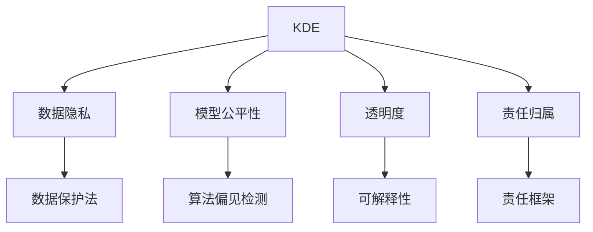

                 

# 知识发现引擎与人工智能伦理

## 1. 背景介绍

### 1.1 问题由来

随着人工智能（AI）技术的迅猛发展，知识发现引擎（Knowledge Discovery Engine, KDE）在各行各业的应用愈发广泛。这些引擎通过分析大量数据，从中提取出隐含的有价值知识，支持决策支持、商业智能、医疗诊断等多个领域的决策制定和优化。然而，知识发现引擎的快速发展也带来了许多新的伦理挑战，包括数据隐私、模型偏见、透明度、责任归属等。

### 1.2 问题核心关键点

知识发现引擎的核心在于从数据中提取出潜在的知识模式，并转化为可操作的见解。这一过程涉及数据预处理、特征工程、模型训练和解释等多个环节。然而，这些环节往往忽略了伦理层面的考量，导致一系列潜在风险。因此，本文聚焦于知识发现引擎与人工智能伦理的交集，探讨如何构建既高效又符合伦理原则的知识发现系统。

### 1.3 问题研究意义

知识发现引擎的伦理考量至关重要，这不仅能保障数据和模型的合理使用，还能提升社会对AI技术的信任和接受度。本文从数据隐私保护、模型公平性、决策透明度和责任归属等维度，系统探讨了知识发现引擎在伦理层面的挑战和解决方案，为未来AI技术的健康发展提供了理论和实践指导。

## 2. 核心概念与联系

### 2.1 核心概念概述

为更好地理解知识发现引擎与人工智能伦理的融合，本节将介绍几个关键概念及其相互关系：

- **知识发现引擎（KDE）**：通过数据挖掘、机器学习等技术手段，从大规模数据中提取有价值知识的系统。常见的KDE包括关联规则学习、分类器训练、聚类分析等。

- **人工智能伦理（AI Ethics）**：涉及人工智能技术在开发、应用过程中可能引发的伦理问题，包括数据隐私、算法偏见、透明度、责任归属等。

- **数据隐私**：指保护个人数据的隐私和安全，防止未经授权的访问和使用。

- **模型公平性**：指确保模型在训练、预测过程中对不同群体的处理公正，避免对某些群体的歧视。

- **透明度**：指模型的内部工作机制可被理解和解释，提升模型决策的可信度。

- **责任归属**：指在模型应用过程中，明确各参与方的责任和义务，确保决策和结果的可追溯和问责。

这些核心概念通过以下Mermaid流程图展示其联系：



这个流程图展示了大语言模型与人工智能伦理的核心概念及其相互关系：

1. KDE系统对数据进行挖掘和分析，涉及到数据隐私保护。
2. 模型公平性是KDE系统关注的重要指标，避免模型对特定群体的歧视。
3. 透明度是KDE系统对外部用户和监管机构的基本要求，可提升系统可信度。
4. 责任归属是KDE系统在应用中必须遵守的原则，确保各参与方的权益。

这些概念共同构成了知识发现引擎与人工智能伦理的研究框架，有助于指导和规范KDE系统的构建和应用。

## 3. 核心算法原理 & 具体操作步骤
### 3.1 算法原理概述

知识发现引擎的算法原理主要围绕数据预处理、特征工程、模型训练和结果解释展开。以下是具体步骤：

1. **数据预处理**：对原始数据进行清洗、转换、归一化等操作，以适应后续分析。
2. **特征工程**：设计或选择对模型有用的特征，并进行归一化、编码等处理。
3. **模型训练**：选择合适的模型结构，并在标注数据上训练模型，优化模型参数。
4. **结果解释**：对模型预测结果进行解释，转换为用户易于理解的见解。

然而，在上述每个步骤中，都存在潜在的伦理风险。数据预处理可能涉及隐私数据泄露，特征工程可能导致模型偏见，模型训练和结果解释可能缺乏透明度和责任归属。

### 3.2 算法步骤详解

#### 3.2.1 数据预处理

**数据预处理**是KDE系统的第一步，通过清洗和转换原始数据，为后续分析打下基础。然而，这一步骤常常忽略了数据隐私问题。例如，在数据清洗中，可能会删除敏感信息，但这些信息在数据转换过程中可能被还原或泄露。因此，数据预处理需注意以下两点：

- **隐私保护**：在数据清洗中，应使用差分隐私技术（如Laplace机制、高斯机制）等，保护个人隐私。
- **透明记录**：记录数据处理的过程和规则，确保数据处理过程的透明性和可追溯性。

#### 3.2.2 特征工程

**特征工程**是KDE系统的核心，通过选择和设计特征，提升模型的预测能力。但特征工程过程中可能引入模型偏见，例如在特征选择时，优先选择与目标变量相关性高的特征，而忽视其他特征。因此，特征工程需注意以下两点：

- **偏见检测**：使用公平性检测工具，如Bias-aware feature selection、FairML等，检测和纠正模型偏见。
- **多维度特征**：考虑不同维度的特征，如文本、时间、地理等，提升模型的多维度分析能力。

#### 3.2.3 模型训练

**模型训练**是KDE系统的关键步骤，通过在标注数据上训练模型，学习数据中的知识模式。但模型训练可能面临以下问题：

- **过拟合**：在训练数据不足或模型复杂度过高的情况下，模型可能过度拟合训练数据，导致泛化能力不足。
- **透明度不足**：训练过程和模型结构可能过于复杂，难以解释，影响用户信任。

因此，模型训练需注意以下两点：

- **正则化**：使用正则化技术，如L1、L2正则化、Dropout等，防止模型过拟合。
- **模型可解释性**：选择可解释性强的模型，如决策树、线性回归等，并在训练过程中记录关键决策点，提升模型的透明度。

#### 3.2.4 结果解释

**结果解释**是KDE系统的最后一步，将模型预测结果转换为用户易于理解的见解，支持决策制定。但结果解释可能面临以下问题：

- **黑盒模型**：复杂的深度学习模型如神经网络，难以解释其内部决策过程。
- **结果可信度**：模型的预测结果可能存在误差，影响决策的可靠性。

因此，结果解释需注意以下两点：

- **模型可解释性**：选择可解释性强的模型，如规则引擎、决策树等，并在结果解释中提供详细的决策路径。
- **结果验证**：通过交叉验证、外部评估等方式，验证模型预测结果的准确性和可靠性。

### 3.3 算法优缺点

知识发现引擎的算法在提升数据洞察力的同时，也带来了以下优缺点：

**优点**：
1. **高效性**：能够从大规模数据中快速提取出有价值知识，支持商业智能、医疗诊断等决策支持系统。
2. **普适性**：适用于各种数据类型和应用场景，包括结构化、半结构化和非结构化数据。
3. **自动化**：通过自动化的数据挖掘和模型训练，提升效率和精度。

**缺点**：
1. **隐私风险**：在数据预处理过程中可能泄露隐私数据。
2. **模型偏见**：在特征工程和模型训练过程中可能引入偏见，影响模型公平性。
3. **透明度不足**：复杂模型难以解释，影响决策透明度和可信度。
4. **责任归属不明**：在模型应用过程中，责任归属难以界定。

尽管存在这些缺点，但知识发现引擎仍然是现代AI技术的重要组成部分，广泛应用于数据驱动的决策支持系统中。未来研究需进一步提升其伦理属性，保障其安全和公正。

### 3.4 算法应用领域

知识发现引擎在多个领域得到了广泛应用，包括但不限于：

- **商业智能（BI）**：通过分析历史数据，预测市场趋势，支持决策制定。
- **医疗诊断**：通过分析患者历史数据，辅助医生进行诊断和治疗决策。
- **金融风险管理**：通过分析金融市场数据，识别风险因素，优化投资策略。
- **智能客服**：通过分析用户反馈数据，改进服务流程，提升用户体验。
- **市场营销**：通过分析消费者行为数据，定制化营销策略，提升转化率。

这些应用展示了知识发现引擎的强大潜力和广泛适用性，但也带来了新的伦理挑战。如何平衡效率和伦理，构建公正、透明的知识发现系统，将是未来研究的重要课题。

## 4. 数学模型和公式 & 详细讲解 & 举例说明

### 4.1 数学模型构建

本节将使用数学语言对知识发现引擎的算法进行更加严格的刻画。

记知识发现引擎的输入数据为 $D=\{x_i\}_{i=1}^N$，其中 $x_i \in \mathcal{X}$。输出为模型预测的结果 $y=\{y_i\}_{i=1}^N$，其中 $y_i \in \mathcal{Y}$。定义损失函数为 $\ell(y,\hat{y})$，用于衡量模型预测结果与真实标签之间的差异。

知识发现引擎的目标是最小化损失函数，即：

$$
\min_{\theta} \sum_{i=1}^N \ell(y_i,\hat{y}_i)
$$

其中 $\theta$ 为模型参数。

### 4.2 公式推导过程

以下我们以分类问题为例，推导常用的逻辑回归模型的损失函数及其梯度计算公式。

假设逻辑回归模型为 $M_{\theta}(x)=\frac{1}{1+\exp(-\theta^T x)}$，其中 $\theta$ 为模型参数，$x \in \mathbb{R}^d$。目标变量 $y \in \{0,1\}$。则二分类交叉熵损失函数为：

$$
\ell(y,M_{\theta}(x)) = -[y\log M_{\theta}(x)+(1-y)\log(1-M_{\theta}(x))]
$$

将其代入经验风险公式，得：

$$
\mathcal{L}(\theta) = -\frac{1}{N}\sum_{i=1}^N \ell(y_i,M_{\theta}(x_i))
$$

根据链式法则，损失函数对参数 $\theta_k$ 的梯度为：

$$
\frac{\partial \mathcal{L}(\theta)}{\partial \theta_k} = \frac{1}{N}\sum_{i=1}^N \frac{y_i-1}{M_{\theta}(x_i)} + \frac{1-M_{\theta}(x_i)}{1-M_{\theta}(x_i)}
$$

将梯度代入参数更新公式，完成模型的迭代优化。

### 4.3 案例分析与讲解

以医疗诊断为例，假设有一个包含多维特征的病人数据集 $D=\{x_i\}_{i=1}^N$，其中每个样本包含病患的年龄、性别、病史等特征。目标变量 $y \in \{0,1\}$，表示是否患有某种疾病。知识发现引擎的任务是学习从病人特征中提取出疾病发生的概率。

在数据预处理阶段，可以使用差分隐私技术保护病人隐私，如Laplace机制：

$$
y' = \frac{y}{\epsilon} + \frac{N}{\epsilon} \cdot \mathcal{L}
$$

其中 $\epsilon$ 为隐私预算，$\mathcal{L}$ 为随机噪声，$y'$ 为隐私保护后的输出。

在特征工程阶段，可以使用公平性检测工具如FairML，检测和纠正模型偏见：

$$
\text{FairML}(D,\hat{y})
$$

在模型训练阶段，可以使用逻辑回归模型，并在训练过程中记录关键决策点，提升模型的透明度：

$$
M_{\theta}(x) = \frac{1}{1+\exp(-\theta^T x)}
$$

在结果解释阶段，可以使用规则引擎，提供详细的决策路径：

$$
\text{Decision Tree}(D,\hat{y})
$$

通过以上分析，可以看到知识发现引擎在伦理层面的综合考量，不仅能保障数据和模型的合理使用，还能提升系统可信度和用户接受度。

## 5. 项目实践：代码实例和详细解释说明

### 5.1 开发环境搭建

在进行知识发现引擎开发前，我们需要准备好开发环境。以下是使用Python进行Scikit-learn开发的简单环境配置流程：

1. 安装Anaconda：从官网下载并安装Anaconda，用于创建独立的Python环境。

2. 创建并激活虚拟环境：
```bash
conda create -n sklearn-env python=3.8 
conda activate sklearn-env
```

3. 安装Scikit-learn：
```bash
conda install scikit-learn
```

4. 安装其他必要工具包：
```bash
pip install numpy pandas matplotlib seaborn jupyter notebook ipython
```

完成上述步骤后，即可在`sklearn-env`环境中开始项目实践。

### 5.2 源代码详细实现

下面我们以分类问题为例，给出使用Scikit-learn对逻辑回归模型进行训练和评估的Python代码实现。

首先，导入必要的库和数据集：

```python
from sklearn.linear_model import LogisticRegression
from sklearn.datasets import load_breast_cancer
from sklearn.model_selection import train_test_split
from sklearn.metrics import classification_report

cancer = load_breast_cancer()
X, y = cancer.data, cancer.target

# 数据集划分
X_train, X_test, y_train, y_test = train_test_split(X, y, test_size=0.2, random_state=42)
```

然后，定义和训练逻辑回归模型：

```python
# 定义逻辑回归模型
clf = LogisticRegression()

# 训练模型
clf.fit(X_train, y_train)
```

接着，评估模型性能：

```python
# 在测试集上评估模型
y_pred = clf.predict(X_test)
print(classification_report(y_test, y_pred))
```

以上就是使用Scikit-learn对逻辑回归模型进行训练和评估的完整代码实现。可以看到，Scikit-learn的封装使得模型训练过程非常简单高效。

### 5.3 代码解读与分析

让我们再详细解读一下关键代码的实现细节：

**load_breast_cancer函数**：
- 从Scikit-learn数据集中加载乳腺癌数据集，获取特征和标签。

**train_test_split函数**：
- 将数据集划分为训练集和测试集，比例为80%训练，20%测试。

**LogisticRegression类**：
- 定义逻辑回归模型，用于二分类问题。

**fit方法**：
- 在训练集上训练逻辑回归模型。

**predict方法**：
- 在测试集上预测标签，返回模型预测结果。

**classification_report函数**：
- 打印模型的分类指标，包括精确度、召回率和F1分数。

代码实现了知识发现引擎的核心步骤，包括数据预处理、模型训练和结果评估。尽管逻辑回归模型比较简单，但通过Scikit-learn的封装，使得代码实现非常简洁。

## 6. 实际应用场景

### 6.1 医疗诊断

知识发现引擎在医疗诊断中的应用非常广泛。通过分析病人的历史数据和当前症状，预测其患病的概率，辅助医生进行诊断和治疗决策。以乳腺癌为例，知识发现引擎可以通过分析病人的年龄、病史、症状等特征，预测其患乳腺癌的概率，帮助医生提前制定治疗方案。

在数据预处理阶段，可以使用差分隐私技术保护病人的隐私。在特征工程阶段，可以使用公平性检测工具，确保模型对不同群体的处理公正。在模型训练阶段，可以选择逻辑回归、支持向量机等可解释性强的模型，并记录关键决策点。在结果解释阶段，可以使用规则引擎，提供详细的诊断路径。

### 6.2 金融风险管理

知识发现引擎在金融风险管理中的应用也非常重要。通过分析市场数据，识别风险因素，优化投资策略，降低风险。以股票市场为例，知识发现引擎可以通过分析历史股价、交易量、公司财务数据等特征，预测股票价格的走势，帮助投资者制定投资策略。

在数据预处理阶段，可以使用差分隐私技术保护市场数据隐私。在特征工程阶段，可以使用公平性检测工具，确保模型对不同投资者的处理公正。在模型训练阶段，可以选择线性回归、随机森林等模型，并记录关键决策点。在结果解释阶段，可以使用规则引擎，提供详细的投资建议。

### 6.3 智能客服

知识发现引擎在智能客服中的应用也很广泛。通过分析客户的历史对话记录，预测客户的需求和意图，提供个性化的服务。以电商平台为例，知识发现引擎可以通过分析客户的购买历史、搜索记录、评价等信息，预测客户的购买意向，提供个性化的商品推荐。

在数据预处理阶段，可以使用差分隐私技术保护客户隐私。在特征工程阶段，可以使用公平性检测工具，确保模型对不同客户的处理公正。在模型训练阶段，可以选择逻辑回归、支持向量机等模型，并记录关键决策点。在结果解释阶段，可以使用规则引擎，提供详细的推荐路径。

### 6.4 未来应用展望

随着知识发现引擎的不断发展，未来将在更多领域得到应用，为传统行业带来变革性影响。

在智慧医疗领域，知识发现引擎可以帮助医生进行精准诊断，辅助治疗决策，提升医疗服务的智能化水平。在智能教育领域，知识发现引擎可以提供个性化学习路径，提升教学质量和效率。在智慧城市治理中，知识发现引擎可以用于城市事件监测、舆情分析、应急指挥等环节，提高城市管理的自动化和智能化水平。

此外，在企业生产、社会治理、文娱传媒等众多领域，知识发现引擎也将不断涌现，为经济社会发展注入新的动力。相信随着技术的日益成熟，知识发现引擎必将在构建人机协同的智能时代中扮演越来越重要的角色。

## 7. 工具和资源推荐

### 7.1 学习资源推荐

为了帮助开发者系统掌握知识发现引擎的理论基础和实践技巧，这里推荐一些优质的学习资源：

1. **《机器学习》（周志华）**：机器学习领域的经典教材，涵盖各种机器学习算法及其应用，包括数据预处理、特征工程、模型训练等环节。

2. **《Python数据科学手册》（Jake VanderPlas）**：介绍如何使用Python进行数据科学开发，涵盖数据预处理、机器学习、可视化等技术。

3. **《Scikit-learn官方文档》**：Scikit-learn的官方文档，提供了丰富的学习资源和样例代码，是进行知识发现引擎开发的重要参考。

4. **Kaggle竞赛**：Kaggle是世界上最大的数据科学竞赛平台，提供大量的公开数据集和机器学习竞赛，可以帮助开发者积累实战经验。

5. **Coursera课程**：Coursera提供各种机器学习相关课程，包括斯坦福大学的《机器学习》课程，涵盖了知识发现引擎的核心技术。

通过对这些资源的学习实践，相信你一定能够快速掌握知识发现引擎的精髓，并用于解决实际的业务问题。

### 7.2 开发工具推荐

高效的开发离不开优秀的工具支持。以下是几款用于知识发现引擎开发的常用工具：

1. **Scikit-learn**：基于Python的开源机器学习库，提供了丰富的机器学习算法和工具，适用于各种数据类型和应用场景。

2. **TensorFlow**：由Google主导开发的开源机器学习框架，生产部署方便，适合大规模工程应用。

3. **PyTorch**：基于Python的开源深度学习框架，灵活动态的计算图，适合快速迭代研究。

4. **H2O**：商业化的开源机器学习平台，提供分布式计算和易于使用的API，适用于企业级应用。

5. **Jupyter Notebook**：交互式的开发环境，支持Python、R等多种语言，适合快速迭代和共享代码。

合理利用这些工具，可以显著提升知识发现引擎的开发效率，加快创新迭代的步伐。

### 7.3 相关论文推荐

知识发现引擎的研究源于学界的持续研究。以下是几篇奠基性的相关论文，推荐阅读：

1. **《C4.5算法》（J. Ross Quinlan）**：提出C4.5决策树算法，是知识发现引擎中的经典算法之一。

2. **《Apriori算法》（Rakesh Agrawal）**：提出Apriori关联规则算法，用于挖掘大规模交易数据中的关联规则。

3. **《基于机器学习的信用风险评估》（R. M. Lehmann）**：应用逻辑回归、决策树等模型进行金融风险评估。

4. **《机器学习在医疗诊断中的应用》（D. K. Steinberg）**：探讨机器学习在医疗诊断中的应用，提升疾病预测和诊断的准确性。

5. **《深度学习在自然语言处理中的应用》（I. Goodfellow）**：介绍深度学习在自然语言处理中的应用，包括文本分类、情感分析等任务。

这些论文代表了大语言模型与人工智能伦理的研究进展，为知识发现引擎的发展提供了理论基础。

## 8. 总结：未来发展趋势与挑战

### 8.1 总结

本文对知识发现引擎与人工智能伦理的交集进行了全面系统的介绍。首先阐述了知识发现引擎在商业智能、医疗诊断、金融风险管理等多个领域的应用背景，明确了其在数据洞察力提升方面的独特价值。其次，从数据隐私保护、模型公平性、透明度和责任归属等维度，详细讲解了知识发现引擎在伦理层面的挑战和解决方案，给出了基于Scikit-learn的完整代码实现。同时，本文还广泛探讨了知识发现引擎在实际应用中的前景，展示了其在多个领域的广泛适用性。

通过本文的系统梳理，可以看到，知识发现引擎在高效数据洞察方面的强大能力，但也面临着隐私保护、模型公平性、透明度和责任归属等多方面的伦理挑战。如何平衡效率和伦理，构建公正、透明的知识发现系统，将是未来研究的重要课题。

### 8.2 未来发展趋势

展望未来，知识发现引擎的发展趋势将呈现以下几个方面：

1. **自动化和智能化**：随着自动机器学习（AutoML）技术的发展，知识发现引擎将更加自动化和智能化，无需人工干预即可高效运行。

2. **跨领域应用**：知识发现引擎将从单一领域向跨领域应用拓展，结合其他人工智能技术，提升系统整体性能。

3. **伦理导向**：在知识发现引擎的设计和应用过程中，将更加注重数据隐私保护、模型公平性、透明度和责任归属等伦理问题，提升系统可信度。

4. **多模态融合**：知识发现引擎将融合文本、图像、语音等多模态数据，提升系统对复杂数据的理解和分析能力。

5. **实时性增强**：知识发现引擎将更加注重实时性，结合流式数据处理技术，实现动态分析和决策支持。

以上趋势展示了知识发现引擎的广阔前景，未来将在更多领域得到应用，为传统行业带来变革性影响。

### 8.3 面临的挑战

尽管知识发现引擎已经取得了瞩目成就，但在迈向更加智能化、普适化应用的过程中，它仍面临着诸多挑战：

1. **数据隐私保护**：在数据预处理过程中，如何保护隐私数据，防止数据泄露和滥用。
2. **模型偏见**：在特征工程和模型训练过程中，如何检测和纠正模型偏见，确保模型公平性。
3. **透明度不足**：在模型训练和结果解释阶段，如何提升模型的透明度，增强用户信任。
4. **责任归属不明**：在模型应用过程中，如何明确各参与方的责任和义务，确保决策和结果的可追溯和问责。

这些挑战凸显了知识发现引擎的复杂性，需要在数据、模型、训练、推理等各环节进行全面优化，才能确保其安全和公正。

### 8.4 研究展望

面向未来，知识发现引擎的研究将在以下几个方面寻求新的突破：

1. **隐私保护技术**：开发更加隐私保护的技术，如差分隐私、联邦学习等，保障数据隐私。
2. **公平性检测**：研究公平性检测方法，如FairML、Bias-aware feature selection等，检测和纠正模型偏见。
3. **可解释性提升**：提升模型的可解释性，使用可解释性强的模型，记录关键决策点，增强透明度。
4. **跨模态融合**：融合文本、图像、语音等多模态数据，提升系统对复杂数据的理解和分析能力。
5. **自动化与智能**：开发自动化机器学习技术，提升知识发现引擎的自动化和智能化水平。

这些研究方向的探索，必将引领知识发现引擎技术迈向更高的台阶，为构建安全、可靠、可解释、可控的智能系统铺平道路。

## 9. 附录：常见问题与解答

**Q1：知识发现引擎的主要应用领域有哪些？**

A: 知识发现引擎主要应用于商业智能、医疗诊断、金融风险管理、智能客服、市场营销等多个领域。

**Q2：如何保护数据隐私？**

A: 在数据预处理阶段，可以使用差分隐私技术，如Laplace机制、高斯机制等，保护个人隐私。

**Q3：如何检测和纠正模型偏见？**

A: 在特征工程和模型训练阶段，可以使用公平性检测工具，如FairML、Bias-aware feature selection等，检测和纠正模型偏见。

**Q4：如何提升模型的可解释性？**

A: 选择可解释性强的模型，如决策树、线性回归等，并在训练过程中记录关键决策点，提升模型的透明度。

**Q5：如何在知识发现引擎中应用AI伦理？**

A: 在知识发现引擎的设计和应用过程中，需注重数据隐私保护、模型公平性、透明度和责任归属等伦理问题，确保系统的安全和公正。

通过对这些问题的探讨和解答，可以看到知识发现引擎在伦理层面的综合考量，不仅能保障数据和模型的合理使用，还能提升系统可信度和用户接受度。

