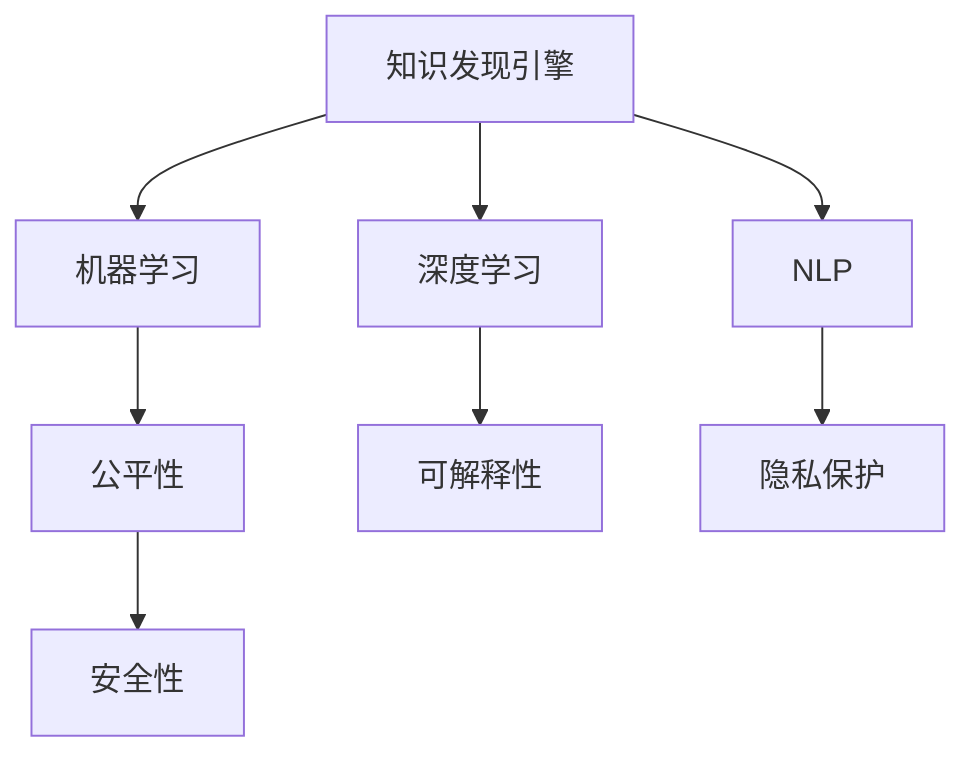

                 

## 1. 背景介绍

### 1.1 问题由来

在人工智能(AI)技术迅猛发展的今天，知识发现引擎(Knowledge Discovery Engine, KDE)已成为一个重要的研究领域。通过综合利用机器学习、自然语言处理等技术，知识发现引擎可以自动发现、提取和整合大量数据中的有价值信息，帮助人们做出更为精准的决策。然而，随着知识发现引擎在各个领域的广泛应用，其背后涉及的伦理问题也日益凸显。如何在提升数据价值的同时，保证信息的公平、透明、可解释性，是当前AI研究的一大挑战。

### 1.2 问题核心关键点

知识发现引擎的伦理问题主要集中在以下几个方面：

1. **数据偏见**：当知识发现引擎依赖有偏见的训练数据时，模型输出的结果可能也带有偏见，如对特定群体的歧视、对隐性信息的忽视等。
   
2. **隐私保护**：知识发现引擎通常需要大量数据，如何保护这些数据来源的隐私和匿名性，防止个人信息泄露，是关键问题。
   
3. **模型可解释性**：知识发现引擎生成的复杂模型往往缺乏可解释性，难以理解其内部逻辑和决策依据，这可能导致用户对模型输出的不信任，限制了其应用范围。
   
4. **安全性**：知识发现引擎可能被用于恶意目的，如生成假数据、攻击系统等，威胁数据和系统的安全。

### 1.3 问题研究意义

研究知识发现引擎的伦理问题，对于提升AI技术的可信度和社会接受度，具有重要意义：

1. **提升可信度**：通过引入伦理约束，构建公平、透明的AI系统，可以增强用户和公众对AI技术的信任。
   
2. **促进公平性**：通过识别和纠正数据偏见，可以确保AI系统在各个领域应用中的公平性和包容性。
   
3. **推动透明度**：通过提供可解释的模型输出，可以增进用户对AI决策的理解，提高系统的透明度。
   
4. **保障安全**：通过设立安全防线，可以有效防止恶意攻击，保护数据和系统的安全。

## 2. 核心概念与联系

### 2.1 核心概念概述

为更好地理解知识发现引擎与人工智能伦理的交集，本节将介绍几个密切相关的核心概念：

- **知识发现引擎(KDE)**：利用机器学习、数据挖掘等技术，自动发现数据中的潜在模式和有价值信息，帮助用户做出更准确的决策。
   
- **机器学习(ML)**：通过算法和模型，从数据中学习规律和模式，用于预测、分类、聚类等任务。
   
- **深度学习(Deep Learning, DL)**：一类基于神经网络的机器学习技术，能够处理复杂的数据结构，如图像、语音、文本等。
   
- **自然语言处理(NLP)**：涉及计算机如何处理和理解自然语言，包括语言模型、信息抽取、机器翻译等。
   
- **公平性(Fairness)**：指AI系统在对待不同群体时，不出现系统性的偏见。
   
- **可解释性(Explainability)**：指模型输出结果的可理解性和可解释性，帮助用户理解模型决策依据。
   
- **隐私保护(Privacy)**：保护数据来源的隐私和匿名性，防止数据泄露和滥用。
   
- **安全性(Security)**：保障AI系统的安全稳定，防止恶意攻击和数据篡改。

这些核心概念之间的逻辑关系可以通过以下Mermaid流程图来展示：



这个流程图展示了的核心概念及其之间的关系：

1. 知识发现引擎利用机器学习、深度学习和NLP等技术，发现数据中的知识。

2. 机器学习、深度学习和NLP是知识发现引擎的核心技术手段。

3. 公平性、可解释性和隐私保护是知识发现引擎应用过程中需要特别关注的伦理问题。

4. 安全性是知识发现引擎应用的基本保障。

这些概念共同构成了知识发现引擎的研究框架，使其能够在提升数据价值的同时，保证信息的公平、透明、可解释性和安全性。通过理解这些核心概念，我们可以更好地把握知识发现引擎的伦理应用。

## 3. 核心算法原理 & 具体操作步骤
### 3.1 算法原理概述

知识发现引擎的伦理问题涉及数据、模型和应用等多个环节。以下将从这三个方面逐一探讨其核心算法原理：

### 3.2 算法步骤详解

#### 3.2.1 数据预处理

1. **数据收集**：从不同来源收集数据，如政府公开数据、商业数据、社交媒体数据等。
   
2. **数据清洗**：去除噪声、重复和不完整的数据，保证数据质量。
   
3. **数据归一化**：对数据进行标准化或归一化处理，使其符合模型的输入要求。

#### 3.2.2 模型训练

1. **特征工程**：选择和构造数据特征，用于模型的训练。

2. **模型选择**：根据任务类型选择合适的机器学习或深度学习模型。

3. **模型训练**：使用训练数据集对模型进行训练，调整模型参数以优化性能。

#### 3.2.3 模型评估

1. **性能评估**：使用测试数据集对模型进行性能评估，如准确率、召回率、F1值等。

2. **公平性评估**：评估模型在不同群体上的表现，识别可能的偏见。

3. **可解释性评估**：使用LIME、SHAP等工具分析模型的解释能力。

#### 3.2.4 应用部署

1. **模型部署**：将训练好的模型部署到生产环境，提供API接口供用户调用。

2. **实时监控**：实时监控模型性能，及时发现和纠正问题。

3. **安全防护**：实施访问控制、数据加密等措施，保障系统安全。

#### 3.2.5 隐私保护

1. **数据匿名化**：对数据进行去标识化处理，防止个人信息泄露。

2. **差分隐私**：使用差分隐私技术，在保护隐私的前提下，利用数据进行知识发现。

3. **联邦学习**：在分布式环境下，通过加密传输数据和模型参数，保护数据隐私。

### 3.3 算法优缺点

知识发现引擎的算法具有以下优点：

1. **自动化高效**：可以自动发现和提取数据中的知识，提高数据处理效率。
   
2. **广泛适用**：适用于多种数据类型和任务，如图像、文本、时间序列等。
   
3. **结果可解释**：通过可视化工具，用户可以理解模型发现的知识和决策依据。

然而，这些算法也存在一些缺点：

1. **数据质量依赖**：知识发现引擎的效果高度依赖数据质量，数据偏差可能导致模型输出偏见。
   
2. **模型复杂性高**：复杂的深度学习模型往往难以解释其内部决策逻辑，降低可解释性。
   
3. **隐私风险**：在数据收集和处理过程中，可能面临隐私泄露的风险。
   
4. **安全性挑战**：模型部署和应用过程中，可能面临恶意攻击和数据篡改的风险。

### 3.4 算法应用领域

知识发现引擎的应用领域广泛，涉及金融、医疗、零售、政府等多个行业：

1. **金融风险管理**：利用知识发现引擎自动分析金融交易数据，识别潜在风险。
   
2. **医疗疾病预测**：通过分析患者历史数据，预测疾病发展趋势，提供个性化治疗方案。
   
3. **零售客户分析**：利用客户行为数据，发现潜在消费模式，提升销售额。
   
4. **政府公共服务**：分析公众反馈数据，优化公共服务流程，提升服务质量。

## 4. 数学模型和公式 & 详细讲解 & 举例说明

### 4.1 数学模型构建

#### 4.1.1 数据表示

知识发现引擎通常处理的是高维稀疏数据，因此需要选择合适的数据表示方式。以下以文本数据为例，介绍常用的向量表示方法：

1. **词袋模型(Bag of Words, BoW)**：将文本表示为词频向量。
   
2. **TF-IDF模型**：考虑词频和词的逆文档频率，提升重要词的权重。
   
3. **词嵌入模型(Word Embeddings)**：将词表示为低维向量，保留词语的语义信息。

#### 4.1.2 特征工程

特征工程是知识发现引擎的重要环节，通过选择和构造特征，提升模型的性能。常用的特征工程方法包括：

1. **词性标注**：标注文本中的词性，用于提升模型对语义的理解。
   
2. **句法分析**：分析句子结构，提取语法信息。
   
3. **主题建模**：使用LDA、LSI等方法，发现文本中的主题。

#### 4.1.3 模型训练

常用的机器学习模型包括：

1. **线性回归**：用于预测数值型变量。
   
2. **逻辑回归**：用于分类任务，如判断文本情感。
   
3. **决策树**：用于分类和回归任务，具有较高的可解释性。
   
4. **随机森林**：集成多个决策树，提升模型性能和泛化能力。

#### 4.1.4 模型评估

常用的模型评估指标包括：

1. **准确率**：模型预测正确的样本数与总样本数的比值。
   
2. **召回率**：模型正确识别出的正样本数与实际正样本数的比值。
   
3. **F1值**：准确率和召回率的调和平均值。

### 4.2 公式推导过程

#### 4.2.1 线性回归

线性回归模型形式为：

$$
y = \beta_0 + \beta_1 x_1 + \beta_2 x_2 + ... + \beta_n x_n
$$

其中 $y$ 为预测值，$x_1, x_2, ..., x_n$ 为特征向量，$\beta_0, \beta_1, ..., \beta_n$ 为模型参数。

最小化平方误差损失函数：

$$
\mathcal{L}(\beta) = \frac{1}{2m} \sum_{i=1}^m (y_i - \hat{y}_i)^2
$$

其中 $m$ 为样本数，$\hat{y}_i$ 为模型预测值。

使用梯度下降算法，求解最小化损失函数的 $\beta$：

$$
\beta_j = \beta_j - \eta \frac{1}{m} \sum_{i=1}^m (y_i - \hat{y}_i) x_{ij}
$$

其中 $\eta$ 为学习率。

#### 4.2.2 逻辑回归

逻辑回归模型形式为：

$$
\hat{y} = \frac{1}{1+e^{-\theta^T x}}
$$

其中 $x$ 为特征向量，$\theta$ 为模型参数。

最小化交叉熵损失函数：

$$
\mathcal{L}(\theta) = -\frac{1}{m} \sum_{i=1}^m [y_i \log \hat{y}_i + (1-y_i) \log (1-\hat{y}_i)]
$$

使用梯度下降算法，求解最小化损失函数的 $\theta$：

$$
\theta_j = \theta_j - \eta \frac{1}{m} \sum_{i=1}^m [y_i - \hat{y}_i] x_{ij}
$$

其中 $\eta$ 为学习率。

#### 4.2.3 决策树

决策树模型形式为：

$$
T(x) = 
\begin{cases}
\text{leaf}_j, & \text{if node}_j \text{is a leaf} \\
T_l(T(x)) & \text{if node}_j \text{has left child} \\
T_r(T(x)) & \text{if node}_j \text{has right child}
\end{cases}
$$

其中 $x$ 为特征向量，$T(x)$ 为模型输出，$\text{leaf}_j$ 为叶节点，$T_l$ 和 $T_r$ 为左右子树。

模型训练过程中，通过递归地选择最优特征和划分点，构建决策树。

### 4.3 案例分析与讲解

#### 4.3.1 医疗疾病预测

以医疗领域为例，利用知识发现引擎自动分析患者历史数据，预测疾病发展趋势。具体步骤如下：

1. **数据收集**：收集患者的生理指标、诊断结果、生活习惯等数据。
   
2. **数据清洗**：去除缺失数据，填补空缺值。
   
3. **特征工程**：选择和构造关键特征，如年龄、性别、药物使用等。
   
4. **模型训练**：选择逻辑回归或随机森林模型，训练疾病预测模型。
   
5. **模型评估**：在测试集上评估模型性能，调整参数以优化预测结果。

#### 4.3.2 金融风险管理

在金融领域，利用知识发现引擎分析交易数据，识别潜在风险。具体步骤如下：

1. **数据收集**：收集历史交易记录、市场数据、新闻资讯等数据。
   
2. **数据清洗**：去除异常值，修正数据格式。
   
3. **特征工程**：选择和构造关键特征，如交易量、价格波动、行业指数等。
   
4. **模型训练**：选择决策树或支持向量机模型，训练风险预测模型。
   
5. **模型评估**：在测试集上评估模型性能，调整参数以优化预测结果。

## 5. 项目实践：代码实例和详细解释说明

### 5.1 开发环境搭建

在进行知识发现引擎项目实践前，我们需要准备好开发环境。以下是使用Python进行Scikit-learn开发的环境配置流程：

1. 安装Anaconda：从官网下载并安装Anaconda，用于创建独立的Python环境。

2. 创建并激活虚拟环境：
```bash
conda create -n sklearn-env python=3.8 
conda activate sklearn-env
```

3. 安装Scikit-learn：从官网获取对应的安装命令。例如：
```bash
conda install scikit-learn
```

4. 安装各类工具包：
```bash
pip install numpy pandas scikit-learn matplotlib tqdm jupyter notebook ipython
```

完成上述步骤后，即可在`sklearn-env`环境中开始知识发现引擎的实践。

### 5.2 源代码详细实现

下面以医疗疾病预测为例，给出使用Scikit-learn进行逻辑回归模型训练的Python代码实现。

首先，定义数据预处理函数：

```python
import pandas as pd
from sklearn.model_selection import train_test_split
from sklearn.preprocessing import StandardScaler
from sklearn.linear_model import LogisticRegression

def load_data(file_path):
    data = pd.read_csv(file_path)
    X = data.drop('disease', axis=1)
    y = data['disease']
    return X, y

def preprocess_data(X, y):
    X_train, X_test, y_train, y_test = train_test_split(X, y, test_size=0.2, random_state=42)
    scaler = StandardScaler()
    X_train = scaler.fit_transform(X_train)
    X_test = scaler.transform(X_test)
    return X_train, X_test, y_train, y_test

def train_model(X_train, y_train):
    model = LogisticRegression()
    model.fit(X_train, y_train)
    return model
```

然后，定义模型评估函数：

```python
from sklearn.metrics import accuracy_score, precision_score, recall_score, f1_score

def evaluate_model(model, X_test, y_test):
    y_pred = model.predict(X_test)
    accuracy = accuracy_score(y_test, y_pred)
    precision = precision_score(y_test, y_pred)
    recall = recall_score(y_test, y_pred)
    f1 = f1_score(y_test, y_pred)
    print(f'Accuracy: {accuracy:.2f}')
    print(f'Precision: {precision:.2f}')
    print(f'Recall: {recall:.2f}')
    print(f'F1-score: {f1:.2f}')
```

接着，启动训练流程并在测试集上评估：

```python
X, y = load_data('data.csv')
X_train, X_test, y_train, y_test = preprocess_data(X, y)
model = train_model(X_train, y_train)
evaluate_model(model, X_test, y_test)
```

以上就是使用Scikit-learn进行逻辑回归模型训练的完整代码实现。可以看到，Scikit-learn提供了完整的机器学习库，可以方便地实现数据预处理、模型训练和模型评估等功能。

### 5.3 代码解读与分析

让我们再详细解读一下关键代码的实现细节：

**load_data函数**：
- 从文件中读取数据，并将特征和标签分离。

**preprocess_data函数**：
- 使用train_test_split函数将数据集划分训练集和测试集。
- 使用StandardScaler对数据进行标准化处理，使不同特征具有相同的量级。

**train_model函数**：
- 选择逻辑回归模型，使用训练集数据拟合模型。

**evaluate_model函数**：
- 在测试集上预测模型输出，并使用sklearn的metrics库计算评估指标。

**训练流程**：
- 加载数据
- 预处理数据
- 训练模型
- 评估模型

可以看到，Scikit-learn提供了简单易用的接口，使得知识发现引擎的实践变得非常直观和高效。开发者可以将更多精力放在数据处理、模型改进等高层逻辑上，而不必过多关注底层的实现细节。

当然，工业级的系统实现还需考虑更多因素，如模型的保存和部署、超参数的自动搜索、更灵活的任务适配层等。但核心的知识发现引擎实践流程基本与此类似。

## 6. 实际应用场景

### 6.1 智能医疗

在智能医疗领域，知识发现引擎可以自动分析患者的生理指标、诊断结果等数据，发现潜在的健康风险和疾病发展趋势，提供个性化的治疗方案和预防建议。例如，利用知识发现引擎对病人的电子健康记录进行分析，可以发现高血压、糖尿病等慢性病患者的病情变化趋势，提前进行干预和治疗。

### 6.2 金融风控

在金融领域，知识发现引擎可以分析交易数据、市场数据等，识别潜在的欺诈行为和风险点，提前进行风险预警和控制。例如，通过分析信用卡交易数据，发现异常交易行为，提前预警可能的欺诈风险。

### 6.3 零售个性化推荐

在零售领域，知识发现引擎可以分析用户的购买行为、浏览记录等数据，发现用户的兴趣偏好，提供个性化的商品推荐和促销活动。例如，通过分析用户的购物记录，推荐用户可能感兴趣的商品，提高销售额和用户满意度。

### 6.4 未来应用展望

随着知识发现引擎的不断进步，其在更多领域的应用前景将更加广阔。

在智慧城市治理中，知识发现引擎可以分析城市运行数据，发现交通拥堵、环境污染等城市问题，提供优化方案和管理建议，提升城市管理效率。

在智能制造中，知识发现引擎可以分析生产数据，发现设备运行异常，预测设备维护需求，提升生产效率和设备可靠性。

在教育领域，知识发现引擎可以分析学生学习数据，发现学习行为模式，提供个性化的学习建议和资源推荐，提升教育质量和学习效果。

总之，知识发现引擎在各个领域的广泛应用，将推动智慧社会的建设，为人们带来更为便捷、高效、智能的生活体验。

## 7. 工具和资源推荐
### 7.1 学习资源推荐

为了帮助开发者系统掌握知识发现引擎的理论基础和实践技巧，这里推荐一些优质的学习资源：

1. 《Python数据科学手册》：介绍Python在数据科学中的应用，包括数据处理、机器学习等。
   
2. 《机器学习实战》：提供机器学习算法的实现和应用案例，适合初学者入门。
   
3. 《深度学习入门：基于Python的理论与实现》：介绍深度学习的基本概念和实现方法。
   
4. 《自然语言处理综论》：介绍自然语言处理的基本理论和应用技术。
   
5. 《机器学习实战》：提供机器学习算法的实现和应用案例，适合初学者入门。

通过这些资源的学习实践，相信你一定能够快速掌握知识发现引擎的精髓，并用于解决实际的NLP问题。

### 7.2 开发工具推荐

高效的开发离不开优秀的工具支持。以下是几款用于知识发现引擎开发的常用工具：

1. Python：Python是数据科学和机器学习的主流语言，易于学习和使用。

2. Scikit-learn：提供了简单易用的机器学习库，支持常见的分类、回归、聚类等任务。

3. TensorFlow：由Google主导开发的开源深度学习框架，支持复杂的深度学习模型。

4. Keras：基于TensorFlow的高级深度学习库，提供了简单易用的接口。

5. Jupyter Notebook：交互式的数据科学笔记本，支持代码编辑、结果展示和可视化。

6. GitHub：版本控制和代码托管平台，方便团队协作和代码共享。

合理利用这些工具，可以显著提升知识发现引擎的开发效率，加快创新迭代的步伐。

### 7.3 相关论文推荐

知识发现引擎的研究源于学界的持续研究。以下是几篇奠基性的相关论文，推荐阅读：

1. "A Knowledge Discovery Database for Exploring Medical Information"：介绍了一个医疗知识发现数据库，用于医学领域的研究。

2. "C4.5: Programs for Machine Learning"：介绍了C4.5决策树算法的实现和应用。

3. "An Introduction to Statistical Learning"：介绍了统计学习的基本概念和方法，包括回归、分类、聚类等。

4. "Feature Engineering: The Most Important Step of Machine Learning"：介绍了特征工程在机器学习中的应用和技巧。

5. "Deep Learning"：由Ian Goodfellow等编写的深度学习教材，全面介绍了深度学习的基本原理和实现方法。

这些论文代表了大规模知识发现引擎的研究方向，通过学习这些前沿成果，可以帮助研究者把握学科前进方向，激发更多的创新灵感。

## 8. 总结：未来发展趋势与挑战

### 8.1 总结

本文对知识发现引擎的伦理问题进行了全面系统的介绍。首先阐述了知识发现引擎在各领域的应用和重要性，明确了其背后的伦理问题。其次，从数据、模型和应用等多个环节，详细讲解了知识发现引擎的算法原理和操作步骤。通过系统梳理，可以看到知识发现引擎在提升数据价值的同时，也面临诸多伦理挑战。

通过本文的系统梳理，可以看到，知识发现引擎在提升数据价值的同时，也面临诸多伦理挑战。如何在提升数据价值的同时，保证信息的公平、透明、可解释性和安全性，是当前AI研究的一大挑战。未来，伴随知识发现引擎的不断进步，其在更多领域的应用前景将更加广阔，推动智慧社会的建设，为人们带来更为便捷、高效、智能的生活体验。

### 8.2 未来发展趋势

展望未来，知识发现引擎的发展趋势将呈现以下几个方向：

1. **自动化和智能化**：知识发现引擎将更加自动化和智能化，能够自主发现和整合数据中的有价值信息，提升数据处理效率。
   
2. **跨领域融合**：知识发现引擎将与其他AI技术进行更深层次的融合，如自然语言处理、计算机视觉、语音识别等，实现多模态信息协同建模。
   
3. **隐私保护**：随着隐私保护的重视，知识发现引擎将更加注重数据隐私和安全，采用差分隐私、联邦学习等技术，保障用户数据的安全性。
   
4. **可解释性增强**：为了增强用户对知识发现引擎的信任，模型输出将更加可解释，能够提供决策依据和推理过程。

### 8.3 面临的挑战

尽管知识发现引擎在提升数据价值方面取得了显著进展，但在面临的伦理挑战方面，仍然存在一些亟待解决的问题：

1. **数据质量依赖**：知识发现引擎的效果高度依赖数据质量，数据偏差可能导致模型输出偏见。
   
2. **模型复杂性高**：复杂的深度学习模型往往难以解释其内部决策逻辑，降低可解释性。
   
3. **隐私风险**：在数据收集和处理过程中，可能面临隐私泄露的风险。
   
4. **安全性挑战**：模型部署和应用过程中，可能面临恶意攻击和数据篡改的风险。

### 8.4 研究展望

面向未来，知识发现引擎的研究需要在以下几个方面寻求新的突破：

1. **数据质量提升**：通过引入无监督学习和半监督学习，提升数据质量，减少数据偏差。
   
2. **模型可解释性增强**：通过引入因果推断、符号化推理等技术，增强模型的可解释性。
   
3. **隐私保护技术**：通过差分隐私、联邦学习等技术，保障数据隐私和安全。

4. **跨模态知识整合**：通过多模态信息融合技术，实现视觉、语音、文本等多模态信息协同建模。

这些研究方向的探索，将引领知识发现引擎技术迈向更高的台阶，为构建安全、可靠、可解释、可控的智能系统铺平道路。面向未来，知识发现引擎还需要与其他AI技术进行更深入的融合，如知识表示、因果推理、强化学习等，多路径协同发力，共同推动自然语言理解和智能交互系统的进步。只有勇于创新、敢于突破，才能不断拓展知识发现引擎的边界，让智能技术更好地造福人类社会。

## 9. 附录：常见问题与解答

**Q1：知识发现引擎如何保证数据公平性？**

A: 知识发现引擎可以通过以下方式保证数据公平性：

1. **数据集划分**：确保训练集和测试集在数据分布上尽量均衡，避免模型对某类样本的偏袒。
   
2. **特征工程**：在特征选择和构造过程中，尽量减少对敏感特征的依赖，避免对某些群体的歧视。
   
3. **模型训练**：使用公平性约束的算法，如平衡分类、公平性优化等，确保模型在不同群体上的表现一致。

**Q2：知识发现引擎如何处理数据隐私问题？**

A: 知识发现引擎可以通过以下方式处理数据隐私问题：

1. **数据匿名化**：对数据进行去标识化处理，防止个人信息泄露。
   
2. **差分隐私**：在保护隐私的前提下，利用数据进行知识发现。例如，使用Laplace机制和噪声注入等方法，确保单个数据点的隐私不受影响。
   
3. **联邦学习**：在分布式环境下，通过加密传输数据和模型参数，保护数据隐私。

**Q3：知识发现引擎如何增强模型可解释性？**

A: 知识发现引擎可以通过以下方式增强模型可解释性：

1. **可视化技术**：使用可视化工具，如LIME、SHAP等，分析模型的决策依据和推理过程。
   
2. **符号化推理**：引入符号化的先验知识，与神经网络模型进行融合，增强模型的可解释性。
   
3. **因果分析**：通过因果推断技术，识别模型决策的关键特征，增强输出的因果性和逻辑性。

**Q4：知识发现引擎在金融风控中的应用有哪些？**

A: 知识发现引擎在金融风控中的应用包括：

1. **欺诈检测**：通过分析交易数据，识别异常交易行为，提前预警可能的欺诈风险。
   
2. **信用评分**：通过分析贷款数据，预测客户的信用风险，辅助贷款决策。
   
3. **风险预警**：通过分析市场数据，预测金融市场的风险变化趋势，提供预警信号。

**Q5：知识发现引擎在智能医疗中的应用有哪些？**

A: 知识发现引擎在智能医疗中的应用包括：

1. **疾病预测**：通过分析患者历史数据，预测疾病发展趋势，提供个性化的治疗方案和预防建议。
   
2. **诊疗建议**：通过分析医疗影像数据，辅助医生进行疾病诊断和治疗方案制定。
   
3. **健康管理**：通过分析患者的生理指标和生活习惯，提供个性化的健康管理建议。

---

作者：禅与计算机程序设计艺术 / Zen and the Art of Computer Programming

