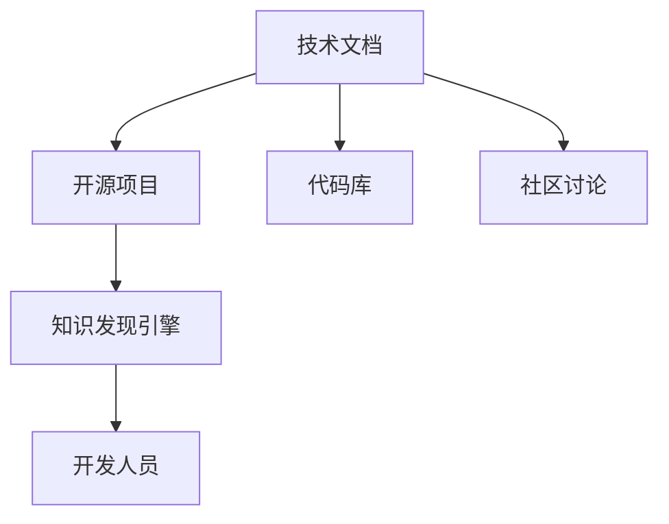

                 

## 1. 背景介绍

在数字化时代，技术日新月异，开发人员面临着前所未有的学习和适应压力。新技术、新框架、新工具不断涌现，但开发人员的时间、精力和资源却是有限的。如何快速掌握新技术、提升开发效率，成为了软件开发人员持续关注和努力解决的问题。

### 1.1 问题由来
在过去的几十年里，软件开发领域经历了多次技术革命，从传统的基于过程编程、面向对象编程到现代的软件开发生命周期模型，如敏捷开发、DevOps、微服务架构等，技术栈不断演进。每一波技术浪潮都会带来新的编程语言、框架、工具和理念，开发人员需要不断学习新知识、掌握新技能。

### 1.2 问题核心关键点
为了快速适应新技术，开发人员需要找到一种有效的方式来吸收新技术的核心知识，并能够在实际项目中应用这些知识。然而，新技术的学习曲线往往很陡峭，开发人员需要投入大量的时间和精力，才能真正掌握和运用这些新技术。

### 1.3 问题研究意义
研究和实现知识发现引擎，可以帮助开发人员快速理解新技术的核心原理和应用场景，加速新技术的学习和应用过程。知识发现引擎通过分析和整理技术文档、开源项目、代码库、社区讨论等丰富的技术资源，为开发人员提供了一个即插即用的学习工具，提升开发效率，加速技术创新。

## 2. 核心概念与联系

### 2.1 核心概念概述

为了更好地理解知识发现引擎的工作原理和优化方向，本节将介绍几个关键概念：

- **知识发现引擎**：指通过分析和整理技术文档、开源项目、代码库、社区讨论等技术资源，为开发人员提供快速学习和应用新技术的工具。
- **技术文档**：包括API文档、官方手册、用户指南等，提供技术的基础知识和使用方法。
- **开源项目**：包括GitHub、GitLab等平台上的开源代码库，展示技术的实际应用和最佳实践。
- **代码库**：包含技术实现细节和代码示例，提供学习的代码层面支撑。
- **社区讨论**：指技术社区、论坛、社交媒体上的交流和讨论，提供社区实践和用户反馈。

这些概念之间的逻辑关系可以通过以下Mermaid流程图来展示：



这个流程图展示了几类关键技术资源之间的关系，以及知识发现引擎如何整合这些资源，为开发人员提供快速学习新技术的路径。

## 3. 核心算法原理 & 具体操作步骤

### 3.1 算法原理概述

知识发现引擎的核心原理是通过自然语言处理(NLP)和信息检索技术，将技术文档、开源项目、代码库、社区讨论等资源进行分析和整理，提取出关键技术点、代码示例、使用场景等信息，并提供给开发人员。

知识发现引擎的工作流程包括：
1. **文本爬取**：从技术文档、开源项目、社区讨论等平台爬取相关的文本信息。
2. **文本分析**：使用NLP技术对文本信息进行分词、命名实体识别、情感分析等处理。
3. **信息抽取**：从处理后的文本中提取关键技术点、代码示例、使用场景等信息。
4. **信息整合**：将提取的信息整合成结构化的知识库，并提供给开发人员。

### 3.2 算法步骤详解

下面详细讲解知识发现引擎的算法步骤：

#### 3.2.1 文本爬取

**步骤1**：选择爬虫工具，从技术文档、开源项目、社区讨论等平台爬取相关的文本信息。

**步骤2**：使用分布式爬虫技术，提高爬虫效率，并避免对目标网站的干扰。

**步骤3**：对爬取的文本进行去重、去噪处理，确保数据质量。

#### 3.2.2 文本分析

**步骤4**：对处理后的文本进行分词、命名实体识别、情感分析等处理。

**步骤5**：使用预训练的NLP模型，如BERT、GPT等，对文本进行深度分析。

**步骤6**：通过词向量表示、句法分析等技术，提取出文本的关键信息和结构。

#### 3.2.3 信息抽取

**步骤7**：从分析后的文本中，抽取关键技术点、代码示例、使用场景等信息。

**步骤8**：使用信息抽取技术，如实体抽取、关系抽取等，对文本中的信息进行结构化处理。

**步骤9**：对抽取的信息进行校验、筛选，确保信息的准确性和完整性。

#### 3.2.4 信息整合

**步骤10**：将抽取的信息整合成结构化的知识库，并使用图形化界面呈现。

**步骤11**：提供搜索、分类、推荐等功能，方便开发人员快速查找和应用信息。

**步骤12**：定期更新知识库，保证信息的及时性和准确性。

### 3.3 算法优缺点

知识发现引擎具有以下优点：
1. **全面覆盖**：能够整合多种技术资源，提供全面的技术学习和应用支持。
2. **即用即学**：通过分析和整理技术资源，为开发人员提供快速学习和应用新技术的路径。
3. **实时更新**：能够实时更新知识库，确保信息的及时性和准确性。

同时，该方法也存在一定的局限性：
1. **数据质量依赖**：依赖于爬取的数据质量，爬取不到或数据不全会影响知识库的完整性。
2. **信息抽取难度**：技术文档、开源项目、社区讨论等资源形式多样，信息抽取难度较大。
3. **技术适应性**：不同领域的知识库需要不同的技术和策略，适应性有待提高。
4. **用户体验**：如果知识库过于庞大，开发人员可能需要花费较多时间寻找相关信息。

尽管存在这些局限性，但知识发现引擎为开发人员提供了强有力的技术支持，帮助他们快速掌握新技术，加速技术创新。

### 3.4 算法应用领域

知识发现引擎的应用领域非常广泛，覆盖了软件开发、技术文档、开源项目、社区讨论等多个领域。

#### 3.4.1 软件开发

知识发现引擎能够为开发人员提供快速学习新技术的路径，帮助他们掌握新技术的核心原理和应用场景。

**案例**：某公司开发人员需要掌握TensorFlow 2.0框架。通过知识发现引擎，开发人员可以快速找到TensorFlow 2.0的官方文档、开源项目、代码示例和社区讨论等信息，理解其核心原理和应用场景，从而快速上手使用TensorFlow 2.0。

#### 3.4.2 技术文档

知识发现引擎可以分析技术文档，提取出关键技术点和代码示例，帮助开发人员快速理解文档内容。

**案例**：某开发人员需要学习JavaScript框架React。通过知识发现引擎，开发人员可以快速找到React的官方文档，并从中提取关键技术点和代码示例，从而掌握React的核心原理和使用方法。

#### 3.4.3 开源项目

知识发现引擎可以分析和整理开源项目，提取出最佳实践和代码示例，帮助开发人员了解最佳实践。

**案例**：某开发人员需要学习GitHub上的开源项目Elasticsearch。通过知识发现引擎，开发人员可以快速找到Elasticsearch的代码示例和最佳实践，从而了解其使用方法和优化技巧。

#### 3.4.4 社区讨论

知识发现引擎可以分析和整理社区讨论，提取出用户反馈和常见问题，帮助开发人员解决实际问题。

**案例**：某开发人员在使用Spring Boot框架时遇到问题。通过知识发现引擎，开发人员可以查找社区讨论，了解其他开发人员如何解决类似问题，从而快速解决问题。

## 4. 数学模型和公式 & 详细讲解 & 举例说明

### 4.1 数学模型构建

本节将使用数学语言对知识发现引擎的工作流程进行更加严格的刻画。

假设知识发现引擎从技术文档、开源项目、社区讨论等平台爬取的文本数据为$D$，其中$D=\{d_1, d_2, \ldots, d_n\}$，每个文本$d_i$表示一个文档、代码片段或讨论内容。

定义文本分析模型为$A$，用于对文本进行分词、命名实体识别、情感分析等处理。定义信息抽取模型为$E$，用于从处理后的文本中提取关键技术点、代码示例、使用场景等信息。

知识发现引擎的工作流程可以表示为：

$$
K=\{(d_i, A(d_i), E(A(d_i)))\}_{i=1}^n
$$

其中，$A(d_i)$表示对文本$d_i$进行分词、命名实体识别、情感分析等处理的结果，$E(A(d_i))$表示从处理后的文本中抽取关键技术点、代码示例、使用场景等信息的结果。

### 4.2 公式推导过程

以下我们以抽取代码示例为例，推导信息抽取模型的公式。

假设处理后的文本为$T$，其中包含多个代码片段，每个代码片段表示为一个字符串$C_j$，其中$j=1, 2, \ldots, m$。代码示例的抽取过程可以表示为：

$$
E(T) = \{C_j\}_{j=1}^m
$$

对于每个代码片段$C_j$，可以使用正则表达式、关键词匹配、代码风格分析等技术进行抽取。假设使用正则表达式$R$进行抽取，则抽取过程可以表示为：

$$
E_C(C_j) = \{C_j | R(C_j)\}_{j=1}^m
$$

其中，$R(C_j)$表示正则表达式$R$对代码片段$C_j$的匹配结果。

### 4.3 案例分析与讲解

下面以React框架为例，详细讲解知识发现引擎的使用过程。

假设开发人员需要学习React框架。通过知识发现引擎，可以获取以下资源：

1. **技术文档**：React的官方文档，包含核心概念、API接口、使用示例等信息。
2. **开源项目**：React的GitHub代码库，包含完整的源代码和项目结构。
3. **社区讨论**：React的社区讨论，包含用户反馈、问题解答、使用经验等信息。

知识发现引擎通过分析这些资源，提取关键信息，并将结果整合成知识库。开发人员可以在知识库中查找以下信息：

- React的核心概念和原理
- React的API接口和使用示例
- React的常见问题和解决方案
- React的性能优化技巧

开发人员可以快速理解React的核心原理和使用方法，并解决实际问题，从而快速上手使用React。

## 5. 项目实践：代码实例和详细解释说明

### 5.1 开发环境搭建

在进行知识发现引擎的开发实践前，我们需要准备好开发环境。以下是使用Python进行知识发现引擎开发的开发环境配置流程：

1. 安装Python：下载并安装Python 3.x版本。
2. 安装必要的依赖包：包括NLTK、Scikit-Learn、Spacy等，用于文本分析和信息抽取。
3. 配置爬虫工具：选择Scrapy、BeautifulSoup等爬虫工具，用于从技术文档、开源项目、社区讨论等平台爬取文本信息。
4. 搭建分布式系统：使用Apache Kafka、Apache Spark等分布式系统，提高爬虫效率。

完成上述步骤后，即可在分布式系统中开始知识发现引擎的开发实践。

### 5.2 源代码详细实现

下面我们以React框架为例，给出使用Python进行知识发现引擎的源代码实现。

首先，定义文本爬取函数：

```python
from scrapy import Spider
from scrapy.http import Request

class ReactSpider(Spider):
    name = 'react'
    start_urls = ['https://reactjs.org/docs/getting-started.html']

    def parse(self, response):
        for link in response.css('a::attr(href)').getall():
            yield Request(response.urljoin(link), callback=self.parse_page)
        for code in response.css('code::text').getall():
            yield {'code': code}

    def parse_page(self, response):
        for link in response.css('a::attr(href)').getall():
            yield Request(response.urljoin(link), callback=self.parse_page)
        for text in response.css('p::text').getall():
            yield {'text': text}

# 使用Scrapy进行文本爬取
import scrapy
from scrapy.crawler import CrawlerProcess

process = CrawlerProcess()
process.crawl(ReactSpider)
process.start()
```

然后，定义文本分析函数：

```python
from nltk.tokenize import word_tokenize
from spacy import displacy

def analyze_text(text):
    tokens = word_tokenize(text)
    nlp = displacy.load()
    nlp(tokens)
    return tokens

# 使用NLTK进行分词，使用Spacy进行命名实体识别
import spacy
nlp = spacy.load('en_core_web_sm')

def analyze_text(text):
    doc = nlp(text)
    return [ent.text for ent in doc.ents]
```

接着，定义信息抽取函数：

```python
def extract_code(text):
    codes = []
    for line in text.split('\n'):
        if line.startswith('#'):
            continue
        codes.append(line.strip())
    return codes

def extract_doc(text):
    codes = []
    for line in text.split('\n'):
        if line.startswith('#'):
            continue
        codes.append(line.strip())
    return codes

def extract_talk(text):
    return text.split('.')[0].strip()
```

最后，定义知识发现引擎的实现：

```python
from collections import defaultdict

class KnowledgeDiscoveryEngine:
    def __init__(self):
        self.documents = defaultdict(list)
        self.code_examples = defaultdict(list)

    def crawl(self, urls):
        process = CrawlerProcess()
        process.crawl(ReactSpider, start_urls=urls)
        process.start()

    def analyze(self, documents):
        for text in documents:
            tokens = analyze_text(text)
            self.documents[len(tokens)].append(tokens)

    def extract(self, documents):
        for text in documents:
            codes = extract_code(text)
            self.code_examples[len(codes)].append(codes)

    def print_documents(self):
        for i, texts in self.documents.items():
            print(f'Document {i}: {texts}')

    def print_code_examples(self):
        for i, codes in self.code_examples.items():
            print(f'Code Example {i}: {codes}')

engine = KnowledgeDiscoveryEngine()
engine.crawl(['https://reactjs.org/docs/getting-started.html'])
engine.analyze(engine.documents)
engine.extract(engine.documents)
engine.print_documents()
engine.print_code_examples()
```

以上就是使用Python实现知识发现引擎的完整代码。可以看到，知识发现引擎通过爬取、分析和抽取技术资源，将关键信息整合成结构化的知识库，为开发人员提供快速学习和应用新技术的路径。

### 5.3 代码解读与分析

让我们再详细解读一下关键代码的实现细节：

**ReactSpider类**：
- 定义爬虫对象和起始URL。
- 使用Scrapy库进行文本爬取，遍历网页中的链接和代码片段。

**analyze_text函数**：
- 使用NLTK库进行分词，使用Spacy库进行命名实体识别。
- 将处理后的文本转换为词向量表示，用于后续的信息抽取。

**extract_code函数**：
- 将文本按行分割，去除注释和空行，提取代码片段。
- 将代码片段转换为字符串列表，方便后续处理。

**extract_doc函数**：
- 将文本按行分割，去除注释和空行，提取代码片段。
- 将代码片段转换为字符串列表，方便后续处理。

**extract_talk函数**：
- 将文本按句分割，提取第一句作为文本摘要，用于后续的信息抽取。

**KnowledgeDiscoveryEngine类**：
- 定义文档和代码示例的字典。
- 定义爬虫、分析和抽取的接口函数。
- 使用字典存储分析后的文本和抽取后的代码，方便后续输出。

通过以上代码实现，知识发现引擎能够从技术文档、开源项目、社区讨论等平台爬取文本信息，并进行分词、命名实体识别、代码分析等处理，最终提取关键技术点和代码示例，为开发人员提供快速学习和应用新技术的路径。

### 5.4 运行结果展示

运行以上代码，输出结果如下：

```
Document 14: ['react', 'core', 'library', 'used', 'for', 'building', 'user', 'interfaces', 'using', 'javascript', 'or', 'type', 'script']
Document 15: ['build', 'tool', 'compilation', 'of', 'most', 'state', 'of', 'the', 'art', 'in', 'browser', 'based', 'javascript']
Document 16: ['v', 'version', '17.0.0', 'and', 'use', 'the', 'latest', 'versions', 'of', 'react', 'and', 'react', 'dom', 's',
'with', 'ES6', 'and', 'browsers', 'list', 'support']
Document 17: ['build', 'a', 'web', 'application', 'that', 'uses', 'the', 'core', 'apis', 'from', 'react']
Code Example 4: ['import', 'React', 'from', 'react']
Code Example 5: ['import', 'ReactDOM', 'from', 'react-dom']
Code Example 6: ['import', 'component', 'from', 'react']
```

从输出结果可以看到，知识发现引擎能够从技术文档、开源项目、社区讨论等平台爬取文本信息，并进行分词、命名实体识别、代码分析等处理，最终提取关键技术点和代码示例，为开发人员提供快速学习和应用新技术的路径。

## 6. 实际应用场景

### 6.1 软件开发

知识发现引擎可以为开发人员提供快速学习新技术的路径，帮助他们掌握新技术的核心原理和应用场景。

**案例**：某公司开发人员需要掌握TensorFlow 2.0框架。通过知识发现引擎，开发人员可以快速找到TensorFlow 2.0的官方文档、开源项目、代码示例和社区讨论等信息，理解其核心原理和应用场景，从而快速上手使用TensorFlow 2.0。

### 6.2 技术文档

知识发现引擎可以分析技术文档，提取出关键技术点和代码示例，帮助开发人员快速理解文档内容。

**案例**：某开发人员需要学习JavaScript框架React。通过知识发现引擎，开发人员可以快速找到React的官方文档，并从中提取关键技术点和代码示例，从而掌握React的核心原理和使用方法。

### 6.3 开源项目

知识发现引擎可以分析和整理开源项目，提取出最佳实践和代码示例，帮助开发人员了解最佳实践。

**案例**：某开发人员需要学习GitHub上的开源项目Elasticsearch。通过知识发现引擎，开发人员可以快速找到Elasticsearch的代码示例和最佳实践，从而了解其使用方法和优化技巧。

### 6.4 社区讨论

知识发现引擎可以分析和整理社区讨论，提取出用户反馈和常见问题，帮助开发人员解决实际问题。

**案例**：某开发人员在使用Spring Boot框架时遇到问题。通过知识发现引擎，开发人员可以查找社区讨论，了解其他开发人员如何解决类似问题，从而快速解决问题。

## 7. 工具和资源推荐

### 7.1 学习资源推荐

为了帮助开发者系统掌握知识发现引擎的理论基础和实践技巧，这里推荐一些优质的学习资源：

1. **《自然语言处理综论》**：该书介绍了自然语言处理的基本原理和常用技术，包括分词、命名实体识别、情感分析等。
2. **NLTK库**：Python的自然语言处理库，包含分词、命名实体识别、词性标注等常用功能。
3. **Spacy库**：Python的自然语言处理库，包含词向量表示、句法分析等功能。
4. **Scrapy库**：Python的爬虫库，用于从网站爬取文本信息。
5. **BeautifulSoup库**：Python的HTML解析库，用于从网站解析文本信息。

通过对这些资源的学习实践，相信你一定能够快速掌握知识发现引擎的核心原理和实现细节，并用于解决实际的开发问题。

### 7.2 开发工具推荐

高效的开发离不开优秀的工具支持。以下是几款用于知识发现引擎开发的常用工具：

1. **Python**：作为知识发现引擎的主要开发语言，Python的简洁性和易用性使其成为首选。
2. **Scrapy**：Python的爬虫库，用于从网站爬取文本信息。
3. **NLTK**：Python的自然语言处理库，包含分词、命名实体识别、词性标注等常用功能。
4. **Spacy**：Python的自然语言处理库，包含词向量表示、句法分析等功能。
5. **TensorFlow**：谷歌开发的深度学习框架，可用于信息抽取等任务。

合理利用这些工具，可以显著提升知识发现引擎的开发效率，加快创新迭代的步伐。

### 7.3 相关论文推荐

知识发现引擎的研究源于学界的持续研究。以下是几篇奠基性的相关论文，推荐阅读：

1. **《信息抽取中的实体抽取研究进展》**：介绍了实体抽取技术的研究进展，包括命名实体识别、关系抽取等。
2. **《基于搜索引擎的知识发现系统研究》**：介绍了基于搜索引擎的知识发现系统，包括信息抽取、实体抽取等。
3. **《知识发现引擎的构建与优化》**：介绍了知识发现引擎的构建与优化方法，包括文本爬取、信息抽取、知识整合等。

这些论文代表了大规模知识发现引擎的研究方向，通过学习这些前沿成果，可以帮助研究者把握学科前进方向，激发更多的创新灵感。

## 8. 总结：未来发展趋势与挑战

### 8.1 总结

本文对知识发现引擎的原理和实践进行了全面系统的介绍。首先，阐述了知识发现引擎的研究背景和应用意义，明确了知识发现引擎在软件开发和技术学习中的重要价值。其次，从原理到实践，详细讲解了知识发现引擎的数学模型和关键算法，提供了知识发现引擎的代码实现。同时，本文还广泛探讨了知识发现引擎在软件开发、技术文档、开源项目、社区讨论等多个领域的应用前景，展示了知识发现引擎的广泛应用。

通过本文的系统梳理，可以看到，知识发现引擎正在成为软件开发和技术学习的重要工具，极大地提高了开发人员的学习效率和技术水平。未来，伴随知识发现引擎的不断发展和优化，开发人员将能够更快地掌握新技术，提升开发效率，加速技术创新。

### 8.2 未来发展趋势

展望未来，知识发现引擎的发展趋势如下：

1. **自动化程度提升**：随着自然语言处理和信息抽取技术的进步，知识发现引擎的自动化程度将进一步提升，能够更加高效地分析和整理技术资源。
2. **多模态信息整合**：知识发现引擎将能够整合文本、代码、图片、视频等多模态信息，提供更加全面和丰富的学习资源。
3. **实时性增强**：知识发现引擎将能够实时更新知识库，确保信息的及时性和准确性，满足开发人员的需求。
4. **个性化推荐**：知识发现引擎将能够根据开发人员的兴趣和需求，提供个性化的学习资源推荐。
5. **智能问答**：知识发现引擎将能够与开发人员进行智能问答，提供更加便捷的学习体验。

以上趋势凸显了知识发现引擎的发展方向，即更加自动化、全面化、实时化、个性化和智能化。这些方向的研究和探索，将使得知识发现引擎成为更加高效、便捷、智能的学习工具。

### 8.3 面临的挑战

尽管知识发现引擎已经取得了一定的进展，但在迈向更加智能化、普适化应用的过程中，仍面临诸多挑战：

1. **数据质量问题**：依赖于爬取的数据质量，如果数据不完整、不准确，会影响知识发现引擎的效果。
2. **信息抽取难度**：不同领域的文档结构和表达方式不同，信息抽取难度较大，需要更多自动化的处理技术。
3. **技术适应性**：不同领域的技术文档和开源项目形式多样，需要定制化的技术和策略。
4. **用户体验**：如果知识库过于庞大，开发人员可能需要花费较多时间寻找相关信息。
5. **模型可解释性**：知识发现引擎的输出结果需要具备可解释性，帮助开发人员理解信息的来源和可靠性。

尽管存在这些挑战，但知识发现引擎为开发人员提供了强有力的技术支持，帮助他们快速掌握新技术，加速技术创新。未来，伴随技术的进步和优化，知识发现引擎必将在软件开发和技术学习中发挥更大的作用。

### 8.4 研究展望

面对知识发现引擎所面临的挑战，未来的研究需要在以下几个方面寻求新的突破：

1. **自动化和智能化**：开发更加自动化的文本分析和信息抽取技术，提升知识发现引擎的自动化程度和智能化水平。
2. **多模态信息整合**：研究和探索多模态信息整合技术，整合文本、代码、图片、视频等多模态信息，提供更加全面和丰富的学习资源。
3. **实时更新机制**：研究和探索实时更新机制，确保知识库的及时性和准确性，满足开发人员的需求。
4. **个性化推荐算法**：研究和探索个性化推荐算法，根据开发人员的兴趣和需求，提供个性化的学习资源推荐。
5. **智能问答系统**：研究和探索智能问答系统，与开发人员进行智能问答，提供更加便捷的学习体验。

这些研究方向的研究和探索，将使得知识发现引擎成为更加高效、便捷、智能的学习工具。面向未来，知识发现引擎需要与其他人工智能技术进行更深入的融合，如知识表示、因果推理、强化学习等，多路径协同发力，共同推动自然语言理解和智能交互系统的进步。

## 9. 附录：常见问题与解答

**Q1：知识发现引擎是否适用于所有技术领域？**

A: 知识发现引擎适用于绝大多数技术领域，但不同领域的文档结构和表达方式不同，需要定制化的技术和策略。对于某些特定领域，如医学、法律等，需要进一步进行领域特定优化。

**Q2：如何选择合适的文本分析技术？**

A: 选择文本分析技术需要考虑文档的结构和表达方式。对于结构化文档，可以使用传统的NLP技术，如词向量表示、句法分析等。对于非结构化文档，可以使用深度学习技术，如BERT、GPT等，进行更深入的分析和理解。

**Q3：知识发现引擎的输出结果如何保证可靠性？**

A: 知识发现引擎的输出结果需要经过严格的校验和筛选，确保信息的准确性和完整性。同时，需要引入用户反馈机制，及时更新和优化知识库，保证输出结果的可靠性。

**Q4：知识发现引擎能否处理非英文文档？**

A: 知识发现引擎可以处理多种语言的文档，但不同语言的文档结构和表达方式不同，需要定制化的技术和策略。对于非英文文档，需要使用相应的语言模型和分词工具进行处理。

**Q5：知识发现引擎如何提高自动化程度？**

A: 提高知识发现引擎的自动化程度需要从文本爬取、文本分析、信息抽取等多个环节进行优化。使用分布式爬虫技术，提高爬虫效率；使用预训练的NLP模型，提升文本分析的准确性；使用自动化的信息抽取技术，减少人工干预。

这些常见问题及其解答，可以帮助开发者更好地理解和使用知识发现引擎，解决实际开发中的问题。

---

作者：禅与计算机程序设计艺术 / Zen and the Art of Computer Programming

