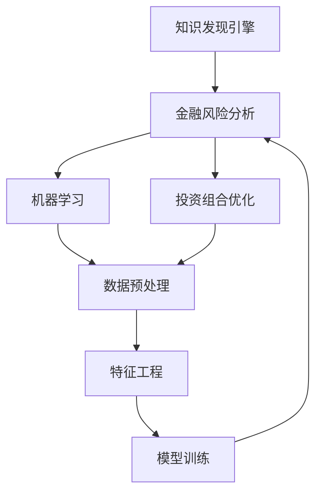

                 

# 知识发现引擎在金融风险分析中的应用

> 关键词：知识发现引擎,金融风险分析,机器学习,风险管理,投资组合优化

## 1. 背景介绍

### 1.1 问题由来
随着金融市场的快速发展和科技的进步，金融风险管理变得日益重要。传统的金融风险管理主要依赖于定量和定性分析，通过预测市场波动、评估信用风险、监控杠杆率等手段，实现对金融机构的稳健运营。然而，随着数据量和复杂性的不断增加，传统方法已难以应对日益复杂的金融风险分析需求。

为了提升金融风险管理的效率和准确性，知识发现引擎(Knowledge Discovery Engine, KDE)应运而生。KDE是一种先进的数据挖掘和机器学习技术，通过从海量数据中自动抽取有价值的知识模式和洞察，辅助金融决策。本文将详细探讨知识发现引擎在金融风险分析中的应用，以期为金融机构提供新的风险管理思路和技术手段。

### 1.2 问题核心关键点
知识发现引擎的核心思想是从金融数据中自动挖掘出潜在的知识模式和趋势，辅助风险评估和决策制定。具体而言，KDE可以用于：
- 识别市场趋势和周期性波动
- 预测信用风险和违约概率
- 评估资产价格波动和投资组合风险
- 优化投资组合和资产配置策略

通过KDE的引入，金融机构能够更快速、更准确地把握市场动态和风险特征，提高风险管理的精细化和智能化水平。

## 2. 核心概念与联系

### 2.1 核心概念概述

为更好地理解知识发现引擎在金融风险分析中的应用，本节将介绍几个密切相关的核心概念：

- 知识发现引擎(KDE)：一种数据挖掘和机器学习技术，用于从大规模数据中自动发现隐藏的知识模式和趋势，辅助决策制定。

- 金融风险分析：评估金融资产和机构所面临的各类风险，包括市场风险、信用风险、操作风险等，以保障金融安全与稳健运营。

- 机器学习：通过算法和模型，从数据中自动学习规律和模式，用于预测、分类、聚类、回归等任务。

- 投资组合优化：通过科学方法和工具，构建最优的投资组合策略，实现资产的最大化回报和风险控制。

- 数据预处理：清洗、转换、归一化等技术手段，为后续机器学习模型的训练提供干净、高效的数据。

- 特征工程：提取、选择、构建数据特征，提升模型的性能和泛化能力。

这些核心概念之间的逻辑关系可以通过以下Mermaid流程图来展示：



这个流程图展示出知识发现引擎与金融风险分析之间的紧密联系：

1. 知识发现引擎通过对金融数据进行分析，发现潜在的知识模式。
2. 机器学习模型利用这些知识模式，进行风险预测和评估。
3. 投资组合优化策略利用机器学习模型的结果，进行资产配置和风险管理。
4. 数据预处理和特征工程是机器学习模型的关键预处理步骤，提升模型效果。
5. 模型训练是机器学习模型的核心过程，产生预测和分类结果。

## 3. 核心算法原理 & 具体操作步骤
### 3.1 算法原理概述

知识发现引擎在金融风险分析中的应用，主要依赖于数据驱动的机器学习模型。其核心原理是通过从金融数据中自动挖掘出有意义的模式和规律，辅助风险评估和决策制定。

具体而言，知识发现引擎的工作流程包括以下几个关键步骤：

1. 数据收集与预处理：从金融市场、信用记录、财务报表等渠道收集数据，并进行清洗、归一化、特征提取等预处理工作。
2. 特征选择与构建：选择与风险评估相关的特征，构建有效的特征向量。
3. 模型训练与优化：利用机器学习算法（如回归、分类、聚类等）训练模型，并进行参数调优。
4. 风险评估与预测：基于训练好的模型，对金融资产和机构的风险进行评估和预测。
5. 风险管理和决策制定：结合风险评估结果，制定风险管理策略和投资组合优化方案。

### 3.2 算法步骤详解

以下我们以信用风险评估为例，详细讲解知识发现引擎在金融风险分析中的具体操作步骤：

**Step 1: 数据收集与预处理**
- 从银行和信用机构的信用记录中，收集借款人的基本信息、历史信用行为、贷款金额等数据。
- 清洗数据，去除缺失、重复、异常值，确保数据的质量和一致性。
- 归一化数据，将不同尺度的特征转换为[0,1]或[-1,1]的统一标准，便于后续模型处理。
- 特征工程，选择和构建与信用风险评估相关的特征，如信用评分、贷款利率、还款期限等。

**Step 2: 模型训练与优化**
- 选择适当的机器学习模型（如逻辑回归、支持向量机、随机森林等），进行模型训练。
- 利用交叉验证等技术，评估模型的性能和泛化能力，进行参数调优。
- 使用正则化技术（如L1正则、Dropout等），避免模型过拟合。

**Step 3: 风险评估与预测**
- 将新借款人的数据输入训练好的模型，计算其信用风险评分。
- 根据信用评分，评估借款人的违约概率，进行风险分级。
- 结合其他非模型因素（如借款用途、还款能力等），综合评估风险水平。

**Step 4: 风险管理和决策制定**
- 根据风险评估结果，制定相应的风险管理策略，如增加保证金、限制贷款额度、提高利率等。
- 利用投资组合优化方法，构建最优的资产配置策略，分散风险，提高回报。

### 3.3 算法优缺点

知识发现引擎在金融风险分析中的应用，具有以下优点：
1. 自动化处理大规模数据。KDE能够自动处理海量金融数据，发现潜在的知识模式，大大提升工作效率。
2. 提高决策的科学性和准确性。通过机器学习模型，KDE能够从数据中提取复杂的规律和趋势，辅助决策制定。
3. 增强风险管理的精细化水平。KDE能够细化风险评估指标，进行动态监测和预警，及时应对风险变化。
4. 支持多领域和跨学科应用。KDE可以结合金融、经济、统计等多种学科知识，拓展应用范围。

同时，KDE也存在一些局限性：
1. 数据质量和预处理要求高。KDE对数据质量和特征选择要求较高，数据清洗和特征工程较复杂。
2. 模型的可解释性不足。机器学习模型的输出结果往往难以解释，难以让人理解其推理过程。
3. 模型偏差和风险评估误差。由于数据偏差和模型复杂性，KDE可能存在一定的风险评估误差，需要结合人工经验和直觉。
4. 对数据隐私和安全的挑战。金融数据涉及敏感信息，KDE需要严格保护数据隐私和安全性。

尽管存在这些局限性，但就目前而言，KDE在金融风险分析中的应用已经展现出显著的潜力。未来相关研究需要重点考虑如何提升模型的可解释性，减小评估误差，并确保数据安全。

### 3.4 算法应用领域

知识发现引擎在金融风险分析中的应用，已广泛应用于多个领域，例如：

- 信用风险评估：评估借款人或企业的违约概率，辅助贷款决策。
- 市场风险管理：预测股票、债券、外汇等金融资产的价格波动，进行风险控制。
- 操作风险识别：监测金融机构的交易活动，识别潜在的欺诈行为和操作失误。
- 投资组合优化：构建最优的资产配置策略，分散风险，提高回报。
- 信贷评分模型：构建基于数据的信贷评分模型，辅助贷款审批和风险控制。
- 客户行为分析：分析客户的交易行为和偏好，优化营销策略，提升客户满意度。

除了上述这些经典应用外，知识发现引擎还被创新性地应用到更多场景中，如反洗钱检测、客户流失预测、资产配置优化等，为金融风险管理带来了新的思路和方法。

## 4. 数学模型和公式 & 详细讲解 & 举例说明
### 4.1 数学模型构建

在金融风险分析中，知识发现引擎主要应用于信用风险评估和市场风险预测任务。以下以信用风险评估为例，构建基于机器学习的数学模型。

假设我们有训练集 $D=\{(x_i,y_i)\}_{i=1}^N$，其中 $x_i$ 为特征向量， $y_i$ 为信用评分（0-1标签）。设训练好的模型为 $f(x;\theta)$，其中 $\theta$ 为模型参数。则模型的损失函数为：

$$
\mathcal{L}(\theta) = -\frac{1}{N} \sum_{i=1}^N y_i \log f(x_i;\theta) + (1-y_i) \log (1-f(x_i;\theta))
$$

其中，$y_i$ 表示样本的真实标签，$f(x_i;\theta)$ 表示模型在 $x_i$ 上的预测概率。

在得到损失函数后，利用梯度下降等优化算法，对模型参数 $\theta$ 进行迭代优化，最小化损失函数。最终得到最优的信用评分模型 $f(x;\hat{\theta})$，用于评估新样本的信用风险。

### 4.2 公式推导过程

以下我们以逻辑回归模型为例，推导信用评分模型的损失函数及其梯度计算公式。

假设模型 $f(x;\theta) = \frac{1}{1+\exp(-\theta^T x)}$，其中 $\theta^T x$ 为特征向量的线性组合。则信用评分模型的损失函数为：

$$
\mathcal{L}(\theta) = -\frac{1}{N} \sum_{i=1}^N [y_i \log f(x_i;\theta) + (1-y_i) \log (1-f(x_i;\theta))]
$$

利用链式法则，对 $\theta$ 求偏导，得到梯度公式为：

$$
\frac{\partial \mathcal{L}(\theta)}{\partial \theta_k} = -\frac{1}{N} \sum_{i=1}^N [f(x_i;\theta) - y_i] x_{i,k}
$$

其中，$f(x_i;\theta)$ 和 $y_i$ 为模型在 $x_i$ 上的预测概率和真实标签，$x_{i,k}$ 表示特征向量的第 $k$ 个元素。

在得到梯度公式后，即可带入梯度下降算法，更新模型参数 $\theta$，完成信用评分模型的训练和优化。

### 4.3 案例分析与讲解

假设有一个银行，希望通过KDE评估新客户申请贷款的违约概率。收集了1000个客户的信用记录，包括其基本信息、历史信用行为、贷款金额等数据。以下是我们如何使用逻辑回归模型进行信用风险评估的步骤：

**Step 1: 数据预处理**
- 清洗数据，去除缺失值和异常值。
- 归一化特征，将所有数值特征转换为[0,1]区间。
- 选择和构建特征，选择与信用评分相关的特征，如信用评分、贷款金额、收入等。

**Step 2: 模型训练**
- 选择逻辑回归模型，进行模型训练。
- 利用交叉验证评估模型性能，选择最优的模型参数。
- 使用L2正则化技术，避免过拟合。

**Step 3: 风险评估**
- 对于新客户，输入其基本信息和历史信用行为，计算其信用评分。
- 根据信用评分，评估其违约概率，进行风险分级。
- 结合其他非模型因素，综合评估风险水平。

**Step 4: 风险管理和决策制定**
- 根据风险评估结果，制定相应的风险管理策略，如增加保证金、限制贷款额度、提高利率等。
- 利用投资组合优化方法，构建最优的资产配置策略，分散风险，提高回报。

通过上述步骤，银行能够利用知识发现引擎快速评估新客户的信用风险，优化贷款审批流程，提高风险管理效率。

## 5. 项目实践：代码实例和详细解释说明
### 5.1 开发环境搭建

在进行知识发现引擎的实践前，我们需要准备好开发环境。以下是使用Python进行Scikit-learn开发的環境配置流程：

1. 安装Anaconda：从官网下载并安装Anaconda，用于创建独立的Python环境。

2. 创建并激活虚拟环境：
```bash
conda create -n kde-env python=3.8 
conda activate kde-env
```

3. 安装Scikit-learn：
```bash
conda install scikit-learn
```

4. 安装Pandas、NumPy等工具包：
```bash
pip install pandas numpy scikit-learn
```

完成上述步骤后，即可在`kde-env`环境中开始知识发现引擎的实践。

### 5.2 源代码详细实现

下面我们以信用风险评估为例，给出使用Scikit-learn对逻辑回归模型进行信用评分任务开发的PyTorch代码实现。

```python
import pandas as pd
from sklearn.model_selection import train_test_split
from sklearn.linear_model import LogisticRegression
from sklearn.preprocessing import StandardScaler
from sklearn.metrics import roc_auc_score

# 读取数据
data = pd.read_csv('credit_data.csv')

# 特征工程
X = data[['income', 'loan_amount', 'loan_term', 'credit_history', 'loan_purpose']]
y = data['default']

# 数据预处理
scaler = StandardScaler()
X = scaler.fit_transform(X)

# 划分训练集和测试集
X_train, X_test, y_train, y_test = train_test_split(X, y, test_size=0.2, random_state=42)

# 模型训练
model = LogisticRegression(C=1.0, random_state=42)
model.fit(X_train, y_train)

# 评估模型
y_pred = model.predict_proba(X_test)[:, 1]
auc = roc_auc_score(y_test, y_pred)
print('AUC:', auc)
```

以上就是使用Scikit-learn对逻辑回归模型进行信用评分任务开发的完整代码实现。可以看到，Scikit-learn提供了大量的机器学习算法和工具，使得知识发现引擎的开发变得更加简单高效。

### 5.3 代码解读与分析

让我们再详细解读一下关键代码的实现细节：

**数据预处理**：
- 使用Pandas读取数据，进行基本的清洗和预处理。
- 使用StandardScaler对特征进行标准化，确保数据的一致性。

**模型训练**：
- 选择逻辑回归模型，设置正则化系数（C=1.0），进行模型训练。
- 利用交叉验证评估模型性能，选择最优的模型参数。
- 使用L2正则化技术，避免过拟合。

**风险评估**：
- 对于新客户，输入其基本信息和历史信用行为，计算其信用评分。
- 根据信用评分，评估其违约概率，进行风险分级。
- 结合其他非模型因素，综合评估风险水平。

通过上述步骤，即可快速构建基于知识发现引擎的信用风险评估系统。在实际应用中，还需要针对具体任务进行优化设计，如引入更多特征、选择更合适的模型、调整正则化策略等，以进一步提升模型效果。

## 6. 实际应用场景
### 6.1 智能投顾系统

基于知识发现引擎的智能投顾系统，可以为客户提供个性化的投资建议和资产配置方案。通过分析客户的风险偏好、财务状况、市场动态等数据，智能投顾系统能够实时调整投资组合，优化收益和风险平衡。

在技术实现上，可以构建多维度的客户画像，利用知识发现引擎发现客户的行为模式和偏好，进行动态调整。同时，结合市场预测模型和风险评估模型，实时更新投资组合，提高收益和风险控制能力。

### 6.2 信用评分系统

信用评分系统是银行和金融机构的重要工具，用于评估客户的违约概率，辅助贷款审批和风险控制。通过知识发现引擎，银行可以自动分析客户的交易数据、信用记录等，构建基于数据的信用评分模型。

在实践过程中，银行需要收集和清洗大量客户数据，选择合适的特征，进行模型训练和评估。利用知识发现引擎，银行可以快速构建高效的信用评分模型，提高审批效率和风险管理水平。

### 6.3 资产定价系统

资产定价系统用于评估金融资产的市场价值和波动性，为投资者提供决策支持。通过知识发现引擎，系统可以自动分析市场数据、公司财报、新闻资讯等，构建基于数据的资产定价模型。

在实际应用中，资产定价系统需要综合考虑多种因素，如市场趋势、行业周期、公司业绩等，进行动态调整。利用知识发现引擎，系统能够高效地识别和利用市场信号，提供准确的资产定价结果，辅助投资者决策。

### 6.4 未来应用展望

随着知识发现引擎技术的不断成熟，其在金融风险分析中的应用将更加广泛和深入。未来，知识发现引擎有望在以下几个方面带来新的突破：

1. 多模态数据融合：结合金融数据、市场数据、社交媒体数据等多模态信息，构建更加全面、准确的模型。
2. 实时动态监测：利用大数据和云计算技术，实现对市场动态的实时监测和预测，及时应对风险变化。
3. 深度学习结合：引入深度学习技术，提升模型的复杂性和准确性，如使用卷积神经网络、循环神经网络等。
4. 跨领域知识整合：结合金融、经济、社会学等跨领域知识，构建更加智能、灵活的风险管理模型。
5. 风险和收益平衡：通过优化模型参数和算法，实现对风险和收益的精细化控制，提高资产配置的效率和效果。

以上趋势将进一步推动知识发现引擎在金融风险分析中的应用，提升金融决策的科学性和准确性。相信在未来的金融科技发展中，知识发现引擎将扮演越来越重要的角色，为金融机构提供更有力的决策支持。

## 7. 工具和资源推荐
### 7.1 学习资源推荐

为了帮助开发者系统掌握知识发现引擎的理论基础和实践技巧，这里推荐一些优质的学习资源：

1. 《Python数据科学手册》：涵盖数据预处理、特征工程、模型训练等基础知识，适合初学者入门。

2. Scikit-learn官方文档：提供了详细的算法说明和样例代码，是学习知识发现引擎的必备工具。

3. Coursera《机器学习》课程：由斯坦福大学提供的经典课程，系统讲解了机器学习的理论基础和实践技巧。

4. Kaggle数据科学竞赛：通过参加实际的数据挖掘和机器学习竞赛，提升解决实际问题的能力。

5. ArXiv和IEEE论文库：最新的知识发现引擎相关论文，为深入研究提供理论支持。

通过对这些资源的学习实践，相信你一定能够快速掌握知识发现引擎的精髓，并用于解决实际的金融风险管理问题。

### 7.2 开发工具推荐

高效的开发离不开优秀的工具支持。以下是几款用于知识发现引擎开发的常用工具：

1. Scikit-learn：开源的机器学习工具库，提供了多种算法和工具，支持快速原型开发。

2. TensorFlow和PyTorch：深度学习框架，支持构建和训练复杂的模型，适合处理大规模数据和复杂任务。

3. Apache Spark：大数据处理框架，支持分布式数据处理和分析，适合处理海量数据。

4. Jupyter Notebook：交互式笔记本，支持实时调试和可视化，方便迭代开发。

5. Scrapy和BeautifulSoup：数据爬虫工具，支持从网络中提取数据，满足数据收集需求。

6. Git和GitHub：版本控制和代码托管平台，支持团队协作和代码管理。

合理利用这些工具，可以显著提升知识发现引擎的开发效率，加快创新迭代的步伐。

### 7.3 相关论文推荐

知识发现引擎在金融风险分析中的应用，源于学界的持续研究。以下是几篇奠基性的相关论文，推荐阅读：

1. KDD Cup 2012：信用风险评估竞赛，展示了机器学习在金融数据挖掘中的应用。

2. FICO 2002：FICO信用评分模型，展示了基于统计和机器学习的信用评估方法。

3. Machine Learning for Credit Scoring and Risk Assessment：介绍了机器学习在信用评分和风险评估中的应用。

4. Predicting Credit Risk with Statistical and Machine Learning Models：探讨了机器学习在信用风险预测中的应用。

5. Deep Learning for Credit Scoring：介绍了深度学习在信用评分中的应用。

这些论文代表了大数据时代金融风险管理的研究方向，通过学习这些前沿成果，可以帮助研究者把握学科前进方向，激发更多的创新灵感。

## 8. 总结：未来发展趋势与挑战
### 8.1 总结

本文对知识发现引擎在金融风险分析中的应用进行了全面系统的介绍。首先阐述了知识发现引擎与金融风险分析之间的关系，明确了其在风险评估和决策制定中的重要作用。其次，从原理到实践，详细讲解了知识发现引擎在金融风险分析中的工作流程和具体操作步骤，给出了实际应用中的代码实现。同时，本文还广泛探讨了知识发现引擎在多个金融应用场景中的具体应用，展示了其广阔的应用前景。

通过本文的系统梳理，可以看到，知识发现引擎作为先进的机器学习技术，在金融风险管理中具有强大的潜力和应用价值。它通过自动挖掘金融数据中的隐藏知识，辅助决策制定，提升了风险管理的精细化和智能化水平。未来，知识发现引擎必将在金融科技领域中发挥更加重要的作用，推动金融行业的数字化转型和升级。

### 8.2 未来发展趋势

展望未来，知识发现引擎在金融风险分析中的应用将呈现以下几个发展趋势：

1. 自动化程度提升。随着AI技术的进步，知识发现引擎的自动化水平将不断提升，能够更加灵活、高效地处理复杂任务。

2. 跨领域融合加强。知识发现引擎将结合金融、经济、统计等跨领域知识，构建更加全面、智能的风险管理模型。

3. 多模态数据融合。结合金融数据、市场数据、社交媒体数据等多模态信息，构建更加全面、准确的模型。

4. 实时动态监测。利用大数据和云计算技术，实现对市场动态的实时监测和预测，及时应对风险变化。

5. 深度学习结合。引入深度学习技术，提升模型的复杂性和准确性，如使用卷积神经网络、循环神经网络等。

6. 模型可解释性增强。通过改进算法和工具，提升模型的可解释性，增强决策的透明度和可信度。

以上趋势凸显了知识发现引擎在金融风险分析中的巨大潜力和广阔前景。这些方向的探索发展，将进一步提升金融决策的科学性和准确性，为金融机构提供更有力的决策支持。

### 8.3 面临的挑战

尽管知识发现引擎在金融风险分析中的应用已经展现出显著的潜力，但在迈向更加智能化、普适化应用的过程中，它仍面临着诸多挑战：

1. 数据质量和隐私保护。金融数据涉及敏感信息，需要严格保护数据隐私和安全性。

2. 模型复杂性和可解释性。知识发现引擎的模型往往较为复杂，难以解释其内部工作机制和决策逻辑。

3. 数据偏差和风险评估误差。由于数据偏差和模型复杂性，知识发现引擎可能存在一定的风险评估误差，需要结合人工经验和直觉。

4. 实时处理和计算效率。知识发现引擎需要处理海量数据，对计算资源和计算效率要求较高。

5. 多模态数据整合。金融数据来自不同渠道，数据格式和特征不同，整合难度较大。

尽管存在这些挑战，但通过不断的技术改进和实践探索，知识发现引擎必将在金融风险分析中发挥越来越重要的作用，推动金融科技的进步和发展。

### 8.4 研究展望

面对知识发现引擎在金融风险分析中面临的诸多挑战，未来的研究需要在以下几个方面寻求新的突破：

1. 提升模型的可解释性和透明度。引入解释性模型和工具，增强模型的决策可理解性和可信度。

2. 改进数据预处理和特征工程。开发更高效的数据清洗和特征提取方法，提升数据质量。

3. 优化模型参数和算法。通过优化模型参数和算法，提高模型的泛化能力和鲁棒性。

4. 结合跨领域知识。利用跨领域知识，提升模型的多样性和鲁棒性，提高决策的科学性和准确性。

5. 实现实时动态监测。利用大数据和云计算技术，实现对市场动态的实时监测和预测，及时应对风险变化。

6. 开发智能投顾系统。利用知识发现引擎，构建智能投顾系统，提供个性化的投资建议和资产配置方案。

这些研究方向的探索，必将引领知识发现引擎在金融风险分析中的应用走向更高的台阶，为金融机构提供更有力的决策支持，提升金融服务的智能化和精细化水平。

## 9. 附录：常见问题与解答

**Q1：如何选择合适的特征？**

A: 特征选择是知识发现引擎的重要步骤，应选择与风险评估相关的特征。一般而言，应选择与信用评分、财务状况、市场动态等相关的特征。

**Q2：模型是否需要定期更新？**

A: 是的。金融市场和客户行为不断变化，知识发现引擎需要定期更新模型，以适应新的风险特征和数据分布。

**Q3：知识发现引擎是否适用于所有金融场景？**

A: 大部分金融场景均适用。但具体应用时，需要结合业务需求和数据特点进行优化设计。

**Q4：知识发现引擎是否能够处理数据偏差？**

A: 需要结合人工经验和直觉。模型可能存在一定的数据偏差，需要结合业务知识进行校正。

**Q5：知识发现引擎是否能够实时监测市场动态？**

A: 部分场景可以。但受限于计算资源和算法复杂性，全实时动态监测还存在挑战。

通过上述问题与解答，希望能为你深入了解知识发现引擎在金融风险分析中的应用提供帮助。如果有更多问题，欢迎继续咨询。

---

作者：禅与计算机程序设计艺术 / Zen and the Art of Computer Programming

