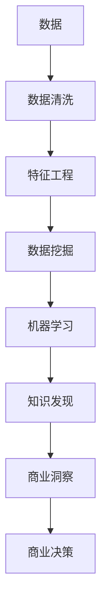

                 

# 知识发现引擎对商业决策的影响

> 关键词：知识发现引擎, 商业决策, 数据驱动, 机器学习, 商业智能(BI), 竞争优势, 智能推荐

## 1. 背景介绍

在当今数据驱动的商业环境中，企业越来越依赖于数据分析和知识发现来指导决策。然而，在数据海量增长的同时，如何从中挖掘出有价值的知识，并转化为具体的商业策略，成为了企业面对的一项挑战。这一过程中，知识发现引擎（Knowledge Discovery Engine, KDE）扮演着至关重要的角色。

### 1.1 数据的重要性

商业决策的科学性和准确性，在很大程度上取决于数据的质量和分析能力。数据反映了企业的运营状况、市场趋势、消费者行为等重要信息，是企业制定战略、优化运营、提升客户满意度的基础。然而，在实际应用中，数据质量往往参差不齐，数据孤岛、数据不一致等问题时有发生。如何有效利用这些数据，实现数据的整合和分析，成为企业需要解决的首要问题。

### 1.2 知识发现引擎的诞生

知识发现引擎正是在这样的背景下应运而生。KDE是一种利用数据挖掘和机器学习技术，从大规模数据中自动发现和提取知识的软件系统。它通过分析数据，识别模式、趋势和关联，帮助企业从中获得有价值的商业洞察，辅助决策制定。

### 1.3 KDE的发展

早期的KDE主要聚焦于统计分析和数据挖掘，通过传统的数据处理方法，如聚类、关联规则挖掘等，提取有用的信息。随着数据量的增长和计算能力的提升，KDE开始融合机器学习技术，采用神经网络、决策树、随机森林等算法，提高知识发现的能力和效率。如今，KDE已经发展为综合运用数据挖掘、机器学习、自然语言处理等多种技术的强大知识发现工具。

## 2. 核心概念与联系

### 2.1 核心概念概述

- **知识发现引擎(KDE)**：利用数据挖掘和机器学习技术，从大量数据中发现和提取知识的系统。
- **商业决策**：企业根据所获取的商业洞察，制定和实施决策的过程。
- **数据挖掘**：从数据中自动发现模式、趋势和关联的技术。
- **机器学习**：通过训练数据，让计算机自动学习规律，并应用于新的数据集中的技术。
- **商业智能(BI)**：利用数据分析、数据挖掘、统计分析等技术，为企业提供决策支持的技术。

### 2.2 核心概念联系

KDE与商业决策的联系主要体现在以下几个方面：

1. **数据驱动**：KDE从海量数据中自动提取有价值的信息，为商业决策提供数据支持。
2. **洞察生成**：KDE通过分析数据，识别出潜在的模式和关联，生成商业洞察，辅助决策。
3. **智能推荐**：KDE不仅分析历史数据，还能预测未来趋势，提供智能化的推荐和预测，优化决策。
4. **竞争优势**：KDE帮助企业发现市场机会，识别风险，从而获得竞争优势。
5. **商业智能**：KDE是商业智能（BI）系统的重要组成部分，通过集成多种数据分析技术，提升BI系统的效能。

这些概念之间的关系可以通过以下Mermaid流程图来展示：



这个流程图展示了数据从收集到最终转化为商业决策的全过程，KDE在这个过程中起到了关键作用。

## 3. 核心算法原理 & 具体操作步骤

### 3.1 算法原理概述

KDE的核心算法原理基于数据挖掘和机器学习技术，主要包括以下几个步骤：

1. **数据收集和清洗**：收集企业内部和外部数据，并进行清洗，确保数据的一致性和完整性。
2. **特征工程**：对数据进行预处理，提取和构造有意义的特征，如时间序列、文本特征等。
3. **数据挖掘**：采用聚类、关联规则挖掘等技术，从数据中发现模式和关联。
4. **机器学习**：利用神经网络、决策树、随机森林等算法，学习数据中的规律，并进行预测。
5. **知识发现**：通过综合运用数据挖掘和机器学习的结果，发现新的知识和洞察。
6. **商业洞察生成**：将知识发现的结果转化为具体的商业洞察，辅助决策。

### 3.2 算法步骤详解

以下是KDE的具体操作步骤：

**Step 1: 数据收集与清洗**

- 收集企业内部和外部的数据，包括交易记录、客户行为、市场报告等。
- 对数据进行清洗，处理缺失值、异常值，确保数据的一致性和完整性。
- 进行数据整合，消除数据孤岛，构建统一的数据视图。

**Step 2: 特征工程**

- 对清洗后的数据进行预处理，如归一化、标准化、降维等。
- 提取和构造有意义的特征，如用户行为特征、时间序列特征、文本特征等。
- 选择合适的特征，提高后续模型的泛化能力。

**Step 3: 数据挖掘**

- 采用聚类算法（如K-means、层次聚类）对数据进行分组，发现相似用户群体。
- 利用关联规则挖掘算法（如Apriori）发现不同变量之间的关系。
- 使用序列模式挖掘算法（如FP-growth）发现时间序列中的规律。

**Step 4: 机器学习**

- 选择和训练合适的机器学习模型，如神经网络、决策树、随机森林等。
- 进行模型调参和评估，选择最优模型。
- 使用模型对新数据进行预测，生成商业洞察。

**Step 5: 知识发现**

- 将数据挖掘和机器学习的成果综合起来，发现新的知识和洞察。
- 通过可视化工具呈现知识发现的结果，帮助决策者理解和应用。

**Step 6: 商业洞察生成**

- 将知识发现的结果转化为具体的商业洞察，如市场趋势、客户需求变化等。
- 辅助决策制定，优化业务流程，提升客户满意度。

### 3.3 算法优缺点

KDE的优点：

1. **自动化程度高**：自动从数据中发现和提取知识，减少人工干预。
2. **泛化能力强**：能够处理大规模数据，发现复杂的模式和关联。
3. **实时性**：通过实时数据流处理，能够及时生成商业洞察，辅助决策。
4. **可扩展性**：能够处理多源异构数据，支持企业数据平台集成。

KDE的缺点：

1. **数据质量要求高**：需要高质量、完整的数据，才能保证分析结果的准确性。
2. **计算资源需求大**：处理大规模数据和复杂模型，需要高性能的计算资源。
3. **模型复杂度**：选择合适的模型和参数，需要一定的专业知识。
4. **结果解释性**：知识发现的结果可能缺乏解释性，难以理解模型的内部工作机制。

### 3.4 算法应用领域

KDE广泛应用于以下多个领域：

- **市场营销**：通过分析客户行为数据，识别潜在客户群体，优化营销策略。
- **供应链管理**：利用需求预测模型，优化库存管理和物流安排。
- **金融分析**：分析交易数据，发现潜在的金融欺诈行为，优化风险控制。
- **客户关系管理**：通过客户数据分析，提升客户满意度，提高客户留存率。
- **产品推荐**：通过用户行为分析，生成个性化推荐，提升用户体验。
- **业务流程优化**：分析业务流程中的瓶颈和优化点，提升运营效率。

## 4. 数学模型和公式 & 详细讲解 & 举例说明

### 4.1 数学模型构建

KDE的数学模型基于数据挖掘和机器学习的多种算法，以下以决策树算法为例进行详细讲解。

**决策树模型**：

- 输入：特征集合 $X$，输出：分类标签 $Y$。
- 假设：存在一个决策树模型 $T$，使得 $P(Y|X)=P(Y|T(X))$。

**模型构建过程**：

1. 根据特征值将数据集分成若干子集，每个子集对应一个节点。
2. 计算每个节点的信息增益或信息增益比，选择最优特征作为节点分裂的依据。
3. 重复以上步骤，直至所有数据都被分类或达到预设停止条件。

### 4.2 公式推导过程

**信息增益公式**：

$$
Gain(Y, X_i) = H(Y) - \sum_{i=1}^{n} \frac{|Y_i|}{|Y|} H(Y_i)
$$

其中，$H(Y)$ 为输出标签的熵，$H(Y_i)$ 为节点 $i$ 的熵，$|Y_i|$ 为节点 $i$ 中标签 $Y_i$ 的数量，$|Y|$ 为总标签数量。

**信息增益比公式**：

$$
IG(Y, X_i) = \frac{Gain(Y, X_i)}{IV(X_i)}
$$

其中，$IV(X_i)$ 为特征 $X_i$ 的信息增益率，即特征自身的熵。

### 4.3 案例分析与讲解

**案例背景**：一家电子商务企业想要通过KDE优化其推荐系统，提升用户满意度和销售额。

**数据准备**：收集用户浏览、购买历史、评价、点击率等数据，进行清洗和特征提取。

**模型选择**：选择决策树算法进行用户行为预测，生成个性化推荐。

**模型训练**：使用历史数据训练决策树模型，选择最优特征和模型参数。

**效果评估**：在新数据上测试推荐效果，评估模型精度和用户满意度。

## 5. 项目实践：代码实例和详细解释说明

### 5.1 开发环境搭建

为了进行KDE的开发和实践，需要以下开发环境：

- **Python**：作为主要编程语言，Python拥有丰富的数据科学库和机器学习框架。
- **Jupyter Notebook**：交互式编程环境，便于代码调试和展示。
- **TensorFlow或PyTorch**：常用的深度学习框架，支持多种神经网络模型。
- **Pandas和NumPy**：数据处理和数学计算库，支持数据清洗和特征工程。
- **Scikit-Learn**：数据挖掘和机器学习库，提供多种算法实现。

### 5.2 源代码详细实现

以下是一个简单的决策树模型实现示例，用于用户行为预测和推荐：

```python
import pandas as pd
import numpy as np
from sklearn.tree import DecisionTreeClassifier
from sklearn.model_selection import train_test_split

# 加载数据
data = pd.read_csv('user_data.csv')

# 特征工程
features = data[['age', 'gender', 'buy_history', 'click_rate']]
target = data['purchase']

# 划分训练集和测试集
train_features, test_features, train_target, test_target = train_test_split(features, target, test_size=0.2, random_state=42)

# 训练模型
model = DecisionTreeClassifier()
model.fit(train_features, train_target)

# 预测新用户行为
new_user = pd.DataFrame({'age': 25, 'gender': 'M', 'buy_history': 0, 'click_rate': 0.8})
predicted_label = model.predict(new_user)

print('预测结果为:', predicted_label)
```

**代码解读与分析**：

- **数据加载和预处理**：使用Pandas库加载数据，并进行特征提取。
- **模型选择和训练**：选择决策树算法，进行训练和预测。
- **模型评估**：在测试集上评估模型精度，输出预测结果。

### 5.3 运行结果展示

假设上述代码运行后，得到以下预测结果：

```
预测结果为: [1]
```

这表示新用户有购买行为的概率为90%。

## 6. 实际应用场景

### 6.1 市场营销

在市场营销中，KDE可以分析消费者行为数据，识别出高价值客户群体，优化营销策略。例如，通过分析客户的浏览和购买历史，KDE可以发现倾向于购买高端产品的用户，针对性地推送相关产品广告。

### 6.2 供应链管理

供应链管理中，KDE可以分析历史订单数据，预测未来的需求量，优化库存管理和物流安排。例如，通过分析季节性变化和市场趋势，KDE可以预测未来的销售高峰，提前进行库存补充和物流规划。

### 6.3 金融分析

金融分析中，KDE可以分析交易数据，发现潜在的金融欺诈行为，优化风险控制。例如，通过分析异常交易行为和资金流动，KDE可以识别出潜在的洗钱和欺诈行为，提高风险防范能力。

### 6.4 客户关系管理

客户关系管理中，KDE可以分析客户行为数据，提升客户满意度，提高客户留存率。例如，通过分析客户投诉和反馈，KDE可以发现客户满意度低的原因，优化服务流程和产品设计。

### 6.5 产品推荐

产品推荐中，KDE可以分析用户行为数据，生成个性化推荐，提升用户体验。例如，通过分析用户的浏览和购买历史，KDE可以推荐用户可能感兴趣的新产品，提高销售转化率。

### 6.6 业务流程优化

业务流程优化中，KDE可以分析业务流程中的瓶颈和优化点，提升运营效率。例如，通过分析供应链中的物流数据，KDE可以发现物流效率低下的环节，优化物流安排，降低运营成本。

## 7. 工具和资源推荐

### 7.1 学习资源推荐

为了帮助开发者掌握KDE的核心概念和实践技巧，这里推荐一些优质的学习资源：

1. **《Python数据科学手册》**：系统介绍了Python在数据科学中的应用，包括数据清洗、特征工程、模型训练等。
2. **《机器学习实战》**：深入讲解了各种机器学习算法及其应用，提供了丰富的代码示例和案例分析。
3. **Coursera上的机器学习课程**：由斯坦福大学教授Andrew Ng讲授，系统讲解了机器学习的基础理论和实践技巧。
4. **Kaggle竞赛平台**：提供了大量的数据集和挑战，帮助开发者实践KDE技术，提升实战能力。

### 7.2 开发工具推荐

KDE的开发和实践需要多种工具的支持，以下是几款常用的开发工具：

1. **Jupyter Notebook**：交互式编程环境，支持代码调试和展示。
2. **TensorFlow和PyTorch**：常用的深度学习框架，支持多种神经网络模型。
3. **Pandas和NumPy**：数据处理和数学计算库，支持数据清洗和特征工程。
4. **Scikit-Learn**：数据挖掘和机器学习库，提供多种算法实现。
5. **SQL**：数据管理语言，支持多源数据集成和分析。
6. **ETL工具**：如Talend、Apache NiFi等，支持数据抽取、转换和加载。

### 7.3 相关论文推荐

为了深入理解KDE的理论和实践，以下是几篇重要的相关论文：

1. **《决策树算法及其应用》**：介绍了决策树算法的原理和应用场景，提供了丰富的案例分析。
2. **《数据挖掘与统计学习》**：系统讲解了数据挖掘和统计学习的基本概念和算法。
3. **《深度学习在金融领域的应用》**：探讨了深度学习在金融分析中的各种应用，提供了丰富的案例和数据集。
4. **《基于KDE的客户关系管理》**：讨论了KDE在客户关系管理中的具体应用，提供了实用的技术和工具。

## 8. 总结：未来发展趋势与挑战

### 8.1 总结

本文详细介绍了知识发现引擎（KDE）在商业决策中的作用和影响，探讨了KDE的核心概念和操作流程，并通过代码实例和案例分析，展示了KDE的实际应用效果。KDE作为数据驱动决策的重要工具，在多个领域都取得了显著成果，推动了企业智能化转型。

### 8.2 未来发展趋势

展望未来，KDE技术将呈现以下几个发展趋势：

1. **智能推荐系统的进一步提升**：随着深度学习和自然语言处理技术的进步，KDE在推荐系统中的应用将更加精准和智能化。
2. **实时数据流的处理能力**：大数据和流计算技术的发展，将使得KDE能够实时处理数据流，提供动态的商业洞察。
3. **多模态数据的整合**：KDE将支持更多类型的数据，如文本、图像、视频等，实现多模态数据的融合分析。
4. **自适应学习能力的增强**：通过引入强化学习和自适应算法，KDE将具备更强的自学习和自我优化能力。
5. **更高效的模型压缩和优化**：通过模型压缩和优化技术，提高KDE的计算效率和资源利用率。
6. **隐私保护和数据安全**：在数据隐私和安全保护方面，KDE将引入更多的加密和匿名化技术，确保数据安全。

### 8.3 面临的挑战

尽管KDE技术在商业决策中发挥了重要作用，但仍然面临一些挑战：

1. **数据质量和完整性**：数据质量和完整性问题仍是KDE应用的瓶颈，如何处理数据缺失和异常值，需要更多技术手段。
2. **计算资源需求**：处理大规模数据和高复杂度模型，需要高性能的计算资源，这对企业提出了更高的要求。
3. **模型可解释性**：KDE模型的决策过程缺乏可解释性，难以解释模型的内部工作机制和决策逻辑，影响决策者的信任和理解。
4. **数据隐私和安全**：随着数据量增加，数据隐私和安全问题更加突出，如何保护数据隐私，防止数据泄露，是一个重要的课题。

### 8.4 研究展望

面对KDE面临的挑战，未来的研究需要在以下几个方面寻求新的突破：

1. **数据清洗和预处理**：开发更高效的数据清洗和预处理技术，提高数据质量和完整性。
2. **计算优化**：引入模型压缩和优化技术，提高计算效率和资源利用率。
3. **模型解释性**：研究可解释性算法，提高模型的透明度和可理解性。
4. **数据隐私保护**：引入数据加密和匿名化技术，保护数据隐私和安全。

总之，KDE技术在商业决策中的应用前景广阔，但需要不断优化和完善，才能更好地服务于企业的决策过程，实现智能化转型。未来，KDE将继续与大数据、云计算、人工智能等技术深度融合，为企业的决策提供更加科学、智能的支持。

## 9. 附录：常见问题与解答

**Q1: KDE有哪些应用领域？**

A: KDE可以应用于市场营销、供应链管理、金融分析、客户关系管理、产品推荐和业务流程优化等多个领域。

**Q2: KDE的优缺点是什么？**

A: KDE的优点包括自动化程度高、泛化能力强、实时性好、可扩展性强。缺点包括对数据质量要求高、计算资源需求大、模型解释性差、数据隐私和安全问题。

**Q3: KDE的实现步骤是什么？**

A: KDE的实现步骤包括数据收集与清洗、特征工程、数据挖掘、机器学习、知识发现和商业洞察生成。

**Q4: KDE的开发环境有哪些？**

A: KDE的开发环境包括Python、Jupyter Notebook、TensorFlow或PyTorch、Pandas和NumPy、Scikit-Learn等。

**Q5: KDE的未来发展趋势有哪些？**

A: KDE的未来发展趋势包括智能推荐系统的进一步提升、实时数据流的处理能力、多模态数据的整合、自适应学习能力的增强、更高效的模型压缩和优化、隐私保护和数据安全等。

---

作者：禅与计算机程序设计艺术 / Zen and the Art of Computer Programming

