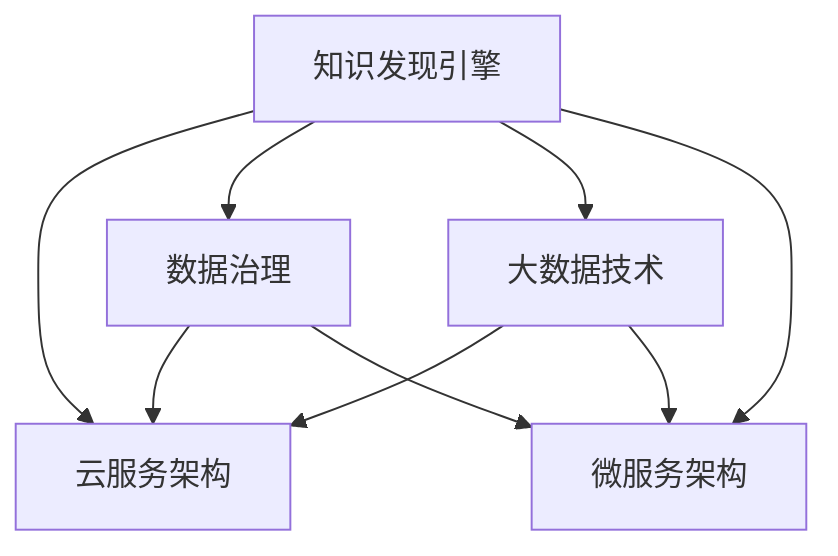

                 

# 知识发现引擎的云服务架构设计

> 关键词：知识发现引擎,云服务架构,数据治理,大数据技术,微服务架构

## 1. 背景介绍

### 1.1 问题由来
随着信息技术的高速发展，企业内部产生了海量的数据资源。如何从这些数据中提取出有价值的知识，驱动决策，提升效率，成为企业面临的重要问题。知识发现引擎（Knowledge Discovery Engine, KDE）作为数据挖掘与分析的重要工具，逐渐受到企业的重视。但传统的KDE主要运行在企业内部，存在部署成本高、数据孤岛现象严重、运维复杂等问题。

### 1.2 问题核心关键点
要解决这些问题，必须将KDE部署在云平台，从而打破数据孤岛，提升部署和运维效率。云服务架构（Cloud Service Architecture, CSA）是实现这一目标的关键，它通过将KDE服务化，支持弹性扩展、按需部署，使企业能够灵活应对不断变化的市场需求。

### 1.3 问题研究意义
利用CSA构建的知识发现引擎，可以为企业带来以下几方面的好处：

1. 降低IT投资成本。传统KDE部署成本高，而云服务架构通过按需付费，极大地降低了企业对硬件、软件和维护资源的投入。

2. 提升数据灵活性。企业可以将不同来源的数据存储在云端，实现数据共享，提升数据治理能力，促进数据流通。

3. 优化运维效率。云服务架构提供了自动化的运维管理，减少了人工干预，降低了运维成本，提升了系统的稳定性和可靠性。

4. 提升决策能力。知识发现引擎能够从大数据中提取有用的知识，驱动企业决策，提高效率。

5. 推动业务创新。云服务架构支持快速部署和灵活调整，使企业能够迅速响应市场变化，推动业务创新。

## 2. 核心概念与联系

### 2.1 核心概念概述

为更好地理解知识发现引擎的云服务架构设计，本节将介绍几个密切相关的核心概念：

- 知识发现引擎（Knowledge Discovery Engine, KDE）：一种用于分析大数据，从数据中发现规律、趋势和模式的数据挖掘工具。

- 云服务架构（Cloud Service Architecture, CSA）：一种基于云计算的架构模式，通过将服务进行微服务化，支持按需部署、弹性扩展、自动运维等特性。

- 数据治理（Data Governance）：一种数据管理策略，旨在确保数据的一致性、完整性和可用性，提升数据质量。

- 大数据技术（Big Data Technology）：指能够处理、分析海量数据的技术，包括分布式存储、计算和流处理等技术。

- 微服务架构（Microservices Architecture）：一种基于服务的架构模式，将系统拆分成多个小服务，提升系统的灵活性和可扩展性。

这些核心概念之间的逻辑关系可以通过以下Mermaid流程图来展示：



这个流程图展示的知识发现引擎的核心概念及其之间的关系：

1. 知识发现引擎通过大数据技术和数据治理，从数据中提取知识。
2. 云服务架构支持微服务化，提升知识发现引擎的部署和运维效率。
3. 微服务架构进一步细化了知识发现引擎的服务功能，提升系统的灵活性和可扩展性。
4. 数据治理通过规范数据标准，提升知识发现引擎的数据质量。

这些概念共同构成了知识发现引擎的云服务架构，使其能够更好地应对复杂多变的市场需求，推动企业业务的持续创新。

## 3. 核心算法原理 & 具体操作步骤
### 3.1 算法原理概述

知识发现引擎的云服务架构设计主要基于以下三个原理：

1. 微服务化原理：将知识发现引擎拆分成多个微服务，每个微服务负责特定的功能模块，通过API接口进行通信。

2. 弹性扩展原理：云服务架构支持按需扩展，可以根据业务需求动态调整微服务实例的数量和资源配置，以实现系统的负载均衡和资源优化。

3. 数据治理原理：通过数据治理策略，确保数据一致性、完整性和可用性，提升知识发现引擎的数据质量，从而提升知识提取的准确性和可靠性。

### 3.2 算法步骤详解

知识发现引擎的云服务架构设计主要包括以下几个关键步骤：

**Step 1: 选择合适的云服务架构平台**

选择合适的云服务架构平台是知识发现引擎云化部署的基础。常见平台如AWS、Azure、Google Cloud等，提供了丰富的云服务资源，支持大规模数据处理、存储和分析。企业需要根据自身需求选择合适的平台。

**Step 2: 设计微服务架构**

设计知识发现引擎的微服务架构，将其拆分成多个小服务，每个服务负责特定的功能模块。例如，数据采集服务、数据清洗服务、特征工程服务、模型训练服务等。服务之间通过API接口进行通信，支持异步处理和分布式计算。

**Step 3: 实现微服务部署和运维**

通过容器技术（如Docker）和容器编排工具（如Kubernetes）实现微服务的自动化部署和运维。容器化技术使得微服务能够快速部署和弹性扩展，提高了系统的稳定性和可靠性。

**Step 4: 实施数据治理**

通过数据治理策略，确保数据的一致性、完整性和可用性。常见数据治理策略包括数据清洗、数据去重、数据标准化等。使用数据治理工具（如Informatica、Talend等）进行数据质量管理，提升知识发现引擎的数据质量。

**Step 5: 测试和优化**

在云服务架构上搭建知识发现引擎，并进行测试和优化。测试内容包括系统功能、性能和安全性等。优化目标是提升系统响应速度和并发处理能力，确保系统的稳定性和可靠性。

**Step 6: 上线和运维**

完成测试后，将知识发现引擎上线到云服务架构上，并提供给用户使用。云服务架构的自动运维功能确保系统能够稳定运行，并提供实时监控和告警功能。

### 3.3 算法优缺点

知识发现引擎的云服务架构设计具有以下优点：

1. 灵活性高。微服务架构支持快速迭代和灵活调整，能够快速适应业务需求的变化。

2. 可扩展性强。云服务架构支持按需扩展，可以根据业务需求动态调整资源配置，提升系统的可扩展性。

3. 运维成本低。云服务架构提供了自动化的运维管理，减少了人工干预，降低了运维成本。

4. 数据共享便利。云服务架构支持跨租户的数据共享，提升数据治理能力，促进数据流通。

5. 提高数据质量。通过数据治理策略，确保数据的一致性、完整性和可用性，提升知识发现引擎的数据质量。

但云服务架构也存在一些缺点：

1. 迁移成本高。传统企业需要将大量数据迁移到云端，涉及数据迁移和迁移成本。

2. 安全性风险。云服务架构涉及多租户共享资源，存在数据泄露和安全性风险。

3. 资源利用率低。云服务架构按需付费，可能存在资源浪费和成本超支的问题。

4. 依赖第三方服务。云服务架构依赖于第三方云服务提供商，存在服务中断和数据丢失的风险。

5. 学习曲线陡。云服务架构涉及复杂的云服务和微服务架构，对开发和运维人员要求较高，存在学习曲线陡峭的问题。

尽管存在这些局限性，但云服务架构为知识发现引擎的云化部署提供了高效、灵活的解决方案，值得企业投入实践。

### 3.4 算法应用领域

知识发现引擎的云服务架构设计适用于各种应用场景，例如：

- 金融风控：利用知识发现引擎分析用户行为数据，发现异常交易，防范金融风险。

- 市场营销：利用知识发现引擎分析用户数据，发现潜在客户，提升市场竞争力。

- 供应链管理：利用知识发现引擎分析供应链数据，发现供应链瓶颈，优化供应链管理。

- 医疗健康：利用知识发现引擎分析患者数据，发现疾病趋势，提高医疗服务水平。

- 教育培训：利用知识发现引擎分析学生数据，发现学习行为模式，提升教学效果。

除了这些场景外，知识发现引擎的云服务架构设计还适用于各类数据分析和挖掘任务，为企业提供决策支持，提升业务价值。

## 4. 数学模型和公式 & 详细讲解 & 举例说明

### 4.1 数学模型构建

知识发现引擎的云服务架构设计主要涉及以下几个数学模型：

1. 数据模型：用于描述数据的基本结构和属性，通常包括时间戳、特征向量、标签等。

2. 算法模型：用于描述知识发现引擎中使用的数据挖掘算法，如聚类、分类、关联规则等。

3. 服务模型：用于描述知识发现引擎中微服务之间的关系和调用规则，通常包括服务接口、调用协议等。

### 4.2 公式推导过程

以下是知识发现引擎云服务架构设计中的几个重要公式的推导过程：

**数据模型：**

- 时间戳模型：

$$
t = \{t_0, t_1, ..., t_n\}
$$

表示数据的时间序列。

- 特征向量模型：

$$
x_i = [x_{i1}, x_{i2}, ..., x_{im}]
$$

表示第i个样本的特征向量，m为特征维度。

- 标签模型：

$$
y_i = \{y_{i1}, y_{i2}, ..., y_{in}\}
$$

表示第i个样本的标签向量，n为标签维度。

**算法模型：**

- 聚类算法模型：

$$
C_k = \{c_1, c_2, ..., c_k\}
$$

表示k个聚类中心。

- 分类算法模型：

$$
P(y|x, \theta) = \prod_{i=1}^{n} p(y_i|x_i, \theta)
$$

表示分类模型对样本x的预测概率，$\theta$为模型参数。

- 关联规则模型：

$$
A(x_i, x_j) = \frac{C(x_i, x_j)}{P(x_i)P(x_j)}
$$

表示关联规则的置信度，$C(x_i, x_j)$为规则的关联支持度，$P(x_i)$和$P(x_j)$分别为$x_i$和$x_j$的边际概率。

**服务模型：**

- 接口模型：

$$
I = \{I_1, I_2, ..., I_n\}
$$

表示系统中的接口集合。

- 调用协议模型：

$$
O = \{O_1, O_2, ..., O_m\}
$$

表示系统中的调用协议集合。

- 调用规则模型：

$$
R = \{r_1, r_2, ..., r_k\}
$$

表示系统中的调用规则集合。

### 4.3 案例分析与讲解

以金融风控为例，分析知识发现引擎的云服务架构设计。

- 数据模型：

金融风控的数据包括用户行为数据、交易记录、用户属性等，可以通过时间戳模型、特征向量模型和标签模型进行建模。

- 算法模型：

在金融风控中，通常使用聚类算法对用户进行分组，使用分类算法对异常交易进行识别，使用关联规则模型发现交易关联。

- 服务模型：

金融风控系统可以拆分成数据采集服务、数据清洗服务、特征工程服务、聚类服务、分类服务、关联规则服务等多个微服务，通过API接口进行通信。

例如，数据采集服务负责从各个数据源采集数据，数据清洗服务负责清洗数据并填充缺失值，特征工程服务负责提取特征并进行降维，聚类服务负责对用户进行分组，分类服务负责对异常交易进行识别，关联规则服务负责发现交易关联。

通过知识发现引擎的云服务架构设计，金融风控系统能够实现快速部署、弹性扩展、灵活调整，提升系统的稳定性和可靠性，同时提供数据共享、数据治理和自动运维等优势。

## 5. 项目实践：代码实例和详细解释说明
### 5.1 开发环境搭建

在知识发现引擎的云服务架构设计中，需要搭建开发环境以支持微服务的开发和部署。以下是搭建开发环境的步骤：

1. 安装Java Development Kit（JDK）：从官网下载并安装JDK，用于支持Spring Boot等框架。

2. 安装Docker和Kubernetes：Docker用于容器化微服务，Kubernetes用于容器编排和部署。

3. 安装Spring Boot：Spring Boot是一个基于Java的微服务框架，用于快速开发微服务。

4. 安装MySQL和Redis：MySQL用于数据存储，Redis用于缓存和消息队列。

5. 安装GitHub：GitHub是一个代码托管平台，用于代码管理和版本控制。

完成上述步骤后，即可在开发环境中进行微服务的开发和部署。

### 5.2 源代码详细实现

以下是知识发现引擎云服务架构设计的微服务示例代码：

**数据采集服务：**

```java
@RestController
@RequestMapping("/data/collection")
public class DataCollectionService {

    @Autowired
    private UserRepository userRepository;

    @GetMapping("/add")
    public String addData(@RequestParam String data) {
        userRepository.save(new User(data));
        return "Data added successfully";
    }
}
```

**数据清洗服务：**

```java
@RestController
@RequestMapping("/data/cleaning")
public class DataCleaningService {

    @Autowired
    private UserRepository userRepository;

    @GetMapping("/clean")
    public String cleanData() {
        List<User> users = userRepository.findAll();
        for (User user : users) {
            user.setCleaned(true);
            userRepository.save(user);
        }
        return "Data cleaned successfully";
    }
}
```

**特征工程服务：**

```java
@RestController
@RequestMapping("/feature/engineering")
public class FeatureEngineeringService {

    @Autowired
    private UserRepository userRepository;

    @GetMapping("/transform")
    public String transformData() {
        List<User> users = userRepository.findAll();
        for (User user : users) {
            // 特征提取和降维等处理
            user.setTransformed(true);
            userRepository.save(user);
        }
        return "Data transformed successfully";
    }
}
```

**聚类服务：**

```java
@RestController
@RequestMapping("/clustering")
public class ClusteringService {

    @Autowired
    private UserRepository userRepository;

    @GetMapping("/cluster")
    public String clusterData() {
        List<User> users = userRepository.findAll();
        // 聚类算法处理
        List<Cluster> clusters = clusterAlgorithm(users);
        userRepository.saveAll(users);
        return "Data clustered successfully";
    }

    private List<Cluster> clusterAlgorithm(List<User> users) {
        // 聚类算法处理
        return new ArrayList<>();
    }
}
```

**分类服务：**

```java
@RestController
@RequestMapping("/classification")
public class ClassificationService {

    @Autowired
    private UserRepository userRepository;

    @GetMapping("/classify")
    public String classifyData() {
        List<User> users = userRepository.findAll();
        // 分类算法处理
        List<Classification> classifications = classificationAlgorithm(users);
        userRepository.saveAll(users);
        return "Data classified successfully";
    }

    private List<Classification> classificationAlgorithm(List<User> users) {
        // 分类算法处理
        return new ArrayList<>();
    }
}
```

**关联规则服务：**

```java
@RestController
@RequestMapping("/association")
public class AssociationService {

    @Autowired
    private UserRepository userRepository;

    @GetMapping("/associate")
    public String associateData() {
        List<User> users = userRepository.findAll();
        // 关联规则算法处理
        List<Association> associations = associationAlgorithm(users);
        userRepository.saveAll(users);
        return "Data associated successfully";
    }

    private List<Association> associationAlgorithm(List<User> users) {
        // 关联规则算法处理
        return new ArrayList<>();
    }
}
```

完成上述微服务代码后，可以进行测试和优化。

### 5.3 代码解读与分析

让我们再详细解读一下关键代码的实现细节：

**微服务架构：**

微服务架构通过将知识发现引擎拆分成多个微服务，每个微服务负责特定的功能模块，通过API接口进行通信，支持异步处理和分布式计算。这样可以提高系统的灵活性和可扩展性，同时方便开发和维护。

**数据治理：**

数据治理通过数据清洗、数据去重、数据标准化等策略，确保数据的一致性、完整性和可用性。使用数据治理工具（如Informatica、Talend等）进行数据质量管理，提升知识发现引擎的数据质量，从而提升知识提取的准确性和可靠性。

**弹性扩展：**

云服务架构支持按需扩展，可以根据业务需求动态调整微服务实例的数量和资源配置，以实现系统的负载均衡和资源优化。例如，当业务流量增加时，可以通过Kubernetes自动扩容微服务实例，确保系统的稳定性和可靠性。

**自动运维：**

云服务架构提供了自动化的运维管理，减少了人工干预，降低了运维成本。例如，云服务架构可以提供实时监控和告警功能，帮助开发人员及时发现系统问题并解决，确保系统的稳定性和可靠性。

**安全性：**

云服务架构涉及多租户共享资源，存在数据泄露和安全性风险。企业需要采取安全措施，如访问鉴权、数据脱敏等，保障数据和模型的安全。

**学习曲线陡：**

云服务架构涉及复杂的云服务和微服务架构，对开发和运维人员要求较高，存在学习曲线陡峭的问题。企业需要培养高素质的开发和运维团队，确保云服务架构的顺利部署和运维。

## 6. 实际应用场景

### 6.1 金融风控

金融风控系统是知识发现引擎云服务架构设计的典型应用场景。通过云服务架构，金融风控系统能够实现快速部署、弹性扩展、灵活调整，提升系统的稳定性和可靠性。

**数据采集：**

金融风控系统从各个数据源采集用户行为数据、交易记录、用户属性等数据，并存储在MySQL数据库中。

**数据清洗：**

金融风控系统对采集到的数据进行清洗和去重，确保数据的完整性和一致性。

**特征工程：**

金融风控系统对清洗后的数据进行特征提取和降维，提取有用的特征，去除噪声和冗余数据。

**聚类：**

金融风控系统对用户进行分组，识别出潜在的高风险用户。

**分类：**

金融风控系统对用户行为进行分类，识别出异常交易。

**关联规则：**

金融风控系统发现交易关联，识别出欺诈行为。

通过知识发现引擎的云服务架构设计，金融风控系统能够实现快速部署、弹性扩展、灵活调整，提升系统的稳定性和可靠性，同时提供数据共享、数据治理和自动运维等优势，帮助金融机构防范金融风险，提升决策能力。

### 6.2 市场营销

市场营销系统是知识发现引擎云服务架构设计的另一个典型应用场景。通过云服务架构，市场营销系统能够实现快速部署、弹性扩展、灵活调整，提升系统的稳定性和可靠性。

**数据采集：**

市场营销系统从各个数据源采集用户行为数据、交易记录、用户属性等数据，并存储在MySQL数据库中。

**数据清洗：**

市场营销系统对采集到的数据进行清洗和去重，确保数据的完整性和一致性。

**特征工程：**

市场营销系统对清洗后的数据进行特征提取和降维，提取有用的特征，去除噪声和冗余数据。

**聚类：**

市场营销系统对用户进行分组，识别出潜在的高价值客户。

**分类：**

市场营销系统对用户行为进行分类，识别出潜在的目标客户。

**关联规则：**

市场营销系统发现用户行为关联，识别出潜在的用户转化路径。

通过知识发现引擎的云服务架构设计，市场营销系统能够实现快速部署、弹性扩展、灵活调整，提升系统的稳定性和可靠性，同时提供数据共享、数据治理和自动运维等优势，帮助企业识别潜在客户，提升市场竞争力。

## 7. 工具和资源推荐

### 7.1 学习资源推荐

为了帮助开发者系统掌握知识发现引擎的云服务架构设计，这里推荐一些优质的学习资源：

1. Spring Boot官方文档：Spring Boot是Java微服务框架，提供了快速开发微服务所需的工具和库，是微服务架构设计的重要资源。

2. Kubernetes官方文档：Kubernetes是容器编排工具，提供了自动扩展、负载均衡、故障恢复等功能，是微服务架构部署的关键技术。

3. Docker官方文档：Docker是容器化技术，提供了轻量级、可移植的容器环境，是微服务架构部署的基础。

4. Hadoop官方文档：Hadoop是大数据技术，提供了分布式存储和计算功能，是知识发现引擎大数据处理的重要技术。

5. Spark官方文档：Spark是分布式流处理和机器学习技术，提供了高效的数据处理和分析能力，是知识发现引擎大数据处理的重要技术。

通过学习这些资源，相信你一定能够快速掌握知识发现引擎的云服务架构设计，并应用于实际项目中。

### 7.2 开发工具推荐

高效的开发离不开优秀的工具支持。以下是几款用于知识发现引擎云服务架构开发的常用工具：

1. Spring Boot：基于Java的微服务框架，提供了快速开发微服务所需的工具和库，是微服务架构设计的重要资源。

2. Kubernetes：容器编排工具，提供了自动扩展、负载均衡、故障恢复等功能，是微服务架构部署的关键技术。

3. Docker：容器化技术，提供了轻量级、可移植的容器环境，是微服务架构部署的基础。

4. Hadoop：大数据技术，提供了分布式存储和计算功能，是知识发现引擎大数据处理的重要技术。

5. Spark：分布式流处理和机器学习技术，提供了高效的数据处理和分析能力，是知识发现引擎大数据处理的重要技术。

合理利用这些工具，可以显著提升知识发现引擎云服务架构的开发效率，加快创新迭代的步伐。

### 7.3 相关论文推荐

知识发现引擎的云服务架构设计源于学界的持续研究。以下是几篇奠基性的相关论文，推荐阅读：

1. "Microservices Architecture: A Primer"：Spring Cloud官方博客，介绍了微服务架构的基本概念和设计原则。

2. "Cloud-Ready Microservices"：Docker官方文档，介绍了如何构建云服务架构的微服务。

3. "Hadoop: The Distributed Computing System"：Hadoop官方文档，介绍了Hadoop分布式存储和计算技术的原理和应用。

4. "Spark: The Unified Analytics Engine"：Spark官方文档，介绍了Spark分布式流处理和机器学习技术的原理和应用。

5. "Data治理：理论、模型、实践与案例"：企业数据治理的经典著作，介绍了数据治理的基本概念、模型和实践。

这些论文代表了大数据技术与微服务架构的发展脉络，通过学习这些前沿成果，可以帮助研究者把握学科前进方向，激发更多的创新灵感。

## 8. 总结：未来发展趋势与挑战

### 8.1 总结

本文对知识发现引擎的云服务架构设计进行了全面系统的介绍。首先阐述了知识发现引擎和云服务架构的核心概念，明确了知识发现引擎云服务架构设计的研究背景和意义。其次，从原理到实践，详细讲解了知识发现引擎云服务架构设计的数学原理和关键步骤，给出了知识发现引擎云服务架构设计的微服务示例代码。同时，本文还广泛探讨了知识发现引擎云服务架构设计在金融风控、市场营销等场景中的应用前景，展示了知识发现引擎云服务架构设计的巨大潜力。

通过本文的系统梳理，可以看到，知识发现引擎云服务架构设计通过将知识发现引擎拆分成多个微服务，支持弹性扩展、自动运维、数据治理等特性，能够实现快速部署、灵活调整和高效运行。得益于微服务架构和大数据技术的融合，知识发现引擎云服务架构设计将为数据驱动决策提供更强大的技术支撑，推动企业业务的持续创新。

### 8.2 未来发展趋势

展望未来，知识发现引擎云服务架构设计将呈现以下几个发展趋势：

1. 自动化程度更高。随着AI技术的不断进步，知识发现引擎云服务架构设计将更多地采用自动化技术，如自动化特征工程、自动化模型训练等，进一步提高系统的自动化程度。

2. 支持更多数据源。知识发现引擎云服务架构设计将支持更多数据源，如文本数据、语音数据、图像数据等，拓展数据的应用范围。

3. 融合更多AI技术。知识发现引擎云服务架构设计将融合更多AI技术，如强化学习、生成对抗网络等，提升系统的智能水平和决策能力。

4. 支持更多云平台。知识发现引擎云服务架构设计将支持更多云平台，如AWS、Azure、Google Cloud等，提供更灵活的云服务选择。

5. 提升系统安全性。知识发现引擎云服务架构设计将提升系统的安全性，如采用访问鉴权、数据脱敏等技术，确保数据和模型的安全。

以上趋势凸显了知识发现引擎云服务架构设计的广阔前景，这些方向的探索发展，必将进一步提升知识发现引擎的智能化水平和业务价值。

### 8.3 面临的挑战

尽管知识发现引擎云服务架构设计已经取得了显著进展，但在迈向更加智能化、普适化应用的过程中，它仍面临着诸多挑战：

1. 数据孤岛问题。企业内部的数据孤岛现象仍然存在，难以实现数据共享和协同应用。

2. 数据质量和治理问题。企业的数据质量和治理能力不足，难以从数据中提取有用的知识。

3. 系统复杂性问题。知识发现引擎云服务架构设计涉及多个微服务、多个数据源、多个AI技术，系统复杂性高，难以管理和维护。

4. 系统安全性问题。知识发现引擎云服务架构设计涉及多租户共享资源，存在数据泄露和安全性风险。

5. 学习曲线陡峭问题。知识发现引擎云服务架构设计涉及复杂的云服务和微服务架构，对开发和运维人员要求较高，存在学习曲线陡峭的问题。

尽管存在这些挑战，但知识发现引擎云服务架构设计作为一种新兴的架构模式，具有广阔的应用前景，值得企业投入实践。

### 8.4 研究展望

面向未来，知识发现引擎云服务架构设计需要在以下几个方面进行深入研究：

1. 数据治理：提升数据质量和治理能力，确保数据的一致性、完整性和可用性，提升知识发现引擎的数据质量。

2. 自动化：采用更多自动化技术，如自动化特征工程、自动化模型训练等，进一步提高系统的自动化程度。

3. 安全性：提升系统的安全性，如采用访问鉴权、数据脱敏等技术，确保数据和模型的安全。

4. 性能优化：提升系统的性能，如优化数据采集、数据清洗、特征工程等环节，提高系统的响应速度和并发处理能力。

5. 可扩展性：提升系统的可扩展性，支持更多数据源、更多AI技术，提供更灵活的云服务选择。

6. 学习曲线：降低系统的学习曲线，提供更易于使用和维护的知识发现引擎云服务架构设计工具和文档。

这些研究方向凸显了知识发现引擎云服务架构设计的广阔前景，这些方向的探索发展，必将进一步推动知识发现引擎云服务架构设计的成熟和普及，推动企业业务的持续创新。

## 9. 附录：常见问题与解答

**Q1：知识发现引擎的云服务架构设计是否适用于所有应用场景？**

A: 知识发现引擎的云服务架构设计适用于各种应用场景，例如金融风控、市场营销、供应链管理、医疗健康、教育培训等。但不同应用场景对数据源、数据治理、数据处理等需求不同，需要根据具体情况进行设计和优化。

**Q2：知识发现引擎的云服务架构设计需要多少资源？**

A: 知识发现引擎的云服务架构设计需要根据具体应用场景和数据量进行资源规划。例如，金融风控系统需要存储大量的交易数据，可能需要大量的计算资源和存储资源。市场营销系统则需要处理更多的用户行为数据，需要更多的计算资源和内存资源。

**Q3：知识发现引擎的云服务架构设计如何支持弹性扩展？**

A: 知识发现引擎的云服务架构设计通过Kubernetes等容器编排工具实现弹性扩展，可以根据业务需求动态调整微服务实例的数量和资源配置，以实现系统的负载均衡和资源优化。例如，当业务流量增加时，可以通过Kubernetes自动扩容微服务实例，确保系统的稳定性和可靠性。

**Q4：知识发现引擎的云服务架构设计如何实现数据共享？**

A: 知识发现引擎的云服务架构设计支持跨租户的数据共享，可以通过云平台的数据共享功能实现数据的共享和流通。例如，金融风控系统可以将用户行为数据共享给市场营销系统，市场营销系统可以将用户行为数据共享给供应链管理系统。

**Q5：知识发现引擎的云服务架构设计如何保障数据安全？**

A: 知识发现引擎的云服务架构设计采用访问鉴权、数据脱敏等技术，保障数据和模型的安全。例如，云平台可以采用访问鉴权技术，限制用户对数据的访问权限，防止数据泄露和非法使用。数据脱敏技术可以保护用户隐私，防止数据泄露和滥用。

这些问题的解答有助于企业更好地理解知识发现引擎的云服务架构设计，并在实际应用中加以应用。相信随着知识发现引擎云服务架构设计的不断成熟，其应用范围将不断扩大，为企业带来更多的业务价值。

---

作者：禅与计算机程序设计艺术 / Zen and the Art of Computer Programming

